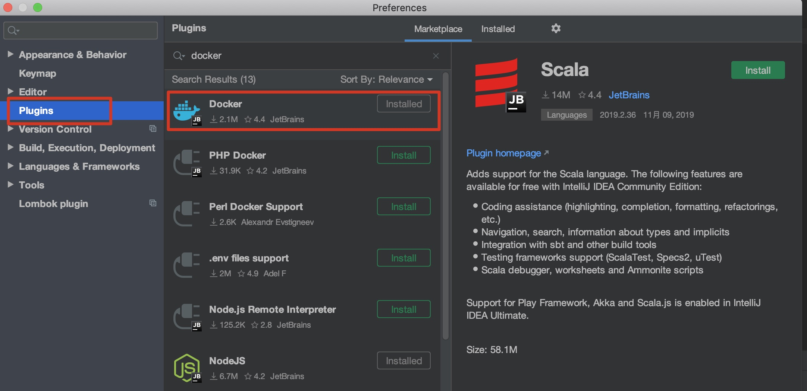
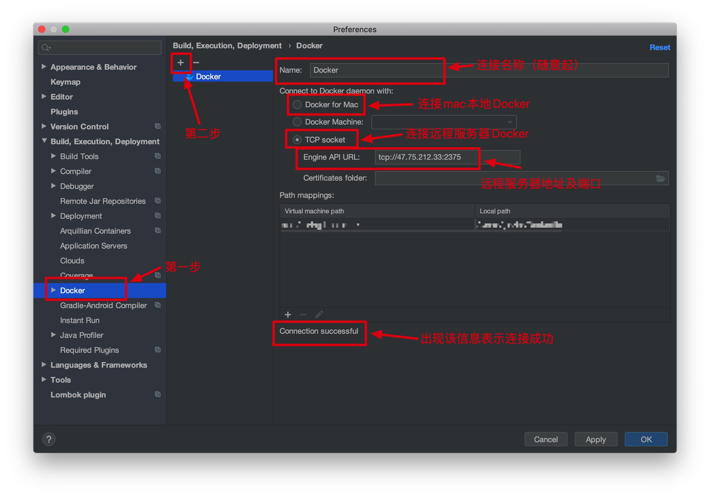
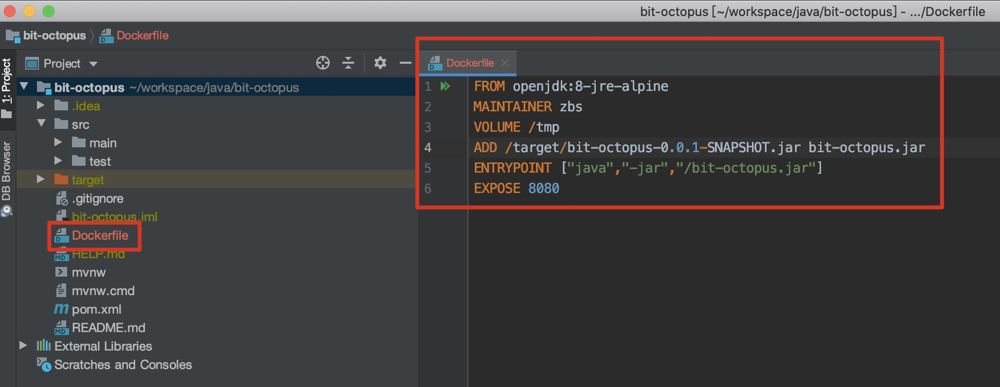
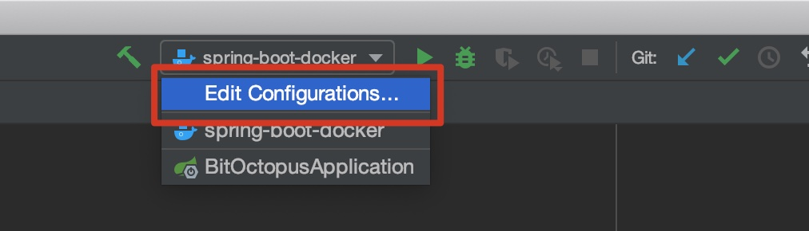
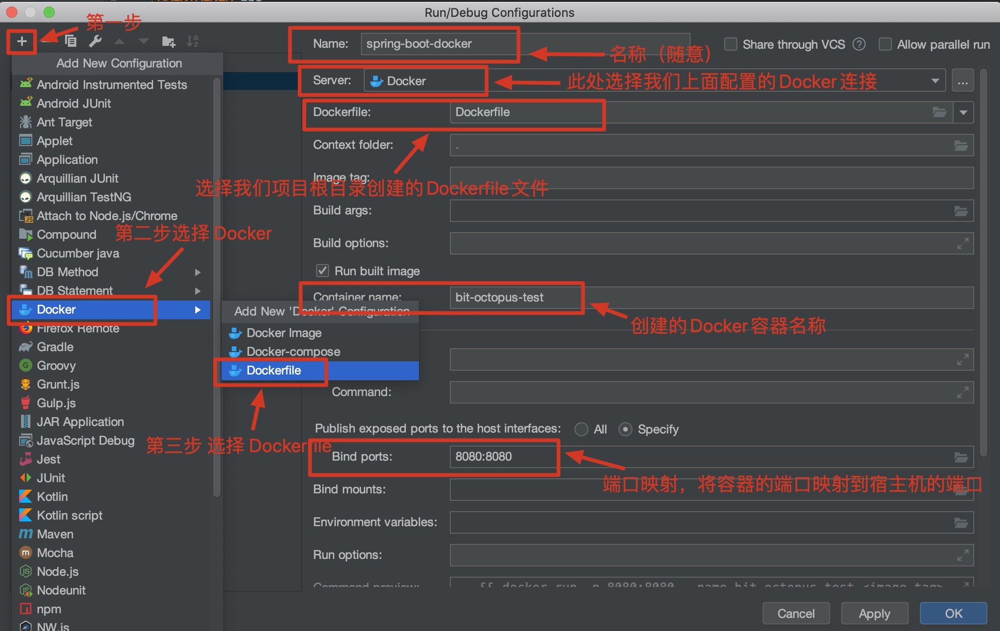
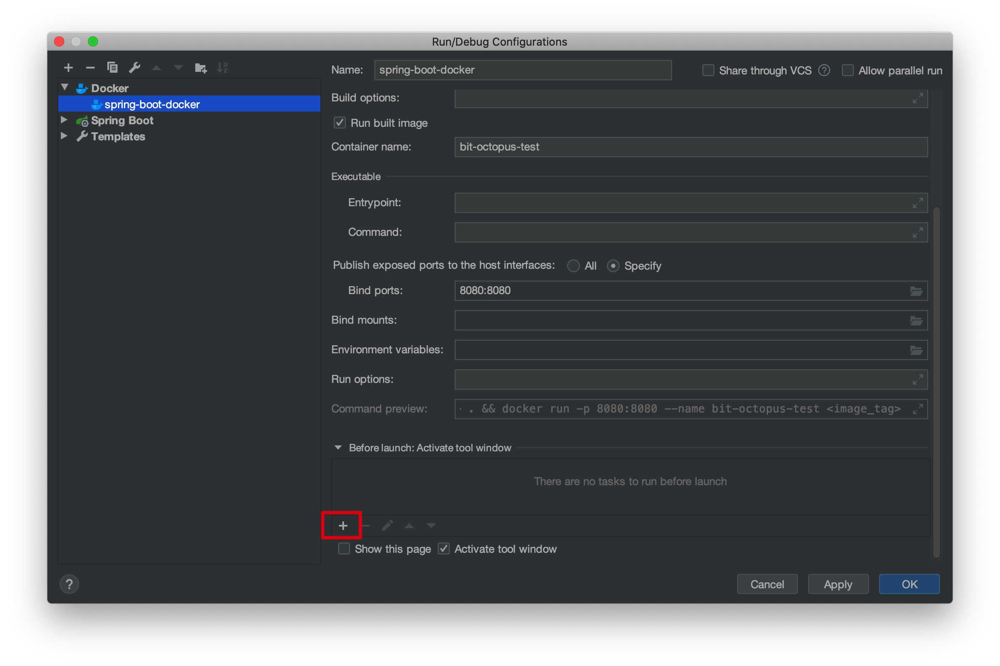
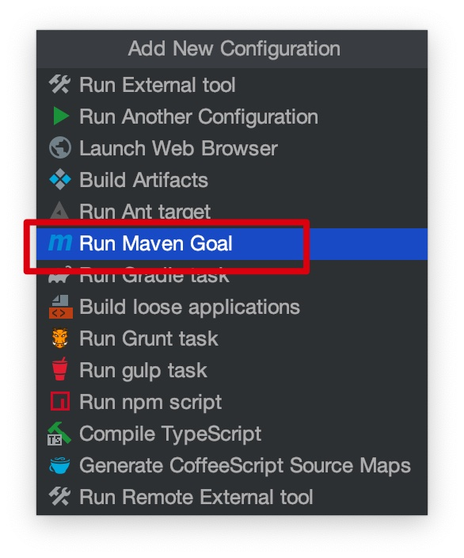
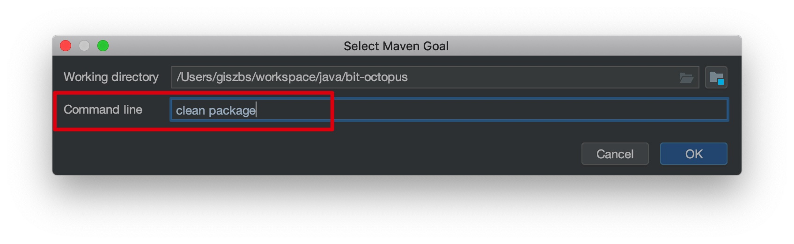

# IDEA 一键部署 Spring Boot 项目到 Docker 上

## Linux 安装 Docker

### 把yum包更新到最新

```shell
$ yum update
```

### 安装需要的软件包 

**注意：如果已经安装过，则跳过**

yum-util 提供yum-config-manager功能，另外两个是devicemapper驱动依赖的

```shell
$ yum install -y yum-utils device-mapper-persistent-data lvm2
```

### 设置yum源

```shell
$ yum-config-manager --add-repo https://download.docker.com/linux/centos/docker-ce.repo
```

### 可以查看所有仓库中所有docker版本，并选择特定版本安装

```shell
$ yum list docker-ce --showduplicates | sort -r
```

### 安装Docker，命令：yum install docker-ce-版本号

```shell
# 指定安装的版本：17.12.1.ce
$ yum install docker-ce-17.12.1.ce

# 安装最新版本
$ yum install docker-ce
```

### 启动Docker

```shell
# 启动 docker
$ systemctl start docker

# 添加到开机启动(如果不需要则不操作)
$ systemctl enable docker
```

### 验证安装是否成功(有client和service两部分表示docker安装启动都成功了)

```shell
$ docker version
```

```shell
# 如果出现下面信息则安装并启动成功
Client:
 Version:    17.12.1-ce
 API version:    1.35
 Go version:    go1.9.4
 Git commit:    7390fc6
 Built:    Tue Feb 27 22:15:20 2018
 OS/Arch:    linux/amd64

Server:
 Engine:
  Version:    17.12.1-ce
  API version:    1.35 (minimum version 1.12)
  Go version:    go1.9.4
  Git commit:    7390fc6
  Built:    Tue Feb 27 22:17:54 2018
  OS/Arch:    linux/amd64
  Experimental:    false
```

### 如果失败，则卸载重新安装

```shell
$ yum remove docker \
             docker-client \
             docker-client-latest \
             docker-common \
             docker-latest \
             docker-latest-logrotate \
             docker-logrotate \
             docker-engine
```

### 配置docker远程连接端口

```shell
$ vim /usr/lib/systemd/system/docker.service
```

找到 `ExecStart` 配置并添加 `-H tcp://0.0.0.0:2375`

```
# 修改下面配置
ExecStart=/usr/bin/dockerd -H fd:// --containerd=/run/containerd/containerd.sock
# 在上面末尾追加 -H tcp://0.0.0.0:2375
ExecStart=/usr/bin/dockerd -H fd:// --containerd=/run/containerd/containerd.sock -H tcp://0.0.0.0:2375
```

### 重新加载docker.server文件并重启docker服务

````shell
$ systemctl daemon-reload
$ systemctl restart docker
````

### 如果防火墙开启了，则需要开放上面配置的端口

```shell
$ firewall-cmd --zone=public --add-port=2375/tcp --permanent
```

## 部署 Spring boot 项目到 Docker

### idea安装Docker插件



### 配置远程连接

1、打开配置



2、编写 `Dockerfile` 文件

在项目根目录创建 `Dockerfile` 文件



`Dockerfile` 文件内容如下

```dockerfile
FROM openjdk:8-jre-alpine
MAINTAINER 作者
VOLUME /挂载点
ADD /target/bit-octopus-0.0.1-SNAPSHOT.jar bit-octopus.jar
ENTRYPOINT ["java","-jar","/bit-octopus.jar"]
EXPOSE docker开放的端口
```

3、添加项目Docker配置, 点击 `Edit Configurations`





编辑好后则出现下面启动


点击右边的启动按钮，则部署项目镜像到docker

4、上面的配置需要自己手动打包项目，如果想自动打包，则需要

打开 `Edit Configurations` 配置








