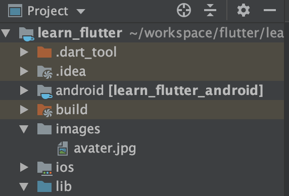
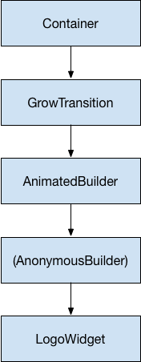

# Flutter 个人学习笔记

## Flutter 基础

### Flutter 项目创建

#### Android Studio 创建

1. 选择 `Android Studio` -> `File` -> `New` -> `New Flutter Project`


2. 选择 `Flutter Application`, 后面下一步下一步即可


#### 命令行创建

```shell
$ flutter create 项目名称
```

### Flutter 运行

#### 创建模拟器

1. 点击 `Android Studio` 工具栏的 `AVD Manager` 或者 菜单栏 `Toools` -> ``AVD Manager``

   

2. 点击 `Create Virtual Device` 创建一个新的安卓模拟器


#### 命令行运行

1. 通过 `Android Studio` 启动一个模拟器

2. 进入项目目录，然后执行下面命令

```shell
$ flutter run
# 注意：如果启动了多个模拟器，则可以使用下面命令指定将项目运行到哪个
$ flutter run -d '模拟器名称'
```

#### Android Studio 运行

1. 通过 `Android Studio` 启动一个模拟器

2. 点击 `Android Studio` 工具栏启动按钮


### 包和插件的使用

1. 打开 Flutter 包管理网站：https://pub.flutter-io.cn/

2. 找到需要引入的插件

3. 在项目的 `pubspec.yaml` 中引入插件

   ```yaml
   dependencies:
     flutter_color_plugin: ^0.0.2
   ```

### StatelessWidget 及其常用子组件

不需要改变状态的（显示后不可改变）组件

#### Container

`Container`是一个组合类容器

#### Icon

字体图标组件

```dart
Icon(Icons.star)
```

#### CloseButton()

关闭按钮

#### BackButton()

返回按钮

#### Chip

是实现下图所示效果的组件


#### Divider

分割线组件，分割线的高度是不可修改的


#### Card

带有圆角、阴影、边框效果的卡片

官方介绍：https://material.io/components/cards/#


#### AlertDialog

弹出框


### StatefulWidget 及其常用子组件

状态可变的组件

#### RefreshIndicator

支持滑动刷新的组件

#### PageView

实现横向左右滚动组件

### 布局组件

#### Container

组合类容器

一个`Container`组件可以实现同时需要装饰、变换、限制的场景

```dart
Container({
  this.alignment,
  this.padding, //容器内补白，属于decoration的装饰范围
  Color color, // 背景色
  Decoration decoration, // 背景装饰
  Decoration foregroundDecoration, //前景装饰
  double width,//容器的宽度
  double height, //容器的高度
  BoxConstraints constraints, //容器大小的限制条件
  this.margin,//容器外补白，不属于decoration的装饰范围
  this.transform, //变换
  this.child,
})
```

#### BoxDecoration

我们通常会直接使用`BoxDecoration`类，它是一个Decoration的子类，实现了常用的装饰元素的绘制。

```dart
BoxDecoration({
  Color color, //颜色
  DecorationImage image,//图片
  BoxBorder border, //边框
  BorderRadiusGeometry borderRadius, //圆角
  List<BoxShadow> boxShadow, //阴影,可以指定多个
  Gradient gradient, //渐变
  BlendMode backgroundBlendMode, //背景混合模式
  BoxShape shape = BoxShape.rectangle, //形状
})
```

#### Opacity

修改透明度组件

#### ClipOvl

将子组件裁剪为圆形的组件

#### ClipRRect

裁剪为方形的组件

#### PhysicalModel

将子组件裁剪为不同形状的组件

#### Align

对其子组件

##### Center

居中显示子组件

#### Padding

内边距组件

#### SizedBox

约束子组件大小的组件

#### FractionallySizedBox

其子组件可以在水平方向或者垂直方向占满屏幕，即限制子组件占多大空间

#### Stack

堆叠显示组件，按照顺序将子组件一个一个堆叠在一起

层叠布局的子组件可以根据距父容器四个角的位置来确定自身的位置。绝对定位允许子组件堆叠起来（按照代码中声明的顺序）

一般和组件 `Positioned` 搭配使用

#### Flex

##### Column

垂直方向布局显示

##### Row

水平方向布局显示

#### Warp

水平防线布局显示，同时可以换行

#### Flow

太复杂，很少用

#### Expanded

继承自 `Flexible` 

子组件强制占满可用空间

#### Flexible

控制子组件（Row、Column、Flex等）如何伸展（占用空间）

子组件最多可以与可用空间一样大（但允许更小）

> `Flexible` 、`Expanded` 必须包含在 `Row、Column、Flex` 子组件内


### 常用组件

#### ListView

线性可滚动列表（水平、垂直）

- `ListView.builder` : ListView会在真正需要的时候去创建子Widget，而不是一开始就全部初始化好

- `ListView.separated` 可以生成列表项之间的分割器，它比 ListView.builder 多了一个 separatorBuilder 参数，该参数是一个分割器生成器

#### ExpansionTile - 可展开列表

```dart
const ExpansionTile({
    Key key,
    this.leading,//标题左侧要展示的widget
    @required this.title,//要展示的标题widget
    this.backgroundColor,//背景
    this.onExpansionChanged,//列表展开收起的回调函数
    this.children = const <Widget>[],//列表展开时显示的widget
    this.trailing,//标题有侧要展示的widget
    this.initiallyExpanded = false,//是否默认状态下展开
  })
```


#### GridView

`GridView`是flutter中用于展示网格布局风格的widget，我们通常使用`GridView.count`构造函数来创建一个`GridView`


#### Divider

上下两边拥有 `padding` 的水平细线

#### InkWell

响应用户点击事件的一个区域

#### Staffold

实现了基本的 `material` 风格的布局结构

此类提供了用于显示 `Drawer` ，`SnackBar` 和 `BottomNavigationBar` 的API

#### PageView

是一个可以完成在页面之间滚动的 `widget`

```dart
PageView({
    Key key,
    this.scrollDirection = Axis.horizontal,	// 滚动方向(垂直或者水平)
    this.reverse = false,	// 是否反向滚动
    PageController controller,	// PageView 的控制类
    this.physics,	// 手势滚动逻辑，支持：不滚动、总是滚动、滚动到边缘是否有bounce
    this.pageSnapping = true,	// 设置为false可以禁止页面捕捉，对自定义滚动行为很有用
    this.onPageChanged,	// 页面切换时的回调
    List<Widget> children = const <Widget>[],
    this.dragStartBehavior = DragStartBehavior.start,
  }) : controller = controller ?? _defaultPageController,
       childrenDelegate = SliverChildListDelegate(children),
       super(key: key);
```

#### Card

`material` 风格的卡片，带有圆角和阴影

`Card` 是用于表示某些相关信息，例如相册，地理位置，膳食，联系方式等。

#### DefaultTabController

没有显式指定后代的 [TabController](https://api.flutter-io.cn/flutter/material/TabController-class.html) 组件

与[TabBar](https://api.flutter-io.cn/flutter/material/TabBar-class.html) 、 [TabBarView](https://api.flutter-io.cn/flutter/material/TabBarView-class.html) 、 [TabController](https://api.flutter-io.cn/flutter/material/TabController-class.html) 配合使用

#### MediaQuery

`MediaQuery.removePadding` 删除组件的 `padding`

**获得当前屏幕的大小**

```dart
MediaQuery.of(content).size
```

#### NotificationListener

监听通知事件的 `Widget`

通常可使用它来监听列表滚动等事件

#### Opacity

控制组件透明度

#### Future

表示在接下来的某个时间的值或错误，借助`Future`我们可以在Flutter实现异步操作

`Future`有两种状态：

- pending - 执行中

- completed - 执行结束，分两种情况要么成功要么失败

**使用`future.then`获取future的值与捕获future的异常**

```dart
import 'dart:async';

Future<String> testFuture() {
//   throw new Error();
  return Future.value('success');
//   return Future.error('error');
}

// 如果catchError与onError同时存在，则会只调用onError；
main() {
  testFuture().then((s) {
    print(s);
  }, onError: (e) {
    print('onError:');
    print(e);
  }).catchError((e) {
    print('catchError:');
    print(e);
  });
}
```

**结合`async` `await`**

```dart
import 'dart:async';

test() async {
  int result = await Future.delayed(Duration(milliseconds: 2000), () {
    return Future.value(123);
  });
  print('t3:' + DateTime.now().toString());
  print(result);
}

main() {
  print('t1:' + DateTime.now().toString());
  test();
  print('t2:' + DateTime.now().toString());
}
```

**future.whenComplete**

有时候我们需要在`Future`结束的时候做些事情，我们知道`then().catchError()`的模式类似于`try-catch`，`try-catch`有个`finally`代码块，而`future.whenComplete`就是`Future`的finally。

```dart
import 'dart:async';
import 'dart:math';

void main() {
  var random = Random();
  Future.delayed(Duration(seconds: 3), () {
    if (random.nextBool()) {
      return 100;
    } else {
      throw 'boom!';
    }
  }).then(print).catchError(print).whenComplete(() {
    print('done!');
  });
}
```

**future.timeout**

为异步操作设置超时时间

```dart
import 'dart:async';

void main() {
  new Future.delayed(new Duration(seconds: 3), () {
    return 1;
  }).timeout(new Duration(seconds: 2)).then(print).catchError(print);
}
```

#### FutureBuilder

`FutureBuilder`是一个将异步操作和异步UI更新结合在一起的类，通过它我们可以将网络请求，数据库读取等的结果更新的页面上。

`FutureBuilder` 的构造方法

```dart
const FutureBuilder({
    Key key,
    this.future,
    this.initialData,
    @required this.builder,
  }) : assert(builder != null),
       super(key: key);
```

- `future`： Future对象表示此构建器当前连接的异步计算；
- `initialData`： 表示一个非空的Future完成前的初始化数据；
- `builder`： `AsyncWidgetBuilder` 类型的回到函数，是一个基于异步交互构建 `widget` 的函数；

这个`builder`函数接受两个参数`BuildContext context` 与 `AsyncSnapshot snapshot`，它返回一个widget。`AsyncSnapshot`包含异步计算的信息，它具有以下属性：

`connectionState` - 枚举ConnectionState的值，表示与异步计算的连接状态，ConnectionState有四个值：none，waiting，active和done；
`data` - 异步计算接收的最新数据；
`error` - 异步计算接收的最新错误对象；

AsyncSnapshot还具有`hasData`和`hasError`属性，以分别检查它是否包含非空数据值或错误值。

```dart
import 'dart:convert';

import 'package:flutter/material.dart';
import 'package:http/http.dart' as http;

void main() => runApp(new MyApp());

class MyApp extends StatefulWidget {
  @override
  State<StatefulWidget> createState() => _MyAppState();
}

class _MyAppState extends State<MyApp> {
  String showResult = '';

  Future<CommonModel> fetchPost() async {
    final response = await http
        .get('http://www.devio.org/io/flutter_app/json/test_common_model.json');
    Utf8Decoder utf8decoder = Utf8Decoder(); //fix 中文乱码
    var result = json.decode(utf8decoder.convert(response.bodyBytes));
    return CommonModel.fromJson(result);
  }

  @override
  Widget build(BuildContext context) {
    return MaterialApp(
      home: Scaffold(
        appBar: AppBar(
          title: Text('Future与FutureBuilder实用技巧'),
        ),
        body: FutureBuilder<CommonModel>(
            future: fetchPost(),
            builder:
                (BuildContext context, AsyncSnapshot<CommonModel> snapshot) {
              switch (snapshot.connectionState) {
                case ConnectionState.none:
                  return new Text('Input a URL to start');
                case ConnectionState.waiting:
                  return new Center(child: new CircularProgressIndicator());
                case ConnectionState.active:
                  return new Text('');
                case ConnectionState.done:
                  if (snapshot.hasError) {
                    return new Text(
                      '${snapshot.error}',
                      style: TextStyle(color: Colors.red),
                    );
                  } else {
                    return new Column(children: <Widget>[
                      Text('icon:${snapshot.data.icon}'),
                      Text('statusBarColor:${snapshot.data.statusBarColor}'),
                      Text('title:${snapshot.data.title}'),
                      Text('url:${snapshot.data.url}')
                    ]);
                  }
              }
            }),
      ),
    );
  }
}

class CommonModel {
  final String icon;
  final String title;
  final String url;
  final String statusBarColor;
  final bool hideAppBar;

  CommonModel(
      {this.icon, this.title, this.url, this.statusBarColor, this.hideAppBar});

  factory CommonModel.fromJson(Map<String, dynamic> json) {
    return CommonModel(
      icon: json['icon'],
      title: json['title'],
      url: json['url'],
      statusBarColor: json['statusBarColor'],
      hideAppBar: json['hideAppBar'],
    );
  }
}
```

#### RefreshIndicator

下拉刷新的widget，通过它我们可以实现 `Widget` 的下拉刷新

上拉加载更多需要借助 `ScrollController`，列表支持设置`controller`参数，通过`ScrollController`监听列表滚动的位置，来实现加载更多的功能

```dart
ScrollController _scrollController = ScrollController();

@override
void initState() {
  _scrollController.addListener(() {
    // 如果滚动到了底部
    if (_scrollController.position.pixels ==
        _scrollController.position.maxScrollExtent) {
      _loadData();
    }
  });

  super.initState();
}
```

> 注意: 刷新图标将会从其 `child` 上面划出

#### SafeArea

使其子 `Widget` 可以在安全的区域完全显示出来，即不被手机的刘海等区域遮挡住

#### CircleAvatar

圆形的 `Widget` ，通常与用来显示用户头像

#### RichText

一段文本使用不同的样式 

#### LimitedBox

限制子组件最大宽度和最大高度

#### ProgressIndicator

进度指示器

#### AspectRatio

创建固定纵横比的组件，设定好纵横比后，他将尽量适应宽度，然后感觉宽度在按照纵横比适应高度


### 路由和导航

1. 在 `MaterialApp` 的 `routes` 属性注册路由

   ```dart
   @override
   Widget build(BuildContext context) {
     return MaterialApp(
       title: "页面跳转 - 路由和导航",
       home: _HomePage(),
       // 注册路由
       routes: <String, WidgetBuilder>{
         "image_d": (BuildContext context) => ImageDemo(),
         "list_view": (BuildContext context) => ListViewDemo(),
       },
     );
   }
   ```

2. 使用路由名称跳转

   ```dart
   Navigator.pushNamed(context, "image_d");
   ```

3. 使用具体类跳转

   ```dart
   Navigator.push(context, MaterialPageRoute(builder: (context) => ImageDemo()));
   ```

4. 返回

   ```dart
   GestureDetector(
     onTap: (){
     	Navigator.pop(context);
     },
     child: Icon(Icons.arrow_back_ios),
   )
   ```

#### 顶部导航 - Tab

```dart
import 'package:flutter/material.dart';

/// 顶部 tab 导航栏
main() => runApp(MyApp());

class MyApp extends StatelessWidget {
  @override
  Widget build(BuildContext context) {
    return MaterialApp(
      home: DefaultTabController(
        length: choices.length,
        child: Scaffold(
          appBar: AppBar(
            title: Text('Tab 导航'),
            bottom: TabBar(
              isScrollable: true,
              tabs: choices.map((Choice choice) {
                return Tab(
                  text: choice.title,
                  icon: Icon(choice.icon),
                );
              }).toList(),
            ),
          ),
          body: TabBarView(
              children: choices.map((Choice choice) {
            return Padding(
              padding: EdgeInsets.all(16),
              child: ChoiceCard(child: choice),
            );
          }).toList()),
        ),
      ),
    );
  }
}

/// 定制每个tab页签显示的内容
class ChoiceCard extends StatelessWidget {
  final Choice child;

  ChoiceCard({this.child});

  @override
  Widget build(BuildContext context) {
    TextStyle textStyle = Theme.of(context).textTheme.display1;

    return Card(
      child: Center(
        child: Column(
          mainAxisSize: MainAxisSize.min,
          crossAxisAlignment: CrossAxisAlignment.center,
          children: <Widget>[
            Icon(
              child.icon,
              size: 150,
              color: textStyle.color,
            ),
            Text(
              child.title,
              style: textStyle,
            ),
          ],
        ),
      ),
    );
  }
}

/// 构建需要显示的tab内容
class Choice {
  const Choice({this.title, this.icon});

  final String title;
  final IconData icon;
}

const List<Choice> choices = <Choice>[
  const Choice(title: 'CAR', icon: Icons.directions_car),
  const Choice(title: 'BICYCLE', icon: Icons.directions_bike),
  const Choice(title: 'BOAT', icon: Icons.directions_boat),
  const Choice(title: 'BUS', icon: Icons.directions_bus),
  const Choice(title: 'TRAIN', icon: Icons.directions_transit),
  const Choice(title: 'WALK', icon: Icons.directions_walk)
];
```

#### 底部导航栏

```dart
import 'package:flutter/material.dart';

/// 底部导航
main() => runApp(MyApp());

class MyApp extends StatefulWidget {
  @override
  _MyAppState createState() => _MyAppState();
}

class _MyAppState extends State<MyApp> {
  PageController _pageController;
  int _currentIndex = 0;
  Color _bottomDefaultColor = Colors.grey;
  Color _bottomActiveColor = Colors.lightBlue;

  @override
  void initState() {
    super.initState();

    _pageController = PageController();
  }

  @override
  void dispose() {
    super.dispose();
    _pageController.dispose();
  }

  @override
  Widget build(BuildContext context) {
    return MaterialApp(
      title: '底部导航demo',
      home: Scaffold(
        appBar: AppBar(
          title: Text('底部导航demo'),
        ),
        body: PageView(
          controller: _pageController,
          children: <Widget>[
            _HomePage(),
            _SearchPage(),
            _TravelPage(),
            _MyPage(),
          ],
          physics: NeverScrollableScrollPhysics(),
        ),
        bottomNavigationBar: BottomNavigationBar(
          currentIndex: _currentIndex,
          onTap: (index) {
            // 跳转页面没有动画效果
//            _pageController.jumpToPage(index);
            // 带动画的页面跳转（从左右两边进入）
            _pageController.animateToPage(
              index,
              duration: Duration(milliseconds: 500),
              curve: Curves.easeIn,
            );
            setState(() {
              _currentIndex = index;
            });
          },
          type: BottomNavigationBarType.fixed,
          items: [
            BottomNavigationBarItem(
              icon: Icon(
                Icons.home,
                color: _bottomDefaultColor,
              ),
              activeIcon: Icon(
                Icons.home,
                color: _bottomActiveColor,
              ),
              title: Text('首页'),
            ),
            BottomNavigationBarItem(
              icon: Icon(
                Icons.search,
                color: _bottomDefaultColor,
              ),
              activeIcon: Icon(
                Icons.search,
                color: _bottomActiveColor,
              ),
              title: Text('搜索'),
            ),
            BottomNavigationBarItem(
              icon: Icon(
                Icons.camera_alt,
                color: _bottomDefaultColor,
              ),
              activeIcon: Icon(
                Icons.camera_alt,
                color: _bottomActiveColor,
              ),
              title: Text('旅拍'),
            ),
            BottomNavigationBarItem(
              icon: Icon(
                Icons.account_circle,
                color: _bottomDefaultColor,
              ),
              activeIcon: Icon(
                Icons.account_circle,
                color: _bottomActiveColor,
              ),
              title: Text('我的'),
            ),
          ],
        ),
      ),
    );
  }
}

class _MyPage extends StatelessWidget {
  @override
  Widget build(BuildContext context) {
    return Center(child: Text('我的'));
  }
}

class _TravelPage extends StatelessWidget {
  @override
  Widget build(BuildContext context) {
    return Center(child: Text('旅拍'));
  }
}

class _SearchPage extends StatelessWidget {
  @override
  Widget build(BuildContext context) {
    return Center(child: Text('搜索'));
  }
}

class _HomePage extends StatelessWidget {
  @override
  Widget build(BuildContext context) {
    return Center(child: Text('首页'));
  }
}
```

#### 侧边栏菜单

```dart
import 'package:flutter/material.dart';

main() => runApp(MyApp());

class MyApp extends StatelessWidget {
  final appTitle = '侧边栏Demo';

  @override
  Widget build(BuildContext context) {
    return MaterialApp(
      title: appTitle,
      home: _HomePage(appTitle: appTitle),
    );
  }
}

class _HomePage extends StatelessWidget {
  final String appTitle;

  _HomePage({this.appTitle});

  @override
  Widget build(BuildContext context) {
    return Scaffold(
      appBar: AppBar(
        title: Text(appTitle),
      ),
      drawer: Drawer(
        child: ListView(
          padding: EdgeInsets.zero,
          children: <Widget>[
            DrawerHeader(
              child: Text(
                '侧边栏头部',
                style: TextStyle(fontSize: 24, color: Colors.white),
              ),
              decoration: BoxDecoration(color: Colors.blue),
            ),
            ListTile(
              title: Text('列表1'),
              onTap: () {
                Navigator.pop(context);
              },
            ),
            ListTile(
              title: Text('列表2'),
              onTap: () {
                Navigator.pop(context);
              },
            ),
          ],
        ),
      ),
    );
  }
}
```

### 手势及点击事件

#### GestureDetector

手势监听组件，我们通过它可以来识别各种手势

下面列出几个主要的手势监听函数：

```dart
this.onTap,	// 点击
this.onTapCancel,	// 点击取消
this.onDoubleTap,	// 双击
this.onLongPress,	// 长按
this.onVerticalDragUpdate,	// 垂直方向拖动时
this.onHorizontalDragUpdate,	// 水平方向拖动时
this.onPanDown,	// 手指按下
this.onPanUpdate,	// 手指滑动时
this.onScaleUpdate,	// 手指缩放时
```

### 导入和使用Flutter资源文件

在项目根目录新建 `images` 文件夹，将要使用的图片拷贝进去



在 `pubspec.yaml` 文件中配置资源文件路径


使用资源文件

```dart
AssetImage('images/avater.jpg')
```

### 打开第三方APP

使用 `url_launcher` 包: https://pub.flutter-io.cn/packages/url_launcher

```dart
/// 打开默认浏览器
_openUrl() async {
  const url = 'https://www.baidu.com/';
  if (await canLaunch(url)) {
    await launch(url);
  } else {
    throw 'Could not launch $url';
  }
}

/// 打开地图app
_openMap() async {
  const url = "geo:22.33,444.343";
  if (await canLaunch(url)) {
    await launch(url);
  } else {
    throw 'Could not launch $url';
  }
}
```

打开第三方 `app` 需要该 `app` 的 `scheme`, `scheme` 由app的开发者提供

### Flutter页面生命周期

#### State中有两个常用属性：

1. `widget`，它表示与该State实例关联的widget实例，由Flutter framework动态设置。注意，这种关联并非永久的，因为在应用声明周期中，UI树上的某一个节点的widget实例在重新构建时可能会变化，但State实例只会在第一次插入到树中时被创建，当在重新构建时，如果widget被修改了，Flutter framework会动态设置State.widget为新的widget实例。

2. `context`。StatefulWidget对应的BuildContext，作用同StatelessWidget的BuildContext。

#### StatefulWidget 生命周期

- `initState()`：当Widget第一次插入到Widget树时会被调用，对于每一个State对象，Flutter framework只会调用一次该回调，所以，通常在该回调中做一些一次性的操作，如状态初始化、订阅子树的事件通知等
- `didChangeDependencies()`：当 `State` 对象的依赖发生变化时会被调用；典型的场景是当系统语言Locale或应用主题改变时，`Flutter framework` 会通知 `widget` 调用此回调。
- `build()`：主要是用于构建 `Widget` 子树的，会在如下场景被调用：
  1. 在调用`initState()`之后。
  2. 在调用`didUpdateWidget()`之后。
  3. 在调用`setState()`之后。
  4. 在调用`didChangeDependencies()`之后。
  5. 在 `State` 对象从树中一个位置移除后（会调用deactivate）又重新插入到树的其它位置之后。
- `reassemble()`：此回调是专门为了开发调试而提供的，在热重载(hot reload)时会被调用，此回调在Release模式下永远不会被调用。
- `didUpdateWidget()`：在 `widget` 重新构建时，Flutter framework会调用`Widget.canUpdate`来检测Widget树中同一位置的新旧节点，然后决定是否需要更新，如果`Widget.canUpdate`返回`true`则会调用此回调
- `deactivate()`：当 `State` 对象从树中被移除时，会调用此回调
- `dispose()`：当 `State` 对象从树中被永久移除时调用；通常在此回调中释放资源


### Flutter App 生命周期

`WidgetsBindingObserver`：是一个 `Widgets` 绑定观察器，通过它我们可以监听应用的生命周期、语言等的变化

```dart
/// 1. 使用 with 使用 WidgetsBindingObserver 的功能继承过来
/// 2. 在 initState 方法中将当前类添加到 WidgetsBindingObserver 以被观察
/// 3. 重写 WidgetsBindingObserver 的 didChangeAppLifecycleState 方法
class _AppLifecycleState extends State<AppLifecycle> with WidgetsBindingObserver {
  @override
  Widget build(BuildContext context) {
    return MaterialApp(
      title: "App 生命周期",
      home: Scaffold(
        appBar: AppBar(
          title: Text('APP 生命周期'),
        ),
        body: Container(
          child: Text('App 生命周期'),
        ),
      ),
    );
  }

  @override
  void initState() {
    WidgetsBinding.instance.addObserver(this);
    super.initState();
  }

  @override
  void didChangeAppLifecycleState(AppLifecycleState state) {
    if (state == AppLifecycleState.paused) {
      print('App 进入后台');
    } else if (state == AppLifecycleState.resumed) {
      print('App 进入前台');
    } else if (state == AppLifecycleState.detached) {
      //不常用：应用程序被挂起时调用，它不会在iOS上触发
    } else if (state == AppLifecycleState.inactive) {
      //不常用：应用程序处于非活动状态，并且未接收用户输入时调用，比如：来了个电话
    }
  }

  @override
  void dispose() {
    WidgetsBinding.instance.removeObserver(this);
    super.dispose();
  }
}
```

### 动态修改App主题

```dart
class _ThemeDemoState extends State<ThemeDemo> {
  Brightness _brightness = Brightness.light;

  @override
  Widget build(BuildContext context) {
    return MaterialApp(
      title: '动态修改主题',
      theme: ThemeData(
          primarySwatch: Colors.blue,
          brightness: _brightness // 日间或夜间模式
        ),
      home: Scaffold(
        appBar: AppBar(
          title: Text('动态修改主题'),
        ),
        body: Center(
          child: RaisedButton(
            child: Text('切换主题'),
            onPressed: () {
              setState(() {
                _brightness = _brightness == Brightness.light
                    ? Brightness.dark
                    : Brightness.light;
              });
            },
          ),
        ),
      ),
    );
  }
}
```

### 自定义字体

1. 将字体文件（ttf）添加到项目中

   

2. 在 `pubspec.yaml` 中配置字体文件

   ```yaml
   fonts:
     - family: HYDianHeiW
       fonts:
         - asset: fonts/HYDianHeiW.ttf
   ```

3. 使用

   ```dart
   // 全局使用
   MaterialApp(
     title: '动态修改主题',
     theme: ThemeData(
       fontFamily: 'HYDianHeiW',
       primarySwatch: Colors.blue,
   	),
   	home: Center(
     	child: Text('自定义字体', style: TextStyle(fontFamily: 'HYDianHeiW'),),
     )
   )
   ```

### 自定义字体图标

可以使用自定义字体图标。在`Flutter`中，我们使用`ttf`格式字体文件。

使用自定义字体图标：

1. 导入字体图标文件；假设我们的字体图标文件保存在项目根目录下，路径为"fonts/iconfont.ttf"：

   ```yaml
   fonts:
     - family: myIcon  #指定一个字体名
       fonts:
         - asset: fonts/iconfont.ttf
   ```

2. 定义一个`MyIcons`类，功能和`Icons`类一样：将字体文件中的所有图标都定义成静态变量：

   ```dart
   class MyIcons{
     // book 图标
     static const IconData book = const IconData(
         0xe614, 
         fontFamily: 'myIcon', 
         matchTextDirection: true
     );
     // 微信图标
     static const IconData wechat = const IconData(
         0xec7d,  
         fontFamily: 'myIcon', 
         matchTextDirection: true
     );
   }
   ```

3. 使用

   ```dart
   Row(
     mainAxisAlignment: MainAxisAlignment.center,
     children: <Widget>[
       Icon(MyIcons.book,color: Colors.purple,),
       Icon(MyIcons.wechat,color: Colors.green,),
     ],
   )
   ```

### 图片控件 - Image

`Image widget` 是 `Flutter` 中一个用来展示图片的 `widget`

**`Image` 支持如下几种类型的构造函数：**

- `new Image` - 用于从ImageProvider获取图像；

- `new Image.asset` - 使用key从AssetBundle获得的图像；

- `new Image.network` - 从网络URL中获取图片；

- `new Image.file` - 从本地文件中获取图片；

- `new Image.memory` - 用于从Uint8List获取图像；

#### Image支持的图片格式

Image 支持以下类型的图片：JPEG, PNG, GIF, Animated GIF, WebP, Animated WebP, BMP, 和 WBMP。

#### 加载网络图片

要加载网络图片，我们需要使用`Image.network`构造方法：

```dart
Image.network(
  'http://www.devio.org/img/avatar.png',
)
```

> demo:

```
import 'package:flutter/material.dart';

void main() => runApp(new MyApp());

class MyApp extends StatelessWidget {
  @override
  Widget build(BuildContext context) {
    return new MaterialApp(
      title: 'Flutter bottomNavigationBar',
      theme: new ThemeData.fallback(),
      home: Image.network(
        'http://www.devio.org/img/avatar.png',
      ),
    );
  }
}
```

#### 加载静态图片及处理不同分辨率图片

要加载项目中的静态图片，需要两步：

- 在 `pubspec.yaml` 文件中声明图片资源的路径；
- 使用`AssetImage`访问图片；

`pubspec.yaml` 声明图片路径：

```yaml
assets:
 - images/my_icon.png
```

使用`AssetImage`访问图片图片：

```dart
Image(
  height: 26,
  width: 26,
  image: AssetImage(my_icon.png),
),
```

除了我们使用Image的构造方法手动指定AssetImage之外，还可通过`Image.asset`来加载静态图片：

```dart
Image.asset(my_icon.png,
	width: 26,
	height: 26,
)
```

两者是等效的。

#### 加载本地图片

##### 加载完整路径的本地图片

```dart
import 'dart:io';
Image.file(File('/sdcard/Download/Stack.png')),
```

##### 加载相对路径的本地图片

> 第一步：

在 `pubspec.yaml` 中添加 [path_provider](https://pub.dartlang.org/packages/path_provider) 插件；

> 第二步：导入头文件

```dart
import 'dart:io';
import 'package:path_provider/path_provider.dart';

//Image.file(File('/sdcard/Download/Stack.png')),
FutureBuilder(future: _getLocalFile("Download/Stack.png"),
  builder:  (BuildContext context, AsyncSnapshot<File> snapshot) {
    return snapshot.data != null ? Image.file(snapshot.data) : Container();
  })
)
//获取SDCard的路径：
Future<File> _getLocalFile(String filename) async {
  String dir = (await getExternalStorageDirectory()).path;
  File f = new File('$dir/$filename');
  return f;
}
```

#### 设置placeholder

我们需要借助[FadeInImage](https://docs.flutter.io/flutter/widgets/FadeInImage-class.html)，它能够从内存，本地资源中加载placeholder。

##### 从内存中加载placeholder

> 第一步：

安装[transparent_image](https://pub.dartlang.org/packages/transparent_image)插件。

> 第二步：

```dart
import 'package:flutter/material.dart';
import 'package:transparent_image/transparent_image.dart';

void main() {
  runApp(MyApp());
}

class MyApp extends StatelessWidget {
  @override
  Widget build(BuildContext context) {
    final title = 'Fade in images';

    return MaterialApp(
      title: title,
      home: Scaffold(
        appBar: AppBar(
          title: Text(title),
        ),
        body: Stack(
          children: <Widget>[
            Center(child: CircularProgressIndicator()),
            Center(
              child: FadeInImage.memoryNetwork(
                placeholder: kTransparentImage,
                image: 'http://www.devio.org/img/avatar.png',
              ),
            ),
          ],
        ),
      ),
    );
  }
}
```

##### 从本地资源中加载placeholder

> 第一步

配置本地资源图片：

```yaml
flutter:
  assets:
    - assets/loading.gif
```

> 第二步

加载本地资源图片作为placeholder：

```dart
FadeInImage.assetNetwork(
  placeholder: 'assets/loading.gif',
  image: 'http://www.devio.org/img/avatar.png',
);
```

#### 图片缓存

在Flutter中我们可以借助[cached_network_image](https://pub.dartlang.org/packages/cached_network_image)插件，来从网络上加载图片，并且将其缓存到本地，以供下次使用。

```dart
import 'package:flutter/material.dart';
import 'package:cached_network_image/cached_network_image.dart';

void main() {
  runApp(MyApp());
}

class MyApp extends StatelessWidget {
  @override
  Widget build(BuildContext context) {
    final title = 'Cached Images';

    return MaterialApp(
      title: title,
      home: Scaffold(
        appBar: AppBar(
          title: Text(title),
        ),
        body: Center(
          child: CachedNetworkImage(
            placeholder: (context, url) => new CircularProgressIndicator(),
            imageUrl:
                'https://picsum.photos/250?image=9',
          ),
        ),
      ),
    );
  }
}
```

#### 加载Icon

在Flutter中我们可以借助 [Icon组件](https://docs.flutter.io/flutter/widgets/Icon-class.html) 来加载icon：

```dart
const Icon(this.icon//IconDate, {
   Key key,
   this.size,//大小
   this.color,//颜色
   this.semanticLabel,//标志位
   this.textDirection,//绘制方向，一般使用不到
 })
```

#### 使用Icons

通过如下代码我们可以使用Flutter内置的[material_fonts](https://design.google.com/icons/)：

```dart
import 'package:flutter/material.dart';

void main() {
  runApp(new MaterialApp(home: new MyApp()));
}

class MyApp extends StatelessWidget {
  @override
  Widget build(BuildContext context) {
    // TODO: implement build
    return new Scaffold(
      appBar: new AppBar(
        title: new Text("Icons"),
      ),
      body: new Center(
        child: new Icon(Icons.android,size: 100.0),
      ),
        );
  }
}
```

#### 使用自定义的Icon

使用自定义的我们需要构造一个：

```dart
const IconData(
  this.codePoint,//必填参数，fonticon对应的16进制Unicode
  this.fontFamily,//字体库系列
  this.fontPackage,//字体在那个包中，不填仅在自己程序包中查找
  this.matchTextDirection: false,图标是否按照图标绘制方向显示
});
```

首先我我们需要向使用字体一样，在pubspec.yaml中配置我们的icon：

```yaml
fonts:
	- family: devio
	  fonts:
	    - asset: fonts/devio.ttf
```

接下来就可以使用了：

```dart
child: new Icon(new IconData(0xf5566,fontFamily: "devio"),size: 100.0,color: Colors.blueAccent,)
```

### 动画Animation开发指南

#### 在Flutter中有哪些类型的动画？

在Flutter中动画分为两类：基于tween或基于物理的。

> 推荐大家查阅我们上面课程中所讲到的Flutter gallery中的示例代码来学习动画。

- 补间(Tween)动画：在补间动画中，定义了开始点和结束点、时间线以及定义转换时间和速度的曲线。然后由框架计算如何从开始点过渡到结束点。
- 基于物理的动画：在基于物理的动画中，运动被模拟为与真实世界的行为相似。例如，当你掷球时，它在何处落地，取决于抛球速度有多快、球有多重、距离地面有多远。 类似地，将连接在弹簧上的球落下（并弹起）与连接到绳子上的球放下的方式也是不同。

#### 如何使用动画库中的基础类给widget添加动画？

在为widget添加动画之前，先让我们认识下动画的几个朋友：

- [Animation](https://docs.flutter.io/flutter/animation/Animation-class.html)：是Flutter动画库中的一个核心类，它生成指导动画的值；

- [CurvedAnimation](https://docs.flutter.io/flutter/animation/CurvedAnimation-class.html)：Animation的一个子类，将过程抽象为一个非线性曲线；

- [AnimationController](https://docs.flutter.io/flutter/animation/AnimationController-class.html)：Animation的一个子类，用来管理Animation；

- [Tween](https://docs.flutter.io/flutter/animation/Tween-class.html)：在正在执行动画的对象所使用的数据范围之间生成值。例如，Tween可生成从红到蓝之间的色值，或者从0到255；

##### Animation

- 在Flutter中，Animation对象本身和UI渲染没有任何关系。Animation是一个抽象类，它拥有其当前值和状态（完成或停止）。其中一个比较常用的Animation类是`Animation`。

- **Flutter中的Animation对象是一个在一段时间内依次生成一个区间之间值的类**。Animation对象的输出可以是线性的、曲线的、一个步进函数或者任何其他可以设计的映射。 根据Animation对象的控制方式，动画可以反向运行，甚至可以在中间切换方向。

- - Animation还可以生成除double之外的其他类型值，如：`Animation` 或 `Animation`；
  - Animation对象有状态。可以通过访问其value属性获取动画的当前值；
  - Animation对象本身和UI渲染没有任何关系；

##### CurvedAnimation

- CurvedAnimation将动画过程定义为一个非线性曲线。

- ```dart
  final CurvedAnimation curve =
      new CurvedAnimation(parent: controller, curve: Curves.easeIn);
  ```

- > 注: [Curves](https://docs.flutter.io/flutter/animation/Curves-class.html) 类定义了许多常用的曲线，也可以创建自己的，例如：

- ```dart
  class ShakeCurve extends Curve {
    @override
    double transform(double t) {
      return math.sin(t * math.PI * 2);
    }
  }
  ```

##### AnimationController

- `AnimationController`是一个特殊的`Animation`对象，在屏幕刷新的每一帧，就会生成一个新的值。默认情况下，`AnimationController`在给定的时间段内会线性的生成从0.0到1.0的数字。 例如，下面代码创建一个Animation对象：

- ```dart
  final AnimationController controller = new AnimationController(
      duration: const Duration(milliseconds: 2000), vsync: this);
  ```

- AnimationController派生自`Animation`，因此可以在需要Animation对象的任何地方使用。 但是，`AnimationController`具有控制动画的其他方法：

- - `forward()`：启动动画；
  - `reverse({double from})`：倒放动画；
  - `reset()`：重置动画，将其设置到动画的开始位置；
  - `stop({ bool canceled = true })`：停止动画；

- 当创建一个AnimationController时，需要传递一个vsync参数，存在vsync时会防止屏幕外动画消耗不必要的资源，可以将stateful对象作为vsync的值。

- > 注意： 在某些情况下，值(position，值动画的当前值)可能会超出AnimationController的0.0-1.0的范围。例如，fling()函数允许您提供速度(velocity)、力量(force)、position(通过Force对象)。位置(position)可以是任何东西，因此可以在0.0到1.0范围之外。 CurvedAnimation生成的值也可以超出0.0到1.0的范围。根据选择的曲线，CurvedAnimation的输出可以具有比输入更大的范围。例如，Curves.elasticIn等弹性曲线会生成大于或小于默认范围的值。

##### Tween

- 默认情况下，AnimationController对象的范围从0.0到1.0。如果您需要不同的范围或不同的数据类型，则可以使用Tween来配置动画以生成不同的范围或数据类型的值。例如，以下示例，Tween生成从-200.0到0.0的值：

- ```dart
  final Tween doubleTween = new Tween<double>(begin: -200.0, end: 0.0);
  ```

- Tween是一个无状态(stateless)对象，需要begin和end值。Tween的唯一职责就是定义从输入范围到输出范围的映射。输入范围通常为0.0到1.0，但这不是必须的。

- Tween继承自`Animatable`，而不是继承自`Animation`。Animatable与Animation相似，不是必须输出double值。例如，ColorTween指定两种颜色之间的过渡。

- ```dart
  final Tween colorTween =
      new ColorTween(begin: Colors.transparent, end: Colors.black54);
  ```

- Tween对象不存储任何状态。相反，它提供了`evaluate(Animation animation)`方法将映射函数应用于动画当前值。 Animation对象的当前值可以通过`value()`方法取到。evaluate函数还执行一些其它处理，例如分别确保在动画值为0.0和1.0时返回开始和结束状态。

##### Tween.animate

- 要使用Tween对象，可调用它的`animate()`方法，传入一个控制器对象。例如，以下代码在500毫秒内生成从0到255的整数值。

- ```dart
  final AnimationController controller = new AnimationController(
      duration: const Duration(milliseconds: 500), vsync: this);
  Animation<int> alpha = new IntTween(begin: 0, end: 255).animate(controller);
  ```

- 注意`animate()`返回的是一个Animation，而不是一个Animatable。

- 以下示例构建了一个控制器、一条曲线和一个Tween：

- ```dart
  final AnimationController controller = new AnimationController(
      duration: const Duration(milliseconds: 500), vsync: this);
  final Animation curve =
      new CurvedAnimation(parent: controller, curve: Curves.easeOut);
  Animation<int> alpha = new IntTween(begin: 0, end: 255).animate(curve);
  ```

##### 为widget添加动画


在下面的实例中我们为一个logo添加了一个从小放大的动画

```dart
import 'package:flutter/animation.dart';
import 'package:flutter/material.dart';

void main() => runApp(LogoApp());

class LogoApp extends StatefulWidget {
  _LogoAppState createState() => _LogoAppState();
}

class _LogoAppState extends State<LogoApp> with SingleTickerProviderStateMixin {
  Animation<double> animation;
  AnimationController controller;
  AnimationStatus animationState;
  double animationValue;

  @override
  void initState() {
    super.initState();
    controller =
        AnimationController(duration: const Duration(seconds: 2), vsync: this);
    // #docregion addListener
    animation = Tween<double>(begin: 0, end: 300).animate(controller)
      ..addListener(() {
        // #enddocregion addListener
        setState(() {
          animationValue = animation.value;
        });
        // #docregion addListener
      })
      ..addStatusListener((AnimationStatus state) {
        setState(() {
          animationState = state;
        });
      });
    // #enddocregion addListener
  }

  @override
  Widget build(BuildContext context) {
    return Container(
      margin: EdgeInsets.only(top: 50),
      child: Column(
        children: <Widget>[
          GestureDetector(
            onTap: () {
              controller.reset();
              controller.forward();
            },
            child: Text('Start', textDirection: TextDirection.ltr),
          ),
          Text('State:' + animationState.toString(),
              textDirection: TextDirection.ltr),
          Text('Value:' + animationValue.toString(),
              textDirection: TextDirection.ltr),
          Container(
            height: animation.value,
            width: animation.value,
            child: FlutterLogo(),
          ),
        ],
      ),
    );
  }

  @override
  void dispose() {
    controller.dispose();
    super.dispose();
  }
}
```

#### 为动画添加监听器

有时我们需要知道动画执行的进度和状态，在Flutter中我们可以通过Animation的`addListener`与`addStatusListener`方法为动画添加监听器：

- `addListener`：动画的值发生变化时被调用；
- `addStatusListener`：动画状态发生变化时被调用；

```dart
   @override
    void initState() {
      super.initState();
      controller =
          AnimationController(duration: const Duration(seconds: 2), vsync: this);
      animation = Tween<double>(begin: 0, end: 300).animate(controller)
        // #enddocregion print-state
        ..addStatusListener((status) {
          if (status == AnimationStatus.completed) {
            controller.reverse();
          } else if (status == AnimationStatus.dismissed) {
            controller.forward();
          }
        })
        // #docregion print-state
        ..addStatusListener((state) => print('$state'));
        ..addListener(() {
          // #enddocregion addListener
          setState(() {
            // The state that has changed here is the animation object’s value.
          });
          // #docregion addListener
        });
      controller.forward();
    }
```

#### 用AnimatedWidget与AnimatedBuilder简化动画

##### AnimatedWidget

我们可以将`AnimatedWidget`理解为Animation的助手，使用它可以简化我们对动画的使用

在下面的重构示例中，LogoApp现在继承自`AnimatedWidget`而不是`StatefulWidget`。`AnimatedWidget`在绘制时使用动画的当前值。LogoApp仍然管理着`AnimationController`和`Tween`。

```dart
  // Demonstrate a simple animation with AnimatedWidget
  
  import 'package:flutter/animation.dart';
  import 'package:flutter/material.dart';
  
  class AnimatedLogo extends AnimatedWidget {
    AnimatedLogo({Key key, Animation<double> animation})
        : super(key: key, listenable: animation);
  
    Widget build(BuildContext context) {
      final Animation<double> animation = listenable;
      return new Center(
        child: new Container(
          margin: new EdgeInsets.symmetric(vertical: 10.0),
          height: animation.value,
          width: animation.value,
          child: new FlutterLogo(),
        ),
      );
    }
  }
  
  class LogoApp extends StatefulWidget {
    _LogoAppState createState() => new _LogoAppState();
  }
  
  class _LogoAppState extends State<LogoApp> with SingleTickerProviderStateMixin {
    AnimationController controller;
    Animation<double> animation;
  
    initState() {
      super.initState();
      controller = new AnimationController(
          duration: const Duration(milliseconds: 2000), vsync: this);
      animation = new Tween(begin: 0.0, end: 300.0).animate(controller);
      controller.forward();
    }
  
    Widget build(BuildContext context) {
      return new AnimatedLogo(animation: animation);
    }
  
    dispose() {
      controller.dispose();
      super.dispose();
    }
  }
  
  void main() {
    runApp(new LogoApp());
  }
```

##### AnimatedBuilder

`AnimatedBuilder`是用于构建动画的通用`widget`，`AnimatedBuilder` 对于希望将动画作为更大构建函数的一部分包含在内的更复杂的widget时非常有用，其实你可以这样理解：`AnimatedBuilder` 是拆分动画的一个工具类，借助它我们可以将动画和widget进行分离：

在上面的实例中我们的代码存在的一个问题： 更改动画需要更改显示logo的widget。更好的解决方案是将职责分离：

  - 显示logo
  - 定义Animation对象
  - 渲染过渡效果

`AnimatedBuilder`是渲染树中的一个独立的类， 与`AnimatedWidget`类似，`AnimatedBuilder`自动监听来自Animation对象的通知，不需要手动调用`addListener()`。

我们根据下图的 widget 树来创建我们的代码：




```dart
  import 'package:flutter/animation.dart';
  import 'package:flutter/material.dart';
  
  void main() => runApp(LogoApp());
  
  // #docregion LogoWidget
  class LogoWidget extends StatelessWidget {
    // Leave out the height and width so it fills the animating parent
    Widget build(BuildContext context) => Container(
          margin: EdgeInsets.symmetric(vertical: 10),
          child: FlutterLogo(),
        );
  }
  // #enddocregion LogoWidget
  
  // #docregion GrowTransition
  class GrowTransition extends StatelessWidget {
    GrowTransition({this.child, this.animation});
  
    final Widget child;
    final Animation<double> animation;
  
    Widget build(BuildContext context) => Center(
          child: AnimatedBuilder(
              animation: animation,
              builder: (context, child) => Container(
                    height: animation.value,
                    width: animation.value,
                    child: child,
                  ),
              child: child),
        );
  }
  // #enddocregion GrowTransition
  
  class LogoApp extends StatefulWidget {
    _LogoAppState createState() => _LogoAppState();
  }
  
  // #docregion print-state
  class _LogoAppState extends State<LogoApp> with SingleTickerProviderStateMixin {
    Animation<double> animation;
    AnimationController controller;
  
    @override
    void initState() {
      super.initState();
      controller =
          AnimationController(duration: const Duration(seconds: 2), vsync: this);
      animation = Tween<double>(begin: 0, end: 300).animate(controller);
      controller.forward();
    }
    // #enddocregion print-state
  
    @override
    Widget build(BuildContext context) => GrowTransition(
          child: LogoWidget(),
          animation: animation,
        );
  
    @override
    void dispose() {
      controller.dispose();
      super.dispose();
    }
    // #docregion print-state
  }
```

#### 使用Hero动画

Hero指的是可以在路由(页面)之间“飞行”的widget，简单来说Hero动画就是在路由切换时，有一个共享的widget可以在新旧路由间切换。

在 Flutter中可以用 `Hero` widget创建这个动画。当 `hero` 通过动画从源页面飞到目标页面时，目标页面逐渐淡入视野。通常， `hero` 是用户界面的一小部分，如图片，它通常在两个页面都有。从用户的角度来看， `hero` 在页面之间“飞翔”。

标准Hero动画示例：

```dart
import 'package:flutter/material.dart';
import 'package:flutter/scheduler.dart' show timeDilation;

/// Hero 动画基础 demo
main() => runApp(App());

class App extends StatelessWidget {
  @override
  Widget build(BuildContext context) {
    return MaterialApp(
      title: 'Hero 动画演示',
      home: HeroHomePage(),
    );
  }
}

class _HeroAnimation extends StatelessWidget {
  final double width;
  final String tag;
  final VoidCallback onTap;

  _HeroAnimation({Key key, this.width, this.tag, this.onTap}) : super(key: key);

  @override
  Widget build(BuildContext context) {
    return SizedBox(
      width: width,
      child: Hero(
        tag: tag,
        child: Material(
          color: Colors.transparent,
          child: InkWell(
            onTap: onTap,
            child: ClipRRect(
              borderRadius: BorderRadius.circular(8),
              child: Image.asset(
                'images/avater.jpg',
                fit: BoxFit.fill,
              ),
            ),
          ),
        ),
      ),
    );
  }
}

class HeroHomePage extends StatelessWidget {
  @override
  Widget build(BuildContext context) {
    /// 控制动画的快慢
    timeDilation = 5.0;

    return Scaffold(
      appBar: AppBar(
        title: Text('Hero 动画'),
      ),
      body: Center(
        child: _HeroAnimation(
          width: 300,
          tag: 'hero',
          onTap: () {
            Navigator.of(context).push(MaterialPageRoute<void>(
                builder: (context) {
                  return Scaffold(
                    appBar: AppBar(
                      title: Text('Hero info'),
                    ),
                    body: Container(
                      color: Colors.deepPurple,
                      padding: EdgeInsets.all(15),
                      alignment: Alignment.topCenter,
                      child: _HeroAnimation(
                        tag: 'hero',
                        width: 100,
                        onTap: () {
                          Navigator.of(context).pop();
                        },
                      ),
                    ),
                  );
                }
            ));
          },
        ),
      ),
    );
  }
}
```

#### Hero的函数原型

```dart
   const Hero({
      Key key,
      @required this.tag,
      this.createRectTween,
      this.flightShuttleBuilder,
      this.placeholderBuilder,
      this.transitionOnUserGestures = false,
      @required this.child,
    }) : assert(tag != null),
         assert(transitionOnUserGestures != null),
         assert(child != null),
         super(key: key);
```

  - tag：[必须]用于关联两个Hero动画的标识；
  - createRectTween：[可选]定义目标Hero的边界，在从起始位置到目的位置的“飞行”过程中该如何变化；
  - child：[必须]定义动画所呈现的widget；

### 网络编程与数据存储技术

#### 基于Http包实现网络操作

1. 在 `pubspec.yaml` 中引入 `http` 插件

   ```yaml
   dependencies:
     http: <latest_version>
   ```

2. 调用发送请求

   ```dart
   /// get 请求
   Future<Response> fetchPost() {
     return http.get('https://jsonplaceholder.typicode.com/posts/1');
   }
   
   /// post 请求
   Future<Response> fetchPost() {
     return http.post('https://jsonplaceholder.typicode.com/posts/1');
   }
   ```

3. `http.get()` 返回一个包含 `http.Response` 的 `Future`

#### 将Response转换成Dart object

1. 创建 `json` 对应的 `model`

   ```dart
   class CommonModel {
     final String icon;
     final String title;
   
     CommonModel({this.icon, this.title});
   
     factory CommonModel.fromJson(Map<String, dynamic> json) {
       return CommonModel(
         icon: json['icon'],
         title: json['title'],
       );
     }
   }
   ```

2. 将请求数据转换为 `Dart` 对象

   ```dart
   Future<CommonModel> fetchPost() async {
       String url = 'http://www.devio.org/io/flutter_app/json/test_common_model.json';
       final response = await http.get(url);
       // 将相应数据转换我 Map<String, dynamic>  
       final result = json.decode(response.body);
       return new CommonModel.fromJson(result);
   }
   ```

### 中文乱码

```dart
tf8Decoder utf8decoder = Utf8Decoder();
final result = json.decode(utf8decoder.convert(response.bodyBytes));
```

### JSON

1. Json 转 Dart 对象

   ```dart
   class CommonModel {
     final String icon;
     final String title;
   
     CommonModel({this.icon, this.title});
   
     factory CommonModel.fromJson(Map<String, dynamic> json) {
       return CommonModel(
         icon: json['icon'],
         title: json['title'],
       );
     }
   }
   
   main(){
     final result = json.decode(jsonStr);
   	CommonModel cm = CommonModel.fromJson(result); 
   }
   ```

2. 在线转换 JSON TO Dart 对象

   https://www.devio.org/io/tools/json-to-dart/

   https://caijinglong.github.io/json2dart/index_ch.html

### 子 widget 尽可能大的占满父组件

将子 `Widget` 的宽高设置为 `double.infinity`

```dart
// 宽度上尽可能大的占用空间
Container(
	width: double.infinity,
)
```

## Flutter 打包

### `Android` 打包

1. 修改项目名称

   打开 `android/app/src/main/AndroidManifest.xml` 文件，将下面节点修改为项目名称

   ```xml
   <application
   	android:name="io.flutter.app.FlutterApplication"
   	android:label="你的项目名称"
   	...
   </application>
   ```

2. 修改项目被切换到后台后显示的名称

   ```dart
   MaterialApp(
     title: '切换到后台后显示的名称',
   )
   ```

3. 兼容版本

   ```
   打开文件 android/app/build.gradle
   	compileSdkVersion 28 
   		表示编译的兼容 28 版本的 sdk
   	targetSdkVersion 28
   		打包的 sdk 版本
   	applicationId
   		App 唯一标识
   ```

4. App图标

   替换掉所有`ic_launcher.png`图标： `android/app/src/main/res/mipmap-hdpi/ic_launcher.png`  

5. 签名App

   参考官方：https://flutter.cn/docs/deployment/android

   1. 点击 `Android Studio` 菜单栏的 `build` -> `Generate Singned Bundle/APK...`

      

   2. 选择`APK`

      

   3. 创建 `key store path` 保存路径

      

   4. 点击第三步的`OK`，后再点击取消

   5. 配置证书，在`Android`目录创建文件 `android/key.properties`

   6. 输入以下内容

      ```properties
      storePassword=创建证书时输入的密码
      keyPassword=创建证书输入的key密码
      keyAlias=key_trip
      storeFile=证书保存路径(相对路径,如果key保存在项目的根路径则：../flutter_trip_key_store)
      ```

   7. 配置 `android/app/build.gradle` 文件，添加下面的配置

      ```
      def keystoreProperties = new Properties()
      def keystorePropertiesFile = rootProject.file('key.properties')
      if (keystorePropertiesFile.exists()) {
          keystoreProperties.load(new FileInputStream(keystorePropertiesFile))
      }
      ```

      

   8. 替换 `buildTypes` 代码块

      ```
      buildTypes {
              release {
                  // TODO: Add your own signing config for the release build.
                  // Signing with the debug keys for now, so `flutter run --release` works.
                  signingConfig signingConfigs.debug
              }
          }
      ```

      替换为我们的内容

      ```
         signingConfigs {
             release {
                 keyAlias keystoreProperties['keyAlias']
                 keyPassword keystoreProperties['keyPassword']
                 storeFile keystoreProperties['storeFile'] ? file(keystoreProperties['storeFile']) : null
                 storePassword keystoreProperties['storePassword']
             }
         }
         buildTypes {
             release {
                 signingConfig signingConfigs.release
             }
         }
      ```

      

   9. 启用混淆器

   默认情况下，Flutter 不会做混淆或者压缩 Android host 的工作。如果 app 使用了第三方的 Java 或者 Android 库，我们会希望减小 APK 的大小，或者保护代码不被反编译出来。

   1. 配置 Proguard
       创建 `/android/app/proguard-rules.pro` 文件并添加下面的规则：

       ```
          ## Flutter wrapper
          -keep class io.flutter.app.** { *; }
          -keep class io.flutter.plugin.**  { *; }
          -keep class io.flutter.util.**  { *; }
          -keep class io.flutter.view.**  { *; }
          -keep class io.flutter.**  { *; }
          -keep class io.flutter.plugins.**  { *; }
          -dontwarn io.flutter.embedding.**
       ```

       以上这样的配置只是对 Flutter 引擎库做保护。如果想要保护其他的库（例如，Firebase），需要为它们添加自己的规则。

   2. 启用混淆以及/或压缩

    在 `/android/app/build.gradle` 文件找到 `buildTypes` 的定义。在 `release` 配置中设置 `minifiyEnabled` 和 `useProguard` 为 true。另外我们必须再设置 Proguard 指向步骤 1 中我们创建的文件。

          android {
          
              ...
          
              buildTypes {
          
                  release {
          
                      signingConfig signingConfigs.release
          
                      minifyEnabled true
                      useProguard true
          
                      proguardFiles getDefaultProguardFile('proguard-android.txt'), 'proguard-rules.pro'
          
                  }
              }
          }
   


## Flutter 包和插件开发

## Flutter 学习实例

### Flutter 官方实例

https://github.com/flutter/flutter/tree/master/examples

### 第三方：Flutter开发遇到的难题，Flutter示例代码和模板，Flutter项目实战，Dart语言学习示例代码

https://github.com/AweiLoveAndroid/Flutter-learning

### 精选最好的Flutter库，工具，教程，文章等。

https://github.com/Solido/awesome-flutter

### Flutter 实例

https://github.com/flutter/samples

https://github.com/iampawan/FlutterExampleApps

https://github.com/CarGuo/gsy_flutter_demo

### Flutter 学习列表及常用包

https://www.devio.org/2018/09/09/awesome-flutter/

### Flutter完整开发实战详解系列

https://github.com/CarGuo/gsy_flutter_book

https://guoshuyu.cn/home/wx/