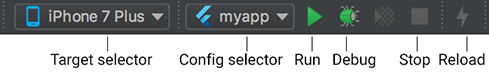

# Flutter 学习笔记

## 开发环境配置

### 国内镜像 — Mac/Linux

```shell
 $ export PUB_HOSTED_URL=https://pub.flutter-io.cn
 $ export FLUTTER_STORAGE_BASE_URL=https://storage.flutter-io.cn
```

如果镜像变动，则在下面网站查询：https://flutter.cn/community/china

### Flutter SDK 安装

#### 下载

```
https://flutter.cn/docs/get-started/install
```

在上面网站找到适合操作系统的SDK

#### 将文件解压到目标路径, 比如:

```shell
cd ~/development
unzip ~/Downloads/flutter_macos_v1.9.1+hotfix.6-stable.zip
```

#### 配置 `flutter` 的 PATH 环境变量

打开或者创建 shell 的 `rc` 文件，比如，在 Linux 和 macOS Mojave 或 Mojave 之前的系统里，是默认使用 Bash 的，所以需要修改 `$HOME/.bashrc` 文件。 macOS Catalina 操作系统默认使用 Z Shell，所以需要修改 `$HOME/.zshrc` 文件。注意：如果你使用不同的 shell，文件目录或文件名可能会有所不同。

```shell
# 这里的路径就是 flutter sdk 的 bin 目录
# 在文件中添加下面配置
# 国内镜像配置
export PUB_HOSTED_URL=https://pub.flutter-io.cn
export FLUTTER_STORAGE_BASE_URL=https://storage.flutter-io.cn

# sdk 配置
export PATH="$PATH:`pwd`/flutter/bin"
```

#### 运行 flutter doctor 命令

通过运行以下命令来查看当前环境是否需要安装其他的依赖（如果想查看更详细的输出，增加一个 `-v` 参数即可）：

```shell
$ flutter doctor
```

这个命令会检查你当前的配置环境，并在命令行窗口中生成一份报告。安装 Flutter 会附带安装 Dart SDK，所以不需要再对 Dart 进行单独安装。

比如你可能会看到下面这样的输出：

```
[-] Android toolchain - develop for Android devices
    • Android SDK at /Users/obiwan/Library/Android/sdk
    ✗ Android SDK is missing command line tools; download from https://goo.gl/XxQghQ
    • Try re-installing or updating your Android SDK,
      visit https://flutter.dev/setup/#android-setup for detailed instructions.
```

之后的部分会向你描述如果执行这些命令来完成整体的配置过程。

必须保证 `Flutter`  、 `Android toolchain` 、 `Android Studio` 都是打勾的

`Android toolchain` 未安装则需要先安装 `Android Studio` 然后安装 `Android SDK` ，点击下面的 `Edit` 然后下一步一下步即可自动下载安装


一般的错误会是XCode或Android Studio版本太低、或者没有`ANDROID_HOME`环境变量等，可参考一下环境变量的配置来检查你的环境变量：

```shell
//使用的 bash 修改 $HOME/.bashrc，使用的 zsh 则修改 $HOME/.zshrc
#Android 环境变量
export ANDROID_HOME=/Users/你的用户名/Library/Android/sdk
#Android 模拟器路径
export PATH=${PATH}:${ANDROID_HOME}/emulator
#Android tools 路径
export PATH=${PATH}:${ANDROID_HOME}/tools
#Android 平台工具路径
export PATH=${PATH}:${ANDROID_HOME}/platform-tools
#Android NDK路径
ANDROID_NDK_HOME=/Users/你的用户名/Library/Android/ndk/android-ndk-r10e
#FLutter镜像
export PUB_HOSTED_URL=https://pub.flutter-io.cn
export FLUTTER_STORAGE_BASE_URL=https://storage.flutter-io.cn
#Flutter环境变量
export PATH=/Users/jph/Documents/flutter/bin:$PATH
```

#### 升级Flutter SDK和依赖包

要升级flutter sdk，只需一句命令：

```shell
flutter upgrade
```

该命令会同时更新Flutter SDK和你的flutter项目依赖包。如果你只想更新项目依赖包（不包括Flutter SDK），可以使用如下命令：

- `flutter packages get`获取项目所有的依赖包。
- `flutter packages upgrade` 获取项目所有依赖包的最新版本。

### 配置 Android Studio 手机模拟器

1. 打开 Flutter 项目，在idea的顶部选择 `AVD Manager`

   

2. 创建新模拟器

   

3. 创建好后双击即可启动

### Dart 官方包管理

官方包管理网站：https://pub.flutter-io.cn/

## Flutter Framework


这是一个纯 Dart实现的 SDK，它实现了一套基础库，自底向上，我们来简单介绍一下：

- 底下两层（Foundation和Animation、Painting、Gestures）在Google的一些视频中被合并为一个dart UI层，对应的是Flutter中的`dart:ui`包，它是Flutter引擎暴露的底层UI库，提供动画、手势及绘制能力。
- Rendering层，这一层是一个抽象的布局层，它依赖于dart UI层，Rendering层会构建一个UI树，当UI树有变化时，会计算出有变化的部分，然后更新UI树，最终将UI树绘制到屏幕上，这个过程类似于React中的虚拟DOM。Rendering层可以说是Flutter UI框架最核心的部分，它除了确定每个UI元素的位置、大小之外还要进行坐标变换、绘制(调用底层dart:ui)。
- Widgets层是Flutter提供的的一套基础组件库，在基础组件库之上，Flutter还提供了 Material 和Cupertino两种视觉风格的组件库。而**我们Flutter开发的大多数场景，只是和这两层打交道**。

## 起步

### 创建Flutter应用

1. 选择 **File>New Flutter Project** 。
2. 选择 **Flutter application** 作为 project 类型, 然后点击 Next。
3. 输入项目名称 (如 `myapp`)，然后点击 Next。
4. 点击 **Finish**。
5. 等待Android Studio安装SDK并创建项目。

上述命令创建一个Flutter项目，项目名为myapp，其中包含一个使用[Material 组件](https://material.io/guidelines/)的简单演示应用程序。

在项目目录中，您应用程序的代码位于 `lib/main.dart`。

### 运行应用程序

1. 定位到Android Studio工具栏，如图1-3所示：

   

2. 在 **target selector** 中, 选择一个运行该应用的Android设备。如果没有列出可用，请选择 **Tools>Android>AVD Manager** 并在那里创建一个。

3. 在工具栏中点击 **Run图标**。

4. 如果一切正常, 您应该在您的设备或模拟器上会看到启动的应用程序：

   

### 体验热重载

Flutter 可以通过 *热重载（hot reload）* 实现快速的开发周期，热重载就是无需重启应用程序就能实时加载修改后的代码，并且不会丢失状态。简单的对代码进行更改，然后告诉IDE或命令行工具你需要重新加载（点击reload按钮），你就会在你的设备或模拟器上看到更改。

1. 打开`lib/main.dart`文件

2. 将字符串 `'You have pushed the button this many times:'` 更改为 `'You have clicked the button this many times:'`

3. 不要按“停止”按钮; 让您的应用继续运行.

4. 要查更改，请调用 **Save** (`cmd-s` / `ctrl-s`)，或者点击 **热重载按钮** (带有闪电⚡️图标的按钮)。

   你会立即在运行的应用程序中看到更新的字符串。

### 连接设备运行Flutter应用

Window下只支持为Android设备构建并运行Flutter应用，而macOS同时支持iOS和Android设备。下面分别介绍如何连接Android和iOS设备来运行flutter应用。

#### 连接Android模拟器

要准备在Android模拟器上运行并测试Flutter应用，请按照以下步骤操作：

1. 启动 **Android Studio>Tools>Android>AVD Manager** 并选择 **Create Virtual Device**.

2. 选择一个设备并选择 **Next**。

3. 为要模拟的Android版本选择一个或多个系统印象，然后选择 **Next**. 建议使用 *x86* 或 *x86_64* image .

4. 在 “Emulated Performance”下, 选择 **Hardware - GLES 2.0** 以启用 [硬件加速](https://developer.android.com/studio/run/emulator-acceleration.html).

5. 验证AVD配置是否正确，然后选择 **Finish**。

   有关上述步骤的详细信息，请参阅 [Managing AVDs](https://developer.android.com/studio/run/managing-avds.html).

6. 在“Android Virtual Device Manager”中，点击工具栏的 **Run**。模拟器启动并显示所选操作系统版本或设备的启动画面。

7. 运行 `flutter run` 启动您的设备。 连接的设备名是 `Android SDK built for <platform>`，其中 *platform* 是芯片系列，如 x86。

#### 连接Android真机设备

要准备在Android设备上运行并测试Flutter应用，需要Android 4.1（API level 16）或更高版本的Android设备.

1. 在Android设备上启用 **开发人员选项** 和 **USB调试** 。详细说明可在[Android文档](https://developer.android.com/studio/debug/dev-options.html)中找到。
2. 使用USB将手机插入电脑。如果设备出现调试授权提示，请授权你的电脑可以访问该设备。
3. 在命令行运行 `flutter devices` 命令以验证Flutter识别您连接的Android设备。
4. 运行启动你应用程序 `flutter run`。

默认情况下，Flutter使用的Android SDK版本是基于你的 `adb` 工具版本。 如果想让Flutter使用不同版本的Android SDK，则必须将该 `ANDROID_HOME` 环境变量设置为相应的SDK安装目录。

#### 连接iOS模拟器

要准备在iOS模拟器上运行并测试Flutter应用，请按以下步骤操作：

1. 在你的MAC上，通过 Spotlight 或以下命令找到模拟器：

   ```shell
   open -a Simulator
   ```

2. 通过检查模拟器 **Hardware > Device** 菜单中的设置，确保模拟器正在使用64位设备（iPhone 5s或更高版本）。

3. 根据你电脑屏幕大小，模拟高清屏iOS设备可能会溢出屏幕。可以在模拟器的 **Window> Scale** 菜单下设置设备比例。

4. 运行 `flutter run`启动flutter应用程序。

#### 连接iOS真机设备

要将Flutter应用安装到iOS真机设备，需要一些额外的工具和一个Apple帐户，还需要在Xcode中进行一些设置。

1. 安装 [homebrew](http://brew.sh/) （如果已经安装了brew,跳过此步骤）。

2. 打开终端并运行如下这些命令:

   ```shell
   brew update
   brew install --HEAD libimobiledevice
   brew install ideviceinstaller ios-deploy cocoapods
   pod setup
   ```

   如果这些命令中的任何一个失败并出现错误，请运行brew doctor并按照说明解决问题.

3. 遵循Xcode签名流程来配置您的项目:

   - 在你Flutter项目目录中通过 `open ios/Runner.xcworkspace` 打开默认的Xcode workspace.

   - 在Xcode中，选择导航面板左侧中的`Runner`项目。

   - 在`Runner` target设置页面中，确保在 **General > Signing > Team** 下选择了你的开发团队。当你选择一个团队时，Xcode会创建并下载开发证书，向你的设备注册你的帐户，并创建和下载配置文件（如果需要）。

   - 要开始您的第一个iOS开发项目，您可能需要使用您的Apple ID登录Xcode，如图1-5：

     

     任何Apple ID都支持开发和测试，但若想将应用分发到App Store，就必须注册Apple开发者计划，有关详情读者可以自行了解。

   - 当您第一次attach真机设备进行iOS开发时，需要同时信任你的Mac和该设备上的开发证书。首次将iOS设备连接到Mac时，请在对话框中选择 `Trust`。

     

     然后，转到iOS设备上的**设置**菜单，选择 **常规>设备管理** 并信任您的证书。

   - 如果Xcode中的自动签名失败，请验证项目的 **General > Identity > Bundle Identifier** 值是否唯一，如图1-7所示：

     

   - 运行 `flutter run`启动flutter应用程序。

## 注解

### @required

必传参数添加`@required` 注解

```dart
// text 为必传参数
Echo({
    Key key,  
    @required this.text
});
```


## 第一个 Flutter 应用

### 计数器应用示例

了解 `Flutter` 应用程序基本结构

#### 创建Flutter应用模板

通过Android Studio或VS Code创建一个新的Flutter工程，命名为"first_flutter_app"。创建好后，就会得到一个计数器应用的Demo。

在这个示例中，主要Dart代码是在 **lib/main.dart** 文件中，下面是它的源码：

```dart
import 'package:flutter/material.dart';

void main() => runApp(new MyApp());

class MyApp extends StatelessWidget {
  @override
  Widget build(BuildContext context) {
    return new MaterialApp(
      title: 'Flutter Demo',
      theme: new ThemeData(
        primarySwatch: Colors.blue,
      ),
      home: new MyHomePage(title: 'Flutter Demo Home Page'),
    );
  }
}

class MyHomePage extends StatefulWidget {
  MyHomePage({Key key, this.title}) : super(key: key);
  final String title;

  @override
  _MyHomePageState createState() => new _MyHomePageState();
}

class _MyHomePageState extends State<MyHomePage> {
  int _counter = 0;

  void _incrementCounter() {
    setState(() {
      _counter++;
    });
  }

  @override
  Widget build(BuildContext context) {
    return new Scaffold(
      appBar: new AppBar(
        title: new Text(widget.title),
      ),
      body: new Center(
        child: new Column(
          mainAxisAlignment: MainAxisAlignment.center,
          children: <Widget>[
            new Text(
              'You have pushed the button this many times:',
            ),
            new Text(
              '$_counter',
              style: Theme.of(context).textTheme.display1,
            ),
          ],
        ),
      ),
      floatingActionButton: new FloatingActionButton(
        onPressed: _incrementCounter,
        tooltip: 'Increment',
        child: new Icon(Icons.add),
      ), // This trailing comma makes auto-formatting nicer for build methods.
    );
  }
}
```

##### 分析

1. 导入包。

   ```dart
   import 'package:flutter/material.dart';
   ```

   此行代码作用是导入了Material UI组件库。[Material](https://material.io/guidelines/)是一种标准的移动端和web端的视觉设计语言， Flutter默认提供了一套丰富的Material风格的UI组件。

2. 应用入口。

   ```dart
   void main() => runApp(MyApp());
   ```

   - 与C/C++、Java类似，Flutter 应用中`main`函数为应用程序的入口。`main`函数中调用了`runApp` 方法，它的功能是启动Flutter应用。`runApp`它接受一个`Widget`参数，在本示例中它是一个`MyApp`对象，`MyApp()`是Flutter应用的根组件。
   - `main`函数使用了(`=>`)符号，这是Dart中单行函数或方法的简写。

3. 应用结构。

   ```dart
   class MyApp extends StatelessWidget {
     @override
     Widget build(BuildContext context) {
       return new MaterialApp(
         //应用名称  
         title: 'Flutter Demo', 
         theme: new ThemeData(
           //蓝色主题  
           primarySwatch: Colors.blue,
         ),
         //应用首页路由  
         home: new MyHomePage(title: 'Flutter Demo Home Page'),
       );
     }
   }
   ```

   - `MyApp`类代表Flutter应用，它继承了 `StatelessWidget`类，这也就意味着应用本身也是一个widget。
   - 在Flutter中，大多数东西都是widget（后同“组件”或“部件”），包括对齐(alignment)、填充(padding)和布局(layout)等，它们都是以widget的形式提供。
   - Flutter在构建页面时，会调用组件的`build`方法，widget的主要工作是提供一个build()方法来描述如何构建UI界面（通常是通过组合、拼装其它基础widget）。
   - `MaterialApp` 是Material库中提供的Flutter APP框架，通过它可以设置应用的名称、主题、语言、首页及路由列表等。`MaterialApp`也是一个widget。
   - `Scaffold` 是Material库中提供的页面脚手架，它包含导航栏和Body以及`FloatingActionButton`（如果需要的话）。 本书后面示例中，路由默认都是通过`Scaffold`创建。
   - `home` 为Flutter应用的首页，它也是一个widget。

#### 首页

```dart
   class MyHomePage extends StatefulWidget {
     MyHomePage({Key key, this.title}) : super(key: key);
     final String title;
     @override
     _MyHomePageState createState() => new _MyHomePageState();
   }

   class _MyHomePageState extends State<MyHomePage> {
    ...
   }
```

`MyHomePage` 是Flutter应用的首页，它继承自`StatefulWidget`类，表示它是一个有状态的组件（Stateful widget）。关于Stateful widget我们将在第三章“Widget简介”一节仔细介绍，现在我们只需简单认为有状态的组件（Stateful widget） 和无状态的组件（Stateless widget）有两点不同：

1. Stateful widget可以拥有状态，这些状态在widget生命周期中是可以变的，而Stateless widget是不可变的。

2. Stateful widget至少由两个类组成：

   - 一个`StatefulWidget`类。
   - 一个 `State`类； `StatefulWidget`类本身是不变的，但是`State`类中持有的状态在widget生命周期中可能会发生变化。

   `_MyHomePageState`类是`MyHomePage`类对应的状态类。看到这里，读者可能已经发现：和`MyApp` 类不同， `MyHomePage`类中并没有`build`方法，取而代之的是，`build`方法被挪到了`_MyHomePageState`方法中，至于为什么这么做，先留个疑问，在分析完完整代码后再来解答。

##### State类

接下来，我们看看`_MyHomePageState`中都包含哪些东西：

1. 该组件的状态。由于我们只需要维护一个点击次数计数器，所以定义一个`_counter`状态：

   ```dart
   int _counter = 0; //用于记录按钮点击的总次数
   ```

   `_counter` 为保存屏幕右下角带“+”号按钮点击次数的状态。

2. 设置状态的自增函数。

   ```dart
   void _incrementCounter() {
     setState(() {
        _counter++;
     });
   }
   ```

   当按钮点击时，会调用此函数，该函数的作用是先自增`_counter`，然后调用`setState` 方法。`setState`方法的作用是通知Flutter框架，有状态发生了改变，Flutter框架收到通知后，会执行`build`方法来根据新的状态重新构建界面， Flutter 对此方法做了优化，使重新执行变的很快，所以你可以重新构建任何需要更新的东西，而无需分别去修改各个widget。

3. 构建UI界面

   构建UI界面的逻辑在`build`方法中，当`MyHomePage`第一次创建时，`_MyHomePageState`类会被创建，当初始化完成后，Flutter框架会调用Widget的`build`方法来构建widget树，最终将widget树渲染到设备屏幕上。所以，我们看看`_MyHomePageState`的`build`方法中都干了什么事：

   ```dart
     Widget build(BuildContext context) {
       return new Scaffold(
         appBar: new AppBar(
           title: new Text(widget.title),
         ),
         body: new Center(
           child: new Column(
             mainAxisAlignment: MainAxisAlignment.center,
             children: <Widget>[
               new Text(
                 'You have pushed the button this many times:',
               ),
               new Text(
                 '$_counter',
                 style: Theme.of(context).textTheme.display1,
               ),
             ],
           ),
         ),
         floatingActionButton: new FloatingActionButton(
           onPressed: _incrementCounter,
           tooltip: 'Increment',
           child: new Icon(Icons.add),
         ),
       );
     }
   ```

   - `Scaffold` 是 Material组件库中提供的一个组件，它提供了默认的导航栏、标题和包含主屏幕widget树（后同“组件树”或“部件树”）的`body`属性。组件树可以很复杂。
   - `body`的组件树中包含了一个`Center` 组件，`Center` 可以将其子组件树对齐到屏幕中心。此例中， `Center` 子组件是一个`Column` 组件，`Column`的作用是将其所有子组件沿屏幕垂直方向依次排列； 此例中`Column`子组件是两个 `Text`，第一个`Text` 显示固定文本 “You have pushed the button this many times:”，第二个`Text` 显示`_counter`状态的数值。
   - `floatingActionButton`是页面右下角的带“+”的悬浮按钮，它的`onPressed`属性接受一个回调函数，代表它被点击后的处理器，本例中直接将`_incrementCounter`方法作为其处理函数。

现在，我们将整个计数器执行流程串起来：当右下角的`floatingActionButton`按钮被点击之后，会调用`_incrementCounter`方法。在`_incrementCounter`方法中，首先会自增`_counter`计数器（状态），然后`setState`会通知Flutter框架状态发生变化，接着，Flutter框架会调用`build`方法以新的状态重新构建UI，最终显示在设备屏幕上。

### 路由管理

路由(Route)在移动开发中通常指页面（Page），这跟web开发中单页应用的Route概念意义是相同的，Route在Android中通常指一个Activity，在iOS中指一个ViewController。所谓路由管理，就是管理页面之间如何跳转，通常也可被称为导航管理。Flutter中的路由管理和原生开发类似，无论是Android还是iOS，导航管理都会维护一个路由栈，路由入栈(push)操作对应打开一个新页面，路由出栈(pop)操作对应页面关闭操作，而路由管理主要是指如何来管理路由栈。

####  一个简单示例

我们在上一节“计数器”示例的基础上，做如下修改：

1. 创建一个新路由，命名“NewRoute”

   ```dart
   class NewRoute extends StatelessWidget {
     @override
     Widget build(BuildContext context) {
       return Scaffold(
         appBar: AppBar(
           title: Text("New route"),
         ),
         body: Center(
           child: Text("This is new route"),
         ),
       );
     }
   }
   ```

   新路由继承自`StatelessWidget`，界面很简单，在页面中间显示一句"This is new route"。

2. 在`_MyHomePageState.build`方法中的`Column`的子widget中添加一个按钮（`FlatButton`） :

   ```dart
   Column(
         mainAxisAlignment: MainAxisAlignment.center,
         children: <Widget>[
         ... //省略无关代码
         FlatButton(
            child: Text("open new route"),
            textColor: Colors.blue,
            onPressed: () {
             //导航到新路由   
             Navigator.push( context,
              MaterialPageRoute(builder: (context) {
                 return NewRoute();
              }));
             },
            ),
          ],
    )
   ```

   我们添加了一个打开新路由的按钮，并将按钮文字颜色设置为蓝色，点击该按钮后就会打开新的路由页面，效果如图2-2和2-3所示。

    

#### MaterialPageRoute

`MaterialPageRoute`继承自`PageRoute`类，`PageRoute`类是一个抽象类，表示占有整个屏幕空间的一个模态路由页面，它还定义了路由构建及切换时过渡动画的相关接口及属性。`MaterialPageRoute` 是Material组件库提供的组件，它可以针对不同平台，实现与平台页面切换动画风格一致的路由切换动画：

- 对于Android，当打开新页面时，新的页面会从屏幕底部滑动到屏幕顶部；当关闭页面时，当前页面会从屏幕顶部滑动到屏幕底部后消失，同时上一个页面会显示到屏幕上。
- 对于iOS，当打开页面时，新的页面会从屏幕右侧边缘一致滑动到屏幕左边，直到新页面全部显示到屏幕上，而上一个页面则会从当前屏幕滑动到屏幕左侧而消失；当关闭页面时，正好相反，当前页面会从屏幕右侧滑出，同时上一个页面会从屏幕左侧滑入。

下面我们介绍一下`MaterialPageRoute` 构造函数的各个参数的意义：

```dart
  MaterialPageRoute({
    WidgetBuilder builder,
    RouteSettings settings,
    bool maintainState = true,
    bool fullscreenDialog = false,
  })
```

- `builder` 是一个WidgetBuilder类型的回调函数，它的作用是构建路由页面的具体内容，返回值是一个widget。我们通常要实现此回调，返回新路由的实例。
- `settings` 包含路由的配置信息，如路由名称、是否初始路由（首页）。
- `maintainState`：默认情况下，当入栈一个新路由时，原来的路由仍然会被保存在内存中，如果想在路由没用的时候释放其所占用的所有资源，可以设置`maintainState`为false。
- `fullscreenDialog`表示新的路由页面是否是一个全屏的模态对话框，在iOS中，如果`fullscreenDialog`为`true`，新页面将会从屏幕底部滑入（而不是水平方向）。

#### Navigator

`Navigator`是一个路由管理的组件，它提供了打开和退出路由页方法。`Navigator`通过一个栈来管理活动路由集合。通常当前屏幕显示的页面就是栈顶的路由。`Navigator`提供了一系列方法来管理路由栈，在此我们只介绍其最常用的两个方法：

##### Future push(BuildContext context, Route route)

将给定的路由入栈（即打开新的页面），返回值是一个`Future`对象，用以接收新路由出栈（即关闭）时的返回数据。

##### bool pop(BuildContext context, [ result ])

将栈顶路由出栈，`result`为页面关闭时返回给上一个页面的数据。

`Navigator` 还有很多其它方法，如`Navigator.replace`、`Navigator.popUntil`等，详情请参考API文档或SDK源码注释，在此不再赘述。下面我们还需要介绍一下路由相关的另一个概念“命名路由”。

##### 实例方法

Navigator类中第一个参数为context的**静态方法**都对应一个Navigator的**实例方法**， 比如`Navigator.push(BuildContext context, Route route)`等价于`Navigator.of(context).push(Route route)` ，下面命名路由相关的方法也是一样的。

#### 路由传值

很多时候，在路由跳转时我们需要带一些参数，比如打开商品详情页时，我们需要带一个商品id，这样商品详情页才知道展示哪个商品信息；又比如我们在填写订单时需要选择收货地址，打开地址选择页后，可以将用户选择的地址返回到订单页等等。下面我们通过一个简单的示例来演示新旧路由如何传参。

##### 示例

我们创建一个`TipRoute`路由，它接受一个提示文本参数，负责将传入它的文本显示在页面上，另外`TipRoute`中我们添加一个“返回”按钮，点击后在返回上一个路由的同时会带上一个返回参数，下面我们看一下实现代码。

`TipRoute`实现代码：

```dart
class TipRoute extends StatelessWidget {
  TipRoute({
    Key key,
    @required this.text,  // 接收一个text参数
  }) : super(key: key);
  final String text;

  @override
  Widget build(BuildContext context) {
    return Scaffold(
      appBar: AppBar(
        title: Text("提示"),
      ),
      body: Padding(
        padding: EdgeInsets.all(18),
        child: Center(
          child: Column(
            children: <Widget>[
              Text(text),
              RaisedButton(
                onPressed: () => Navigator.pop(context, "我是返回值"),
                child: Text("返回"),
              )
            ],
          ),
        ),
      ),
    );
  }
}
```

下面是打开新路由`TipRoute`的代码：

```dart
class RouterTestRoute extends StatelessWidget {
  @override
  Widget build(BuildContext context) {
    return Center(
      child: RaisedButton(
        onPressed: () async {
          // 打开`TipRoute`，并等待返回结果
          var result = await Navigator.push(
            context,
            MaterialPageRoute(
              builder: (context) {
                return TipRoute(
                  // 路由参数
                  text: "我是提示xxxx",
                );
              },
            ),
          );
          //输出`TipRoute`路由返回结果
          print("路由返回值: $result");
        },
        child: Text("打开提示页"),
      ),
    );
  }
}
```

运行上面代码，点击`RouterTestRoute`页的“打开提示页”按钮，会打开`TipRoute`页，运行效果如图2-4所示下：


需要说明：

1. 提示文案“我是提示xxxx”是通过`TipRoute`的`text`参数传递给新路由页的。我们可以通过等待`Navigator.push(…)`返回的`Future`来获取新路由的返回数据。

2. 在`TipRoute`页中有两种方式可以返回到上一页；第一种方式时直接点击导航栏返回箭头，第二种方式是点击页面中的“返回”按钮。这两种返回方式的区别是前者不会返回数据给上一个路由，而后者会。下面是分别点击页面中的返回按钮和导航栏返回箭头后，`RouterTestRoute`页中`print`方法在控制台输出的内容：

   ```
   I/flutter (27896): 路由返回值: 我是返回值
   I/flutter (27896): 路由返回值: null
   ```

#### 命名路由

所谓“命名路由”（Named Route）即有名字的路由，我们可以先给路由起一个名字，然后就可以通过路由名字直接打开新的路由了，这为路由管理带来了一种直观、简单的方式。

##### 路由表

要想使用命名路由，我们必须先提供并注册一个路由表（routing table），这样应用程序才知道哪个名字与哪个路由组件相对应。其实注册路由表就是给路由起名字，路由表的定义如下：

```dart
Map<String, WidgetBuilder> routes;
```

它是一个`Map`，key为路由的名字，是个字符串；value是个`builder`回调函数，用于生成相应的路由widget。我们在通过路由名字打开新路由时，应用会根据路由名字在路由表中查找到对应的`WidgetBuilder`回调函数，然后调用该回调函数生成路由widget并返回。

##### 注册路由表

路由表的注册方式很简单，我们回到之前“计数器”的示例，然后在`MyApp`类的`build`方法中找到`MaterialApp`，添加`routes`属性，代码如下：

```dart
MaterialApp(
  title: 'Flutter Demo',
  theme: ThemeData(
    primarySwatch: Colors.blue,
  ),
  //注册路由表
  routes:{
   "new_page":(context)=>NewRoute(),
    ... // 省略其它路由注册信息
  } ,
  home: MyHomePage(title: 'Flutter Demo Home Page'),
);
```

现在我们就完成了路由表的注册。上面的代码中`home`路由并没有使用命名路由，如果我们也想将`home`注册为命名路由应该怎么做呢？其实很简单，直接看代码：

```dart
MaterialApp(
  title: 'Flutter Demo',
  initialRoute:"/", //名为"/"的路由作为应用的home(首页)
  theme: ThemeData(
    primarySwatch: Colors.blue,
  ),
  //注册路由表
  routes:{
   "new_page":(context)=>NewRoute(),
   "/":(context)=> MyHomePage(title: 'Flutter Demo Home Page'), //注册首页路由
  } 
);
```

可以看到，我们只需在路由表中注册一下`MyHomePage`路由，然后将其名字作为`MaterialApp`的`initialRoute`属性值即可，该属性决定应用的初始路由页是哪一个命名路由。

##### 通过路由名打开新路由页

要通过路由名称来打开新路由，可以使用`Navigator` 的`pushNamed`方法：

```dart
Future pushNamed(BuildContext context, String routeName,{Object arguments})
```

`Navigator` 除了`pushNamed`方法，还有`pushReplacementNamed`等其他管理命名路由的方法，读者可以自行查看API文档。接下来我们通过路由名来打开新的路由页，修改`FlatButton`的`onPressed`回调代码，改为：

```dart
onPressed: () {
  Navigator.pushNamed(context, "new_page");
  //Navigator.push(context,
  //  new MaterialPageRoute(builder: (context) {
  //  return new NewRoute();
  //}));  
},
```

热重载应用，再次点击“open new route”按钮，依然可以打开新的路由页。

##### 命名路由参数传递

在Flutter最初的版本中，命名路由是不能传递参数的，后来才支持了参数；下面展示命名路由如何传递并获取路由参数：

我们先注册一个路由：

```dart
 routes:{
   "new_page":(context)=>EchoRoute(),
  } ,
```

在路由页通过`RouteSetting`对象获取路由参数：

```dart
class EchoRoute extends StatelessWidget {

  @override
  Widget build(BuildContext context) {
    //获取路由参数  
    var args=ModalRoute.of(context).settings.arguments
    //...省略无关代码
  }
}
```

在打开路由时传递参数

```dart
Navigator.of(context).pushNamed("new_page", arguments: "hi");
```

##### 适配

假设我们也想将上面路由传参示例中的`TipRoute`路由页注册到路由表中，以便也可以通过路由名来打开它。但是，由于`TipRoute`接受一个`text` 参数，我们如何在不改变`TipRoute`源码的前提下适配这种情况？其实很简单：

```dart
MaterialApp(
  ... //省略无关代码
  routes: {
   "tip2": (context){
     return TipRoute(text: ModalRoute.of(context).settings.arguments);
   },
 }, 
);
```

#### 路由生成钩子

假设我们要开发一个电商APP，当用户没有登录时可以看店铺、商品等信息，但交易记录、购物车、用户个人信息等页面需要登录后才能看。为了实现上述功能，我们需要在打开每一个路由页前判断用户登录状态！如果每次打开路由前我们都需要去判断一下将会非常麻烦，那有什么更好的办法吗？答案是有！

`MaterialApp`有一个`onGenerateRoute`属性，它在打开命名路由时可能会被调用，之所以说可能，是因为当调用`Navigator.pushNamed(...)`打开命名路由时，如果指定的路由名在路由表中已注册，则会调用路由表中的`builder`函数来生成路由组件；如果路由表中没有注册，才会调用`onGenerateRoute`来生成路由。`onGenerateRoute`回调签名如下：

```dart
Route<dynamic> Function(RouteSettings settings)
```

有了`onGenerateRoute`回调，要实现上面控制页面权限的功能就非常容易：我们放弃使用路由表，取而代之的是提供一个`onGenerateRoute`回调，然后在该回调中进行统一的权限控制，如：

```dart
MaterialApp(
  ... //省略无关代码
  onGenerateRoute:(RouteSettings settings){
      return MaterialPageRoute(builder: (context){
           String routeName = settings.name;
       // 如果访问的路由页需要登录，但当前未登录，则直接返回登录页路由，
       // 引导用户登录；其它情况则正常打开路由。
     }
   );
  }
);
```

> 注意，`onGenerateRoute`只会对命名路由生效。

#### 总结

本章先介绍了Flutter中路由管理、传参的方式，然后又着重介绍了命名路由相关内容。在此需要说明一点，由于命名路由只是一种可选的路由管理方式，在实际开发中，读者可能心中会犹豫到底使用哪种路由管理方式。在此，根据笔者经验，建议读者最好统一使用命名路由的管理方式，这将会带来如下好处：

1. 语义化更明确。
2. 代码更好维护；如果使用匿名路由，则必须在调用`Navigator.push`的地方创建新路由页，这样不仅需要import新路由页的dart文件，而且这样的代码将会非常分散。
3. 可以通过`onGenerateRoute`做一些全局的路由跳转前置处理逻辑。

### 包管理

在软件开发中，很多时候有一些公共的库或SDK可能会被很多项目用到，因此，将这些代码单独抽到一个独立模块，然后哪个项目需要使用时再直接集成这个模块，便可大大提高开发效率。很多编程语言或开发工具都支持这种“模块共享”机制，如Java语言中这种独立模块会被打成一个jar包，Android中的aar包，Web开发中的npm包等。为了方便表述，我们将这种可共享的独立模块统一称为“包”（ Package）。

一个APP在实际开发中往往会依赖很多包，而这些包通常都有交叉依赖关系、版本依赖等，如果由开发者手动来管理应用中的依赖包将会非常麻烦。因此，各种开发生态或编程语言官方通常都会提供一些包管理工具，比如在Android提供了Gradle来管理依赖，iOS用Cocoapods或Carthage来管理依赖，Node中通过npm等。而在Flutter开发中也有自己的包管理工具。本节我们主要介绍一下flutter如何使用配置文件`pubspec.yaml`（位于项目根目录）来管理第三方依赖包。

YAML是一种直观、可读性高并且容易被人类阅读的文件格式，它和xml或Json相比，它语法简单并非常容易解析，所以YAML常用于配置文件，Flutter也是用yaml文件作为其配置文件。Flutter项目默认的配置文件是`pubspec.yaml`，我们看一个简单的示例：

```yaml
name: flutter_in_action
description: First Flutter application.

version: 1.0.0+1

dependencies:
  flutter:
    sdk: flutter
  cupertino_icons: ^0.1.2

dev_dependencies:
  flutter_test:
    sdk: flutter

flutter:
  uses-material-design: true
```

下面，我们逐一解释一下各个字段的意义：

- `name`：应用或包名称。
- `description`: 应用或包的描述、简介。
- `version`：应用或包的版本号。
- `dependencies`：应用或包依赖的其它包或插件。
- `dev_dependencies`：开发环境依赖的工具包（而不是flutter应用本身依赖的包）。
- `flutter`：flutter相关的配置选项。

如果我们的Flutter应用本身依赖某个包，我们需要将所依赖的包添加到`dependencies` 下，接下来我们通过一个例子来演示一下如何添加、下载并使用第三方包。

#### Pub仓库

Pub（https://pub.dartlang.org/ ）是Google官方的Dart Packages仓库，类似于node中的npm仓库，android中的jcenter。我们可以在Pub上面查找我们需要的包和插件，也可以向Pub发布我们的包和插件。我们将在后面的章节中介绍如何向Pub发布我们的包和插件。

#### 示例

接下来，我们实现一个显示随机字符串的widget。有一个名为“english_words”的开源软件包，其中包含数千个常用的英文单词以及一些实用功能。我们首先在pub上找到english_words这个包（如图2-5所示），确定其最新的版本号和是否支持Flutter。


我们看到“english_words”包最新的版本是3.1.3，并且支持flutter，接下来：

1. 将“english_words”（3.1.3版本）添加到依赖项列表，如下：

   ```yaml
   dependencies:
     flutter:
       sdk: flutter
   
     cupertino_icons: ^0.1.0
     # 新添加的依赖
     english_words: ^3.1.3
   ```

2. 下载包。在Android Studio的编辑器视图中查看pubspec.yaml时（图2-6），单击右上角的 **Packages get** 。

   

   这会将依赖包安装到您的项目。我们可以在控制台中看到以下内容：

   ```shell
   flutter packages get
   Running "flutter packages get" in flutter_in_action...
   Process finished with exit code 0
   ```

   我们也可以在控制台，定位到当前工程目录，然后手动运行`flutter packages get` 命令来下载依赖包。另外，需要注意`dependencies`和`dev_dependencies`的区别，前者的依赖包将作为APP的源码的一部分参与编译，生成最终的安装包。而后者的依赖包只是作为开发阶段的一些工具包，主要是用于帮助我们提高开发、测试效率，比如flutter的自动化测试包等。

3. 引入`english_words`包。

   ```dart
   import 'package:english_words/english_words.dart';
   ```

   在输入时，Android Studio会自动提供有关库导入的建议选项。导入后该行代码将会显示为灰色，表示导入的库尚未使用。

4. 使用`english_words`包来生成随机字符串。

   ```dart
   class RandomWordsWidget extends StatelessWidget {
     @override
     Widget build(BuildContext context) {
      // 生成随机字符串
       final wordPair = new WordPair.random();
       return Padding(
         padding: const EdgeInsets.all(8.0),
         child: new Text(wordPair.toString()),
       );
     }
   }
   ```

   我们将`RandomWordsWidget` 添加到 `_MyHomePageState.build` 的`Column`的子widget中。

   ```dart
   Column(
     mainAxisAlignment: MainAxisAlignment.center,
     children: <Widget>[
       ... //省略无关代码
       RandomWordsWidget(),
     ],
   )
   ```

5. 如果应用程序正在运行，请使用热重载按钮（⚡️图标） 更新正在运行的应用程序。每次单击热重载或保存项目时，都会在正在运行的应用程序中随机选择不同的单词对。 这是因为单词对是在 `build` 方法内部生成的。每次热更新时，`build`方法都会被执行，运行效果如图2-7所示。

   

#### 其它依赖方式

上文所述的依赖方式是依赖Pub仓库的。但我们还可以依赖本地包和git仓库。

- 依赖本地包

  如果我们正在本地开发一个包，包名为pkg1，我们可以通过下面方式依赖：

  ```yaml
  dependencies:
      pkg1:
          path: ../../code/pkg1
  ```

  路径可以是相对的，也可以是绝对的。

- 依赖Git：你也可以依赖存储在Git仓库中的包。如果软件包位于仓库的根目录中，请使用以下语法

  ```yaml
  dependencies:
    pkg1:
      git:
        url: git://github.com/xxx/pkg1.git
  ```

  上面假定包位于Git存储库的根目录中。如果不是这种情况，可以使用path参数指定相对位置，例如：

  ```yaml
  dependencies:
    package1:
      git:
        url: git://github.com/flutter/packages.git
        path: packages/package1
  ```

上面介绍的这些依赖方式是Flutter开发中常用的，但还有一些其它依赖方式，完整的内容读者可以自行查看：https://www.dartlang.org/tools/pub/dependencies 。

### 调试Flutter应用

有各种各样的工具和功能来帮助调试Flutter应用程序。

#### Dart 分析器

在运行应用程序前，请运行`flutter analyze`测试你的代码。这个工具是一个静态代码检查工具，它是`dartanalyzer`工具的一个包装，主要用于分析代码并帮助开发者发现可能的错误，比如，Dart分析器大量使用了代码中的类型注释来帮助追踪问题，避免`var`、无类型的参数、无类型的列表文字等。

如果你使用IntelliJ的Flutter插件，那么分析器在打开IDE时就已经自动启用了，如果读者使用的是其它IDE，强烈建议读者启用Dart 分析器，因为在大多数时候，Dart 分析器可以在代码运行前发现大多数问题。

#### Dart Observatory (语句级的单步调试和分析器)

如果我们使用`flutter run`启动应用程序，那么当它运行时，我们可以打开Observatory工具的Web页面，例如Observatory默认监听http://127.0.0.1:8100/，可以在浏览器中直接打开该链接。直接使用语句级单步调试器连接到您的应用程序。如果您使用的是IntelliJ，则还可以使用其内置的调试器来调试您的应用程序。

Observatory 同时支持分析、检查堆等。有关Observatory的更多信息请参考[Observatory 文档](https://dart-lang.github.io/observatory/)。

如果您使用Observatory进行分析，请确保通过`--profile`选项来运行`flutter run`命令来运行应用程序。 否则，配置文件中将出现的主要问题将是调试断言，以验证框架的各种不变量（请参阅下面的“调试模式断言”）。

#### `debugger()` 声明

当使用Dart Observatory（或另一个Dart调试器，例如IntelliJ IDE中的调试器）时，可以使用该`debugger()`语句插入编程式断点。要使用这个，你必须添加`import 'dart:developer';`到相关文件顶部。

`debugger()`语句采用一个可选`when`参数，您可以指定该参数仅在特定条件为真时中断，如下所示：

```dart
void someFunction(double offset) {
  debugger(when: offset > 30.0);
  // ...
}
```

#### `print`、`debugPrint`、`flutter logs`

Dart `print()`功能将输出到系统控制台，您可以使用`flutter logs`来查看它（基本上是一个包装`adb logcat`）。

如果你一次输出太多，那么Android有时会丢弃一些日志行。为了避免这种情况，您可以使用Flutter的`foundation`库中的[`debugPrint()`](https://docs.flutter.io/flutter/foundation/debugPrint.html)。 这是一个封装print，它将输出限制在一个级别，避免被Android内核丢弃。

Flutter框架中的许多类都有`toString`实现。按照惯例，这些输出通常包括对象的`runtimeType`单行输出，通常在表单中ClassName(more information about this instance…)。 树中使用的一些类也具有`toStringDeep`，从该点返回整个子树的多行描述。已一些具有详细信息`toString`的类会实现一个`toStringShort`，它只返回对象的类型或其他非常简短的（一个或两个单词）描述。

#### 调试模式断言

在Flutter应用调试过程中，Dart `assert`语句被启用，并且Flutter框架使用它来执行许多运行时检查来验证是否违反一些不可变的规则。

当一个不可变的规则被违反时，它被报告给控制台，并带有一些上下文信息来帮助追踪问题的根源。

要关闭调试模式并使用发布模式，请使用`flutter run --release`运行您的应用程序。 这也关闭了Observatory调试器。一个中间模式可以关闭除Observatory之外所有调试辅助工具的，称为“profile mode”，用`--profile`替代`--release`即可。

#### 调试应用程序层

Flutter框架的每一层都提供了将其当前状态或事件转储(dump)到控制台（使用`debugPrint`）的功能。

##### Widget 树

要转储Widgets树的状态，请调用[`debugDumpApp()`](https://docs.flutter.io/flutter/widgets/debugDumpApp.html)。 只要应用程序已经构建了至少一次（即在调用`build()`之后的任何时间），您可以在应用程序未处于构建阶段（即，不在`build()`方法内调用 ）的任何时间调用此方法（在调用`runApp()`之后）。

如, 这个应用程序:

```dart
import 'package:flutter/material.dart';

void main() {
  runApp(
    new MaterialApp(
      home: new AppHome(),
    ),
  );
}

class AppHome extends StatelessWidget {
  @override
  Widget build(BuildContext context) {
    return new Material(
      child: new Center(
        child: new FlatButton(
          onPressed: () {
            debugDumpApp();
          },
          child: new Text('Dump App'),
        ),
      ),
    );
  }
}
```

…会输出这样的内容（精确的细节会根据框架的版本、设备的大小等等而变化）：

```shell
I/flutter ( 6559): WidgetsFlutterBinding - CHECKED MODE
I/flutter ( 6559): RenderObjectToWidgetAdapter<RenderBox>([GlobalObjectKey RenderView(497039273)]; renderObject: RenderView)
I/flutter ( 6559): └MaterialApp(state: _MaterialAppState(1009803148))
I/flutter ( 6559):  └ScrollConfiguration()
I/flutter ( 6559):   └AnimatedTheme(duration: 200ms; state: _AnimatedThemeState(543295893; ticker inactive; ThemeDataTween(ThemeData(Brightness.light Color(0xff2196f3) etc...) → null)))
I/flutter ( 6559):    └Theme(ThemeData(Brightness.light Color(0xff2196f3) etc...))
I/flutter ( 6559):     └WidgetsApp([GlobalObjectKey _MaterialAppState(1009803148)]; state: _WidgetsAppState(552902158))
I/flutter ( 6559):      └CheckedModeBanner()
I/flutter ( 6559):       └Banner()
I/flutter ( 6559):        └CustomPaint(renderObject: RenderCustomPaint)
I/flutter ( 6559):         └DefaultTextStyle(inherit: true; color: Color(0xd0ff0000); family: "monospace"; size: 48.0; weight: 900; decoration: double Color(0xffffff00) TextDecoration.underline)
I/flutter ( 6559):          └MediaQuery(MediaQueryData(size: Size(411.4, 683.4), devicePixelRatio: 2.625, textScaleFactor: 1.0, padding: EdgeInsets(0.0, 24.0, 0.0, 0.0)))
I/flutter ( 6559):           └LocaleQuery(null)
I/flutter ( 6559):            └Title(color: Color(0xff2196f3))
... #省略剩余内容
```

这是一个“扁平化”的树，显示了通过各种构建函数投影的所有widget（如果你在widget树的根中调用`toStringDeepwidget`，这是你获得的树）。 你会看到很多在你的应用源代码中没有出现的widget，因为它们是被框架中widget的`build()`函数插入的。例如，[`InkFeature`](https://docs.flutter.io/flutter/material/InkFeature-class.html)是Material widget的一个实现细节 。

当按钮从被按下变为被释放时debugDumpApp()被调用，FlatButton对象同时调用`setState()`，并将自己标记为"dirty"。 这就是为什么如果你看转储，你会看到特定的对象标记为“dirty”。您还可以查看已注册了哪些手势监听器; 在这种情况下，一个单一的GestureDetector被列出，并且监听“tap”手势（“tap”是`TapGestureDetector`的`toStringShort`函数输出的）

如果您编写自己的widget，则可以通过覆盖[`debugFillProperties()`](https://docs.flutter.io/flutter/widgets/Widget/debugFillProperties.html)来添加信息。 将[DiagnosticsProperty](https://docs.flutter.io/flutter/foundation/DiagnosticsProperty-class.html)对象作为方法参数，并调用父类方法。 该函数是该`toString`方法用来填充小部件描述信息的。

##### 渲染树

如果您尝试调试布局问题，那么Widget树可能不够详细。在这种情况下，您可以通过调用`debugDumpRenderTree()`转储渲染树。 正如`debugDumpApp()`，除布局或绘制阶段外，您可以随时调用此函数。作为一般规则，从[frame 回调](https://docs.flutter.io/flutter/scheduler/SchedulerBinding/addPersistentFrameCallback.html) 或事件处理器中调用它是最佳解决方案。

要调用`debugDumpRenderTree()`，您需要添加`import'package:flutter/rendering.dart';`到您的源文件。

上面这个小例子的输出结果如下所示：

```shell
I/flutter ( 6559): RenderView
I/flutter ( 6559):  │ debug mode enabled - android
I/flutter ( 6559):  │ window size: Size(1080.0, 1794.0) (in physical pixels)
I/flutter ( 6559):  │ device pixel ratio: 2.625 (physical pixels per logical pixel)
I/flutter ( 6559):  │ configuration: Size(411.4, 683.4) at 2.625x (in logical pixels)
I/flutter ( 6559):  │
I/flutter ( 6559):  └─child: RenderCustomPaint
I/flutter ( 6559):    │ creator: CustomPaint ← Banner ← CheckedModeBanner ←
I/flutter ( 6559):    │   WidgetsApp-[GlobalObjectKey _MaterialAppState(1009803148)] ←
I/flutter ( 6559):    │   Theme ← AnimatedTheme ← ScrollConfiguration ← MaterialApp ←
I/flutter ( 6559):    │   [root]
I/flutter ( 6559):    │ parentData: <none>
I/flutter ( 6559):    │ constraints: BoxConstraints(w=411.4, h=683.4)
I/flutter ( 6559):    │ size: Size(411.4, 683.4)
... # 省略
```

这是根`RenderObject`对象的`toStringDeep`函数的输出。

当调试布局问题时，关键要看的是`size`和`constraints`字段。约束沿着树向下传递，尺寸向上传递。

如果您编写自己的渲染对象，则可以通过覆盖[`debugFillProperties()`](https://docs.flutter.io/flutter/rendering/Layer/debugFillProperties.html)将信息添加到转储。 将[DiagnosticsProperty](https://docs.flutter.io/flutter/foundation/DiagnosticsProperty-class.html)对象作为方法的参数，并调用父类方法。

##### Layer树

读者可以理解为渲染树是可以分层的，而最终绘制需要将不同的层合成起来，而Layer则是绘制时需要合成的层，如果您尝试调试合成问题，则可以使用[`debugDumpLayerTree()`](https://docs.flutter.io/flutter/rendering/debugDumpLayerTree.html)。对于上面的例子，它会输出：

```
I/flutter : TransformLayer
I/flutter :  │ creator: [root]
I/flutter :  │ offset: Offset(0.0, 0.0)
I/flutter :  │ transform:
I/flutter :  │   [0] 3.5,0.0,0.0,0.0
I/flutter :  │   [1] 0.0,3.5,0.0,0.0
I/flutter :  │   [2] 0.0,0.0,1.0,0.0
I/flutter :  │   [3] 0.0,0.0,0.0,1.0
I/flutter :  │
I/flutter :  ├─child 1: OffsetLayer
I/flutter :  │ │ creator: RepaintBoundary ← _FocusScope ← Semantics ← Focus-[GlobalObjectKey MaterialPageRoute(560156430)] ← _ModalScope-[GlobalKey 328026813] ← _OverlayEntry-[GlobalKey 388965355] ← Stack ← Overlay-[GlobalKey 625702218] ← Navigator-[GlobalObjectKey _MaterialAppState(859106034)] ← Title ← ⋯
I/flutter :  │ │ offset: Offset(0.0, 0.0)
I/flutter :  │ │
I/flutter :  │ └─child 1: PictureLayer
I/flutter :  │
I/flutter :  └─child 2: PictureLayer
```

这是根`Layer`的`toStringDeep`输出的。

根部的变换是应用设备像素比的变换; 在这种情况下，每个逻辑像素代表3.5个设备像素。

`RepaintBoundary` widget在渲染树的层中创建了一个`RenderRepaintBoundary`。这用于减少需要重绘的需求量。

#### 语义

您还可以调用[`debugDumpSemanticsTree()`](https://docs.flutter.io/flutter/rendering/debugDumpSemanticsTree.html)获取语义树（呈现给系统可访问性API的树）的转储。 要使用此功能，必须首先启用辅助功能，例如启用系统辅助工具或`SemanticsDebugger` （下面讨论）。

对于上面的例子，它会输出:

```
I/flutter : SemanticsNode(0; Rect.fromLTRB(0.0, 0.0, 411.4, 683.4))
I/flutter :  ├SemanticsNode(1; Rect.fromLTRB(0.0, 0.0, 411.4, 683.4))
I/flutter :  │ └SemanticsNode(2; Rect.fromLTRB(0.0, 0.0, 411.4, 683.4); canBeTapped)
I/flutter :  └SemanticsNode(3; Rect.fromLTRB(0.0, 0.0, 411.4, 683.4))
I/flutter :    └SemanticsNode(4; Rect.fromLTRB(0.0, 0.0, 82.0, 36.0); canBeTapped; "Dump App")
```

#### 调度

要找出相对于帧的开始/结束事件发生的位置，可以切换[`debugPrintBeginFrameBanner`](https://docs.flutter.io/flutter/scheduler/debugPrintBeginFrameBanner.html)和[`debugPrintEndFrameBanner`](https://docs.flutter.io/flutter/scheduler/debugPrintEndFrameBanner.html)布尔值以将帧的开始和结束打印到控制台。

例如:

```
I/flutter : ▄▄▄▄▄▄▄▄ Frame 12         30s 437.086ms ▄▄▄▄▄▄▄▄
I/flutter : Debug print: Am I performing this work more than once per frame?
I/flutter : Debug print: Am I performing this work more than once per frame?
I/flutter : ▀▀▀▀▀▀▀▀▀▀▀▀▀▀▀▀▀▀▀▀▀▀▀▀▀▀▀▀▀▀▀▀▀▀▀▀▀▀▀▀▀▀▀▀▀▀▀▀▀▀▀▀
```

[`debugPrintScheduleFrameStacks`](https://docs.flutter.io/flutter/scheduler/debugPrintScheduleFrameStacks.html)还可以用来打印导致当前帧被调度的调用堆栈。

#### 可视化调试

您也可以通过设置`debugPaintSizeEnabled`为`true`以可视方式调试布局问题。 这是来自`rendering`库的布尔值。它可以在任何时候启用，并在为true时影响绘制。 设置它的最简单方法是在`void main()`的顶部设置。

当它被启用时，所有的盒子都会得到一个明亮的深青色边框，padding（来自widget如Padding）显示为浅蓝色，子widget周围有一个深蓝色框， 对齐方式（来自widget如Center和Align）显示为黄色箭头. 空白（如没有任何子节点的Container）以灰色显示。

[`debugPaintBaselinesEnabled`](https://docs.flutter.io/flutter/rendering/debugPaintBaselinesEnabled.html)做了类似的事情，但对于具有基线的对象，文字基线以绿色显示，表意(ideographic)基线以橙色显示。

[`debugPaintPointersEnabled`](https://docs.flutter.io/flutter/rendering/debugPaintPointersEnabled.html)标志打开一个特殊模式，任何正在点击的对象都会以深青色突出显示。 这可以帮助您确定某个对象是否以某种不正确的方式进行hit测试（Flutter检测点击的位置是否有能响应用户操作的widget）,例如，如果它实际上超出了其父项的范围，首先不会考虑通过hit测试。

如果您尝试调试合成图层，例如以确定是否以及在何处添加`RepaintBoundary` widget，则可以使用[`debugPaintLayerBordersEnabled`](https://docs.flutter.io/flutter/rendering/debugPaintLayerBordersEnabled.html) 标志， 该标志用橙色或轮廓线标出每个层的边界，或者使用[`debugRepaintRainbowEnabled`](https://docs.flutter.io/flutter/rendering/debugRepaintRainbowEnabled.html)标志， 只要他们重绘时，这会使该层被一组旋转色所覆盖。

所有这些标志只能在调试模式下工作。通常，Flutter框架中以“`debug...`” 开头的任何内容都只能在调试模式下工作。

#### 调试动画

调试动画最简单的方法是减慢它们的速度。为此，请将[`timeDilation`](https://docs.flutter.io/flutter/scheduler/timeDilation.html)变量（在scheduler库中）设置为大于1.0的数字，例如50.0。 最好在应用程序启动时只设置一次。如果您在运行中更改它，尤其是在动画运行时将其值改小，则在观察时可能会出现倒退，这可能会导致断言命中，并且这通常会干扰我们的开发工作。

#### 调试性能问题

要了解您的应用程序导致重新布局或重新绘制的原因，您可以分别设置[`debugPrintMarkNeedsLayoutStacks`](https://docs.flutter.io/flutter/rendering/debugPrintMarkNeedsLayoutStacks.html)和 [`debugPrintMarkNeedsPaintStacks`](https://docs.flutter.io/flutter/rendering/debugPrintMarkNeedsPaintStacks.html)标志。 每当渲染盒被要求重新布局和重新绘制时，这些都会将堆栈跟踪记录到控制台。如果这种方法对您有用，您可以使用`services`库中的`debugPrintStack()`方法按需打印堆栈痕迹。

#### 统计应用启动时间

要收集有关Flutter应用程序启动所需时间的详细信息，可以在运行`flutter run`时使用`trace-startup`和`profile`选项。

```shell
$ flutter run --trace-startup --profile
```

跟踪输出保存为`start_up_info.json`，在Flutter工程目录在build目录下。输出列出了从应用程序启动到这些跟踪事件（以微秒捕获）所用的时间：

- 进入Flutter引擎时.
- 展示应用第一帧时.
- 初始化Flutter框架时.
- 完成Flutter框架初始化时.

如 :

```json
{
  "engineEnterTimestampMicros": 96025565262,
  "timeToFirstFrameMicros": 2171978,
  "timeToFrameworkInitMicros": 514585,
  "timeAfterFrameworkInitMicros": 1657393
}
```

#### 跟踪Dart代码性能

要执行自定义性能跟踪和测量Dart任意代码段的wall/CPU时间（类似于在Android上使用[systrace](https://developer.android.com/studio/profile/systrace.html)）。 使用`dart:developer`的[Timeline](https://api.dartlang.org/stable/dart-developer/Timeline-class.html)工具来包含你想测试的代码块，例如：

```dart
Timeline.startSync('interesting function');
// iWonderHowLongThisTakes();
Timeline.finishSync();
```

然后打开你应用程序的Observatory timeline页面，在“Recorded Streams”中选择‘Dart’复选框，并执行你想测量的功能。

刷新页面将在Chrome的[跟踪工具](https://www.chromium.org/developers/how-tos/trace-event-profiling-tool)中显示应用按时间顺序排列的timeline记录。

请确保运行`flutter run`时带有`--profile`标志，以确保运行时性能特征与您的最终产品差异最小。

### Flutter异常捕获

在介绍Flutter异常捕获之前必须先了解一下Dart单线程模型，只有了解了Dart的代码执行流程，我们才能知道该在什么地方去捕获异常。

#### 2.6.1 Dart单线程模型

如果程序发生异常且没有被捕获 `Dart` 程序**不会终止**。

`Dart` 是单线程模型

下面我们通过Dart官方提供的一张图来看看Dart大致运行原理：


Dart 在单线程中是以消息循环机制来运行的，其中包含两个任务队列：

1. “微任务队列” **microtask queue**

2. “事件队列” **event queue**

微任务队列的执行优先级高于事件队列。

现在我们来介绍一下Dart线程运行过程，如上图中所示，入口函数 main() 执行完后，消息循环机制便启动了。首先会按照先进先出的顺序逐个执行微任务队列中的任务，事件任务执行完毕后程序便会退出，但是，在事件任务执行的过程中也可以插入新的微任务和事件任务，在这种情况下，整个线程的执行过程便是一直在循环，不会退出，而Flutter中，主线程的执行过程正是如此，永不终止。

在Dart中，所有的外部事件任务都在事件队列中，如IO、计时器、点击、以及绘制事件等，而微任务通常来源于Dart内部，并且微任务非常少，之所以如此，是因为微任务队列优先级高，如果微任务太多，执行时间总和就越久，事件队列任务的延迟也就越久，对于GUI应用来说最直观的表现就是比较卡，所以必须得保证微任务队列不会太长。值得注意的是，我们可以通过`Future.microtask(…)`方法向微任务队列插入一个任务。

**在事件循环中，当某个任务发生异常并没有被捕获时，程序并不会退出，而直接导致的结果是当前任务的后续代码就不会被执行了，也就是说一个任务中的异常是不会影响其它任务执行的。**

#### 2.6.2 Flutter异常捕获

Dart中可以通过`try/catch/finally`来捕获代码块异常

##### Flutter框架异常捕获

Flutter 框架为我们在很多关键的方法进行了异常捕获。这里举一个例子，当我们布局发生越界或不合规范时，Flutter就会自动弹出一个错误界面，这是因为Flutter已经在执行build方法时添加了异常捕获，最终的源码如下：

```dart
@override
void performRebuild() {
 ...
  try {
    //执行build方法  
    built = build();
  } catch (e, stack) {
    // 有异常时则弹出错误提示  
    built = ErrorWidget.builder(_debugReportException('building $this', e, stack));
  } 
  ...
}
```

可以看到，在发生异常时，Flutter默认的处理方式是弹一个ErrorWidget，但如果我们想自己捕获异常并上报到报警平台的话应该怎么做？我们进入`_debugReportException()`方法看看：

```dart
FlutterErrorDetails _debugReportException(
  String context,
  dynamic exception,
  StackTrace stack, {
  InformationCollector informationCollector
}) {
  //构建错误详情对象  
  final FlutterErrorDetails details = FlutterErrorDetails(
    exception: exception,
    stack: stack,
    library: 'widgets library',
    context: context,
    informationCollector: informationCollector,
  );
  //报告错误 
  FlutterError.reportError(details);
  return details;
}
```

我们发现，错误是通过`FlutterError.reportError`方法上报的，继续跟踪：

```dart
static void reportError(FlutterErrorDetails details) {
  ...
  if (onError != null)
    onError(details); //调用了onError回调
}
```

我们发现`onError`是`FlutterError`的一个静态属性，它有一个默认的处理方法 `dumpErrorToConsole`，到这里就清晰了，如果我们想自己上报异常，只需要提供一个自定义的错误处理回调即可，如：

```dart
void main() {
  FlutterError.onError = (FlutterErrorDetails details) {
    reportError(details);
  };
 ...
}
```

这样我们就可以处理那些Flutter为我们捕获的异常了，接下来我们看看如何捕获其它异常。

##### 其它异常捕获与日志收集

在Flutter中，还有一些Flutter没有为我们捕获的异常，如调用空对象方法异常、Future中的异常。在Dart中，异常分两类：同步异常和异步异常，同步异常可以通过`try/catch`捕获，而异步异常则比较麻烦，如下面的代码是捕获不了`Future`的异常的：

```dart
try{
    Future.delayed(Duration(seconds: 1)).then((e) => Future.error("xxx"));
}catch (e){
    print(e)
}
```

Dart中有一个`runZoned(...)` 方法，可以给执行对象指定一个Zone。Zone表示一个代码执行的环境范围，为了方便理解，读者可以将Zone类比为一个代码执行沙箱，不同沙箱的之间是隔离的，沙箱可以捕获、拦截或修改一些代码行为，如Zone中可以捕获日志输出、Timer创建、微任务调度的行为，同时Zone也可以捕获所有未处理的异常。下面我们看看`runZoned(...)`方法定义：

```dart
R runZoned<R>(R body(), {
    Map zoneValues, 
    ZoneSpecification zoneSpecification,
    Function onError,
})
```

- `zoneValues`: Zone 的私有数据，可以通过实例`zone[key]`获取，可以理解为每个“沙箱”的私有数据。

- `zoneSpecification`：Zone的一些配置，可以自定义一些代码行为，比如拦截日志输出行为等，举个例子：

  下面是拦截应用中所有调用`print`输出日志的行为。

  ```dart
  main() {
    runZoned(() => runApp(MyApp()), zoneSpecification: new ZoneSpecification(
        print: (Zone self, ZoneDelegate parent, Zone zone, String line) {
          parent.print(zone, "Intercepted: $line");
        }),
    );
  }
  ```

  这样一来，我们APP中所有调用`print`方法输出日志的行为都会被拦截，通过这种方式，我们也可以在应用中记录日志，等到应用触发未捕获的异常时，将异常信息和日志统一上报。ZoneSpecification还可以自定义一些其他行为，读者可以查看API文档。

- `onError`：Zone中未捕获异常处理回调，如果开发者提供了onError回调或者通过`ZoneSpecification.handleUncaughtError`指定了错误处理回调，那么这个zone将会变成一个error-zone，该error-zone中发生未捕获异常(无论同步还是异步)时都会调用开发者提供的回调，如：

  ```dart
  runZoned(() {
      runApp(MyApp());
  }, onError: (Object obj, StackTrace stack) {
      var details=makeDetails(obj,stack);
      reportError(details);
  });
  ```

  这样一来，结合上面的`FlutterError.onError`我们就可以捕获我们Flutter应用中全部错误了！需要注意的是，error-zone内部发生的错误是不会跨越当前error-zone的边界的，如果想跨越error-zone边界去捕获异常，可以通过共同的“源”zone来捕获，如：

  ```dart
  var future = new Future.value(499);
  runZoned(() {
      var future2 = future.then((_) { throw "error in first error-zone"; });
      runZoned(() {
          var future3 = future2.catchError((e) { print("Never reached!"); });
      }, onError: (e) { print("unused error handler"); });
  }, onError: (e) { print("catches error of first error-zone."); });
  ```

##### 总结

我们最终的异常捕获和上报代码大致如下：

```dart
void collectLog(String line){
    ... //收集日志
}
void reportErrorAndLog(FlutterErrorDetails details){
    ... //上报错误和日志逻辑
}

FlutterErrorDetails makeDetails(Object obj, StackTrace stack){
    ...// 构建错误信息
}

void main() {
  FlutterError.onError = (FlutterErrorDetails details) {
    reportErrorAndLog(details);
  };
  runZoned(
    () => runApp(MyApp()),
    zoneSpecification: ZoneSpecification(
      print: (Zone self, ZoneDelegate parent, Zone zone, String line) {
        collectLog(line); // 收集日志
      },
    ),
    onError: (Object obj, StackTrace stack) {
      var details = makeDetails(obj, stack);
      reportErrorAndLog(details);
    },
  );
}
```

## 基础组件

### Widget简介

`Flutter` 中几乎所有的对象都是一个 `Widget` 

在 `Flutter` 中，**Widget只是UI元素的一个配置数据，并且一个Widget可以对应多个Element**，真正代表屏幕上显示元素的类是`Element`

为 `Widget` 显式添加 `key` 的话可能（但不一定）会使UI在重新构建时变的高效

#### StatelessWidget

`StatelessWidget` 继承 `Widget` 用于不需要维护状态的场景，它通常在`build`方法中通过嵌套其它 `Widget` 来构建 `UI`

#### BuildContext

`build`方法有一个`context`参数，它是`BuildContext`类的一个实例，表示当前widget在widget树中的上下文，每一个widget都会对应一个context对象。实际上，`context`是当前widget在widget树中位置中执行”相关操作“的一个句柄

#### StatefulWidget

`StatefulWidget`继承自`Widget`类

`StatefulWidget` 比 `StatelessWidget` 类多了一个新的接口 `createState()`

`createState()` 用于创建和 `StatefulWidget` 相关的状态，它在 `StatefulWidget` 的生命周期中可能会被多次调用

#### State

一个 `StatefulWidget` 类会对应一个 `State` 类，`State` 表示与其对应的 `StatefulWidget` 要维护的状态，`State` 中保存的状态信息可以：

1. 在widget 构建时可以被同步读取。
2. 在widget生命周期中可以被改变，当State被改变时，可以手动调用其`setState()`方法通知Flutter framework状态发生改变，Flutter framework在收到消息后，会重新调用其`build`方法重新构建widget树，从而达到更新UI的目的。

State中有两个常用属性：

1. `widget`，它表示与该State实例关联的widget实例，由Flutter framework动态设置。注意，这种关联并非永久的，因为在应用声明周期中，UI树上的某一个节点的widget实例在重新构建时可能会变化，但State实例只会在第一次插入到树中时被创建，当在重新构建时，如果widget被修改了，Flutter framework会动态设置State.widget为新的widget实例。
2. `context`。StatefulWidget对应的BuildContext，作用同StatelessWidget的BuildContext。

##### State生命周期

- `initState()`：当Widget第一次插入到Widget树时会被调用，对于每一个State对象，Flutter framework只会调用一次该回调，所以，通常在该回调中做一些一次性的操作，如状态初始化、订阅子树的事件通知等
- `didChangeDependencies()`：当State对象的依赖发生变化时会被调用；典型的场景是当系统语言Locale或应用主题改变时，Flutter framework会通知widget调用此回调。
- `build()`：主要是用于构建Widget子树的，会在如下场景被调用：
  1. 在调用`initState()`之后。
  2. 在调用`didUpdateWidget()`之后。
  3. 在调用`setState()`之后。
  4. 在调用`didChangeDependencies()`之后。
  5. 在State对象从树中一个位置移除后（会调用deactivate）又重新插入到树的其它位置之后。
- `reassemble()`：此回调是专门为了开发调试而提供的，在热重载(hot reload)时会被调用，此回调在Release模式下永远不会被调用。
- `didUpdateWidget()`：在widget重新构建时，Flutter framework会调用`Widget.canUpdate`来检测Widget树中同一位置的新旧节点，然后决定是否需要更新，如果`Widget.canUpdate`返回`true`则会调用此回调
- `deactivate()`：当State对象从树中被移除时，会调用此回调
- `dispose()`：当State对象从树中被永久移除时调用；通常在此回调中释放资源

`StatefulWidget` 生命周期如图所示：


> **注意**：在继承`StatefulWidget`重写其方法时，对于包含`@mustCallSuper`标注的父类方法，都要在子类方法中先调用父类方法。

#### 在Widget树中获取State对象

很多时候，我们需要获取 `StatefulWidget` 对应的 `State` 对象来调用一些方法

有两种方法在子 `widget` 树中获取父级 `StatefulWidget` 的 `State` 对象

##### 通过Context获取

在 `Flutter` 开发中便有了一个默认的约定：如果 `StatefulWidget` 的状态是希望暴露出的，应当在`StatefulWidget` 中提供一个`of`静态方法来获取其 `State` 对象，开发者便可直接通过该方法来获取；如果`State` 不希望暴露，则不提供`of`方法。这个约定在 `Flutter SDK` 里随处可见。

```dart
...//省略无关代码
// 直接通过of静态方法来获取ScaffoldState 
ScaffoldState _state = Scaffold.of(context); 
_state.showSnackBar(
  SnackBar(
    content: Text("我是SnackBar"),
  ),
);
```

##### 通过GlobalKey

`Flutter` 还有一种通用的获取`State`对象的方法——通过 `GlobalKey` 来获取，步骤分两步：

1. 给目标`StatefulWidget`添加`GlobalKey`。

   ```dart
   //定义一个globalKey, 由于GlobalKey要保持全局唯一性，我们使用静态变量存储
   static GlobalKey<ScaffoldState> _globalKey= GlobalKey();
   ...
   Scaffold(
       key: _globalKey , //设置key
       ...  
   )
   ```

2. 通过`GlobalKey`来获取`State`对象

   ```dart
   _globalKey.currentState.openDrawer()
   ```


