# Flutter 学习笔记

## 开发环境配置

### 国内镜像 — Mac/Linux

```shell
 $ export PUB_HOSTED_URL=https://pub.flutter-io.cn
 $ export FLUTTER_STORAGE_BASE_URL=https://storage.flutter-io.cn
```

如果镜像变动，则在下面网站查询：https://flutter.cn/community/china

### Flutter SDK 安装

#### 下载

```
https://flutter.cn/docs/get-started/install
```

在上面网站找到适合操作系统的SDK

#### 将文件解压到目标路径, 比如:

```shell
cd ~/development
unzip ~/Downloads/flutter_macos_v1.9.1+hotfix.6-stable.zip
```

#### 配置 `flutter` 的 PATH 环境变量

打开或者创建 shell 的 `rc` 文件，比如，在 Linux 和 macOS Mojave 或 Mojave 之前的系统里，是默认使用 Bash 的，所以需要修改 `$HOME/.bashrc` 文件。 macOS Catalina 操作系统默认使用 Z Shell，所以需要修改 `$HOME/.zshrc` 文件。注意：如果你使用不同的 shell，文件目录或文件名可能会有所不同。

```shell
# 这里的路径就是 flutter sdk 的 bin 目录
# 在文件中添加下面配置
# 国内镜像配置
export PUB_HOSTED_URL=https://pub.flutter-io.cn
export FLUTTER_STORAGE_BASE_URL=https://storage.flutter-io.cn

# sdk 配置
export PATH="$PATH:`pwd`/flutter/bin"
```

#### 运行 flutter doctor 命令

通过运行以下命令来查看当前环境是否需要安装其他的依赖（如果想查看更详细的输出，增加一个 `-v` 参数即可）：

```shell
$ flutter doctor
```

这个命令会检查你当前的配置环境，并在命令行窗口中生成一份报告。安装 Flutter 会附带安装 Dart SDK，所以不需要再对 Dart 进行单独安装。

比如你可能会看到下面这样的输出：

```
[-] Android toolchain - develop for Android devices
    • Android SDK at /Users/obiwan/Library/Android/sdk
    ✗ Android SDK is missing command line tools; download from https://goo.gl/XxQghQ
    • Try re-installing or updating your Android SDK,
      visit https://flutter.dev/setup/#android-setup for detailed instructions.
```

之后的部分会向你描述如果执行这些命令来完成整体的配置过程。

必须保证 `Flutter`  、 `Android toolchain` 、 `Android Studio` 都是打勾的

`Android toolchain` 未安装则需要先安装 `Android Studio` 然后安装 `Android SDK` ，点击下面的 `Edit` 然后下一步一下步即可自动下载安装


一般的错误会是XCode或Android Studio版本太低、或者没有`ANDROID_HOME`环境变量等，可参考一下环境变量的配置来检查你的环境变量：

```shell
//使用的 bash 修改 $HOME/.bashrc，使用的 zsh 则修改 $HOME/.zshrc
#Android 环境变量
export ANDROID_HOME=/Users/你的用户名/Library/Android/sdk
#Android 模拟器路径
export PATH=${PATH}:${ANDROID_HOME}/emulator
#Android tools 路径
export PATH=${PATH}:${ANDROID_HOME}/tools
#Android 平台工具路径
export PATH=${PATH}:${ANDROID_HOME}/platform-tools
#Android NDK路径
ANDROID_NDK_HOME=/Users/你的用户名/Library/Android/ndk/android-ndk-r10e
#FLutter镜像
export PUB_HOSTED_URL=https://pub.flutter-io.cn
export FLUTTER_STORAGE_BASE_URL=https://storage.flutter-io.cn
#Flutter环境变量
export PATH=/Users/jph/Documents/flutter/bin:$PATH
```

#### 升级Flutter SDK和依赖包

要升级flutter sdk，只需一句命令：

```shell
flutter upgrade
```

该命令会同时更新Flutter SDK和你的flutter项目依赖包。如果你只想更新项目依赖包（不包括Flutter SDK），可以使用如下命令：

- `flutter packages get`获取项目所有的依赖包。
- `flutter packages upgrade` 获取项目所有依赖包的最新版本。

### 配置 Android Studio 手机模拟器

1. 打开 Flutter 项目，在idea的顶部选择 `AVD Manager`

   

2. 创建新模拟器

   

3. 创建好后双击即可启动

### Dart 官方包管理

官方包管理网站：https://pub.flutter-io.cn/

## Flutter Framework


这是一个纯 Dart实现的 SDK，它实现了一套基础库，自底向上，我们来简单介绍一下：

- 底下两层（Foundation和Animation、Painting、Gestures）在Google的一些视频中被合并为一个dart UI层，对应的是Flutter中的`dart:ui`包，它是Flutter引擎暴露的底层UI库，提供动画、手势及绘制能力。
- Rendering层，这一层是一个抽象的布局层，它依赖于dart UI层，Rendering层会构建一个UI树，当UI树有变化时，会计算出有变化的部分，然后更新UI树，最终将UI树绘制到屏幕上，这个过程类似于React中的虚拟DOM。Rendering层可以说是Flutter UI框架最核心的部分，它除了确定每个UI元素的位置、大小之外还要进行坐标变换、绘制(调用底层dart:ui)。
- Widgets层是Flutter提供的的一套基础组件库，在基础组件库之上，Flutter还提供了 Material 和Cupertino两种视觉风格的组件库。而**我们Flutter开发的大多数场景，只是和这两层打交道**。

## 起步

### 创建Flutter应用

#### 通过 Android Studio 创建

1. 选择 **File>New Flutter Project** 。
2. 选择 **Flutter application** 作为 project 类型, 然后点击 Next。
3. 输入项目名称 (如 `myapp`)，然后点击 Next。
4. 点击 **Finish**。
5. 等待Android Studio安装SDK并创建项目。

上述命令创建一个Flutter项目，项目名为myapp，其中包含一个使用[Material 组件](https://material.io/guidelines/)的简单演示应用程序。

在项目目录中，您应用程序的代码位于 `lib/main.dart`。

#### 通过命令行创建

```shell
$ flutter create 项目名称
```

### 运行应用程序

1. 定位到Android Studio工具栏，如图1-3所示：

   

2. 在 **target selector** 中, 选择一个运行该应用的Android设备。如果没有列出可用，请选择 **Tools>Android>AVD Manager** 并在那里创建一个。

3. 在工具栏中点击 **Run图标**。

4. 如果一切正常, 您应该在您的设备或模拟器上会看到启动的应用程序：

   

### 体验热重载

Flutter 可以通过 *热重载（hot reload）* 实现快速的开发周期，热重载就是无需重启应用程序就能实时加载修改后的代码，并且不会丢失状态。简单的对代码进行更改，然后告诉IDE或命令行工具你需要重新加载（点击reload按钮），你就会在你的设备或模拟器上看到更改。

1. 打开`lib/main.dart`文件

2. 将字符串 `'You have pushed the button this many times:'` 更改为 `'You have clicked the button this many times:'`

3. 不要按“停止”按钮; 让您的应用继续运行.

4. 要查更改，请调用 **Save** (`cmd-s` / `ctrl-s`)，或者点击 **热重载按钮** (带有闪电⚡️图标的按钮)。

   你会立即在运行的应用程序中看到更新的字符串。

### 连接设备运行Flutter应用

Window下只支持为Android设备构建并运行Flutter应用，而macOS同时支持iOS和Android设备。下面分别介绍如何连接Android和iOS设备来运行flutter应用。

#### 连接Android模拟器

要准备在Android模拟器上运行并测试Flutter应用，请按照以下步骤操作：

1. 启动 **Android Studio>Tools>Android>AVD Manager** 并选择 **Create Virtual Device**.

2. 选择一个设备并选择 **Next**。

3. 为要模拟的Android版本选择一个或多个系统印象，然后选择 **Next**. 建议使用 *x86* 或 *x86_64* image .

4. 在 “Emulated Performance”下, 选择 **Hardware - GLES 2.0** 以启用 [硬件加速](https://developer.android.com/studio/run/emulator-acceleration.html).

5. 验证AVD配置是否正确，然后选择 **Finish**。

   有关上述步骤的详细信息，请参阅 [Managing AVDs](https://developer.android.com/studio/run/managing-avds.html).

6. 在“Android Virtual Device Manager”中，点击工具栏的 **Run**。模拟器启动并显示所选操作系统版本或设备的启动画面。

7. 运行 `flutter run` 启动您的设备。 连接的设备名是 `Android SDK built for <platform>`，其中 *platform* 是芯片系列，如 x86。

#### 连接Android真机设备

要准备在Android设备上运行并测试Flutter应用，需要Android 4.1（API level 16）或更高版本的Android设备.

1. 在Android设备上启用 **开发人员选项** 和 **USB调试** 。详细说明可在[Android文档](https://developer.android.com/studio/debug/dev-options.html)中找到。
2. 使用USB将手机插入电脑。如果设备出现调试授权提示，请授权你的电脑可以访问该设备。
3. 在命令行运行 `flutter devices` 命令以验证Flutter识别您连接的Android设备。
4. 运行启动你应用程序 `flutter run`。

默认情况下，Flutter使用的Android SDK版本是基于你的 `adb` 工具版本。 如果想让Flutter使用不同版本的Android SDK，则必须将该 `ANDROID_HOME` 环境变量设置为相应的SDK安装目录。

#### 连接iOS模拟器

要准备在iOS模拟器上运行并测试Flutter应用，请按以下步骤操作：

1. 在你的MAC上，通过 Spotlight 或以下命令找到模拟器：

   ```shell
   open -a Simulator
   ```

2. 通过检查模拟器 **Hardware > Device** 菜单中的设置，确保模拟器正在使用64位设备（iPhone 5s或更高版本）。

3. 根据你电脑屏幕大小，模拟高清屏iOS设备可能会溢出屏幕。可以在模拟器的 **Window> Scale** 菜单下设置设备比例。

4. 运行 `flutter run`启动flutter应用程序。

#### 连接iOS真机设备

要将Flutter应用安装到iOS真机设备，需要一些额外的工具和一个Apple帐户，还需要在Xcode中进行一些设置。

1. 安装 [homebrew](http://brew.sh/) （如果已经安装了brew,跳过此步骤）。

2. 打开终端并运行如下这些命令:

   ```shell
   brew update
   brew install --HEAD libimobiledevice
   brew install ideviceinstaller ios-deploy cocoapods
   pod setup
   ```

   如果这些命令中的任何一个失败并出现错误，请运行brew doctor并按照说明解决问题.

3. 遵循Xcode签名流程来配置您的项目:

   - 在你Flutter项目目录中通过 `open ios/Runner.xcworkspace` 打开默认的Xcode workspace.

   - 在Xcode中，选择导航面板左侧中的`Runner`项目。

   - 在`Runner` target设置页面中，确保在 **General > Signing > Team** 下选择了你的开发团队。当你选择一个团队时，Xcode会创建并下载开发证书，向你的设备注册你的帐户，并创建和下载配置文件（如果需要）。

   - 要开始您的第一个iOS开发项目，您可能需要使用您的Apple ID登录Xcode，如图1-5：

     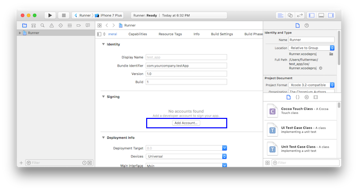

     任何Apple ID都支持开发和测试，但若想将应用分发到App Store，就必须注册Apple开发者计划，有关详情读者可以自行了解。

   - 当您第一次attach真机设备进行iOS开发时，需要同时信任你的Mac和该设备上的开发证书。首次将iOS设备连接到Mac时，请在对话框中选择 `Trust`。

     

     然后，转到iOS设备上的**设置**菜单，选择 **常规>设备管理** 并信任您的证书。

   - 如果Xcode中的自动签名失败，请验证项目的 **General > Identity > Bundle Identifier** 值是否唯一，如图1-7所示：

     

   - 运行 `flutter run`启动flutter应用程序。

## 注解

### @required

必传参数添加`@required` 注解

```dart
// text 为必传参数
Echo({
    Key key,  
    @required this.text
});
```


## 第一个 Flutter 应用

### 项目目录结构


### 计数器应用示例

了解 `Flutter` 应用程序基本结构

#### 创建Flutter应用模板

通过Android Studio或VS Code创建一个新的Flutter工程，命名为"first_flutter_app"。创建好后，就会得到一个计数器应用的Demo。

在这个示例中，主要Dart代码是在 **lib/main.dart** 文件中，下面是它的源码：

```dart
import 'package:flutter/material.dart';

void main() => runApp(new MyApp());

class MyApp extends StatelessWidget {
  @override
  Widget build(BuildContext context) {
    return new MaterialApp(
      title: 'Flutter Demo',
      theme: new ThemeData(
        primarySwatch: Colors.blue,
      ),
      home: new MyHomePage(title: 'Flutter Demo Home Page'),
    );
  }
}

class MyHomePage extends StatefulWidget {
  MyHomePage({Key key, this.title}) : super(key: key);
  final String title;

  @override
  _MyHomePageState createState() => new _MyHomePageState();
}

class _MyHomePageState extends State<MyHomePage> {
  int _counter = 0;

  void _incrementCounter() {
    setState(() {
      _counter++;
    });
  }

  @override
  Widget build(BuildContext context) {
    return new Scaffold(
      appBar: new AppBar(
        title: new Text(widget.title),
      ),
      body: new Center(
        child: new Column(
          mainAxisAlignment: MainAxisAlignment.center,
          children: <Widget>[
            new Text(
              'You have pushed the button this many times:',
            ),
            new Text(
              '$_counter',
              style: Theme.of(context).textTheme.display1,
            ),
          ],
        ),
      ),
      floatingActionButton: new FloatingActionButton(
        onPressed: _incrementCounter,
        tooltip: 'Increment',
        child: new Icon(Icons.add),
      ), // This trailing comma makes auto-formatting nicer for build methods.
    );
  }
}
```

##### 分析

1. 导入包。

   ```dart
   import 'package:flutter/material.dart';
   ```

   此行代码作用是导入了Material UI组件库。[Material](https://material.io/guidelines/)是一种标准的移动端和web端的视觉设计语言， Flutter默认提供了一套丰富的Material风格的UI组件。

2. 应用入口。

   ```dart
   void main() => runApp(MyApp());
   ```

   - 与C/C++、Java类似，Flutter 应用中`main`函数为应用程序的入口。`main`函数中调用了`runApp` 方法，它的功能是启动Flutter应用。`runApp`它接受一个`Widget`参数，在本示例中它是一个`MyApp`对象，`MyApp()`是Flutter应用的根组件。
   - `main`函数使用了(`=>`)符号，这是Dart中单行函数或方法的简写。

3. 应用结构。

   ```dart
   class MyApp extends StatelessWidget {
     @override
     Widget build(BuildContext context) {
       return new MaterialApp(
         //应用名称  
         title: 'Flutter Demo', 
         theme: new ThemeData(
           //蓝色主题  
           primarySwatch: Colors.blue,
         ),
         //应用首页路由  
         home: new MyHomePage(title: 'Flutter Demo Home Page'),
       );
     }
   }
   ```

   - `MyApp`类代表Flutter应用，它继承了 `StatelessWidget`类，这也就意味着应用本身也是一个widget。
   - 在Flutter中，大多数东西都是widget（后同“组件”或“部件”），包括对齐(alignment)、填充(padding)和布局(layout)等，它们都是以widget的形式提供。
   - Flutter在构建页面时，会调用组件的`build`方法，widget的主要工作是提供一个build()方法来描述如何构建UI界面（通常是通过组合、拼装其它基础widget）。
   - `MaterialApp` 是Material库中提供的Flutter APP框架，通过它可以设置应用的名称、主题、语言、首页及路由列表等。`MaterialApp`也是一个widget。
   - `Scaffold` 是Material库中提供的页面脚手架，它包含导航栏和Body以及`FloatingActionButton`（如果需要的话）。 本书后面示例中，路由默认都是通过`Scaffold`创建。
   - `home` 为Flutter应用的首页，它也是一个widget。

#### 首页

```dart
   class MyHomePage extends StatefulWidget {
     MyHomePage({Key key, this.title}) : super(key: key);
     final String title;
     @override
     _MyHomePageState createState() => new _MyHomePageState();
   }

   class _MyHomePageState extends State<MyHomePage> {
    ...
   }
```

`MyHomePage` 是Flutter应用的首页，它继承自`StatefulWidget`类，表示它是一个有状态的组件（Stateful widget）。关于Stateful widget我们将在第三章“Widget简介”一节仔细介绍，现在我们只需简单认为有状态的组件（Stateful widget） 和无状态的组件（Stateless widget）有两点不同：

1. Stateful widget可以拥有状态，这些状态在widget生命周期中是可以变的，而Stateless widget是不可变的。

2. Stateful widget至少由两个类组成：

   - 一个`StatefulWidget`类。
   - 一个 `State`类； `StatefulWidget`类本身是不变的，但是`State`类中持有的状态在widget生命周期中可能会发生变化。

   `_MyHomePageState`类是`MyHomePage`类对应的状态类。看到这里，读者可能已经发现：和`MyApp` 类不同， `MyHomePage`类中并没有`build`方法，取而代之的是，`build`方法被挪到了`_MyHomePageState`方法中，至于为什么这么做，先留个疑问，在分析完完整代码后再来解答。

##### State类

接下来，我们看看`_MyHomePageState`中都包含哪些东西：

1. 该组件的状态。由于我们只需要维护一个点击次数计数器，所以定义一个`_counter`状态：

   ```dart
   int _counter = 0; //用于记录按钮点击的总次数
   ```

   `_counter` 为保存屏幕右下角带“+”号按钮点击次数的状态。

2. 设置状态的自增函数。

   ```dart
   void _incrementCounter() {
     setState(() {
        _counter++;
     });
   }
   ```

   当按钮点击时，会调用此函数，该函数的作用是先自增`_counter`，然后调用`setState` 方法。`setState`方法的作用是通知Flutter框架，有状态发生了改变，Flutter框架收到通知后，会执行`build`方法来根据新的状态重新构建界面， Flutter 对此方法做了优化，使重新执行变的很快，所以你可以重新构建任何需要更新的东西，而无需分别去修改各个widget。

3. 构建UI界面

   构建UI界面的逻辑在`build`方法中，当`MyHomePage`第一次创建时，`_MyHomePageState`类会被创建，当初始化完成后，Flutter框架会调用Widget的`build`方法来构建widget树，最终将widget树渲染到设备屏幕上。所以，我们看看`_MyHomePageState`的`build`方法中都干了什么事：

   ```dart
     Widget build(BuildContext context) {
       return new Scaffold(
         appBar: new AppBar(
           title: new Text(widget.title),
         ),
         body: new Center(
           child: new Column(
             mainAxisAlignment: MainAxisAlignment.center,
             children: <Widget>[
               new Text(
                 'You have pushed the button this many times:',
               ),
               new Text(
                 '$_counter',
                 style: Theme.of(context).textTheme.display1,
               ),
             ],
           ),
         ),
         floatingActionButton: new FloatingActionButton(
           onPressed: _incrementCounter,
           tooltip: 'Increment',
           child: new Icon(Icons.add),
         ),
       );
     }
   ```

   - `Scaffold` 是 Material组件库中提供的一个组件，它提供了默认的导航栏、标题和包含主屏幕widget树（后同“组件树”或“部件树”）的`body`属性。组件树可以很复杂。
   - `body`的组件树中包含了一个`Center` 组件，`Center` 可以将其子组件树对齐到屏幕中心。此例中， `Center` 子组件是一个`Column` 组件，`Column`的作用是将其所有子组件沿屏幕垂直方向依次排列； 此例中`Column`子组件是两个 `Text`，第一个`Text` 显示固定文本 “You have pushed the button this many times:”，第二个`Text` 显示`_counter`状态的数值。
   - `floatingActionButton`是页面右下角的带“+”的悬浮按钮，它的`onPressed`属性接受一个回调函数，代表它被点击后的处理器，本例中直接将`_incrementCounter`方法作为其处理函数。

现在，我们将整个计数器执行流程串起来：当右下角的`floatingActionButton`按钮被点击之后，会调用`_incrementCounter`方法。在`_incrementCounter`方法中，首先会自增`_counter`计数器（状态），然后`setState`会通知Flutter框架状态发生变化，接着，Flutter框架会调用`build`方法以新的状态重新构建UI，最终显示在设备屏幕上。

### 路由管理

路由(Route)在移动开发中通常指页面（Page），这跟web开发中单页应用的Route概念意义是相同的，Route在Android中通常指一个Activity，在iOS中指一个ViewController。所谓路由管理，就是管理页面之间如何跳转，通常也可被称为导航管理。Flutter中的路由管理和原生开发类似，无论是Android还是iOS，导航管理都会维护一个路由栈，路由入栈(push)操作对应打开一个新页面，路由出栈(pop)操作对应页面关闭操作，而路由管理主要是指如何来管理路由栈。

####  一个简单示例

我们在上一节“计数器”示例的基础上，做如下修改：

1. 创建一个新路由，命名“NewRoute”

   ```dart
   class NewRoute extends StatelessWidget {
     @override
     Widget build(BuildContext context) {
       return Scaffold(
         appBar: AppBar(
           title: Text("New route"),
         ),
         body: Center(
           child: Text("This is new route"),
         ),
       );
     }
   }
   ```

   新路由继承自`StatelessWidget`，界面很简单，在页面中间显示一句"This is new route"。

2. 在`_MyHomePageState.build`方法中的`Column`的子widget中添加一个按钮（`FlatButton`） :

   ```dart
   Column(
         mainAxisAlignment: MainAxisAlignment.center,
         children: <Widget>[
         ... //省略无关代码
         FlatButton(
            child: Text("open new route"),
            textColor: Colors.blue,
            onPressed: () {
             //导航到新路由   
             Navigator.push( context,
              MaterialPageRoute(builder: (context) {
                 return NewRoute();
              }));
             },
            ),
          ],
    )
   ```

   我们添加了一个打开新路由的按钮，并将按钮文字颜色设置为蓝色，点击该按钮后就会打开新的路由页面，效果如图2-2和2-3所示。

    

#### MaterialPageRoute

`MaterialPageRoute`继承自`PageRoute`类，`PageRoute`类是一个抽象类，表示占有整个屏幕空间的一个模态路由页面，它还定义了路由构建及切换时过渡动画的相关接口及属性。`MaterialPageRoute` 是Material组件库提供的组件，它可以针对不同平台，实现与平台页面切换动画风格一致的路由切换动画：

- 对于Android，当打开新页面时，新的页面会从屏幕底部滑动到屏幕顶部；当关闭页面时，当前页面会从屏幕顶部滑动到屏幕底部后消失，同时上一个页面会显示到屏幕上。
- 对于iOS，当打开页面时，新的页面会从屏幕右侧边缘一致滑动到屏幕左边，直到新页面全部显示到屏幕上，而上一个页面则会从当前屏幕滑动到屏幕左侧而消失；当关闭页面时，正好相反，当前页面会从屏幕右侧滑出，同时上一个页面会从屏幕左侧滑入。

下面我们介绍一下`MaterialPageRoute` 构造函数的各个参数的意义：

```dart
  MaterialPageRoute({
    WidgetBuilder builder,
    RouteSettings settings,
    bool maintainState = true,
    bool fullscreenDialog = false,
  })
```

- `builder` 是一个WidgetBuilder类型的回调函数，它的作用是构建路由页面的具体内容，返回值是一个widget。我们通常要实现此回调，返回新路由的实例。
- `settings` 包含路由的配置信息，如路由名称、是否初始路由（首页）。
- `maintainState`：默认情况下，当入栈一个新路由时，原来的路由仍然会被保存在内存中，如果想在路由没用的时候释放其所占用的所有资源，可以设置`maintainState`为false。
- `fullscreenDialog`表示新的路由页面是否是一个全屏的模态对话框，在iOS中，如果`fullscreenDialog`为`true`，新页面将会从屏幕底部滑入（而不是水平方向）。

#### Navigator

`Navigator`是一个路由管理的组件，它提供了打开和退出路由页方法。`Navigator`通过一个栈来管理活动路由集合。通常当前屏幕显示的页面就是栈顶的路由。`Navigator`提供了一系列方法来管理路由栈，在此我们只介绍其最常用的两个方法：

##### Future push(BuildContext context, Route route)

将给定的路由入栈（即打开新的页面），返回值是一个`Future`对象，用以接收新路由出栈（即关闭）时的返回数据。

##### bool pop(BuildContext context, [ result ])

将栈顶路由出栈，`result`为页面关闭时返回给上一个页面的数据。

`Navigator` 还有很多其它方法，如`Navigator.replace`、`Navigator.popUntil`等，详情请参考API文档或SDK源码注释，在此不再赘述。下面我们还需要介绍一下路由相关的另一个概念“命名路由”。

##### 实例方法

Navigator类中第一个参数为context的**静态方法**都对应一个Navigator的**实例方法**， 比如`Navigator.push(BuildContext context, Route route)`等价于`Navigator.of(context).push(Route route)` ，下面命名路由相关的方法也是一样的。

#### 路由传值

很多时候，在路由跳转时我们需要带一些参数，比如打开商品详情页时，我们需要带一个商品id，这样商品详情页才知道展示哪个商品信息；又比如我们在填写订单时需要选择收货地址，打开地址选择页后，可以将用户选择的地址返回到订单页等等。下面我们通过一个简单的示例来演示新旧路由如何传参。

##### 示例

我们创建一个`TipRoute`路由，它接受一个提示文本参数，负责将传入它的文本显示在页面上，另外`TipRoute`中我们添加一个“返回”按钮，点击后在返回上一个路由的同时会带上一个返回参数，下面我们看一下实现代码。

`TipRoute`实现代码：

```dart
class TipRoute extends StatelessWidget {
  TipRoute({
    Key key,
    @required this.text,  // 接收一个text参数
  }) : super(key: key);
  final String text;

  @override
  Widget build(BuildContext context) {
    return Scaffold(
      appBar: AppBar(
        title: Text("提示"),
      ),
      body: Padding(
        padding: EdgeInsets.all(18),
        child: Center(
          child: Column(
            children: <Widget>[
              Text(text),
              RaisedButton(
                onPressed: () => Navigator.pop(context, "我是返回值"),
                child: Text("返回"),
              )
            ],
          ),
        ),
      ),
    );
  }
}
```

下面是打开新路由`TipRoute`的代码：

```dart
class RouterTestRoute extends StatelessWidget {
  @override
  Widget build(BuildContext context) {
    return Center(
      child: RaisedButton(
        onPressed: () async {
          // 打开`TipRoute`，并等待返回结果
          var result = await Navigator.push(
            context,
            MaterialPageRoute(
              builder: (context) {
                return TipRoute(
                  // 路由参数
                  text: "我是提示xxxx",
                );
              },
            ),
          );
          //输出`TipRoute`路由返回结果
          print("路由返回值: $result");
        },
        child: Text("打开提示页"),
      ),
    );
  }
}
```

运行上面代码，点击`RouterTestRoute`页的“打开提示页”按钮，会打开`TipRoute`页，运行效果如图2-4所示下：


需要说明：

1. 提示文案“我是提示xxxx”是通过`TipRoute`的`text`参数传递给新路由页的。我们可以通过等待`Navigator.push(…)`返回的`Future`来获取新路由的返回数据。

2. 在`TipRoute`页中有两种方式可以返回到上一页；第一种方式时直接点击导航栏返回箭头，第二种方式是点击页面中的“返回”按钮。这两种返回方式的区别是前者不会返回数据给上一个路由，而后者会。下面是分别点击页面中的返回按钮和导航栏返回箭头后，`RouterTestRoute`页中`print`方法在控制台输出的内容：

   ```
   I/flutter (27896): 路由返回值: 我是返回值
   I/flutter (27896): 路由返回值: null
   ```

#### 命名路由

所谓“命名路由”（Named Route）即有名字的路由，我们可以先给路由起一个名字，然后就可以通过路由名字直接打开新的路由了，这为路由管理带来了一种直观、简单的方式。

##### 路由表

要想使用命名路由，我们必须先提供并注册一个路由表（routing table），这样应用程序才知道哪个名字与哪个路由组件相对应。其实注册路由表就是给路由起名字，路由表的定义如下：

```dart
Map<String, WidgetBuilder> routes;
```

它是一个`Map`，key为路由的名字，是个字符串；value是个`builder`回调函数，用于生成相应的路由widget。我们在通过路由名字打开新路由时，应用会根据路由名字在路由表中查找到对应的`WidgetBuilder`回调函数，然后调用该回调函数生成路由widget并返回。

##### 注册路由表

路由表的注册方式很简单，我们回到之前“计数器”的示例，然后在`MyApp`类的`build`方法中找到`MaterialApp`，添加`routes`属性，代码如下：

```dart
MaterialApp(
  title: 'Flutter Demo',
  theme: ThemeData(
    primarySwatch: Colors.blue,
  ),
  //注册路由表
  routes:{
   "new_page":(context)=>NewRoute(),
    ... // 省略其它路由注册信息
  } ,
  home: MyHomePage(title: 'Flutter Demo Home Page'),
);
```

现在我们就完成了路由表的注册。上面的代码中`home`路由并没有使用命名路由，如果我们也想将`home`注册为命名路由应该怎么做呢？其实很简单，直接看代码：

```dart
MaterialApp(
  title: 'Flutter Demo',
  initialRoute:"/", //名为"/"的路由作为应用的home(首页)
  theme: ThemeData(
    primarySwatch: Colors.blue,
  ),
  //注册路由表
  routes:{
   "new_page":(context)=>NewRoute(),
   "/":(context)=> MyHomePage(title: 'Flutter Demo Home Page'), //注册首页路由
  } 
);
```

可以看到，我们只需在路由表中注册一下`MyHomePage`路由，然后将其名字作为`MaterialApp`的`initialRoute`属性值即可，该属性决定应用的初始路由页是哪一个命名路由。

##### 通过路由名打开新路由页

要通过路由名称来打开新路由，可以使用`Navigator` 的`pushNamed`方法：

```dart
Future pushNamed(BuildContext context, String routeName,{Object arguments})
```

`Navigator` 除了`pushNamed`方法，还有`pushReplacementNamed`等其他管理命名路由的方法，读者可以自行查看API文档。接下来我们通过路由名来打开新的路由页，修改`FlatButton`的`onPressed`回调代码，改为：

```dart
onPressed: () {
  Navigator.pushNamed(context, "new_page");
  //Navigator.push(context,
  //  new MaterialPageRoute(builder: (context) {
  //  return new NewRoute();
  //}));  
},
```

热重载应用，再次点击“open new route”按钮，依然可以打开新的路由页。

##### 命名路由参数传递

在Flutter最初的版本中，命名路由是不能传递参数的，后来才支持了参数；下面展示命名路由如何传递并获取路由参数：

我们先注册一个路由：

```dart
 routes:{
   "new_page":(context)=>EchoRoute(),
  } ,
```

在路由页通过`RouteSetting`对象获取路由参数：

```dart
class EchoRoute extends StatelessWidget {

  @override
  Widget build(BuildContext context) {
    //获取路由参数  
    var args=ModalRoute.of(context).settings.arguments
    //...省略无关代码
  }
}
```

在打开路由时传递参数

```dart
Navigator.of(context).pushNamed("new_page", arguments: "hi");
```

##### 适配

假设我们也想将上面路由传参示例中的`TipRoute`路由页注册到路由表中，以便也可以通过路由名来打开它。但是，由于`TipRoute`接受一个`text` 参数，我们如何在不改变`TipRoute`源码的前提下适配这种情况？其实很简单：

```dart
MaterialApp(
  ... //省略无关代码
  routes: {
   "tip2": (context){
     return TipRoute(text: ModalRoute.of(context).settings.arguments);
   },
 }, 
);
```

#### 路由生成钩子

假设我们要开发一个电商APP，当用户没有登录时可以看店铺、商品等信息，但交易记录、购物车、用户个人信息等页面需要登录后才能看。为了实现上述功能，我们需要在打开每一个路由页前判断用户登录状态！如果每次打开路由前我们都需要去判断一下将会非常麻烦，那有什么更好的办法吗？答案是有！

`MaterialApp`有一个`onGenerateRoute`属性，它在打开命名路由时可能会被调用，之所以说可能，是因为当调用`Navigator.pushNamed(...)`打开命名路由时，如果指定的路由名在路由表中已注册，则会调用路由表中的`builder`函数来生成路由组件；如果路由表中没有注册，才会调用`onGenerateRoute`来生成路由。`onGenerateRoute`回调签名如下：

```dart
Route<dynamic> Function(RouteSettings settings)
```

有了`onGenerateRoute`回调，要实现上面控制页面权限的功能就非常容易：我们放弃使用路由表，取而代之的是提供一个`onGenerateRoute`回调，然后在该回调中进行统一的权限控制，如：

```dart
MaterialApp(
  ... //省略无关代码
  onGenerateRoute:(RouteSettings settings){
      return MaterialPageRoute(builder: (context){
           String routeName = settings.name;
       // 如果访问的路由页需要登录，但当前未登录，则直接返回登录页路由，
       // 引导用户登录；其它情况则正常打开路由。
     }
   );
  }
);
```

> 注意，`onGenerateRoute`只会对命名路由生效。

#### 总结

本章先介绍了Flutter中路由管理、传参的方式，然后又着重介绍了命名路由相关内容。在此需要说明一点，由于命名路由只是一种可选的路由管理方式，在实际开发中，读者可能心中会犹豫到底使用哪种路由管理方式。在此，根据笔者经验，建议读者最好统一使用命名路由的管理方式，这将会带来如下好处：

1. 语义化更明确。
2. 代码更好维护；如果使用匿名路由，则必须在调用`Navigator.push`的地方创建新路由页，这样不仅需要import新路由页的dart文件，而且这样的代码将会非常分散。
3. 可以通过`onGenerateRoute`做一些全局的路由跳转前置处理逻辑。

### 包管理

在软件开发中，很多时候有一些公共的库或SDK可能会被很多项目用到，因此，将这些代码单独抽到一个独立模块，然后哪个项目需要使用时再直接集成这个模块，便可大大提高开发效率。很多编程语言或开发工具都支持这种“模块共享”机制，如Java语言中这种独立模块会被打成一个jar包，Android中的aar包，Web开发中的npm包等。为了方便表述，我们将这种可共享的独立模块统一称为“包”（ Package）。

一个APP在实际开发中往往会依赖很多包，而这些包通常都有交叉依赖关系、版本依赖等，如果由开发者手动来管理应用中的依赖包将会非常麻烦。因此，各种开发生态或编程语言官方通常都会提供一些包管理工具，比如在Android提供了Gradle来管理依赖，iOS用Cocoapods或Carthage来管理依赖，Node中通过npm等。而在Flutter开发中也有自己的包管理工具。本节我们主要介绍一下flutter如何使用配置文件`pubspec.yaml`（位于项目根目录）来管理第三方依赖包。

YAML是一种直观、可读性高并且容易被人类阅读的文件格式，它和xml或Json相比，它语法简单并非常容易解析，所以YAML常用于配置文件，Flutter也是用yaml文件作为其配置文件。Flutter项目默认的配置文件是`pubspec.yaml`，我们看一个简单的示例：

```yaml
name: flutter_in_action
description: First Flutter application.

version: 1.0.0+1

dependencies:
  flutter:
    sdk: flutter
  cupertino_icons: ^0.1.2

dev_dependencies:
  flutter_test:
    sdk: flutter

flutter:
  uses-material-design: true
```

下面，我们逐一解释一下各个字段的意义：

- `name`：应用或包名称。
- `description`: 应用或包的描述、简介。
- `version`：应用或包的版本号。
- `dependencies`：应用或包依赖的其它包或插件。
- `dev_dependencies`：开发环境依赖的工具包（而不是flutter应用本身依赖的包）。
- `flutter`：flutter相关的配置选项。

如果我们的Flutter应用本身依赖某个包，我们需要将所依赖的包添加到`dependencies` 下，接下来我们通过一个例子来演示一下如何添加、下载并使用第三方包。

#### Pub仓库

Pub（https://pub.dartlang.org/ ）是Google官方的Dart Packages仓库，类似于node中的npm仓库，android中的jcenter。我们可以在Pub上面查找我们需要的包和插件，也可以向Pub发布我们的包和插件。我们将在后面的章节中介绍如何向Pub发布我们的包和插件。

#### 示例

接下来，我们实现一个显示随机字符串的widget。有一个名为“english_words”的开源软件包，其中包含数千个常用的英文单词以及一些实用功能。我们首先在pub上找到english_words这个包（如图2-5所示），确定其最新的版本号和是否支持Flutter。


我们看到“english_words”包最新的版本是3.1.3，并且支持flutter，接下来：

1. 将“english_words”（3.1.3版本）添加到依赖项列表，如下：

   ```yaml
   dependencies:
     flutter:
       sdk: flutter
   
     cupertino_icons: ^0.1.0
     # 新添加的依赖
     english_words: ^3.1.3
   ```

2. 下载包。在Android Studio的编辑器视图中查看pubspec.yaml时（图2-6），单击右上角的 **Packages get** 。

   

   这会将依赖包安装到您的项目。我们可以在控制台中看到以下内容：

   ```shell
   flutter packages get
   Running "flutter packages get" in flutter_in_action...
   Process finished with exit code 0
   ```

   我们也可以在控制台，定位到当前工程目录，然后手动运行`flutter packages get` 命令来下载依赖包。另外，需要注意`dependencies`和`dev_dependencies`的区别，前者的依赖包将作为APP的源码的一部分参与编译，生成最终的安装包。而后者的依赖包只是作为开发阶段的一些工具包，主要是用于帮助我们提高开发、测试效率，比如flutter的自动化测试包等。

3. 引入`english_words`包。

   ```dart
   import 'package:english_words/english_words.dart';
   ```

   在输入时，Android Studio会自动提供有关库导入的建议选项。导入后该行代码将会显示为灰色，表示导入的库尚未使用。

4. 使用`english_words`包来生成随机字符串。

   ```dart
   class RandomWordsWidget extends StatelessWidget {
     @override
     Widget build(BuildContext context) {
      // 生成随机字符串
       final wordPair = new WordPair.random();
       return Padding(
         padding: const EdgeInsets.all(8.0),
         child: new Text(wordPair.toString()),
       );
     }
   }
   ```

   我们将`RandomWordsWidget` 添加到 `_MyHomePageState.build` 的`Column`的子widget中。

   ```dart
   Column(
     mainAxisAlignment: MainAxisAlignment.center,
     children: <Widget>[
       ... //省略无关代码
       RandomWordsWidget(),
     ],
   )
   ```

5. 如果应用程序正在运行，请使用热重载按钮（⚡️图标） 更新正在运行的应用程序。每次单击热重载或保存项目时，都会在正在运行的应用程序中随机选择不同的单词对。 这是因为单词对是在 `build` 方法内部生成的。每次热更新时，`build`方法都会被执行，运行效果如图2-7所示。

   

#### 其它依赖方式

上文所述的依赖方式是依赖Pub仓库的。但我们还可以依赖本地包和git仓库。

- 依赖本地包

  如果我们正在本地开发一个包，包名为pkg1，我们可以通过下面方式依赖：

  ```yaml
  dependencies:
      pkg1:
          path: ../../code/pkg1
  ```

  路径可以是相对的，也可以是绝对的。

- 依赖Git：你也可以依赖存储在Git仓库中的包。如果软件包位于仓库的根目录中，请使用以下语法

  ```yaml
  dependencies:
    pkg1:
      git:
        url: git://github.com/xxx/pkg1.git
  ```

  上面假定包位于Git存储库的根目录中。如果不是这种情况，可以使用path参数指定相对位置，例如：

  ```yaml
  dependencies:
    package1:
      git:
        url: git://github.com/flutter/packages.git
        path: packages/package1
  ```

上面介绍的这些依赖方式是Flutter开发中常用的，但还有一些其它依赖方式，完整的内容读者可以自行查看：https://www.dartlang.org/tools/pub/dependencies 。

### 调试Flutter应用

有各种各样的工具和功能来帮助调试Flutter应用程序。

#### Dart 分析器

在运行应用程序前，请运行`flutter analyze`测试你的代码。这个工具是一个静态代码检查工具，它是`dartanalyzer`工具的一个包装，主要用于分析代码并帮助开发者发现可能的错误，比如，Dart分析器大量使用了代码中的类型注释来帮助追踪问题，避免`var`、无类型的参数、无类型的列表文字等。

如果你使用IntelliJ的Flutter插件，那么分析器在打开IDE时就已经自动启用了，如果读者使用的是其它IDE，强烈建议读者启用Dart 分析器，因为在大多数时候，Dart 分析器可以在代码运行前发现大多数问题。

#### Dart Observatory (语句级的单步调试和分析器)

如果我们使用`flutter run`启动应用程序，那么当它运行时，我们可以打开Observatory工具的Web页面，例如Observatory默认监听http://127.0.0.1:8100/，可以在浏览器中直接打开该链接。直接使用语句级单步调试器连接到您的应用程序。如果您使用的是IntelliJ，则还可以使用其内置的调试器来调试您的应用程序。

Observatory 同时支持分析、检查堆等。有关Observatory的更多信息请参考[Observatory 文档](https://dart-lang.github.io/observatory/)。

如果您使用Observatory进行分析，请确保通过`--profile`选项来运行`flutter run`命令来运行应用程序。 否则，配置文件中将出现的主要问题将是调试断言，以验证框架的各种不变量（请参阅下面的“调试模式断言”）。

#### `debugger()` 声明

当使用Dart Observatory（或另一个Dart调试器，例如IntelliJ IDE中的调试器）时，可以使用该`debugger()`语句插入编程式断点。要使用这个，你必须添加`import 'dart:developer';`到相关文件顶部。

`debugger()`语句采用一个可选`when`参数，您可以指定该参数仅在特定条件为真时中断，如下所示：

```dart
void someFunction(double offset) {
  debugger(when: offset > 30.0);
  // ...
}
```

#### `print`、`debugPrint`、`flutter logs`

Dart `print()`功能将输出到系统控制台，您可以使用`flutter logs`来查看它（基本上是一个包装`adb logcat`）。

如果你一次输出太多，那么Android有时会丢弃一些日志行。为了避免这种情况，您可以使用Flutter的`foundation`库中的[`debugPrint()`](https://docs.flutter.io/flutter/foundation/debugPrint.html)。 这是一个封装print，它将输出限制在一个级别，避免被Android内核丢弃。

Flutter框架中的许多类都有`toString`实现。按照惯例，这些输出通常包括对象的`runtimeType`单行输出，通常在表单中ClassName(more information about this instance…)。 树中使用的一些类也具有`toStringDeep`，从该点返回整个子树的多行描述。已一些具有详细信息`toString`的类会实现一个`toStringShort`，它只返回对象的类型或其他非常简短的（一个或两个单词）描述。

#### 调试模式断言

在Flutter应用调试过程中，Dart `assert`语句被启用，并且Flutter框架使用它来执行许多运行时检查来验证是否违反一些不可变的规则。

当一个不可变的规则被违反时，它被报告给控制台，并带有一些上下文信息来帮助追踪问题的根源。

要关闭调试模式并使用发布模式，请使用`flutter run --release`运行您的应用程序。 这也关闭了Observatory调试器。一个中间模式可以关闭除Observatory之外所有调试辅助工具的，称为“profile mode”，用`--profile`替代`--release`即可。

#### 调试应用程序层

Flutter框架的每一层都提供了将其当前状态或事件转储(dump)到控制台（使用`debugPrint`）的功能。

##### Widget 树

要转储Widgets树的状态，请调用[`debugDumpApp()`](https://docs.flutter.io/flutter/widgets/debugDumpApp.html)。 只要应用程序已经构建了至少一次（即在调用`build()`之后的任何时间），您可以在应用程序未处于构建阶段（即，不在`build()`方法内调用 ）的任何时间调用此方法（在调用`runApp()`之后）。

如, 这个应用程序:

```dart
import 'package:flutter/material.dart';

void main() {
  runApp(
    new MaterialApp(
      home: new AppHome(),
    ),
  );
}

class AppHome extends StatelessWidget {
  @override
  Widget build(BuildContext context) {
    return new Material(
      child: new Center(
        child: new FlatButton(
          onPressed: () {
            debugDumpApp();
          },
          child: new Text('Dump App'),
        ),
      ),
    );
  }
}
```

…会输出这样的内容（精确的细节会根据框架的版本、设备的大小等等而变化）：

```shell
I/flutter ( 6559): WidgetsFlutterBinding - CHECKED MODE
I/flutter ( 6559): RenderObjectToWidgetAdapter<RenderBox>([GlobalObjectKey RenderView(497039273)]; renderObject: RenderView)
I/flutter ( 6559): └MaterialApp(state: _MaterialAppState(1009803148))
I/flutter ( 6559):  └ScrollConfiguration()
I/flutter ( 6559):   └AnimatedTheme(duration: 200ms; state: _AnimatedThemeState(543295893; ticker inactive; ThemeDataTween(ThemeData(Brightness.light Color(0xff2196f3) etc...) → null)))
I/flutter ( 6559):    └Theme(ThemeData(Brightness.light Color(0xff2196f3) etc...))
I/flutter ( 6559):     └WidgetsApp([GlobalObjectKey _MaterialAppState(1009803148)]; state: _WidgetsAppState(552902158))
I/flutter ( 6559):      └CheckedModeBanner()
I/flutter ( 6559):       └Banner()
I/flutter ( 6559):        └CustomPaint(renderObject: RenderCustomPaint)
I/flutter ( 6559):         └DefaultTextStyle(inherit: true; color: Color(0xd0ff0000); family: "monospace"; size: 48.0; weight: 900; decoration: double Color(0xffffff00) TextDecoration.underline)
I/flutter ( 6559):          └MediaQuery(MediaQueryData(size: Size(411.4, 683.4), devicePixelRatio: 2.625, textScaleFactor: 1.0, padding: EdgeInsets(0.0, 24.0, 0.0, 0.0)))
I/flutter ( 6559):           └LocaleQuery(null)
I/flutter ( 6559):            └Title(color: Color(0xff2196f3))
... #省略剩余内容
```

这是一个“扁平化”的树，显示了通过各种构建函数投影的所有widget（如果你在widget树的根中调用`toStringDeepwidget`，这是你获得的树）。 你会看到很多在你的应用源代码中没有出现的widget，因为它们是被框架中widget的`build()`函数插入的。例如，[`InkFeature`](https://docs.flutter.io/flutter/material/InkFeature-class.html)是Material widget的一个实现细节 。

当按钮从被按下变为被释放时debugDumpApp()被调用，FlatButton对象同时调用`setState()`，并将自己标记为"dirty"。 这就是为什么如果你看转储，你会看到特定的对象标记为“dirty”。您还可以查看已注册了哪些手势监听器; 在这种情况下，一个单一的GestureDetector被列出，并且监听“tap”手势（“tap”是`TapGestureDetector`的`toStringShort`函数输出的）

如果您编写自己的widget，则可以通过覆盖[`debugFillProperties()`](https://docs.flutter.io/flutter/widgets/Widget/debugFillProperties.html)来添加信息。 将[DiagnosticsProperty](https://docs.flutter.io/flutter/foundation/DiagnosticsProperty-class.html)对象作为方法参数，并调用父类方法。 该函数是该`toString`方法用来填充小部件描述信息的。

##### 渲染树

如果您尝试调试布局问题，那么Widget树可能不够详细。在这种情况下，您可以通过调用`debugDumpRenderTree()`转储渲染树。 正如`debugDumpApp()`，除布局或绘制阶段外，您可以随时调用此函数。作为一般规则，从[frame 回调](https://docs.flutter.io/flutter/scheduler/SchedulerBinding/addPersistentFrameCallback.html) 或事件处理器中调用它是最佳解决方案。

要调用`debugDumpRenderTree()`，您需要添加`import'package:flutter/rendering.dart';`到您的源文件。

上面这个小例子的输出结果如下所示：

```shell
I/flutter ( 6559): RenderView
I/flutter ( 6559):  │ debug mode enabled - android
I/flutter ( 6559):  │ window size: Size(1080.0, 1794.0) (in physical pixels)
I/flutter ( 6559):  │ device pixel ratio: 2.625 (physical pixels per logical pixel)
I/flutter ( 6559):  │ configuration: Size(411.4, 683.4) at 2.625x (in logical pixels)
I/flutter ( 6559):  │
I/flutter ( 6559):  └─child: RenderCustomPaint
I/flutter ( 6559):    │ creator: CustomPaint ← Banner ← CheckedModeBanner ←
I/flutter ( 6559):    │   WidgetsApp-[GlobalObjectKey _MaterialAppState(1009803148)] ←
I/flutter ( 6559):    │   Theme ← AnimatedTheme ← ScrollConfiguration ← MaterialApp ←
I/flutter ( 6559):    │   [root]
I/flutter ( 6559):    │ parentData: <none>
I/flutter ( 6559):    │ constraints: BoxConstraints(w=411.4, h=683.4)
I/flutter ( 6559):    │ size: Size(411.4, 683.4)
... # 省略
```

这是根`RenderObject`对象的`toStringDeep`函数的输出。

当调试布局问题时，关键要看的是`size`和`constraints`字段。约束沿着树向下传递，尺寸向上传递。

如果您编写自己的渲染对象，则可以通过覆盖[`debugFillProperties()`](https://docs.flutter.io/flutter/rendering/Layer/debugFillProperties.html)将信息添加到转储。 将[DiagnosticsProperty](https://docs.flutter.io/flutter/foundation/DiagnosticsProperty-class.html)对象作为方法的参数，并调用父类方法。

##### Layer树

读者可以理解为渲染树是可以分层的，而最终绘制需要将不同的层合成起来，而Layer则是绘制时需要合成的层，如果您尝试调试合成问题，则可以使用[`debugDumpLayerTree()`](https://docs.flutter.io/flutter/rendering/debugDumpLayerTree.html)。对于上面的例子，它会输出：

```
I/flutter : TransformLayer
I/flutter :  │ creator: [root]
I/flutter :  │ offset: Offset(0.0, 0.0)
I/flutter :  │ transform:
I/flutter :  │   [0] 3.5,0.0,0.0,0.0
I/flutter :  │   [1] 0.0,3.5,0.0,0.0
I/flutter :  │   [2] 0.0,0.0,1.0,0.0
I/flutter :  │   [3] 0.0,0.0,0.0,1.0
I/flutter :  │
I/flutter :  ├─child 1: OffsetLayer
I/flutter :  │ │ creator: RepaintBoundary ← _FocusScope ← Semantics ← Focus-[GlobalObjectKey MaterialPageRoute(560156430)] ← _ModalScope-[GlobalKey 328026813] ← _OverlayEntry-[GlobalKey 388965355] ← Stack ← Overlay-[GlobalKey 625702218] ← Navigator-[GlobalObjectKey _MaterialAppState(859106034)] ← Title ← ⋯
I/flutter :  │ │ offset: Offset(0.0, 0.0)
I/flutter :  │ │
I/flutter :  │ └─child 1: PictureLayer
I/flutter :  │
I/flutter :  └─child 2: PictureLayer
```

这是根`Layer`的`toStringDeep`输出的。

根部的变换是应用设备像素比的变换; 在这种情况下，每个逻辑像素代表3.5个设备像素。

`RepaintBoundary` widget在渲染树的层中创建了一个`RenderRepaintBoundary`。这用于减少需要重绘的需求量。

#### 语义

您还可以调用[`debugDumpSemanticsTree()`](https://docs.flutter.io/flutter/rendering/debugDumpSemanticsTree.html)获取语义树（呈现给系统可访问性API的树）的转储。 要使用此功能，必须首先启用辅助功能，例如启用系统辅助工具或`SemanticsDebugger` （下面讨论）。

对于上面的例子，它会输出:

```
I/flutter : SemanticsNode(0; Rect.fromLTRB(0.0, 0.0, 411.4, 683.4))
I/flutter :  ├SemanticsNode(1; Rect.fromLTRB(0.0, 0.0, 411.4, 683.4))
I/flutter :  │ └SemanticsNode(2; Rect.fromLTRB(0.0, 0.0, 411.4, 683.4); canBeTapped)
I/flutter :  └SemanticsNode(3; Rect.fromLTRB(0.0, 0.0, 411.4, 683.4))
I/flutter :    └SemanticsNode(4; Rect.fromLTRB(0.0, 0.0, 82.0, 36.0); canBeTapped; "Dump App")
```

#### 调度

要找出相对于帧的开始/结束事件发生的位置，可以切换[`debugPrintBeginFrameBanner`](https://docs.flutter.io/flutter/scheduler/debugPrintBeginFrameBanner.html)和[`debugPrintEndFrameBanner`](https://docs.flutter.io/flutter/scheduler/debugPrintEndFrameBanner.html)布尔值以将帧的开始和结束打印到控制台。

例如:

```
I/flutter : ▄▄▄▄▄▄▄▄ Frame 12         30s 437.086ms ▄▄▄▄▄▄▄▄
I/flutter : Debug print: Am I performing this work more than once per frame?
I/flutter : Debug print: Am I performing this work more than once per frame?
I/flutter : ▀▀▀▀▀▀▀▀▀▀▀▀▀▀▀▀▀▀▀▀▀▀▀▀▀▀▀▀▀▀▀▀▀▀▀▀▀▀▀▀▀▀▀▀▀▀▀▀▀▀▀▀
```

[`debugPrintScheduleFrameStacks`](https://docs.flutter.io/flutter/scheduler/debugPrintScheduleFrameStacks.html)还可以用来打印导致当前帧被调度的调用堆栈。

#### 可视化调试

您也可以通过设置`debugPaintSizeEnabled`为`true`以可视方式调试布局问题。 这是来自`rendering`库的布尔值。它可以在任何时候启用，并在为true时影响绘制。 设置它的最简单方法是在`void main()`的顶部设置。

当它被启用时，所有的盒子都会得到一个明亮的深青色边框，padding（来自widget如Padding）显示为浅蓝色，子widget周围有一个深蓝色框， 对齐方式（来自widget如Center和Align）显示为黄色箭头. 空白（如没有任何子节点的Container）以灰色显示。

[`debugPaintBaselinesEnabled`](https://docs.flutter.io/flutter/rendering/debugPaintBaselinesEnabled.html)做了类似的事情，但对于具有基线的对象，文字基线以绿色显示，表意(ideographic)基线以橙色显示。

[`debugPaintPointersEnabled`](https://docs.flutter.io/flutter/rendering/debugPaintPointersEnabled.html)标志打开一个特殊模式，任何正在点击的对象都会以深青色突出显示。 这可以帮助您确定某个对象是否以某种不正确的方式进行hit测试（Flutter检测点击的位置是否有能响应用户操作的widget）,例如，如果它实际上超出了其父项的范围，首先不会考虑通过hit测试。

如果您尝试调试合成图层，例如以确定是否以及在何处添加`RepaintBoundary` widget，则可以使用[`debugPaintLayerBordersEnabled`](https://docs.flutter.io/flutter/rendering/debugPaintLayerBordersEnabled.html) 标志， 该标志用橙色或轮廓线标出每个层的边界，或者使用[`debugRepaintRainbowEnabled`](https://docs.flutter.io/flutter/rendering/debugRepaintRainbowEnabled.html)标志， 只要他们重绘时，这会使该层被一组旋转色所覆盖。

所有这些标志只能在调试模式下工作。通常，Flutter框架中以“`debug...`” 开头的任何内容都只能在调试模式下工作。

#### 调试动画

调试动画最简单的方法是减慢它们的速度。为此，请将[`timeDilation`](https://docs.flutter.io/flutter/scheduler/timeDilation.html)变量（在scheduler库中）设置为大于1.0的数字，例如50.0。 最好在应用程序启动时只设置一次。如果您在运行中更改它，尤其是在动画运行时将其值改小，则在观察时可能会出现倒退，这可能会导致断言命中，并且这通常会干扰我们的开发工作。

#### 调试性能问题

要了解您的应用程序导致重新布局或重新绘制的原因，您可以分别设置[`debugPrintMarkNeedsLayoutStacks`](https://docs.flutter.io/flutter/rendering/debugPrintMarkNeedsLayoutStacks.html)和 [`debugPrintMarkNeedsPaintStacks`](https://docs.flutter.io/flutter/rendering/debugPrintMarkNeedsPaintStacks.html)标志。 每当渲染盒被要求重新布局和重新绘制时，这些都会将堆栈跟踪记录到控制台。如果这种方法对您有用，您可以使用`services`库中的`debugPrintStack()`方法按需打印堆栈痕迹。

#### 统计应用启动时间

要收集有关Flutter应用程序启动所需时间的详细信息，可以在运行`flutter run`时使用`trace-startup`和`profile`选项。

```shell
$ flutter run --trace-startup --profile
```

跟踪输出保存为`start_up_info.json`，在Flutter工程目录在build目录下。输出列出了从应用程序启动到这些跟踪事件（以微秒捕获）所用的时间：

- 进入Flutter引擎时.
- 展示应用第一帧时.
- 初始化Flutter框架时.
- 完成Flutter框架初始化时.

如 :

```json
{
  "engineEnterTimestampMicros": 96025565262,
  "timeToFirstFrameMicros": 2171978,
  "timeToFrameworkInitMicros": 514585,
  "timeAfterFrameworkInitMicros": 1657393
}
```

#### 跟踪Dart代码性能

要执行自定义性能跟踪和测量Dart任意代码段的wall/CPU时间（类似于在Android上使用[systrace](https://developer.android.com/studio/profile/systrace.html)）。 使用`dart:developer`的[Timeline](https://api.dartlang.org/stable/dart-developer/Timeline-class.html)工具来包含你想测试的代码块，例如：

```dart
Timeline.startSync('interesting function');
// iWonderHowLongThisTakes();
Timeline.finishSync();
```

然后打开你应用程序的Observatory timeline页面，在“Recorded Streams”中选择‘Dart’复选框，并执行你想测量的功能。

刷新页面将在Chrome的[跟踪工具](https://www.chromium.org/developers/how-tos/trace-event-profiling-tool)中显示应用按时间顺序排列的timeline记录。

请确保运行`flutter run`时带有`--profile`标志，以确保运行时性能特征与您的最终产品差异最小。

### Flutter异常捕获

在介绍Flutter异常捕获之前必须先了解一下Dart单线程模型，只有了解了Dart的代码执行流程，我们才能知道该在什么地方去捕获异常。

#### 2.6.1 Dart单线程模型

如果程序发生异常且没有被捕获 `Dart` 程序**不会终止**。

`Dart` 是单线程模型

下面我们通过Dart官方提供的一张图来看看Dart大致运行原理：


Dart 在单线程中是以消息循环机制来运行的，其中包含两个任务队列：

1. “微任务队列” **microtask queue**

2. “事件队列” **event queue**

微任务队列的执行优先级高于事件队列。

现在我们来介绍一下Dart线程运行过程，如上图中所示，入口函数 main() 执行完后，消息循环机制便启动了。首先会按照先进先出的顺序逐个执行微任务队列中的任务，事件任务执行完毕后程序便会退出，但是，在事件任务执行的过程中也可以插入新的微任务和事件任务，在这种情况下，整个线程的执行过程便是一直在循环，不会退出，而Flutter中，主线程的执行过程正是如此，永不终止。

在Dart中，所有的外部事件任务都在事件队列中，如IO、计时器、点击、以及绘制事件等，而微任务通常来源于Dart内部，并且微任务非常少，之所以如此，是因为微任务队列优先级高，如果微任务太多，执行时间总和就越久，事件队列任务的延迟也就越久，对于GUI应用来说最直观的表现就是比较卡，所以必须得保证微任务队列不会太长。值得注意的是，我们可以通过`Future.microtask(…)`方法向微任务队列插入一个任务。

**在事件循环中，当某个任务发生异常并没有被捕获时，程序并不会退出，而直接导致的结果是当前任务的后续代码就不会被执行了，也就是说一个任务中的异常是不会影响其它任务执行的。**

#### 2.6.2 Flutter异常捕获

Dart中可以通过`try/catch/finally`来捕获代码块异常

##### Flutter框架异常捕获

Flutter 框架为我们在很多关键的方法进行了异常捕获。这里举一个例子，当我们布局发生越界或不合规范时，Flutter就会自动弹出一个错误界面，这是因为Flutter已经在执行build方法时添加了异常捕获，最终的源码如下：

```dart
@override
void performRebuild() {
 ...
  try {
    //执行build方法  
    built = build();
  } catch (e, stack) {
    // 有异常时则弹出错误提示  
    built = ErrorWidget.builder(_debugReportException('building $this', e, stack));
  } 
  ...
}
```

可以看到，在发生异常时，Flutter默认的处理方式是弹一个ErrorWidget，但如果我们想自己捕获异常并上报到报警平台的话应该怎么做？我们进入`_debugReportException()`方法看看：

```dart
FlutterErrorDetails _debugReportException(
  String context,
  dynamic exception,
  StackTrace stack, {
  InformationCollector informationCollector
}) {
  //构建错误详情对象  
  final FlutterErrorDetails details = FlutterErrorDetails(
    exception: exception,
    stack: stack,
    library: 'widgets library',
    context: context,
    informationCollector: informationCollector,
  );
  //报告错误 
  FlutterError.reportError(details);
  return details;
}
```

我们发现，错误是通过`FlutterError.reportError`方法上报的，继续跟踪：

```dart
static void reportError(FlutterErrorDetails details) {
  ...
  if (onError != null)
    onError(details); //调用了onError回调
}
```

我们发现`onError`是`FlutterError`的一个静态属性，它有一个默认的处理方法 `dumpErrorToConsole`，到这里就清晰了，如果我们想自己上报异常，只需要提供一个自定义的错误处理回调即可，如：

```dart
void main() {
  FlutterError.onError = (FlutterErrorDetails details) {
    reportError(details);
  };
 ...
}
```

这样我们就可以处理那些Flutter为我们捕获的异常了，接下来我们看看如何捕获其它异常。

##### 其它异常捕获与日志收集

在Flutter中，还有一些Flutter没有为我们捕获的异常，如调用空对象方法异常、Future中的异常。在Dart中，异常分两类：同步异常和异步异常，同步异常可以通过`try/catch`捕获，而异步异常则比较麻烦，如下面的代码是捕获不了`Future`的异常的：

```dart
try{
    Future.delayed(Duration(seconds: 1)).then((e) => Future.error("xxx"));
}catch (e){
    print(e)
}
```

Dart中有一个`runZoned(...)` 方法，可以给执行对象指定一个Zone。Zone表示一个代码执行的环境范围，为了方便理解，读者可以将Zone类比为一个代码执行沙箱，不同沙箱的之间是隔离的，沙箱可以捕获、拦截或修改一些代码行为，如Zone中可以捕获日志输出、Timer创建、微任务调度的行为，同时Zone也可以捕获所有未处理的异常。下面我们看看`runZoned(...)`方法定义：

```dart
R runZoned<R>(R body(), {
    Map zoneValues, 
    ZoneSpecification zoneSpecification,
    Function onError,
})
```

- `zoneValues`: Zone 的私有数据，可以通过实例`zone[key]`获取，可以理解为每个“沙箱”的私有数据。

- `zoneSpecification`：Zone的一些配置，可以自定义一些代码行为，比如拦截日志输出行为等，举个例子：

  下面是拦截应用中所有调用`print`输出日志的行为。

  ```dart
  main() {
    runZoned(() => runApp(MyApp()), zoneSpecification: new ZoneSpecification(
        print: (Zone self, ZoneDelegate parent, Zone zone, String line) {
          parent.print(zone, "Intercepted: $line");
        }),
    );
  }
  ```

  这样一来，我们APP中所有调用`print`方法输出日志的行为都会被拦截，通过这种方式，我们也可以在应用中记录日志，等到应用触发未捕获的异常时，将异常信息和日志统一上报。ZoneSpecification还可以自定义一些其他行为，读者可以查看API文档。

- `onError`：Zone中未捕获异常处理回调，如果开发者提供了onError回调或者通过`ZoneSpecification.handleUncaughtError`指定了错误处理回调，那么这个zone将会变成一个error-zone，该error-zone中发生未捕获异常(无论同步还是异步)时都会调用开发者提供的回调，如：

  ```dart
  runZoned(() {
      runApp(MyApp());
  }, onError: (Object obj, StackTrace stack) {
      var details=makeDetails(obj,stack);
      reportError(details);
  });
  ```

  这样一来，结合上面的`FlutterError.onError`我们就可以捕获我们Flutter应用中全部错误了！需要注意的是，error-zone内部发生的错误是不会跨越当前error-zone的边界的，如果想跨越error-zone边界去捕获异常，可以通过共同的“源”zone来捕获，如：

  ```dart
  var future = new Future.value(499);
  runZoned(() {
      var future2 = future.then((_) { throw "error in first error-zone"; });
      runZoned(() {
          var future3 = future2.catchError((e) { print("Never reached!"); });
      }, onError: (e) { print("unused error handler"); });
  }, onError: (e) { print("catches error of first error-zone."); });
  ```

##### 总结

我们最终的异常捕获和上报代码大致如下：

```dart
void collectLog(String line){
    ... //收集日志
}
void reportErrorAndLog(FlutterErrorDetails details){
    ... //上报错误和日志逻辑
}

FlutterErrorDetails makeDetails(Object obj, StackTrace stack){
    ...// 构建错误信息
}

void main() {
  FlutterError.onError = (FlutterErrorDetails details) {
    reportErrorAndLog(details);
  };
  runZoned(
    () => runApp(MyApp()),
    zoneSpecification: ZoneSpecification(
      print: (Zone self, ZoneDelegate parent, Zone zone, String line) {
        collectLog(line); // 收集日志
      },
    ),
    onError: (Object obj, StackTrace stack) {
      var details = makeDetails(obj, stack);
      reportErrorAndLog(details);
    },
  );
}
```

## 基础组件

### Widget简介

`Flutter` 中几乎所有的对象都是一个 `Widget` 

在 `Flutter` 中，**Widget只是UI元素的一个配置数据，并且一个Widget可以对应多个Element**，真正代表屏幕上显示元素的类是`Element`

为 `Widget` 显式添加 `key` 的话可能（但不一定）会使UI在重新构建时变的高效

#### StatelessWidget

`StatelessWidget` 继承 `Widget` 用于不需要维护状态的场景，它通常在`build`方法中通过嵌套其它 `Widget` 来构建 `UI`

#### BuildContext

`build`方法有一个`context`参数，它是`BuildContext`类的一个实例，表示当前widget在widget树中的上下文，每一个widget都会对应一个context对象。实际上，`context`是当前widget在widget树中位置中执行”相关操作“的一个句柄

#### StatefulWidget

`StatefulWidget`继承自`Widget`类

`StatefulWidget` 比 `StatelessWidget` 类多了一个新的接口 `createState()`

`createState()` 用于创建和 `StatefulWidget` 相关的状态，它在 `StatefulWidget` 的生命周期中可能会被多次调用

#### State

一个 `StatefulWidget` 类会对应一个 `State` 类，`State` 表示与其对应的 `StatefulWidget` 要维护的状态，`State` 中保存的状态信息可以：

1. 在widget 构建时可以被同步读取。
2. 在widget生命周期中可以被改变，当State被改变时，可以手动调用其`setState()`方法通知Flutter framework状态发生改变，Flutter framework在收到消息后，会重新调用其`build`方法重新构建widget树，从而达到更新UI的目的。

State中有两个常用属性：

1. `widget`，它表示与该State实例关联的widget实例，由Flutter framework动态设置。注意，这种关联并非永久的，因为在应用声明周期中，UI树上的某一个节点的widget实例在重新构建时可能会变化，但State实例只会在第一次插入到树中时被创建，当在重新构建时，如果widget被修改了，Flutter framework会动态设置State.widget为新的widget实例。
2. `context`。StatefulWidget对应的BuildContext，作用同StatelessWidget的BuildContext。

##### State生命周期

- `initState()`：当Widget第一次插入到Widget树时会被调用，对于每一个State对象，Flutter framework只会调用一次该回调，所以，通常在该回调中做一些一次性的操作，如状态初始化、订阅子树的事件通知等
- `didChangeDependencies()`：当 `State` 对象的依赖发生变化时会被调用；典型的场景是当系统语言Locale或应用主题改变时，`Flutter framework` 会通知 `widget` 调用此回调。
- `build()`：主要是用于构建 `Widget` 子树的，会在如下场景被调用：
  1. 在调用`initState()`之后。
  2. 在调用`didUpdateWidget()`之后。
  3. 在调用`setState()`之后。
  4. 在调用`didChangeDependencies()`之后。
  5. 在 `State` 对象从树中一个位置移除后（会调用deactivate）又重新插入到树的其它位置之后。
- `reassemble()`：此回调是专门为了开发调试而提供的，在热重载(hot reload)时会被调用，此回调在Release模式下永远不会被调用。
- `didUpdateWidget()`：在 `widget` 重新构建时，Flutter framework会调用`Widget.canUpdate`来检测Widget树中同一位置的新旧节点，然后决定是否需要更新，如果`Widget.canUpdate`返回`true`则会调用此回调
- `deactivate()`：当 `State` 对象从树中被移除时，会调用此回调
- `dispose()`：当 `State` 对象从树中被永久移除时调用；通常在此回调中释放资源

`StatefulWidget` 生命周期如图所示：


> **注意**：在继承`StatefulWidget`重写其方法时，对于包含`@mustCallSuper`标注的父类方法，都要在子类方法中先调用父类方法。

#### 在Widget树中获取State对象

很多时候，我们需要获取 `StatefulWidget` 对应的 `State` 对象来调用一些方法

有两种方法在子 `widget` 树中获取父级 `StatefulWidget` 的 `State` 对象

##### 通过Context获取

在 `Flutter` 开发中便有了一个默认的约定：如果 `StatefulWidget` 的状态是希望暴露出的，应当在`StatefulWidget` 中提供一个`of`静态方法来获取其 `State` 对象，开发者便可直接通过该方法来获取；如果`State` 不希望暴露，则不提供`of`方法。这个约定在 `Flutter SDK` 里随处可见。

```dart
...//省略无关代码
// 直接通过of静态方法来获取ScaffoldState 
ScaffoldState _state = Scaffold.of(context); 
_state.showSnackBar(
  SnackBar(
    content: Text("我是SnackBar"),
  ),
);
```

##### 通过GlobalKey

`Flutter` 还有一种通用的获取`State`对象的方法——通过 `GlobalKey` 来获取，步骤分两步：

1. 给目标`StatefulWidget`添加`GlobalKey`。

   ```dart
   //定义一个globalKey, 由于GlobalKey要保持全局唯一性，我们使用静态变量存储
   static GlobalKey<ScaffoldState> _globalKey= GlobalKey();
   ...
   Scaffold(
       key: _globalKey , //设置key
       ...  
   )
   ```

2. 通过`GlobalKey`来获取`State`对象

   ```dart
   _globalKey.currentState.openDrawer()
   ```

### 状态管理

管理状态主要分为以下三种：

- Widget管理自己的状态。
- Widget管理子Widget状态。
- 混合管理（父Widget和子Widget都管理状态）。

官方给出的一些原则可以帮助我们决定使用那种状态管理：

- 如果状态是用户数据，如复选框的选中状态、滑块的位置，则该状态最好由父Widget管理。
- 如果状态是有关界面外观效果的，例如颜色、动画，那么状态最好由Widget本身来管理。
- 如果某一个状态是不同Widget共享的则最好由它们共同的父Widget管理。

### 文本及样式

#### Text

`Text`用于显示简单样式文本，它包含一些控制文本显示样式的属性

```dart
Text("Hello world",
  textAlign: TextAlign.left,
);

Text("Hello world! I'm Jack. "*4,
  maxLines: 1,
  overflow: TextOverflow.ellipsis,
);
```

- `textAlign`：文本的对齐方式；可以选择左对齐、右对齐还是居中。注意，对齐的参考系是Text widget本身。
- `maxLines`、`overflow`：指定文本显示的最大行数，默认情况下，文本是自动折行的，如果指定此参数，则文本最多不会超过指定的行。如果有多余的文本，可以通过`overflow`来指定截断方式，默认是直接截断，本例中指定的截断方式`TextOverflow.ellipsis`，它会将多余文本截断后以省略符“...”表示
- `textScaleFactor`：代表文本相对于当前字体大小的缩放因子，相对于去设置文本的样式`style`属性的`fontSize`，它是调整字体大小的一个快捷方式。该属性的默认值可以通过`MediaQueryData.textScaleFactor`获得，如果没有`MediaQuery`，那么会默认值将为1.0。

#### TextStyle

`TextStyle`用于指定文本显示的样式如颜色、字体、粗细、背景等

```dart
Text("Hello world",
  style: TextStyle(
    color: Colors.blue,
    fontSize: 18.0,
    height: 1.2,  
    fontFamily: "Courier",
    background: new Paint()..color=Colors.yellow,
    decoration:TextDecoration.underline,
    decorationStyle: TextDecorationStyle.dashed
  ),
);
```

效果如图所示：


- `height`：该属性用于指定行高，但它并不是一个绝对值，而是一个因子，具体的行高等于`fontSize`*`height`。
- `fontFamily` ：由于不同平台默认支持的字体集不同，所以在手动指定字体时一定要先在不同平台测试一下。
- `fontSize`：该属性和Text的`textScaleFactor`都用于控制字体大小。但是有两个主要区别：
  - `fontSize`可以精确指定字体大小，而`textScaleFactor`只能通过缩放比例来控制。
  - `textScaleFactor`主要是用于系统字体大小设置改变时对Flutter应用字体进行全局调整，而`fontSize`通常用于单个文本，字体大小不会跟随系统字体大小变化。

#### TextSpan

如果需要对一个 `Text` 内容的不同部分按照不同的样式显示，这时就可以使用`TextSpan`，它代表文本的一个“片段”。 `TextSpan` 的定义如下:

```dart
const TextSpan({
  TextStyle style, 
  Sting text,
  List<TextSpan> children,
  GestureRecognizer recognizer,
});
```

其中`style` 和 `text`属性代表该文本片段的样式和内容。 `children`是一个`TextSpan`的数组，也就是说`TextSpan`可以包括其他`TextSpan`。而`recognizer`用于对该文本片段上用于手势进行识别处理。

```dart
Text.rich(TextSpan(
    children: [
     TextSpan(
       text: "Home: "
     ),
     TextSpan(
       text: "https://flutterchina.club",
       style: TextStyle(
         color: Colors.blue
       ),  
       recognizer: _tapRecognizer
     ),
    ]
))
```

效果如图所示：


- 上面代码中，我们通过 `TextSpan` 实现了一个基础文本片段和一个链接片段，然后通过`Text.rich` 方法将`TextSpan` 添加到Text中，之所以可以这样做，是因为 `Text` 其实就是 `RichText` 的一个包装，而`RichText` 是可以显示多种样式(富文本)的 `widget` 
- `_tapRecognizer`，它是点击链接后的一个处理器（代码已省略）

#### DefaultTextStyle

在Widget树中，文本的样式默认是可以被继承的（子类文本类组件未指定具体样式时可以使用Widget树中父级设置的默认样式），因此，如果在Widget树的某一个节点处设置一个默认的文本样式，那么该节点的子树中所有文本都会默认使用这个样式，而`DefaultTextStyle`正是用于设置默认文本样式的。下面我们看一个例子：

```dart
DefaultTextStyle(
  //1.设置文本默认样式  
  style: TextStyle(
    color:Colors.red,
    fontSize: 20.0,
  ),
  textAlign: TextAlign.start,
  child: Column(
    crossAxisAlignment: CrossAxisAlignment.start,
    children: <Widget>[
      Text("hello world"),
      Text("I am Jack"),
      Text("I am Jack",
        style: TextStyle(
          inherit: false, //2.不继承默认样式
          color: Colors.grey
        ),
      ),
    ],
  ),
);
```

上面代码中，我们首先设置了一个默认的文本样式，即字体为20像素(逻辑像素)、颜色为红色。然后通过`DefaultTextStyle` 设置给了子树Column节点处，这样一来Column的所有子孙Text默认都会继承该样式，除非Text显示指定不继承样式，如代码中注释2。示例运行效果如图3-9：


#### 字体

可以在 `Flutter` 应用程序中使用不同的字体。

在 `Flutter` 中使用字体分两步完成。首先在`pubspec.yaml`中声明它们，以确保它们会打包到应用程序中。然后通过[`TextStyle`](https://docs.flutter.io/flutter/painting/TextStyle-class.html)属性使用字体。

1. 在asset中声明

要将字体文件打包到应用中，要先在`pubspec.yaml`中声明它。然后将字体文件复制到在`pubspec.yaml`中指定的位置。如：

```yaml
flutter:
  fonts:
    - family: Raleway
      fonts:
        - asset: assets/fonts/Raleway-Regular.ttf
        - asset: assets/fonts/Raleway-Medium.ttf
          weight: 500
        - asset: assets/fonts/Raleway-SemiBold.ttf
          weight: 600
    - family: AbrilFatface
      fonts:
        - asset: assets/fonts/abrilfatface/AbrilFatface-Regular.ttf
```

2. 使用字体

```dart
// 声明文本样式
const textStyle = const TextStyle(
  fontFamily: 'Raleway',
);

// 使用文本样式
var buttonText = const Text(
  "Use the font for this text",
  style: textStyle,
);
```

##### Package中的字体

要使用 `Package` 中定义的字体，**必须提供package参数**。例如，假设上面的字体声明位于`my_package`包中。然后创建 `TextStyle` 的过程如下：

```dart
const textStyle = const TextStyle(
  fontFamily: 'Raleway',
  package: 'my_package', //指定包名
);
```

如果在package包内部使用它自己定义的字体，也应该在创建文本样式时指定`package`参数，如上例所示。

一个包也可以只提供字体文件而不需要在pubspec.yaml中声明。 这些文件应该存放在包的`lib/`文件夹中。字体文件不会自动绑定到应用程序中，应用程序可以在声明字体时有选择地使用这些字体。假设一个名为my_package的包中有一个字体文件：

```
lib/fonts/Raleway-Medium.ttf
```

然后，应用程序可以声明一个字体，如下面的示例所示：

```yaml
 flutter:
   fonts:
     - family: Raleway
       fonts:
         - asset: assets/fonts/Raleway-Regular.ttf
         - asset: packages/my_package/fonts/Raleway-Medium.ttf
           weight: 500
```

`lib/`是隐含的，所以它不应该包含在asset路径中。

在这种情况下，由于应用程序本地定义了字体，所以在创建TextStyle时可以不指定`package`参数：

```dart
const textStyle = const TextStyle(
  fontFamily: 'Raleway',
);
```

### 按钮

#### Material组件库中的按钮

所有Material 库中的按钮都有如下相同点：

1. 按下时都会有“水波动画”（又称“涟漪动画”，就是点击时按钮上会出现水波荡漾的动画）。
2. 有一个`onPressed`属性来设置点击回调，当按钮按下时会执行该回调，如果不提供该回调则按钮会处于禁用状态，禁用状态不响应用户点击。

##### RaisedButton

`RaisedButton` 即"漂浮"按钮，它默认带有阴影和灰色背景。按下后，阴影会变大，如图所示：


使用`RaisedButton`非常简单，如：

```dart
RaisedButton(
  child: Text("normal"),
  onPressed: () {},
);
```

##### FlatButton

`FlatButton`即扁平按钮，默认背景透明并不带阴影。按下后，会有背景色，如图所示：


使用FlatButton也很简单，代码如下：

```dart
FlatButton(
  child: Text("normal"),
  onPressed: () {},
)
```

##### OutlineButton

`OutlineButton`默认有一个边框，不带阴影且背景透明。按下后，边框颜色会变亮、同时出现背景和阴影(较弱)，如图所示：


使用`OutlineButton`也很简单，代码如下：

```dart
OutlineButton(
  child: Text("normal"),
  onPressed: () {},
)
```

##### IconButton

`IconButton`是一个可点击的Icon，不包括文字，默认没有背景，点击后会出现背景，如图3-13所示：


代码如下：

```dart
IconButton(
  icon: Icon(Icons.thumb_up),
  onPressed: () {},
)
```

##### 带图标的按钮

`RaisedButton`、`FlatButton`、`OutlineButton`都有一个`icon` 构造函数，通过它可以轻松创建带图标的按钮，如图所示：


代码如下：

```dart
RaisedButton.icon(
  icon: Icon(Icons.send),
  label: Text("发送"),
  onPressed: _onPressed,
),
OutlineButton.icon(
  icon: Icon(Icons.add),
  label: Text("添加"),
  onPressed: _onPressed,
),
FlatButton.icon(
  icon: Icon(Icons.info),
  label: Text("详情"),
  onPressed: _onPressed,
),
```

#### 自定义按钮外观

按钮外观可以通过其属性来定义，不同按钮属性大同小异

```dart
const FlatButton({
  ...  
  @required this.onPressed, //按钮点击回调
  this.textColor, //按钮文字颜色
  this.disabledTextColor, //按钮禁用时的文字颜色
  this.color, //按钮背景颜色
  this.disabledColor,//按钮禁用时的背景颜色
  this.highlightColor, //按钮按下时的背景颜色
  this.splashColor, //点击时，水波动画中水波的颜色
  this.colorBrightness,//按钮主题，默认是浅色主题 
  this.padding, //按钮的填充
  this.shape, //外形
  @required this.child, //按钮的内容
})
```

##### 示例

定义一个背景蓝色，两边圆角的按钮。效果如图所示：


代码如下：

```dart
FlatButton(
  color: Colors.blue,
  highlightColor: Colors.blue[700],
  colorBrightness: Brightness.dark,
  splashColor: Colors.grey,
  child: Text("Submit"),
  shape:RoundedRectangleBorder(borderRadius: BorderRadius.circular(20.0)),
  onPressed: () {},
)
```

Flutter 中没有提供去除背景的设置，假若需要去除背景，则可以将背景颜色设置为全透明来实现，将 `color: Colors.blue` 替换为 `color: Color(0x000000)`。

是不是有质感了！之所以会这样，是因为`RaisedButton`默认有配置阴影：

```dart
const RaisedButton({
  ...
  this.elevation = 2.0, //正常状态下的阴影
  this.highlightElevation = 8.0,//按下时的阴影
  this.disabledElevation = 0.0,// 禁用时的阴影
  ...
}
```

### 图片及ICON

#### 图片

通过`Image`组件来加载并显示图片，`Image`的数据源可以是asset、文件、内存以及网络。

##### ImageProvider

`ImageProvider` 是一个抽象类，主要定义了图片数据获取的接口`load()`，从不同的数据源获取图片需要实现不同的`ImageProvider` 

##### Image

`Image` widget有一个必选的`image`参数，它对应一个ImageProvider

###### 从asset中加载图片

1. 在工程根目录下创建一个`images目录`，并将图片avatar.png拷贝到该目录。

2. 在`pubspec.yaml`中的`flutter`部分添加如下内容：

   ```yaml
     assets:
       - images/avatar.png
   ```

3. 加载该图片

   ```dart
   Image(
     image: AssetImage("images/avatar.png"),
     width: 100.0
   );
   ```

   `Image` 也提供了一个快捷的构造函数`Image.asset`用于从 `asset` 中加载、显示图片：

   ```dart
   Image.asset("images/avatar.png",
     width: 100.0,
   )
   ```

###### 从网络加载图片

```dart
Image(
  image: NetworkImage(
      "https://avatars2.githubusercontent.com/u/20411648?s=460&v=4"),
  width: 100.0,
)
```

`Image` 也提供了一个快捷的构造函数`Image.network`用于从网络加载、显示图片：

```dart
Image.network(
  "https://avatars2.githubusercontent.com/u/20411648?s=460&v=4",
  width: 100.0,
)
```

###### 参数

`Image`在显示图片时定义了一系列参数，通过这些参数我们可以控制图片的显示外观、大小、混合效果等

```dart
const Image({
  ...
  this.width, //图片的宽
  this.height, //图片高度
  this.color, //图片的混合色值
  this.colorBlendMode, //混合模式
  this.fit,//缩放模式
  this.alignment = Alignment.center, //对齐方式
  this.repeat = ImageRepeat.noRepeat, //重复方式
  ...
})
```

- `width`、`height`：用于设置图片的宽、高，当不指定宽高时，图片会根据当前父容器的限制，尽可能的显示其原始大小，如果只设置`width`、`height`的其中一个，那么另一个属性默认会按比例缩放，但可以通过下面介绍的`fit`属性来指定适应规则。

- `fit`：该属性用于在图片的显示空间和图片本身大小不同时指定图片的适应模式。适应模式是在`BoxFit`中定义，它是一个枚举类型，有如下值：

  - `fill`：会拉伸填充满显示空间，图片本身长宽比会发生变化，图片会变形。
  - `cover`：会按图片的长宽比放大后居中填满显示空间，图片不会变形，超出显示空间部分会被剪裁。
  - `contain`：这是图片的默认适应规则，图片会在保证图片本身长宽比不变的情况下缩放以适应当前显示空间，图片不会变形。
  - `fitWidth`：图片的宽度会缩放到显示空间的宽度，高度会按比例缩放，然后居中显示，图片不会变形，超出显示空间部分会被剪裁。
  - `fitHeight`：图片的高度会缩放到显示空间的高度，宽度会按比例缩放，然后居中显示，图片不会变形，超出显示空间部分会被剪裁。
  - `none`：图片没有适应策略，会在显示空间内显示图片，如果图片比显示空间大，则显示空间只会显示图片中间部分。

  对一个宽高相同的头像图片应用不同的`fit`值，效果如图所示：

  

- `color`和 `colorBlendMode`：在图片绘制时可以对每一个像素进行颜色混合处理，`color`指定混合色，而`colorBlendMode`指定混合模式

- `repeat`：当图片本身大小小于显示空间时，指定图片的重复规则

  ```dart
  Image(
    image: AssetImage("images/avatar.png"),
    width: 100.0,
    height: 200.0,
    repeat: ImageRepeat.repeatY ,
  )
  ```


##### Image缓存

`Flutter` 框架对加载过的图片是有缓存的（内存），默认最大缓存数量是1000，最大缓存空间为100M

#### ICON

`Flutter` 中可以使用 `iconfont`，`iconfont`即“字体图标”，它是将图标做成字体文件，然后通过指定不同的字符而显示不同的图片。

##### 使用Material Design字体图标

`Flutter`默认包含了一套`Material Design`的字体图标，在`pubspec.yaml`文件中的配置如下

```yaml
flutter:
  uses-material-design: true
```

Material Design所有图标可以在其官网查看：https://material.io/tools/icons/

我们看一个简单的例子：

```dart
String icons = "";
// accessible: &#xE914; or 0xE914 or E914
icons += "\uE914";
// error: &#xE000; or 0xE000 or E000
icons += " \uE000";
// fingerprint: &#xE90D; or 0xE90D or E90D
icons += " \uE90D";

Text(icons,
  style: TextStyle(
      fontFamily: "MaterialIcons",
      fontSize: 24.0,
      color: Colors.green
  ),
);
```

运行效果如图所示：


`Flutter` 封装了`IconData`和`Icon`来专门显示字体图标，上面的例子也可以用如下方式实现：

```dart
Row(
  mainAxisAlignment: MainAxisAlignment.center,
  children: <Widget>[
    Icon(Icons.accessible,color: Colors.green,),
    Icon(Icons.error,color: Colors.green,),
    Icon(Icons.fingerprint,color: Colors.green,),
  ],
)
```

##### 使用自定义字体图标

可以使用自定义字体图标。在`Flutter`中，我们使用`ttf`格式字体文件。

使用自定义字体图标：

1. 导入字体图标文件；假设我们的字体图标文件保存在项目根目录下，路径为"fonts/iconfont.ttf"：

   ```yaml
   fonts:
     - family: myIcon  #指定一个字体名
       fonts:
         - asset: fonts/iconfont.ttf
   ```

2. 定义一个`MyIcons`类，功能和`Icons`类一样：将字体文件中的所有图标都定义成静态变量：

   ```dart
   class MyIcons{
     // book 图标
     static const IconData book = const IconData(
         0xe614, 
         fontFamily: 'myIcon', 
         matchTextDirection: true
     );
     // 微信图标
     static const IconData wechat = const IconData(
         0xec7d,  
         fontFamily: 'myIcon', 
         matchTextDirection: true
     );
   }
   ```

3. 使用

   ```dart
   Row(
     mainAxisAlignment: MainAxisAlignment.center,
     children: <Widget>[
       Icon(MyIcons.book,color: Colors.purple,),
       Icon(MyIcons.wechat,color: Colors.green,),
     ],
   )
   ```


### 单选开关和复选框

Material 组件库中提供了Material风格的单选开关`Switch`和复选框`Checkbox`，它们本身不保存当前选中状态，选中状态由父组件来管理的。当`Switch`或`Checkbox`被点击时，会触发它们的`onChanged`回调，我们可以在此回调中处理选中状态改变逻辑。

```dart
class SwitchAndCheckBoxTestRoute extends StatefulWidget {
  @override
  _SwitchAndCheckBoxTestRouteState createState() => new _SwitchAndCheckBoxTestRouteState();
}

class _SwitchAndCheckBoxTestRouteState extends State<SwitchAndCheckBoxTestRoute> {
  bool _switchSelected=true; //维护单选开关状态
  bool _checkboxSelected=true;//维护复选框状态
  @override
  Widget build(BuildContext context) {
    return Column(
      children: <Widget>[
        Switch(
          value: _switchSelected,//当前状态
          onChanged:(value){
            //重新构建页面  
            setState(() {
              _switchSelected=value;
            });
          },
        ),
        Checkbox(
          value: _checkboxSelected,
          activeColor: Colors.red, //选中时的颜色
          onChanged:(value){
            setState(() {
              _checkboxSelected=value;
            });
          } ,
        )
      ],
    );
  }
}
```

#### 属性及外观

`Switch`和`Checkbox`都有一个`activeColor`属性，用于设置激活态的颜色。`Checkbox`的大小是固定的，无法自定义，而`Switch`只能定义宽度，高度也是固定的。`Checkbox`有一个属性`tristate` ，表示是否为三态，其默认值为`false` ，这时`Checkbox`有两种状态即“选中”和“不选中”，对应的value值为`true`和`false` 。如果`tristate`值为`true`时，value的值会增加一个状态`null`

### 输入框及表单

Material组件库中提供了输入框组件`TextField`和表单组件`Form`

#### TextField

`TextField`用于文本输入

```dart
const TextField({
  ...
  TextEditingController controller, 
  FocusNode focusNode,
  InputDecoration decoration = const InputDecoration(),
  TextInputType keyboardType,
  TextInputAction textInputAction,
  TextStyle style,
  TextAlign textAlign = TextAlign.start,
  bool autofocus = false,
  bool obscureText = false,
  int maxLines = 1,
  int maxLength,
  bool maxLengthEnforced = true,
  ValueChanged<String> onChanged,
  VoidCallback onEditingComplete,
  ValueChanged<String> onSubmitted,
  List<TextInputFormatter> inputFormatters,
  bool enabled,
  this.cursorWidth = 2.0,
  this.cursorRadius,
  this.cursorColor,
  ...
})
```

- `controller`：编辑框的控制器，通过它可以设置/获取编辑框的内容、选择编辑内容、监听编辑文本改变事件。如果没有提供`controller`，则`TextField`内部会自动创建一个。
- `focusNode`：用于控制`TextField`是否占有当前键盘的输入焦点。它是我们和键盘交互的一个句柄（handle）。
- `InputDecoration`：用于控制`TextField`的外观显示，如提示文本、背景颜色、边框等。
- `keyboardType`：用于设置该输入框默认的键盘输入类型，取值如下：

| TextInputType枚举值 | 含义                                                |
| ------------------- | --------------------------------------------------- |
| text                | 文本输入键盘                                        |
| multiline           | 多行文本，需和maxLines配合使用(设为null或大于1)     |
| number              | 数字；会弹出数字键盘                                |
| phone               | 优化后的电话号码输入键盘；会弹出数字键盘并显示“* #” |
| datetime            | 优化后的日期输入键盘；Android上会显示“: -”          |
| emailAddress        | 优化后的电子邮件地址；会显示“@ .”                   |
| url                 | 优化后的url输入键盘； 会显示“/ .”                   |

- `textInputAction`：键盘动作按钮图标(即回车键位图标)，它是一个枚举值，有多个可选值

- `style`：正在编辑的文本样式。

- `textAlign`: 输入框内编辑文本在水平方向的对齐方式。

- `autofocus`: 是否自动获取焦点。

- `obscureText`：是否隐藏正在编辑的文本，如用于输入密码的场景等，文本内容会用“•”替换。

- `maxLines`：输入框的最大行数，默认为1；如果为`null`，则无行数限制。

- `maxLength`和`maxLengthEnforced` ：`maxLength`代表输入框文本的最大长度，设置后输入框右下角会显示输入的文本计数。`maxLengthEnforced`决定当输入文本长度超过`maxLength`时是否阻止输入，为`true`时会阻止输入，为`false`时不会阻止输入但输入框会变红。

- `onChange`：输入框内容改变时的回调函数；注：内容改变事件也可以通过`controller`来监听。

- `onEditingComplete`和`onSubmitted`：这两个回调都是在输入框输入完成时触发，比如按了键盘的完成键（对号图标）或搜索键（🔍图标）。不同的是两个回调签名不同，`onSubmitted`回调是`ValueChanged<String>`类型，它接收当前输入内容做为参数，而`onEditingComplete`不接收参数。

- `inputFormatters`：用于指定输入格式；当用户输入内容改变时，会根据指定的格式来校验。

- `enable`：如果为`false`，则输入框会被禁用，禁用状态不接收输入和事件，同时显示禁用态样式（在其`decoration`中定义）。

- `cursorWidth`、`cursorRadius`和`cursorColor`：这三个属性是用于自定义输入框光标宽度、圆角和颜色的。

###### 示例：登录输入框

```dart
Column(
        children: <Widget>[
          TextField(
            autofocus: true,
            decoration: InputDecoration(
                labelText: "用户名",
                hintText: "用户名或邮箱",
                prefixIcon: Icon(Icons.person)
            ),
          ),
          TextField(
            decoration: InputDecoration(
                labelText: "密码",
                hintText: "您的登录密码",
                prefixIcon: Icon(Icons.lock)
            ),
            obscureText: true,
          ),
        ],
);
```

运行后，效果如图所示：


######获取输入内容

获取输入内容有两种方式：

1. 定义两个变量，用于保存用户名和密码，然后在`onChange`触发时，各自保存一下输入内容。
2. 通过`controller`直接获取。

定义一个`controller`：

```dart
//定义一个controller
TextEditingController _unameController = TextEditingController();
```

然后设置输入框controller：

```dart
TextField(
    autofocus: true,
    controller: _unameController, //设置controller
    ...
)
```

通过controller获取输入框内容

```dart
print(_unameController.text)
```

######监听文本变化

监听文本变化有两种方式：

1. 设置`onChange`回调，如：

   ```dart
   TextField(
       autofocus: true,
       onChanged: (v) {
         print("onChange: $v");
       }
   )
   ```

2. 通过`controller`监听，如：

   ```dart
   @override
   void initState() {
     //监听输入改变  
     _unameController.addListener((){
       print(_unameController.text);
     });
   }
   ```

创建一个`controller`:

```dart
TextEditingController _selectionController =  TextEditingController();
```

设置默认值，并从第三个字符开始选中后面的字符

```dart
_selectionController.text="hello world!";
_selectionController.selection=TextSelection(
    baseOffset: 2,
    extentOffset: _selectionController.text.length
);
```

设置`controller`:

```dart
TextField(
  controller: _selectionController,
)
```

运行效果如图所示：

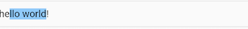

######控制焦点

焦点可以通过`FocusNode`和`FocusScopeNode`来控制，默认情况下，焦点由`FocusScope`来管理，它代表焦点控制范围，可以在这个范围内可以通过`FocusScopeNode`在输入框之间移动焦点、设置默认焦点等。我们可以通过`FocusScope.of(context)` 来获取Widget树中默认的`FocusScopeNode`。下面看一个示例，在此示例中创建两个`TextField`，第一个自动获取焦点，然后创建两个按钮：

- 点击第一个按钮可以将焦点从第一个`TextField`挪到第二个`TextField`。
- 点击第二个按钮可以关闭键盘。

我们要实现的效果如图所示：


代码如下：

```dart
class FocusTestRoute extends StatefulWidget {
  @override
  _FocusTestRouteState createState() => new _FocusTestRouteState();
}

class _FocusTestRouteState extends State<FocusTestRoute> {
  FocusNode focusNode1 = new FocusNode();
  FocusNode focusNode2 = new FocusNode();
  FocusScopeNode focusScopeNode;

  @override
  Widget build(BuildContext context) {
    return Padding(
      padding: EdgeInsets.all(16.0),
      child: Column(
        children: <Widget>[
          TextField(
            autofocus: true, 
            focusNode: focusNode1,//关联focusNode1
            decoration: InputDecoration(
                labelText: "input1"
            ),
          ),
          TextField(
            focusNode: focusNode2,//关联focusNode2
            decoration: InputDecoration(
                labelText: "input2"
            ),
          ),
          Builder(builder: (ctx) {
            return Column(
              children: <Widget>[
                RaisedButton(
                  child: Text("移动焦点"),
                  onPressed: () {
                    //将焦点从第一个TextField移到第二个TextField
                    // 这是一种写法 FocusScope.of(context).requestFocus(focusNode2);
                    // 这是第二种写法
                    if(null == focusScopeNode){
                      focusScopeNode = FocusScope.of(context);
                    }
                    focusScopeNode.requestFocus(focusNode2);
                  },
                ),
                RaisedButton(
                  child: Text("隐藏键盘"),
                  onPressed: () {
                    // 当所有编辑框都失去焦点时键盘就会收起  
                    focusNode1.unfocus();
                    focusNode2.unfocus();
                  },
                ),
              ],
            );
          },
          ),
        ],
      ),
    );
  }

}
```

###### 监听焦点状态改变事件

`FocusNode`继承自`ChangeNotifier`，通过`FocusNode`可以监听焦点的改变事件，如：

```dart
...
// 创建 focusNode   
FocusNode focusNode = new FocusNode();
...
// focusNode绑定输入框   
TextField(focusNode: focusNode);
...
// 监听焦点变化    
focusNode.addListener((){
   print(focusNode.hasFocus);
});
```

获得焦点时`focusNode.hasFocus`值为`true`，失去焦点时为`false`。

######自定义样式

下面以自定义输入框下划线颜色为例：

```dart
TextField(
  decoration: InputDecoration(
    labelText: "请输入用户名",
    prefixIcon: Icon(Icons.person),
    // 未获得焦点下划线设为灰色
    enabledBorder: UnderlineInputBorder(
      borderSide: BorderSide(color: Colors.grey),
    ),
    //获得焦点下划线设为蓝色
    focusedBorder: UnderlineInputBorder(
      borderSide: BorderSide(color: Colors.blue),
    ),
  ),
),
```

由于`TextField`在绘制下划线时使用的颜色是主题色里面的`hintColor`，但提示文本颜色也是用的`hintColor`， 如果我们直接修改`hintColor`，那么下划线和提示文本的颜色都会变。值得高兴的是`decoration`中可以设置`hintStyle`，它可以覆盖`hintColor`，并且主题中可以通过`inputDecorationTheme`来设置输入框默认的`decoration`。所以我们可以通过主题来自定义，代码如下：

```dart
Theme(
  data: Theme.of(context).copyWith(
      hintColor: Colors.grey[200], //定义下划线颜色
      inputDecorationTheme: InputDecorationTheme(
          labelStyle: TextStyle(color: Colors.grey),//定义label字体样式
          hintStyle: TextStyle(color: Colors.grey, fontSize: 14.0)//定义提示文本样式
      )
  ),
  child: Column(
    children: <Widget>[
      TextField(
        decoration: InputDecoration(
            labelText: "用户名",
            hintText: "用户名或邮箱",
            prefixIcon: Icon(Icons.person)
        ),
      ),
      TextField(
        decoration: InputDecoration(
            prefixIcon: Icon(Icons.lock),
            labelText: "密码",
            hintText: "您的登录密码",
            hintStyle: TextStyle(color: Colors.grey, fontSize: 13.0)
        ),
        obscureText: true,
      )
    ],
  )
)
```

运行效果如图所示：

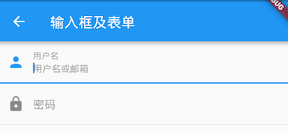

另一种灵活的方式是直接隐藏掉`TextField`本身的下划线，然后通过`Container`去嵌套定义样式，如:

```dart
Container(
  child: TextField(
    keyboardType: TextInputType.emailAddress,
    decoration: InputDecoration(
        labelText: "Email",
        hintText: "电子邮件地址",
        prefixIcon: Icon(Icons.email),
        border: InputBorder.none //隐藏下划线
    )
  ),
  decoration: BoxDecoration(
      // 下滑线浅灰色，宽度1像素
      border: Border(bottom: BorderSide(color: Colors.grey[200], width: 1.0))
  ),
)
```

运行效果：


一般来说，优先通过`decoration`来自定义样式，如果`decoration`实现不了，再用widget组合的方式。

#### 表单Form

Flutter提供了一个`Form` 组件，它可以对输入框进行分组，然后进行一些统一操作

##### Form

`Form`继承自`StatefulWidget`对象，它对应的状态类为`FormState`。我们先看看`Form`类的定义：

```dart
Form({
  @required Widget child,
  bool autovalidate = false,
  WillPopCallback onWillPop,
  VoidCallback onChanged,
})
```

- `autovalidate`：是否自动校验输入内容；当为`true`时，每一个子FormField内容发生变化时都会自动校验合法性，并直接显示错误信息。否则，需要通过调用`FormState.validate()`来手动校验。
- `onWillPop`：决定`Form`所在的路由是否可以直接返回（如点击返回按钮），该回调返回一个`Future`对象，如果Future的最终结果是`false`，则当前路由不会返回；如果为`true`，则会返回到上一个路由。此属性通常用于拦截返回按钮。
- `onChanged`：`Form`的任意一个子`FormField`内容发生变化时会触发此回调。

##### FormField

`Form`的子孙元素必须是`FormField`类型，`FormField`是一个抽象类，定义几个属性，`FormState`内部通过它们来完成操作，`FormField`部分定义如下：

```dart
const FormField({
  ...
  FormFieldSetter<T> onSaved, //保存回调
  FormFieldValidator<T>  validator, //验证回调
  T initialValue, //初始值
  bool autovalidate = false, //是否自动校验。
})
```

Flutter提供了一个`TextFormField`组件，它继承自`FormField`类，也是`TextField`的一个包装类，所以除了`FormField`定义的属性之外，它还包括`TextField`的属性。

##### FormState

`FormState`为`Form`的`State`类，可以通过`Form.of()`或`GlobalKey`获得。可以通过它来对`Form`的子孙`FormField`进行统一操作。我们看看其常用的三个方法：

- `FormState.validate()`：调用此方法后，会调用`Form`子孙`FormField的validate`回调，如果有一个校验失败，则返回false，所有校验失败项都会返回用户返回的错误提示。
- `FormState.save()`：调用此方法后，会调用`Form`子孙`FormField`的`save`回调，用于保存表单内容
- `FormState.reset()`：调用此方法后，会将子孙`FormField`的内容清空。

##### 示例

我们修改一下上面用户登录的示例，在提交之前校验：

1. 用户名不能为空，如果为空则提示“用户名不能为空”。
2. 密码不能小于6位，如果小于6为则提示“密码不能少于6位”。

完整代码：

```dart
class FormTestRoute extends StatefulWidget {
  @override
  _FormTestRouteState createState() => new _FormTestRouteState();
}

class _FormTestRouteState extends State<FormTestRoute> {
  TextEditingController _unameController = new TextEditingController();
  TextEditingController _pwdController = new TextEditingController();
  GlobalKey _formKey= new GlobalKey<FormState>();

  @override
  Widget build(BuildContext context) {
    return Scaffold(
      appBar: AppBar(
        title:Text("Form Test"),
      ),
      body: Padding(
        padding: const EdgeInsets.symmetric(vertical: 16.0, horizontal: 24.0),
        child: Form(
          key: _formKey, //设置globalKey，用于后面获取FormState
          autovalidate: true, //开启自动校验
          child: Column(
            children: <Widget>[
              TextFormField(
                  autofocus: true,
                  controller: _unameController,
                  decoration: InputDecoration(
                      labelText: "用户名",
                      hintText: "用户名或邮箱",
                      icon: Icon(Icons.person)
                  ),
                  // 校验用户名
                  validator: (v) {
                    return v
                        .trim()
                        .length > 0 ? null : "用户名不能为空";
                  }

              ),
              TextFormField(
                  controller: _pwdController,
                  decoration: InputDecoration(
                      labelText: "密码",
                      hintText: "您的登录密码",
                      icon: Icon(Icons.lock)
                  ),
                  obscureText: true,
                  //校验密码
                  validator: (v) {
                    return v
                        .trim()
                        .length > 5 ? null : "密码不能少于6位";
                  }
              ),
              // 登录按钮
              Padding(
                padding: const EdgeInsets.only(top: 28.0),
                child: Row(
                  children: <Widget>[
                    Expanded(
                      child: RaisedButton(
                        padding: EdgeInsets.all(15.0),
                        child: Text("登录"),
                        color: Theme
                            .of(context)
                            .primaryColor,
                        textColor: Colors.white,
                        onPressed: () {
                          //在这里不能通过此方式获取FormState，context不对
                          //print(Form.of(context));

                          // 通过_formKey.currentState 获取FormState后，
                          // 调用validate()方法校验用户名密码是否合法，校验
                          // 通过后再提交数据。 
                          if((_formKey.currentState as FormState).validate()){
                            //验证通过提交数据
                          }
                        },
                      ),
                    ),
                  ],
                ),
              )
            ],
          ),
        ),
      ),
    );
  }
}
```

注意，登录按钮的`onPressed`方法中不能通过`Form.of(context)`来获取，原因是，此处的`context`为`FormTestRoute`的context，而`Form.of(context)`是根据所指定`context`向根去查找，而`FormState`是在`FormTestRoute`的子树中，所以不行。正确的做法是通过`Builder`来构建登录按钮，`Builder`会将`widget`节点的`context`作为回调参数：

```dart
Expanded(
 // 通过Builder来获取RaisedButton所在widget树的真正context(Element) 
  child:Builder(builder: (context){
    return RaisedButton(
      ...
      onPressed: () {
        //由于本widget也是Form的子代widget，所以可以通过下面方式获取FormState  
        if(Form.of(context).validate()){
          //验证通过提交数据
        }
      },
    );
  })
)
```

### 进度指示器

Material 组件库中提供了两种进度指示器：`LinearProgressIndicator`和`CircularProgressIndicator`，它们都可以同时用于精确的进度指示和模糊的进度指示。精确进度通常用于任务进度可以计算和预估的情况，而模糊进度则用户任务进度无法准确获得的情况，如下拉刷新，数据提交等。

#### LinearProgressIndicator

`LinearProgressIndicator`是一个线性、条状的进度条，定义如下：

```dart
LinearProgressIndicator({
  double value,
  Color backgroundColor,
  Animation<Color> valueColor,
  ...
})
```

- `value`：`value`表示当前的进度，取值范围为[0,1]；如果`value`为`null`时则指示器会执行一个循环动画（模糊进度）；当`value`不为`null`时，指示器为一个具体进度的进度条。
- `backgroundColor`：指示器的背景色。
- `valueColor`: 指示器的进度条颜色；值得注意的是，该值类型是`Animation<Color>`，这允许我们对进度条的颜色也可以指定动画。如果我们不需要对进度条颜色执行动画，换言之，我们想对进度条应用一种固定的颜色，此时我们可以通过`AlwaysStoppedAnimation`来指定。

#### 示例

```dart
// 模糊进度条(会执行一个动画)
LinearProgressIndicator(
  backgroundColor: Colors.grey[200],
  valueColor: AlwaysStoppedAnimation(Colors.blue),
),
//进度条显示50%
LinearProgressIndicator(
  backgroundColor: Colors.grey[200],
  valueColor: AlwaysStoppedAnimation(Colors.blue),
  value: .5, 
)
```

运行效果如图所示：


#### CircularProgressIndicator

`CircularProgressIndicator`是一个圆形进度条，定义如下：

```dart
 CircularProgressIndicator({
  double value,
  Color backgroundColor,
  Animation<Color> valueColor,
  this.strokeWidth = 4.0,
  ...   
})
```

前三个参数和`LinearProgressIndicator`相同，`strokeWidth` 表示圆形进度条的粗细。示例如下：

```dart
// 模糊进度条(会执行一个旋转动画)
CircularProgressIndicator(
  backgroundColor: Colors.grey[200],
  valueColor: AlwaysStoppedAnimation(Colors.blue),
),
//进度条显示50%，会显示一个半圆
CircularProgressIndicator(
  backgroundColor: Colors.grey[200],
  valueColor: AlwaysStoppedAnimation(Colors.blue),
  value: .5,
),
```

运行效果如图所示：


#### 自定义尺寸

`LinearProgressIndicator`和`CircularProgressIndicator`都是取父容器的尺寸作为绘制的边界的。我们可以通过尺寸限制类Widget，如`ConstrainedBox`、`SizedBox` 来指定尺寸，如：

```dart
// 线性进度条高度指定为3
SizedBox(
  height: 3,
  child: LinearProgressIndicator(
    backgroundColor: Colors.grey[200],
    valueColor: AlwaysStoppedAnimation(Colors.blue),
    value: .5,
  ),
),
// 圆形进度条直径指定为100
SizedBox(
  height: 100,
  width: 100,
  child: CircularProgressIndicator(
    backgroundColor: Colors.grey[200],
    valueColor: AlwaysStoppedAnimation(Colors.blue),
    value: .7,
  ),
),
```

运行效果如图所示：


注意，如果`CircularProgressIndicator`显示空间的宽高不同，则会显示为椭圆

#### 进度色动画

我们实现一个进度条在3秒内从灰色变成蓝色的动画：

```dart
import 'package:flutter/material.dart';

class ProgressRoute extends StatefulWidget {
  @override
  _ProgressRouteState createState() => _ProgressRouteState();
}

class _ProgressRouteState extends State<ProgressRoute>
    with SingleTickerProviderStateMixin {
  AnimationController _animationController;

  @override
  void initState() {
    //动画执行时间3秒  
    _animationController =
        new AnimationController(vsync: this, duration: Duration(seconds: 3));
    _animationController.forward();
    _animationController.addListener(() => setState(() => {}));
    super.initState();
  }

  @override
  void dispose() {
    _animationController.dispose();
    super.dispose();
  }

  @override
  Widget build(BuildContext context) {
    return SingleChildScrollView(
      child: Column(
        children: <Widget>[
            Padding(
            padding: EdgeInsets.all(16),
            child: LinearProgressIndicator(
              backgroundColor: Colors.grey[200],
              valueColor: ColorTween(begin: Colors.grey, end: Colors.blue)
                .animate(_animationController), // 从灰色变成蓝色
              value: _animationController.value,
            ),
          );
        ],
      ),
    );
  }
}
```

#### 自定义进度指示器样式

定制进度指示器风格样式，可以通过`CustomPainter` Widget 来自定义绘制逻辑

## 布局类组件

### 布局类组件简介

布局类组件都会包含一个或多个子组件，不同的布局类组件对子组件排版(layout)方式不同。在`Flutter`中，根据`Widget`是否需要包含子节点将`Widget`分为了三类，分别对应三种`Element`，如下表：

| Widget                        | 对应的Element                  | 用途                                                         |
| ----------------------------- | ------------------------------ | ------------------------------------------------------------ |
| LeafRenderObjectWidget        | LeafRenderObjectElement        | Widget树的叶子节点，用于没有子节点的widget，通常基础组件都属于这一类，如Image。 |
| SingleChildRenderObjectWidget | SingleChildRenderObjectElement | 包含一个子Widget，如：ConstrainedBox、DecoratedBox等         |
| MultiChildRenderObjectWidget  | MultiChildRenderObjectElement  | 包含多个子Widget，一般都有一个children参数，接受一个Widget数组。如Row、Column、Stack等 |

> 注意，**StatelessWidget和StatefulWidget就是两个用于组合Widget的基类，它们本身并不关联最终的渲染对象（RenderObjectWidget）**。

布局类组件就是指直接或间接继承(包含)`MultiChildRenderObjectWidget`的Widget，它们一般都会有一个`children`属性用于接收子Widget。

### 线性布局（Row和Column）

所谓线性布局，即指沿水平或垂直方向排布子组件。Flutter中通过`Row`和`Column`来实现线性布局。`Row`和`Column`都继承自`Flex`

#### 主轴和纵轴

对于线性布局，有主轴和纵轴之分，如果布局是沿水平方向，那么主轴就是指水平方向，而纵轴即垂直方向；如果布局沿垂直方向，那么主轴就是指垂直方向，而纵轴就是水平方向。在线性布局中，有两个定义对齐方式的枚举类`MainAxisAlignment`和`CrossAxisAlignment`，分别代表主轴对齐和纵轴对齐。

#### Row

Row可以在水平方向排列其子widget。定义如下：

```dart
Row({
  ...  
  TextDirection textDirection,    
  MainAxisSize mainAxisSize = MainAxisSize.max,    
  MainAxisAlignment mainAxisAlignment = MainAxisAlignment.start,
  VerticalDirection verticalDirection = VerticalDirection.down,  
  CrossAxisAlignment crossAxisAlignment = CrossAxisAlignment.center,
  List<Widget> children = const <Widget>[],
})
```

- `textDirection`：表示水平方向子组件的布局顺序(是从左往右还是从右往左)，默认为系统当前`Locale`环境的文本方向(如中文、英语都是从左往右，而阿拉伯语是从右往左)。
- `mainAxisSize`：表示`Row`在主轴(水平)方向占用的空间，默认是`MainAxisSize.max`，表示尽可能多的占用水平方向的空间，此时无论子`widgets`实际占用多少水平空间，`Row`的宽度始终等于水平方向的最大宽度；而`MainAxisSize.min`表示尽可能少的占用水平空间，当子组件没有占满水平剩余空间，则`Row`的实际宽度等于所有子组件占用的的水平空间；
- `mainAxisAlignment`：表示子组件在`Row`所占用的水平空间内对齐方式，如果`mainAxisSize`值为`MainAxisSize.min`，则此属性无意义，因为子组件的宽度等于`Row`的宽度。只有当`mainAxisSize`的值为`MainAxisSize.max`时，此属性才有意义，`MainAxisAlignment.start`表示沿`textDirection`的初始方向对齐，如`textDirection`取值为`TextDirection.ltr`时，则`MainAxisAlignment.start`表示左对齐，`textDirection`取值为`TextDirection.rtl`时表示从右对齐。而`MainAxisAlignment.end`和`MainAxisAlignment.start`正好相反；`MainAxisAlignment.center`表示居中对齐
- `verticalDirection`：表示`Row`纵轴（垂直）的对齐方向，默认是`VerticalDirection.down`，表示从上到下。
- `crossAxisAlignment`：表示子组件在纵轴方向的对齐方式，`Row`的高度等于子组件中最高的子元素高度，它的取值和`MainAxisAlignment`一样(包含`start`、`end`、 `center`三个值)，不同的是`crossAxisAlignment`的参考系是`verticalDirection`，即`verticalDirection`值为`VerticalDirection.down`时`crossAxisAlignment.start`指顶部对齐，`verticalDirection`值为`VerticalDirection.up`时，`crossAxisAlignment.start`指底部对齐；而`crossAxisAlignment.end`和`crossAxisAlignment.start`正好相反；
- `children` ：子组件数组。

#### 示例

```dart
Column(
  //测试Row对齐方式，排除Column默认居中对齐的干扰
  crossAxisAlignment: CrossAxisAlignment.start,
  children: <Widget>[
    Row(
      mainAxisAlignment: MainAxisAlignment.center,
      children: <Widget>[
        Text(" hello world "),
        Text(" I am Jack "),
      ],
    ),
    Row(
      mainAxisSize: MainAxisSize.min,
      mainAxisAlignment: MainAxisAlignment.center,
      children: <Widget>[
        Text(" hello world "),
        Text(" I am Jack "),
      ],
    ),
    Row(
      mainAxisAlignment: MainAxisAlignment.end,
      textDirection: TextDirection.rtl,
      children: <Widget>[
        Text(" hello world "),
        Text(" I am Jack "),
      ],
    ),
    Row(
      crossAxisAlignment: CrossAxisAlignment.start,  
      verticalDirection: VerticalDirection.up,
      children: <Widget>[
        Text(" hello world ", style: TextStyle(fontSize: 30.0),),
        Text(" I am Jack "),
      ],
    ),
  ],
);
```

实际运行结果如图所示：


#### Column

`Column`可以在垂直方向排列其子组件。参数和`Row`一样，不同的是布局方向为垂直，主轴纵轴正好相反

```dart
import 'package:flutter/material.dart';

class CenterColumnRoute extends StatelessWidget {
  @override
  Widget build(BuildContext context) {
    return Column(
      crossAxisAlignment: CrossAxisAlignment.center,
      children: <Widget>[
        Text("hi"),
        Text("world"),
      ],
    );
  }
}
```

运行效果如图所示：


解释：

- 由于我们没有指定`Column`的`mainAxisSize`，所以使用默认值`MainAxisSize.max`，则`Column`会在垂直方向占用尽可能多的空间，此例中为屏幕高度。
- 由于我们指定了 `crossAxisAlignment` 属性为`CrossAxisAlignment.center`，那么子项在`Column`纵轴方向（此时为水平方向）会居中对齐。注意，在水平方向对齐是有边界的，总宽度为`Column`占用空间的实际宽度，而实际的宽度取决于子项中宽度最大的Widget。在本例中，`Column`有两个子Widget，而显示“world”的`Text`宽度最大，所以`Column`的实际宽度则为`Text("world")` 的宽度，所以居中对齐后`Text("hi")`会显示在`Text("world")`的中间部分。

**实际上，Row和Column都只会在主轴方向占用尽可能大的空间，而纵轴的长度则取决于他们最大子元素的长度**。如果我们想让本例中的两个文本控件在整个手机屏幕中间对齐，我们有两种方法：

- 将`Column`的宽度指定为屏幕宽度；可以通过`ConstrainedBox`或`SizedBox`来强制更改宽度限制，例如：

  ```dart
  ConstrainedBox(
    constraints: BoxConstraints(minWidth: double.infinity), 
    child: Column(
      crossAxisAlignment: CrossAxisAlignment.center,
      children: <Widget>[
        Text("hi"),
        Text("world"),
      ],
    ),
  );
  ```

  将`minWidth`设为`double.infinity`，可以使宽度占用尽可能多的空间。

- 使用`Center` Widget

#### 特殊情况

如果`Row`里面嵌套`Row`，或者`Column`里面再嵌套`Column`，那么只有对最外面的`Row`或`Column`会占用尽可能大的空间，里面`Row`或`Column`所占用的空间为实际大小，下面以`Column`为例说明：

```dart
Container(
  color: Colors.green,
  child: Padding(
    padding: const EdgeInsets.all(16.0),
    child: Column(
      crossAxisAlignment: CrossAxisAlignment.start,
      mainAxisSize: MainAxisSize.max, //有效，外层Colum高度为整个屏幕
      children: <Widget>[
        Container(
          color: Colors.red,
          child: Column(
            mainAxisSize: MainAxisSize.max,//无效，内层Colum高度为实际高度  
            children: <Widget>[
              Text("hello world "),
              Text("I am Jack "),
            ],
          ),
        )
      ],
    ),
  ),
);
```

运行效果如图所示：


如果要让里面的`Column`占满外部`Column`，可以使用`Expanded` 组件：

```dart
Expanded( 
  child: Container(
    color: Colors.red,
    child: Column(
      mainAxisAlignment: MainAxisAlignment.center, //垂直方向居中对齐
      children: <Widget>[
        Text("hello world "),
        Text("I am Jack "),
      ],
    ),
  ),
)
```

运行效果如图所示：


### 弹性布局（Flex）

弹性布局允许子组件按照一定比例来分配父容器空间。`Flutter` 中的弹性布局主要通过`Flex`和`Expanded`来配合实现。

#### Flex

`Flex`组件可以沿着水平或垂直方向排列子组件，如果你知道主轴方向，使用`Row`或`Column`会方便一些，因为`Row`和`Column`都继承自`Flex`，参数基本相同，所以能使用Flex的地方基本上都可以使用`Row`或`Column`。

```dart
Flex({
  ...
  @required this.direction, //弹性布局的方向, Row默认为水平方向，Column默认为垂直方向
  List<Widget> children = const <Widget>[],
})
```

`Flex`继承自`MultiChildRenderObjectWidget`，对应的`RenderObject`为`RenderFlex`，`RenderFlex`中实现了其布局算法。

#### Expanded

可以按比例“扩伸” `Row`、`Column`和`Flex`子组件所占用的空间。

```dart
const Expanded({
  int flex = 1, 
  @required Widget child,
})
```

`flex`参数为弹性系数，如果为0或`null`，则`child`是没有弹性的，即不会被扩伸占用的空间。如果大于0，所有的`Expanded`按照其`flex`的比例来分割主轴的全部空闲空间

```dart
class FlexLayoutTestRoute extends StatelessWidget {
  @override
  Widget build(BuildContext context) {
    return Column(
      children: <Widget>[
        //Flex的两个子widget按1：2来占据水平空间  
        Flex(
          direction: Axis.horizontal,
          children: <Widget>[
            Expanded(
              flex: 1,
              child: Container(
                height: 30.0,
                color: Colors.red,
              ),
            ),
            Expanded(
              flex: 2,
              child: Container(
                height: 30.0,
                color: Colors.green,
              ),
            ),
          ],
        ),
        Padding(
          padding: const EdgeInsets.only(top: 20.0),
          child: SizedBox(
            height: 100.0,
            //Flex的三个子widget，在垂直方向按2：1：1来占用100像素的空间  
            child: Flex(
              direction: Axis.vertical,
              children: <Widget>[
                Expanded(
                  flex: 2,
                  child: Container(
                    height: 30.0,
                    color: Colors.red,
                  ),
                ),
                Spacer(
                  flex: 1,
                ),
                Expanded(
                  flex: 1,
                  child: Container(
                    height: 30.0,
                    color: Colors.green,
                  ),
                ),
              ],
            ),
          ),
        ),
      ],
    );
  }
}
```

运行效果如图所示：

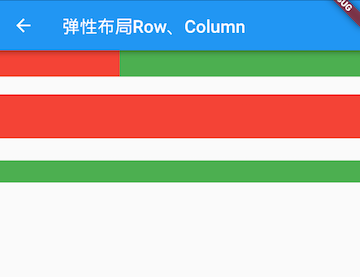

示例中的`Spacer`的功能是占用指定比例的空间，实际上它只是`Expanded`的一个包装类，`Spacer`的源码如下：

```dart
class Spacer extends StatelessWidget {
  const Spacer({Key key, this.flex = 1})
    : assert(flex != null),
      assert(flex > 0),
      super(key: key);

  final int flex;

  @override
  Widget build(BuildContext context) {
    return Expanded(
      flex: flex,
      child: const SizedBox.shrink(),
    );
  }
}
```

### 流式布局

`Row`和`Colum` 的子`widget`超出屏幕范围，则会报溢出错误，这是因为Row默认只有一行，如果超出屏幕不会折行。

超出屏幕显示范围会自动折行的布局称为流式布局。`Flutter`中通过`Wrap`和`Flow`来支持流式布局

####  Wrap

下面是Wrap的定义:

```dart
Wrap({
  ...
  this.direction = Axis.horizontal,
  this.alignment = WrapAlignment.start,
  this.spacing = 0.0,
  this.runAlignment = WrapAlignment.start,
  this.runSpacing = 0.0,
  this.crossAxisAlignment = WrapCrossAlignment.start,
  this.textDirection,
  this.verticalDirection = VerticalDirection.down,
  List<Widget> children = const <Widget>[],
})
```

`Wrap`的很多属性和`Row`（包括`Flex`和`Column`）的意思相同，下面我们看一下`Wrap`特有的几个属性：

- `spacing`：主轴方向子widget的间距
- `runSpacing`：纵轴方向的间距
- `runAlignment`：纵轴方向的对齐方式

下面看一个示例子：

```dart
Wrap(
  spacing: 8.0, // 主轴(水平)方向间距
  runSpacing: 4.0, // 纵轴（垂直）方向间距
  alignment: WrapAlignment.center, //沿主轴方向居中
  children: <Widget>[
    new Chip(
      avatar: new CircleAvatar(backgroundColor: Colors.blue, child: Text('A')),
      label: new Text('Hamilton'),
    ),
    new Chip(
      avatar: new CircleAvatar(backgroundColor: Colors.blue, child: Text('M')),
      label: new Text('Lafayette'),
    ),
    new Chip(
      avatar: new CircleAvatar(backgroundColor: Colors.blue, child: Text('H')),
      label: new Text('Mulligan'),
    ),
    new Chip(
      avatar: new CircleAvatar(backgroundColor: Colors.blue, child: Text('J')),
      label: new Text('Laurens'),
    ),
  ],
)
```

运行效果如图所示：


#### Flow

我们一般很少会使用`Flow`，因为其过于复杂，需要自己实现子widget的位置转换，在很多场景下首先要考虑的是`Wrap`是否满足需求。`Flow`主要用于一些需要自定义布局策略或性能要求较高(如动画中)的场景。`Flow`有如下优点：

- 性能好；`Flow`是一个对子组件尺寸以及位置调整非常高效的控件，`Flow`用转换矩阵在对子组件进行位置调整的时候进行了优化
- 灵活；由于我们需要自己实现`FlowDelegate`的`paintChildren()`方法，所以我们需要自己计算每一个组件的位置，因此，可以自定义布局策略。

缺点：

- 使用复杂。
- 不能自适应子组件大小，必须通过指定父容器大小或实现`TestFlowDelegate`的`getSize`返回固定大小。

示例：

我们对六个色块进行自定义流式布局：

```dart
Flow(
  delegate: TestFlowDelegate(margin: EdgeInsets.all(10.0)),
  children: <Widget>[
    new Container(width: 80.0, height:80.0, color: Colors.red,),
    new Container(width: 80.0, height:80.0, color: Colors.green,),
    new Container(width: 80.0, height:80.0, color: Colors.blue,),
    new Container(width: 80.0, height:80.0,  color: Colors.yellow,),
    new Container(width: 80.0, height:80.0, color: Colors.brown,),
    new Container(width: 80.0, height:80.0,  color: Colors.purple,),
  ],
)
```

实现TestFlowDelegate:

```dart
class TestFlowDelegate extends FlowDelegate {
  EdgeInsets margin = EdgeInsets.zero;
  TestFlowDelegate({this.margin});
  @override
  void paintChildren(FlowPaintingContext context) {
    var x = margin.left;
    var y = margin.top;
    //计算每一个子widget的位置  
    for (int i = 0; i < context.childCount; i++) {
      var w = context.getChildSize(i).width + x + margin.right;
      if (w < context.size.width) {
        context.paintChild(i,
            transform: new Matrix4.translationValues(
                x, y, 0.0));
        x = w + margin.left;
      } else {
        x = margin.left;
        y += context.getChildSize(i).height + margin.top + margin.bottom;
        //绘制子widget(有优化)  
        context.paintChild(i,
            transform: new Matrix4.translationValues(
                x, y, 0.0));
         x += context.getChildSize(i).width + margin.left + margin.right;
      }
    }
  }

  @override
  getSize(BoxConstraints constraints){
    //指定Flow的大小  
    return Size(double.infinity,200.0);
  }

  @override
  bool shouldRepaint(FlowDelegate oldDelegate) {
    return oldDelegate != this;
  }
}
```

运行效果见图


可以看到我们主要的任务就是实现`paintChildren`，它的主要任务是确定每个子widget位置。由于Flow不能自适应子widget的大小，我们通过在`getSize`返回一个固定大小来指定Flow的大小。

### 层叠布局 Stack、Positioned

层叠布局的子组件可以根据距父容器四个角的位置来确定自身的位置。绝对定位允许子组件堆叠起来（按照代码中声明的顺序）。Flutter中使用`Stack`和`Positioned`这两个组件来配合实现绝对定位。`Stack`允许子组件堆叠，而`Positioned`用于根据`Stack`的四个角来确定子组件的位置。

#### Stack

```dart
Stack({
  this.alignment = AlignmentDirectional.topStart,
  this.textDirection,
  this.fit = StackFit.loose,
  this.overflow = Overflow.clip,
  List<Widget> children = const <Widget>[],
})
```

- `alignment`：此参数决定如何去对齐没有定位（没有使用`Positioned`）或部分定位的子组件。所谓部分定位，在这里**特指没有在某一个轴上定位：**`left`、`right`为横轴，`top`、`bottom`为纵轴，只要包含某个轴上的一个定位属性就算在该轴上有定位。
- `textDirection`：和`Row`、`Wrap`的`textDirection`功能一样，都用于确定`alignment`对齐的参考系，即：`textDirection`的值为`TextDirection.ltr`，则`alignment`的`start`代表左，`end`代表右，即`从左往右`的顺序；`textDirection`的值为`TextDirection.rtl`，则alignment的`start`代表右，`end`代表左，即`从右往左`的顺序。
- `fit`：此参数用于确定**没有定位**的子组件如何去适应`Stack`的大小。`StackFit.loose`表示使用子组件的大小，`StackFit.expand`表示扩伸到`Stack`的大小。
- `overflow`：此属性决定如何显示超出`Stack`显示空间的子组件；值为`Overflow.clip`时，超出部分会被剪裁（隐藏），值为`Overflow.visible` 时则不会。

#### Positioned

```dart
const Positioned({
  Key key,
  this.left, 
  this.top,
  this.right,
  this.bottom,
  this.width,
  this.height,
  @required Widget child,
})
```

`left`、`top` 、`right`、 `bottom`分别代表离`Stack`左、上、右、底四边的距离。`width`和`height`用于指定需要定位元素的宽度和高度。注意，`Positioned`的`width`、`height` 和其它地方的意义稍微有点区别，此处用于配合`left`、`top` 、`right`、 `bottom`来定位组件，举个例子，在水平方向时，你只能指定`left`、`right`、`width`三个属性中的两个，如指定`left`和`width`后，`right`会自动算出(`left`+`width`)，如果同时指定三个属性则会报错，垂直方向同理。

#### 示例

在下面的例子中，我们通过对几个`Text`组件的定位来演示`Stack`和`Positioned`的特性：

```dart
//通过ConstrainedBox来确保Stack占满屏幕
ConstrainedBox(
  constraints: BoxConstraints.expand(),
  child: Stack(
    alignment:Alignment.center , //指定未定位或部分定位widget的对齐方式
    children: <Widget>[
      Container(child: Text("Hello world",style: TextStyle(color: Colors.white)),
        color: Colors.red,
      ),
      Positioned(
        left: 18.0,
        child: Text("I am Jack"),
      ),
      Positioned(
        top: 18.0,
        child: Text("Your friend"),
      )        
    ],
  ),
);
```

运行效果见图：

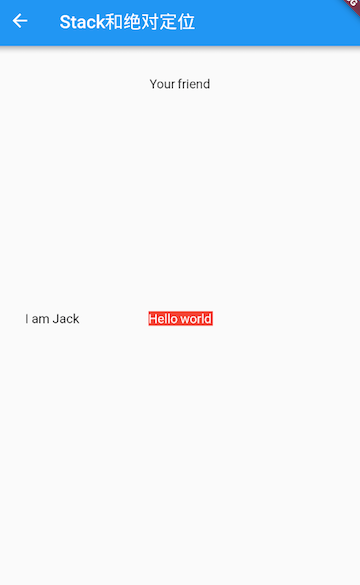

由于第一个子文本组件`Text("Hello world")`没有指定定位，并且`alignment`值为`Alignment.center`，所以它会居中显示。第二个子文本组件`Text("I am Jack")`只指定了水平方向的定位(`left`)，所以属于部分定位，即垂直方向上没有定位，那么它在垂直方向的对齐方式则会按照`alignment`指定的对齐方式对齐，即垂直方向居中。对于第三个子文本组件`Text("Your friend")`，和第二个`Text`原理一样，只不过是水平方向没有定位，则水平方向居中。

我们给上例中的`Stack`指定一个`fit`属性，然后将三个子文本组件的顺序调整一下：

```dart
Stack(
  alignment:Alignment.center ,
  fit: StackFit.expand, //未定位widget占满Stack整个空间
  children: <Widget>[
    Positioned(
      left: 18.0,
      child: Text("I am Jack"),
    ),
    Container(child: Text("Hello world",style: TextStyle(color: Colors.white)),
      color: Colors.red,
    ),
    Positioned(
      top: 18.0,
      child: Text("Your friend"),
    )
  ],
),
```

显示效果如图所示：

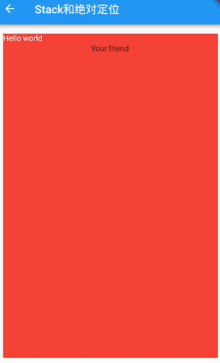

可以看到，由于第二个子文本组件没有定位，所以`fit`属性会对它起作用，就会占满`Stack`。由于`Stack`子元素是堆叠的，所以第一个子文本组件被第二个遮住了，而第三个在最上层，所以可以正常显示。

### 对齐与相对定位（Align）

如果只想简单的调整**一个**子元素在父元素中的位置的话，使用`Align`组件会更简单一些。

#### Align

`Align` 组件可以调整子组件的位置，并且可以根据子组件的宽高来确定自身的的宽高，定义如下：

```dart
Align({
  Key key,
  this.alignment = Alignment.center,
  this.widthFactor,
  this.heightFactor,
  Widget child,
})
```

- `alignment` : 需要一个`AlignmentGeometry`类型的值，表示子组件在父组件中的起始位置。`AlignmentGeometry` 是一个抽象类，它有两个常用的子类：`Alignment`和 `FractionalOffset`，我们将在下面的示例中详细介绍。
- `widthFactor`和`heightFactor`是用于确定`Align` 组件本身宽高的属性；它们是两个缩放因子，会分别乘以子元素的宽、高，最终的结果就是`Align` 组件的宽高。如果值为`null`，则组件的宽高将会占用尽可能多的空间。

##### 示例

我们先来看一个简单的例子：

```dart
Container(
  height: 120.0,
  width: 120.0,
  color: Colors.blue[50],
  child: Align(
    alignment: Alignment.topRight,
    child: FlutterLogo(
      size: 60,
    ),
  ),
)
```

运行效果如图所示：


`FlutterLogo` 是Flutter SDK提供的一个组件，内容就是Flutter的商标。在上面的例子中，我们显式指定了`Container`的宽、高都为120。如果我们不显式指定宽高，而通过同时指定`widthFactor`和`heightFactor` 为2也是可以达到同样的效果：

```dart
Align(
  widthFactor: 2,
  heightFactor: 2,
  alignment: Alignment.topRight,
  child: FlutterLogo(
    size: 60,
  ),
),
```

因为`FlutterLogo`的宽高为60，则`Align`的最终宽高都为`2*60=120`。

另外，我们通过`Alignment.topRight`将`FlutterLogo`定位在`Container`的右上角。那`Alignment.topRight`是什么呢？通过源码我们可以看到其定义如下：

```dart
//右上角
static const Alignment topRight = Alignment(1.0, -1.0);
```

可以看到它只是`Alignment`的一个实例，下面我们介绍一下`Alignment`。

##### Alignment

`Alignment`继承自`AlignmentGeometry`，表示矩形内的一个点，他有两个属性`x`、`y`，分别表示在水平和垂直方向的偏移，`Alignment`定义如下：

```dart
Alignment(this.x, this.y)
```

`Alignment` Widget会以**矩形的中心点作为坐标原点**，即`Alignment(0.0, 0.0)` 。`x`、`y`的值从-1到1分别代表矩形左边到右边的距离和顶部到底边的距离，因此2个水平（或垂直）单位则等于矩形的宽（或高），如`Alignment(-1.0, -1.0)` 代表矩形的左侧顶点，而`Alignment(1.0, 1.0)`代表右侧底部终点，而`Alignment(1.0, -1.0)` 则正是右侧顶点，即`Alignment.topRight`。为了使用方便，矩形的原点、四个顶点，以及四条边的终点在`Alignment`类中都已经定义为了静态常量。

`Alignment`可以通过其**坐标转换公式**将其坐标转为子元素的具体偏移坐标：

```
(Alignment.x*childWidth/2+childWidth/2, Alignment.y*childHeight/2+childHeight/2)
```

其中`childWidth`为子元素的宽度，`childHeight`为子元素高度。

现在我们再看看上面的示例，我们将`Alignment(1.0, -1.0)`带入上面公式，可得`FlutterLogo`的实际偏移坐标正是（60，0）。下面再看一个例子：

```dart
 Align(
  widthFactor: 2,
  heightFactor: 2,
  alignment: Alignment(2,0.0),
  child: FlutterLogo(
    size: 60,
  ),
)
```

我们可以先想象一下运行效果：将`Alignment(2,0.0)`带入上述坐标转换公式，可以得到`FlutterLogo`的实际偏移坐标为（90，30）。实际运行如图所示：


##### FractionalOffset

`FractionalOffset` 继承自 `Alignment`，它和 `Alignment`唯一的区别就是坐标原点不同！`FractionalOffset` 的坐标原点为矩形的左侧顶点，这和布局系统的一致，所以理解起来会比较容易。`FractionalOffset`的坐标转换公式为：

```
实际偏移 = (FractionalOffse.x * childWidth, FractionalOffse.y * childHeight)
```

下面看一个例子：

```dart
Container(
  height: 120.0,
  width: 120.0,
  color: Colors.blue[50],
  child: Align(
    alignment: FractionalOffset(0.2, 0.6),
    child: FlutterLogo(
      size: 60,
    ),
  ),
)
```

实际运行效果如图所示下：


我们将`FractionalOffset(0.2, 0.6)`带入坐标转换公式得`FlutterLogo`实际偏移为（12，36），和实际运行效果吻合。

#### Align和Stack对比

可以看到，`Align`和`Stack`/`Positioned`都可以用于指定子元素相对于父元素的偏移，但它们还是有两个主要区别：

1. 定位参考系统不同；`Stack`/`Positioned`定位的的参考系可以是父容器矩形的四个顶点；而`Align`则需要先通过`alignment` 参数来确定坐标原点，不同的`alignment`会对应不同原点，最终的偏移是需要通过`alignment`的转换公式来计算出。
2. `Stack`可以有多个子元素，并且子元素可以堆叠，而`Align`只能有一个子元素，不存在堆叠。

#### Center组件

我们在前面章节的例子中已经使用过`Center`组件来居中子元素了。`Center`组件定义如下：

```dart
class Center extends Align {
  const Center({ Key key, double widthFactor, double heightFactor, Widget child })
    : super(key: key, widthFactor: widthFactor, heightFactor: heightFactor, child: child);
}
```

可以看到`Center`继承自`Align`，它比`Align`只少了一个`alignment` 参数；由于`Align`的构造函数中`alignment` 值为`Alignment.center`，所以，我们可以认为`Center`组件其实是对齐方式确定（`Alignment.center`）了的`Align`。

上面我们讲过当`widthFactor`或`heightFactor`为`null`时组件的宽高将会占用尽可能多的空间，这一点需要特别注意：

```dart
...//省略无关代码
DecoratedBox(
  decoration: BoxDecoration(color: Colors.red),
  child: Center(
    child: Text("xxx"),
  ),
),
DecoratedBox(
  decoration: BoxDecoration(color: Colors.red),
  child: Center(
    widthFactor: 1,
    heightFactor: 1,
    child: Text("xxx"),
  ),
)
```

运行效果如图所示：


## 容器类组件

### 填充（Padding）

`Padding`可以给其子节点添加填充（留白），和边距效果类似

```dart
Padding({
  ...
  EdgeInsetsGeometry padding,
  Widget child,
})
```

`EdgeInsetsGeometry`是一个抽象类，开发中，我们一般都使用`EdgeInsets`类，它是`EdgeInsetsGeometry`的一个子类，定义了一些设置填充的便捷方法。

#### EdgeInsets

我们看看`EdgeInsets`提供的便捷方法：

- `fromLTRB(double left, double top, double right, double bottom)`：分别指定四个方向的填充。
- `all(double value)` : 所有方向均使用相同数值的填充。
- `only({left, top, right ,bottom })`：可以设置具体某个方向的填充(可以同时指定多个方向)。
- `symmetric({ vertical, horizontal })`：用于设置对称方向的填充，`vertical`指`top`和`bottom`，`horizontal`指`left`和`right`。

### 尺寸限制类容器

尺寸限制类容器用于限制容器大小，Flutter中提供了多种这样的容器，如`ConstrainedBox`、`SizedBox`、`UnconstrainedBox`、`AspectRatio`等

#### ConstrainedBox

`ConstrainedBox`用于对子组件添加额外的约束

##### 示例

我们先定义一个`redBox`，它是一个背景颜色为红色的盒子，不指定它的宽度和高度：

```dart
Widget redBox = DecoratedBox(
  decoration: BoxDecoration(color: Colors.red),
);
```

我们实现一个最小高度为50，宽度尽可能大的红色容器。

```dart
ConstrainedBox(
  constraints: BoxConstraints(
    minWidth: double.infinity, //宽度尽可能大
    minHeight: 50.0 //最小高度为50像素
  ),
  child: Container(
      height: 5.0, 
      child: redBox 
  ),
)
```

可以看到，虽然将Container的高度设置为5像素，但是最终却是50像素，这正是ConstrainedBox的最小高度限制生效了。如果将Container的高度设置为80像素，那么最终红色区域的高度也会是80像素

##### BoxConstraints

BoxConstraints用于设置限制条件，它的定义如下：

```dart
const BoxConstraints({
  this.minWidth = 0.0, //最小宽度
  this.maxWidth = double.infinity, //最大宽度
  this.minHeight = 0.0, //最小高度
  this.maxHeight = double.infinity //最大高度
})
```

BoxConstraints还定义了一些便捷的构造函数，用于快速生成特定限制规则的BoxConstraints，如`BoxConstraints.tight(Size size)`，它可以生成给定大小的限制；`const BoxConstraints.expand()`可以生成一个尽可能大的用以填充另一个容器的BoxConstraints

#### SizedBox

`SizedBox`用于给子元素指定固定的宽高，如：

```dart
SizedBox(
  width: 80.0,
  height: 80.0,
  child: redBox
)
```

运行效果如图所示：


实际上`SizedBox`只是`ConstrainedBox`的一个定制，上面代码等价于：

```dart
ConstrainedBox(
  constraints: BoxConstraints.tightFor(width: 80.0,height: 80.0),
  child: redBox, 
)
```

而`BoxConstraints.tightFor(width: 80.0,height: 80.0)`等价于：

```dart
BoxConstraints(minHeight: 80.0,maxHeight: 80.0,minWidth: 80.0,maxWidth: 80.0)
```

而实际上`ConstrainedBox`和`SizedBox`都是通过`RenderConstrainedBox`来渲染的，我们可以看到`ConstrainedBox`和`SizedBox`的`createRenderObject()`方法都返回的是一个`RenderConstrainedBox`对象：

```dart
@override
RenderConstrainedBox createRenderObject(BuildContext context) {
  return new RenderConstrainedBox(
    additionalConstraints: ...,
  );
}
```

#### 多重限制

如果某一个组件有多个父级`ConstrainedBox`限制时，对于`minWidth`和`minHeight`来说，是取父子中相应数值较大的

#### UnconstrainedBox

`UnconstrainedBox`不会对子组件产生任何限制，它允许其子组件按照其本身大小绘制。一般情况下，我们会很少直接使用此组件，但在"去除"多重限制的时候也许会有帮助，我们看下下面的代码：

```dart
ConstrainedBox(
    constraints: BoxConstraints(minWidth: 60.0, minHeight: 100.0),  //父
    child: UnconstrainedBox( //“去除”父级限制
      child: ConstrainedBox(
        constraints: BoxConstraints(minWidth: 90.0, minHeight: 20.0),//子
        child: redBox,
      ),
    )
)
```

上面代码中，如果没有中间的`UnconstrainedBox`，那么根据上面所述的多重限制规则，那么最终将显示一个90×100的红色框。但是由于`UnconstrainedBox` “去除”了父`ConstrainedBox`的限制，则最终会按照子`ConstrainedBox`的限制来绘制`redBox`，即90×20：


请注意，`UnconstrainedBox`对父组件限制的“去除”并非是真正的去除：上面例子中虽然红色区域大小是90×20，但上方仍然有80的空白空间。也就是说父限制的`minHeight`(100.0)仍然是生效的，只不过它不影响最终子元素`redBox`的大小，但仍然还是占有相应的空间，可以认为此时的父`ConstrainedBox`是作用于子`UnconstrainedBox`上，而`redBox`只受子`ConstrainedBox`限制

没有可以彻底去除父`ConstrainedBox`的限制的方法

当我们发现已经使用`SizedBox`或`ConstrainedBox`给子元素指定了宽高，但是仍然没有效果时，几乎可以断定：已经有父元素已经设置了限制

#### 其它尺寸限制类容器

除了上面介绍的这些常用的尺寸限制类容器外，还有一些其他的尺寸限制类容器，比如`AspectRatio`，它可以指定子组件的长宽比、`LimitedBox` 用于指定最大宽高、`FractionallySizedBox` 可以根据父容器宽高的百分比来设置子组件宽高等

### 装饰容器DecoratedBox

`DecoratedBox`可以在其子组件绘制前(或后)绘制一些装饰（Decoration），如背景、边框、渐变等。`DecoratedBox`定义如下：

```dart
const DecoratedBox({
  Decoration decoration,
  DecorationPosition position = DecorationPosition.background,
  Widget child
})
```

- `decoration`：代表将要绘制的装饰，它的类型为`Decoration`。`Decoration`是一个抽象类，它定义了一个接口 `createBoxPainter()`，子类的主要职责是需要通过实现它来创建一个画笔，该画笔用于绘制装饰。
- `position`：此属性决定在哪里绘制 `Decoration` , 它接收 `DecorationPosition` 的枚举类型，该枚举类有两个值：
    - `background`：在子组件之后绘制，即背景装饰。
    - `foreground`：在子组件之上绘制，即前景。

#### BoxDecoration

我们通常会直接使用`BoxDecoration`类，它是一个Decoration的子类，实现了常用的装饰元素的绘制。

```dart
BoxDecoration({
  Color color, //颜色
  DecorationImage image,//图片
  BoxBorder border, //边框
  BorderRadiusGeometry borderRadius, //圆角
  List<BoxShadow> boxShadow, //阴影,可以指定多个
  Gradient gradient, //渐变
  BlendMode backgroundBlendMode, //背景混合模式
  BoxShape shape = BoxShape.rectangle, //形状
})
```

下面我们实现一个带阴影的背景色渐变的按钮：

```dart
 DecoratedBox(
    decoration: BoxDecoration(
      gradient: LinearGradient(colors:[Colors.red,Colors.orange[700]]), //背景渐变
      borderRadius: BorderRadius.circular(3.0), //3像素圆角
      boxShadow: [ //阴影
        BoxShadow(
            color:Colors.black54,
            offset: Offset(2.0,2.0),
            blurRadius: 4.0
        )
      ]
    ),
  child: Padding(padding: EdgeInsets.symmetric(horizontal: 80.0, vertical: 18.0),
    child: Text("Login", style: TextStyle(color: Colors.white),),
  )
)
```

运行后效果如图所示：


上面的例子中使用了`LinearGradient`类，它用于定义线性渐变的类，Flutter中还提供了其它渐变配置类，如`RadialGradient`、`SweepGradient`等

### 变换（Transform）

`Transform`可以在其子组件绘制时对其应用一些矩阵变换来实现一些特效。`Matrix4`是一个4D矩阵，通过它我们可以实现各种矩阵操作，下面是一个例子：

```dart
Container(
  color: Colors.black,
  child: new Transform(
    alignment: Alignment.topRight, //相对于坐标系原点的对齐方式
    transform: new Matrix4.skewY(0.3), //沿Y轴倾斜0.3弧度
    child: new Container(
      padding: const EdgeInsets.all(8.0),
      color: Colors.deepOrange,
      child: const Text('Apartment for rent!'),
    ),
  ),
);
```

运行效果如图所示：


#### 平移

`Transform.translate`接收一个`offset`参数，可以在绘制时沿`x`、`y`轴对子组件平移指定的距离。

```dart
DecoratedBox(
  decoration:BoxDecoration(color: Colors.red),
  //默认原点为左上角，左移20像素，向上平移5像素  
  child: Transform.translate(
    offset: Offset(-20.0, -5.0),
    child: Text("Hello world"),
  ),
)
```

效果如图所示：


#### 旋转

`Transform.rotate`可以对子组件进行旋转变换，如：

```dart
DecoratedBox(
  decoration:BoxDecoration(color: Colors.red),
  child: Transform.rotate(
    //旋转90度
    angle:math.pi/2 ,
    child: Text("Hello world"),
  ),
)；
```

> 注意：要使用`math.pi`需先进行如下导包。
>
> ```dart
> import 'dart:math' as math;
> ```

效果如图所示：


#### 缩放

`Transform.scale`可以对子组件进行缩小或放大，如：

```dart
DecoratedBox(
  decoration:BoxDecoration(color: Colors.red),
  child: Transform.scale(
      scale: 1.5, //放大到1.5倍
      child: Text("Hello world")
  )
);
```

效果如图所示：


#### 注意

- `Transform`的变换是应用在绘制阶段，而并不是应用在布局(layout)阶段，所以无论对子组件应用何种变化，其占用空间的大小和在屏幕上的位置都是固定不变的，因为这些是在布局阶段就确定的。下面我们具体说明：

  ```dart
   Row(
    mainAxisAlignment: MainAxisAlignment.center,
    children: <Widget>[
      DecoratedBox(
        decoration:BoxDecoration(color: Colors.red),
        child: Transform.scale(scale: 1.5,
            child: Text("Hello world")
        )
      ),
      Text("你好", style: TextStyle(color: Colors.green, fontSize: 18.0),)
    ],
  )
  ```

  运行效果如图所示：

  

  由于第一个`Text`应用变换(放大)后，其在绘制时会放大，但其占用的空间依然为红色部分，所以第二个`Text`会紧挨着红色部分，最终就会出现文字重合。

- 由于矩阵变化只会作用在绘制阶段，所以在某些场景下，在UI需要变化时，可以直接通过矩阵变化来达到视觉上的UI改变，而不需要去重新触发build流程，这样会节省layout的开销，所以性能会比较好。如之前介绍的`Flow`组件，它内部就是用矩阵变换来更新UI，除此之外，Flutter的动画组件中也大量使用了`Transform`以提高性能。

#### RotatedBox

`RotatedBox`和`Transform.rotate`功能相似，它们都可以对子组件进行旋转变换，但是有一点不同：`RotatedBox`的变换是在layout阶段，会影响在子组件的位置和大小。我们将上面介绍`Transform.rotate`的示例改一下：

```dart
Row(
  mainAxisAlignment: MainAxisAlignment.center,
  children: <Widget>[
    DecoratedBox(
      decoration: BoxDecoration(color: Colors.red),
      //将Transform.rotate换成RotatedBox  
      child: RotatedBox(
        quarterTurns: 1, //旋转90度(1/4圈)
        child: Text("Hello world"),
      ),
    ),
    Text("你好", style: TextStyle(color: Colors.green, fontSize: 18.0),)
  ],
),
```

效果如图所示：


由于`RotatedBox`是作用于layout阶段，所以子组件会旋转90度（而不只是绘制的内容），`decoration`会作用到子组件所占用的实际空间上

### Container

`Container`是一个组合类容器，它本身不对应具体的`RenderObject`，它是`DecoratedBox`、`ConstrainedBox、Transform`、`Padding`、`Align`等组件组合的一个多功能容器，所以我们只需通过一个`Container`组件可以实现同时需要装饰、变换、限制的场景。下面是`Container`的定义：

```dart
Container({
  this.alignment,
  this.padding, //容器内补白，属于decoration的装饰范围
  Color color, // 背景色
  Decoration decoration, // 背景装饰
  Decoration foregroundDecoration, //前景装饰
  double width,//容器的宽度
  double height, //容器的高度
  BoxConstraints constraints, //容器大小的限制条件
  this.margin,//容器外补白，不属于decoration的装饰范围
  this.transform, //变换
  this.child,
})
```

`Container`的大多数属性和其他组件相同，但有两点需要说明：

- 容器的大小可以通过`width`、`height`属性来指定，也可以通过`constraints`来指定；如果它们同时存在时，`width`、`height`优先。实际上Container内部会根据`width`、`height`来生成一个`constraints`。
- `color`和`decoration`是互斥的，如果同时设置它们则会报错！实际上，当指定`color`时，`Container`内会自动创建一个`decoration`。

#### 实例

我们通过`Container`来实现如图所示的卡片：


实现代码如下：

```dart
Container(
  margin: EdgeInsets.only(top: 50.0, left: 120.0), //容器外填充
  constraints: BoxConstraints.tightFor(width: 200.0, height: 150.0), //卡片大小
  decoration: BoxDecoration(//背景装饰
      gradient: RadialGradient( //背景径向渐变
          colors: [Colors.red, Colors.orange],
          center: Alignment.topLeft,
          radius: .98
      ),
      boxShadow: [ //卡片阴影
        BoxShadow(
            color: Colors.black54,
            offset: Offset(2.0, 2.0),
            blurRadius: 4.0
        )
      ]
  ),
  transform: Matrix4.rotationZ(.2), //卡片倾斜变换
  alignment: Alignment.center, //卡片内文字居中
  child: Text( //卡片文字
    "5.20", style: TextStyle(color: Colors.white, fontSize: 40.0),
  ),
);
```

在`Flutter`中，`Container`组件也正是组合优先于继承的实例。

#### Padding和Margin

```dart
...
Container(
  margin: EdgeInsets.all(20.0), //容器外补白
  color: Colors.orange,
  child: Text("Hello world!"),
),
Container(
  padding: EdgeInsets.all(20.0), //容器内补白
  color: Colors.orange,
  child: Text("Hello world!"),
),
...
```


`margin`的留白是在容器外部，而`padding`的留白是在容器内部。事实上，`Container`内`margin`和`padding`都是通过`Padding` 组件来实现的

### Scaffold、TabBar、底部导航

Material组件库提供了丰富多样的组件，Flutter Gallery是Flutter官方提供的Flutter Demo，源码位于flutter源码中的examples目录下

#### Scaffold

一个完整的路由页可能会包含导航栏、抽屉菜单(Drawer)以及底部Tab导航菜单等。`Scaffold`是一个路由页的骨架，我们使用它可以很容易地拼装出一个完整的页面。

##### 示例

我们实现一个页面，它包含：

1. 一个导航栏
2. 导航栏右边有一个分享按钮
3. 有一个抽屉菜单
4. 有一个底部导航
5. 右下角有一个悬浮的动作按钮

最终效果如图所示：

 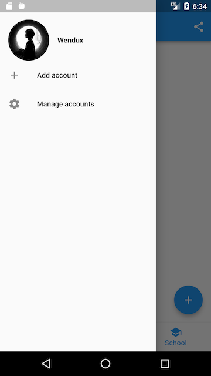

实现代码如下：

```dart
class ScaffoldRoute extends StatefulWidget {
  @override
  _ScaffoldRouteState createState() => _ScaffoldRouteState();
}

class _ScaffoldRouteState extends State<ScaffoldRoute> {
  int _selectedIndex = 1;

  @override
  Widget build(BuildContext context) {
    return Scaffold(
      appBar: AppBar( //导航栏
        title: Text("App Name"), 
        actions: <Widget>[ //导航栏右侧菜单
          IconButton(icon: Icon(Icons.share), onPressed: () {}),
        ],
      ),
      drawer: new MyDrawer(), //抽屉
      bottomNavigationBar: BottomNavigationBar( // 底部导航
        items: <BottomNavigationBarItem>[
          BottomNavigationBarItem(icon: Icon(Icons.home), title: Text('Home')),
          BottomNavigationBarItem(icon: Icon(Icons.business), title: Text('Business')),
          BottomNavigationBarItem(icon: Icon(Icons.school), title: Text('School')),
        ],
        currentIndex: _selectedIndex,
        fixedColor: Colors.blue,
        onTap: _onItemTapped,
      ),
      floatingActionButton: FloatingActionButton( //悬浮按钮
          child: Icon(Icons.add),
          onPressed:_onAdd
      ),
    );
  }
  void _onItemTapped(int index) {
    setState(() {
      _selectedIndex = index;
    });
  }
  void _onAdd(){
  }
}
```

上面代码中我们用到了如下组件：

| 组件名称             | 解释           |
| -------------------- | -------------- |
| AppBar               | 一个导航栏骨架 |
| MyDrawer             | 抽屉菜单       |
| BottomNavigationBar  | 底部导航栏     |
| FloatingActionButton | 漂浮按钮       |

#### AppBar

`AppBar`是一个Material风格的导航栏，通过它可以设置导航栏标题、导航栏菜单、导航栏底部的Tab标题等。下面我们看看AppBar的定义：

```dart
AppBar({
  Key key,
  this.leading, //导航栏最左侧Widget，常见为抽屉菜单按钮或返回按钮。
  this.automaticallyImplyLeading = true, //如果leading为null，是否自动实现默认的leading按钮
  this.title,// 页面标题
  this.actions, // 导航栏右侧菜单
  this.bottom, // 导航栏底部菜单，通常为Tab按钮组
  this.elevation = 4.0, // 导航栏阴影
  this.centerTitle, //标题是否居中 
  this.backgroundColor,
  ...   //其它属性见源码注释
})
```

如果给`Scaffold`添加了抽屉菜单，默认情况下`Scaffold`会自动将`AppBar`的`leading`设置为菜单按钮（如上面截图所示），点击它便可打开抽屉菜单。如果我们想自定义菜单图标，可以手动来设置`leading`，如：

```dart
Scaffold(
  appBar: AppBar(
    title: Text("App Name"),
    leading: Builder(builder: (context) {
      return IconButton(
        icon: Icon(Icons.dashboard, color: Colors.white), //自定义图标
        onPressed: () {
          // 打开抽屉菜单  
          Scaffold.of(context).openDrawer(); 
        },
      );
    }),
    ...  
  )
```

代码运行效果如图所示：


代码中打开抽屉菜单的方法在`ScaffoldState`中，通过`Scaffold.of(context)`可以获取父级最近的`Scaffold` 组件的`State`对象。

##### TabBar

下面我们通过`bottom`属性来添加一个导航栏底部Tab按钮组，将要实现的效果如图所示：


Material组件库中提供了一个`TabBar`组件，它可以快速生成`Tab`菜单，下面是上图对应的源码：

```dart
class _ScaffoldRouteState extends State<ScaffoldRoute>
    with SingleTickerProviderStateMixin {

  TabController _tabController; //需要定义一个Controller
  List tabs = ["新闻", "历史", "图片"];

  @override
  void initState() {
    super.initState();
    // 创建Controller  
    _tabController = TabController(length: tabs.length, vsync: this);
  }

  @override
  Widget build(BuildContext context) {
    return Scaffold(
      appBar: AppBar(
        ... //省略无关代码
        bottom: TabBar(   //生成Tab菜单
          controller: _tabController,
          tabs: tabs.map((e) => Tab(text: e)).toList()
        ),
      ),
      ... //省略无关代码

  }
```

上面代码首先创建了一个`TabController` ，它是用于控制/监听`Tab`菜单切换的。接下来通过`TabBar`生成了一个底部菜单栏，`TabBar`的`tabs`属性接受一个Widget数组，表示每一个Tab子菜单，我们可以自定义，也可以像示例中一样直接使用`Tab` 组件，它是Material组件库提供的Material风格的Tab菜单。

`Tab`组件有三个可选参数，除了可以指定文字外，还可以指定Tab菜单图标，或者直接自定义组件样式。`Tab`组件定义如下：

```dart
Tab({
  Key key,
  this.text, // 菜单文本
  this.icon, // 菜单图标
  this.child, // 自定义组件样式
})
```

##### TabBarView

通过`TabBar`我们只能生成一个静态的菜单，真正的Tab页还没有实现。由于`Tab`菜单和Tab页的切换需要同步，我们需要通过`TabController`去监听Tab菜单的切换去切换Tab页，代码如：

```dart
_tabController.addListener((){  
  switch(_tabController.index){
    case 1: ...;
    case 2: ... ;   
  }
});
```

Material库提供了一个`TabBarView`组件，通过它不仅可以轻松的实现Tab页，而且可以非常容易的配合`TabBar`来实现同步切换和滑动状态同步，示例如下：

```dart
Scaffold(
  appBar: AppBar(
    ... //省略无关代码
    bottom: TabBar(
      controller: _tabController,
      tabs: tabs.map((e) => Tab(text: e)).toList()),
  ),
  drawer: new MyDrawer(),
  body: TabBarView(
    controller: _tabController,
    children: tabs.map((e) { //创建3个Tab页
      return Container(
        alignment: Alignment.center,
        child: Text(e, textScaleFactor: 5),
      );
    }).toList(),
  ),
  ... // 省略无关代码  
)
```

运行后效果如图所示：


上例中`TabBar`和`TabBarView`的`controller`是同一个！正是如此，`TabBar`和`TabBarView`正是通过同一个`controller`来实现菜单切换和滑动状态同步的

另外，Material组件库也提供了一个`PageView` 组件，它和`TabBarView`功能相似

#### 抽屉菜单Drawer

`Scaffold`的`drawer`和`endDrawer`属性可以分别接受一个Widget来作为页面的左、右抽屉菜单。如果开发者提供了抽屉菜单，那么当用户手指从屏幕左（或右）侧向里滑动时便可打开抽屉菜单。本节开始部分的示例中实现了一个左抽屉菜单`MyDrawer`，它的源码如下：

```dart
class MyDrawer extends StatelessWidget {
  const MyDrawer({
    Key key,
  }) : super(key: key);

  @override
  Widget build(BuildContext context) {
    return Drawer(
      child: MediaQuery.removePadding(
        context: context,
        //移除抽屉菜单顶部默认留白
        removeTop: true,
        child: Column(
          crossAxisAlignment: CrossAxisAlignment.start,
          children: <Widget>[
            Padding(
              padding: const EdgeInsets.only(top: 38.0),
              child: Row(
                children: <Widget>[
                  Padding(
                    padding: const EdgeInsets.symmetric(horizontal: 16.0),
                    child: ClipOval(
                      child: Image.asset(
                        "imgs/avatar.png",
                        width: 80,
                      ),
                    ),
                  ),
                  Text(
                    "Wendux",
                    style: TextStyle(fontWeight: FontWeight.bold),
                  )
                ],
              ),
            ),
            Expanded(
              child: ListView(
                children: <Widget>[
                  ListTile(
                    leading: const Icon(Icons.add),
                    title: const Text('Add account'),
                  ),
                  ListTile(
                    leading: const Icon(Icons.settings),
                    title: const Text('Manage accounts'),
                  ),
                ],
              ),
            ),
          ],
        ),
      ),
    );
  }
}
```

抽屉菜单通常将`Drawer`组件作为根节点，它实现了Material风格的菜单面板，`MediaQuery.removePadding`可以移除Drawer默认的一些留白（比如Drawer默认顶部会留和手机状态栏等高的留白）

#### FloatingActionButton

`FloatingActionButton`是Material设计规范中的一种特殊Button，通常悬浮在页面的某一个位置作为某种常用动作的快捷入口，如示例中页面右下角的"➕"号按钮。我们可以通过`Scaffold`的`floatingActionButton`属性来设置一个`FloatingActionButton`，同时通过`floatingActionButtonLocation`属性来指定其在页面中悬浮的位置

#### 底部Tab导航栏

我们可以通过`Scaffold`的`bottomNavigationBar`属性来设置底部导航，我们通过Material组件库提供的`BottomNavigationBar`和`BottomNavigationBarItem`两种组件来实现Material风格的底部导航栏


Material组件库中提供了一个`BottomAppBar` 组件，它可以和`FloatingActionButton`配合实现这种“打洞”效果，源码如下：

```dart
bottomNavigationBar: BottomAppBar(
  color: Colors.white,
  shape: CircularNotchedRectangle(), // 底部导航栏打一个圆形的洞
  child: Row(
    children: [
      IconButton(icon: Icon(Icons.home)),
      SizedBox(), //中间位置空出
      IconButton(icon: Icon(Icons.business)),
    ],
    mainAxisAlignment: MainAxisAlignment.spaceAround, //均分底部导航栏横向空间
  ),
)
```

可以看到，上面代码中没有控制打洞位置的属性，实际上，打洞的位置取决于`FloatingActionButton`的位置，上面`FloatingActionButton`的位置为：

```dart
floatingActionButtonLocation: FloatingActionButtonLocation.centerDocked,
```

所以打洞位置在底部导航栏的正中间。

`BottomAppBar`的`shape`属性决定洞的外形，`CircularNotchedRectangle`实现了一个圆形的外形，我们也可以自定义外形，比如，Flutter Gallery示例中就有一个“钻石”形状的示例

### 剪裁（Clip）

Flutter中提供了一些剪裁函数，用于对组件进行剪裁。

| 剪裁Widget | 作用                                                     |
| ---------- | -------------------------------------------------------- |
| ClipOval   | 子组件为正方形时剪裁为内贴圆形，为矩形时，剪裁为内贴椭圆 |
| ClipRRect  | 将子组件剪裁为圆角矩形                                   |
| ClipRect   | 剪裁子组件到实际占用的矩形大小（溢出部分剪裁）           |

下面看一个例子：

```dart
import 'package:flutter/material.dart';

class ClipTestRoute extends StatelessWidget {
  @override
  Widget build(BuildContext context) {
    // 头像  
    Widget avatar = Image.asset("imgs/avatar.png", width: 60.0);
    return Center(
      child: Column(
        children: <Widget>[
          avatar, //不剪裁
          ClipOval(child: avatar), //剪裁为圆形
          ClipRRect( //剪裁为圆角矩形
            borderRadius: BorderRadius.circular(5.0),
            child: avatar,
          ), 
          Row(
            mainAxisAlignment: MainAxisAlignment.center,
            children: <Widget>[
              Align(
                alignment: Alignment.topLeft,
                widthFactor: .5,//宽度设为原来宽度一半，另一半会溢出
                child: avatar,
              ),
              Text("你好世界", style: TextStyle(color: Colors.green),)
            ],
          ),
          Row(
            mainAxisAlignment: MainAxisAlignment.center,
            children: <Widget>[
              ClipRect(//将溢出部分剪裁
                child: Align(
                  alignment: Alignment.topLeft,
                  widthFactor: .5,//宽度设为原来宽度一半
                  child: avatar,
                ),
              ),
              Text("你好世界",style: TextStyle(color: Colors.green))
            ],
          ),
        ],
      ),
    );
  }
}
```

运行效果如图所示：


上面最后的两个`Row`：通过`Align`设置`widthFactor`为0.5后，图片的实际宽度等于60×0.5，即原宽度一半，但此时图片溢出部分依然会显示，所以第一个“你好世界”会和图片的另一部分重合，为了剪裁掉溢出部分，我们在第二个`Row`中通过`ClipRect`将溢出部分剪裁掉了。

#### CustomClipper

`CustomClipper`来自定义剪裁区域

首先，自定义一个`CustomClipper`：

```dart
class MyClipper extends CustomClipper<Rect> {
  @override
  Rect getClip(Size size) => Rect.fromLTWH(10.0, 15.0, 40.0, 30.0);

  @override
  bool shouldReclip(CustomClipper<Rect> oldClipper) => false;
}
```

- `getClip()`是用于获取剪裁区域的接口，由于图片大小是60×60，我们返回剪裁区域为`Rect.fromLTWH(10.0, 15.0, 40.0, 30.0)`，即图片中部40×30像素的范围。
- `shouldReclip()` 接口决定是否重新剪裁。如果在应用中，剪裁区域始终不会发生变化时应该返回`false`，这样就不会触发重新剪裁，避免不必要的性能开销。如果剪裁区域会发生变化（比如在对剪裁区域执行一个动画），那么变化后应该返回`true`来重新执行剪裁。

然后，我们通过`ClipRect`来执行剪裁，为了看清图片实际所占用的位置，我们设置一个红色背景：

```dart
DecoratedBox(
  decoration: BoxDecoration(
    color: Colors.red
  ),
  child: ClipRect(
      clipper: MyClipper(), //使用自定义的clipper
      child: avatar
  ),
)
```

运行效果如图所示：


可以看到我们的剪裁成功了，但是图片所占用的空间大小仍然是60×60（红色区域），这是因为剪裁是在layout完成后的绘制阶段进行的，所以不会影响组件的大小，这和`Transform`原理是相似的。

## 可滚动组件

### 可滚动组件简介

当组件内容超过当前显示视口(ViewPort)时，如果没有特殊处理，Flutter则会提示Overflow错误。为此，Flutter提供了多种可滚动组件（Scrollable Widget）用于显示列表和长布局。

可滚动组件都直接或间接包含一个`Scrollable`组件:

```dart
Scrollable({
  ...
  this.axisDirection = AxisDirection.down,
  this.controller,
  this.physics,
  @required this.viewportBuilder, //后面介绍
})
```

- `axisDirection`：滚动方向。
- `physics`：此属性接受一个 `ScrollPhysics` 类型的对象，它决定可滚动组件如何响应用户操作，比如用户滑动完抬起手指后，继续执行动画；或者滑动到边界时，如何显示。默认情况下，Flutter会根据具体平台分别使用不同的 `ScrollPhysics` 对象，应用不同的显示效果，如当滑动到边界时，继续拖动的话，在iOS上会出现弹性效果，而在Android上会出现微光效果。如果你想在所有平台下使用同一种效果，可以显式指定一个固定的 `ScrollPhysics`，Flutter SDK中包含了两个 `ScrollPhysics` 的子类，他们可以直接使用：
  - `ClampingScrollPhysics`：Android下微光效果。
  - `BouncingScrollPhysics`：iOS下弹性效果。
- `controller`：此属性接受一个`ScrollController`对象。`ScrollController`的主要作用是控制滚动位置和监听滚动事件。默认情况下，Widget树中会有一个默认的`PrimaryScrollController`，如果子树中的可滚动组件没有显式的指定`controller`，并且`primary`属性值为`true`时（默认就为`true`），可滚动组件会使用这个默认的`PrimaryScrollController`。这种机制带来的好处是父组件可以控制子树中可滚动组件的滚动行为，例如，`Scaffold`正是使用这种机制在iOS中实现了点击导航栏回到顶部的功能。

#### Scrollbar

`Scrollbar`是一个Material风格的滚动指示器（滚动条），如果要给可滚动组件添加滚动条，只需将`Scrollbar`作为可滚动组件的任意一个父级组件即可，如：

```dart
Scrollbar(
  child: SingleChildScrollView(
    ...
  ),
);
```

`Scrollbar`和`CupertinoScrollbar`都是通过监听滚动通知来确定滚动条位置的

#### CupertinoScrollbar

`CupertinoScrollbar`是iOS风格的滚动条，如果你使用的是`Scrollbar`，那么在iOS平台它会自动切换为`CupertinoScrollbar`。

#### ViewPort视口

在很多布局系统中都有ViewPort的概念，在Flutter中，术语ViewPort（视口），如无特别说明，则是指一个Widget的实际显示区域。例如，一个`ListView`的显示区域高度是800像素，虽然其列表项总高度可能远远超过800像素，但是其ViewPort仍然是800像素。

#### 基于Sliver的延迟构建

如果一个可滚动组件支持Sliver模型，那么该滚动可以将子组件分成好多个“薄片”（Sliver），只有当Sliver出现在视口中时才会去构建它，这种模型也称为“基于Sliver的延迟构建模型”。可滚动组件中有很多都支持基于Sliver的延迟构建模型，如`ListView`、`GridView`，但是也有不支持该模型的，如`SingleChildScrollView`。

#### 主轴和纵轴

在可滚动组件的坐标描述中，通常将滚动方向称为主轴，非滚动方向称为纵轴。由于可滚动组件的默认方向一般都是沿垂直方向，所以默认情况下主轴就是指垂直方向，水平方向同理。

### SingleChildScrollView

`SingleChildScrollView` 只能接收一个子组件。定义如下：

```dart
SingleChildScrollView({
  this.scrollDirection = Axis.vertical, //滚动方向，默认是垂直方向
  this.reverse = false, 
  this.padding, 
  bool primary, 
  this.physics, 
  this.controller,
  this.child,
})
```

可滚动组件的通用属性见上一小结，我们重点看一下`reverse`和`primary`两个属性：

- `reverse`：该属性API文档解释是：是否按照阅读方向相反的方向滑动，如：`scrollDirection`值为`Axis.horizontal`，如果阅读方向是从左到右(取决于语言环境，阿拉伯语就是从右到左)。`reverse`为`true`时，那么滑动方向就是从右往左。其实此属性本质上是决定可滚动组件的初始滚动位置是在“头”还是“尾”，取`false`时，初始滚动位置在“头”，反之则在“尾”
- `primary`：指是否使用widget树中默认的`PrimaryScrollController`；当滑动方向为垂直方向（`scrollDirection`值为`Axis.vertical`）并且没有指定`controller`时，`primary`默认为`true`.

需要注意的是，通常`SingleChildScrollView`只应在期望的内容不会超过屏幕太多时使用，这是因为`SingleChildScrollView`不支持基于Sliver的延迟实例化模型，所以如果预计视口可能包含超出屏幕尺寸太多的内容时，应该使用一些支持Sliver延迟加载的可滚动组件，如`ListView`。

#### 示例

下面是一个将大写字母A-Z沿垂直方向显示的例子，由于垂直方向空间会超过屏幕视口高度，所以我们使用`SingleChildScrollView`：

```dart
class SingleChildScrollViewTestRoute extends StatelessWidget {
  @override
  Widget build(BuildContext context) {
    String str = "ABCDEFGHIJKLMNOPQRSTUVWXYZ";
    return Scrollbar( // 显示进度条
      child: SingleChildScrollView(
        padding: EdgeInsets.all(16.0),
        child: Center(
          child: Column( 
            //动态创建一个List<Widget>  
            children: str.split("") 
                //每一个字母都用一个Text显示,字体为原来的两倍
                .map((c) => Text(c, textScaleFactor: 2.0,)) 
                .toList(),
          ),
        ),
      ),
    );
  }
}
```

运行效果如图所示：

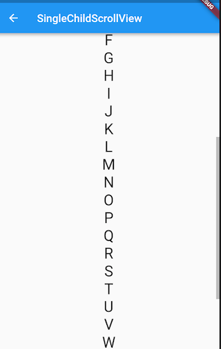

### ListView

`ListView`可以沿一个方向线性排布所有子组件，并且它也支持基于Sliver的延迟构建模型。`ListView`的默认构造函数定义：

```dart
ListView({
  ...  
  //可滚动widget公共参数
  Axis scrollDirection = Axis.vertical,
  bool reverse = false,
  ScrollController controller,
  bool primary,
  ScrollPhysics physics,
  EdgeInsetsGeometry padding,

  //ListView各个构造函数的共同参数  
  double itemExtent,
  bool shrinkWrap = false,
  bool addAutomaticKeepAlives = true,
  bool addRepaintBoundaries = true,
  double cacheExtent,

  //子widget列表
  List<Widget> children = const <Widget>[],
})
```

上面参数分为两组：第一组是可滚动组件的公共参数，第二组是`ListView`各个构造函数（`ListView`有多个构造函数）的共同参数：

- `itemExtent`：该参数如果不为`null`，则会强制`children`的“长度”为`itemExtent`的值；这里的“长度”是指滚动方向上子组件的长度，也就是说如果滚动方向是垂直方向，则`itemExtent`代表子组件的高度；如果滚动方向为水平方向，则`itemExtent`就代表子组件的宽度。在`ListView`中，指定`itemExtent`比让子组件自己决定自身长度会更高效
- `shrinkWrap`：该属性表示是否根据子组件的总长度来设置`ListView`的长度，默认值为`false` 。默认情况下，`ListView`的会在滚动方向尽可能多的占用空间。当`ListView`在一个无边界(滚动方向上)的容器中时，`shrinkWrap`必须为`true`。
- `addAutomaticKeepAlives`：该属性表示是否将列表项（子组件）包裹在`AutomaticKeepAlive` 组件中；典型地，在一个懒加载列表中，如果将列表项包裹在`AutomaticKeepAlive`中，在该列表项滑出视口时它也不会被GC（垃圾回收），它会使用`KeepAliveNotification`来保存其状态。如果列表项自己维护其`KeepAlive`状态，那么此参数必须置为`false`。
- `addRepaintBoundaries`：该属性表示是否将列表项（子组件）包裹在`RepaintBoundary`组件中。当可滚动组件滚动时，将列表项包裹在`RepaintBoundary`中可以避免列表项重绘，但是当列表项重绘的开销非常小（如一个颜色块，或者一个较短的文本）时，不添加`RepaintBoundary`反而会更高效。和`addAutomaticKeepAlive`一样，如果列表项自己维护其`KeepAlive`状态，那么此参数必须置为`false`。

#### 默认构造函数

默认构造函数有一个`children`参数，它接受一个Widget列表（List）。这种方式适合只有少量的子组件的情况，因为这种方式需要将所有`children`都提前创建好，而不是等到子`widget`真正显示的时候再创建，也就是说通过默认构造函数构建的`ListView`没有应用基于`Sliver`的懒加载模型。实际上通过此方式创建的`ListView`和使用`SingleChildScrollView`+`Column`的方式没有本质的区别。下面是一个例子：

```dart
ListView(
  shrinkWrap: true, 
  padding: const EdgeInsets.all(20.0),
  children: <Widget>[
    const Text('I\'m dedicating every day to you'),
    const Text('Domestic life was never quite my style'),
    const Text('When you smile, you knock me out, I fall apart'),
    const Text('And I thought I was so smart'),
  ],
);
```

#### ListView.builder

`ListView.builder`适合列表项比较多（或者无限）的情况，因为只有当子组件真正显示的时候才会被创建，也就说通过该构造函数创建的`ListView`是支持基于`Sliver`的懒加载模型的。下面看一下`ListView.builder`的核心参数列表：

```dart
ListView.builder({
  // ListView公共参数已省略  
  ...
  @required IndexedWidgetBuilder itemBuilder,
  int itemCount,
  ...
})
```

- `itemBuilder`：它是列表项的构建器，类型为`IndexedWidgetBuilder`，返回值为一个widget。当列表滚动到具体的`index`位置时，会调用该构建器构建列表项。
- `itemCount`：列表项的数量，如果为`null`，则为无限列表。

下面看一个例子：

```dart
ListView.builder(
    itemCount: 100,
    itemExtent: 50.0, //强制高度为50.0
    itemBuilder: (BuildContext context, int index) {
      return ListTile(title: Text("$index"));
    }
);
```

运行效果如图所示：


#### ListView.separated

`ListView.separated`可以在生成的列表项之间添加一个分割组件，它比`ListView.builder`多了一个`separatorBuilder`参数，该参数是一个分割组件生成器。

下面我们看一个例子：奇数行添加一条蓝色下划线，偶数行添加一条绿色下划线。

```dart
class ListView3 extends StatelessWidget {
  @override
  Widget build(BuildContext context) {
    //下划线widget预定义以供复用。  
    Widget divider1=Divider(color: Colors.blue,);
    Widget divider2=Divider(color: Colors.green);
    return ListView.separated(
        itemCount: 100,
        //列表项构造器
        itemBuilder: (BuildContext context, int index) {
          return ListTile(title: Text("$index"));
        },
        //分割器构造器
        separatorBuilder: (BuildContext context, int index) {
          return index%2==0?divider1:divider2;
        },
    );
  }
}
```


#### 实例：无限加载列表

假设我们要从数据源异步分批拉取一些数据，然后用`ListView`展示，当我们滑动到列表末尾时，判断是否需要再去拉取数据，如果是，则去拉取，拉取过程中在表尾显示一个loading，拉取成功后将数据插入列表；如果不需要再去拉取，则在表尾提示"没有更多"。代码如下：

```dart
class InfiniteListView extends StatefulWidget {
  @override
  _InfiniteListViewState createState() => new _InfiniteListViewState();
}

class _InfiniteListViewState extends State<InfiniteListView> {
  static const loadingTag = "##loading##"; //表尾标记
  var _words = <String>[loadingTag];

  @override
  void initState() {
    super.initState();
    _retrieveData();
  }

  @override
  Widget build(BuildContext context) {
    return ListView.separated(
      itemCount: _words.length,
      itemBuilder: (context, index) {
        //如果到了表尾
        if (_words[index] == loadingTag) {
          //不足100条，继续获取数据
          if (_words.length - 1 < 100) {
            //获取数据
            _retrieveData();
            //加载时显示loading
            return Container(
              padding: const EdgeInsets.all(16.0),
              alignment: Alignment.center,
              child: SizedBox(
                  width: 24.0,
                  height: 24.0,
                  child: CircularProgressIndicator(strokeWidth: 2.0)
              ),
            );
          } else {
            //已经加载了100条数据，不再获取数据。
            return Container(
                alignment: Alignment.center,
                padding: EdgeInsets.all(16.0),
                child: Text("没有更多了", style: TextStyle(color: Colors.grey),)
            );
          }
        }
        //显示单词列表项
        return ListTile(title: Text(_words[index]));
      },
      separatorBuilder: (context, index) => Divider(height: .0),
    );
  }

  void _retrieveData() {
    Future.delayed(Duration(seconds: 2)).then((e) {
      _words.insertAll(_words.length - 1,
          //每次生成20个单词
          generateWordPairs().take(20).map((e) => e.asPascalCase).toList()
      );
      setState(() {
        //重新构建列表
      });
    });
  }

}
```

运行后效果如图所示：


`_retrieveData()`的功能是模拟从数据源异步获取数据，我们使用`english_words`包的`generateWordPairs()`方法每次生成20个单词。

#### 添加固定列表头

使用`Expanded`自动拉伸组件大小，可以直接使用`Column`+`Expanded`来实现，代码如下：

```dart
@override
Widget build(BuildContext context) {
  return Column(children: <Widget>[
    ListTile(title:Text("商品列表")),
    Expanded(
      child: ListView.builder(itemBuilder: (BuildContext context, int index) {
        return ListTile(title: Text("$index"));
      }),
    ),
  ]);
}
```

效果如图：


#### 总结

可以通过`ListView.custom`来自定义，它需要实现一个`SliverChildDelegate`用来给ListView生成列表项组件

### GridView

`GridView`可以构建一个二维网格列表，其默认构造函数定义如下：

```dart
GridView({
  Axis scrollDirection = Axis.vertical,
  bool reverse = false,
  ScrollController controller,
  bool primary,
  ScrollPhysics physics,
  bool shrinkWrap = false,
  EdgeInsetsGeometry padding,
  @required SliverGridDelegate gridDelegate, //控制子widget layout的委托
  bool addAutomaticKeepAlives = true,
  bool addRepaintBoundaries = true,
  double cacheExtent,
  List<Widget> children = const <Widget>[],
})
```

`GridView`和`ListView`的大多数参数都是相同的，含义也都相同的，值得关注的是`gridDelegate`参数，类型是`SliverGridDelegate`，它的作用是控制`GridView`子组件如何排列(layout)。

`SliverGridDelegate`是一个抽象类，定义了`GridView` Layout相关接口，子类需要通过实现它们来实现具体的布局算法。Flutter中提供了两个`SliverGridDelegate`的子类`SliverGridDelegateWithFixedCrossAxisCount`和`SliverGridDelegateWithMaxCrossAxisExtent`，我们可以直接使用

#### SliverGridDelegateWithFixedCrossAxisCount

该子类实现了一个横轴为固定数量子元素的layout算法，其构造函数为：

```dart
SliverGridDelegateWithFixedCrossAxisCount({
  @required double crossAxisCount, 
  double mainAxisSpacing = 0.0,
  double crossAxisSpacing = 0.0,
  double childAspectRatio = 1.0,
})
```

- `crossAxisCount`：横轴子元素的数量。此属性值确定后子元素在横轴的长度就确定了，即ViewPort横轴长度除以`crossAxisCount`的商。
- `mainAxisSpacing`：主轴方向的间距。
- `crossAxisSpacing`：横轴方向子元素的间距。
- `childAspectRatio`：子元素在横轴长度和主轴长度的比例。由于`crossAxisCount`指定后，子元素横轴长度就确定了，然后通过此参数值就可以确定子元素在主轴的长度。

可以发现，子元素的大小是通过`crossAxisCount`和`childAspectRatio`两个参数共同决定的。注意，这里的子元素指的是子组件的最大显示空间，注意确保子组件的实际大小不要超出子元素的空间。

下面看一个例子：

```dart
GridView(
  gridDelegate: SliverGridDelegateWithFixedCrossAxisCount(
      crossAxisCount: 3, //横轴三个子widget
      childAspectRatio: 1.0 //宽高比为1时，子widget
  ),
  children:<Widget>[
    Icon(Icons.ac_unit),
    Icon(Icons.airport_shuttle),
    Icon(Icons.all_inclusive),
    Icon(Icons.beach_access),
    Icon(Icons.cake),
    Icon(Icons.free_breakfast)
  ]
);
```


##### GridView.count

`GridView.count`构造函数内部使用了`SliverGridDelegateWithFixedCrossAxisCount`，我们通过它可以快速的创建横轴固定数量子元素的`GridView`，上面的示例代码等价于：

```dart
GridView.count( 
  crossAxisCount: 3,
  childAspectRatio: 1.0,
  children: <Widget>[
    Icon(Icons.ac_unit),
    Icon(Icons.airport_shuttle),
    Icon(Icons.all_inclusive),
    Icon(Icons.beach_access),
    Icon(Icons.cake),
    Icon(Icons.free_breakfast),
  ],
);
```

#### SliverGridDelegateWithMaxCrossAxisExtent

该子类实现了一个横轴子元素为固定最大长度的layout算法，其构造函数为：

```dart
SliverGridDelegateWithMaxCrossAxisExtent({
  double maxCrossAxisExtent,
  double mainAxisSpacing = 0.0,
  double crossAxisSpacing = 0.0,
  double childAspectRatio = 1.0,
})
```

`maxCrossAxisExtent`为子元素在横轴上的最大长度，之所以是“最大”长度，是**因为横轴方向每个子元素的长度仍然是等分的**，举个例子，如果ViewPort的横轴长度是450，那么当`maxCrossAxisExtent`的值在区间[450/4，450/3)内的话，子元素最终实际长度都为112.5，而`childAspectRatio`所指的子元素横轴和主轴的长度比为**最终的长度比**。其它参数和`SliverGridDelegateWithFixedCrossAxisCount`相同。

下面我们看一个例子：

```dart
GridView(
  padding: EdgeInsets.zero,
  gridDelegate: SliverGridDelegateWithMaxCrossAxisExtent(
      maxCrossAxisExtent: 120.0,
      childAspectRatio: 2.0 //宽高比为2
  ),
  children: <Widget>[
    Icon(Icons.ac_unit),
    Icon(Icons.airport_shuttle),
    Icon(Icons.all_inclusive),
    Icon(Icons.beach_access),
    Icon(Icons.cake),
    Icon(Icons.free_breakfast),
  ],
);
```


##### GridView.extent

`GridView.extent`构造函数内部使用了`SliverGridDelegateWithMaxCrossAxisExtent`，我们通过它可以快速的创建纵轴子元素为固定最大长度的的`GridView`，上面的示例代码等价于：

```dart
GridView.extent(
   maxCrossAxisExtent: 120.0,
   childAspectRatio: 2.0,
   children: <Widget>[
     Icon(Icons.ac_unit),
     Icon(Icons.airport_shuttle),
     Icon(Icons.all_inclusive),
     Icon(Icons.beach_access),
     Icon(Icons.cake),
     Icon(Icons.free_breakfast),
   ],
 );
```

#### GridView.builder

上面我们介绍的GridView都需要一个widget数组作为其子元素，这些方式都会提前将所有子widget都构建好，所以只适用于子widget数量比较少时，当子widget比较多时，我们可以通过`GridView.builder`来动态创建子widget。`GridView.builder` 必须指定的参数有两个：

```dart
GridView.builder(
 ...
 @required SliverGridDelegate gridDelegate, 
 @required IndexedWidgetBuilder itemBuilder,
)
```

其中`itemBuilder`为子widget构建器。

##### 示例

假设我们需要从一个异步数据源（如网络）分批获取一些`Icon`，然后用`GridView`来展示：

```dart
class InfiniteGridView extends StatefulWidget {
  @override
  _InfiniteGridViewState createState() => new _InfiniteGridViewState();
}

class _InfiniteGridViewState extends State<InfiniteGridView> {

  List<IconData> _icons = []; //保存Icon数据

  @override
  void initState() {
    // 初始化数据  
    _retrieveIcons();
  }

  @override
  Widget build(BuildContext context) {
    return GridView.builder(
        gridDelegate: SliverGridDelegateWithFixedCrossAxisCount(
            crossAxisCount: 3, //每行三列
            childAspectRatio: 1.0 //显示区域宽高相等
        ),
        itemCount: _icons.length,
        itemBuilder: (context, index) {
          //如果显示到最后一个并且Icon总数小于200时继续获取数据
          if (index == _icons.length - 1 && _icons.length < 200) {
            _retrieveIcons();
          }
          return Icon(_icons[index]);
        }
    );
  }

  //模拟异步获取数据
  void _retrieveIcons() {
    Future.delayed(Duration(milliseconds: 200)).then((e) {
      setState(() {
        _icons.addAll([
          Icons.ac_unit,
          Icons.airport_shuttle,
          Icons.all_inclusive,
          Icons.beach_access, Icons.cake,
          Icons.free_breakfast
        ]);
      });
    });
  }
}
```

- `_retrieveIcons()`：在此方法中我们通过`Future.delayed`来模拟从异步数据源获取数据，每次获取数据需要200毫秒，获取成功后将新数据添加到_icons，然后调用setState重新构建。
- 在`itemBuilder`中，如果显示到最后一个时，判断是否需要继续获取数据，然后返回一个Icon。

#### 更多

Flutter的`GridView`默认子元素显示空间是相等的，但在实际开发中，你可能会遇到子元素大小不等的情况，如下面这样的布局：

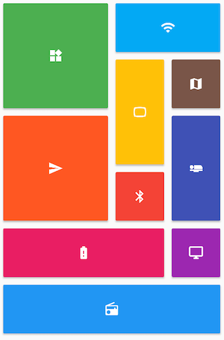

Pub上有一个包`flutter_staggered_grid_view` ，它实现了一个交错GridView的布局模型，可以很轻松的实现这种布局

### CustomScrollView

`CustomScrollView`是可以使用`Sliver`来自定义滚动模型（效果）的组件。它可以包含多种滚动模型，举个例子，假设有一个页面，顶部需要一个`GridView`，底部需要一个`ListView`，而要求整个页面的滑动效果是统一的，即它们看起来是一个整体。如果使用`GridView`+`ListView`来实现的话，就不能保证一致的滑动效果，因为它们的滚动效果是分离的，所以这时就需要一个"胶水"，把这些彼此独立的可滚动组件"粘"起来，而`CustomScrollView`的功能就相当于“胶水”。

#### 可滚动组件的Sliver版

在`Flutter`中，`Sliver`通常指可滚动组件子元素（就像一个个薄片一样）。但是在`CustomScrollView`中，需要粘起来的可滚动组件就是`CustomScrollView`的Sliver了，如果直接将`ListView`、`GridView`作为`CustomScrollView`是不行的，因为它们本身是可滚动组件而并不是Sliver！因此，为了能让可滚动组件能和`CustomScrollView`配合使用，Flutter提供了一些可滚动组件的Sliver版，如SliverList、SliverGrid等。实际上Sliver版的可滚动组件和非Sliver版的可滚动组件最大的区别就是**前者不包含滚动模型（自身不能再滚动），而后者包含滚动模型** ，也正因如此，`CustomScrollView`才可以将多个Sliver"粘"在一起，这些Sliver共用`CustomScrollView`的`Scrollable`，所以最终才实现了统一的滑动效果。

#### 示例

```dart
import 'package:flutter/material.dart';

class CustomScrollViewTestRoute extends StatelessWidget {
  @override
  Widget build(BuildContext context) {
    //因为本路由没有使用Scaffold，为了让子级Widget(如Text)使用
    //Material Design 默认的样式风格,我们使用Material作为本路由的根。
    return Material(
      child: CustomScrollView(
        slivers: <Widget>[
          //AppBar，包含一个导航栏
          SliverAppBar(
            pinned: true,
            expandedHeight: 250.0,
            flexibleSpace: FlexibleSpaceBar(
              title: const Text('Demo'),
              background: Image.asset(
                "./images/avatar.png", fit: BoxFit.cover,),
            ),
          ),

          SliverPadding(
            padding: const EdgeInsets.all(8.0),
            sliver: new SliverGrid( //Grid
              gridDelegate: new SliverGridDelegateWithFixedCrossAxisCount(
                crossAxisCount: 2, //Grid按两列显示
                mainAxisSpacing: 10.0,
                crossAxisSpacing: 10.0,
                childAspectRatio: 4.0,
              ),
              delegate: new SliverChildBuilderDelegate(
                    (BuildContext context, int index) {
                  //创建子widget      
                  return new Container(
                    alignment: Alignment.center,
                    color: Colors.cyan[100 * (index % 9)],
                    child: new Text('grid item $index'),
                  );
                },
                childCount: 20,
              ),
            ),
          ),
          //List
          new SliverFixedExtentList(
            itemExtent: 50.0,
            delegate: new SliverChildBuilderDelegate(
                    (BuildContext context, int index) {
                  //创建列表项      
                  return new Container(
                    alignment: Alignment.center,
                    color: Colors.lightBlue[100 * (index % 9)],
                    child: new Text('list item $index'),
                  );
                },
                childCount: 50 //50个列表项
            ),
          ),
        ],
      ),
    );
  }
}
```

代码分为三部分：

- 头部`SliverAppBar`：`SliverAppBar`对应`AppBar`，两者不同之处在于`SliverAppBar`可以集成到`CustomScrollView`。`SliverAppBar`可以结合`FlexibleSpaceBar`实现Material Design中头部伸缩的模型
- 中间的`SliverGrid`：它用`SliverPadding`包裹以给`SliverGrid`添加补白。`SliverGrid`是一个两列，宽高比为4的网格，它有20个子组件。
- 底部`SliverFixedExtentList`：它是一个所有子元素高度都为50像素的列表。

运行效果如图：


### 滚动监听及控制

#### ScrollController

`ScrollController`构造函数如下：

```dart
ScrollController({
  double initialScrollOffset = 0.0, //初始滚动位置
  this.keepScrollOffset = true,//是否保存滚动位置
  ...
})
```

`ScrollController`常用的属性和方法：

- `offset`：可滚动组件当前的滚动位置。
- `jumpTo(double offset)`、`animateTo(double offset,...)`：这两个方法用于跳转到指定的位置，它们不同之处在于，后者在跳转时会执行一个动画，而前者不会。

##### 滚动监听

`ScrollController`间接继承自`Listenable`，我们可以根据`ScrollController`来监听滚动事件，如：

```dart
controller.addListener(()=>print(controller.offset))
```

##### 示例

我们创建一个`ListView`，当滚动位置发生变化时，我们先打印出当前滚动位置，然后判断当前位置是否超过1000像素，如果超过则在屏幕右下角显示一个“返回顶部”的按钮，该按钮点击后可以使ListView恢复到初始位置；如果没有超过1000像素，则隐藏“返回顶部”按钮。代码如下：

```dart
class ScrollControllerTestRoute extends StatefulWidget {
  @override
  ScrollControllerTestRouteState createState() {
    return new ScrollControllerTestRouteState();
  }
}

class ScrollControllerTestRouteState extends State<ScrollControllerTestRoute> {
  ScrollController _controller = new ScrollController();
  bool showToTopBtn = false; //是否显示“返回到顶部”按钮

  @override
  void initState() {
    super.initState();
    //监听滚动事件，打印滚动位置
    _controller.addListener(() {
      print(_controller.offset); //打印滚动位置
      if (_controller.offset < 1000 && showToTopBtn) {
        setState(() {
          showToTopBtn = false;
        });
      } else if (_controller.offset >= 1000 && showToTopBtn == false) {
        setState(() {
          showToTopBtn = true;
        });
      }
    });
  }

  @override
  void dispose() {
    //为了避免内存泄露，需要调用_controller.dispose
    _controller.dispose();
    super.dispose();
  }

  @override
  Widget build(BuildContext context) {
    return Scaffold(
      appBar: AppBar(title: Text("滚动控制")),
      body: Scrollbar(
        child: ListView.builder(
            itemCount: 100,
            itemExtent: 50.0, //列表项高度固定时，显式指定高度是一个好习惯(性能消耗小)
            controller: _controller,
            itemBuilder: (context, index) {
              return ListTile(title: Text("$index"),);
            }
        ),
      ),
      floatingActionButton: !showToTopBtn ? null : FloatingActionButton(
          child: Icon(Icons.arrow_upward),
          onPressed: () {
            //返回到顶部时执行动画
            _controller.animateTo(.0,
                duration: Duration(milliseconds: 200),
                curve: Curves.ease
            );
          }
      ),
    );
  }
}
```

代码说明已经包含在注释里，下面我们看看运行效果：


由于列表项高度为50像素，当滑动到第20个列表项后，右下角“返回顶部”按钮会显示，点击该按钮，ListView会在返回顶部的过程中执行一个滚动动画，动画时间是200毫秒，动画曲线是`Curves.ease`

##### 滚动位置恢复

`PageStorage`是一个用于保存页面(路由)相关数据的组件，它并不会影响子树的UI外观，其实，`PageStorage`是一个功能型组件，它拥有一个存储桶（bucket），子树中的Widget可以通过指定不同的`PageStorageKey`来存储各自的数据或状态。

每次滚动结束，可滚动组件都会将滚动位置`offset`存储到`PageStorage`中，当可滚动组件重新创建时再恢复。如果`ScrollController.keepScrollOffset`为`false`，则滚动位置将不会被存储，可滚动组件重新创建时会使用`ScrollController.initialScrollOffset`；`ScrollController.keepScrollOffset`为`true`时，可滚动组件在**第一次**创建时，会滚动到`initialScrollOffset`处，因为这时还没有存储过滚动位置。在接下来的滚动中就会存储、恢复滚动位置，而`initialScrollOffset`会被忽略。

当一个路由中包含多个可滚动组件时，如果你发现在进行一些跳转或切换操作后，滚动位置不能正确恢复，这时你可以通过显式指定`PageStorageKey`来分别跟踪不同的可滚动组件的位置，如：

```dart
ListView(key: PageStorageKey(1), ... );
...
ListView(key: PageStorageKey(2), ... );
```

不同的`PageStorageKey`，需要不同的值，这样才可以为不同可滚动组件保存其滚动位置。

##### ScrollPosition

ScrollPosition是用来保存可滚动组件的滚动位置的。一个`ScrollController`对象可以同时被多个可滚动组件使用，`ScrollController`会为每一个可滚动组件创建一个`ScrollPosition`对象，这些`ScrollPosition`保存在`ScrollController`的`positions`属性中（`List`）。`ScrollPosition`是真正保存滑动位置信息的对象，`offset`只是一个便捷属性：

```dart
double get offset => position.pixels;
```

一个`ScrollController`虽然可以对应多个可滚动组件，但是有一些操作，如读取滚动位置`offset`，则需要一对一！但是我们仍然可以在一对多的情况下，通过其它方法读取滚动位置，举个例子，假设一个`ScrollController`同时被两个可滚动组件使用，那么我们可以通过如下方式分别读取他们的滚动位置：

```dart
...
controller.positions.elementAt(0).pixels
controller.positions.elementAt(1).pixels
...
```

我们可以通过`controller.positions.length`来确定`controller`被几个可滚动组件使用。

##### ScrollPosition的方法

`ScrollPosition`有两个常用方法：`animateTo()` 和 `jumpTo()`，它们是真正来控制跳转滚动位置的方法，`ScrollController`的这两个同名方法，内部最终都会调用`ScrollPosition`的。

##### ScrollController控制原理

我们来介绍一下`ScrollController`的另外三个方法：

```dart
ScrollPosition createScrollPosition(
    ScrollPhysics physics,
    ScrollContext context,
    ScrollPosition oldPosition);
void attach(ScrollPosition position) ;
void detach(ScrollPosition position) ;
```

当`ScrollController`和可滚动组件关联时，可滚动组件首先会调用`ScrollController`的`createScrollPosition()`方法来创建一个`ScrollPosition`来存储滚动位置信息，接着，可滚动组件会调用`attach()`方法，将创建的`ScrollPosition`添加到`ScrollController`的`positions`属性中，这一步称为“注册位置”，只有注册后`animateTo()` 和 `jumpTo()`才可以被调用。

当可滚动组件销毁时，会调用`ScrollController`的`detach()`方法，将其`ScrollPosition`对象从`ScrollController`的`positions`属性中移除，这一步称为“注销位置”，注销后`animateTo()` 和 `jumpTo()` 将不能再被调用。

需要注意的是，`ScrollController`的`animateTo()` 和 `jumpTo()`内部会调用所有`ScrollPosition`的`animateTo()` 和 `jumpTo()`，以实现所有和该`ScrollController`关联的可滚动组件都滚动到指定的位置。

#### 滚动监听

Flutter Widget树中子Widget可以通过发送通知（Notification）与父(包括祖先)Widget通信。父级组件可以通过`NotificationListener`组件来监听自己关注的通知，这种通信方式类似于Web开发中浏览器的事件冒泡，我们在Flutter中沿用“冒泡”这个术语，关于通知冒泡我们将在后面“事件处理与通知”一章中详细介绍。

可滚动组件在滚动时会发送`ScrollNotification`类型的通知，`ScrollBar`正是通过监听滚动通知来实现的。通过`NotificationListener`监听滚动事件和通过`ScrollController`有两个主要的不同：

1. 通过NotificationListener可以在从可滚动组件到widget树根之间任意位置都能监听。而`ScrollController`只能和具体的可滚动组件关联后才可以。
2. 收到滚动事件后获得的信息不同；`NotificationListener`在收到滚动事件时，通知中会携带当前滚动位置和ViewPort的一些信息，而`ScrollController`只能获取当前滚动位置。

##### 示例

下面，我们监听`ListView`的滚动通知，然后显示当前滚动进度百分比：

```dart
import 'package:flutter/material.dart';

class ScrollNotificationTestRoute extends StatefulWidget {
  @override
  _ScrollNotificationTestRouteState createState() =>
      new _ScrollNotificationTestRouteState();
}

class _ScrollNotificationTestRouteState
    extends State<ScrollNotificationTestRoute> {
  String _progress = "0%"; //保存进度百分比

  @override
  Widget build(BuildContext context) {
    return Scrollbar( //进度条
      // 监听滚动通知
      child: NotificationListener<ScrollNotification>(
        onNotification: (ScrollNotification notification) {
          double progress = notification.metrics.pixels /
              notification.metrics.maxScrollExtent;
          //重新构建
          setState(() {
            _progress = "${(progress * 100).toInt()}%";
          });
          print("BottomEdge: ${notification.metrics.extentAfter == 0}");
          //return true; //放开此行注释后，进度条将失效
        },
        child: Stack(
          alignment: Alignment.center,
          children: <Widget>[
            ListView.builder(
                itemCount: 100,
                itemExtent: 50.0,
                itemBuilder: (context, index) {
                  return ListTile(title: Text("$index"));
                }
            ),
            CircleAvatar(  //显示进度百分比
              radius: 30.0,
              child: Text(_progress),
              backgroundColor: Colors.black54,
            )
          ],
        ),
      ),
    );
  }
}
```

运行结果如图所示：

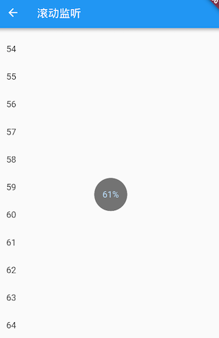

在接收到滚动事件时，参数类型为`ScrollNotification`，它包括一个`metrics`属性，它的类型是`ScrollMetrics`，该属性包含当前ViewPort及滚动位置等信息：

- `pixels`：当前滚动位置。
- `maxScrollExtent`：最大可滚动长度。
- `extentBefore`：滑出ViewPort顶部的长度；此示例中相当于顶部滑出屏幕上方的列表长度。
- `extentInside`：ViewPort内部长度；此示例中屏幕显示的列表部分的长度。
- `extentAfter`：列表中未滑入ViewPort部分的长度；此示例中列表底部未显示到屏幕范围部分的长度。
- `atEdge`：是否滑到了可滚动组件的边界（此示例中相当于列表顶或底部）。

## 功能型Widget

### 导航返回拦截

为了避免用户误触返回按钮而导致APP退出，在很多APP中都拦截了用户点击返回键的按钮，然后进行一些防误触判断，比如当用户在某一个时间段内点击两次时，才会认为用户是要退出（而非误触）。Flutter中可以通过`WillPopScope`来实现返回按钮拦截，`WillPopScope`的默认构造函数：

```dart
const WillPopScope({
  ...
  @required WillPopCallback onWillPop,
  @required Widget child
})
```

`onWillPop`是一个回调函数，当用户点击返回按钮时被调用（包括导航返回按钮及Android物理返回按钮）。该回调需要返回一个`Future`对象，如果返回的`Future`最终值为`false`时，则当前路由不出栈(不会返回)；最终值为`true`时，当前路由出栈退出。我们需要提供这个回调来决定是否退出。

#### 示例

为了防止用户误触返回键退出，我们拦截返回事件。当用户在1秒内点击两次返回按钮时，则退出；如果间隔超过1秒则不退出，并重新记时。代码如下：

```dart
import 'package:flutter/material.dart';

class WillPopScopeTestRoute extends StatefulWidget {
  @override
  WillPopScopeTestRouteState createState() {
    return new WillPopScopeTestRouteState();
  }
}

class WillPopScopeTestRouteState extends State<WillPopScopeTestRoute> {
  DateTime _lastPressedAt; //上次点击时间

  @override
  Widget build(BuildContext context) {
    return new WillPopScope(
        onWillPop: () async {
          if (_lastPressedAt == null ||
              DateTime.now().difference(_lastPressedAt) > Duration(seconds: 1)) {
            //两次点击间隔超过1秒则重新计时
            _lastPressedAt = DateTime.now();
            return false;
          }
          return true;
        },
        child: Container(
          alignment: Alignment.center,
          child: Text("1秒内连续按两次返回键退出"),
        )
    );
  }
}
```

### 数据共享

`InheritedWidget`提供了一种数据在widget树中从上到下传递、共享的方式，比如我们在应用的根widget中通过`InheritedWidget`共享了一个数据，那么我们便可以在任意子widget中来获取该共享的数据

#### didChangeDependencies

`StatefulWidget` 的 `State`对象有一个`didChangeDependencies`回调，它会在“依赖”发生变化时被`Flutter Framework`调用。而这个“依赖”指的就是子widget是否使用了父widget中`InheritedWidget`的数据！如果使用了，则代表子`widget`依赖`InheritedWidget`；如果没有使用则代表没有依赖。这种机制可以使子组件在所依赖的`InheritedWidget`变化时来更新自身！比如当主题、locale(语言)等发生变化时，依赖其的子widget的`didChangeDependencies`方法将会被调用。

下面我们看一下之前“计数器”示例应用程序的`InheritedWidget`版本。需要说明的是，本示例主要是为了演示`InheritedWidget`的功能特性，并不是计数器的推荐实现方式。

首先，我们通过继承`InheritedWidget`，将当前计数器点击次数保存在`ShareDataWidget`的`data`属性中：

```dart
class ShareDataWidget extends InheritedWidget {
  ShareDataWidget({
    @required this.data,
    Widget child
  }) :super(child: child);

  final int data; //需要在子树中共享的数据，保存点击次数

  //定义一个便捷方法，方便子树中的widget获取共享数据  
  static ShareDataWidget of(BuildContext context) {
    return context.inheritFromWidgetOfExactType(ShareDataWidget);
  }

  //该回调决定当data发生变化时，是否通知子树中依赖data的Widget  
  @override
  bool updateShouldNotify(ShareDataWidget old) {
    //如果返回true，则子树中依赖(build函数中有调用)本widget
    //的子widget的`state.didChangeDependencies`会被调用
    return old.data != data;
  }
}
```

然后我们实现一个子组件`_TestWidget`，在其`build`方法中引用`ShareDataWidget`中的数据。同时，在其`didChangeDependencies()` 回调中打印日志：

```dart
class _TestWidget extends StatefulWidget {
  @override
  __TestWidgetState createState() => new __TestWidgetState();
}

class __TestWidgetState extends State<_TestWidget> {
  @override
  Widget build(BuildContext context) {
    //使用InheritedWidget中的共享数据
    return Text(ShareDataWidget
        .of(context)
        .data
        .toString());
  }

  @override
  void didChangeDependencies() {
    super.didChangeDependencies();
    //父或祖先widget中的InheritedWidget改变(updateShouldNotify返回true)时会被调用。
    //如果build中没有依赖InheritedWidget，则此回调不会被调用。
    print("Dependencies change");
  }
}
```

最后，我们创建一个按钮，每点击一次，就将`ShareDataWidget`的值自增：

```dart
class InheritedWidgetTestRoute extends StatefulWidget {
  @override
  _InheritedWidgetTestRouteState createState() => new _InheritedWidgetTestRouteState();
}

class _InheritedWidgetTestRouteState extends State<InheritedWidgetTestRoute> {
  int count = 0;

  @override
  Widget build(BuildContext context) {
    return  Center(
      child: ShareDataWidget( //使用ShareDataWidget
        data: count,
        child: Column(
          mainAxisAlignment: MainAxisAlignment.center,
          children: <Widget>[
            Padding(
              padding: const EdgeInsets.only(bottom: 20.0),
              child: _TestWidget(),//子widget中依赖ShareDataWidget
            ),
            RaisedButton(
              child: Text("Increment"),
              //每点击一次，将count自增，然后重新build,ShareDataWidget的data将被更新  
              onPressed: () => setState(() => ++count),
            )
          ],
        ),
      ),
    );
  }
}
```

每点击一次按钮，计数器就会自增，控制台就会打印一句日志：

```
I/flutter ( 8513): Dependencies change
```

可见依赖发生变化后，其`didChangeDependencies()`会被调用。**如果_TestWidget的build方法中没有使用ShareDataWidget的数据，那么它的`didChangeDependencies()`将不会被调用，因为它并没有依赖ShareDataWidget**。例如，我们将`__TestWidgetState`代码该为下面这样，`didChangeDependencies()`将不会被调用:

```dart
class __TestWidgetState extends State<_TestWidget> {
  @override
  Widget build(BuildContext context) {
    // 使用InheritedWidget中的共享数据
    //    return Text(ShareDataWidget
    //        .of(context)
    //        .data
    //        .toString());
     return Text("text");
  }

  @override
  void didChangeDependencies() {
    super.didChangeDependencies();
    // build方法中没有依赖InheritedWidget，此回调不会被调用。
    print("Dependencies change");
  }
}
```

上面的代码中，我们将`build()`方法中依赖`ShareDataWidget`的代码注释掉了，然后返回一个固定`Text`，这样一来，当点击Increment按钮后，`ShareDataWidget`的`data`虽然发生变化，但由于`__TestWidgetState`并未依赖`ShareDataWidget`，所以`__TestWidgetState`的`didChangeDependencies`方法不会被调用

##### 应该在didChangeDependencies()中做什么？

一般来说，子widget很少会重写此方法，因为在依赖改变后`framework`也都会调用`build()`方法。但是，如果你需要在依赖改变后执行一些昂贵的操作，比如网络请求，这时最好的方式就是在此方法中执行，这样可以避免每次`build()`都执行这些昂贵操作。

#### 深入了解InheritedWidget

现在来思考一下，如果我们只想在`__TestWidgetState`中引用`ShareDataWidget`数据，但却不希望在`ShareDataWidget`发生变化时调用`__TestWidgetState`的`didChangeDependencies()`方法应该怎么办？其实答案很简单，我们只需要将`ShareDataWidget.of()`的实现改一下即可：

```dart
//定义一个便捷方法，方便子树中的widget获取共享数据
static ShareDataWidget of(BuildContext context) {
  //return context.inheritFromWidgetOfExactType(ShareDataWidget);
  return context.ancestorInheritedElementForWidgetOfExactType(ShareDataWidget).widget;
}
```

唯一的改动就是获取`ShareDataWidget`对象的方式，把`inheritFromWidgetOfExactType()`方法换成了`context.ancestorInheritedElementForWidgetOfExactType(ShareDataWidget).widget`，那么他们到底有什么区别呢，我们看一下这两个方法的源码（实现代码在`Element`类中）：

```dart
@override
InheritedElement ancestorInheritedElementForWidgetOfExactType(Type targetType) {
  final InheritedElement ancestor = _inheritedWidgets == null ? null :  _inheritedWidgets[targetType];
  return ancestor;
}

@override
InheritedWidget inheritFromWidgetOfExactType(Type targetType, { Object aspect }) {
  final InheritedElement ancestor = _inheritedWidgets == null ? null :   _inheritedWidgets[targetType];
  //多出的部分
  if (ancestor != null) {
    assert(ancestor is InheritedElement);
    return inheritFromElement(ancestor, aspect: aspect);
  }
  _hadUnsatisfiedDependencies = true;
  return null;
}
```

我们可以看到，`inheritFromWidgetOfExactType()` 比 `ancestorInheritedElementForWidgetOfExactType()`多调了`inheritFromElement`方法，`inheritFromElement`源码如下：

```dart
@override
InheritedWidget inheritFromElement(InheritedElement ancestor, { Object aspect }) {
  //注册依赖关系
  _dependencies ??= HashSet<InheritedElement>();
  _dependencies.add(ancestor);
  ancestor.updateDependencies(this, aspect);
  return ancestor.widget;
}
```

可以看到`inheritFromElement`方法中主要是注册了依赖关系！**调用`inheritFromWidgetOfExactType()` 和 `ancestorInheritedElementForWidgetOfExactType()`的区别就是前者会注册依赖关系，而后者不会**

### 跨组件状态共享

在`Flutter`开发中，状态管理一般的原则是：**如果状态是组件私有的，则应该由组件自己管理；如果状态要跨组件共享，则该状态应该由各个组件共同的父元素来管理**

#### Provider

`Provider` 包是一套跨组件状态共享解决方案：需要跨组件共享的状态保存在`InheritedWidget`中，然后在子组件中引用`InheritedWidget`

首先，我们需要一个保存需要共享的数据`InheritedWidget`，由于具体业务数据类型不可预期，为了通用性，我们使用泛型，定义一个通用的`InheritedProvider`类，它继承自`InheritedWidget`：

```dart
// 一个通用的InheritedWidget，保存需要跨组件共享的状态
class InheritedProvider<T> extends InheritedWidget {
  InheritedProvider({@required this.data, Widget child}) : super(child: child);

  //共享状态使用泛型
  final T data;

  @override
  bool updateShouldNotify(InheritedProvider<T> old) {
    //在此简单返回true，则每次更新都会调用依赖其的子孙节点的`didChangeDependencies`。
    return true;
  }
}
```

数据保存的地方有了，那么接下来我们需要做的就是在数据发生变化的时候来重新构建`InheritedProvider`，那么现在就面临两个问题：

1. 数据发生变化怎么通知？
2. 谁来重新构建`InheritedProvider`？

第一个问题其实很好解决，我们当然可以使用之前介绍的eventBus来进行事件通知，但是为了更贴近Flutter开发，我们使用Flutter中SDK中提供的`ChangeNotifier`类 ，它继承自`Listenable`，也实现了一个Flutter风格的发布者-订阅者模式，`ChangeNotifier`定义大致如下：

```dart
class ChangeNotifier implements Listenable {

  @override
  void addListener(VoidCallback listener) {
     //添加监听器
  }
  @override
  void removeListener(VoidCallback listener) {
    //移除监听器
  }

  void notifyListeners() {
    //通知所有监听器，触发监听器回调   
  }

  ... //省略无关代码
}
```

我们可以通过调用`addListener()`和`removeListener()`来添加、移除监听器（订阅者）；通过调用`notifyListeners()` 可以触发所有监听器回调。

现在，我们将要共享的状态放到一个Model类中，然后让它继承自`ChangeNotifier`，这样当共享的状态改变时，我们只需要调用`notifyListeners()` 来通知订阅者，然后由订阅者来重新构建`InheritedProvider`，这也是第二个问题的答案！接下来我们便实现这个订阅者类：

```dart
// 该方法用于在Dart中获取模板类型
Type _typeOf<T>() => T;

class ChangeNotifierProvider<T extends ChangeNotifier> extends StatefulWidget {
  ChangeNotifierProvider({
    Key key,
    this.data,
    this.child,
  });

  final Widget child;
  final T data;

  //定义一个便捷方法，方便子树中的widget获取共享数据
  static T of<T>(BuildContext context) {
    final type = _typeOf<InheritedProvider<T>>();
    final provider =  context.inheritFromWidgetOfExactType(type) as InheritedProvider<T>；
    return provider.data;
  }

  @override
  _ChangeNotifierProviderState<T> createState() => _ChangeNotifierProviderState<T>();
}
```

该类继承`StatefulWidget`，然后定义了一个`of()`静态方法供子类方便获取Widget树中的`InheritedProvider`中保存的共享状态(model)，下面我们实现该类对应的`_ChangeNotifierProviderState`类：

```dart
class _ChangeNotifierProviderState<T extends ChangeNotifier> extends State<ChangeNotifierProvider<T>> {
  void update() {
    //如果数据发生变化（model类调用了notifyListeners），重新构建InheritedProvider
    setState(() => {});
  }

  @override
  void didUpdateWidget(ChangeNotifierProvider<T> oldWidget) {
    //当Provider更新时，如果新旧数据不"=="，则解绑旧数据监听，同时添加新数据监听
    if (widget.data != oldWidget.data) {
      oldWidget.data.removeListener(update);
      widget.data.addListener(update);
    }
    super.didUpdateWidget(oldWidget);
  }

  @override
  void initState() {
    // 给model添加监听器
    widget.data.addListener(update);
    super.initState();
  }

  @override
  void dispose() {
    // 移除model的监听器
    widget.data.removeListener(update);
    super.dispose();
  }

  @override
  Widget build(BuildContext context) {
    return InheritedProvider<T>(
      data: widget.data,
      child: widget.child,
    );
  }
}
```

可以看到`_ChangeNotifierProviderState`类的主要作用就是监听到共享状态（model）改变时重新构建Widget树。注意，在`_ChangeNotifierProviderState`类中调用`setState()`方法，`widget.child`始终是同一个，所以执行build时，`InheritedProvider`的child引用的始终是同一个子widget，所以`widget.child`并不会重新`build`，这也就相当于对`child`进行了缓存！当然如果`ChangeNotifierProvider`父级Widget重新build时，则其传入的`child`便有可能会发生变化。

#### 购物车示例

我们需要实现一个显示购物车中所有商品总价的功能：

1. 向购物车中添加新商品时总价更新

定义一个`Item`类，用于表示商品信息：

```dart
class Item {
  Item(this.price, this.count);
  double price; //商品单价
  int count; // 商品份数
  //... 省略其它属性
}
```

定义一个保存购物车内商品数据的`CartModel`类:

```dart
class CartModel extends ChangeNotifier {
  // 用于保存购物车中商品列表
  final List<Item> _items = [];

  // 禁止改变购物车里的商品信息
  UnmodifiableListView<Item> get items => UnmodifiableListView(_items);

  // 购物车中商品的总价
  double get totalPrice =>
      _items.fold(0, (value, item) => value + item.count * item.price);

  // 将 [item] 添加到购物车。这是唯一一种能从外部改变购物车的方法。
  void add(Item item) {
    _items.add(item);
    // 通知监听器（订阅者），重新构建InheritedProvider， 更新状态。
    notifyListeners();
  }
}
```

`CartModel`即要跨组件共享的model类。最后我们构建示例页面：

```dart
class ProviderRoute extends StatefulWidget {
  @override
  _ProviderRouteState createState() => _ProviderRouteState();
}

class _ProviderRouteState extends State<ProviderRoute> {
  @override
  Widget build(BuildContext context) {
    return Center(
      child: ChangeNotifierProvider<CartModel>(
        data: CartModel(),
        child: Builder(builder: (context) {
          return Column(
            children: <Widget>[
              Builder(builder: (context){
                var cart=ChangeNotifierProvider.of<CartModel>(context);
                return Text("总价: ${cart.totalPrice}");
              }),
              Builder(builder: (context){
                print("RaisedButton build"); //在后面优化部分会用到
                return RaisedButton(
                  child: Text("添加商品"),
                  onPressed: () {
                    //给购物车中添加商品，添加后总价会更新
                    ChangeNotifierProvider.of<CartModel>(context).add(Item(20.0, 1));
                  },
                );
              }),
            ],
          );
        }),
      ),
    );
  }
}
```

运行示例后效果如图所示：


每次点击”添加商品“按钮，总价就会增加20，我们期望的功能实现了！可能有些读者会疑惑，我们饶了一大圈实现这么简单的功能有意义么？其实，就这个例子来看，只是更新同一个路由页中的一个状态，我们使用`ChangeNotifierProvider`的优势并不明显，但是如果我们是做一个购物APP呢？由于购物车数据通常是会在整个APP中共享的，比如会跨路由共享。如果我们将`ChangeNotifierProvider`放在整个应用的Widget树的根上，那么整个APP就可以共享购物车的数据了，这时`ChangeNotifierProvider`的优势将会非常明显。

虽然上面的例子比较简单，但它却将Provider的原理和流程体现的很清楚，Provider的原理图：


Model变化后会自动通知`ChangeNotifierProvider`（订阅者），`ChangeNotifierProvider`内部会重新构建`InheritedWidget`，而依赖该`InheritedWidget`的子孙Widget就会更新。

我们可以发现使用Provider，将会带来如下收益：

1. 我们的业务代码更关注数据了，只要更新Model，则UI会自动更新，而不用在状态改变后再去手动调用`setState()`来显式更新页面。
2. 数据改变的消息传递被屏蔽了，我们无需手动去处理状态改变事件的发布和订阅了，这一切都被封装在Provider中了
3. 在大型复杂应用中，尤其是需要全局共享的状态非常多时，使用Provider将会大大简化我们的代码逻辑，降低出错的概率，提高开发效率。

#### 优化

我们上面实现的`ChangeNotifierProvider`是有两个明显缺点：代码组织问题和性能问题，下面我们一一讨论。

##### 代码组织问题

我们先看一下构建显示总价Text的代码：

```dart
Builder(builder: (context){
  var cart=ChangeNotifierProvider.of<CartModel>(context);
  return Text("总价: ${cart.totalPrice}");
})
```

这段代码有两点可以优化：

1. 需要显式调用`ChangeNotifierProvider.of`，当APP内部依赖`CartModel`很多时，这样的代码将很冗余。
2. 语义不明确；由于`ChangeNotifierProvider`是订阅者，那么依赖`CartModel`的Widget自然就是订阅者，其实也就是状态的消费者，如果我们用`Builder` 来构建，语义就不是很明确；如果我们能使用一个具有明确语义的Widget，比如就叫`Consumer`，这样最终的代码语义将会很明确，只要看到`Consumer`，我们就知道它是依赖某个跨组件或全局的状态。

为了优化这两个问题，我们可以封装一个`Consumer` Widget，实现如下：

```dart
// 这是一个便捷类，会获得当前context和指定数据类型的Provider
class Consumer<T> extends StatelessWidget {
  Consumer({
    Key key,
    @required this.builder,
    this.child,
  })  : assert(builder != null),
        super(key: key);

  final Widget child;

  final Widget Function(BuildContext context, T value) builder;

  @override
  Widget build(BuildContext context) {
    return builder(
      context,
      ChangeNotifierProvider.of<T>(context), //自动获取Model
    );
  }
}
```

`Consumer`实现非常简单，它通过指定模板参数，然后再内部自动调用`ChangeNotifierProvider.of`获取相应的Model，并且`Consumer`这个名字本身也是具有确切语义（消费者）。现在上面的代码块可以优化为如下这样：

```dart
Consumer<CartModel>(
  builder: (context, cart)=> Text("总价: ${cart.totalPrice}");
)
```

是不是很优雅！

##### 性能问题

上面的代码还有一个性能问题，就在构建”添加按钮“的代码处：

```dart
Builder(builder: (context) {
  print("RaisedButton build"); // 构建时输出日志
  return RaisedButton(
    child: Text("添加商品"),
    onPressed: () {
      ChangeNotifierProvider.of<CartModel>(context).add(Item(20.0, 1));
    },
  );
}
```

我们点击”添加商品“按钮后，由于购物车商品总价会变化，所以显示总价的Text更新是符合预期的，但是”添加商品“按钮本身没有变化，是不应该被重新build的。但是我们运行示例，每次点击”添加商品“按钮，控制台都会输出"RaisedButton build"日志，也就是说”添加商品“按钮在每次点击时其自身都会重新build！这是为什么呢？如果你已经理解了`InheritedWidget`的更新机制，那么答案一眼就能看出：这是因为构建`RaisedButton`的`Builder`中调用了`ChangeNotifierProvider.of`，也就是说依赖了Widget树上面的`InheritedWidget`（即`InheritedProvider` ）Widget，所以当添加完商品后，`CartModel`发生变化，会通知`ChangeNotifierProvider`, 而`ChangeNotifierProvider`则会重新构建子树，所以`InheritedProvider`将会更新，此时依赖它的子孙Widget就会被重新构建。

问题的原因搞清楚了，那么我们如何避免这不必要重构呢？既然按钮重新被build是因为按钮和`InheritedWidget`建立了依赖关系，那么我们只要打破或解除这种依赖关系就可以了。那么如何解除按钮和`InheritedWidget`的依赖关系呢？我们上一节介绍`InheritedWidget`时已经讲过了：调用`inheritFromWidgetOfExactType()` 和 `ancestorInheritedElementForWidgetOfExactType()`的区别就是前者会注册依赖关系，而后者不会。所以我们只需要将`ChangeNotifierProvider.of`的实现改为下面这样既可：

```dart
 //添加一个listen参数，表示是否建立依赖关系
  static T of<T>(BuildContext context, {bool listen = true}) {
    final type = _typeOf<InheritedProvider<T>>();
    final provider = listen
        ? context.inheritFromWidgetOfExactType(type) as InheritedProvider<T>
        : context.ancestorInheritedElementForWidgetOfExactType(type)?.widget
            as InheritedProvider<T>;
    return provider.data;
  }
```

然后我们将调用部分代码改为：

```dart
Column(
    children: <Widget>[
      Consumer<CartModel>(
        builder: (BuildContext context, cart) =>Text("总价: ${cart.totalPrice}"),
      ),
      Builder(builder: (context) {
        print("RaisedButton build");
        return RaisedButton(
          child: Text("添加商品"),
          onPressed: () {
            // listen 设为false，不建立依赖关系
            ChangeNotifierProvider.of<CartModel>(context, listen: false)
                .add(Item(20.0, 1));
          },
        );
      })
    ],
  )
```

修改后在此运行上面的示例，我们会发现点击”添加商品“按钮后，控制台不会再输出"RaisedButton build"了，即按钮不会被重新构建了。而总价仍然会更新，这是因为`Consumer`中调用`ChangeNotifierProvider.of`时`listen`值为默认值true，所以还是会建立依赖关系。

#### 其它状态管理包

现在`Flutter`社区已经有很多专门用于状态管理的包了，在此我们列出几个相对评分比较高的：

| 包名                                                         | 介绍                                          |
| ------------------------------------------------------------ | --------------------------------------------- |
| [Provider](https://pub.flutter-io.cn/packages/provider) & [Scoped Model](https://pub.flutter-io.cn/packages/scoped_model) | 这两个包都是基于`InheritedWidget`的，原理相似 |
| [Redux](https://pub.flutter-io.cn/packages/flutter_redux)    | 是Web开发中React生态链中Redux包的Flutter实现  |
| [MobX](https://pub.dev/packages/flutter_mobx)                | 是Web开发中React生态链中MobX包的Flutter实现   |
| [BLoC](https://pub.dev/packages/flutter_bloc)                | 是BLoC模式的Flutter实现                       |

### 颜色和主题

#### 颜色

Color类中颜色以一个int值保存，我们知道显示器颜色是由红、绿、蓝三基色组成，每种颜色占8比特，存储结构如下：

| Bit（位） | 颜色             |
| --------- | ---------------- |
| 0-7       | 蓝色             |
| 8-15      | 绿色             |
| 16-23     | 红色             |
| 24-31     | Alpha (不透明度) |

上面表格中的的字段在Color类中都有对应的属性，而Color中的众多方法也就是操作这些属性的。在此我们主要讨论两点：色值转换和亮度。

##### **如何将颜色字符串转成Color对象**

如Web开发中的色值通常是一个字符串如"#dc380d"，它是一个RGB值，我们可以通过下面这些方法将其转为Color类：

```dart
Color(0xffdc380d); //如果颜色固定可以直接使用整数值
//颜色是一个字符串变量
var c = "dc380d";
Color(int.parse(c,radix:16)|0xFF000000) //通过位运算符将Alpha设置为FF
Color(int.parse(c,radix:16)).withAlpha(255)  //通过方法将Alpha设置为FF
```

##### 颜色亮度

假如，我们要实现一个背景颜色和Title可以自定义的导航栏，并且背景色为深色时我们应该让Title显示为浅色；背景色为浅色时，Title显示为深色。要实现这个功能，我们就需要来计算背景色的亮度，然后动态来确定Title的颜色。Color类中提供了一个`computeLuminance()`方法，它可以返回一个`[0-1]`的一个值，数字越大颜色就越浅，我们可以根据它来动态确定Title的颜色，下面是导航栏NavBar的简单实现：

```dart
class NavBar extends StatelessWidget {
  final String title;
  final Color color; //背景颜色

  NavBar({
    Key key,
    this.color,
    this.title,
  });

  @override
  Widget build(BuildContext context) {
    return Container(
      constraints: BoxConstraints(
        minHeight: 52,
        minWidth: double.infinity,
      ),
      decoration: BoxDecoration(
        color: color,
        boxShadow: [
          //阴影
          BoxShadow(
            color: Colors.black26,
            offset: Offset(0, 3),
            blurRadius: 3,
          ),
        ],
      ),
      child: Text(
        title,
        style: TextStyle(
          fontWeight: FontWeight.bold,
          //根据背景色亮度来确定Title颜色
          color: color.computeLuminance() < 0.5 ? Colors.white : Colors.black,
        ),
      ),
      alignment: Alignment.center,
    );
  }
}
```

测试代码如下：

```dart
Column(
  children: <Widget>[
    //背景为蓝色，则title自动为白色
    NavBar(color: Colors.blue, title: "标题"), 
    //背景为白色，则title自动为黑色
    NavBar(color: Colors.white, title: "标题"),
  ]
)
```

运行效果如图所示：


##### MaterialColor

`MaterialColor`是实现Material Design中的颜色的类，它包含一种颜色的10个级别的渐变色。`MaterialColor`通过"[]"运算符的索引值来代表颜色的深度，有效的索引有：50，100，200，…，900，数字越大，颜色越深。`MaterialColor`的默认值为索引等于500的颜色。举个例子，`Colors.blue`是预定义的一个`MaterialColor`类对象，定义如下：

```dart
static const MaterialColor blue = MaterialColor(
  _bluePrimaryValue,
  <int, Color>{
     50: Color(0xFFE3F2FD),
    100: Color(0xFFBBDEFB),
    200: Color(0xFF90CAF9),
    300: Color(0xFF64B5F6),
    400: Color(0xFF42A5F5),
    500: Color(_bluePrimaryValue),
    600: Color(0xFF1E88E5),
    700: Color(0xFF1976D2),
    800: Color(0xFF1565C0),
    900: Color(0xFF0D47A1),
  },
);
static const int _bluePrimaryValue = 0xFF2196F3;
```

`Colors.blue[50]`到`Colors.blue[100]`的色值从浅蓝到深蓝渐变，效果如图所示：

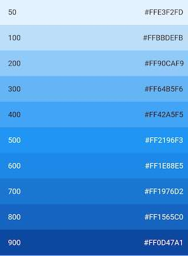

#### Theme

`Theme`组件可以为Material APP定义主题数据（ThemeData）。Material组件库里很多组件都使用了主题数据，如导航栏颜色、标题字体、Icon样式等。`Theme`内会使用`InheritedWidget`来为其子树共享样式数据。

##### ThemeData

`ThemeData`用于保存是Material 组件库的主题数据，Material组件需要遵守相应的设计规范，而这些规范可自定义部分都定义在ThemeData中了，所以我们可以通过ThemeData来自定义应用主题。在子组件中，我们可以通过`Theme.of`方法来获取当前的`ThemeData`。

我们看看`ThemeData`部分数据定义：

```dart
ThemeData({
  Brightness brightness, //深色还是浅色
  MaterialColor primarySwatch, //主题颜色样本，见下面介绍
  Color primaryColor, //主色，决定导航栏颜色
  Color accentColor, //次级色，决定大多数Widget的颜色，如进度条、开关等。
  Color cardColor, //卡片颜色
  Color dividerColor, //分割线颜色
  ButtonThemeData buttonTheme, //按钮主题
  Color cursorColor, //输入框光标颜色
  Color dialogBackgroundColor,//对话框背景颜色
  String fontFamily, //文字字体
  TextTheme textTheme,// 字体主题，包括标题、body等文字样式
  IconThemeData iconTheme, // Icon的默认样式
  TargetPlatform platform, //指定平台，应用特定平台控件风格
  ...
})
```

上面只是`ThemeData`的一小部分属性，完整的数据定义读者可以查看SDK。上面属性中需要说明的是`primarySwatch`，它是主题颜色的一个"样本色"，通过这个样本色可以在一些条件下生成一些其它的属性，例如，如果没有指定`primaryColor`，并且当前主题不是深色主题，那么`primaryColor`就会默认为`primarySwatch`指定的颜色，还有一些相似的属性如`accentColor` 、`indicatorColor`等也会受`primarySwatch`影响。

##### 示例

我们实现一个路由换肤功能：

```dart
class ThemeTestRoute extends StatefulWidget {
  @override
  _ThemeTestRouteState createState() => new _ThemeTestRouteState();
}

class _ThemeTestRouteState extends State<ThemeTestRoute> {
  Color _themeColor = Colors.teal; //当前路由主题色

  @override
  Widget build(BuildContext context) {
    ThemeData themeData = Theme.of(context);
    return Theme(
      data: ThemeData(
          primarySwatch: _themeColor, //用于导航栏、FloatingActionButton的背景色等
          iconTheme: IconThemeData(color: _themeColor) //用于Icon颜色
      ),
      child: Scaffold(
        appBar: AppBar(title: Text("主题测试")),
        body: Column(
          mainAxisAlignment: MainAxisAlignment.center,
          children: <Widget>[
            //第一行Icon使用主题中的iconTheme
            Row(
                mainAxisAlignment: MainAxisAlignment.center,
                children: <Widget>[
                  Icon(Icons.favorite),
                  Icon(Icons.airport_shuttle),
                  Text("  颜色跟随主题")
                ]
            ),
            //为第二行Icon自定义颜色（固定为黑色)
            Theme(
              data: themeData.copyWith(
                iconTheme: themeData.iconTheme.copyWith(
                    color: Colors.black
                ),
              ),
              child: Row(
                  mainAxisAlignment: MainAxisAlignment.center,
                  children: <Widget>[
                    Icon(Icons.favorite),
                    Icon(Icons.airport_shuttle),
                    Text("  颜色固定黑色")
                  ]
              ),
            ),
          ],
        ),
        floatingActionButton: FloatingActionButton(
            onPressed: () =>  //切换主题
                setState(() =>
                _themeColor =
                _themeColor == Colors.teal ? Colors.blue : Colors.teal
                ),
            child: Icon(Icons.palette)
        ),
      ),
    );
  }
}
```

运行后点击右下角悬浮按钮则可以切换主题，如图所示：

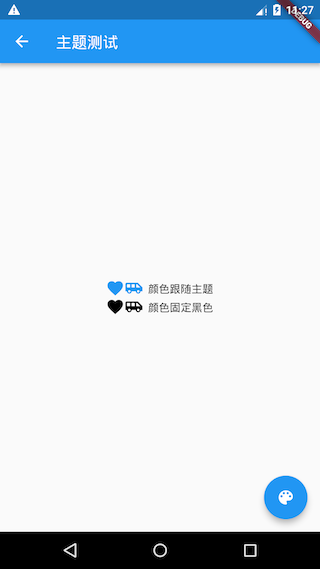

需要注意的有三点：

- 可以通过局部主题覆盖全局主题，正如代码中通过Theme为第二行图标指定固定颜色（黑色）一样，这是一种常用的技巧，Flutter中会经常使用这种方法来自定义子树主题。那么为什么局部主题可以覆盖全局主题？这主要是因为widget中使用主题样式时是通过`Theme.of(BuildContext context)`来获取的，我们看看其简化后的代码：

- ```dart
  static ThemeData of(BuildContext context, { bool shadowThemeOnly = false }) {
     // 简化代码，并非源码  
     return context.inheritFromWidgetOfExactType(_InheritedTheme).theme.data
  }
  ```

  `context.inheritFromWidgetOfExactType` 会在widget树中从当前位置向上查找第一个类型为`_InheritedTheme`的widget。所以当局部指定`Theme`后，其子树中通过`Theme.of()`向上查找到的第一个`_InheritedTheme`便是我们指定的`Theme`。

- 本示例是对单个路由换肤，如果想要对整个应用换肤，则可以去修改`MaterialApp`的`theme`属性。

### 异步UI更新

很多时候我们会依赖一些异步数据来动态更新UI，比如在打开一个页面时我们需要先从互联网上获取数据，在获取数据的过程中我们显示一个加载框，等获取到数据时我们再渲染页面；又比如我们想展示Stream（比如文件流、互联网数据接收流）的进度。Flutter专门提供了`FutureBuilder`和`StreamBuilder`两个组件来快速实现这种功能。

#### FutureBuilder

`FutureBuilder`会依赖一个`Future`，它会根据所依赖的`Future`的状态来动态构建自身。我们看一下`FutureBuilder`构造函数：

```dart
FutureBuilder({
  this.future,
  this.initialData,
  @required this.builder,
})
```

- `future`：`FutureBuilder`依赖的`Future`，通常是一个异步耗时任务。

- `initialData`：初始数据，用户设置默认数据。

- `builder`：Widget构建器；该构建器会在`Future`执行的不同阶段被多次调用，构建器签名如下：

  ```dart
  Function (BuildContext context, AsyncSnapshot snapshot)
  ```

  `snapshot`会包含当前异步任务的状态信息及结果信息 ，比如我们可以通过`snapshot.connectionState`获取异步任务的状态信息、通过`snapshot.hasError`判断异步任务是否有错误等等，完整的定义读者可以查看`AsyncSnapshot`类定义。

  另外，`FutureBuilder`的`builder`函数签名和`StreamBuilder`的`builder`是相同的。

##### 示例

我们实现一个路由，当该路由打开时我们从网上获取数据，获取数据时弹一个加载框；获取结束时，如果成功则显示获取到的数据，如果失败则显示错误。由于我们还没有介绍在flutter中如何发起网络请求，所以在这里我们不真正去网络请求数据，而是模拟一下这个过程，隔3秒后返回一个字符串：

```dart
Future<String> mockNetworkData() async {
  return Future.delayed(Duration(seconds: 2), () => "我是从互联网上获取的数据");
}
```

`FutureBuilder`使用代码如下：

```dart
...
Widget build(BuildContext context) {
  return Center(
    child: FutureBuilder<String>(
      future: mockNetworkData(),
      builder: (BuildContext context, AsyncSnapshot snapshot) {
        // 请求已结束
        if (snapshot.connectionState == ConnectionState.done) {
          if (snapshot.hasError) {
            // 请求失败，显示错误
            return Text("Error: ${snapshot.error}");
          } else {
            // 请求成功，显示数据
            return Text("Contents: ${snapshot.data}");
          }
        } else {
          // 请求未结束，显示loading
          return CircularProgressIndicator();
        }
      },
    ),
  );
}
```

运行结果如图所示：


上面代码中我们在`builder`中根据当前异步任务状态`ConnectionState`来返回不同的widget。`ConnectionState`是一个枚举类，定义如下：

```dart
enum ConnectionState {
  /// 当前没有异步任务，比如[FutureBuilder]的[future]为null时
  none,

  /// 异步任务处于等待状态
  waiting,

  /// Stream处于激活状态（流上已经有数据传递了），对于FutureBuilder没有该状态。
  active,

  /// 异步任务已经终止.
  done,
}
```

注意，`ConnectionState.active`只在`StreamBuilder`中才会出现。

#### StreamBuilder

我们知道，在Dart中`Stream` 也是用于接收异步事件数据，和`Future` 不同的是，它可以接收多个异步操作的结果，它常用于会多次读取数据的异步任务场景，如网络内容下载、文件读写等。`StreamBuilder`正是用于配合`Stream`来展示流上事件（数据）变化的UI组件。下面看一下`StreamBuilder`的默认构造函数：

```dart
StreamBuilder({
  Key key,
  this.initialData,
  Stream<T> stream,
  @required this.builder,
})
```

可以看到和`FutureBuilder`的构造函数只有一点不同：前者需要一个`future`，而后者需要一个`stream`。

##### 示例

我们创建一个计时器的示例：每隔1秒，计数加1。这里，我们使用`Stream`来实现每隔一秒生成一个数字:

```dart
Stream<int> counter() {
  return Stream.periodic(Duration(seconds: 1), (i) {
    return i;
  });
}
```

`StreamBuilder`使用代码如下：

```dart
 Widget build(BuildContext context) {
    return StreamBuilder<int>(
      stream: counter(), //
      //initialData: ,// a Stream<int> or null
      builder: (BuildContext context, AsyncSnapshot<int> snapshot) {
        if (snapshot.hasError)
          return Text('Error: ${snapshot.error}');
        switch (snapshot.connectionState) {
          case ConnectionState.none:
            return Text('没有Stream');
          case ConnectionState.waiting:
            return Text('等待数据...');
          case ConnectionState.active:
            return Text('active: ${snapshot.data}');
          case ConnectionState.done:
            return Text('Stream已关闭');
        }
        return null; // unreachable
      },
    );
 }
```

读者可以自己运行本示例查看运行结果。注意，本示例只是为了演示`StreamBuilder`的使用，在实战中，凡是UI会依赖多个异步数据而发生变化的场景都可以使用`StreamBuilder`。

### 对话框详解

本节将详细介绍一下Flutter中对话框的使用方式、实现原理、样式定制及状态管理。

#### 使用对话框

对话框本质上也是UI布局，通常一个对话框会包含标题、内容，以及一些操作按钮，为此，Material库中提供了一些现成的对话框组件来用于快速的构建出一个完整的对话框。

##### AlertDialog

下面我们主要介绍一下Material库中的`AlertDialog`组件，它的构造函数定义如下：

```dart
const AlertDialog({
  Key key,
  this.title, //对话框标题组件
  this.titlePadding, // 标题填充
  this.titleTextStyle, //标题文本样式
  this.content, // 对话框内容组件
  this.contentPadding = const EdgeInsets.fromLTRB(24.0, 20.0, 24.0, 24.0), //内容的填充
  this.contentTextStyle,// 内容文本样式
  this.actions, // 对话框操作按钮组
  this.backgroundColor, // 对话框背景色
  this.elevation,// 对话框的阴影
  this.semanticLabel, //对话框语义化标签(用于读屏软件)
  this.shape, // 对话框外形
})
```

参数都比较简单，不在赘述。下面我们看一个例子，假如我们要在删除文件时弹出一个确认对话框，该对话框如图所示：


该对话框样式代码如下：

```dart
AlertDialog(
  title: Text("提示"),
  content: Text("您确定要删除当前文件吗?"),
  actions: <Widget>[
    FlatButton(
      child: Text("取消"),
      onPressed: () => Navigator.of(context).pop(), //关闭对话框
    ),
    FlatButton(
      child: Text("删除"),
      onPressed: () {
        // ... 执行删除操作
        Navigator.of(context).pop(true); //关闭对话框
      },
    ),
  ],
);
```

实现代码很简单，不在赘述。唯一需要注意的是我们是通过`Navigator.of(context).pop(…)`方法来关闭对话框的，这和路由返回的方式是一致的，并且都可以返回一个结果数据。现在，对话框我们已经构建好了，那么如何将它弹出来呢？还有对话框返回的数据应如何被接收呢？这些问题的答案都在`showDialog()`方法中。

`showDialog()`是Material组件库提供的一个用于弹出Material风格对话框的方法，签名如下：

```dart
Future<T> showDialog<T>({
  @required BuildContext context,
  bool barrierDismissible = true, //点击对话框barrier(遮罩)时是否关闭它
  WidgetBuilder builder, // 对话框UI的builder
})
```

该方法只有两个参数，含义见注释。该方法返回一个`Future`，它正是用于接收对话框的返回值：如果我们是通过点击对话框遮罩关闭的，则`Future`的值为`null`，否则为我们通过`Navigator.of(context).pop(result)`返回的result值，下面我们看一下整个示例：

```dart
//点击该按钮后弹出对话框
RaisedButton(
  child: Text("对话框1"),
  onPressed: () async {
    //弹出对话框并等待其关闭
    bool delete = await showDeleteConfirmDialog1();
    if (delete == null) {
      print("取消删除");
    } else {
      print("已确认删除");
      //... 删除文件
    }
  },
),

// 弹出对话框
Future<bool> showDeleteConfirmDialog1() {
  return showDialog<bool>(
    context: context,
    builder: (context) {
      return AlertDialog(
        title: Text("提示"),
        content: Text("您确定要删除当前文件吗?"),
        actions: <Widget>[
          FlatButton(
            child: Text("取消"),
            onPressed: () => Navigator.of(context).pop(), // 关闭对话框
          ),
          FlatButton(
            child: Text("删除"),
            onPressed: () {
              //关闭对话框并返回true
              Navigator.of(context).pop(true);
            },
          ),
        ],
      );
    },
  );
}
```

示例运行后，我们点击对话框“取消”按钮或遮罩，控制台就会输出"取消删除"，如果点击“删除”按钮，控制台就会输出"已确认删除"。

> 注意：如果`AlertDialog`的内容过长，内容将会溢出，这在很多时候可能不是我们期望的，所以如果对话框内容过长时，可以用`SingleChildScrollView`将内容包裹起来。

##### SimpleDialog

`SimpleDialog`也是Material组件库提供的对话框，它会展示一个列表，用于列表选择的场景。下面是一个选择APP语言的示例，运行结果如图。


实现代码如下：

```dart
Future<void> changeLanguage() async {
  int i = await showDialog<int>(
      context: context,
      builder: (BuildContext context) {
        return SimpleDialog(
          title: const Text('请选择语言'),
          children: <Widget>[
            SimpleDialogOption(
              onPressed: () {
                // 返回1
                Navigator.pop(context, 1);
              },
              child: Padding(
                padding: const EdgeInsets.symmetric(vertical: 6),
                child: const Text('中文简体'),
              ),
            ),
            SimpleDialogOption(
              onPressed: () {
                // 返回2
                Navigator.pop(context, 2);
              },
              child: Padding(
                padding: const EdgeInsets.symmetric(vertical: 6),
                child: const Text('美国英语'),
              ),
            ),
          ],
        );
      });

  if (i != null) {
    print("选择了：${i == 1 ? "中文简体" : "美国英语"}");
  }
}
```

列表项组件我们使用了`SimpleDialogOption`组件来包装了一下，它相当于一个FlatButton，只不过按钮文案是左对齐的，并且padding较小。上面示例运行后，用户选择一种语言后，控制台就会打印出它。

##### Dialog

实际上`AlertDialog`和`SimpleDialog`都使用了`Dialog`类。由于`AlertDialog`和`SimpleDialog`中使用了`IntrinsicWidth`来尝试通过子组件的实际尺寸来调整自身尺寸，这就导致他们的子组件不能是延迟加载模型的组件（如`ListView`、`GridView` 、 `CustomScrollView`等），如下面的代码运行后会报错。

```dart
AlertDialog(
  content: ListView(
    children: ...//省略
  ),
);
```

如果我们就是需要嵌套一个`ListView`应该怎么做？这时，我们可以直接使用`Dialog`类，如：

```dart
Dialog(
  child: ListView(
    children: ...//省略
  ),
);
```

下面我们看一个弹出一个有30个列表项的对话框示例，运行效果如图7-12所示：


实现代码如下：

```dart
Future<void> showListDialog() async {
  int index = await showDialog<int>(
    context: context,
    builder: (BuildContext context) {
      var child = Column(
        children: <Widget>[
          ListTile(title: Text("请选择")),
          Expanded(
              child: ListView.builder(
            itemCount: 30,
            itemBuilder: (BuildContext context, int index) {
              return ListTile(
                title: Text("$index"),
                onTap: () => Navigator.of(context).pop(index),
              );
            },
          )),
        ],
      );
      //使用AlertDialog会报错
      //return AlertDialog(content: child);
      return Dialog(child: child);
    },
  );
  if (index != null) {
    print("点击了：$index");
  }
}
```

现在，我们己经介绍完了`AlertDialog`、`SimpleDialog`以及`Dialog`。上面的示例中，我们在调用`showDialog`时，在`builder`中都是构建了这三个对话框组件的一种，可能有些读者会惯性的以为在`builder`中只能返回这三者之一，其实这不是必须的！就拿`Dialog`的示例来举例，我们完全可以用下面的代码来替代`Dialog`：

```dart
// return Dialog(child: child) 
return UnconstrainedBox(
  constrainedAxis: Axis.vertical,
  child: ConstrainedBox(
    constraints: BoxConstraints(maxWidth: 280),
    child: Material(
      child: child,
      type: MaterialType.card,
    ),
  ),
);
```

上面代码运行后可以实现一样的效果。现在我们总结一下：`AlertDialog`、`SimpleDialog`以及`Dialog`是Material组件库提供的三种对话框，旨在帮助开发者快速构建出符合Material设计规范的对话框，但读者完全可以自定义对话框样式，因此，我们仍然可以实现各种样式的对话框，这样即带来了易用性，又有很强的扩展性。

#### 对话框打开动画及遮罩

我们可以把对话框分为内部样式和外部样式两部分。内部样式指对话框中显示的具体内容，这部分内容我们已经在上面介绍过了；外部样式包含对话框遮罩样式、打开动画等，本节主要介绍如何自定义这些外部样式。

> 关于动画相关内容我们将在本书后面章节介绍，下面内容读者可以先了解一下（不必深究），读者可以在学习完动画相关内容后再回头来看。

我们已经介绍过了`showDialog`方法，它是Material组件库中提供的一个打开Material风格对话框的方法。那如何打开一个普通风格的对话框呢（非Material风格）？ Flutter 提供了一个`showGeneralDialog`方法，签名如下：

```dart
Future<T> showGeneralDialog<T>({
  @required BuildContext context,
  @required RoutePageBuilder pageBuilder, //构建对话框内部UI
  bool barrierDismissible, //点击遮罩是否关闭对话框
  String barrierLabel, // 语义化标签(用于读屏软件)
  Color barrierColor, // 遮罩颜色
  Duration transitionDuration, // 对话框打开/关闭的动画时长
  RouteTransitionsBuilder transitionBuilder, // 对话框打开/关闭的动画
})
```

实际上，`showDialog`方法正是`showGeneralDialog`的一个封装，定制了Material风格对话框的遮罩颜色和动画。Material风格对话框打开/关闭动画是一个Fade（渐隐渐显）动画，如果我们想使用一个缩放动画就可以通过`transitionBuilder`来自定义。下面我们自己封装一个`showCustomDialog`方法，它定制的对话框动画为缩放动画，并同时制定遮罩颜色为`Colors.black87`：

```dart
Future<T> showCustomDialog<T>({
  @required BuildContext context,
  bool barrierDismissible = true,
  WidgetBuilder builder,
}) {
  final ThemeData theme = Theme.of(context, shadowThemeOnly: true);
  return showGeneralDialog(
    context: context,
    pageBuilder: (BuildContext buildContext, Animation<double> animation,
        Animation<double> secondaryAnimation) {
      final Widget pageChild = Builder(builder: builder);
      return SafeArea(
        child: Builder(builder: (BuildContext context) {
          return theme != null
              ? Theme(data: theme, child: pageChild)
              : pageChild;
        }),
      );
    },
    barrierDismissible: barrierDismissible,
    barrierLabel: MaterialLocalizations.of(context).modalBarrierDismissLabel,
    barrierColor: Colors.black87, // 自定义遮罩颜色
    transitionDuration: const Duration(milliseconds: 150),
    transitionBuilder: _buildMaterialDialogTransitions,
  );
}

Widget _buildMaterialDialogTransitions(
    BuildContext context,
    Animation<double> animation,
    Animation<double> secondaryAnimation,
    Widget child) {
  // 使用缩放动画
  return ScaleTransition(
    scale: CurvedAnimation(
      parent: animation,
      curve: Curves.easeOut,
    ),
    child: child,
  );
}
```

现在，我们使用`showCustomDialog`打开文件删除确认对话框，代码如下：

```dart
... //省略无关代码
showCustomDialog<bool>(
  context: context,
  builder: (context) {
    return AlertDialog(
      title: Text("提示"),
      content: Text("您确定要删除当前文件吗?"),
      actions: <Widget>[
        FlatButton(
          child: Text("取消"),
          onPressed: () => Navigator.of(context).pop(),
        ),
        FlatButton(
          child: Text("删除"),
          onPressed: () {
            // 执行删除操作
            Navigator.of(context).pop(true);
          },
        ),
      ],
    );
  },
);
```

运行效果如图7-13所示：


可以发现，遮罩颜色比通过`showDialog`方法打开的对话框更深。另外对话框打开/关闭的动画已变为缩放动画了，读者可以亲自运行示例查看效果。

#### 对话框实现原理

我们已经知道对话框最终都是由`showGeneralDialog`方法打开的，我们来看看它的具体实现：

```dart
Future<T> showGeneralDialog<T>({
  @required BuildContext context,
  @required RoutePageBuilder pageBuilder,
  bool barrierDismissible,
  String barrierLabel,
  Color barrierColor,
  Duration transitionDuration,
  RouteTransitionsBuilder transitionBuilder,
}) {
  return Navigator.of(context, rootNavigator: true).push<T>(_DialogRoute<T>(
    pageBuilder: pageBuilder,
    barrierDismissible: barrierDismissible,
    barrierLabel: barrierLabel,
    barrierColor: barrierColor,
    transitionDuration: transitionDuration,
    transitionBuilder: transitionBuilder,
  ));
}
```

实现很简单，直接调用`Navigator`的`push`方法打开了一个新的对话框路由`_DialogRoute`，然后返回了`push`的返回值。可见对话框实际上正是通过路由的形式实现的，这也是为什么我们可以使用`Navigator`的`pop` 方法来退出对话框的原因。关于对话框的样式定制在`_DialogRoute`中，没有什么新的东西，读者可以自行查看。

#### 对话框状态管理

我们在用户选择删除一个文件时，会询问是否删除此文件；在用户选择一个文件夹是，应该再让用户确认是否删除子文件夹。为了在用户选择了文件夹时避免二次弹窗确认是否删除子目录，我们在确认对话框底部添加一个“同时删除子目录？”的复选框，如图7-14所示：


现在就有一个问题：如何管理复选框的选中状态？习惯上，我们会在路由页的State中来管理选中状态，我们可能会写出如下这样的代码：

```dart
class _DialogRouteState extends State<DialogRoute> {
  bool withTree = false; // 复选框选中状态

  @override
  Widget build(BuildContext context) {
    return Column(
      children: <Widget>[
        RaisedButton(
          child: Text("对话框2"),
          onPressed: () async {
            bool delete = await showDeleteConfirmDialog2();
            if (delete == null) {
              print("取消删除");
            } else {
              print("同时删除子目录: $delete");
            }
          },
        ),
      ],
    );
  }

  Future<bool> showDeleteConfirmDialog2() {
    withTree = false; // 默认复选框不选中
    return showDialog<bool>(
      context: context,
      builder: (context) {
        return AlertDialog(
          title: Text("提示"),
          content: Column(
            crossAxisAlignment: CrossAxisAlignment.start,
            mainAxisSize: MainAxisSize.min,
            children: <Widget>[
              Text("您确定要删除当前文件吗?"),
              Row(
                children: <Widget>[
                  Text("同时删除子目录？"),
                  Checkbox(
                    value: withTree,
                    onChanged: (bool value) {
                      //复选框选中状态发生变化时重新构建UI
                      setState(() {
                        //更新复选框状态
                        withTree = !withTree;
                      });
                    },
                  ),
                ],
              ),
            ],
          ),
          actions: <Widget>[
            FlatButton(
              child: Text("取消"),
              onPressed: () => Navigator.of(context).pop(),
            ),
            FlatButton(
              child: Text("删除"),
              onPressed: () {
                //执行删除操作
                Navigator.of(context).pop(withTree);
              },
            ),
          ],
        );
      },
    );
  }
}
```

然后，当我们运行上面的代码时我们会发现复选框根本选不中！为什么会这样呢？其实原因很简单，我们知道`setState`方法只会针对当前context的子树重新build，但是我们的对话框并不是在`_DialogRouteState`的`build` 方法中构建的，而是通过`showDialog`单独构建的，所以调用在`_DialogRouteState`的context中调用`setState`是无法影响通过`showDialog`构建的UI的。另外，我们可以从另外一个角度来理解这个现象，前面说过对话框也是通过路由的方式来实现的，那么上面的代码实际上就等同于企图在父路由中调用`setState`来让子路由更新，这显然是不行的！简尔言之，根本原因就是context不对。那如何让复选框可点击呢？通常有如下三种方法：

##### 单独抽离出StatefulWidget

既然是context不对，那么直接的思路就是将复选框的选中逻辑单独封装成一个`StatefulWidget`，然后在其内部管理复选状态。我们先来看看这种方法，下面是实现代码：

```dart
// 单独封装一个内部管理选中状态的复选框组件
class DialogCheckbox extends StatefulWidget {
  DialogCheckbox({
    Key key,
    this.value,
    @required this.onChanged,
  });

  final ValueChanged<bool> onChanged;
  final bool value;

  @override
  _DialogCheckboxState createState() => _DialogCheckboxState();
}

class _DialogCheckboxState extends State<DialogCheckbox> {
  bool value;

  @override
  void initState() {
    value = widget.value;
    super.initState();
  }

  @override
  Widget build(BuildContext context) {
    return Checkbox(
      value: value,
      onChanged: (v) {
        //将选中状态通过事件的形式抛出
        widget.onChanged(v);
        setState(() {
          //更新自身选中状态
          value = v;
        });
      },
    );
  }
}
```

下面是弹出对话框的代码：

```dart
Future<bool> showDeleteConfirmDialog3() {
  bool _withTree = false; //记录复选框是否选中
  return showDialog<bool>(
    context: context,
    builder: (context) {
      return AlertDialog(
        title: Text("提示"),
        content: Column(
          crossAxisAlignment: CrossAxisAlignment.start,
          mainAxisSize: MainAxisSize.min,
          children: <Widget>[
            Text("您确定要删除当前文件吗?"),
            Row(
              children: <Widget>[
                Text("同时删除子目录？"),
                DialogCheckbox(
                  value: _withTree, //默认不选中
                  onChanged: (bool value) {
                    //更新选中状态
                    _withTree = !_withTree;
                  },
                ),
              ],
            ),
          ],
        ),
        actions: <Widget>[
          FlatButton(
            child: Text("取消"),
            onPressed: () => Navigator.of(context).pop(),
          ),
          FlatButton(
            child: Text("删除"),
            onPressed: () {
              // 将选中状态返回
              Navigator.of(context).pop(_withTree);
            },
          ),
        ],
      );
    },
  );
}
```

最后，就是使用：

```dart
RaisedButton(
  child: Text("话框3（复选框可点击）"),
  onPressed: () async {
    //弹出删除确认对话框，等待用户确认
    bool deleteTree = await showDeleteConfirmDialog3();
    if (deleteTree == null) {
      print("取消删除");
    } else {
      print("同时删除子目录: $deleteTree");
    }
  },
),
```

运行后效果如图7-15所示：


可见复选框能选中了，点击“取消”或“删除”后，控制台就会打印出最终的确认状态。

##### 使用StatefulBuilder方法

上面的方法虽然能解决对话框状态更新的问题，但是有一个明显的缺点——对话框上所有需要会改变状态的组件都得单独封装在一个在内部管理状态`StatefulWidget`中，这样不仅麻烦，而且复用性不大。因此，我们来想想能不能找到一种更简单的方法？上面的方法本质上就是将对话框的状态置于一个`StatefulWidget`的上下文中，由`StatefulWidget`在内部管理，那么我们有没有办法在不需要单独抽离组件的情况下创建一个`StatefulWidget`的上下文呢？想到这里，我们可以从`Builder`组件的实现获得灵感。在前面介绍过`Builder`组件可以获得组件所在位置的真正的Context，那它是怎么实现的呢，我们看看它的源码：

```dart
class Builder extends StatelessWidget {
  const Builder({
    Key key,
    @required this.builder,
  }) : assert(builder != null),
       super(key: key);
  final WidgetBuilder builder;

  @override
  Widget build(BuildContext context) => builder(context);
}
```

可以看到，`Builder`实际上只是继承了`StatelessWidget`，然后在`build`方法中获取当前context后将构建方法代理到了`builder`回调，可见，`Builder`实际上是获取了`StatelessWidget` 的上下文（context）。那么我们能否用相同的方法获取`StatefulWidget` 的上下文，并代理其`build`方法呢？下面我们照猫画虎，来封装一个`StatefulBuilder`方法：

```dart
class StatefulBuilder extends StatefulWidget {
  const StatefulBuilder({
    Key key,
    @required this.builder,
  }) : assert(builder != null),
       super(key: key);

  final StatefulWidgetBuilder builder;

  @override
  _StatefulBuilderState createState() => _StatefulBuilderState();
}

class _StatefulBuilderState extends State<StatefulBuilder> {
  @override
  Widget build(BuildContext context) => widget.builder(context, setState);
}
```

代码很简单，`StatefulBuilder`获取了`StatefulWidget`的上下文，并代理了其构建过程。下面我们就可以通过`StatefulBuilder`来重构上面的代码了（变动只在`DialogCheckbox`部分）：

```dart
... //省略无关代码
Row(
  children: <Widget>[
    Text("同时删除子目录？"),
    //使用StatefulBuilder来构建StatefulWidget上下文
    StatefulBuilder(
      builder: (context, _setState) {
        return Checkbox(
          value: _withTree, //默认不选中
          onChanged: (bool value) {
            //_setState方法实际就是该StatefulWidget的setState方法，
            //调用后builder方法会重新被调用
            _setState(() {
              //更新选中状态
              _withTree = !_withTree;
            });
          },
        );
      },
    ),
  ],
),
```

实际上，这种方法本质上就是子组件通知父组件（StatefulWidget）重新build子组件本身来实现UI更新的，读者可以对比代码理解。实际上`StatefulBuilder`正是Flutter SDK中提供的一个类，它和`Builder`的原理是一样的，在此，提醒读者一定要将`StatefulBuilder`和`Builder`理解透彻，因为它们在Flutter中是非常实用的。

##### 精妙的解法

要确认这个问题，我们就得先想想UI是怎么更新的，我们知道在调用`setState`方法后`StatefulWidget`就会重新build，那`setState`方法做了什么呢？我们能不能从中找到方法？顺着这个思路，我们就得看一下`setState`的核心源码：

```dart
void setState(VoidCallback fn) {
  ... //省略无关代码
  _element.markNeedsBuild();
}
```

可以发现，`setState`中调用了`Element`的`markNeedsBuild()`方法，我们前面说过，Flutter是一个响应式框架，要更新UI只需改变状态后通知框架页面需要重构即可，而`Element`的`markNeedsBuild()`方法正是来实现这个功能的！`markNeedsBuild()`方法会将当前的`Element`对象标记为“dirty”（脏的），在每一个Frame，Flutter都会重新构建被标记为“dirty”`Element`对象。既然如此，我们有没有办法获取到对话框内部UI的`Element`对象，然后将其标示为为“dirty”呢？答案是肯定的！我们可以通过Context来得到`Element`对象，至于`Element`与`Context`的关系我们将会在后面“Flutter核心原理”一章中再深入介绍，现在只需要简单的认为：在组件树中，`context`实际上就是`Element`对象的引用。知道这个后，那么解决的方案就呼之欲出了，我们可以通过如下方式来让复选框可以更新：

```dart
Future<bool> showDeleteConfirmDialog4() {
  bool _withTree = false;
  return showDialog<bool>(
    context: context,
    builder: (context) {
      return AlertDialog(
        title: Text("提示"),
        content: Column(
          crossAxisAlignment: CrossAxisAlignment.start,
          mainAxisSize: MainAxisSize.min,
          children: <Widget>[
            Text("您确定要删除当前文件吗?"),
            Row(
              children: <Widget>[
                Text("同时删除子目录？"),
                Checkbox( // 依然使用Checkbox组件
                  value: _withTree,
                  onChanged: (bool value) {
                    // 此时context为对话框UI的根Element，我们 
                    // 直接将对话框UI对应的Element标记为dirty
                    (context as Element).markNeedsBuild();
                    _withTree = !_withTree;
                  },
                ),
              ],
            ),
          ],
        ),
        actions: <Widget>[
          FlatButton(
            child: Text("取消"),
            onPressed: () => Navigator.of(context).pop(),
          ),
          FlatButton(
            child: Text("删除"),
            onPressed: () {
              // 执行删除操作
              Navigator.of(context).pop(_withTree);
            },
          ),
        ],
      );
    },
  );
}
```

上面的代码运行后复选框也可以正常选中。可以看到，我们只用了一行代码便解决了这个问题！当然上面的代码并不是最优，因为我们只需要更新复选框的状态，而此时的`context`我们用的是对话框的根`context`，所以会导致整个对话框UI组件全部rebuild，因此最好的做法是将`context`的“范围”缩小，也就是说只将`Checkbox`的Element标记为`dirty`，优化后的代码为：

```dart
... //省略无关代码
Row(
  children: <Widget>[
    Text("同时删除子目录？"),
    // 通过Builder来获得构建Checkbox的`context`，
    // 这是一种常用的缩小`context`范围的方式
    Builder(
      builder: (BuildContext context) {
        return Checkbox(
          value: _withTree,
          onChanged: (bool value) {
            (context as Element).markNeedsBuild();
            _withTree = !_withTree;
          },
        );
      },
    ),
  ],
),
```

#### 其它类型的对话框

##### 底部菜单列表

`showModalBottomSheet`方法可以弹出一个Material风格的底部菜单列表模态对话框，示例如下：

```dart
// 弹出底部菜单列表模态对话框
Future<int> _showModalBottomSheet() {
  return showModalBottomSheet<int>(
    context: context,
    builder: (BuildContext context) {
      return ListView.builder(
        itemCount: 30,
        itemBuilder: (BuildContext context, int index) {
          return ListTile(
            title: Text("$index"),
            onTap: () => Navigator.of(context).pop(index),
          );
        },
      );
    },
  );
}
```

点击按钮，弹出该对话框：

```dart
RaisedButton(
  child: Text("显示底部菜单列表"),
  onPressed: () async {
    int type = await _showModalBottomSheet();
    print(type);
  },
),
```

运行后效果如图所示：


`showModalBottomSheet`的实现原理和`showGeneralDialog`实现原理相同，都是通过路由的方式来实现的，读者可以查看源码对比。但值得一提的是还有一个`showBottomSheet`方法，该方法会从设备底部向上弹出一个全屏的菜单列表，示例如下：

```dart
// 返回的是一个controller
PersistentBottomSheetController<int> _showBottomSheet() {
  return showBottomSheet<int>(
    context: context,
    builder: (BuildContext context) {
      return ListView.builder(
        itemCount: 30,
        itemBuilder: (BuildContext context, int index) {
          return ListTile(
            title: Text("$index"),
            onTap: (){
              // do something
              print("$index");
              Navigator.of(context).pop();
            },
          );
        },
      );
    },
  );
}
```

运行效果如图7-17所示：


`PersistentBottomSheetController`中包含了一些控制对话框的方法比如`close`方法可以关闭该对话框，功能比较简单，读者可以自行查看源码。唯一需要注意的是，`showBottomSheet`和我们上面介绍的弹出对话框的方法原理不同：`showBottomSheet`是调用widget树顶部的`Scaffold`组件的`ScaffoldState`的`showBottomSheet`同名方法实现，也就是说要调用`showBottomSheet`方法就必须得保证父级组件中有`Scaffold`。

##### Loading框

其实Loading框可以直接通过`showDialog`+`AlertDialog`来自定义：

```dart
showLoadingDialog() {
  showDialog(
    context: context,
    barrierDismissible: false, //点击遮罩不关闭对话框
    builder: (context) {
      return AlertDialog(
        content: Column(
          mainAxisSize: MainAxisSize.min,
          children: <Widget>[
            CircularProgressIndicator(),
            Padding(
              padding: const EdgeInsets.only(top: 26.0),
              child: Text("正在加载，请稍后..."),
            )
          ],
        ),
      );
    },
  );
}
```

显示效果如图7-18所示：


如果我们嫌Loading框太宽，想自定义对话框宽度，这时只使用`SizedBox`或`ConstrainedBox`是不行的，原因是`showDialog`中已经给对话框设置了宽度限制，根据我们在第五章“尺寸限制类容器”一节中所述，我们可以使用`UnconstrainedBox`先抵消`showDialog`对宽度的限制，然后再使用`SizedBox`指定宽度，代码如下：

```dart
... //省略无关代码
UnconstrainedBox(
  constrainedAxis: Axis.vertical,
  child: SizedBox(
    width: 280,
    child: AlertDialog(
      content: Column(
        mainAxisSize: MainAxisSize.min,
        children: <Widget>[
          CircularProgressIndicator(value: .8,),
          Padding(
            padding: const EdgeInsets.only(top: 26.0),
            child: Text("正在加载，请稍后..."),
          )
        ],
      ),
    ),
  ),
);
```

代码运行后，效果如图7-19所示：

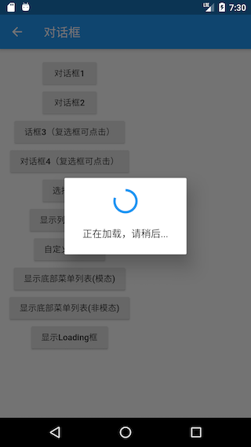

##### 日历选择

我们先看一下Material风格的日历选择器，如图7-20所示：


实现代码：

```dart
Future<DateTime> _showDatePicker1() {
  var date = DateTime.now();
  return showDatePicker(
    context: context,
    initialDate: date,
    firstDate: date,
    lastDate: date.add( //未来30天可选
      Duration(days: 30),
    ),
  );
}
```

iOS风格的日历选择器需要使用`showCupertinoModalPopup`方法和`CupertinoDatePicker`组件来实现：

```dart
Future<DateTime> _showDatePicker2() {
  var date = DateTime.now();
  return showCupertinoModalPopup(
    context: context,
    builder: (ctx) {
      return SizedBox(
        height: 200,
        child: CupertinoDatePicker(
          mode: CupertinoDatePickerMode.dateAndTime,
          minimumDate: date,
          maximumDate: date.add(
            Duration(days: 30),
          ),
          maximumYear: date.year + 1,
          onDateTimeChanged: (DateTime value) {
            print(value);
          },
        ),
      );
    },
  );
}
```

运行效果如图7-21所示：


## 事件处理与通知

### 原始指针事件处理

本节先来介绍一下原始指针事件(Pointer Event，在移动设备上通常为触摸事件)，下一节再介绍手势处理。

在移动端，各个平台或UI系统的原始指针事件模型基本都是一致，即：一次完整的事件分为三个阶段：手指按下、手指移动、和手指抬起，而更高级别的手势（如点击、双击、拖动等）都是基于这些原始事件的。

当指针按下时，Flutter会对应用程序执行**命中测试(Hit Test)**，以确定指针与屏幕接触的位置存在哪些组件（widget）， 指针按下事件（以及该指针的后续事件）然后被分发到由命中测试发现的最内部的组件，然后从那里开始，事件会在组件树中向上冒泡，这些事件会从最内部的组件被分发到组件树根的路径上的所有组件，这和Web开发中浏览器的**事件冒泡**机制相似， 但是Flutter中没有机制取消或停止“冒泡”过程，而浏览器的冒泡是可以停止的。注意，只有通过命中测试的组件才能触发事件。

Flutter中可以使用`Listener`来监听原始触摸事件，按照本书对组件的分类，则`Listener`也是一个功能性组件。下面是`Listener`的构造函数定义：

```dart
Listener({
  Key key,
  this.onPointerDown, //手指按下回调
  this.onPointerMove, //手指移动回调
  this.onPointerUp,//手指抬起回调
  this.onPointerCancel,//触摸事件取消回调
  this.behavior = HitTestBehavior.deferToChild, //在命中测试期间如何表现
  Widget child
})
```

我们先看一个示例，后面再单独讨论一下`behavior`属性。

```dart
...
//定义一个状态，保存当前指针位置
PointerEvent _event;
...
Listener(
  child: Container(
    alignment: Alignment.center,
    color: Colors.blue,
    width: 300.0,
    height: 150.0,
    child: Text(_event?.toString()??"",style: TextStyle(color: Colors.white)),
  ),
  onPointerDown: (PointerDownEvent event) => setState(()=>_event=event),
  onPointerMove: (PointerMoveEvent event) => setState(()=>_event=event),
  onPointerUp: (PointerUpEvent event) => setState(()=>_event=event),
),
```

运行后效果如图8-1所示：


手指在蓝色矩形区域内移动即可看到当前指针偏移，当触发指针事件时，参数`PointerDownEvent`、`PointerMoveEvent`、`PointerUpEvent`都是`PointerEvent`的一个子类，`PointerEvent`类中包括当前指针的一些信息，如：

- `position`：它是鼠标相对于当对于全局坐标的偏移。
- `delta`：两次指针移动事件（`PointerMoveEvent`）的距离。
- `pressure`：按压力度，如果手机屏幕支持压力传感器(如iPhone的3D Touch)，此属性会更有意义，如果手机不支持，则始终为1。
- `orientation`：指针移动方向，是一个角度值。

上面只是`PointerEvent`一些常用属性，除了这些它还有很多属性，读者可以查看API文档。

现在，我们重点来介绍一下`behavior`属性，它决定子组件如何响应命中测试，它的值类型为`HitTestBehavior`，这是一个枚举类，有三个枚举值：

- `deferToChild`：子组件会一个接一个的进行命中测试，如果子组件中有测试通过的，则当前组件通过，这就意味着，如果指针事件作用于子组件上时，其父级组件也肯定可以收到该事件。

- `opaque`：在命中测试时，将当前组件当成不透明处理(即使本身是透明的)，最终的效果相当于当前Widget的整个区域都是点击区域。举个例子：

  ```dart
  Listener(
      child: ConstrainedBox(
          constraints: BoxConstraints.tight(Size(300.0, 150.0)),
          child: Center(child: Text("Box A")),
      ),
      //behavior: HitTestBehavior.opaque,
      onPointerDown: (event) => print("down A")
  ),
  ```

  上例中，只有点击文本内容区域才会触发点击事件，因为 `deferToChild` 会去子组件判断是否命中测试，而该例中子组件就是 `Text("Box A")` 。 如果我们想让整个300×150的矩形区域都能点击我们可以将`behavior`设为`HitTestBehavior.opaque`。注意，该属性并不能用于在组件树中拦截（忽略）事件，它只是决定命中测试时的组件大小。

- `translucent`：当点击组件透明区域时，可以对自身边界内及底部可视区域都进行命中测试，这意味着点击顶部组件透明区域时，顶部组件和底部组件都可以接收到事件，例如：

  ```dart
  Stack(
    children: <Widget>[
      Listener(
        child: ConstrainedBox(
          constraints: BoxConstraints.tight(Size(300.0, 200.0)),
          child: DecoratedBox(
              decoration: BoxDecoration(color: Colors.blue)),
        ),
        onPointerDown: (event) => print("down0"),
      ),
      Listener(
        child: ConstrainedBox(
          constraints: BoxConstraints.tight(Size(200.0, 100.0)),
          child: Center(child: Text("左上角200*100范围内非文本区域点击")),
        ),
        onPointerDown: (event) => print("down1"),
        //behavior: HitTestBehavior.translucent, //放开此行注释后可以"点透"
      )
    ],
  )
  ```

  上例中，当注释掉最后一行代码后，在左上角200*100范围内非文本区域点击时（顶部组件透明区域），控制台只会打印“down0”，也就是说顶部组件没有接收到事件，而只有底部接收到了。当放开注释后，再点击时顶部和底部都会接收到事件，此时会打印：

  ```
  I/flutter ( 3039): down1
  I/flutter ( 3039): down0
  ```

  如果`behavior`值改为`HitTestBehavior.opaque`，则只会打印"down1"。

#### 忽略PointerEvent

假如我们不想让某个子树响应`PointerEvent`的话，我们可以使用`IgnorePointer`和`AbsorbPointer`，这两个组件都能阻止子树接收指针事件，不同之处在于`AbsorbPointer`本身会参与命中测试，而`IgnorePointer`本身不会参与，这就意味着`AbsorbPointer`本身是可以接收指针事件的(但其子树不行)，而`IgnorePointer`不可以。一个简单的例子如下：

```dart
Listener(
  child: AbsorbPointer(
    child: Listener(
      child: Container(
        color: Colors.red,
        width: 200.0,
        height: 100.0,
      ),
      onPointerDown: (event)=>print("in"),
    ),
  ),
  onPointerDown: (event)=>print("up"),
)
```

点击`Container`时，由于它在`AbsorbPointer`的子树上，所以不会响应指针事件，所以日志不会输出"in"，但`AbsorbPointer`本身是可以接收指针事件的，所以会输出"up"。如果将`AbsorbPointer`换成`IgnorePointer`，那么两个都不会输出。

### 手势识别

本节先介绍一些Flutter中用于处理手势的`GestureDetector`和`GestureRecognizer`，然后再仔细讨论一下手势竞争与冲突问题。

#### GestureDetector

`GestureDetector`是一个用于手势识别的功能性组件，我们通过它可以来识别各种手势。`GestureDetector`实际上是指针事件的语义化封装，接下来我们详细介绍一下各种手势识别。

##### 点击、双击、长按

我们通过`GestureDetector`对`Container`进行手势识别，触发相应事件后，在`Container`上显示事件名，为了增大点击区域，将`Container`设置为200×100，代码如下：

```dart
class GestureDetectorTestRoute extends StatefulWidget {
  @override
  _GestureDetectorTestRouteState createState() =>
      new _GestureDetectorTestRouteState();
}

class _GestureDetectorTestRouteState extends State<GestureDetectorTestRoute> {
  String _operation = "No Gesture detected!"; //保存事件名
  @override
  Widget build(BuildContext context) {
    return Center(
      child: GestureDetector(
        child: Container(
          alignment: Alignment.center,
          color: Colors.blue,
          width: 200.0, 
          height: 100.0,
          child: Text(_operation,
            style: TextStyle(color: Colors.white),
          ),
        ),
        onTap: () => updateText("Tap"),//点击
        onDoubleTap: () => updateText("DoubleTap"), //双击
        onLongPress: () => updateText("LongPress"), //长按
      ),
    );
  }

  void updateText(String text) {
    //更新显示的事件名
    setState(() {
      _operation = text;
    });
  }
}
```

运行效果如图8-2所示：


> **注意**： 当同时监听`onTap`和`onDoubleTap`事件时，当用户触发tap事件时，会有200毫秒左右的延时，这是因为当用户点击完之后很可能会再次点击以触发双击事件，所以`GestureDetector`会等一段时间来确定是否为双击事件。如果用户只监听了`onTap`（没有监听`onDoubleTap`）事件时，则没有延时。

##### 拖动、滑动

一次完整的手势过程是指用户手指按下到抬起的整个过程，期间，用户按下手指后可能会移动，也可能不会移动。`GestureDetector`对于拖动和滑动事件是没有区分的，他们本质上是一样的。`GestureDetector`会将要监听的组件的原点（左上角）作为本次手势的原点，当用户在监听的组件上按下手指时，手势识别就会开始。下面我们看一个拖动圆形字母A的示例：

```dart
class _Drag extends StatefulWidget {
  @override
  _DragState createState() => new _DragState();
}

class _DragState extends State<_Drag> with SingleTickerProviderStateMixin {
  double _top = 0.0; //距顶部的偏移
  double _left = 0.0;//距左边的偏移

  @override
  Widget build(BuildContext context) {
    return Stack(
      children: <Widget>[
        Positioned(
          top: _top,
          left: _left,
          child: GestureDetector(
            child: CircleAvatar(child: Text("A")),
            //手指按下时会触发此回调
            onPanDown: (DragDownDetails e) {
              //打印手指按下的位置(相对于屏幕)
              print("用户手指按下：${e.globalPosition}");
            },
            //手指滑动时会触发此回调
            onPanUpdate: (DragUpdateDetails e) {
              //用户手指滑动时，更新偏移，重新构建
              setState(() {
                _left += e.delta.dx;
                _top += e.delta.dy;
              });
            },
            onPanEnd: (DragEndDetails e){
              //打印滑动结束时在x、y轴上的速度
              print(e.velocity);
            },
          ),
        )
      ],
    );
  }
}
```

运行后，就可以在任意方向拖动了，运行效果如图8-3所示：


日志：

```
I/flutter ( 8513): 用户手指按下：Offset(26.3, 101.8)
I/flutter ( 8513): Velocity(235.5, 125.8)
```

代码解释：

- `DragDownDetails.globalPosition`：当用户按下时，此属性为用户按下的位置相对于**屏幕**（而非父组件）原点(左上角)的偏移。
- `DragUpdateDetails.delta`：当用户在屏幕上滑动时，会触发多次Update事件，`delta`指一次Update事件的滑动的偏移量。
- `DragEndDetails.velocity`：该属性代表用户抬起手指时的滑动速度(包含x、y两个轴的），示例中并没有处理手指抬起时的速度，常见的效果是根据用户抬起手指时的速度做一个减速动画。

##### 单一方向拖动

在本示例中，是可以朝任意方向拖动的，但是在很多场景，我们只需要沿一个方向来拖动，如一个垂直方向的列表，`GestureDetector`可以只识别特定方向的手势事件，我们将上面的例子改为只能沿垂直方向拖动：

```dart
class _DragVertical extends StatefulWidget {
  @override
  _DragVerticalState createState() => new _DragVerticalState();
}

class _DragVerticalState extends State<_DragVertical> {
  double _top = 0.0;

  @override
  Widget build(BuildContext context) {
    return Stack(
      children: <Widget>[
        Positioned(
          top: _top,
          child: GestureDetector(
            child: CircleAvatar(child: Text("A")),
            //垂直方向拖动事件
            onVerticalDragUpdate: (DragUpdateDetails details) {
              setState(() {
                _top += details.delta.dy;
              });
            }
          ),
        )
      ],
    );
  }
}
```

这样就只能在垂直方向拖动了，如果只想在水平方向滑动同理。

##### 缩放

`GestureDetector`可以监听缩放事件，下面示例演示了一个简单的图片缩放效果：

```dart
class _ScaleTestRouteState extends State<_ScaleTestRoute> {
  double _width = 200.0; //通过修改图片宽度来达到缩放效果

  @override
  Widget build(BuildContext context) {
   return Center(
     child: GestureDetector(
        //指定宽度，高度自适应
        child: Image.asset("./images/sea.png", width: _width),
        onScaleUpdate: (ScaleUpdateDetails details) {
          setState(() {
            //缩放倍数在0.8到10倍之间
            _width=200*details.scale.clamp(.8, 10.0);
          });
        },
      ),
   );
  }
}
```

运行效果如图8-4所示：


现在在图片上双指张开、收缩就可以放大、缩小图片。本示例比较简单，实际中我们通常还需要一些其它功能，如双击放大或缩小一定倍数、双指张开离开屏幕时执行一个减速放大动画等，读者可以在学习完后面“动画”一章中的内容后自己来尝试实现一下。

#### GestureRecognizer

`GestureDetector`内部是使用一个或多个`GestureRecognizer`来识别各种手势的，而`GestureRecognizer`的作用就是通过`Listener`来将原始指针事件转换为语义手势，`GestureDetector`直接可以接收一个子widget。`GestureRecognizer`是一个抽象类，一种手势的识别器对应一个`GestureRecognizer`的子类，Flutter实现了丰富的手势识别器，我们可以直接使用。

##### 示例

假设我们要给一段富文本（`RichText`）的不同部分分别添加点击事件处理器，但是`TextSpan`并不是一个widget，这时我们不能用`GestureDetector`，但`TextSpan`有一个`recognizer`属性，它可以接收一个`GestureRecognizer`。

假设我们需要在点击时给文本变色:

```dart
import 'package:flutter/gestures.dart';

class _GestureRecognizerTestRouteState
    extends State<_GestureRecognizerTestRoute> {
  TapGestureRecognizer _tapGestureRecognizer = new TapGestureRecognizer();
  bool _toggle = false; //变色开关

  @override
  void dispose() {
     //用到GestureRecognizer的话一定要调用其dispose方法释放资源
    _tapGestureRecognizer.dispose();
    super.dispose();
  }

  @override
  Widget build(BuildContext context) {
    return Center(
      child: Text.rich(
          TextSpan(
              children: [
                TextSpan(text: "你好世界"),
                TextSpan(
                  text: "点我变色",
                  style: TextStyle(
                      fontSize: 30.0,
                      color: _toggle ? Colors.blue : Colors.red
                  ),
                  recognizer: _tapGestureRecognizer
                    ..onTap = () {
                      setState(() {
                        _toggle = !_toggle;
                      });
                    },
                ),
                TextSpan(text: "你好世界"),
              ]
          )
      ),
    );
  }
}
```

运行效果：


> 注意：使用`GestureRecognizer`后一定要调用其`dispose()`方法来释放资源（主要是取消内部的计时器）。

#### 手势竞争与冲突

##### 竞争

如果在上例中我们同时监听水平和垂直方向的拖动事件，那么我们斜着拖动时哪个方向会生效？实际上取决于第一次移动时两个轴上的位移分量，哪个轴的大，哪个轴在本次滑动事件竞争中就胜出。实际上Flutter中的手势识别引入了一个Arena的概念，Arena直译为“竞技场”的意思，每一个手势识别器（`GestureRecognizer`）都是一个“竞争者”（`GestureArenaMember`），当发生滑动事件时，他们都要在“竞技场”去竞争本次事件的处理权，而最终只有一个“竞争者”会胜出(win)。例如，假设有一个`ListView`，它的第一个子组件也是`ListView`，如果现在滑动这个子`ListView`，父`ListView`会动吗？答案是否定的，这时只有子`ListView`会动，因为这时子`ListView`会胜出而获得滑动事件的处理权。

##### **示例**

我们以拖动手势为例，同时识别水平和垂直方向的拖动手势，当用户按下手指时就会触发竞争（水平方向和垂直方向），一旦某个方向“获胜”，则直到当次拖动手势结束都会沿着该方向移动。代码如下：

```dart
import 'package:flutter/material.dart';

class BothDirectionTestRoute extends StatefulWidget {
  @override
  BothDirectionTestRouteState createState() =>
      new BothDirectionTestRouteState();
}

class BothDirectionTestRouteState extends State<BothDirectionTestRoute> {
  double _top = 0.0;
  double _left = 0.0;

  @override
  Widget build(BuildContext context) {
    return Stack(
      children: <Widget>[
        Positioned(
          top: _top,
          left: _left,
          child: GestureDetector(
            child: CircleAvatar(child: Text("A")),
            //垂直方向拖动事件
            onVerticalDragUpdate: (DragUpdateDetails details) {
              setState(() {
                _top += details.delta.dy;
              });
            },
            onHorizontalDragUpdate: (DragUpdateDetails details) {
              setState(() {
                _left += details.delta.dx;
              });
            },
          ),
        )
      ],
    );
  }
}
```

此示例运行后，每次拖动只会沿一个方向移动（水平或垂直），而竞争发生在手指按下后首次移动（move）时，此例中具体的“获胜”条件是：首次移动时的位移在水平和垂直方向上的分量大的一个获胜。

##### 手势冲突

由于手势竞争最终只有一个胜出者，所以，当有多个手势识别器时，可能会产生冲突。假设有一个widget，它可以左右拖动，现在我们也想检测在它上面手指按下和抬起的事件，代码如下：

```dart
class GestureConflictTestRouteState extends State<GestureConflictTestRoute> {
  double _left = 0.0;
  @override
  Widget build(BuildContext context) {
    return Stack(
      children: <Widget>[
        Positioned(
          left: _left,
          child: GestureDetector(
              child: CircleAvatar(child: Text("A")), //要拖动和点击的widget
              onHorizontalDragUpdate: (DragUpdateDetails details) {
                setState(() {
                  _left += details.delta.dx;
                });
              },
              onHorizontalDragEnd: (details){
                print("onHorizontalDragEnd");
              },
              onTapDown: (details){
                print("down");
              },
              onTapUp: (details){
                print("up");
              },
          ),
        )
      ],
    );
  }
}
```

现在我们按住圆形“A”拖动然后抬起手指，控制台日志如下:

```
I/flutter (17539): down
I/flutter (17539): onHorizontalDragEnd
```

我们发现没有打印"up"，这是因为在拖动时，刚开始按下手指时在没有移动时，拖动手势还没有完整的语义，此时TapDown手势胜出(win)，此时打印"down"，而拖动时，拖动手势会胜出，当手指抬起时，`onHorizontalDragEnd` 和 `onTapUp`发生了冲突，但是因为是在拖动的语义中，所以`onHorizontalDragEnd`胜出，所以就会打印 “onHorizontalDragEnd”。如果我们的代码逻辑中，对于手指按下和抬起是强依赖的，比如在一个轮播图组件中，我们希望手指按下时，暂停轮播，而抬起时恢复轮播，但是由于轮播图组件中本身可能已经处理了拖动手势（支持手动滑动切换），甚至可能也支持了缩放手势，这时我们如果在外部再用`onTapDown`、`onTapUp`来监听的话是不行的。这时我们应该怎么做？其实很简单，通过Listener监听原始指针事件就行：

```dart
Positioned(
  top:80.0,
  left: _leftB,
  child: Listener(
    onPointerDown: (details) {
      print("down");
    },
    onPointerUp: (details) {
      //会触发
      print("up");
    },
    child: GestureDetector(
      child: CircleAvatar(child: Text("B")),
      onHorizontalDragUpdate: (DragUpdateDetails details) {
        setState(() {
          _leftB += details.delta.dx;
        });
      },
      onHorizontalDragEnd: (details) {
        print("onHorizontalDragEnd");
      },
    ),
  ),
)
```

手势冲突只是手势级别的，而手势是对原始指针的语义化的识别，所以在遇到复杂的冲突场景时，都可以通过`Listener`直接识别原始指针事件来解决冲突。

### 事件总线

在APP中，我们经常会需要一个广播机制，用以跨页面事件通知，比如一个需要登录的APP中，页面会关注用户登录或注销事件，来进行一些状态更新。这时候，一个事件总线便会非常有用，事件总线通常实现了订阅者模式，订阅者模式包含发布者和订阅者两种角色，可以通过事件总线来触发事件和监听事件，本节我们实现一个简单的全局事件总线，我们使用单例模式，代码如下：

```dart
//订阅者回调签名
typedef void EventCallback(arg);

class EventBus {
  //私有构造函数
  EventBus._internal();

  //保存单例
  static EventBus _singleton = new EventBus._internal();

  //工厂构造函数
  factory EventBus()=> _singleton;

  //保存事件订阅者队列，key:事件名(id)，value: 对应事件的订阅者队列
  var _emap = new Map<Object, List<EventCallback>>();

  //添加订阅者
  void on(eventName, EventCallback f) {
    if (eventName == null || f == null) return;
    _emap[eventName] ??= new List<EventCallback>();
    _emap[eventName].add(f);
  }

  //移除订阅者
  void off(eventName, [EventCallback f]) {
    var list = _emap[eventName];
    if (eventName == null || list == null) return;
    if (f == null) {
      _emap[eventName] = null;
    } else {
      list.remove(f);
    }
  }

  //触发事件，事件触发后该事件所有订阅者会被调用
  void emit(eventName, [arg]) {
    var list = _emap[eventName];
    if (list == null) return;
    int len = list.length - 1;
    //反向遍历，防止订阅者在回调中移除自身带来的下标错位 
    for (var i = len; i > -1; --i) {
      list[i](arg);
    }
  }
}

//定义一个top-level（全局）变量，页面引入该文件后可以直接使用bus
var bus = new EventBus();
```

使用示例：

```dart
//页面A中
...
 //监听登录事件
bus.on("login", (arg) {
  // do something
});

//登录页B中
...
//登录成功后触发登录事件，页面A中订阅者会被调用
bus.emit("login", userInfo);
```

> 注意：Dart中实现单例模式的标准做法就是使用static变量+工厂构造函数的方式，这样就可以保证`new EventBus()`始终返回都是同一个实例，读者应该理解并掌握这种方法。

事件总线通常用于组件之间状态共享，但关于组件之间状态共享也有一些专门的包如redux、以及前面介绍过的Provider。对于一些简单的应用，事件总线是足以满足业务需求的，如果你决定使用状态管理包的话，一定要想清楚您的APP是否真的有必要使用它，防止“化简为繁”、过度设计。

### Notification

通知（Notification）是Flutter中一个重要的机制，在widget树中，每一个节点都可以分发通知，通知会沿着当前节点向上传递，所有父节点都可以通过`NotificationListener`来监听通知。Flutter中将这种由子向父的传递通知的机制称为**通知冒泡**（Notification Bubbling）。通知冒泡和用户触摸事件冒泡是相似的，但有一点不同：通知冒泡可以中止，但用户触摸事件不行。

> 通知冒泡和Web开发中浏览器事件冒泡原理是相似的，都是事件从出发源逐层向上传递，我们可以在上层节点任意位置来监听通知/事件，也可以终止冒泡过程，终止冒泡后，通知将不会再向上传递。

Flutter中很多地方使用了通知，如可滚动组件（Scrollable Widget）滑动时就会分发**滚动通知**（ScrollNotification），而Scrollbar正是通过监听ScrollNotification来确定滚动条位置的。

下面是一个监听可滚动组件滚动通知的例子：

```dart
NotificationListener(
  onNotification: (notification){
    switch (notification.runtimeType){
      case ScrollStartNotification: print("开始滚动"); break;
      case ScrollUpdateNotification: print("正在滚动"); break;
      case ScrollEndNotification: print("滚动停止"); break;
      case OverscrollNotification: print("滚动到边界"); break;
    }
  },
  child: ListView.builder(
      itemCount: 100,
      itemBuilder: (context, index) {
        return ListTile(title: Text("$index"),);
      }
  ),
);
```

上例中的滚动通知如`ScrollStartNotification`、`ScrollUpdateNotification`等都是继承自`ScrollNotification`类，不同类型的通知子类会包含不同的信息，比如`ScrollUpdateNotification`有一个`scrollDelta`属性，它记录了移动的位移，其它通知属性读者可以自己查看SDK文档。

上例中，我们通过`NotificationListener`来监听子`ListView`的滚动通知的，`NotificationListener`定义如下：

```dart
class NotificationListener<T extends Notification> extends StatelessWidget {
  const NotificationListener({
    Key key,
    @required this.child,
    this.onNotification,
  }) : super(key: key);
 ...//省略无关代码 
}
```

我们可以看到：

1. `NotificationListener` 继承自`StatelessWidget`类，所以它可以直接嵌套到Widget树中。

2. `NotificationListener` 可以指定一个模板参数，该模板参数类型必须是继承自`Notification`；当显式指定模板参数时，`NotificationListener` 便只会接收该参数类型的通知。举个例子，如果我们将上例子代码给为：

   ```dart
   //指定监听通知的类型为滚动结束通知(ScrollEndNotification)
   NotificationListener<ScrollEndNotification>(
     onNotification: (notification){
       //只会在滚动结束时才会触发此回调
       print(notification);
     },
     child: ListView.builder(
         itemCount: 100,
         itemBuilder: (context, index) {
           return ListTile(title: Text("$index"),);
         }
     ),
   );
   ```

   上面代码运行后便只会在滚动结束时在控制台打印出通知的信息。

3. `onNotification`回调为通知处理回调，其函数签名如下：

   ```dart
   typedef NotificationListenerCallback<T extends Notification> = bool Function(T notification);
   ```

   它的返回值类型为布尔值，当返回值为`true`时，阻止冒泡，其父级Widget将再也收不到该通知；当返回值为`false` 时继续向上冒泡通知。

Flutter的UI框架实现中，除了在可滚动组件在滚动过程中会发出`ScrollNotification`之外，还有一些其它的通知，如`SizeChangedLayoutNotification`、`KeepAliveNotification` 、`LayoutChangedNotification`等，Flutter正是通过这种通知机制来使父元素可以在一些特定时机来做一些事情。

#### 自定义通知

除了Flutter内部通知，我们也可以自定义通知，下面我们看看如何实现自定义通知：

1. 定义一个通知类，要继承自Notification类；

   ```dart
   class MyNotification extends Notification {
     MyNotification(this.msg);
     final String msg;
   }
   ```

2. 分发通知。

   `Notification`有一个`dispatch(context)`方法，它是用于分发通知的，我们说过`context`实际上就是操作`Element`的一个接口，它与`Element`树上的节点是对应的，通知会从`context`对应的`Element`节点向上冒泡。

下面我们看一个完整的例子：

```dart
class NotificationRoute extends StatefulWidget {
  @override
  NotificationRouteState createState() {
    return new NotificationRouteState();
  }
}

class NotificationRouteState extends State<NotificationRoute> {
  String _msg="";
  @override
  Widget build(BuildContext context) {
    //监听通知  
    return NotificationListener<MyNotification>(
      onNotification: (notification) {
        setState(() {
          _msg+=notification.msg+"  ";
        });
       return true;
      },
      child: Center(
        child: Column(
          mainAxisSize: MainAxisSize.min,
          children: <Widget>[
//          RaisedButton(
//           onPressed: () => MyNotification("Hi").dispatch(context),
//           child: Text("Send Notification"),
//          ),  
            Builder(
              builder: (context) {
                return RaisedButton(
                  //按钮点击时分发通知  
                  onPressed: () => MyNotification("Hi").dispatch(context),
                  child: Text("Send Notification"),
                );
              },
            ),
            Text(_msg)
          ],
        ),
      ),
    );
  }
}

class MyNotification extends Notification {
  MyNotification(this.msg);
  final String msg;
}
```

上面代码中，我们每点一次按钮就会分发一个`MyNotification`类型的通知，我们在Widget根上监听通知，收到通知后我们将通知通过Text显示在屏幕上。

> 注意：代码中注释的部分是不能正常工作的，因为这个`context`是根Context，而NotificationListener是监听的子树，所以我们通过`Builder`来构建RaisedButton，来获得按钮位置的context。

运行效果如图8-6所示：


#### 阻止冒泡

我们将上面的例子改为：

```dart
class NotificationRouteState extends State<NotificationRoute> {
  String _msg="";
  @override
  Widget build(BuildContext context) {
    //监听通知
    return NotificationListener<MyNotification>(
      onNotification: (notification){
        print(notification.msg); //打印通知
        return false;
      },
      child: NotificationListener<MyNotification>(
        onNotification: (notification) {
          setState(() {
            _msg+=notification.msg+"  ";
          });
          return false; 
        },
        child: ...//省略重复代码
      ),
    );
  }
}
```

上列中两个`NotificationListener`进行了嵌套，子`NotificationListener`的`onNotification`回调返回了`false`，表示不阻止冒泡，所以父`NotificationListener`仍然会受到通知，所以控制台会打印出通知信息；如果将子`NotificationListener`的`onNotification`回调的返回值改为`true`，则父`NotificationListener`便不会再打印通知了，因为子`NotificationListener`已经终止通知冒泡了。

#### 通知冒泡原理

我们在上面介绍了通知冒泡的现象及使用，现在我们更深入一些，介绍一下Flutter框架中是如何实现通知冒泡的。为了搞清楚这个问题，就必须看一下源码，我们从通知分发的的源头出发，然后再顺藤摸瓜。由于通知是通过`Notification`的`dispatch(context)`方法发出的，那我们先看看`dispatch(context)`方法中做了什么，下面是相关源码：

```dart
void dispatch(BuildContext target) {
  target?.visitAncestorElements(visitAncestor);
}
```

`dispatch(context)`中调用了当前context的`visitAncestorElements`方法，该方法会从当前Element开始向上遍历父级元素；`visitAncestorElements`有一个遍历回调参数，在遍历过程中对遍历到的父级元素都会执行该回调。遍历的终止条件是：已经遍历到根Element或某个遍历回调返回`false`。源码中传给`visitAncestorElements`方法的遍历回调为`visitAncestor`方法，我们看看`visitAncestor`方法的实现：

```dart
//遍历回调，会对每一个父级Element执行此回调
bool visitAncestor(Element element) {
  //判断当前element对应的Widget是否是NotificationListener。

  //由于NotificationListener是继承自StatelessWidget，
  //故先判断是否是StatelessElement
  if (element is StatelessElement) {
    //是StatelessElement，则获取element对应的Widget，判断
    //是否是NotificationListener 。
    final StatelessWidget widget = element.widget;
    if (widget is NotificationListener<Notification>) {
      //是NotificationListener，则调用该NotificationListener的_dispatch方法
      if (widget._dispatch(this, element)) 
        return false;
    }
  }
  return true;
}
```

`visitAncestor`会判断每一个遍历到的父级Widget是否是`NotificationListener`，如果不是，则返回`true`继续向上遍历，如果是，则调用`NotificationListener`的`_dispatch`方法，我们看看`_dispatch`方法的源码：

```dart
  bool _dispatch(Notification notification, Element element) {
    // 如果通知监听器不为空，并且当前通知类型是该NotificationListener
    // 监听的通知类型，则调用当前NotificationListener的onNotification
    if (onNotification != null && notification is T) {
      final bool result = onNotification(notification);
      // 返回值决定是否继续向上遍历
      return result == true; 
    }
    return false;
  }
```

我们可以看到`NotificationListener`的`onNotification`回调最终是在`_dispatch`方法中执行的，然后会根据返回值来确定是否继续向上冒泡。上面的源码实现其实并不复杂，通过阅读这些源码，一些额外的点读者可以注意一下：

1. `Context`上也提供了遍历Element树的方法。
2. 我们可以通过`Element.widget`得到`element`节点对应的widget；我们已经反复讲过Widget和Element的对应关系，读者通过这些源码来加深理解。

#### 总结

Flutter中通过通知冒泡实现了一套自低向上的消息传递机制，这个和Web开发中浏览器的事件冒泡原理类似，Web开发者可以类比学习。另外我们通过源码了解了Flutter 通知冒泡的流程和原理，便于读者加深理解和学习Flutter的框架设计思想，在此，再次建议读者在平时学习中能多看看源码，定会受益匪浅。

## 动画

### Flutter动画简介

在任何系统的UI框架中，动画实现的原理都是相同的，即：在一段时间内，快速地多次改变UI外观；由于人眼会产生视觉暂留，所以最终看到的就是一个“连续”的动画，这和电影的原理是一样的。我们将UI的一次改变称为一个动画帧，对应一次屏幕刷新，而决定动画流畅度的一个重要指标就是帧率FPS（Frame Per Second），即每秒的动画帧数。很明显，帧率越高则动画就会越流畅！一般情况下，对于人眼来说，动画帧率超过16FPS，就比较流畅了，超过32FPS就会非常的细腻平滑，而超过32FPS，人眼基本上就感受不到差别了。由于动画的每一帧都是要改变UI输出，所以在一个时间段内连续的改变UI输出是比较耗资源的，对设备的软硬件系统要求都较高，所以在UI系统中，动画的平均帧率是重要的性能指标，而在Flutter中，理想情况下是可以实现60FPS的，这和原生应用能达到的帧率是基本是持平的。

#### Flutter中动画抽象

为了方便开发者创建动画，不同的UI系统对动画都进行了一些抽象，比如在Android中可以通过XML来描述一个动画然后设置给View。Flutter中也对动画进行了抽象，主要涉及Animation、Curve、Controller、Tween这四个角色，它们一起配合来完成一个完整动画，下面我们一一来介绍它们。

#### Animation

`Animation`是一个抽象类，它主要的功能是保存动画的插值和状态；其中一个比较常用的`Animation`类是`Animation<double>`。`Animation`对象是一个在一段时间内依次生成一个区间(Tween)之间值的类。`Animation`对象在整个动画执行过程中输出的值可以是线性的、曲线的、一个步进函数或者任何其他曲线函数等等，这由`Curve`来决定。 根据`Animation`对象的控制方式，动画可以正向运行（从起始状态开始，到终止状态结束），也可以反向运行，甚至可以在中间切换方向。`Animation`还可以生成除`double`之外的其他类型值，如：`Animation<Color>` 或`Animation<Size>`。在动画的每一帧中，我们可以通过`Animation`对象的`value`属性获取动画的当前状态值。

#### 动画通知

我们可以通过`Animation`来监听动画每一帧以及执行状态的变化，`Animation`有如下两个方法：

1. `addListener()`；它可以用于给`Animation`添加帧监听器，在每一帧都会被调用。帧监听器中最常见的行为是改变状态后调用`setState()`来触发UI重建。
2. `addStatusListener()`；它可以给`Animation`添加“动画状态改变”监听器；动画开始、结束、正向或反向（见`AnimationStatus`定义）时会调用状态改变的监听器。

在此只需要知道帧监听器和状态监听器的区别

#### Curve

动画过程可以是匀速的、匀加速的或者先加速后减速等。Flutter中通过`Curve`（曲线）来描述动画过程，我们把匀速动画称为线性的(Curves.linear)，而非匀速动画称为非线性的。

我们可以通过`CurvedAnimation`来指定动画的曲线，如：

```dart
final CurvedAnimation curve =
    new CurvedAnimation(parent: controller, curve: Curves.easeIn);
```

`CurvedAnimation`和`AnimationController`（下面介绍）都是`Animation`类型。`CurvedAnimation`可以通过包装`AnimationController`和`Curve`生成一个新的动画对象 ，我们正是通过这种方式来将动画和动画执行的曲线关联起来的。我们指定动画的曲线为`Curves.easeIn`，它表示动画开始时比较慢，结束时比较快。 [Curves](https://docs.flutter.io/flutter/animation/Curves-class.html) 类是一个预置的枚举类，定义了许多常用的曲线，下面列几种常用的：

| Curves曲线 | 动画过程                     |
| ---------- | ---------------------------- |
| linear     | 匀速的                       |
| decelerate | 匀减速                       |
| ease       | 开始加速，后面减速           |
| easeIn     | 开始慢，后面快               |
| easeOut    | 开始快，后面慢               |
| easeInOut  | 开始慢，然后加速，最后再减速 |

当然我们也可以创建自己`Curve`，例如我们定义一个正弦曲线：

```dart
class ShakeCurve extends Curve {
  @override
  double transform(double t) {
    return math.sin(t * math.PI * 2);
  }
}
```

#### AnimationController

`AnimationController`用于控制动画，它包含动画的启动`forward()`、停止`stop()` 、反向播放 `reverse()`等方法。`AnimationController`会在动画的每一帧生成一个新的值。默认情况下，`AnimationController`在给定的时间段内线性的生成从0.0到1.0（默认区间）的数字。 例如，下面代码创建一个`Animation`对象（但不会启动动画）：

```dart
final AnimationController controller = new AnimationController(
    duration: const Duration(milliseconds: 2000), vsync: this);
```

`AnimationController`生成数字的区间可以通过`lowerBound`和`upperBound`来指定，如：

```dart
final AnimationController controller = new AnimationController( 
 duration: const Duration(milliseconds: 2000), 
 lowerBound: 10.0,
 upperBound: 20.0,
 vsync: this
);
```

`AnimationController`派生自`Animation<double>`，因此可以在需要`Animation`对象的任何地方使用。 但是，`AnimationController`具有控制动画的其他方法，例如`forward()`方法可以启动正向动画，`reverse()`可以启动反向动画。在动画开始执行后开始生成动画帧，屏幕每刷新一次就是一个动画帧，在动画的每一帧，会随着根据动画的曲线来生成当前的动画值（`Animation.value`），然后根据当前的动画值去构建UI，当所有动画帧依次触发时，动画值会依次改变，所以构建的UI也会依次变化，所以最终我们可以看到一个完成的动画。 另外在动画的每一帧，`Animation`对象会调用其帧监听器，等动画状态发生改变时（如动画结束）会调用状态改变监听器。

`duration`表示动画执行的时长，通过它我们可以控制动画的速度。

> **注意**： 在某些情况下，动画值可能会超出`AnimationController`的[0.0，1.0]的范围，这取决于具体的曲线。例如，`fling()`函数可以根据我们手指滑动（甩出）的速度(velocity)、力量(force)等来模拟一个手指甩出动画，因此它的动画值可以在[0.0，1.0]范围之外 。也就是说，根据选择的曲线，`CurvedAnimation`的输出可以具有比输入更大的范围。例如，Curves.elasticIn等弹性曲线会生成大于或小于默认范围的值。

#### Ticker

当创建一个`AnimationController`时，需要传递一个`vsync`参数，它接收一个`TickerProvider`类型的对象，它的主要职责是创建`Ticker`，定义如下：

```dart
abstract class TickerProvider {
  //通过一个回调创建一个Ticker
  Ticker createTicker(TickerCallback onTick);
}
```

Flutter应用在启动时都会绑定一个`SchedulerBinding`，通过`SchedulerBinding`可以给每一次屏幕刷新添加回调，而`Ticker`就是通过`SchedulerBinding`来添加屏幕刷新回调，这样一来，每次屏幕刷新都会调用`TickerCallback`。使用`Ticker`(而不是`Timer`)来驱动动画会防止屏幕外动画（动画的UI不在当前屏幕时，如锁屏时）消耗不必要的资源，因为Flutter中屏幕刷新时会通知到绑定的`SchedulerBinding`，而`Ticker`是受`SchedulerBinding`驱动的，由于锁屏后屏幕会停止刷新，所以`Ticker`就不会再触发。

通常我们会将`SingleTickerProviderStateMixin`添加到`State`的定义中，然后将State对象作为`vsync`的值

#### Tween

默认情况下，`AnimationController`对象值的范围是[0.0，1.0]。如果我们需要构建UI的动画值在不同的范围或不同的数据类型，则可以使用`Tween`来添加映射以生成不同的范围或数据类型的值。例如，像下面示例，`Tween`生成[-200.0，0.0]的值：

```dart
final Tween doubleTween = new Tween<double>(begin: -200.0, end: 0.0);
```

`Tween`构造函数需要`begin`和`end`两个参数。`Tween`的唯一职责就是定义从输入范围到输出范围的映射。输入范围通常为[0.0，1.0]，但这不是必须的，我们可以自定义需要的范围。

`Tween`继承自`Animatable<T>`，而不是继承自`Animation<T>`，`Animatable`中主要定义动画值的映射规则。

下面我们看一个`ColorTween`将动画输入范围映射为两种颜色值之间过渡输出的例子：

```dart
final Tween colorTween =
    new ColorTween(begin: Colors.transparent, end: Colors.black54);
```

`Tween`对象不存储任何状态，相反，它提供了`evaluate(Animation<double> animation)`方法，它可以获取动画当前映射值。 `Animation`对象的当前值可以通过`value()`方法取到。`evaluate`函数还执行一些其它处理，例如分别确保在动画值为0.0和1.0时返回开始和结束状态。

#### Tween.animate

要使用Tween对象，需要调用其`animate()`方法，然后传入一个控制器对象。例如，以下代码在500毫秒内生成从0到255的整数值。

```dart
final AnimationController controller = new AnimationController(
    duration: const Duration(milliseconds: 500), vsync: this);
Animation<int> alpha = new IntTween(begin: 0, end: 255).animate(controller);
```

注意`animate()`返回的是一个`Animation`，而不是一个`Animatable`。

以下示例构建了一个控制器、一条曲线和一个Tween：

```dart
final AnimationController controller = new AnimationController(
    duration: const Duration(milliseconds: 500), vsync: this);
final Animation curve =
    new CurvedAnimation(parent: controller, curve: Curves.easeOut);
Animation<int> alpha = new IntTween(begin: 0, end: 255).animate(curve);
```

### 动画基本结构及状态监听

#### 动画基本结构

在Flutter中我们可以通过多种方式来实现动画，下面通过一个图片逐渐放大示例的不同实现来演示Flutter中动画的不同实现方式的区别。

#### 基础版本

下面我们演示一下最基础的动画实现方式：

```dart
class ScaleAnimationRoute extends StatefulWidget {
  @override
  _ScaleAnimationRouteState createState() => new _ScaleAnimationRouteState();
}

//需要继承TickerProvider，如果有多个AnimationController，则应该使用TickerProviderStateMixin。
class _ScaleAnimationRouteState extends State<ScaleAnimationRoute>  with SingleTickerProviderStateMixin{ 

  Animation<double> animation;
  AnimationController controller;

  initState() {
    super.initState();
    controller = new AnimationController(
        duration: const Duration(seconds: 3), vsync: this);
    //图片宽高从0变到300
    animation = new Tween(begin: 0.0, end: 300.0).animate(controller)
      ..addListener(() {
        setState(()=>{});
      });
    //启动动画(正向执行)
    controller.forward();
  }

  @override
  Widget build(BuildContext context) {
    return new Center(
       child: Image.asset("imgs/avatar.png",
          width: animation.value,
          height: animation.value
      ),
    );
  }

  dispose() {
    //路由销毁时需要释放动画资源
    controller.dispose();
    super.dispose();
  }
}
```

上面代码中`addListener()`函数调用了`setState()`，所以每次动画生成一个新的数字时，当前帧被标记为脏(dirty)，这会导致widget的`build()`方法再次被调用，而在`build()`中，改变Image的宽高，因为它的高度和宽度现在使用的是`animation.value` ，所以就会逐渐放大。值得注意的是动画完成时要释放控制器(调用`dispose()`方法)以防止内存泄漏。

上面的例子中并没有指定Curve，所以放大的过程是线性的（匀速），下面我们指定一个Curve，来实现一个类似于弹簧效果的动画过程，我们只需要将`initState`中的代码改为下面这样即可：

```dart
  initState() {
    super.initState();
    controller = new AnimationController(
        duration: const Duration(seconds: 3), vsync: this);
    //使用弹性曲线
    animation=CurvedAnimation(parent: controller, curve: Curves.bounceIn);
    //图片宽高从0变到300
    animation = new Tween(begin: 0.0, end: 300.0).animate(animation)
      ..addListener(() {
        setState(() {
        });
      });
    //启动动画
    controller.forward();
  }
```

上面代码执行后截取了其中的两帧，效果如图所示：


#### 使用AnimatedWidget简化

细心的读者可能已经发现上面示例中通过`addListener()`和`setState()` 来更新UI这一步其实是通用的，如果每个动画中都加这么一句是比较繁琐的。`AnimatedWidget`类封装了调用`setState()`的细节，并允许我们将widget分离出来，重构后的代码如下：

```dart
class AnimatedImage extends AnimatedWidget {
  AnimatedImage({Key key, Animation<double> animation})
      : super(key: key, listenable: animation);

  Widget build(BuildContext context) {
    final Animation<double> animation = listenable;
    return new Center(
      child: Image.asset("imgs/avatar.png",
          width: animation.value,
          height: animation.value
      ),
    );
  }
}

class ScaleAnimationRoute1 extends StatefulWidget {
  @override
  _ScaleAnimationRouteState createState() => new _ScaleAnimationRouteState();
}

class _ScaleAnimationRouteState extends State<ScaleAnimationRoute1>
    with SingleTickerProviderStateMixin {

  Animation<double> animation;
  AnimationController controller;

  initState() {
    super.initState();
    controller = new AnimationController(
        duration: const Duration(seconds: 3), vsync: this);
    //图片宽高从0变到300
    animation = new Tween(begin: 0.0, end: 300.0).animate(controller);
    //启动动画
    controller.forward();
  }

  @override
  Widget build(BuildContext context) {
    return AnimatedImage(animation: animation,);
  }

  dispose() {
    //路由销毁时需要释放动画资源
    controller.dispose();
    super.dispose();
  }
}
```

#### 用AnimatedBuilder重构

用AnimatedWidget可以从动画中分离出widget，而动画的渲染过程（即设置宽高）仍然在AnimatedWidget中，假设如果我们再添加一个widget透明度变化的动画，那么我们需要再实现一个AnimatedWidget，这样不是很优雅，如果我们能把渲染过程也抽象出来，那就会好很多，而AnimatedBuilder正是将渲染逻辑分离出来, 上面的build方法中的代码可以改为：

```dart
@override
Widget build(BuildContext context) {
  //return AnimatedImage(animation: animation,);
    return AnimatedBuilder(
      animation: animation,
      child: Image.asset("images/avatar.png"),
      builder: (BuildContext ctx, Widget child) {
        return new Center(
          child: Container(
              height: animation.value, 
              width: animation.value, 
              child: child,
          ),
        );
      },
    );
}
```

上面的代码中有一个迷惑的问题是，`child`看起来像被指定了两次。但实际发生的事情是：将外部引用`child`传递给`AnimatedBuilder`后`AnimatedBuilder`再将其传递给匿名构造器， 然后将该对象用作其子对象。最终的结果是`AnimatedBuilder`返回的对象插入到widget树中。

也许你会说这和我们刚开始的示例差不了多少，其实它会带来三个好处：

1. 不用显式的去添加帧监听器，然后再调用`setState()` 了，这个好处和`AnimatedWidget`是一样的。

2. 动画构建的范围缩小了，如果没有`builder`，`setState()`将会在父组件上下文中调用，这将会导致父组件的`build`方法重新调用；而有了`builder`之后，只会导致动画widget自身的`build`重新调用，避免不必要的rebuild。

3. 通过`AnimatedBuilder`可以封装常见的过渡效果来复用动画。下面我们通过封装一个`GrowTransition`来说明，它可以对子widget实现放大动画：

   ```dart
   class GrowTransition extends StatelessWidget {
     GrowTransition({this.child, this.animation});
   
     final Widget child;
     final Animation<double> animation;
   
     Widget build(BuildContext context) {
       return new Center(
         child: new AnimatedBuilder(
             animation: animation,
             builder: (BuildContext context, Widget child) {
               return new Container(
                   height: animation.value, 
                   width: animation.value, 
                   child: child
               );
             },
             child: child
         ),
       );
     }
   }
   ```

   这样，最初的示例就可以改为：

   ```dart
   ...
   Widget build(BuildContext context) {
       return GrowTransition(
       child: Image.asset("images/avatar.png"), 
       animation: animation,
       );
   }
   ```

   **Flutter中正是通过这种方式封装了很多动画，如：FadeTransition、ScaleTransition、SizeTransition等，很多时候都可以复用这些预置的过渡类。**

#### 动画状态监听

上面说过，我们可以通过`Animation`的`addStatusListener()`方法来添加动画状态改变监听器。Flutter中，有四种动画状态，在`AnimationStatus`枚举类中定义，下面我们逐个说明：

| 枚举值      | 含义             |
| ----------- | ---------------- |
| `dismissed` | 动画在起始点停止 |
| `forward`   | 动画正在正向执行 |
| `reverse`   | 动画正在反向执行 |
| `completed` | 动画在终点停止   |

##### 示例

我们将上面图片放大的示例改为先放大再缩小再放大……这样的循环动画。要实现这种效果，我们只需要监听动画状态的改变即可，即：在动画正向执行结束时反转动画，在动画反向执行结束时再正向执行动画。代码如下：

```dart
  initState() {
    super.initState();
    controller = new AnimationController(
        duration: const Duration(seconds: 1), vsync: this);
    //图片宽高从0变到300
    animation = new Tween(begin: 0.0, end: 300.0).animate(controller);
    animation.addStatusListener((status) {
      if (status == AnimationStatus.completed) {
        //动画执行结束时反向执行动画
        controller.reverse();
      } else if (status == AnimationStatus.dismissed) {
        //动画恢复到初始状态时执行动画（正向）
        controller.forward();
      }
    });

    //启动动画（正向）
    controller.forward();
  }
```

### 自定义路由切换动画

我们在第二章“路由管理”一节中讲过：Material组件库中提供了一个`MaterialPageRoute`组件，它可以使用和平台风格一致的路由切换动画，如在iOS上会左右滑动切换，而在Android上会上下滑动切换。现在，我们如果在Android上也想使用左右切换风格，该怎么做？一个简单的作法是可以直接使用`CupertinoPageRoute`，如：

```dart
 Navigator.push(context, CupertinoPageRoute(  
   builder: (context)=>PageB(),
 ));
```

`CupertinoPageRoute`是Cupertino组件库提供的iOS风格的路由切换组件，它实现的就是左右滑动切换。那么我们如何来自定义路由切换动画呢？答案就是`PageRouteBuilder`。下面我们来看看如何使用`PageRouteBuilder`来自定义路由切换动画。例如我们想以渐隐渐入动画来实现路由过渡，实现代码如下：

```dart
Navigator.push(
  context,
  PageRouteBuilder(
    transitionDuration: Duration(milliseconds: 500), //动画时间为500毫秒
    pageBuilder: (BuildContext context, Animation animation,
        Animation secondaryAnimation) {
      return new FadeTransition(
        //使用渐隐渐入过渡,
        opacity: animation,
        child: PageB(), //路由B
      );
    },
  ),
);
```

我们可以看到`pageBuilder` 有一个`animation`参数，这是Flutter路由管理器提供的，在路由切换时`pageBuilder`在每个动画帧都会被回调，因此我们可以通过`animation`对象来自定义过渡动画。

无论是`MaterialPageRoute`、`CupertinoPageRoute`，还是`PageRouteBuilder`，它们都继承自PageRoute类，而`PageRouteBuilder`其实只是`PageRoute`的一个包装，我们可以直接继承`PageRoute`类来实现自定义路由，上面的例子可以通过如下方式实现：

1. 定义一个路由类`FadeRoute`

   ```dart
   class FadeRoute extends PageRoute {
     FadeRoute({
       @required this.builder,
       this.transitionDuration = const Duration(milliseconds: 300),
       this.opaque = true,
       this.barrierDismissible = false,
       this.barrierColor,
       this.barrierLabel,
       this.maintainState = true,
     });
   
     final WidgetBuilder builder;
   
     @override
     final Duration transitionDuration;
   
     @override
     final bool opaque;
   
     @override
     final bool barrierDismissible;
   
     @override
     final Color barrierColor;
   
     @override
     final String barrierLabel;
   
     @override
     final bool maintainState;
   
     @override
     Widget buildPage(BuildContext context, Animation<double> animation,
         Animation<double> secondaryAnimation) => builder(context);
   
     @override
     Widget buildTransitions(BuildContext context, Animation<double> animation,
         Animation<double> secondaryAnimation, Widget child) {
        return FadeTransition( 
          opacity: animation,
          child: builder(context),
        );
     }
   }
   ```

2. 使用`FadeRoute`

   ```dart
   Navigator.push(context, FadeRoute(builder: (context) {
     return PageB();
   }));
   ```

虽然上面的两种方法都可以实现自定义切换动画，但实际使用时应优先考虑使用PageRouteBuilder，这样无需定义一个新的路由类，使用起来会比较方便。但是有些时候`PageRouteBuilder`是不能满足需求的，例如在应用过渡动画时我们需要读取当前路由的一些属性，这时就只能通过继承`PageRoute`的方式了，举个例子，假如我们只想在打开新路由时应用动画，而在返回时不使用动画，那么我们在构建过渡动画时就必须判断当前路由`isActive`属性是否为`true`，代码如下：

```dart
@override
Widget buildTransitions(BuildContext context, Animation<double> animation,
    Animation<double> secondaryAnimation, Widget child) {
 //当前路由被激活，是打开新路由
 if(isActive) {
   return FadeTransition(
     opacity: animation,
     child: builder(context),
   );
 }else{
   //是返回，则不应用过渡动画
   return Padding(padding: EdgeInsets.zero);
 }
}
```

### Hero动画

Hero指的是可以在路由(页面)之间“飞行”的widget，简单来说Hero动画就是在路由切换时，有一个共享的widget可以在新旧路由间切换。由于共享的widget在新旧路由页面上的位置、外观可能有所差异，所以在路由切换时会从旧路逐渐过渡到新路由中的指定位置，这样就会产生一个Hero动画。

你可能多次看到过 hero 动画。例如，一个路由中显示待售商品的缩略图列表，选择一个条目会将其跳转到一个新路由，新路由中包含该商品的详细信息和“购买”按钮。 在Flutter中将图片从一个路由“飞”到另一个路由称为**hero动画**，尽管相同的动作有时也称为 **共享元素转换**

#### 示例

假设有两个路由A和B，他们的内容交互如下：

A：包含一个用户头像，圆形，点击后跳到B路由，可以查看大图。

B：显示用户头像原图，矩形；

在AB两个路由之间跳转的时候，用户头像会逐渐过渡到目标路由页的头像上：

```dart
// 路由A
class HeroAnimationRoute extends StatelessWidget {
  @override
  Widget build(BuildContext context) {
    return Container(
      alignment: Alignment.topCenter,
      child: InkWell(
        child: Hero(
          tag: "avatar", //唯一标记，前后两个路由页Hero的tag必须相同
          child: ClipOval(
            child: Image.asset("images/avatar.png",
              width: 50.0,
            ),
          ),
        ),
        onTap: () {
          //打开B路由  
          Navigator.push(context, PageRouteBuilder(
              pageBuilder: (BuildContext context, Animation animation,
                  Animation secondaryAnimation) {
                return new FadeTransition(
                  opacity: animation,
                  child: Scaffold(
                    appBar: AppBar(
                      title: Text("原图"),
                    ),
                    body: HeroAnimationRouteB(),
                  ),
                );
              })
          );
        },
      ),
    );
  }
}
```

路由B:

```dart
class HeroAnimationRouteB extends StatelessWidget {
  @override
  Widget build(BuildContext context) {
    return Center(
      child: Hero(
          tag: "avatar", //唯一标记，前后两个路由页Hero的tag必须相同
          child: Image.asset("images/avatar.png"),
      ),
    );
  }
}
```

我们可以看到，实现Hero动画只需要用`Hero`组件将要共享的widget包装起来，并提供一个相同的tag即可，中间的过渡帧都是Flutter Framework自动完成的。必须要注意， 前后路由页的共享`Hero`的tag必须是相同的，Flutter Framework内部正是通过tag来确定新旧路由页widget的对应关系的。

### 交织动画

有些时候我们可能会需要一些复杂的动画，这些动画可能由一个动画序列或重叠的动画组成，比如：有一个柱状图，需要在高度增长的同时改变颜色，等到增长到最大高度后，我们需要在X轴上平移一段距离。可以发现上述场景在不同阶段包含了多种动画，要实现这种效果，使用交织动画（Stagger Animation）会非常简单。交织动画需要注意以下几点：

1. 要创建交织动画，需要使用多个动画对象（`Animation`）。
2. 一个`AnimationController`控制所有的动画对象。
3. 给每一个动画对象指定时间间隔（Interval）

所有动画都由同一个[AnimationController](https://docs.flutter.io/flutter/animation/AnimationController-class.html)驱动，无论动画需要持续多长时间，控制器的值必须在0.0到1.0之间，而每个动画的间隔（Interval）也必须介于0.0和1.0之间。对于在间隔中设置动画的每个属性，需要分别创建一个[Tween](https://docs.flutter.io/flutter/animation/Tween-class.html) 用于指定该属性的开始值和结束值。也就是说0.0到1.0代表整个动画过程，我们可以给不同动画指定不同的起始点和终止点来决定它们的开始时间和终止时间。

#### 示例

下面我们看一个例子，实现一个柱状图增长的动画：

1. 开始时高度从0增长到300像素，同时颜色由绿色渐变为红色；这个过程占据整个动画时间的60%。
2. 高度增长到300后，开始沿X轴向右平移100像素；这个过程占用整个动画时间的40%。

我们将执行动画的Widget分离出来：

```dart
class StaggerAnimation extends StatelessWidget {
  StaggerAnimation({ Key key, this.controller }): super(key: key){
    //高度动画
    height = Tween<double>(
      begin:.0 ,
      end: 300.0,
    ).animate(
      CurvedAnimation(
        parent: controller,
        curve: Interval(
          0.0, 0.6, //间隔，前60%的动画时间
          curve: Curves.ease,
        ),
      ),
    );

    color = ColorTween(
      begin:Colors.green ,
      end:Colors.red,
    ).animate(
      CurvedAnimation(
        parent: controller,
        curve: Interval(
          0.0, 0.6,//间隔，前60%的动画时间
          curve: Curves.ease,
        ),
      ),
    );

    padding = Tween<EdgeInsets>(
      begin:EdgeInsets.only(left: .0),
      end:EdgeInsets.only(left: 100.0),
    ).animate(
      CurvedAnimation(
        parent: controller,
        curve: Interval(
          0.6, 1.0, //间隔，后40%的动画时间
          curve: Curves.ease,
        ),
      ),
    );
  }


  final Animation<double> controller;
  Animation<double> height;
  Animation<EdgeInsets> padding;
  Animation<Color> color;

  Widget _buildAnimation(BuildContext context, Widget child) {
    return Container(
      alignment: Alignment.bottomCenter,
      padding:padding.value ,
      child: Container(
        color: color.value,
        width: 50.0,
        height: height.value,
      ),
    );
  }

  @override
  Widget build(BuildContext context) {
    return AnimatedBuilder(
      builder: _buildAnimation,
      animation: controller,
    );
  }
}
```

`StaggerAnimation`中定义了三个动画，分别是对`Container`的`height`、`color`、`padding`属性设置的动画，然后通过`Interval`来为每个动画指定在整个动画过程中的起始点和终点。下面我们来实现启动动画的路由：

```dart
class StaggerRoute extends StatefulWidget {
  @override
  _StaggerRouteState createState() => _StaggerRouteState();
}

class _StaggerRouteState extends State<StaggerRoute> with TickerProviderStateMixin {
  AnimationController _controller;

  @override
  void initState() {
    super.initState();

    _controller = AnimationController(
        duration: const Duration(milliseconds: 2000),
        vsync: this
    );
  }


  Future<Null> _playAnimation() async {
    try {
      //先正向执行动画
      await _controller.forward().orCancel;
      //再反向执行动画
      await _controller.reverse().orCancel;
    } on TickerCanceled {
      // the animation got canceled, probably because we were disposed
    }
  }

  @override
  Widget build(BuildContext context) {
    return  GestureDetector(
      behavior: HitTestBehavior.opaque,
      onTap: () {
        _playAnimation();
      },
      child: Center(
        child: Container(
          width: 300.0,
          height: 300.0,
          decoration: BoxDecoration(
            color: Colors.black.withOpacity(0.1),
            border: Border.all(
              color:  Colors.black.withOpacity(0.5),
            ),
          ),
          //调用我们定义的交织动画Widget
          child: StaggerAnimation(
              controller: _controller
          ),
        ),
      ),
    );
  }
}
```

执行效果如图，点击图9-3灰色矩形，就可以看到整个动画效果，图9-4是动画执行过程中的一帧。


### 通用"切换动画"组件（AnimatedSwitcher）

实际开发中，我们经常会遇到切换UI元素的场景，比如Tab切换、路由切换。为了增强用户体验，通常在切换时都会指定一个动画，以使切换过程显得平滑。Flutter SDK组件库中已经提供了一些常用的切换组件，如`PageView`、`TabView`等，但是，这些组件并不能覆盖全部的需求场景，为此，Flutter SDK中提供了一个`AnimatedSwitcher`组件，它定义了一种通用的UI切换抽象。

#### AnimatedSwitcher

`AnimatedSwitcher` 可以同时对其新、旧子元素添加显示、隐藏动画。也就是说在`AnimatedSwitcher`的子元素发生变化时，会对其旧元素和新元素，我们先看看`AnimatedSwitcher` 的定义：

```dart
const AnimatedSwitcher({
  Key key,
  this.child,
  @required this.duration, // 新child显示动画时长
  this.reverseDuration,// 旧child隐藏的动画时长
  this.switchInCurve = Curves.linear, // 新child显示的动画曲线
  this.switchOutCurve = Curves.linear,// 旧child隐藏的动画曲线
  this.transitionBuilder = AnimatedSwitcher.defaultTransitionBuilder, // 动画构建器
  this.layoutBuilder = AnimatedSwitcher.defaultLayoutBuilder, //布局构建器
})
```

当`AnimatedSwitcher`的child发生变化时（类型或Key不同），旧child会执行隐藏动画，新child会执行执行显示动画。究竟执行何种动画效果则由`transitionBuilder`参数决定，该参数接受一个`AnimatedSwitcherTransitionBuilder`类型的builder，定义如下：

```dart
typedef AnimatedSwitcherTransitionBuilder =
  Widget Function(Widget child, Animation<double> animation);
```

该`builder`在`AnimatedSwitcher`的child切换时会分别对新、旧child绑定动画：

1. 对旧child，绑定的动画会反向执行（reverse）
2. 对新child，绑定的动画会正向指向（forward）

这样一下，便实现了对新、旧child的动画绑定。`AnimatedSwitcher`的默认值是`AnimatedSwitcher.defaultTransitionBuilder` ：

```dart
Widget defaultTransitionBuilder(Widget child, Animation<double> animation) {
  return FadeTransition(
    opacity: animation,
    child: child,
  );
}
```

可以看到，返回了`FadeTransition`对象，也就是说默认情况，`AnimatedSwitcher`会对新旧child执行“渐隐”和“渐显”动画。

##### 例子

下面我们看一个列子：实现一个计数器，然后再每一次自增的过程中，旧数字执行缩小动画隐藏，新数字执行放大动画显示，代码如下：

```dart
import 'package:flutter/material.dart';

class AnimatedSwitcherCounterRoute extends StatefulWidget {
   const AnimatedSwitcherCounterRoute({Key key}) : super(key: key);

   @override
   _AnimatedSwitcherCounterRouteState createState() => _AnimatedSwitcherCounterRouteState();
 }

 class _AnimatedSwitcherCounterRouteState extends State<AnimatedSwitcherCounterRoute> {
   int _count = 0;

   @override
   Widget build(BuildContext context) {
     return Center(
       child: Column(
         mainAxisAlignment: MainAxisAlignment.center,
         children: <Widget>[
           AnimatedSwitcher(
             duration: const Duration(milliseconds: 500),
             transitionBuilder: (Widget child, Animation<double> animation) {
               //执行缩放动画
               return ScaleTransition(child: child, scale: animation);
             },
             child: Text(
               '$_count',
               //显示指定key，不同的key会被认为是不同的Text，这样才能执行动画
               key: ValueKey<int>(_count),
               style: Theme.of(context).textTheme.display1,
             ),
           ),
           RaisedButton(
             child: const Text('+1',),
             onPressed: () {
               setState(() {
                 _count += 1;
               });
             },
           ),
         ],
       ),
     );
   }
 }
```

运行示例代码，当点击“+1”按钮时，原先的数字会逐渐缩小直至隐藏，而新数字会逐渐放大，我截取了动画执行过程的一帧，如图所示：


上图是第一次点击“+1”按钮后切换动画的一帧，此时“0”正在逐渐缩小，而“1”正在“0”的中间，正在逐渐放大。

> 注意：AnimatedSwitcher的新旧child，如果类型相同，则Key必须不相等。

##### AnimatedSwitcher实现原理

实际上，`AnimatedSwitcher`的实现原理是比较简单的，我们根据`AnimatedSwitcher`的使用方式也可以猜个大概。要想实现新旧child切换动画，只需要明确两个问题：动画执行的时机是和如何对新旧child执行动画。从`AnimatedSwitcher`的使用方式我们可以看到，当child发生变化时（子widget的key和类型**不**同时相等则认为发生变化），则重新会重新执行`build`，然后动画开始执行。我们可以通过继承StatefulWidget来实现`AnimatedSwitcher`，具体做法是在`didUpdateWidget` 回调中判断其新旧child是否发生变化，如果发生变化，则对旧child执行反向退场（reverse）动画，对新child执行正向（forward）入场动画即可。下面是`AnimatedSwitcher`实现的部分核心伪代码：

```dart
Widget _widget; //
void didUpdateWidget(AnimatedSwitcher oldWidget) {
  super.didUpdateWidget(oldWidget);
  // 检查新旧child是否发生变化(key和类型同时相等则返回true，认为没变化)
  if (Widget.canUpdate(widget.child, oldWidget.child)) {
    // child没变化，...
  } else {
    //child发生了变化，构建一个Stack来分别给新旧child执行动画
   _widget= Stack(
      alignment: Alignment.center,
      children:[
        //旧child应用FadeTransition
        FadeTransition(
         opacity: _controllerOldAnimation,
         child : oldWidget.child,
        ),
        //新child应用FadeTransition
        FadeTransition(
         opacity: _controllerNewAnimation,
         child : widget.child,
        ),
      ]
    );
    // 给旧child执行反向退场动画
    _controllerOldAnimation.reverse();
    //给新child执行正向入场动画
    _controllerNewAnimation.forward();
  }
}

//build方法
Widget build(BuildContext context){
  return _widget;
}
```

上面伪代码展示了`AnimatedSwitcher`实现的核心逻辑，当然`AnimatedSwitcher`真正的实现比这个复杂，它可以自定义进退场过渡动画以及执行动画时的布局等。在此，我们删繁就简，通过伪代码形式让读者能够清楚看到主要的实现思路，具体的实现读者可以参考`AnimatedSwitcher`源码。

另外，Flutter SDK中还提供了一个`AnimatedCrossFade`组件，它也可以切换两个子元素，切换过程执行渐隐渐显的动画，和`AnimatedSwitcher`不同的是`AnimatedCrossFade`是针对两个子元素，而`AnimatedSwitcher`是在一个子元素的新旧值之间切换。`AnimatedCrossFade`实现原理比较简单，也有和`AnimatedSwitcher`类似的地方，因此不再赘述，读者有兴趣可以查看其源码。

#### AnimatedSwitcher高级用法

假设现在我们想实现一个类似路由平移切换的动画：旧页面屏幕中向左侧平移退出，新页面重屏幕右侧平移进入。如果要用AnimatedSwitcher的话，我们很快就会发现一个问题：做不到！我们可能会写出下面的代码：

```dart
AnimatedSwitcher(
  duration: Duration(milliseconds: 200),
  transitionBuilder: (Widget child, Animation<double> animation) {
    var tween=Tween<Offset>(begin: Offset(1, 0), end: Offset(0, 0))
     return SlideTransition(
       child: child,
       position: tween.animate(animation),
    );
  },
  ...//省略
)
```

上面的代码有什么问题呢？我们前面说过在`AnimatedSwitcher`的child切换时会分别对新child执行正向动画（forward），而对旧child执行反向动画（reverse），所以真正的效果便是：新child确实从屏幕右侧平移进入了，但旧child却会从屏幕**右侧**（而不是左侧）退出。其实也很容易理解，因为在没有特殊处理的情况下，同一个动画的正向和逆向正好是相反（对称）的。

那么问题来了，难道就不能使用`AnimatedSwitcher`了？答案当然是否定的！仔细想想这个问题，究其原因，就是因为同一个`Animation`正向（forward）和反向（reverse）是对称的。所以如果我们可以打破这种对称性，那么便可以实现这个功能了，下面我们来封装一个`MySlideTransition`，它与`SlideTransition`唯一的不同就是对动画的反向执行进行了定制（从左边滑出隐藏），代码如下：

```dart
class MySlideTransition extends AnimatedWidget {
  MySlideTransition({
    Key key,
    @required Animation<Offset> position,
    this.transformHitTests = true,
    this.child,
  })
      : assert(position != null),
        super(key: key, listenable: position) ;

  Animation<Offset> get position => listenable;
  final bool transformHitTests;
  final Widget child;

  @override
  Widget build(BuildContext context) {
    Offset offset=position.value;
    //动画反向执行时，调整x偏移，实现“从左边滑出隐藏”
    if (position.status == AnimationStatus.reverse) {
         offset = Offset(-offset.dx, offset.dy);
    }
    return FractionalTranslation(
      translation: offset,
      transformHitTests: transformHitTests,
      child: child,
    );
  }
}
```

调用时，将`SlideTransition`替换成`MySlideTransition`即可：

```dart
AnimatedSwitcher(
  duration: Duration(milliseconds: 200),
  transitionBuilder: (Widget child, Animation<double> animation) {
    var tween=Tween<Offset>(begin: Offset(1, 0), end: Offset(0, 0))
     return MySlideTransition(
              child: child,
              position: tween.animate(animation),
              );
  },
  ...//省略
)
```

运行后，我截取动画执行过程中的一帧，如图所示：


上图中“0”从左侧滑出，而“1”从右侧滑入。可以看到，我们通过这种巧妙的方式实现了类似路由进场切换的动画，实际上Flutter路由切换也正是通过`AnimatedSwitcher`来实现的。

##### SlideTransitionX

上面的示例我们实现了“左出右入”的动画，那如果要实现“右入左出”、“上入下出”或者 “下入上出”怎么办？当然，我们可以分别修改上面的代码，但是这样每种动画都得单独定义一个“Transition”，这很麻烦。本节将分装一个通用的`SlideTransitionX` 来实现这种“出入滑动动画”，代码如下：

```dart
class SlideTransitionX extends AnimatedWidget {
  SlideTransitionX({
    Key key,
    @required Animation<double> position,
    this.transformHitTests = true,
    this.direction = AxisDirection.down,
    this.child,
  })
      : assert(position != null),
        super(key: key, listenable: position) {
    // 偏移在内部处理      
    switch (direction) {
      case AxisDirection.up:
        _tween = Tween(begin: Offset(0, 1), end: Offset(0, 0));
        break;
      case AxisDirection.right:
        _tween = Tween(begin: Offset(-1, 0), end: Offset(0, 0));
        break;
      case AxisDirection.down:
        _tween = Tween(begin: Offset(0, -1), end: Offset(0, 0));
        break;
      case AxisDirection.left:
        _tween = Tween(begin: Offset(1, 0), end: Offset(0, 0));
        break;
    }
  }


  Animation<double> get position => listenable;

  final bool transformHitTests;

  final Widget child;

  //退场（出）方向
  final AxisDirection direction;

  Tween<Offset> _tween;

  @override
  Widget build(BuildContext context) {
    Offset offset = _tween.evaluate(position);
    if (position.status == AnimationStatus.reverse) {
      switch (direction) {
        case AxisDirection.up:
          offset = Offset(offset.dx, -offset.dy);
          break;
        case AxisDirection.right:
          offset = Offset(-offset.dx, offset.dy);
          break;
        case AxisDirection.down:
          offset = Offset(offset.dx, -offset.dy);
          break;
        case AxisDirection.left:
          offset = Offset(-offset.dx, offset.dy);
          break;
      }
    }
    return FractionalTranslation(
      translation: offset,
      transformHitTests: transformHitTests,
      child: child,
    );
  }
}
```

现在如果我们想实现各种“滑动出入动画”便非常容易，只需给`direction`传递不同的方向值即可，比如要实现“上入下出”，则：

```dart
AnimatedSwitcher(
  duration: Duration(milliseconds: 200),
  transitionBuilder: (Widget child, Animation<double> animation) {
    var tween=Tween<Offset>(begin: Offset(1, 0), end: Offset(0, 0))
     return SlideTransitionX(
              child: child,
                       direction: AxisDirection.down, //上入下出
              position: animation,
              );
  },
  ...//省略其余代码
)
```

运行后，我截取动画执行过程中的一帧，如图所示：

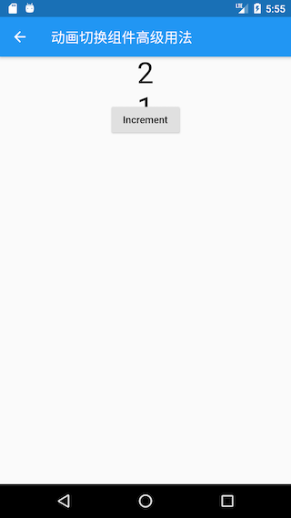

上图中“1”从底部滑出，而“2”从顶部滑入。读者可以尝试给`SlideTransitionX`的`direction`取不同的值来查看运行效果。

### 动画过渡组件

为了表述方便，本书约定，将在Widget属性发生变化时会执行过渡动画的组件统称为”动画过渡组件“，而动画过渡组件最明显的一个特征就是它会在内部自管理`AnimationController`。我们知道，为了方便使用者可以自定义动画的曲线、执行时长、方向等，在前面介绍过的动画封装方法中，通常都需要使用者自己提供一个`AnimationController`对象来自定义这些属性值。但是，如此一来，使用者就必须得手动管理`AnimationController`，这又会增加使用的复杂性。因此，如果也能将`AnimationController`进行封装，则会大大提高动画组件的易用性。

#### 自定义动画过渡组件

我们要实现一个`AnimatedDecoratedBox`，它可以在`decoration`属性发生变化时，从旧状态变成新状态的过程可以执行一个过渡动画。根据前面所学的知识，我们实现了一个`AnimatedDecoratedBox1`组件：

```dart
class AnimatedDecoratedBox1 extends StatefulWidget {
  AnimatedDecoratedBox1({
    Key key,
    @required this.decoration,
    this.child,
    this.curve = Curves.linear,
    @required this.duration,
    this.reverseDuration,
  });

  final BoxDecoration decoration;
  final Widget child;
  final Duration duration;
  final Curve curve;
  final Duration reverseDuration;

  @override
  _AnimatedDecoratedBox1State createState() => _AnimatedDecoratedBox1State();
}

class _AnimatedDecoratedBox1State extends State<AnimatedDecoratedBox1>
    with SingleTickerProviderStateMixin {
  @protected
  AnimationController get controller => _controller;
  AnimationController _controller;

  Animation<double> get animation => _animation;
  Animation<double> _animation;

  DecorationTween _tween;

  @override
  Widget build(BuildContext context) {
    return AnimatedBuilder(
      animation: _animation,
      builder: (context, child){
        return DecoratedBox(
          decoration: _tween.animate(_animation).value,
          child: child,
        );
      },
      child: widget.child,
    );
  }

  @override
  void initState() {
    super.initState();
    _controller = AnimationController(
      duration: widget.duration,
      reverseDuration: widget.reverseDuration,
      vsync: this,
    );
    _tween = DecorationTween(begin: widget.decoration);
    _updateCurve();
  }

  void _updateCurve() {
    if (widget.curve != null)
      _animation = CurvedAnimation(parent: _controller, curve: widget.curve);
    else
      _animation = _controller;
  }


  @override
  void didUpdateWidget(AnimatedDecoratedBox1 oldWidget) {
    super.didUpdateWidget(oldWidget);
    if (widget.curve != oldWidget.curve)
      _updateCurve();
    _controller.duration = widget.duration;
    _controller.reverseDuration = widget.reverseDuration;
    if(widget.decoration!= (_tween.end ?? _tween.begin)){
      _tween
        ..begin = _tween.evaluate(_animation)
        ..end = widget.decoration;
      _controller
        ..value = 0.0
        ..forward();
    }
  }

  @override
  void dispose() {
    _controller.dispose();
    super.dispose();
  }
}
```

下面我们来使用`AnimatedDecoratedBox1`来实现按钮点击后背景色从蓝色过渡到红色的效果：

```dart
Color _decorationColor = Colors.blue;
var duration = Duration(seconds: 1);
...//省略无关代码
AnimatedDecoratedBox(
  duration: duration,
  decoration: BoxDecoration(color: _decorationColor),
  child: FlatButton(
    onPressed: () {
      setState(() {
        _decorationColor = Colors.red;
      });
    },
    child: Text(
      "AnimatedDecoratedBox",
      style: TextStyle(color: Colors.white),
    ),
  ),
)
```

点击后，按钮背景色会从蓝色向红色过渡，图9-9是过渡过程中的一帧，有点偏紫色，整个过渡动画结束后背景会变为红色。

上面的代码虽然实现了我们期望的功能，但是代码却比较复杂。稍加思考后，我们就可以发现，`AnimationController`的管理以及Tween更新部分的代码都是可以抽象出来的，如果我们这些通用逻辑封装成基类，那么要实现动画过渡组件只需要继承这些基类，然后定制自身不同的代码（比如动画每一帧的构建方法）即可，这样将会简化代码。

为了方便开发者来实现动画过渡组件的封装，Flutter提供了一个`ImplicitlyAnimatedWidget`抽象类，它继承自StatefulWidget，同时提供了一个对应的`ImplicitlyAnimatedWidgetState`类，`AnimationController`的管理就在`ImplicitlyAnimatedWidgetState`类中。开发者如果要封装动画，只需要分别继承`ImplicitlyAnimatedWidget`和`ImplicitlyAnimatedWidgetState`类即可，下面我们演示一下具体如何实现。

我们需要分两步实现：

1. 继承`ImplicitlyAnimatedWidget`类。

   ```dart
   class AnimatedDecoratedBox extends ImplicitlyAnimatedWidget {
     AnimatedDecoratedBox({
       Key key,
       @required this.decoration,
       this.child,
       Curve curve = Curves.linear, //动画曲线
       @required Duration duration, // 正向动画执行时长
       Duration reverseDuration, // 反向动画执行时长
     }) : super(
             key: key,
             curve: curve,
             duration: duration,
             reverseDuration: reverseDuration,
           );
     final BoxDecoration decoration;
     final Widget child;
   
     @override
     _AnimatedDecoratedBoxState createState() {
       return _AnimatedDecoratedBoxState();
     }
   }
   ```

   其中`curve`、`duration`、`reverseDuration`三个属性在`ImplicitlyAnimatedWidget`中已定义。 可以看到`AnimatedDecoratedBox`类和普通继承自`StatefulWidget`的类没有什么不同。

2. State类继承自`AnimatedWidgetBaseState`（该类继承自`ImplicitlyAnimatedWidgetState`类）。

   ```dart
   class _AnimatedDecoratedBoxState
       extends AnimatedWidgetBaseState<AnimatedDecoratedBox> {
     DecorationTween _decoration; //定义一个Tween
   
     @override
     Widget build(BuildContext context) {
       return DecoratedBox(
         decoration: _decoration.evaluate(animation),
         child: widget.child,
       );
     }
   
     @override
     void forEachTween(visitor) {
       // 在需要更新Tween时，基类会调用此方法
       _decoration = visitor(_decoration, widget.decoration,
           (value) => DecorationTween(begin: value));
     }
   }
   ```

   可以看到我们实现了`build`和`forEachTween`两个方法。在动画执行过程中，没一帧都会调用`build`方法（调用逻辑在`ImplicitlyAnimatedWidgetState`中），所以在`build`方法中我们需要构建每一帧的`DecoratedBox`状态，因此得算出每一帧的`decoration` 状态，这个我们可以通过`_decoration.evaluate(animation)` 来算出，其中`animation`是`ImplicitlyAnimatedWidgetState`基类中定义的对象，`_decoration`是我们自定义的一个`DecorationTween`类型的对象，那么现在的问题就是它是在什么时候被赋值的呢？要回答这个问题，我们就得搞清楚什么时候需要对`_decoration`赋值。我们知道`_decoration`是一个Tween，而Tween的主要职责就是定义动画的起始状态（begin）和终止状态(end)。对于`AnimatedDecoratedBox`来说，`decoration`的终止状态就是用户传给它的值，而起始状态是不确定的，有以下两种情况：

   1. `AnimatedDecoratedBox`首次build，此时直接将其`decoration`值置为起始状态，即`_decoration`值为`DecorationTween(begin: decoration)` 。
   2. `AnimatedDecoratedBox`的`decoration`更新时，则起始状态为`_decoration.animate(animation)`，即`_decoration`值为`DecorationTween(begin: _decoration.animate(animation)，end:decoration)`。

现在`forEachTween`的作用就很明显了，它正是用于来更新Tween的初始值的，在上述两种情况下会被调用，而开发者只需重写此方法，并在此方法中更新Tween的起始状态值即可。而一些更新的逻辑被屏蔽在了`visitor`回调，我们只需要调用它并给它传递正确的参数即可，`visitor`方法签名如下：

```dart
   Tween visitor(
     Tween<dynamic> tween, //当前的tween，第一次调用为null
     dynamic targetValue, // 终止状态
     TweenConstructor<dynamic> constructor，//Tween构造器，在上述三种情况下会被调用以更新tween
   );
```

可以看到，通过继承`ImplicitlyAnimatedWidget`和`ImplicitlyAnimatedWidgetState`类可以快速的实现动画过渡组件的封装，这和我们纯手工实现相比，代码简化了很多。

> 如果读者还有疑惑，建议查看`ImplicitlyAnimatedWidgetState`的源码并结合本示例代码对比理解。

##### 动画过渡组件的反向动画

在使用动画过渡组件，我们只需要在改变一些属性值后重新build组件即可，所以要实现状态反向过渡，只需要将前后状态值互换即可实现，这本来是不需要再浪费笔墨的。但是`ImplicitlyAnimatedWidget`构造函数中却有一个`reverseDuration`属性用于设置反向动画的执行时长，这貌似在告诉读者`ImplicitlyAnimatedWidget`本身也提供了执行反向动画的接口，于是笔者查看了`ImplicitlyAnimatedWidgetState`源码并未发现有执行反向动画的接口，唯一有用的是它暴露了控制动画的`controller`。所以如果要让`reverseDuration`生效，我们只能先获取`controller`，然后再通过`controller.reverse()`来启动反向动画，比如我们在上面示例的基础上实现一个循环的点击背景颜色变换效果，要求从蓝色变为红色时动画执行时间为400ms，从红变蓝为2s，如果要使`reverseDuration`生效，我们需要这么做：

```dart
AnimatedDecoratedBox(
  duration: Duration( milliseconds: 400),
  decoration: BoxDecoration(color: _decorationColor),
  reverseDuration: Duration(seconds: 2),
  child: Builder(builder: (context) {
    return FlatButton(
      onPressed: () {
        if (_decorationColor == Colors.red) {
          ImplicitlyAnimatedWidgetState _state =
              context.ancestorStateOfType(
                  TypeMatcher<ImplicitlyAnimatedWidgetState>());
           // 通过controller来启动反向动画
          _state.controller.reverse().then((e) {
            // 经验证必须调用setState来触发rebuild，否则状态同步会有问题
            setState(() {
              _decorationColor = Colors.blue;
            });
          });
        } else {
          setState(() {
            _decorationColor = Colors.red;
          });
        }
      },
      child: Text(
        "AnimatedDecoratedBox toggle",
        style: TextStyle(color: Colors.white),
      ),
    );
  }),
)
```

上面的代码实际上是非常糟糕且没必要的，它需要我们了解`ImplicitlyAnimatedWidgetState`内部实现，并且要手动去启动反向动画。我们完全可以通过如下代码实现相同的效果：

```dart
AnimatedDecoratedBox(
  duration: Duration(
      milliseconds: _decorationColor == Colors.red ? 400 : 2000),
  decoration: BoxDecoration(color: _decorationColor),
  child: Builder(builder: (context) {
    return FlatButton(
      onPressed: () {
        setState(() {
          _decorationColor = _decorationColor == Colors.blue
              ? Colors.red
              : Colors.blue;
        });
      },
      child: Text(
        "AnimatedDecoratedBox toggle",
        style: TextStyle(color: Colors.white),
      ),
    );
  }),
)
```

这样的代码是不是优雅的多！那么现在问题来了，为什么`ImplicitlyAnimatedWidgetState`要提供一个`reverseDuration`参数呢？笔者仔细研究了`ImplicitlyAnimatedWidgetState`的实现，发现唯一的解释就是该参数并非是给`ImplicitlyAnimatedWidgetState`用的，而是给子类用的！原因正如我们前面说的，要使`reverseDuration` 有用就必须得获取`controller` 属性来手动启动反向动画，`ImplicitlyAnimatedWidgetState`中的`controller` 属性是一个保护属性，定义如下：

```dart
 @protected
  AnimationController get controller => _controller;
```

而保护属性原则上只应该在子类中使用，而不应该像上面示例代码一样在外部使用。综上，我们可以得出两条结论：

1. 使用动画过渡组件时如果需要执行反向动画的场景，应尽量使用状态互换的方法，而不应该通过获取`ImplicitlyAnimatedWidgetState`中`controller`的方式。

2. 如果我们自定义的动画过渡组件用不到`reverseDuration` ，那么最好就不要暴露此参数，比如我们上面自定义的`AnimatedDecoratedBox`定义中就可以去除`reverseDuration` 可选参数，如：

   ```dart
   class AnimatedDecoratedBox extends ImplicitlyAnimatedWidget {
     AnimatedDecoratedBox({
       Key key,
       @required this.decoration,
       this.child,
       Curve curve = Curves.linear,
       @required Duration duration,
     }) : super(
             key: key,
             curve: curve,
             duration: duration,
           );
   ```

#### Flutter预置的动画过渡组件

Flutter SDK中也预置了很多动画过渡组件，实现方式和大都和`AnimatedDecoratedBox`差不多，如表9-1所示：

| 组件名                   | 功能                                                         |
| ------------------------ | ------------------------------------------------------------ |
| AnimatedPadding          | 在padding发生变化时会执行过渡动画到新状态                    |
| AnimatedPositioned       | 配合Stack一起使用，当定位状态发生变化时会执行过渡动画到新的状态。 |
| AnimatedOpacity          | 在透明度opacity发生变化时执行过渡动画到新状态                |
| AnimatedAlign            | 当`alignment`发生变化时会执行过渡动画到新的状态。            |
| AnimatedContainer        | 当Container属性发生变化时会执行过渡动画到新的状态。          |
| AnimatedDefaultTextStyle | 当字体样式发生变化时，子组件中继承了该样式的文本组件会动态过渡到新样式。 |


表9-1：Flutter预置的动画过渡组件

下面我们通过一个示例来感受一下这些预置的动画过渡组件效果：


```dart
import 'package:flutter/material.dart';

class AnimatedWidgetsTest extends StatefulWidget {
  @override
  _AnimatedWidgetsTestState createState() => _AnimatedWidgetsTestState();
}

class _AnimatedWidgetsTestState extends State<AnimatedWidgetsTest> {
  double _padding = 10;
  var _align = Alignment.topRight;
  double _height = 100;
  double _left = 0;
  Color _color = Colors.red;
  TextStyle _style = TextStyle(color: Colors.black);
  Color _decorationColor = Colors.blue;

  @override
  Widget build(BuildContext context) {
    var duration = Duration(seconds: 5);
    return SingleChildScrollView(
      child: Column(
        children: <Widget>[
          RaisedButton(
            onPressed: () {
              setState(() {
                _padding = 20;
              });
            },
            child: AnimatedPadding(
              duration: duration,
              padding: EdgeInsets.all(_padding),
              child: Text("AnimatedPadding"),
            ),
          ),
          SizedBox(
            height: 50,
            child: Stack(
              children: <Widget>[
                AnimatedPositioned(
                  duration: duration,
                  left: _left,
                  child: RaisedButton(
                    onPressed: () {
                      setState(() {
                        _left = 100;
                      });
                    },
                    child: Text("AnimatedPositioned"),
                  ),
                )
              ],
            ),
          ),
          Container(
            height: 100,
            color: Colors.grey,
            child: AnimatedAlign(
              duration: duration,
              alignment: _align,
              child: RaisedButton(
                onPressed: () {
                  setState(() {
                    _align = Alignment.center;
                  });
                },
                child: Text("AnimatedAlign"),
              ),
            ),
          ),
          AnimatedContainer(
            duration: duration,
            height: _height,
            color: _color,
            child: FlatButton(
              onPressed: () {
                setState(() {
                  _height = 150;
                  _color = Colors.blue;
                });
              },
              child: Text(
                "AnimatedContainer",
                style: TextStyle(color: Colors.white),
              ),
            ),
          ),
          AnimatedDefaultTextStyle(
            child: GestureDetector(
              child: Text("hello world"),
              onTap: () {
                setState(() {
                  _style = TextStyle(
                    color: Colors.blue,
                    decorationStyle: TextDecorationStyle.solid,
                    decorationColor: Colors.blue,
                  );
                });
              },
            ),
            style: _style,
            duration: duration,
          ),
          AnimatedDecoratedBox(
            duration: duration,
            decoration: BoxDecoration(color: _decorationColor),
            child: FlatButton(
              onPressed: () {
                setState(() {
                  _decorationColor = Colors.red;
                });
              },
              child: Text(
                "AnimatedDecoratedBox",
                style: TextStyle(color: Colors.white),
              ),
            ),
          )
        ].map((e) {
          return Padding(
            padding: EdgeInsets.symmetric(vertical: 16),
            child: e,
          );
        }).toList(),
      ),
    );
  }
}
```

运行后效果如图所示：


## 自定义组件

### 自定义组件方法简介

当Flutter提供的现有组件无法满足我们的需求，或者我们为了共享代码需要封装一些通用组件，这时我们就需要自定义组件。在Flutter中自定义组件有三种方式：通过组合其它组件、自绘和实现RenderObject

#### 组合其它Widget

这种方式是通过拼装其它组件来组合成一个新的组件。例如我们之前介绍的`Container`就是一个组合组件，它是由`DecoratedBox`、`ConstrainedBox`、`Transform`、`Padding`、`Align`等组件组成

#### 自绘

如果遇到无法通过现有的组件来实现需要的UI时，我们可以通过自绘组件的方式来实现，这时最好的方法就是通过自定义组件来绘制出我们期望的外观。我们可以通过Flutter中提供的`CustomPaint`和`Canvas`来实现UI自绘。

#### 实现RenderObject

Flutter提供的自身具有UI外观的组件，如文本`Text`、`Image`都是通过相应的`RenderObject`渲染出来的，如Text是由`RenderParagraph`渲染；而`Image`是由`RenderImage`渲染。`RenderObject`是一个抽象类，它定义了一个抽象方法`paint(...)`：

```dart
void paint(PaintingContext context, Offset offset)
```

`PaintingContext`代表组件的绘制上下文，通过`PaintingContext.canvas`可以获得`Canvas`，而绘制逻辑主要是通过`Canvas` API来实现。子类需要重写此方法以实现自身的绘制逻辑，如`RenderParagraph`需要实现文本绘制逻辑，而`RenderImage`需要实现图片绘制逻辑。

可以发现，`RenderObject`中最终也是通过`Canvas` API来绘制的，那么通过实现`RenderObject`的方式和上面介绍的通过`CustomPaint`和`Canvas`自绘的方式有什么区别？其实答案很简单，`CustomPaint`只是为了方便开发者封装的一个代理类，它直接继承自`SingleChildRenderObjectWidget`，通过`RenderCustomPaint`的`paint`方法将`Canvas`和画笔`Painter`连接起来实现了最终的绘制（绘制逻辑在`Painter`中）。

### 组合现有组件

在Flutter中页面UI通常都是由一些低阶别的组件组合而成，当我们需要封装一些通用组件时，应该首先考虑是否可以通过组合其它组件来实现，如果可以，则应优先使用组合，因为直接通过现有组件拼装会非常简单、灵活、高效。

#### 示例：自定义渐变按钮

Flutter Material组件库中的按钮默认不支持渐变背景，为了实现渐变背景按钮，我们自定义一个`GradientButton`组件，它需要支持一下功能：

1. 背景支持渐变色
2. 手指按下时有涟漪效果
3. 可以支持圆角

我们先来看看最终要实现的效果：


我们`DecoratedBox`可以支持背景色渐变和圆角，`InkWell`在手指按下有涟漪效果，所以我们可以通过组合`DecoratedBox`和`InkWell`来实现`GradientButton`，代码如下：

```dart
import 'package:flutter/material.dart';

class GradientButton extends StatelessWidget {
  GradientButton({
    this.colors,
    this.width,
    this.height,
    this.onPressed,
    this.borderRadius,
    @required this.child,
  });

  // 渐变色数组
  final List<Color> colors;

  // 按钮宽高
  final double width;
  final double height;

  final Widget child;
  final BorderRadius borderRadius;

  //点击回调
  final GestureTapCallback onPressed;

  @override
  Widget build(BuildContext context) {
    ThemeData theme = Theme.of(context);

    //确保colors数组不空
    List<Color> _colors = colors ??
        [theme.primaryColor, theme.primaryColorDark ?? theme.primaryColor];

    return DecoratedBox(
      decoration: BoxDecoration(
        gradient: LinearGradient(colors: _colors),
        borderRadius: borderRadius,
      ),
      child: Material(
        type: MaterialType.transparency,
        child: InkWell(
          splashColor: _colors.last,
          highlightColor: Colors.transparent,
          borderRadius: borderRadius,
          onTap: onPressed,
          child: ConstrainedBox(
            constraints: BoxConstraints.tightFor(height: height, width: width),
            child: Center(
              child: Padding(
                padding: const EdgeInsets.all(8.0),
                child: DefaultTextStyle(
                  style: TextStyle(fontWeight: FontWeight.bold),
                  child: child,
                ),
              ),
            ),
          ),
        ),
      ),
    );
  }
}
```

可以看到`GradientButton`是由`DecoratedBox`、`Padding`、`Center`、`InkWell`等组件组合而成。当然上面的代码只是一个示例，作为一个按钮它还并不完整，比如没有禁用状态

#### 使用GradientButton

```dart
import 'package:flutter/material.dart';
import '../widgets/index.dart';

class GradientButtonRoute extends StatefulWidget {
  @override
  _GradientButtonRouteState createState() => _GradientButtonRouteState();
}

class _GradientButtonRouteState extends State<GradientButtonRoute> {
  @override
  Widget build(BuildContext context) {
    return Container(
      child: Column(
        children: <Widget>[
          GradientButton(
            colors: [Colors.orange, Colors.red],
            height: 50.0,
            child: Text("Submit"),
            onPressed: onTap,
          ),
          GradientButton(
            height: 50.0,
            colors: [Colors.lightGreen, Colors.green[700]],
            child: Text("Submit"),
            onPressed: onTap,
          ),
          GradientButton(
            height: 50.0,
            colors: [Colors.lightBlue[300], Colors.blueAccent],
            child: Text("Submit"),
            onPressed: onTap,
          ),
        ],
      ),
    );
  }
  onTap() {
    print("button click");
  }
}
```

#### 总结

通过组合的方式定义组件和我们之前写界面并无差异，不过在抽离出单独的组件时我们要考虑代码规范性，如必要参数要用`@required` 标注，对于可选参数在特定场景需要判空或设置默认值等。这是由于使用者大多时候可能不了解组件的内部细节，所以为了保证代码健壮性，我们需要在用户错误地使用组件时能够兼容或报错提示（使用`assert`断言函数）

### 组合实例：TurnBox

我们之前已经介绍过`RotatedBox`，它可以旋转子组件，但是它有两个缺点：一是只能将其子节点以90度的倍数旋转；二是当旋转的角度发生变化时，旋转角度更新过程没有动画。

本节我们将实现一个`TurnBox`组件，它不仅可以以任意角度来旋转其子节点，而且可以在角度发生变化时执行一个动画以过渡到新状态，同时，我们可以手动指定动画速度。

`TurnBox`的完整代码如下：

```dart
import 'package:flutter/widgets.dart';

class TurnBox extends StatefulWidget {
  const TurnBox({
    Key key,
    this.turns = .0, //旋转的“圈”数,一圈为360度，如0.25圈即90度
    this.speed = 200, //过渡动画执行的总时长
    this.child
  }) :super(key: key);

  final double turns;
  final int speed;
  final Widget child;

  @override
  _TurnBoxState createState() => new _TurnBoxState();
}

class _TurnBoxState extends State<TurnBox>
    with SingleTickerProviderStateMixin {
  AnimationController _controller;

  @override
  void initState() {
    super.initState();
    _controller = new AnimationController(
        vsync: this,
        lowerBound: -double.infinity,
        upperBound: double.infinity
    );
    _controller.value = widget.turns;
  }

  @override
  void dispose() {
    _controller.dispose();
    super.dispose();
  }

  @override
  Widget build(BuildContext context) {
    return RotationTransition(
      turns: _controller,
      child: widget.child,
    );
  }

  @override
  void didUpdateWidget(TurnBox oldWidget) {
    super.didUpdateWidget(oldWidget);
    //旋转角度发生变化时执行过渡动画  
    if (oldWidget.turns != widget.turns) {
      _controller.animateTo(
        widget.turns,
        duration: Duration(milliseconds: widget.speed??200),
        curve: Curves.easeOut,
      );
    }
  }
}
```

上面代码中：

1. 我们是通过组合`RotationTransition`和child来实现的旋转效果。
2. 在`didUpdateWidget`中，我们判断要旋转的角度是否发生了变化，如果变了，则执行一个过渡动画。

下面我们测试一下`TurnBox`的功能，测试代码如下：

```dart
import 'package:flutter/material.dart';
import '../widgets/index.dart';

class TurnBoxRoute extends StatefulWidget {
  @override
  _TurnBoxRouteState createState() => new _TurnBoxRouteState();
}

class _TurnBoxRouteState extends State<TurnBoxRoute> {
  double _turns = .0;

  @override
  Widget build(BuildContext context) {

    return Center(
      child: Column(
        children: <Widget>[
          TurnBox(
            turns: _turns,
            speed: 500,
            child: Icon(Icons.refresh, size: 50,),
          ),
          TurnBox(
            turns: _turns,
            speed: 1000,
            child: Icon(Icons.refresh, size: 150.0,),
          ),
          RaisedButton(
            child: Text("顺时针旋转1/5圈"),
            onPressed: () {
              setState(() {
                _turns += .2;
              });
            },
          ),
          RaisedButton(
            child: Text("逆时针旋转1/5圈"),
            onPressed: () {
              setState(() {
                _turns -= .2;
              });
            },
          )
        ],
      ),
    );
  }
}
```

测试代码运行后效果如图所示：


当我们点击旋转按钮时，两个图标的旋转都会旋转1/5圈，但旋转的速度是不同的，读者可以自己运行一下示例看看效果。

实际上本示例只组合了`RotationTransition`一个组件，它是一个最简的组合类组件示例。另外，如果我们封装的是`StatefulWidget`，那么一定要注意在组件更新时是否需要同步状态。比如我们要封装一个富文本展示组件`MyRichText` ，它可以自动处理url链接，定义如下：

```dart
class MyRichText extends StatefulWidget {
  MyRichText({
    Key key,
    this.text, // 文本字符串
    this.linkStyle, // url链接样式
  }) : super(key: key);

  final String text;
  final TextStyle linkStyle;

  @override
  _MyRichTextState createState() => _MyRichTextState();
}
```

接下来我们在`_MyRichTextState`中要实现的功能有两个：

1. 解析文本字符串“text”，生成`TextSpan`缓存起来；
2. 在`build`中返回最终的富文本样式；

`_MyRichTextState` 实现的代码大致如下：

```dart
class _MyRichTextState extends State<MyRichText> {

  TextSpan _textSpan;

  @override
  Widget build(BuildContext context) {
    return RichText(
      text: _textSpan,
    );
  }

  TextSpan parseText(String text) {
    // 耗时操作：解析文本字符串，构建出TextSpan。
    // 省略具体实现。
  }

  @override
  void initState() {
    _textSpan = parseText(widget.text)
    super.initState();
  }
}
```

由于解析文本字符串，构建出`TextSpan`是一个耗时操作，为了不在每次build的时候都解析一次，所以我们在`initState`中对解析的结果进行了缓存，然后再`build`中直接使用解析的结果`_textSpan`。这看起来很不错，但是上面的代码有一个严重的问题，就是父组件传入的`text`发生变化时（组件树结构不变），那么`MyRichText`显示的内容不会更新，原因就是`initState`只会在State创建时被调用，所以在`text`发生变化时，`parseText`没有重新执行，导致`_textSpan`任然是旧的解析值。要解决这个问题也很简单，我们只需添加一个`didUpdateWidget`回调，然后再里面重新调用`parseText`即可：

```dart
@override
void didUpdateWidget(MyRichText oldWidget) {
  if (widget.text != oldWidget.text) {
    _textSpan = parseText(widget.text);
  }
  super.didUpdateWidget(oldWidget);
}
```

### 自绘组件 （CustomPaint与Canvas）

对于一些复杂或不规则的UI，我们可能无法通过组合其它组件的方式来实现，比如我们需要一个正六边形、一个渐变的圆形进度条、一个棋盘等。当然，有时候我们可以使用图片来实现，但在一些需要动态交互的场景静态图片也是实现不了的，比如要实现一个手写输入面板，这时，我们就需要来自己绘制UI外观。

几乎所有的UI系统都会提供一个自绘UI的接口，这个接口通常会提供一块2D画布`Canvas`，`Canvas`内部封装了一些基本绘制的API，开发者可以通过`Canvas`绘制各种自定义图形。在Flutter中，提供了一个`CustomPaint` 组件，它可以结合画笔`CustomPainter`来实现自定义图形绘制。

#### CustomPaint

我们看看`CustomPaint`构造函数：

```dart
CustomPaint({
  Key key,
  this.painter, 
  this.foregroundPainter,
  this.size = Size.zero, 
  this.isComplex = false, 
  this.willChange = false, 
  Widget child, //子节点，可以为空
})
```

- `painter`: 背景画笔，会显示在子节点后面;
- `foregroundPainter`: 前景画笔，会显示在子节点前面
- `size`：当child为null时，代表默认绘制区域大小，如果有child则忽略此参数，画布尺寸则为child尺寸。如果有child但是想指定画布为特定大小，可以使用SizeBox包裹CustomPaint实现。
- `isComplex`：是否复杂的绘制，如果是，Flutter会应用一些缓存策略来减少重复渲染的开销。
- `willChange`：和`isComplex`配合使用，当启用缓存时，该属性代表在下一帧中绘制是否会改变。

可以看到，绘制时我们需要提供前景或背景画笔，两者也可以同时提供。我们的画笔需要继承`CustomPainter`类，我们在画笔类中实现真正的绘制逻辑。

##### 注意

如果`CustomPaint`有子节点，为了避免子节点不必要的重绘并提高性能，通常情况下都会将子节点包裹在`RepaintBoundary`组件中，这样会在绘制时就会创建一个新的绘制层（Layer），其子组件将在新的Layer上绘制，而父组件将在原来Layer上绘制，也就是说`RepaintBoundary` 子组件的绘制将独立于父组件的绘制，`RepaintBoundary`会隔离其子节点和`CustomPaint`本身的绘制边界。示例如下：

```dart
CustomPaint(
  size: Size(300, 300), //指定画布大小
  painter: MyPainter(),
  child: RepaintBoundary(child:...)), 
)
```

#### CustomPainter

`CustomPainter`中提定义了一个虚函数`paint`：

```
void paint(Canvas canvas, Size size);
```

`paint`有两个参数:

- `Canvas`：一个画布，包括各种绘制方法，我们列出一下常用的方法：

  |API名称 | 功能 | | ---------- | ------ | | drawLine | 画线 | | drawPoint | 画点 | | drawPath | 画路径 | | drawImage | 画图像 | | drawRect | 画矩形 | | drawCircle | 画圆 | | drawOval | 画椭圆 | | drawArc | 画圆弧 |

- `Size`：当前绘制区域大小。

#### 画笔Paint

现在画布有了，我们最后还缺一个画笔，Flutter提供了`Paint`类来实现画笔。在`Paint`中，我们可以配置画笔的各种属性如粗细、颜色、样式等。如：

```dart
var paint = Paint() //创建一个画笔并配置其属性
  ..isAntiAlias = true //是否抗锯齿
  ..style = PaintingStyle.fill //画笔样式：填充
  ..color=Color(0x77cdb175);//画笔颜色
```

更多的配置属性读者可以参考Paint类定义。

#### 示例：五子棋/盘

下面我们通过一个五子棋游戏中棋盘和棋子的绘制来演示自绘UI的过程，首先我们看一下我们的目标效果，如图所示：

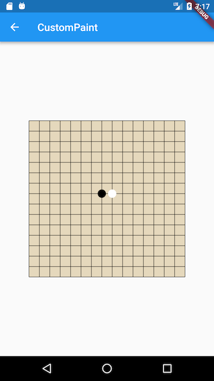

代码：

```dart
import 'package:flutter/material.dart';
import 'dart:math';

class CustomPaintRoute extends StatelessWidget {
  @override
  Widget build(BuildContext context) {
    return Center(
      child: CustomPaint(
        size: Size(300, 300), //指定画布大小
        painter: MyPainter(),
      ),
    );
  }
}

class MyPainter extends CustomPainter {
  @override
  void paint(Canvas canvas, Size size) {
    double eWidth = size.width / 15;
    double eHeight = size.height / 15;

    //画棋盘背景
    var paint = Paint()
      ..isAntiAlias = true
      ..style = PaintingStyle.fill //填充
      ..color = Color(0x77cdb175); //背景为纸黄色
    canvas.drawRect(Offset.zero & size, paint);

    //画棋盘网格
    paint
      ..style = PaintingStyle.stroke //线
      ..color = Colors.black87
      ..strokeWidth = 1.0;

    for (int i = 0; i <= 15; ++i) {
      double dy = eHeight * i;
      canvas.drawLine(Offset(0, dy), Offset(size.width, dy), paint);
    }

    for (int i = 0; i <= 15; ++i) {
      double dx = eWidth * i;
      canvas.drawLine(Offset(dx, 0), Offset(dx, size.height), paint);
    }

    //画一个黑子
    paint
      ..style = PaintingStyle.fill
      ..color = Colors.black;
    canvas.drawCircle(
      Offset(size.width / 2 - eWidth / 2, size.height / 2 - eHeight / 2),
      min(eWidth / 2, eHeight / 2) - 2,
      paint,
    );

    //画一个白子
    paint.color = Colors.white;
    canvas.drawCircle(
      Offset(size.width / 2 + eWidth / 2, size.height / 2 - eHeight / 2),
      min(eWidth / 2, eHeight / 2) - 2,
      paint,
    );
  }

  //在实际场景中正确利用此回调可以避免重绘开销，本示例我们简单的返回true
  @override
  bool shouldRepaint(CustomPainter oldDelegate) => true;
}
```

#### 性能

绘制是比较昂贵的操作，所以我们在实现自绘控件时应该考虑到性能开销，下面是两条关于性能优化的建议：

- 尽可能的利用好`shouldRepaint`返回值；在UI树重新build时，控件在绘制前都会先调用该方法以确定是否有必要重绘；假如我们绘制的UI不依赖外部状态，那么就应该始终返回`false`，因为外部状态改变导致重新build时不会影响我们的UI外观；如果绘制依赖外部状态，那么我们就应该在`shouldRepaint`中判断依赖的状态是否改变，如果已改变则应返回`true`来重绘，反之则应返回`false`不需要重绘。
- 绘制尽可能多的分层；在上面五子棋的示例中，我们将棋盘和棋子的绘制放在了一起，这样会有一个问题：由于棋盘始终是不变的，用户每次落子时变的只是棋子，但是如果按照上面的代码来实现，每次绘制棋子时都要重新绘制一次棋盘，这是没必要的。优化的方法就是将棋盘单独抽为一个组件，并设置其`shouldRepaint`回调值为`false`，然后将棋盘组件作为背景。然后将棋子的绘制放到另一个组件中，这样每次落子时只需要绘制棋子。

### 自绘实例：圆形背景渐变进度条

本节我们实现一个圆形背景渐变进度条，它支持：

1. 支持多种背景渐变色。
2. 任意弧度；进度条可以不是整圆。
3. 可以自定义粗细、两端是否圆角等样式。

可以发现要实现这样的一个进度条是无法通过现有组件组合而成的，所以我们通过自绘方式实现，代码如下：

```dart
import 'dart:math';
import 'package:flutter/material.dart';

class GradientCircularProgressIndicator extends StatelessWidget {
  GradientCircularProgressIndicator({
    this.strokeWidth = 2.0,
    @required this.radius,
    @required this.colors,
    this.stops,
    this.strokeCapRound = false,
    this.backgroundColor = const Color(0xFFEEEEEE),
    this.totalAngle = 2 * pi,
    this.value
  });

  ///粗细
  final double strokeWidth;

  /// 圆的半径
  final double radius;

  ///两端是否为圆角
  final bool strokeCapRound;

  /// 当前进度，取值范围 [0.0-1.0]
  final double value;

  /// 进度条背景色
  final Color backgroundColor;

  /// 进度条的总弧度，2*PI为整圆，小于2*PI则不是整圆
  final double totalAngle;

  /// 渐变色数组
  final List<Color> colors;

  /// 渐变色的终止点，对应colors属性
  final List<double> stops;

  @override
  Widget build(BuildContext context) {
    double _offset = .0;
    // 如果两端为圆角，则需要对起始位置进行调整，否则圆角部分会偏离起始位置
    // 下面调整的角度的计算公式是通过数学几何知识得出，读者有兴趣可以研究一下为什么是这样  
    if (strokeCapRound) {
      _offset = asin(strokeWidth / (radius * 2 - strokeWidth));
    }
    var _colors = colors;
    if (_colors == null) {
      Color color = Theme
          .of(context)
          .accentColor;
      _colors = [color, color];
    }
    return Transform.rotate(
      angle: -pi / 2.0 - _offset, 
      child: CustomPaint(
          size: Size.fromRadius(radius),
          painter: _GradientCircularProgressPainter(
            strokeWidth: strokeWidth,
            strokeCapRound: strokeCapRound,
            backgroundColor: backgroundColor,
            value: value,
            total: totalAngle,
            radius: radius,
            colors: _colors,
          )
      ),
    );
  }
}

//实现画笔
class _GradientCircularProgressPainter extends CustomPainter {
  _GradientCircularProgressPainter({
    this.strokeWidth: 10.0,
    this.strokeCapRound: false,
    this.backgroundColor = const Color(0xFFEEEEEE),
    this.radius,
    this.total = 2 * pi,
    @required this.colors,
    this.stops,
    this.value
  });

  final double strokeWidth;
  final bool strokeCapRound;
  final double value;
  final Color backgroundColor;
  final List<Color> colors;
  final double total;
  final double radius;
  final List<double> stops;

  @override
  void paint(Canvas canvas, Size size) {
    if (radius != null) {
      size = Size.fromRadius(radius);
    }
    double _offset = strokeWidth / 2.0;
    double _value = (value ?? .0);
    _value = _value.clamp(.0, 1.0) * total;
    double _start = .0;

    if (strokeCapRound) {
      _start = asin(strokeWidth/ (size.width - strokeWidth));
    }

    Rect rect = Offset(_offset, _offset) & Size(
        size.width - strokeWidth,
        size.height - strokeWidth
    );

    var paint = Paint()
      ..strokeCap = strokeCapRound ? StrokeCap.round : StrokeCap.butt
      ..style = PaintingStyle.stroke
      ..isAntiAlias = true
      ..strokeWidth = strokeWidth;

    // 先画背景
    if (backgroundColor != Colors.transparent) {
      paint.color = backgroundColor;
      canvas.drawArc(
          rect,
          _start,
          total,
          false,
          paint
      );
    }

    // 再画前景，应用渐变
    if (_value > 0) {
      paint.shader = SweepGradient(
        startAngle: 0.0,
        endAngle: _value,
        colors: colors,
        stops: stops,
      ).createShader(rect);

      canvas.drawArc(
          rect,
          _start,
          _value,
          false,
          paint
      );
    }
  }

  @override
  bool shouldRepaint(CustomPainter oldDelegate) => true;

}
```

下面我们来测试一下，为了尽可能多的展示`GradientCircularProgressIndicator`的不同外观和用途，这个示例代码会比较长，并且添加了动画，建议读者将此示例运行起来观看实际效果，我们先看看其中的一帧动画的截图：


示例代码：

```dart
import 'dart:math';
import 'package:flutter/material.dart';
import '../widgets/index.dart';

class GradientCircularProgressRoute extends StatefulWidget {
  @override
  GradientCircularProgressRouteState createState() {
    return new GradientCircularProgressRouteState();
  }
}

class GradientCircularProgressRouteState
    extends State<GradientCircularProgressRoute> with TickerProviderStateMixin {
  AnimationController _animationController;

  @override
  void initState() {
    super.initState();
    _animationController =
        new AnimationController(vsync: this, duration: Duration(seconds: 3));
    bool isForward = true;
    _animationController.addStatusListener((status) {
      if (status == AnimationStatus.forward) {
        isForward = true;
      } else if (status == AnimationStatus.completed ||
          status == AnimationStatus.dismissed) {
        if (isForward) {
          _animationController.reverse();
        } else {
          _animationController.forward();
        }
      } else if (status == AnimationStatus.reverse) {
        isForward = false;
      }
    });
    _animationController.forward();
  }

  @override
  void dispose() {
    _animationController.dispose();
    super.dispose();
  }

  @override
  Widget build(BuildContext context) {
    return SingleChildScrollView(
      child: Center(
        child: Column(
          crossAxisAlignment: CrossAxisAlignment.center,
          children: <Widget>[
            AnimatedBuilder(
              animation: _animationController,
              builder: (BuildContext context, Widget child) {
                return Padding(
                  padding: const EdgeInsets.symmetric(vertical: 16.0),
                  child: Column(
                    children: <Widget>[
                      Wrap(
                        spacing: 10.0,
                        runSpacing: 16.0,
                        children: <Widget>[
                          GradientCircularProgressIndicator(
                            // No gradient
                            colors: [Colors.blue, Colors.blue],
                            radius: 50.0,
                            strokeWidth: 3.0,
                            value: _animationController.value,
                          ),
                          GradientCircularProgressIndicator(
                            colors: [Colors.red, Colors.orange],
                            radius: 50.0,
                            strokeWidth: 3.0,
                            value: _animationController.value,
                          ),
                          GradientCircularProgressIndicator(
                            colors: [Colors.red, Colors.orange, Colors.red],
                            radius: 50.0,
                            strokeWidth: 5.0,
                            value: _animationController.value,
                          ),
                          GradientCircularProgressIndicator(
                            colors: [Colors.teal, Colors.cyan],
                            radius: 50.0,
                            strokeWidth: 5.0,
                            strokeCapRound: true,
                            value: CurvedAnimation(
                                    parent: _animationController,
                                    curve: Curves.decelerate)
                                .value,
                          ),
                          TurnBox(
                            turns: 1 / 8,
                            child: GradientCircularProgressIndicator(
                                colors: [Colors.red, Colors.orange, Colors.red],
                                radius: 50.0,
                                strokeWidth: 5.0,
                                strokeCapRound: true,
                                backgroundColor: Colors.red[50],
                                totalAngle: 1.5 * pi,
                                value: CurvedAnimation(
                                        parent: _animationController,
                                        curve: Curves.ease)
                                    .value),
                          ),
                          RotatedBox(
                            quarterTurns: 1,
                            child: GradientCircularProgressIndicator(
                                colors: [Colors.blue[700], Colors.blue[200]],
                                radius: 50.0,
                                strokeWidth: 3.0,
                                strokeCapRound: true,
                                backgroundColor: Colors.transparent,
                                value: _animationController.value),
                          ),
                          GradientCircularProgressIndicator(
                            colors: [
                              Colors.red,
                              Colors.amber,
                              Colors.cyan,
                              Colors.green[200],
                              Colors.blue,
                              Colors.red
                            ],
                            radius: 50.0,
                            strokeWidth: 5.0,
                            strokeCapRound: true,
                            value: _animationController.value,
                          ),
                        ],
                      ),
                      GradientCircularProgressIndicator(
                        colors: [Colors.blue[700], Colors.blue[200]],
                        radius: 100.0,
                        strokeWidth: 20.0,
                        value: _animationController.value,
                      ),

                      Padding(
                        padding: const EdgeInsets.symmetric(vertical: 16.0),
                        child: GradientCircularProgressIndicator(
                          colors: [Colors.blue[700], Colors.blue[300]],
                          radius: 100.0,
                          strokeWidth: 20.0,
                          value: _animationController.value,
                          strokeCapRound: true,
                        ),
                      ),
                      //剪裁半圆
                      ClipRect(
                        child: Align(
                          alignment: Alignment.topCenter,
                          heightFactor: .5,
                          child: Padding(
                            padding: const EdgeInsets.only(bottom: 8.0),
                            child: SizedBox(
                              //width: 100.0,
                              child: TurnBox(
                                turns: .75,
                                child: GradientCircularProgressIndicator(
                                  colors: [Colors.teal, Colors.cyan[500]],
                                  radius: 100.0,
                                  strokeWidth: 8.0,
                                  value: _animationController.value,
                                  totalAngle: pi,
                                  strokeCapRound: true,
                                ),
                              ),
                            ),
                          ),
                        ),
                      ),
                      SizedBox(
                        height: 104.0,
                        width: 200.0,
                        child: Stack(
                          alignment: Alignment.center,
                          children: <Widget>[
                            Positioned(
                              height: 200.0,
                              top: .0,
                              child: TurnBox(
                                turns: .75,
                                child: GradientCircularProgressIndicator(
                                  colors: [Colors.teal, Colors.cyan[500]],
                                  radius: 100.0,
                                  strokeWidth: 8.0,
                                  value: _animationController.value,
                                  totalAngle: pi,
                                  strokeCapRound: true,
                                ),
                              ),
                            ),
                            Padding(
                              padding: const EdgeInsets.only(top: 10.0),
                              child: Text(
                                "${(_animationController.value * 100).toInt()}%",
                                style: TextStyle(
                                  fontSize: 25.0,
                                  color: Colors.blueGrey,
                                ),
                              ),
                            )
                          ],
                        ),
                      ),
                    ],
                  ),
                );
              },
            ),
          ],
        ),
      ),
    );
  }
}
```

## 文件操作与网络请求

### 文件操作

Dart的IO库包含了文件读写的相关类，它属于Dart语法标准的一部分，所以通过Dart IO库，无论是Dart VM下的脚本还是Flutter，都是通过Dart IO库来操作文件的，不过和Dart VM相比，Flutter有一个重要差异是文件系统路径不同，这是因为Dart VM是运行在PC或服务器操作系统下，而Flutter是运行在移动操作系统中，他们的文件系统会有一些差异。

#### APP目录

Android和iOS的应用存储目录不同，[`PathProvider`](https://pub.dartlang.org/packages/path_provider) 插件提供了一种平台透明的方式来访问设备文件系统上的常用位置。该类当前支持访问两个文件系统位置：

- **临时目录:** 可以使用 `getTemporaryDirectory()` 来获取临时目录； 系统可随时清除的临时目录（缓存）。在iOS上，这对应于[`NSTemporaryDirectory()`](https://developer.apple.com/reference/foundation/1409211-nstemporarydirectory) 返回的值。在Android上，这是[`getCacheDir()`](https://developer.android.com/reference/android/content/Context.html#getCacheDir())返回的值。
- **文档目录:** 可以使用`getApplicationDocumentsDirectory()`来获取应用程序的文档目录，该目录用于存储只有自己可以访问的文件。只有当应用程序被卸载时，系统才会清除该目录。在iOS上，这对应于`NSDocumentDirectory`。在Android上，这是`AppData`目录。
- **外部存储目录**：可以使用`getExternalStorageDirectory()`来获取外部存储目录，如SD卡；由于iOS不支持外部目录，所以在iOS下调用该方法会抛出`UnsupportedError`异常，而在Android下结果是android SDK中`getExternalStorageDirectory`的返回值。

一旦你的Flutter应用程序有一个文件位置的引用，你可以使用[dart:io](https://api.dartlang.org/stable/dart-io/dart-io-library.html)API来执行对文件系统的读/写操作。有关使用Dart处理文件和目录的详细内容可以参考Dart语言文档，下面我们看一个简单的例子。

#### 示例

我们还是以计数器为例，实现在应用退出重启后可以恢复点击次数。 这里，我们使用文件来保存数据：

1. 引入PathProvider插件；在`pubspec.yaml`文件中添加如下声明：

   ```yaml
   path_provider: ^0.4.1
   ```

   添加后，执行`flutter packages get` 获取一下, 版本号可能随着时间推移会发生变化，读者可以使用最新版。

2. 实现：

   ```dart
   import 'dart:io';
   import 'dart:async';
   import 'package:flutter/material.dart';
   import 'package:path_provider/path_provider.dart';
   
   class FileOperationRoute extends StatefulWidget {
     FileOperationRoute({Key key}) : super(key: key);
   
     @override
     _FileOperationRouteState createState() => new _FileOperationRouteState();
   }
   
   class _FileOperationRouteState extends State<FileOperationRoute> {
     int _counter;
   
     @override
     void initState() {
       super.initState();
       //从文件读取点击次数
       _readCounter().then((int value) {
         setState(() {
           _counter = value;
         });
       });
     }
   
     Future<File> _getLocalFile() async {
       // 获取应用目录
       String dir = (await getApplicationDocumentsDirectory()).path;
       return new File('$dir/counter.txt');
     }
   
     Future<int> _readCounter() async {
       try {
         File file = await _getLocalFile();
         // 读取点击次数（以字符串）
         String contents = await file.readAsString();
         return int.parse(contents);
       } on FileSystemException {
         return 0;
       }
     }
   
     Future<Null> _incrementCounter() async {
       setState(() {
         _counter++;
       });
       // 将点击次数以字符串类型写到文件中
       await (await _getLocalFile()).writeAsString('$_counter');
     }
   
     @override
     Widget build(BuildContext context) {
       return new Scaffold(
         appBar: new AppBar(title: new Text('文件操作')),
         body: new Center(
           child: new Text('点击了 $_counter 次'),
         ),
         floatingActionButton: new FloatingActionButton(
           onPressed: _incrementCounter,
           tooltip: 'Increment',
           child: new Icon(Icons.add),
         ),
       );
     }
   }
   ```

   在实际开发中，如果要存储一些简单的数据，使用shared_preferences插件会比较简单。

### 通过HttpClient发起HTTP请求

   Dart IO库中提供了用于发起Http请求的一些类，我们可以直接使用`HttpClient`来发起请求。使用`HttpClient`发起请求分为五步：

   1. 创建一个`HttpClient`：

      ```dart
       HttpClient httpClient = new HttpClient();
      ```

   2. 打开Http连接，设置请求头：

      ```dart
      HttpClientRequest request = await httpClient.getUrl(uri);
      ```

      这一步可以使用任意Http Method，如`httpClient.post(...)`、`httpClient.delete(...)`等。如果包含Query参数，可以在构建uri时添加，如：

      ```dart
      Uri uri=Uri(scheme: "https", host: "flutterchina.club", queryParameters: {
          "xx":"xx",
          "yy":"dd"
        });
      ```

      通过`HttpClientRequest`可以设置请求header，如：

      ```dart
      request.headers.add("user-agent", "test");
      ```

      如果是post或put等可以携带请求体方法，可以通过HttpClientRequest对象发送request body，如：

      ```dart
      String payload="...";
      request.add(utf8.encode(payload)); 
      //request.addStream(_inputStream); //可以直接添加输入流
      ```

   3. 等待连接服务器：

      ```dart
      HttpClientResponse response = await request.close();
      ```

      这一步完成后，请求信息就已经发送给服务器了，返回一个`HttpClientResponse`对象，它包含响应头（header）和响应流(响应体的Stream)，接下来就可以通过读取响应流来获取响应内容。

   4. 读取响应内容：

      ```dart
      String responseBody = await response.transform(utf8.decoder).join();
      ```

      我们通过读取响应流来获取服务器返回的数据，在读取时我们可以设置编码格式，这里是utf8。

   5. 请求结束，关闭`HttpClient`：

      ```dart
      httpClient.close();
      ```

      关闭client后，通过该client发起的所有请求都会中止。

   #### 示例

   我们实现一个获取百度首页html的例子，示例效果如图所示：

    

   点击“获取百度首页”按钮后，会请求百度首页，请求成功后，我们将返回内容显示出来并在控制台打印响应header，代码如下：

   ```dart
   import 'dart:convert';
   import 'dart:io';
   
   import 'package:flutter/material.dart';
   
   class HttpTestRoute extends StatefulWidget {
     @override
     _HttpTestRouteState createState() => new _HttpTestRouteState();
   }
   
   class _HttpTestRouteState extends State<HttpTestRoute> {
     bool _loading = false;
     String _text = "";
   
     @override
     Widget build(BuildContext context) {
       return ConstrainedBox(
         constraints: BoxConstraints.expand(),
         child: SingleChildScrollView(
           child: Column(
             children: <Widget>[
               RaisedButton(
                   child: Text("获取百度首页"),
                   onPressed: _loading ? null : () async {
                     setState(() {
                       _loading = true;
                       _text = "正在请求...";
                     });
                     try {
                       //创建一个HttpClient
                       HttpClient httpClient = new HttpClient();
                       //打开Http连接
                       HttpClientRequest request = await httpClient.getUrl(
                           Uri.parse("https://www.baidu.com"));
                       //使用iPhone的UA
                       request.headers.add("user-agent", "Mozilla/5.0 (iPhone; CPU iPhone OS 10_3_1 like Mac OS X) AppleWebKit/603.1.30 (KHTML, like Gecko) Version/10.0 Mobile/14E304 Safari/602.1");
                       //等待连接服务器（会将请求信息发送给服务器）
                       HttpClientResponse response = await request.close();
                       //读取响应内容
                       _text = await response.transform(utf8.decoder).join();
                       //输出响应头
                       print(response.headers);
   
                       //关闭client后，通过该client发起的所有请求都会中止。
                       httpClient.close();
   
                     } catch (e) {
                       _text = "请求失败：$e";
                     } finally {
                       setState(() {
                         _loading = false;
                       });
                     }
                   }
               ),
               Container(
                   width: MediaQuery.of(context).size.width-50.0,
                   child: Text(_text.replaceAll(new RegExp(r"\s"), ""))
               )
             ],
           ),
         ),
       );
     }
   }
   ```

   控制台输出：

   ```
   I/flutter (18545): connection: Keep-Alive
   I/flutter (18545): cache-control: no-cache
   I/flutter (18545): set-cookie: ....  //有多个，省略...
   I/flutter (18545): transfer-encoding: chunked
   I/flutter (18545): date: Tue, 30 Oct 2018 10:00:52 GMT
   I/flutter (18545): content-encoding: gzip
   I/flutter (18545): vary: Accept-Encoding
   I/flutter (18545): strict-transport-security: max-age=172800
   I/flutter (18545): content-type: text/html;charset=utf-8
   I/flutter (18545): tracecode: 00525262401065761290103018, 00522983
   ```

   #### HttpClient配置

   `HttpClient`有很多属性可以配置，常用的属性列表如下：

| 属性                  | 含义                                                         |
| --------------------- | ------------------------------------------------------------ |
| idleTimeout           | 对应请求头中的keep-alive字段值，为了避免频繁建立连接，httpClient在请求结束后会保持连接一段时间，超过这个阈值后才会关闭连接。 |
| connectionTimeout     | 和服务器建立连接的超时，如果超过这个值则会抛出SocketException异常。 |
| maxConnectionsPerHost | 同一个host，同时允许建立连接的最大数量。                     |
| autoUncompress        | 对应请求头中的Content-Encoding，如果设置为true，则请求头中Content-Encoding的值为当前HttpClient支持的压缩算法列表，目前只有"gzip" |
| userAgent             | 对应请求头中的User-Agent字段。                               |

   可以发现，有些属性只是为了更方便的设置请求头，对于这些属性，你完全可以通过`HttpClientRequest`直接设置header，不同的是通过`HttpClient`设置的对整个`httpClient`都生效，而通过`HttpClientRequest`设置的只对当前请求生效。

   #### HTTP请求认证

   Http协议的认证（Authentication）机制可以用于保护非公开资源。如果Http服务器开启了认证，那么用户在发起请求时就需要携带用户凭据，如果你在浏览器中访问了启用Basic认证的资源时，浏览就会弹出一个登录框，如：

   

   我们先看看Basic认证的基本过程：

   1. 客户端发送http请求给服务器，服务器验证该用户是否已经登录验证过了，如果没有的话， 服务器会返回一个401 Unauthozied给客户端，并且在响应header中添加一个 “WWW-Authenticate” 字段，例如：

      ```
      WWW-Authenticate: Basic realm="admin"
      ```

      其中"Basic"为认证方式，realm为用户角色的分组，可以在后台添加分组。

   2. 客户端得到响应码后，将用户名和密码进行base64编码（格式为用户名:密码），设置请求头Authorization，继续访问 :

      ```
      Authorization: Basic YXXFISDJFISJFGIJIJG
      ```

      服务器验证用户凭据，如果通过就返回资源内容。

   注意，Http的方式除了Basic认证之外还有：Digest认证、Client认证、Form Based认证等，目前Flutter的HttpClient只支持Basic和Digest两种认证方式，这两种认证方式最大的区别是发送用户凭据时，对于用户凭据的内容，前者只是简单的通过Base64编码（可逆），而后者会进行哈希运算，相对来说安全一点点，但是为了安全起见，**无论是采用Basic认证还是Digest认证，都应该在Https协议下**，这样可以防止抓包和中间人攻击。

   `HttpClient`关于Http认证的方法和属性：

   1. `addCredentials(Uri url, String realm, HttpClientCredentials credentials)`

      该方法用于添加用户凭据,如：

      ```dart
      httpClient.addCredentials(_uri,
       "admin", 
        new HttpClientBasicCredentials("username","password"), //Basic认证凭据
      );
      ```

      如果是Digest认证，可以创建Digest认证凭据：

      ```dart
      HttpClientDigestCredentials("username","password")
      ```

   2. `authenticate(Future f(Uri url, String scheme, String realm))`

      这是一个setter，类型是一个回调，当服务器需要用户凭据且该用户凭据未被添加时，httpClient会调用此回调，在这个回调当中，一般会调用`addCredential()`来动态添加用户凭证，例如：

      ```dart
      httpClient.authenticate=(Uri url, String scheme, String realm) async{
        if(url.host=="xx.com" && realm=="admin"){
          httpClient.addCredentials(url,
            "admin",
            new HttpClientBasicCredentials("username","pwd"), 
          );
          return true;
        }
        return false;
      };
      ```

      一个建议是，如果所有请求都需要认证，那么应该在HttpClient初始化时就调用`addCredentials()`来添加全局凭证，而不是去动态添加。

   #### 代理

   可以通过`findProxy`来设置代理策略，例如，我们要将所有请求通过代理服务器（192.168.1.2:8888）发送出去：

   ```dart
     client.findProxy = (uri) {
       // 如果需要过滤uri，可以手动判断
       return "PROXY 192.168.1.2:8888";
    };
   ```

   `findProxy` 回调返回值是一个遵循浏览器PAC脚本格式的字符串，详情可以查看API文档，如果不需要代理，返回"DIRECT"即可。

   在APP开发中，很多时候我们需要抓包来调试，而抓包软件(如charles)就是一个代理，这时我们就可以将请求发送到我们的抓包软件，我们就可以在抓包软件中看到请求的数据了。

   有时代理服务器也启用了身份验证，这和http协议的认证是相似的，HttpClient提供了对应的Proxy认证方法和属性：

   ```dart
   set authenticateProxy(
       Future<bool> f(String host, int port, String scheme, String realm));
   void addProxyCredentials(
       String host, int port, String realm, HttpClientCredentials credentials);
   ```

   他们的使用方法和上面“HTTP请求认证”一节中介绍的`addCredentials`和`authenticate` 相同，故不再赘述。

   #### 证书校验

   Https中为了防止通过伪造证书而发起的中间人攻击，客户端应该对自签名或非CA颁发的证书进行校验。`HttpClient`对证书校验的逻辑如下：

   1. 如果请求的Https证书是可信CA颁发的，并且访问host包含在证书的domain列表中(或者符合通配规则)并且证书未过期，则验证通过。
   2. 如果第一步验证失败，但在创建HttpClient时，已经通过SecurityContext将证书添加到证书信任链中，那么当服务器返回的证书在信任链中的话，则验证通过。
   3. 如果1、2验证都失败了，如果用户提供了`badCertificateCallback`回调，则会调用它，如果回调返回`true`，则允许继续链接，如果返回`false`，则终止链接。

   综上所述，我们的证书校验其实就是提供一个`badCertificateCallback`回调，下面通过一个示例来说明。

   ##### 示例

   假设我们的后台服务使用的是自签名证书，证书格式是PEM格式，我们将证书的内容保存在本地字符串中，那么我们的校验逻辑如下：

   ```dart
   String PEM="XXXXX";//可以从文件读取
   ...
   httpClient.badCertificateCallback=(X509Certificate cert, String host, int port){
     if(cert.pem==PEM){
       return true; //证书一致，则允许发送数据
     }
     return false;
   };
   ```

   `X509Certificate`是证书的标准格式，包含了证书除私钥外所有信息，读者可以自行查阅文档。另外，上面的示例没有校验host，是因为只要服务器返回的证书内容和本地的保存一致就已经能证明是我们的服务器了（而不是中间人），host验证通常是为了防止证书和域名不匹配。

   对于自签名的证书，我们也可以将其添加到本地证书信任链中，这样证书验证时就会自动通过，而不会再走到`badCertificateCallback`回调中：

   ```dart
   SecurityContext sc=new SecurityContext();
   //file为证书路径
   sc.setTrustedCertificates(file);
   //创建一个HttpClient
   HttpClient httpClient = new HttpClient(context: sc);
   ```

   注意，通过`setTrustedCertificates()`设置的证书格式必须为PEM或PKCS12，如果证书格式为PKCS12，则需将证书密码传入，这样则会在代码中暴露证书密码，所以客户端证书校验不建议使用PKCS12格式的证书。

   #### 总结

   值得注意的是，`HttpClient`提供的这些属性和方法最终都会作用在请求header里，我们完全可以通过手动去设置header来实现，之所以提供这些方法，只是为了方便开发者而已。

### Http请求-Dio http库

通过上一节介绍，我们可以发现直接使用HttpClient发起网络请求是比较麻烦的，很多事情得我们手动处理，如果再涉及到文件上传/下载、Cookie管理等就会非常繁琐。幸运的是，Dart社区有一些第三方http请求库，用它们来发起http请求将会简单的多，本节我们介绍一下目前人气较高的[dio](https://github.com/flutterchina/dio)库。

> dio是一个强大的Dart Http请求库，支持Restful API、FormData、拦截器、请求取消、Cookie管理、文件上传/下载、超时等。dio的使用方式随着其版本升级可能会发生变化，如果本节所述内容和dio官方有差异，请以dio官方文档为准。

#### 引入

引入dio:

```yaml
dependencies:
  dio: ^x.x.x #请使用pub上的最新版本
```

导入并创建dio实例：

```dart
import 'package:dio/dio.dart';
Dio dio =  Dio();
```

接下来就可以通过 dio实例来发起网络请求了，注意，一个dio实例可以发起多个http请求，一般来说，APP只有一个http数据源时，dio应该使用单例模式。

#### 示例

发起 `GET` 请求 :

```dart
Response response;
response=await dio.get("/test?id=12&name=wendu")
print(response.data.toString());
```

对于`GET`请求我们可以将query参数通过对象来传递，上面的代码等同于：

```dart
response=await dio.get("/test",queryParameters:{"id":12,"name":"wendu"})
print(response);
```

发起一个 `POST` 请求:

```dart
response=await dio.post("/test",data:{"id":12,"name":"wendu"})
```

发起多个并发请求:

```dart
response= await Future.wait([dio.post("/info"),dio.get("/token")]);
```

下载文件:

```dart
response=await dio.download("https://www.google.com/",_savePath);
```

发送 FormData:

```dart
FormData formData = new FormData.from({
   "name": "wendux",
   "age": 25,
});
response = await dio.post("/info", data: formData)
```

如果发送的数据是FormData，则dio会将请求header的`contentType`设为“multipart/form-data”。

通过FormData上传多个文件:

```dart
FormData formData = new FormData.from({
   "name": "wendux",
   "age": 25,
   "file1": new UploadFileInfo(new File("./upload.txt"), "upload1.txt"),
   "file2": new UploadFileInfo(new File("./upload.txt"), "upload2.txt"),
     // 支持文件数组上传
   "files": [
      new UploadFileInfo(new File("./example/upload.txt"), "upload.txt"),
      new UploadFileInfo(new File("./example/upload.txt"), "upload.txt")
    ]
});
response = await dio.post("/info", data: formData)
```

值得一提的是，dio内部仍然使用HttpClient发起的请求，所以代理、请求认证、证书校验等和HttpClient是相同的，我们可以在`onHttpClientCreate`回调中设置，例如：

```dart
(dio.httpClientAdapter as DefaultHttpClientAdapter).onHttpClientCreate = (client) {
    //设置代理 
    client.findProxy = (uri) {
      return "PROXY 192.168.1.2:8888";
    };
    //校验证书
    httpClient.badCertificateCallback=(X509Certificate cert, String host, int port){
      if(cert.pem==PEM){
      return true; //证书一致，则允许发送数据
     }
     return false;
    };   
  };
```

注意，`onHttpClientCreate`会在当前dio实例内部需要创建HttpClient时调用，所以通过此回调配置HttpClient会对整个dio实例生效，如果你想针对某个应用请求单独的代理或证书校验策略，可以创建一个新的dio实例即可。

怎么样，是不是很简单，除了这些基本的用法，dio还支持请求配置、拦截器等，官方资料比较详细，故本书不再赘述，详情可以参考dio主页：https://github.com/flutterchina/dio 。 下一节我们将使用dio实现一个分块下载器。

#### 实例

我们通过Github开放的API来请求flutterchina组织下的所有公开的开源项目，实现：

1. 在请求阶段弹出loading
2. 请求结束后，如果请求失败，则展示错误信息；如果成功，则将项目名称列表展示出来。

代码如下：

```dart
class _FutureBuilderRouteState extends State<FutureBuilderRoute> {
  Dio _dio = new Dio();

  @override
  Widget build(BuildContext context) {

    return new Container(
      alignment: Alignment.center,
      child: FutureBuilder(
          future: _dio.get("https://api.github.com/orgs/flutterchina/repos"),
          builder: (BuildContext context, AsyncSnapshot snapshot) {
            //请求完成
            if (snapshot.connectionState == ConnectionState.done) {
              Response response = snapshot.data;
              //发生错误
              if (snapshot.hasError) {
                return Text(snapshot.error.toString());
              }
              //请求成功，通过项目信息构建用于显示项目名称的ListView
              return ListView(
                children: response.data.map<Widget>((e) =>
                    ListTile(title: Text(e["full_name"]))
                ).toList(),
              );
            }
            //请求未完成时弹出loading
            return CircularProgressIndicator();
          }
      ),
    );
  }
}
```

### 实例：Http分块下载

本节将通过一个“Http分块下载”的示例演示一下dio的具体用法。

#### 原理

Http协议定义了分块传输的响应header字段，但具体是否支持取决于Server的实现，我们可以指定请求头的"range"字段来验证服务器是否支持分块传输。例如，我们可以利用curl命令来验证：

```shell
bogon:~ duwen$ curl -H "Range: bytes=0-10" http://download.dcloud.net.cn/HBuilder.9.0.2.macosx_64.dmg -v
# 请求头
> GET /HBuilder.9.0.2.macosx_64.dmg HTTP/1.1
> Host: download.dcloud.net.cn
> User-Agent: curl/7.54.0
> Accept: */*
> Range: bytes=0-10
# 响应头
< HTTP/1.1 206 Partial Content
< Content-Type: application/octet-stream
< Content-Length: 11
< Connection: keep-alive
< Date: Thu, 21 Feb 2019 06:25:15 GMT
< Content-Range: bytes 0-10/233295878
```

我们在请求头中添加"Range: bytes=0-10"的作用是，告诉服务器本次请求我们只想获取文件0-10(包括10，共11字节)这块内容。如果服务器支持分块传输，则响应状态码为206，表示“部分内容”，并且同时响应头中包含“Content-Range”字段，如果不支持则不会包含。我们看看上面“Content-Range”的内容：

```
Content-Range: bytes 0-10/233295878
```

0-10表示本次返回的区块，233295878代表文件的总长度，单位都是byte, 也就是该文件大概233M多一点。

基于此，我们可以设计一个简单的多线程的文件分块下载器，实现的思路是：

1. 先检测是否支持分块传输，如果不支持，则直接下载；若支持，则将剩余内容分块下载。
2. 各个分块下载时保存到各自临时文件，等到所有分块下载完后合并临时文件。
3. 删除临时文件。

#### 实现

下面是整体的流程：

```dart
// 通过第一个分块请求检测服务器是否支持分块传输  
Response response = await downloadChunk(url, 0, firstChunkSize, 0);
if (response.statusCode == 206) {    //如果支持
    //解析文件总长度，进而算出剩余长度
    total = int.parse(
        response.headers.value(HttpHeaders.contentRangeHeader).split("/").last);
    int reserved = total -
        int.parse(response.headers.value(HttpHeaders.contentLengthHeader));
    //文件的总块数(包括第一块)
    int chunk = (reserved / firstChunkSize).ceil() + 1;
    if (chunk > 1) {
        int chunkSize = firstChunkSize;
        if (chunk > maxChunk + 1) {
            chunk = maxChunk + 1;
            chunkSize = (reserved / maxChunk).ceil();
        }
        var futures = <Future>[];
        for (int i = 0; i < maxChunk; ++i) {
            int start = firstChunkSize + i * chunkSize;
            //分块下载剩余文件  
            futures.add(downloadChunk(url, start, start + chunkSize, i + 1));
        }
        //等待所有分块全部下载完成
        await Future.wait(futures);
    }
    //合并文件文件  
    await mergeTempFiles(chunk);
}
```

下面我们使用dio的`download` API 实现`downloadChunk`：

```dart
//start 代表当前块的起始位置，end代表结束位置
//no 代表当前是第几块
Future<Response> downloadChunk(url, start, end, no) async {
  progress.add(0); //progress记录每一块已接收数据的长度
  --end;
  return dio.download(
    url,
    savePath + "temp$no", //临时文件按照块的序号命名，方便最后合并
    onReceiveProgress: createCallback(no), // 创建进度回调，后面实现
    options: Options(
      headers: {"range": "bytes=$start-$end"}, //指定请求的内容区间
    ),
  );
}
```

接下来实现`mergeTempFiles`:

```dart
Future mergeTempFiles(chunk) async {
  File f = File(savePath + "temp0");
  IOSink ioSink= f.openWrite(mode: FileMode.writeOnlyAppend);
  //合并临时文件  
  for (int i = 1; i < chunk; ++i) {
    File _f = File(savePath + "temp$i");
    await ioSink.addStream(_f.openRead());
    await _f.delete(); //删除临时文件
  }
  await ioSink.close();
  await f.rename(savePath); //合并后的文件重命名为真正的名称
}
```

下面我们看一下完整实现：

```dart
/// Downloading by spiting as file in chunks
Future downloadWithChunks(
  url,
  savePath, {
  ProgressCallback onReceiveProgress,
}) async {
  const firstChunkSize = 102;
  const maxChunk = 3;

  int total = 0;
  var dio = Dio();
  var progress = <int>[];

  createCallback(no) {
    return (int received, _) {
      progress[no] = received;
      if (onReceiveProgress != null && total != 0) {
        onReceiveProgress(progress.reduce((a, b) => a + b), total);
      }
    };
  }

  Future<Response> downloadChunk(url, start, end, no) async {
    progress.add(0);
    --end;
    return dio.download(
      url,
      savePath + "temp$no",
      onReceiveProgress: createCallback(no),
      options: Options(
        headers: {"range": "bytes=$start-$end"},
      ),
    );
  }

  Future mergeTempFiles(chunk) async {
    File f = File(savePath + "temp0");
    IOSink ioSink= f.openWrite(mode: FileMode.writeOnlyAppend);
    for (int i = 1; i < chunk; ++i) {
      File _f = File(savePath + "temp$i");
      await ioSink.addStream(_f.openRead());
      await _f.delete();
    }
    await ioSink.close();
    await f.rename(savePath);
  }

  Response response = await downloadChunk(url, 0, firstChunkSize, 0);
  if (response.statusCode == 206) {
    total = int.parse(
        response.headers.value(HttpHeaders.contentRangeHeader).split("/").last);
    int reserved = total -
        int.parse(response.headers.value(HttpHeaders.contentLengthHeader));
    int chunk = (reserved / firstChunkSize).ceil() + 1;
    if (chunk > 1) {
      int chunkSize = firstChunkSize;
      if (chunk > maxChunk + 1) {
        chunk = maxChunk + 1;
        chunkSize = (reserved / maxChunk).ceil();
      }
      var futures = <Future>[];
      for (int i = 0; i < maxChunk; ++i) {
        int start = firstChunkSize + i * chunkSize;
        futures.add(downloadChunk(url, start, start + chunkSize, i + 1));
      }
      await Future.wait(futures);
    }
    await mergeTempFiles(chunk);
  }
}
```

现在可以进行分块下载了：

```dart
main() async {
  var url = "http://download.dcloud.net.cn/HBuilder.9.0.2.macosx_64.dmg";
  var savePath = "./example/HBuilder.9.0.2.macosx_64.dmg";
  await downloadWithChunks(url, savePath, onReceiveProgress: (received, total) {
    if (total != -1) {
      print("${(received / total * 100).floor()}%");
    }
  });
}
```

#### 思考

1. 分块下载真的能提高下载速度吗？

   其实下载速度的主要瓶颈是取决于网络速度和服务器的出口速度，如果是同一个数据源，分块下载的意义并不大，因为服务器是同一个，出口速度确定的，主要取决于网速，而上面的例子正式同源分块下载，读者可以自己对比一下分块和不分块的的下载速度。如果有多个下载源，并且每个下载源的出口带宽都是有限制的，这时分块下载可能会更快一下，之所以说“可能”，是由于这并不是一定的，比如有三个源，三个源的出口带宽都为1G/s，而我们设备所连网络的峰值假设只有800M/s，那么瓶颈就在我们的网络。即使我们设备的带宽大于任意一个源，下载速度依然不一定就比单源单线下载快，试想一下，假设有两个源A和B，速度A源是B源的3倍，如果采用分块下载，两个源各下载一半的话，读者可以算一下所需的下载时间，然后再算一下只从A源下载所需的时间，看看哪个更快。

   分块下载的最终速度受设备所在网络带宽、源出口速度、每个块大小、以及分块的数量等诸多因素影响，实际过程中很难保证速度最优。在实际开发中，读者可可以先测试对比后再决定是否使用。

2. 分块下载有什么实际的用处吗？

   分块下载还有一个比较使用的场景是断点续传，可以将文件分为若干个块，然后维护一个下载状态文件用以记录每一个块的状态，这样即使在网络中断后，也可以恢复中断前的状态，具体实现读者可以自己尝试一下，还是有一些细节需要特别注意的，比如分块大小多少合适？下载到一半的块如何处理？要不要维护一个任务队列

### 使用WebSockets

Http协议是无状态的，只能由客户端主动发起，服务端再被动响应，服务端无法向客户端主动推送内容，并且一旦服务器响应结束，链接就会断开(见注解部分)，所以无法进行实时通信。WebSocket协议正是为解决客户端与服务端实时通信而产生的技术，现在已经被主流浏览器支持，所以对于Web开发者来说应该比较熟悉了，Flutter也提供了专门的包来支持WebSocket协议。

> 注意：Http协议中虽然可以通过keep-alive机制使服务器在响应结束后链接会保持一段时间，但最终还是会断开，keep-alive机制主要是用于避免在同一台服务器请求多个资源时频繁创建链接，它本质上是支持链接复用的技术，而并非用于实时通信，读者需要知道这两者的区别。

WebSocket协议本质上是一个基于tcp的协议，它是先通过HTTP协议发起一条特殊的http请求进行握手后，如果服务端支持WebSocket协议，则会进行协议升级。WebSocket会使用http协议握手后创建的tcp链接，和http协议不同的是，WebSocket的tcp链接是个长链接（不会断开），所以服务端与客户端就可以通过此TCP连接进行实时通信。有关WebSocket协议细节，读者可以看RFC文档，下面我们重点看看Flutter中如何使用WebSocket。

在接下来例子中，我们将连接到由[websocket.org提供的测试服务器](http://www.websocket.org/echo.html)。服务器将简单地返回我们发送给它的相同消息！

#### 步骤

1. 连接到WebSocket服务器。
2. 监听来自服务器的消息。
3. 将数据发送到服务器。
4. 关闭WebSocket连接。

##### 1. 连接到WebSocket服务器

[web_socket_channel](https://pub.dartlang.org/packages/web_socket_channel) package 提供了我们需要连接到WebSocket服务器的工具。该package提供了一个`WebSocketChannel`允许我们既可以监听来自服务器的消息，又可以将消息发送到服务器的方法。

在Flutter中，我们可以创建一个`WebSocketChannel`连接到一台服务器：

```dart
final channel = IOWebSocketChannel.connect('ws://echo.websocket.org');
```

##### 2. 监听来自服务器的消息

现在我们建立了连接，我们可以监听来自服务器的消息，在我们发送消息给测试服务器之后，它会返回相同的消息。

我们如何收取消息并显示它们？在这个例子中，我们将使用一个[`StreamBuilder`](https://docs.flutter.io/flutter/widgets/StreamBuilder-class.html) 来监听新消息， 并用一个Text来显示它们。

```dart
new StreamBuilder(
  stream: widget.channel.stream,
  builder: (context, snapshot) {
    return new Text(snapshot.hasData ? '${snapshot.data}' : '');
  },
);
```

##### 工作原理

`WebSocketChannel`提供了一个来自服务器的消息`Stream` 。该`Stream`类是`dart:async`包中的一个基础类。它提供了一种方法来监听来自数据源的异步事件。与`Future`返回单个异步响应不同，`Stream`类可以随着时间推移传递很多事件。该[`StreamBuilder`](https://docs.flutter.io/flutter/widgets/StreamBuilder-class.html) 组件将连接到一个`Stream`， 并在每次收到消息时通知Flutter重新构建界面。

##### 3. 将数据发送到服务器

为了将数据发送到服务器，我们会`add`消息给`WebSocketChannel`提供的sink。

```dart
channel.sink.add('Hello!');
```

##### 工作原理

`WebSocketChannel`提供了一个[`StreamSink`](https://docs.flutter.io/flutter/dart-async/StreamSink-class.html)，它将消息发给服务器。

`StreamSink`类提供了给数据源同步或异步添加事件的一般方法。

##### 4. 关闭WebSocket连接

在我们使用`WebSocket`后，要关闭连接：

```dart
channel.sink.close();
```

##### 完整的例子

```dart
import 'package:flutter/material.dart';
import 'package:web_socket_channel/io.dart';

class WebSocketRoute extends StatefulWidget {
  @override
  _WebSocketRouteState createState() => new _WebSocketRouteState();
}

class _WebSocketRouteState extends State<WebSocketRoute> {
  TextEditingController _controller = new TextEditingController();
  IOWebSocketChannel channel;
  String _text = "";


  @override
  void initState() {
    //创建websocket连接
    channel = new IOWebSocketChannel.connect('ws://echo.websocket.org');
  }

  @override
  Widget build(BuildContext context) {
    return new Scaffold(
      appBar: new AppBar(
        title: new Text("WebSocket(内容回显)"),
      ),
      body: new Padding(
        padding: const EdgeInsets.all(20.0),
        child: new Column(
          crossAxisAlignment: CrossAxisAlignment.start,
          children: <Widget>[
            new Form(
              child: new TextFormField(
                controller: _controller,
                decoration: new InputDecoration(labelText: 'Send a message'),
              ),
            ),
            new StreamBuilder(
              stream: channel.stream,
              builder: (context, snapshot) {
                //网络不通会走到这
                if (snapshot.hasError) {
                  _text = "网络不通...";
                } else if (snapshot.hasData) {
                  _text = "echo: "+snapshot.data;
                }
                return new Padding(
                  padding: const EdgeInsets.symmetric(vertical: 24.0),
                  child: new Text(_text),
                );
              },
            )
          ],
        ),
      ),
      floatingActionButton: new FloatingActionButton(
        onPressed: _sendMessage,
        tooltip: 'Send message',
        child: new Icon(Icons.send),
      ),
    );
  }

  void _sendMessage() {
    if (_controller.text.isNotEmpty) {
      channel.sink.add(_controller.text);
    }
  }

  @override
  void dispose() {
    channel.sink.close();
    super.dispose();
  }
}
```

要接收二进制数据仍然使用`StreamBuilder`，因为WebSocket中所有发送的数据使用帧的形式发送，而帧是有固定格式，每一个帧的数据类型都可以通过Opcode字段指定，它可以指定当前帧是文本类型还是二进制类型（还有其它类型），所以客户端在收到帧时就已经知道了其数据类型，所以flutter完全可以在收到数据后解析出正确的类型，所以就无需开发者去关心，当服务器传输的数据是指定为二进制时，`StreamBuilder`的`snapshot.data`的类型就是`List`，是文本时，则为`String`

### 使用Socket API

我们之前介绍的Http协议和WebSocket协议都属于应用层协议，除了它们，应用层协议还有很多如：SMTP、FTP等，这些应用层协议的实现都是通过Socket API来实现的。其实，操作系统中提供的原生网络请求API是标准的，在C语言的Socket库中，它主要提供了端到端建立链接和发送数据的基础API，而高级编程语言中的Socket库其实都是对操作系统的socket API的一个封装。所以，如果我们需要自定义协议或者想直接来控制管理网络链接、又或者我们觉得自带的HttpClient不好用想重新实现一个，这时我们就需要使用Socket。Flutter的Socket API在dart：io包中，下面我们看一个使用Socket实现简单http请求的示例，以请求百度首页为例：

```dart
_request() async{
  //建立连接
  var socket=await Socket.connect("baidu.com", 80);
  //根据http协议，发送请求头
  socket.writeln("GET / HTTP/1.1");
  socket.writeln("Host:baidu.com");
  socket.writeln("Connection:close");
  socket.writeln();
  await socket.flush(); //发送
  //读取返回内容
  _response =await socket.transform(utf8.decoder).join();
  await socket.close();
}
```

可以看到，使用Socket需要我们自己实现Http协议（需要自己实现和服务器的通信过程），本例只是一个简单示例，没有处理重定向、cookie等。本示例完整代码参考示例demo，运行后效果如图所示：


可以看到响应内容分两个部分，第一部分是响应头，第二部分是响应体，服务端可以根据请求信息动态来输出响应体。由于本示例请求头比较简单，所以响应体和浏览器中访问的会有差别，读者可以补充一些请求头(如user-agent)来看看输出的变化

### Json转Dart Model类

在实战中，后台接口往往会返回一些结构化数据，如JSON、XML等，如之前我们请求Github API的示例，它返回的数据就是JSON格式的字符串，为了方便我们在代码中操作JSON，我们先将JSON格式的字符串转为Dart对象，这个可以通过`dart:convert`中内置的JSON解码器json.decode() 来实现，该方法可以根据JSON字符串具体内容将其转为List或Map，这样我们就可以通过他们来查找所需的值，如：

```dart
//一个JSON格式的用户列表字符串
String jsonStr='[{"name":"Jack"},{"name":"Rose"}]';
//将JSON字符串转为Dart对象(此处是List)
List items=json.decode(jsonStr);
//输出第一个用户的姓名
print(items[0]["name"]);
```

通过json.decode() 将JSON字符串转为List/Map的方法比较简单，它没有外部依赖或其它的设置，对于小项目很方便。但当项目变大时，这种手动编写序列化逻辑可能变得难以管理且容易出错，例如有如下JSON:

```json
{
  "name": "John Smith",
  "email": "john@example.com"
}
```

我们可以通过调用`json.decode`方法来解码JSON ，使用JSON字符串作为参数:

```dart
Map<String, dynamic> user = json.decode(json);

print('Howdy, ${user['name']}!');
print('We sent the verification link to ${user['email']}.');
```

由于`json.decode()`仅返回一个`Map`，这意味着直到运行时我们才知道值的类型。 通过这种方法，我们失去了大部分静态类型语言特性：类型安全、自动补全和最重要的编译时异常。这样一来，我们的代码可能会变得非常容易出错。例如，当我们访问`name`或`email`字段时，我们输入的很快，导致字段名打错了。但由于这个JSON在map结构中，所以编译器不知道这个错误的字段名，所以编译时不会报错。

其实，这个问题在很多平台上都会遇到，而也早就有了好的解决方法即“Json Model化”，具体做法就是，通过预定义一些与Json结构对应的Model类，然后在请求到数据后再动态根据数据创建出Model类的实例。这样一来，在开发阶段我们使用的是Model类的实例，而不再是Map/List，这样访问内部属性时就不会发生拼写错误。例如，我们可以通过引入一个简单的模型类(Model class)来解决前面提到的问题，我们称之为`User`。在User类内部，我们有：

- 一个`User.fromJson` 构造函数, 用于从一个map构造出一个 `User`实例 map structure
- 一个`toJson` 方法, 将 `User` 实例转化为一个map.

这样，调用代码现在可以具有类型安全、自动补全字段（name和email）以及编译时异常。如果我们将拼写错误字段视为`int`类型而不是`String`， 那么我们的代码就不会通过编译，而不是在运行时崩溃。

**user.dart**

```dart
class User {
  final String name;
  final String email;

  User(this.name, this.email);

  User.fromJson(Map<String, dynamic> json)
      : name = json['name'],
        email = json['email'];

  Map<String, dynamic> toJson() =>
    <String, dynamic>{
      'name': name,
      'email': email,
    };
}
```

现在，序列化逻辑移到了模型本身内部。采用这种新方法，我们可以非常容易地反序列化user.

```dart
Map userMap = json.decode(json);
var user = new User.fromJson(userMap);

print('Howdy, ${user.name}!');
print('We sent the verification link to ${user.email}.');
```

要序列化一个user，我们只是将该`User`对象传递给该`json.encode`方法。我们不需要手动调用`toJson`这个方法，因为`JSON.encode内部会自动调用。

```dart
String json = json.encode(user);
```

这样，调用代码就不用担心JSON序列化了，但是，Model类还是必须的。在实践中，`User.fromJson`和`User.toJson`方法都需要单元测试到位，以验证正确的行为。

另外，实际场景中，JSON对象很少会这么简单，嵌套的JSON对象并不罕见，如果有什么能为我们自动处理JSON序列化，那将会非常好。幸运的是，有！

#### 自动生成Model

尽管还有其他库可用，但在本书中，我们介绍一下官方推荐的[json_serializable package](https://pub.dartlang.org/packages/json_serializable)包。 它是一个自动化的源代码生成器，可以在开发阶段为我们生成JSON序列化模板，这样一来，由于序列化代码不再由我们手写和维护，我们将运行时产生JSON序列化异常的风险降至最低。

#### 在项目中设置json_serializable

要包含`json_serializable`到我们的项目中，我们需要一个常规和两个**开发依赖**项。简而言之，**开发依赖项**是不包含在我们的应用程序源代码中的依赖项，它是开发过程中的一些辅助工具、脚本，和node中的开发依赖项相似。

**pubspec.yaml**

```yaml
dependencies:
  # Your other regular dependencies here
  json_annotation: ^2.0.0

dev_dependencies:
  # Your other dev_dependencies here
  build_runner: ^1.0.0
  json_serializable: ^2.0.0
```

在您的项目根文件夹中运行 `flutter packages get` (或者在编辑器中点击 “Packages Get”) 以在项目中使用这些新的依赖项.

#### 以json_serializable的方式创建model类

让我们看看如何将我们的`User`类转换为一个`json_serializable`。为了简单起见，我们使用前面示例中的简化JSON model。

**user.dart**

```dart
import 'package:json_annotation/json_annotation.dart';

// user.g.dart 将在我们运行生成命令后自动生成
part 'user.g.dart';

///这个标注是告诉生成器，这个类是需要生成Model类的
@JsonSerializable()

class User{
  User(this.name, this.email);

  String name;
  String email;
  //不同的类使用不同的mixin即可
  factory User.fromJson(Map<String, dynamic> json) => _$UserFromJson(json);
  Map<String, dynamic> toJson() => _$UserToJson(this);  
}
```

有了上面的设置，源码生成器将生成用于序列化`name`和`email`字段的JSON代码。

如果需要，自定义命名策略也很容易。例如，如果我们正在使用的API返回带有*snake_case*的对象，但我们想在我们的模型中使用*lowerCamelCase*， 那么我们可以使用@JsonKey标注：

```dart
//显式关联JSON字段名与Model属性的对应关系 
@JsonKey(name: 'registration_date_millis')
final int registrationDateMillis;
```

#### 运行代码生成程序

`json_serializable`第一次创建类时，您会看到与图11-4类似的错误。


这些错误是完全正常的，这是因为Model类的生成代码还不存在。为了解决这个问题，我们必须运行代码生成器来为我们生成序列化模板。有两种运行代码生成器的方法：

##### 一次性生成

通过在我们的项目根目录下运行:

```shell
flutter packages pub run build_runner build
```

这触发了一次性构建，我们可以在需要时为我们的Model生成json序列化代码，它通过我们的源文件，找出需要生成Model类的源文件（包含@JsonSerializable标注的）来生成对应的.g.dart文件。一个好的建议是将所有Model类放在一个单独的目录下，然后在该目录下执行命令。

虽然这非常方便，但如果我们不需要每次在Model类中进行更改时都要手动运行构建命令的话会更好。

##### 持续生成

使用*watcher*可以使我们的源代码生成的过程更加方便。它会监视我们项目中文件的变化，并在需要时自动构建必要的文件，我们可以通过`flutter packages pub run build_runner watch`在项目根目录下运行来启动*watcher*。只需启动一次观察器，然后它就会在后台运行，这是安全的。

#### 自动化生成模板

上面的方法有一个最大的问题就是要为每一个json写模板，这是比较枯燥的。如果有一个工具可以直接根据JSON文本生成模板，那我们就能彻底解放双手了。笔者自己用dart实现了一个脚本，它可以自动生成模板，并直接将JSON转为Model类，下面我们看看怎么做：

1. 定义一个"模板的模板"，名为"template.dart"：

   ```dart
   import 'package:json_annotation/json_annotation.dart';
   %t
   part '%s.g.dart';
   @JsonSerializable()
   class %s {
       %s();
   
       %s
       factory %s.fromJson(Map<String,dynamic> json) => _$%sFromJson(json);
       Map<String, dynamic> toJson() => _$%sToJson(this);
   }
   ```

   模板中的“%t”、“%s”为占位符，将在脚本运行时动态被替换为合适的导入头和类名。

2. 写一个自动生成模板的脚本(mo.dart)，它可以根据指定的JSON目录，遍历生成模板，在生成时我们定义一些规则：

   - 如果JSON文件名以下划线“_”开始，则忽略此JSON文件。
   - 复杂的JSON对象往往会出现嵌套，我们可以通过一个特殊标志来手动指定嵌套的对象（后面举例）。

   脚本我们通过Dart来写，源码如下：

   ```dart
   import 'dart:convert';
   import 'dart:io';
   import 'package:path/path.dart' as path;
   const TAG="\$";
   const SRC="./json"; //JSON 目录
   const DIST="lib/models/"; //输出model目录
   
   void walk() { //遍历JSON目录生成模板
     var src = new Directory(SRC);
     var list = src.listSync();
     var template=new File("./template.dart").readAsStringSync();
     File file;
     list.forEach((f) {
       if (FileSystemEntity.isFileSync(f.path)) {
         file = new File(f.path);
         var paths=path.basename(f.path).split(".");
         String name=paths.first;
         if(paths.last.toLowerCase()!="json"||name.startsWith("_")) return ;
         if(name.startsWith("_")) return;
         //下面生成模板
         var map = json.decode(file.readAsStringSync());
         //为了避免重复导入相同的包，我们用Set来保存生成的import语句。
         var set= new Set<String>();
         StringBuffer attrs= new StringBuffer();
         (map as Map<String, dynamic>).forEach((key, v) {
             if(key.startsWith("_")) return ;
             attrs.write(getType(v,set,name));
             attrs.write(" ");
             attrs.write(key);
             attrs.writeln(";");
             attrs.write("    ");
         });
         String  className=name[0].toUpperCase()+name.substring(1);
         var dist=format(template,[name,className,className,attrs.toString(),
                                   className,className,className]);
         var _import=set.join(";\r\n");
         _import+=_import.isEmpty?"":";";
         dist=dist.replaceFirst("%t",_import );
         //将生成的模板输出
         new File("$DIST$name.dart").writeAsStringSync(dist);
       }
     });
   }
   
   String changeFirstChar(String str, [bool upper=true] ){
     return (upper?str[0].toUpperCase():str[0].toLowerCase())+str.substring(1);
   }
   
   //将JSON类型转为对应的dart类型
    String getType(v,Set<String> set,String current){
     current=current.toLowerCase();
     if(v is bool){
       return "bool";
     }else if(v is num){
       return "num";
     }else if(v is Map){
       return "Map<String,dynamic>";
     }else if(v is List){
       return "List";
     }else if(v is String){ //处理特殊标志
       if(v.startsWith("$TAG[]")){
         var className=changeFirstChar(v.substring(3),false);
         if(className.toLowerCase()!=current) {
           set.add('import "$className.dart"');
         }
         return "List<${changeFirstChar(className)}>";
   
       }else if(v.startsWith(TAG)){
         var fileName=changeFirstChar(v.substring(1),false);
         if(fileName.toLowerCase()!=current) {
           set.add('import "$fileName.dart"');
         }
         return changeFirstChar(fileName);
       }
       return "String";
     }else{
       return "String";
     }
    }
   
   //替换模板占位符
   String format(String fmt, List<Object> params) {
     int matchIndex = 0;
     String replace(Match m) {
       if (matchIndex < params.length) {
         switch (m[0]) {
           case "%s":
             return params[matchIndex++].toString();
         }
       } else {
         throw new Exception("Missing parameter for string format");
       }
       throw new Exception("Invalid format string: " + m[0].toString());
     }
     return fmt.replaceAllMapped("%s", replace);
   }
   
   void main(){
     walk();
   }
   ```

3. 写一个shell(mo.sh)，将生成模板和生成model串起来：

   ```sh
   dart mo.dart
   flutter packages pub run build_runner build --delete-conflicting-outputs
   ```

至此，我们的脚本写好了，我们在根目录下新建一个json目录，然后把user.json移进去，然后在lib目录下创建一个models目录，用于保存最终生成的Model类。现在我们只需要一句命令即可生成Model类了:

```
./mo.sh
```

运行后，一切都将自动执行，现在好多了，不是吗？

##### 嵌套JSON

我们定义一个person.json内容修改为：

```json
{
  "name": "John Smith",
  "email": "john@example.com",
  "mother":{
    "name": "Alice",
    "email":"alice@example.com"
  },
  "friends":[
    {
      "name": "Jack",
      "email":"Jack@example.com"
    },
    {
      "name": "Nancy",
      "email":"Nancy@example.com"
    }
  ]
}
```

每个Person都有`name` 、`email` 、 `mother`和`friends`四个字段，由于`mother`也是一个Person，朋友是多个Person(数组)，所以我们期望生成的Model是下面这样：

```dart
import 'package:json_annotation/json_annotation.dart';
part 'person.g.dart';

@JsonSerializable()
class Person {
    Person();

    String name;
    String email;
    Person mother;
    List<Person> friends;

    factory Person.fromJson(Map<String,dynamic> json) => _$PersonFromJson(json);
    Map<String, dynamic> toJson() => _$PersonToJson(this);
}
```

这时，我们只需要简单修改一下JSON，添加一些特殊标志，重新运行mo.sh即可：

```json
{
  "name": "John Smith",
  "email": "john@example.com",
  "mother":"$person",
  "friends":"$[]person"
}
```

我们使用美元符“$”作为特殊标志符(如果与内容冲突，可以修改mo.dart中的`TAG`常量，自定义标志符)，脚本在遇到特殊标志符后会先把相应字段转为相应的对象或对象数组，对象数组需要在标志符后面添加数组符“[]”，符号后面接具体的类型名，此例中是person。其它类型同理，加入我们给User添加一个Person类型的 `boss`字段：

```json
{
  "name": "John Smith",
  "email": "john@example.com",
  "boss":"$person"
}
```

重新运行mo.sh，生成的user.dart如下：

```dart
import 'package:json_annotation/json_annotation.dart';
import "person.dart";
part 'user.g.dart';

@JsonSerializable()

class User {
    User();

    String name;
    String email;
    Person boss;

    factory User.fromJson(Map<String,dynamic> json) => _$UserFromJson(json);
    Map<String, dynamic> toJson() => _$UserToJson(this);
}
```

可以看到，`boss`字段已自动添加，并自动导入了“person.dart”。

##### Json_model 包

如果每个项目都要构建一个上面这样的脚本显然很麻烦，为此，我们将上面脚本和生成模板封装了一个包,已经发布到了Pub上，包名为[Json_model](https://github.com/flutterchina/json_model)，开发者把该包加入开发依赖后，便可以用一条命令，根据Json文件生成Dart类。另外[Json_model](https://github.com/flutterchina/json_model) 处于迭代中，功能会逐渐完善，所以建议读者直接使用该包（而不是手动复制上面的代码）。

#### 使用IDE插件生成model

目前Android Studio(或IntelliJ)有几个插件，可以将json文件转成Model类，但插件质量参差不齐，甚至还有一些沾染上了抄袭风波，故笔者在此不做优先推荐，读者有兴趣可以自行了解。但是，我们还是要了解一下IDE插件和[Json_model](https://link.juejin.im/?target=https%3A%2F%2Fgithub.com%2Fflutterchina%2Fjson_model)的优劣：

1. [Json_model](https://link.juejin.im/?target=https%3A%2F%2Fgithub.com%2Fflutterchina%2Fjson_model)需要单独维护一个存放Json文件的文件夹，如果有改动，只需修改Json文件便可重新生成Model类；而IDE插件一般需要用户手动将Json内容拷贝复制到一个输入框中，这样生成之后Json文件没有存档的化，之后要改动就需要手动。
2. [Json_model](https://link.juejin.im/?target=https%3A%2F%2Fgithub.com%2Fflutterchina%2Fjson_model)可以手动指定某个字段引用的其它Model类，可以避免生成重复的类；而IDE插件一般会为每一个Json文件中所有嵌套对象都单独生成一个Model类，即使这些嵌套对象可能在其它Model类中已经生成过。
3. [Json_model](https://link.juejin.im/?target=https%3A%2F%2Fgithub.com%2Fflutterchina%2Fjson_model) 提供了命令行转化方式，可以方便集成到CI等非UI环境的场景。

#### FAQ

很多人可能会问Flutter中有没有像Java开发中的Gson/Jackson一样的Json序列化类库？答案是没有！因为这样的库需要使用运行时反射，这在Flutter中是禁用的。运行时反射会干扰Dart的*tree shaking*，使用*tree shaking*，可以在release版中“去除”未使用的代码，这可以显著优化应用程序的大小。由于反射会默认应用到所有代码，因此*tree shaking*会很难工作，因为在启用反射时很难知道哪些代码未被使用，因此冗余代码很难剥离，所以Flutter中禁用了Dart的反射功能，而正因如此也就无法实现动态转化Model的功能

## 包与插件

### 开发Package

第二章中已经讲过如何使用Package（包），我们知道通过package可以创建共享的模块化代码，本节将重点讲一下如何开发并发布我们自己的Package。一个最小的Package包括：

- 一个`pubspec.yaml`文件：声明了Package的名称、版本、作者等的元数据文件。
- 一个 `lib` 文件夹：包括包中公开的(public)代码，最少应有一个`.dart`文件

Flutter Packages分为两类：

- Dart包：其中一些可能包含Flutter的特定功能，因此对Flutter框架具有依赖性，这种包仅用于Flutter，例如[`fluro`](https://pub.dartlang.org/packages/fluro)包。
- 插件包：一种专用的Dart包，其中包含用Dart代码编写的API，以及针对Android（使用Java或Kotlin）和针对iOS（使用OC或Swift）平台的特定实现，也就是说插件包括原生代码，一个具体的例子是[`battery`](https://pub.dartlang.org/packages/battery)插件包。

注意，虽然Flutter的Dart运行时和Dart VM运行时不是完全相同，但是如果Package中没有涉及这些存在差异的部分，那么这样的包可以同时支持Flutter和Dart VM，如Dart http网络库[dio](https://github.com/flutterchina/dio)。

下面我将带领读者一步步来开发一个Dart Package。

#### 第一步：创建Dart包

您可以通过Android Studio：File>New>New Flutter Project 来创建一个Package工程，如图所示：


您也可以通过使用`--template=package` 来执行 `flutter create` 命令来创建：

```shell
flutter create --template=package hello
```

这将在`hello/`文件夹下创建一个具有以下专用内容的package工程：

- `lib/hello.dart`：Package的Dart代码
- `test/hello_test.dart`：Package的单元测试代码。

#### 实现package

对于纯Dart包，只需在主`lib/.dart`文件内或`lib`目录中的文件中添加功能即可 。要测试软件包，请在`test`目录中添加[unit tests](https://flutter.io/testing/#unit-testing)。下面我们看看如何组织Package包的代码，我们以shelf Package为例，它的目录结构如图12-2所示：


在lib根目录下的“shelf.dart”中，导出了多个“lib/src”目录下的dart文件：

```dart
export 'src/cascade.dart';
export 'src/handler.dart';
export 'src/handlers/logger.dart';
export 'src/hijack_exception.dart';
export 'src/middleware.dart';
export 'src/pipeline.dart';
export 'src/request.dart';
export 'src/response.dart';
export 'src/server.dart';
export 'src/server_handler.dart';
```

而Package中主要的功能的源码都在src目录下。shelf Package也导出了一个迷你库: shelf_io，它主要是处理HttpRequest的。

#### **导入包**

当需要使用这个Package时，我们可以通过"package:"指令来指定包的入口文件：

```dart
import 'package:utilities/utilities.dart';
```

同一个包中的源码文件之间也可以使用相对路径来导入。

#### 生成文档

可以使用 [dartdoc](https://github.com/dart-lang/dartdoc#dartdoc) 工具来为Package生成文档，开发者需要做的就是遵守文档注释语法在代码中添加文档注释，最后使用dartdoc可以直接生成API文档（一个静态网站）。文档注释是使用三斜线"///"开始，如：

```dart
/// The event handler responsible for updating the badge in the UI.
void updateBadge() {
  ...
}
```

详细的文档语法请参考[dartdoc](https://github.com/dart-lang/dartdoc#dartdoc) 。

#### 处理包的相互依赖

如果我们正在开发一个`hello`包，它依赖于另一个包，则需要将该依赖包添加到`pubspec.yaml`文件的`dependencies`部分。 下面的代码使`url_launcher`插件的API在`hello`包中是可用的：

在 `hello/pubspec.yaml`中:

```yaml
dependencies:
  url_launcher: ^0.4.2
```

现在可以在`hello`中`import 'package:url_launcher/url_launcher.dart'` 然后调用 `launch()`方法了。

这与在Flutter应用程序或任何其他Dart项目中引用软件包没有什么不同。

但是，如果`hello`碰巧是一个插件包，其平台特定的代码需要访问`url_launcher`公开的特定于平台的API，那么我们还需要为特定于平台的构建文件添加合适的依赖声明，如下所示。

**Android**

在 `hello/android/build.gradle`:

```groovy
android {
    // lines skipped
    dependencies {
        provided rootProject.findProject(":url_launcher")
    }
}
```

您现在可以在`hello/android/src`源码中`import io.flutter.plugins.urllauncher.UrlLauncherPlugin`访问`UrlLauncherPlugin`类。

**iOS**

在`hello/ios/hello.podspec`:

```ruby
Pod::Spec.new do |s|
  # lines skipped
  s.dependency 'url_launcher'
```

您现在可以在`hello/ios/Classes`源码中 `#import "UrlLauncherPlugin.h"` 然后访问 `UrlLauncherPlugin`类。

#### 解决依赖冲突

假设我们想在我们的`hello`包中使用`some_package`和`other_package`，并且这两个包都依赖`url_launcher`，但是依赖的是`url_launcher`的不同的版本。 那我们就有潜在的冲突。避免这种情况的最好方法是在指定依赖关系时，程序包作者使用[版本范围](https://www.dartlang.org/tools/pub/dependencies#version-constraints)而不是特定版本。

```yaml
dependencies:
  url_launcher: ^0.4.2    # 这样会较好, 任何0.4.x(x >= 2)都可.
  image_picker: '0.1.1'   # 不是很好，只有0.1.1版本.
```

如果`some_package`声明了上面的依赖关系,`other_package`声明了`url_launcher`版本像’0.4.5’或’^0.4.0’，pub将能够自动解决问题。

即使`some_package`和`other_package`声明了不兼容的`url_launcher`版本，它仍然可能会和`url_launcher`以兼容的方式正常工作。 你可以通过向`hello`包的`pubspec.yaml`文件中添加依赖性覆盖声明来处理冲突，从而强制使用特定版本：

强制使用 `0.4.3`版本的`url_launcher`，在 `hello/pubspec.yaml`中:

```yaml
dependencies:
  some_package:
  other_package:
dependency_overrides:
  url_launcher: '0.4.3'
```

如果冲突的依赖不是一个包，而是一个特定于Android的库，比如`guava`，那么必须将依赖重写声明添加到Gradle构建逻辑中。

强制使用`23.0`版本的`guava`库，在`hello/android/build.gradle`中：

```groovy
configurations.all {
    resolutionStrategy {
        force 'com.google.guava:guava:23.0-android'
    }
}
```

Cocoapods目前不提供依赖覆盖功能。

#### 发布Package

一旦实现了一个包，我们可以在[Pub](https://pub.dartlang.org/)上发布它 ，这样其他开发者就可以轻松使用它。

在发布之前，检查`pubspec.yaml`、`README.md`以及`CHANGELOG.md`文件，以确保其内容的完整性和正确性。然后，运行 dry-run 命令以查看是否都准备OK了:

```shell
flutter packages pub publish --dry-run
```

验证无误后，我们就可以运行发布命令了：

```shell
flutter packages pub publish
```

> 如果你遇到包发布失败的情况，先检查是否因为众所周知的网络原因，如果是网络问题，可以使用VPN，这里需要注意的是一些代理只会代理部分APP的网络请求，如浏览器的，它们可能并不能代理dart的网络请求，所以在这种情况下，即使开了代理也依然无法连接到Pub，因此，在发布Pub包时使用全局代理或全局VPN会保险些。如果网络没有问题，以管理员权限(sudo)运行发布命令重试。
> 很多时候开启全局代理也不会让terminal中的流量打代理服务器走，以socks5为例，应该在终端下输入以下指令：
>
> ```shell
> export all_proxy=socks5://127.0.0.1:1080
> ```
>
> 此时终端中的http和https流量会打代理服务器走，可以通过`curl -i https://ip.cn`指令查看代理设置是否成功。

## 国际化

### 让App支持多语言

如果我们的应用要支持多种语言，那么我们需要“国际化”它。这意味着我们在开发时需要为应用程序支持的每种语言环境设置“本地化”的一些值，如文本和布局。Flutter SDK已经提供了一些组件和类来帮助我们实现国际化，下面我们来介绍一下Flutter中实现国际化的步骤。

接下来我们以`MaterialApp`类为入口的应用来说明如何支持国际化。

> 大多数应用程序都是通过`MaterialApp`为入口，但根据低级别的`WidgetsApp`类为入口编写的应用程序也可以使用相同的类和逻辑进行国际化。`MaterialApp`实际上也是`WidgetsApp`的一个包装。

注意，”本地化的值和资源“是指我们针对不同语言准备的不同资源，这些资源一般是指文案（字符串），当然也会有一些其他的资源会根据不同语言地区而不同，比如我们需要显示一个APP上架地的国旗图片，那么不同Locale区域我们就需要提供不同的的国旗图片。

#### 支持国际化

默认情况下，Flutter SDK中的组件仅提供美国英语本地化资源（主要是文本）。要添加对其他语言的支持，应用程序须添加一个名为“flutter_localizations”的包依赖，然后还需要在`MaterialApp`中进行一些配置。 要使用`flutter_localizations`包，首先需要添加依赖到`pubspec.yaml`文件中：

```yaml
dependencies:
  flutter:
    sdk: flutter
  flutter_localizations:
    sdk: flutter
```

接下来，下载`flutter_localizations`库，然后指定`MaterialApp`的`localizationsDelegates`和`supportedLocales`：

```dart
import 'package:flutter_localizations/flutter_localizations.dart';

new MaterialApp(
 localizationsDelegates: [
   // 本地化的代理类
   GlobalMaterialLocalizations.delegate,
   GlobalWidgetsLocalizations.delegate,
 ],
 supportedLocales: [
    const Locale('en', 'US'), // 美国英语
    const Locale('zh', 'CN'), // 中文简体
    //其它Locales
  ],
  // ...
)
```

> 与`MaterialApp`类为入口的应用不同, 对基于`WidgetsApp`类为入口的应用程序进行国际化时,不需要`GlobalMaterialLocalizations.delegate`。

`localizationsDelegates`列表中的元素是生成本地化值集合的工厂。`GlobalMaterialLocalizations.delegate` 为Material 组件库提供的本地化的字符串和其他值，它可以使Material 组件支持多语言。 `GlobalWidgetsLocalizations.delegate`定义组件默认的文本方向，从左到右或从右到左，这是因为有些语言的阅读习惯并不是从左到右，比如如阿拉伯语就是从右向左的。

`supportedLocales`也接收一个Locale数组，表示我们的应用支持的语言列表，在本例中我们的应用只支持美国英语和中文简体两种语言。

#### 获取当前区域Locale

[`Locale`](https://docs.flutter.io/flutter/dart-ui/Locale-class.html)类是用来标识用户的语言环境的，它包括语言和国家两个标志如：

```dart
const Locale('zh', 'CN') // 中文简体
```

我们始终可以通过以下方式来获取应用的当前区域Locale：

```dart
Locale myLocale = Localizations.localeOf(context);
```

[`Localizations`](https://docs.flutter.io/flutter/widgets/Localizations-class.html) 组件一般位于widget树中其它业务组件的顶部，它的作用是定义区域Locale以及设置子树依赖的本地化资源。 如果系统的语言环境发生变化，[WidgetsApp](https://docs.flutter.io/flutter/widgets/WidgetsApp-class.html)将创建一个新的Localizations 组件并重建它，这样子树中通过`Localizations.localeOf(context)` 获取的Locale就会更新。

#### 监听系统语言切换

当我们更改系统语言设置时，APP中的Localizations组件会重新构建，`Localizations.localeOf(context)` 获取的Locale就会更新，最终界面会重新build达到切换语言的效果。但是这个过程是隐式完成的，我们并没有主动去监听系统语言切换，但是有时我们需要在系统语言发生改变时做一些事，比如系统语言切换为一种我们APP不支持的语言时，我们需要设置一个默认的语言，这时我们就需要监听locale改变事件。

我们可以通过`localeResolutionCallback`或`localeListResolutionCallback`回调来监听locale改变的事件，我们先看看`localeResolutionCallback`的回调函数签名：

```dart
Locale Function(Locale locale, Iterable<Locale> supportedLocales)
```

- 参数`locale`的值为当前的当前的系统语言设置，当应用启动时或用户动态改变系统语言设置时此locale即为系统的当前locale。当开发者手动指定APP的locale时，那么此locale参数代表开发者指定的locale，此时将忽略系统locale如：

  ```dart
  MaterialApp(
   ...
   locale: const Locale('en', 'US'), //手动指定locale
   ...
  )
  ```

  上面的例子中手动指定了应用locale为美国英语，指定后即使设备当前语言是中文简体，应用中的locale也依然是美国英语。如果`locale`为`null`，则表示Flutter未能获取到设备的Locale信息，所以我们在使用`locale`之前一定要先判空。

- `supportedLocales` 为当前应用支持的locale列表，是开发者在MaterialApp中通过`supportedLocales`属性注册的。

- 返回值是一个`Locale`，此`Locale`为Flutter APP最终使用的`Locale`。通常在不支持的语言区域时返回一个默认的`Locale`。

`localeListResolutionCallback`和`localeResolutionCallback`唯一的不同就在第一个参数类型，前者接收的是一个`Locale`列表，而后者接收的是单个`Locale`。

```dart
Locale Function(List<Locale> locales, Iterable<Locale> supportedLocales)
```

在较新的Android系统中，用户可以设置一个语言列表，这样一来，支持多语言的应用就会得到这个列表，应用通常的处理方式就是按照列表的顺序依次尝试加载相应的Locale，如果某一种语言加载成功则会停止。图13-1是Android系统中设置语言列表的截图：


在Flutter中，应该优先使用`localeListResolutionCallback`，当然你不必担心Android系统的差异性，如果在低版本的Android系统中，Flutter会自动处理这种情况，这时Locale列表只会包含一项。

#### Localization 组件

Localizations组件用于加载和查找应用当前语言下的本地化值或资源。应用程序通过[`Localizations.of(context,type)`](https://docs.flutter.io/flutter/widgets/Localizations/of.html)来引用这些对象。 如果设备的Locale区域设置发生更改，则Localizations 组件会自动加载新区域的Locale值，然后重新build使用（依赖）了它们的组件，之所以会这样，是因为`Localizations`内部使用了[InheritedWidget](https://book.flutterchina.club/chapter7/inherited_widget.html) ，我们在介绍该组件时讲过：当子组件的`build`函数引用了`InheritedWidget`时，会创建对`InheritedWidget`的隐式依赖关系。因此，当`InheritedWidget`发生更改时，即`Localizations`的Locale设置发生更改时，将重建所有依赖它的子组件。

本地化值由`Localizations`的 [LocalizationsDelegates](https://docs.flutter.io/flutter/widgets/LocalizationsDelegate-class.html) 列表加载 。 **每个委托必须定义一个异步load() 方法**，以生成封装了一系列本地化值的对象。通常这些对象为每个本地化值定义一个方法。

在大型应用程序中，不同模块或Package可能会与自己的本地化值捆绑在一起。 这就是为什么要用`Localizations` 管理对象表的原因。 要使用由`LocalizationsDelegate`的`load`方法之一产生的对象，可以指定一个`BuildContext`和对象的类型来找到它。例如，Material 组件库的本地化字符串由[MaterialLocalizations](https://docs.flutter.io/flutter/material/MaterialLocalizations-class.html)类定义，此类的实例由[MaterialApp](https://docs.flutter.io/flutter/material/MaterialApp-class.html)类提供的`LocalizationDelegate`创建， 它们可以如下方式获取到：

```dart
Localizations.of<MaterialLocalizations>(context, MaterialLocalizations);
```

这个特殊的`Localizations.of()`表达式会经常使用，所以MaterialLocalizations类提供了一个便捷方法：

```dart
static MaterialLocalizations of(BuildContext context) {
  return Localizations.of<MaterialLocalizations>(context, MaterialLocalizations);
}

// 可以直接调用便捷方法
tooltip: MaterialLocalizations.of(context).backButtonTooltip,
```

#### 使用打包好的LocalizationsDelegates

为了尽可能小而且简单，flutter软件包中仅提供美国英语值的`MaterialLocalizations`和`WidgetsLocalizations`接口的实现。 这些实现类分别称为`DefaultMaterialLocalizations`和`DefaultWidgetsLocalizations`。flutter_localizations 包包含`GlobalMaterialLocalizations`和`GlobalWidgetsLocalizations`的本地化接口的多语言实现， 国际化的应用程序必须按照本节开头说明的那样为这些类指定本地化Delegate。

上述的`GlobalMaterialLocalizations`和`GlobalWidgetsLocalizations`只是Material组件库的本地化实现，如果我们要让自己的布局支持多语言，那么就需要实现在即的`Localizations`，我们将在下一节介绍其具体的实现方式

## Flutter 核心原理

### Flutter运行机制-从启动到显示

本节我们主要介绍一下Flutter从启动到显示的过程。

#### 启动

Flutter的入口在"lib/main.dart"的`main()`函数中，它是Dart应用程序的起点。在Flutter应用中，`main()`函数最简单的实现如下：

```dart
void main() {
  runApp(MyApp());
}
```

可以看`main()`函数只调用了一个`runApp()`方法，我们看看`runApp()`方法中都做了什么：

```dart
void runApp(Widget app) {
  WidgetsFlutterBinding.ensureInitialized()
    ..attachRootWidget(app)
    ..scheduleWarmUpFrame();
}
```

参数`app`是一个widget，它是Flutter应用启动后要展示的第一个Widget。而`WidgetsFlutterBinding`正是绑定widget 框架和Flutter engine的桥梁，定义如下：

```dart
class WidgetsFlutterBinding extends BindingBase with GestureBinding, ServicesBinding, SchedulerBinding, PaintingBinding, SemanticsBinding, RendererBinding, WidgetsBinding {
  static WidgetsBinding ensureInitialized() {
    if (WidgetsBinding.instance == null)
      WidgetsFlutterBinding();
    return WidgetsBinding.instance;
  }
}
```

可以看到`WidgetsFlutterBinding`继承自`BindingBase` 并混入了很多`Binding`，在介绍这些`Binding`之前我们先介绍一下`Window`，下面是`Window`的官方解释：

> The most basic interface to the host operating system's user interface.

很明显，`Window`正是Flutter Framework连接宿主操作系统的接口。我们看一下`Window`类的部分定义：

```dart
class Window {

  // 当前设备的DPI，即一个逻辑像素显示多少物理像素，数字越大，显示效果就越精细保真。
  // DPI是设备屏幕的固件属性，如Nexus 6的屏幕DPI为3.5 
  double get devicePixelRatio => _devicePixelRatio;

  // Flutter UI绘制区域的大小
  Size get physicalSize => _physicalSize;

  // 当前系统默认的语言Locale
  Locale get locale;

  // 当前系统字体缩放比例。  
  double get textScaleFactor => _textScaleFactor;  

  // 当绘制区域大小改变回调
  VoidCallback get onMetricsChanged => _onMetricsChanged;  
  // Locale发生变化回调
  VoidCallback get onLocaleChanged => _onLocaleChanged;
  // 系统字体缩放变化回调
  VoidCallback get onTextScaleFactorChanged => _onTextScaleFactorChanged;
  // 绘制前回调，一般会受显示器的垂直同步信号VSync驱动，当屏幕刷新时就会被调用
  FrameCallback get onBeginFrame => _onBeginFrame;
  // 绘制回调  
  VoidCallback get onDrawFrame => _onDrawFrame;
  // 点击或指针事件回调
  PointerDataPacketCallback get onPointerDataPacket => _onPointerDataPacket;
  // 调度Frame，该方法执行后，onBeginFrame和onDrawFrame将紧接着会在合适时机被调用，
  // 此方法会直接调用Flutter engine的Window_scheduleFrame方法
  void scheduleFrame() native 'Window_scheduleFrame';
  // 更新应用在GPU上的渲染,此方法会直接调用Flutter engine的Window_render方法
  void render(Scene scene) native 'Window_render';

  // 发送平台消息
  void sendPlatformMessage(String name,
                           ByteData data,
                           PlatformMessageResponseCallback callback) ;
  // 平台通道消息处理回调  
  PlatformMessageCallback get onPlatformMessage => _onPlatformMessage;

  ... //其它属性及回调

}
```

可以看到`Window`类包含了当前设备和系统的一些信息以及Flutter Engine的一些回调。现在我们再回来看看`WidgetsFlutterBinding`混入的各种Binding。通过查看这些 Binding的源码，我们可以发现这些Binding中基本都是监听并处理`Window`对象的一些事件，然后将这些事件按照Framework的模型包装、抽象然后分发。可以看到`WidgetsFlutterBinding`正是粘连Flutter engine与上层Framework的“胶水”。

- `GestureBinding`：提供了`window.onPointerDataPacket` 回调，绑定Framework手势子系统，是Framework事件模型与底层事件的绑定入口。
- `ServicesBinding`：提供了`window.onPlatformMessage` 回调， 用于绑定平台消息通道（message channel），主要处理原生和Flutter通信。
- `SchedulerBinding`：提供了`window.onBeginFrame`和`window.onDrawFrame`回调，监听刷新事件，绑定Framework绘制调度子系统。
- `PaintingBinding`：绑定绘制库，主要用于处理图片缓存。
- `SemanticsBinding`：语义化层与Flutter engine的桥梁，主要是辅助功能的底层支持。
- `RendererBinding`: 提供了`window.onMetricsChanged` 、`window.onTextScaleFactorChanged` 等回调。它是渲染树与Flutter engine的桥梁。
- `WidgetsBinding`：提供了`window.onLocaleChanged`、`onBuildScheduled` 等回调。它是Flutter widget层与engine的桥梁。

`WidgetsFlutterBinding.ensureInitialized()`负责初始化一个`WidgetsBinding`的全局单例，紧接着会调用`WidgetsBinding`的`attachRootWidget`方法，该方法负责将根Widget添加到`RenderView`上，代码如下：

```dart
void attachRootWidget(Widget rootWidget) {
  _renderViewElement = RenderObjectToWidgetAdapter<RenderBox>(
    container: renderView, 
    debugShortDescription: '[root]',
    child: rootWidget
  ).attachToRenderTree(buildOwner, renderViewElement);
}
```

注意，代码中的有`renderView`和`renderViewElement`两个变量，`renderView`是一个`RenderObject`，它是渲染树的根，而`renderViewElement`是`renderView`对应的`Element`对象，可见该方法主要完成了根widget到根 `RenderObject`再到根`Element`的整个关联过程。我们看看`attachToRenderTree`的源码实现：

```dart
RenderObjectToWidgetElement<T> attachToRenderTree(BuildOwner owner, [RenderObjectToWidgetElement<T> element]) {
  if (element == null) {
    owner.lockState(() {
      element = createElement();
      assert(element != null);
      element.assignOwner(owner);
    });
    owner.buildScope(element, () {
      element.mount(null, null);
    });
  } else {
    element._newWidget = this;
    element.markNeedsBuild();
  }
  return element;
}
```

该方法负责创建根element，即`RenderObjectToWidgetElement`，并且将element与widget 进行关联，即创建出 widget树对应的element树。如果element 已经创建过了，则将根element 中关联的widget 设为新的，由此可以看出element 只会创建一次，后面会进行复用。那么`BuildOwner`是什么呢？其实他就是widget framework的管理类，它跟踪哪些widget需要重新构建。

#### 渲染

回到`runApp`的实现中，当调用完`attachRootWidget`后，最后一行会调用 `WidgetsFlutterBinding` 实例的 `scheduleWarmUpFrame()` 方法，该方法的实现在`SchedulerBinding` 中，它被调用后会立即进行一次绘制（而不是等待"vsync" 信号），在此次绘制结束前，该方法会锁定事件分发，也就是说在本次绘制结束完成之前Flutter将不会响应各种事件，这可以保证在绘制过程中不会再触发新的重绘。下面是`scheduleWarmUpFrame()` 方法的部分实现(省略了无关代码)：

```dart
void scheduleWarmUpFrame() {
  ...
  Timer.run(() {
    handleBeginFrame(null); 
  });
  Timer.run(() {
    handleDrawFrame();  
    resetEpoch();
  });
  // 锁定事件
  lockEvents(() async {
    await endOfFrame;
    Timeline.finishSync();
  });
 ...
}
```

可以看到该方法中主要调用了`handleBeginFrame()` 和 `handleDrawFrame()` 两个方法，在看这两个方法之前我们首先了解一下Frame 和 FrameCallback 的概念：

- Frame: 一次绘制过程，我们称其为一帧。Flutter engine受显示器垂直同步信号"VSync"的驱使不断的触发绘制。我们之前说的Flutter可以实现60fps（Frame Per-Second），就是指一秒钟可以触发60次重绘，FPS值越大，界面就越流畅。
- FrameCallback：`SchedulerBinding` 类中有三个FrameCallback回调队列， 在一次绘制过程中，这三个回调队列会放在不同时机被执行：
  1. `transientCallbacks`：用于存放一些临时回调，一般存放动画回调。可以通过`SchedulerBinding.instance.scheduleFrameCallback` 添加回调。
  2. `persistentCallbacks`：用于存放一些持久的回调，不能在此类回调中再请求新的绘制帧，持久回调一经注册则不能移除。`SchedulerBinding.instance.addPersitentFrameCallback()`，这个回调中处理了布局与绘制工作。
  3. `postFrameCallbacks`：在Frame结束时只会被调用一次，调用后会被系统移除，可由 `SchedulerBinding.instance.addPostFrameCallback()` 注册，注意，不要在此类回调中再触发新的Frame，这可以会导致循环刷新。

现在请读者自行查看`handleBeginFrame()` 和 `handleDrawFrame()` 两个方法的源码，可以发现前者主要是执行了`transientCallbacks`队列，而后者执行了 `persistentCallbacks` 和 `postFrameCallbacks` 队列。

#### 绘制

渲染和绘制逻辑在`RendererBinding`中实现，查看其源码，发现在其`initInstances()`方法中有如下代码：

```dart
void initInstances() {
  ... //省略无关代码

  //监听Window对象的事件  
  ui.window
    ..onMetricsChanged = handleMetricsChanged
    ..onTextScaleFactorChanged = handleTextScaleFactorChanged
    ..onSemanticsEnabledChanged = _handleSemanticsEnabledChanged
    ..onSemanticsAction = _handleSemanticsAction;

  //添加PersistentFrameCallback    
  addPersistentFrameCallback(_handlePersistentFrameCallback);
}
```

我们看最后一行，通过`addPersistentFrameCallback` 向`persistentCallbacks`队列添加了一个回调 `_handlePersistentFrameCallback`:

```dart
void _handlePersistentFrameCallback(Duration timeStamp) {
  drawFrame();
}
```

该方法直接调用了`RendererBinding`的`drawFrame()`方法：

```dart
void drawFrame() {
  assert(renderView != null);
  pipelineOwner.flushLayout(); //布局
  pipelineOwner.flushCompositingBits(); //重绘之前的预处理操作，检查RenderObject是否需要重绘
  pipelineOwner.flushPaint(); // 重绘
  renderView.compositeFrame(); // 将需要绘制的比特数据发给GPU
  pipelineOwner.flushSemantics(); // this also sends the semantics to the OS.
}
```

我们看看这些方法分别做了什么：

#### flushLayout()

```dart
void flushLayout() {
   ...
    while (_nodesNeedingLayout.isNotEmpty) {
      final List<RenderObject> dirtyNodes = _nodesNeedingLayout;
      _nodesNeedingLayout = <RenderObject>[];
      for (RenderObject node in 
           dirtyNodes..sort((RenderObject a, RenderObject b) => a.depth - b.depth)) {
        if (node._needsLayout && node.owner == this)
          node._layoutWithoutResize();
      }
    }
  } 
}
```

源码很简单，该方法主要任务是更新了所有被标记为“dirty”的`RenderObject`的布局信息。主要的动作发生在`node._layoutWithoutResize()`方法中，该方法中会调用`performLayout()`进行重新布局。

#### flushCompositingBits()

```dart
void flushCompositingBits() {
  _nodesNeedingCompositingBitsUpdate.sort(
      (RenderObject a, RenderObject b) => a.depth - b.depth
  );
  for (RenderObject node in _nodesNeedingCompositingBitsUpdate) {
    if (node._needsCompositingBitsUpdate && node.owner == this)
      node._updateCompositingBits(); //更新RenderObject.needsCompositing属性值
  }
  _nodesNeedingCompositingBitsUpdate.clear();
}
```

检查`RenderObject`是否需要重绘，然后更新`RenderObject.needsCompositing`属性，如果该属性值被标记为`true`则需要重绘。

#### flushPaint()

```dart
void flushPaint() {
 ...
  try {
    final List<RenderObject> dirtyNodes = _nodesNeedingPaint; 
    _nodesNeedingPaint = <RenderObject>[];
    // 反向遍历需要重绘的RenderObject
    for (RenderObject node in 
         dirtyNodes..sort((RenderObject a, RenderObject b) => b.depth - a.depth)) {
      if (node._needsPaint && node.owner == this) {
        if (node._layer.attached) {
          // 真正的绘制逻辑  
          PaintingContext.repaintCompositedChild(node);
        } else {
          node._skippedPaintingOnLayer();
        }
      }
    }
  } 
}
```

该方法进行了最终的绘制，可以看出它不是重绘了所有 `RenderObject`，而是只重绘了需要重绘的 `RenderObject`。真正的绘制是通过`PaintingContext.repaintCompositedChild()`来绘制的，该方法最终会调用Flutter engine提供的Canvas API来完成绘制。

#### compositeFrame()

```dart
void compositeFrame() {
  ...
  try {
    final ui.SceneBuilder builder = ui.SceneBuilder();
    final ui.Scene scene = layer.buildScene(builder);
    if (automaticSystemUiAdjustment)
      _updateSystemChrome();
    ui.window.render(scene); //调用Flutter engine的渲染API
    scene.dispose(); 
  } finally {
    Timeline.finishSync();
  }
}
```

这个方法中有一个`Scene`对象，Scene对象是一个数据结构，保存最终渲染后的像素信息。这个方法将Canvas画好的`Scene`传给`window.render()`方法，该方法会直接将scene信息发送给Flutter engine，最终由engine将图像画在设备屏幕上。

#### 最后

需要注意的是：由于`RendererBinding`只是一个mixin，而with它的是`WidgetsBinding`，所以我们需要看看`WidgetsBinding`中是否重写该方法，查看`WidgetsBinding`的`drawFrame()`方法源码：

```dart
@override
void drawFrame() {
 ...//省略无关代码
  try {
    if (renderViewElement != null)
      buildOwner.buildScope(renderViewElement); 
    super.drawFrame(); //调用RendererBinding的drawFrame()方法
    buildOwner.finalizeTree();
  } 
}
```

我们发现在调用`RendererBinding.drawFrame()`方法前会调用 `buildOwner.buildScope()` （非首次绘制），该方法会将被标记为“dirty” 的 element 进行 `rebuild()` 。

#### 总结

本节介绍了Flutter APP从启动到显示到屏幕上的主流程，读者可以结合前面章节对Widget、Element以及RenderObject的介绍来加强细节理解

### 图片加载原理与缓存

在本书前面章节已经介绍过`Image` 组件，并提到Flutter框架对加载过的图片是有缓存的（内存），默认最大缓存数量是1000，最大缓存空间为100M。本节便详细介绍Image的原理及图片缓存机制，下面我们先看看`ImageProvider` 类。

#### ImageProvider

我们已经知道`Image` 组件的`image` 参数是一个必选参数，它是`ImageProvider`类型。下面我们便详细介绍一下`ImageProvider`，`ImageProvider`是一个抽象类，定义了图片数据获取和加载的相关接口。它的主要职责有两个：

1. 提供图片数据源
2. 缓存图片

我们看看`ImageProvider`抽象类的详细定义：

```dart
abstract class ImageProvider<T> {

  ImageStream resolve(ImageConfiguration configuration) {
    // 实现代码省略
  }
  Future<bool> evict({ ImageCache cache,
                      ImageConfiguration configuration = ImageConfiguration.empty }) async {
    // 实现代码省略
  }

  Future<T> obtainKey(ImageConfiguration configuration); 
  @protected
  ImageStreamCompleter load(T key); // 需子类实现
}
```

##### `load(T key)`方法

加载图片数据源的接口，不同的数据源的加载方法不同，每个`ImageProvider`的子类必须实现它。比如`NetworkImage`类和`AssetImage`类，它们都是`ImageProvider`的子类，但它们需要从不同的数据源来加载图片数据：`NetworkImage`是从网络来加载图片数据，而`AssetImage`则是从最终的应用包里来加载（加载打到应用安装包里的资源图片）。 我们以`NetworkImage`为例，看看其load方法的实现：

```dart
@override
ImageStreamCompleter load(image_provider.NetworkImage key) {

  final StreamController<ImageChunkEvent> chunkEvents = StreamController<ImageChunkEvent>();

  return MultiFrameImageStreamCompleter(
    codec: _loadAsync(key, chunkEvents), //调用
    chunkEvents: chunkEvents.stream,
    scale: key.scale,
    ... //省略无关代码
  );
}
```

我们看到，`load`方法的返回值类型是`ImageStreamCompleter` ，它是一个抽象类，定义了管理图片加载过程的一些接口，`Image` Widget中正是通过它来监听图片加载状态的（我们将在下面介绍`Image` 原理时详细介绍）。

`MultiFrameImageStreamCompleter` 是 `ImageStreamCompleter`的一个子类，是flutter sdk预置的类，通过该类，我们以方便、轻松地创建出一个`ImageStreamCompleter`实例来做为`load`方法的返回值。

我们可以看到，`MultiFrameImageStreamCompleter` 需要一个`codec`参数，该参数类型为`Future`。`Codec` 是处理图片编解码的类的一个handler，实际上，它只是一个flutter engine API 的包装类，也就是说图片的编解码逻辑不是在Dart 代码部分实现，而是在flutter engine中实现的。`Codec`类部分定义如下：

```dart
@pragma('vm:entry-point')
class Codec extends NativeFieldWrapperClass2 {
  // 此类由flutter engine创建，不应该手动实例化此类或直接继承此类。
  @pragma('vm:entry-point')
  Codec._();

  /// 图片中的帧数(动态图会有多帧)
  int get frameCount native 'Codec_frameCount';

  /// 动画重复的次数
  /// * 0 表示只执行一次
  /// * -1 表示循环执行
  int get repetitionCount native 'Codec_repetitionCount';

  /// 获取下一个动画帧
  Future<FrameInfo> getNextFrame() {
    return _futurize(_getNextFrame);
  }

  String _getNextFrame(_Callback<FrameInfo> callback) native 'Codec_getNextFrame';
```

我们可以看到`Codec`最终的结果是一个或多个（动图）帧，而这些帧最终会绘制到屏幕上。

`MultiFrameImageStreamCompleter 的` `codec`参数值为`_loadAsync`方法的返回值，我们继续看`_loadAsync`方法的实现：

```dart
 Future<ui.Codec> _loadAsync(
    NetworkImage key,
    StreamController<ImageChunkEvent> chunkEvents,
  ) async {
    try {
      //下载图片
      final Uri resolved = Uri.base.resolve(key.url);
      final HttpClientRequest request = await _httpClient.getUrl(resolved);
      headers?.forEach((String name, String value) {
        request.headers.add(name, value);
      });
      final HttpClientResponse response = await request.close();
      if (response.statusCode != HttpStatus.ok)
        throw Exception(...);
      // 接收图片数据 
      final Uint8List bytes = await consolidateHttpClientResponseBytes(
        response,
        onBytesReceived: (int cumulative, int total) {
          chunkEvents.add(ImageChunkEvent(
            cumulativeBytesLoaded: cumulative,
            expectedTotalBytes: total,
          ));
        },
      );
      if (bytes.lengthInBytes == 0)
        throw Exception('NetworkImage is an empty file: $resolved');
      // 对图片数据进行解码
      return PaintingBinding.instance.instantiateImageCodec(bytes);
    } finally {
      chunkEvents.close();
    }
  }
```

可以看到`_loadAsync`方法主要做了两件事：

1. 下载图片。
2. 对下载的图片数据进行解码。

下载逻辑比较简单：通过`HttpClient`从网上下载图片，另外下载请求会设置一些自定义的header，开发者可以通过`NetworkImage`的`headers`命名参数来传递。

在图片下载完成后调用了`PaintingBinding.instance.instantiateImageCodec(bytes)`对图片进行解码，值得注意的是`instantiateImageCodec(...)`也是一个Native API的包装，实际上会调用Flutter engine的`instantiateImageCodec`方法，源码如下：

```dart
String _instantiateImageCodec(Uint8List list, _Callback<Codec> callback, _ImageInfo imageInfo, int targetWidth, int targetHeight)
  native 'instantiateImageCodec';
```

##### `obtainKey(ImageConfiguration)`方法

该接口主要是为了配合实现图片缓存，`ImageProvider`从数据源加载完数据后，会在全局的`ImageCache`中缓存图片数据，而图片数据缓存是一个Map，而Map的key便是调用此方法的返回值，不同的key代表不同的图片数据缓存。

##### `resolve(ImageConfiguration)` 方法

`resolve`方法是`ImageProvider`的暴露的给`Image`的主入口方法，它接受一个`ImageConfiguration`参数，返回`ImageStream`，即图片数据流。我们重点看一下`resolve`执行流程：

```dart
ImageStream resolve(ImageConfiguration configuration) {
  ... //省略无关代码
  final ImageStream stream = ImageStream();
  T obtainedKey; //
  //定义错误处理函数
  Future<void> handleError(dynamic exception, StackTrace stack) async {
    ... //省略无关代码
    stream.setCompleter(imageCompleter);
    imageCompleter.setError(...);
  }

  // 创建一个新Zone，主要是为了当发生错误时不会干扰MainZone
  final Zone dangerZone = Zone.current.fork(...);

  dangerZone.runGuarded(() {
    Future<T> key;
    // 先验证是否已经有缓存
    try {
      // 生成缓存key，后面会根据此key来检测是否有缓存
      key = obtainKey(configuration);
    } catch (error, stackTrace) {
      handleError(error, stackTrace);
      return;
    }
    key.then<void>((T key) {
      obtainedKey = key;
      // 缓存的处理逻辑在这里，记为A，下面详细介绍
      final ImageStreamCompleter completer = PaintingBinding.instance
          .imageCache.putIfAbsent(key, () => load(key), onError: handleError);
      if (completer != null) {
        stream.setCompleter(completer);
      }
    }).catchError(handleError);
  });
  return stream;
}
```

`ImageConfiguration` 包含图片和设备的相关信息，如图片的大小、所在的`AssetBundle`(只有打到安装包的图片存在)以及当前的设备平台、devicePixelRatio（设备像素比等）。Flutter SDK提供了一个便捷函数`createLocalImageConfiguration`来创建`ImageConfiguration` 对象：

```dart
ImageConfiguration createLocalImageConfiguration(BuildContext context, { Size size }) {
  return ImageConfiguration(
    bundle: DefaultAssetBundle.of(context),
    devicePixelRatio: MediaQuery.of(context, nullOk: true)?.devicePixelRatio ?? 1.0,
    locale: Localizations.localeOf(context, nullOk: true),
    textDirection: Directionality.of(context),
    size: size,
    platform: defaultTargetPlatform,
  );
}
```

我们可以发现这些信息基本都是通过`Context`来获取。

上面代码A处就是处理缓存的主要代码，这里的`PaintingBinding.instance.imageCache` 是 `ImageCache`的一个实例，它是`PaintingBinding`的一个属性，而Flutter框架中的`PaintingBinding.instance`是一个单例，`imageCache`事实上也是一个单例，也就是说图片缓存是全局的，统一由`PaintingBinding.instance.imageCache` 来管理。

下面我们看看`ImageCache`类定义：

```dart
const int _kDefaultSize = 1000;
const int _kDefaultSizeBytes = 100 << 20; // 100 MiB

class ImageCache {
  // 正在加载中的图片队列
  final Map<Object, _PendingImage> _pendingImages = <Object, _PendingImage>{};
  // 缓存队列
  final Map<Object, _CachedImage> _cache = <Object, _CachedImage>{};

  // 缓存数量上限(1000)
  int _maximumSize = _kDefaultSize;
  // 缓存容量上限 (100 MB)
  int _maximumSizeBytes = _kDefaultSizeBytes;

  // 缓存上限设置的setter
  set maximumSize(int value) {...}
  set maximumSizeBytes(int value) {...}

  ... // 省略部分定义

  // 清除所有缓存
  void clear() {
    // ...省略具体实现代码
  }

  // 清除指定key对应的图片缓存
  bool evict(Object key) {
   // ...省略具体实现代码
  }


  ImageStreamCompleter putIfAbsent(Object key, ImageStreamCompleter loader(), { ImageErrorListener onError }) {
    assert(key != null);
    assert(loader != null);
    ImageStreamCompleter result = _pendingImages[key]?.completer;
    // 图片还未加载成功，直接返回
    if (result != null)
      return result;

    // 有缓存，继续往下走
    // 先移除缓存，后再添加，可以让最新使用过的缓存在_map中的位置更近一些，清理时会LRU来清除
    final _CachedImage image = _cache.remove(key);
    if (image != null) {
      _cache[key] = image;
      return image.completer;
    }
    try {
      result = loader();
    } catch (error, stackTrace) {
      if (onError != null) {
        onError(error, stackTrace);
        return null;
      } else {
        rethrow;
      }
    }
    void listener(ImageInfo info, bool syncCall) {
      final int imageSize = info?.image == null ? 0 : info.image.height * info.image.width * 4;
      final _CachedImage image = _CachedImage(result, imageSize);
      // 下面是缓存处理的逻辑
      if (maximumSizeBytes > 0 && imageSize > maximumSizeBytes) {
        _maximumSizeBytes = imageSize + 1000;
      }
      _currentSizeBytes += imageSize;
      final _PendingImage pendingImage = _pendingImages.remove(key);
      if (pendingImage != null) {
        pendingImage.removeListener();
      }

      _cache[key] = image;
      _checkCacheSize();
    }
    if (maximumSize > 0 && maximumSizeBytes > 0) {
      final ImageStreamListener streamListener = ImageStreamListener(listener);
      _pendingImages[key] = _PendingImage(result, streamListener);
      // Listener is removed in [_PendingImage.removeListener].
      result.addListener(streamListener);
    }
    return result;
  }

  // 当缓存数量超过最大值或缓存的大小超过最大缓存容量，会调用此方法清理到缓存上限以内
  void _checkCacheSize() {
   while (_currentSizeBytes > _maximumSizeBytes || _cache.length > _maximumSize) {
      final Object key = _cache.keys.first;
      final _CachedImage image = _cache[key];
      _currentSizeBytes -= image.sizeBytes;
      _cache.remove(key);
    }
    ... //省略无关代码
  }
}
```

有缓存则使用缓存，没有缓存则调用load方法加载图片，加载成功后:

1. 先判断图片数据有没有缓存，如果有，则直接返回`ImageStream`。
2. 如果没有缓存，则调用`load(T key)`方法从数据源加载图片数据，加载成功后先缓存，然后返回ImageStream。

另外，我们可以看到`ImageCache`类中有设置缓存上限的setter，所以，如果我们可以自定义缓存上限：

```dart
 PaintingBinding.instance.imageCache.maximumSize=2000; //最多2000张
 PaintingBinding.instance.imageCache.maximumSizeBytes = 200 << 20; //最大200M
```

现在我们看一下缓存的key，因为Map中相同key的值会被覆盖，也就是说key是图片缓存的一个唯一标识，只要是不同key，那么图片数据就会分别缓存（即使事实上是同一张图片）。那么图片的唯一标识是什么呢？跟踪源码，很容易发现key正是`ImageProvider.obtainKey()`方法的返回值，而此方法需要`ImageProvider`子类去重写，这也就意味着不同的`ImageProvider`对key的定义逻辑会不同。其实也很好理解，比如对于`NetworkImage`，将图片的url作为key会很合适，而对于`AssetImage`，则应该将“包名+路径”作为唯一的key。下面我们以`NetworkImage`为例，看一下它的`obtainKey()`实现：

```dart
@override
Future<NetworkImage> obtainKey(image_provider.ImageConfiguration configuration) {
  return SynchronousFuture<NetworkImage>(this);
}
```

代码很简单，创建了一个同步的future，然后直接将自身做为key返回。因为Map中在判断key（此时是`NetworkImage`对象）是否相等时会使用“==”运算符，那么定义key的逻辑就是`NetworkImage`的“==”运算符：

```dart
@override
bool operator ==(dynamic other) {
  ... //省略无关代码
  final NetworkImage typedOther = other;
  return url == typedOther.url
      && scale == typedOther.scale;
}
```

很清晰，对于网络图片来说，会将其“url+缩放比例”作为缓存的key。也就是说**如果两张图片的url或scale只要有一个不同，便会重新下载并分别缓存**。

另外，我们需要注意的是，图片缓存是在内存中，并没有进行本地文件持久化存储，这也是为什么网络图片在应用重启后需要重新联网下载的原因。

同时也意味着在应用生命周期内，如果缓存没有超过上限，相同的图片只会被下载一次。

##### 总结

上面主要结合源码，探索了`ImageProvider`的主要功能和原理，如果要用一句话来总结`ImageProvider`功能，那么应该是：加载图片数据并进行缓存、解码。在此再次提醒读者，Flutter的源码是非常好的第一手资料，建议读者多多探索，另外，在阅读源码学习的同时一定要有总结，这样才不至于在源码中迷失。

#### Image组件原理

前面章节中我们介绍过`Image`的基础用法，现在我们更深入一些，研究一下`Image`是如何和`ImageProvider`配合来获取最终解码后的数据，然后又如何将图片绘制到屏幕上的。

本节换一个思路，我们先不去直接看`Image`的源码，而根据已经掌握的知识来实现一个简版的“`Image`组件” `MyImage`，代码大致如下：

```dart
class MyImage extends StatefulWidget {
  const MyImage({
    Key key,
    @required this.imageProvider,
  })
      : assert(imageProvider != null),
        super(key: key);

  final ImageProvider imageProvider;

  @override
  _MyImageState createState() => _MyImageState();
}

class _MyImageState extends State<MyImage> {
  ImageStream _imageStream;
  ImageInfo _imageInfo;

  @override
  void didChangeDependencies() {
    super.didChangeDependencies();
    // 依赖改变时，图片的配置信息可能会发生改变
    _getImage();
  }

  @override
  void didUpdateWidget(MyImage oldWidget) {
    super.didUpdateWidget(oldWidget);
    if (widget.imageProvider != oldWidget.imageProvider)
      _getImage();
  }

  void _getImage() {
    final ImageStream oldImageStream = _imageStream;
    // 调用imageProvider.resolve方法，获得ImageStream。
    _imageStream =
        widget.imageProvider.resolve(createLocalImageConfiguration(context));
    //判断新旧ImageStream是否相同，如果不同，则需要调整流的监听器
    if (_imageStream.key != oldImageStream?.key) {
      final ImageStreamListener listener = ImageStreamListener(_updateImage);
      oldImageStream?.removeListener(listener);
      _imageStream.addListener(listener);
    }
  }

  void _updateImage(ImageInfo imageInfo, bool synchronousCall) {
    setState(() {
      // Trigger a build whenever the image changes.
      _imageInfo = imageInfo;
    });
  }

  @override
  void dispose() {
    _imageStream.removeListener(ImageStreamListener(_updateImage));
    super.dispose();
  }

  @override
  Widget build(BuildContext context) {
    return RawImage(
      image: _imageInfo?.image, // this is a dart:ui Image object
      scale: _imageInfo?.scale ?? 1.0,
    );
  }
}
```

上面代码流程如下：

1. 通过`imageProvider.resolve`方法可以得到一个`ImageStream`（图片数据流），然后监听`ImageStream`的变化。当图片数据源发生变化时，`ImageStream`会触发相应的事件，而本例中我们只设置了图片成功的监听器`_updateImage`，而`_updateImage`中只更新了`_imageInfo`。值得注意的是，如果是静态图，`ImageStream`只会触发一次时间，如果是动态图，则会触发多次事件，每一次都会有一个解码后的图片帧。
2. `_imageInfo` 更新后会rebuild，此时会创建一个`RawImage` Widget。`RawImage`最终会通过`RenderImage`来将图片绘制在屏幕上。如果继续跟进`RenderImage`类，我们会发现`RenderImage`的`paint` 方法中调用了`paintImage`方法，而`paintImage`方法中通过`Canvas`的`drawImageRect(…)`、`drawImageNine(...)`等方法来完成最终的绘制。
3. 最终的绘制由`RawImage`来完成。

下面测试一下`MyImage`：

```dart
class ImageInternalTestRoute extends StatelessWidget {
  @override
  Widget build(BuildContext context) {
    return Column(
      children: <Widget>[
        MyImage(
          imageProvider: NetworkImage(
            "https://avatars2.githubusercontent.com/u/20411648?s=460&v=4",
          ),
        )
      ],
    );
  }
}
```

运行效果如图所示：


成功了！ 现在，想必`Image` Widget的源码已经没必要在花费篇章去介绍了，读者有兴趣可以自行去阅读。

##### 总结

本节主要介绍了Flutter 图片的加载、缓存和绘制流程。其中`ImageProvider`主要负责图片数据的加载和缓存，而绘制部分逻辑主要是由`RawImage`来完成。 而`Image`正是连接起`ImageProvider`和`RawImage` 的桥梁


