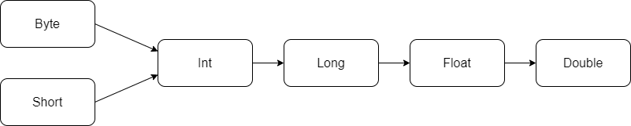
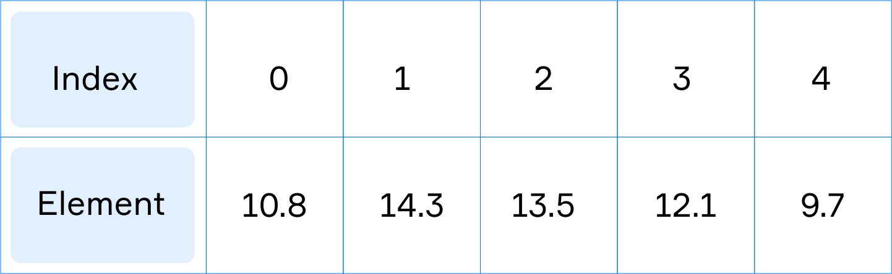
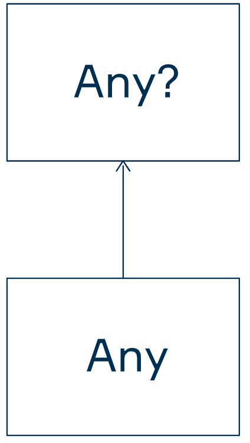

# Kotlin 语言基础

## [代码规范](https://kotlinlang.org/docs/reference/coding-conventions.html)

### 基本代码约定

1. 使用**4个空格**的缩进代码
2. 尽可能**省略分号`;`**
3. 将左大括号放在代码块开始的行结尾（opening curly brace）
4. 将右大括号放在下一行的开头

```kotlin
fun main() { // opening curly brace
    println("Hi") // this statement is offset by 4 spaces and has no `;` at the end
} // closing brace
```

### 变量命名

#### 变量命名规则

- 名称区分大小写
- 名称由字母，数字和下划线组成
- 名称不能以数字开头
- 一个名称不能是关键字（例如`val`，`var`，`fun`是非法的名称）

#### 变量命名规范

- 如果变量名是一个单词，则应使用小写字母
- 如果变量名包含多个单词，则应使用`lowerCamelCase`，即第一个单词应使用小写字母，其他所有单词都应使用大写字母开头
- 不能以`_` 开头，虽然这样是正确的
- 名称应该是有意义的

这些约定是可选的，但**强烈建议**您遵循它们

## 声明变量

`Kotlin` 提供了两个关键字声明变量：

- `val` 声明一个**不变的变量**（**命名值**或**常量**），在初始化之后不能更改
- `var` 声明一个**可变的变量**，可以更改

让我们声明一个不可变的变量`language`，并使用 string 对其进行初始化`"Kotlin"`。

```kotlin
// 此变量在初始化后无法修改，因为它已声明为val
val language = "Kotlin"
```

可变变量（用关键字`var`声明）有一个限制。您只能重新分配与初始值相同类型的值。因此，下面的代码段是不正确的：

```kotlin
var number = 10
number = 11 // ok
number = "twelve" // an error here!
```

**尽可能使用 `val` 声明不可变变量，如果 `val` 不合适时再使用 `var` 声明变量**

## 注释

注释是一个特殊的文本，编译器将忽略它

`Kotlin` 有三种注释

### 行尾注释

编译器将忽略从 `//` 开始到行结尾的所有文本

```kotlin
fun main() {
    // The line below will be ignored
    // println("Hello, World")

    // This prints the string "Hello, Kotlin"
    println("Hello, Kotlin")  // Here can be any comment
}
```

### 多行注释

编译器将忽略 `/*` 和 `*/` 之间的任何文本

```kotlin
fun main() {
    /* This is a single-line comment */
    /*  This is an example of
        a multi-line comment */

    /* All lines below will be ignored
        println("Hello")
        println("World")
    */
}
```

### 文档注释

编译器将忽略 `/**` 和 `*/` 之间的任何文本

`文档注释` 可以使用工具来自动生成源码的文档

通常，这些注释放在某些程序元素的声明之上

```kotlin
/**
 * The `main` function accepts string arguments from outside.
 *
 * @param args arguments from the command line.
 */
fun main(args: Array<String>) {
    // do nothing
}
```

## 数据类型

**创建变量后，它就具有类型，并且以后不能更改其类型**

变量都具有一种**类型**，该**类型**决定了可能的操作，可以对该变量执行的**类型**以及可以存储在该变量中的值

### 变量类型

在声明变量时设置其类型：

```kotlin
val text = "Hello, I am studying Kotlin now."
val n = 1
```

在这种情况下，Kotlin知道这`text`是一个字符串，并且`n`是一个数字。Kotlin会自动确定两个变量的类型。这种机制称为**类型推断**

### 用类型推断声明变量

```kotlin
val/var identifier = initialization
```

在声明变量时指定其类型：

```kotlin
val/var identifier: Type = initialization 
```

请注意，类型的名称始终以大写字母开头

```kotlin
val text: String = "Hello, I am studying Kotlin now."
val n: Int = 1
```

示例

```kotlin
// 错误，因为此时类型推断无法确定变量的类型
val greeting // error
greeting = "hello"

// 正确，指定变量类型
val greeting: String // ok
greeting = "hello"
```

### 基本数据类型

#### 整型

**整数**（0，1，2，...）是由以下四种类型表示：`Long`，`Int`，`Short`，`Byte`（从最大到最小）

如果整数值包含很多数字，我们可以添加下划线(`_`)以将数字划分为块，以使该数字更具可读性：例如，`1_000_000`比起 `1000000` 更易于阅读，下划线不能放在数字的开头或末尾，下划线也可以连续放多个

```kotlin
val bigNum = 100____00__000__00
```

整数类型的范围计算为：-(2<sup>n-1</sup>) 至 (2<sup>n-1</sup>)-1，其中*n*是位数

- `Byte`：大小8位（1字节），范围-128至127
- `Short`：大小为16位（2个字节），范围为-32768至32767
- `Int`：大小为32位（4字节），范围为−(2<sup>31</sup>）至（2<sup>31</sup>) - 1
- `Long`：大小为64位（8字节），范围为−（2<sup>63</sup>）至（2<sup>63</sup>）−1

```kotlin
val zero = 0 // Int
val one = 1  // Int
val oneMillion = 1_000_000  // Int

val twoMillion = 2_000_000L // Long, because it is tagged with L
val bigNumber = 1_000_000_000_000_000 // Long, Kotlin automatically choose it (Int is too small)
val ten: Long = 10 // Long, because the type is specified

val shortNumber: Short = 15 // Short, because the type is specified
val byteNumber: Byte = 15   // Byte, because the type is specified
```

#### 浮点类型

表示带有小数部分的数字。`Kotlin` 有两种类型：`Double`（64位）和`Float`（32位）。`Floag` 最大能存储 `6-7` 位小数，`Double` 最大能存储 `14-16` 位小数。通常，实际开发中使用`Double` 类型

```kotlin
val pi = 3.1415  // Double
val e = 2.71828f // Float, because it is tagged with f
val fraction: Float = 1.51 // Float, because the type is specified
```

要显示数字类型（包括`Double`和`Float`）的最大值和最小值，您需要输入类型名称，后跟一个点，然后输入`MIN_VALUE`或`MAX_VALUE`

```kotlin
println(Int.MIN_VALUE)  // -2147483648
println(Int.MAX_VALUE)  // 2147483647
println(Long.MIN_VALUE) // -9223372036854775808
println(Long.MAX_VALUE) // 9223372036854775807
```

也可以获取整数类型的大小，以字节或位为单位（1字节= 8位）：

```kotlin
println(Int.SIZE_BYTES) // 4
println(Int.SIZE_BITS)  // 32
```

注意：带浮点数的运算可能会产生不准确的结果

```kotlin
println(3.3 / 3) // prints 1.0999999999999999
```

#### 字符类型

`Char`用于表示字母（大写和小写）、数字和其他符号。每个字符是用单引号引起来的

```kotlin
val lowerCaseLetter = 'a'
val upperCaseLetter = 'Q'
val number = '1'
val space = ' '
val dollar = '$'
```

也可以通过使用[Unicode表](https://unicode-table.com/en/)中的十六进制码来创建 `Char` 类型。以`\u`开头

```kotlin
val ch = '\u0040' // it represents '@'
println(ch) // @
```

尽管我们使用字符序列来表示此类代码，但是代码本身恰好表示一个字符。

##### 检索字符

使用 `+` 和 `-` 运算符可以对 `Char` 类型进行整型运算以便获得 `Unicode` 顺序表中的下一个和上一个字符

```kotlin
val ch1 = 'b'
val ch2 = ch1 + 1 // 'c'
val ch3 = ch2 - 2 // 'a'
```

`++` 、 `--` 、 `+=` 、 `-=` 运算符都可以对 `Char` 类型进行运算

```kotlin
var ch = 'A'

ch += 10
println(ch)   // 'K'
println(++ch) // 'L'
println(++ch) // 'M'
println(--ch) // 'L'
```

不能对 `Char` 类型进行乘除运算

##### 转义字符

以反斜线 `\` 开始的特殊字符表示转义字符或者控制字符

- `'\n'` 换行符
- `'\t'` 制表符 `tab`
- `'\r'` 回车符
- `'\\'` 反斜线
- `'\''` 单引号
- `'\"'` 双引号

Here are several examples:

```java
print('\t') // makes a tab
print('a')  // prints 'a'
print('\n') // goes to a new line
print('c')  // prints 'c'
```

##### 关系运算

根据字符在 `Unicode` 表中的位置可以进行关系运算

```kotlin
println('a' < 'c')  // true
println('x' >= 'z') // false

println('D' == 'D') // true
println('Q' != 'q') // true, because capital and small letters are not the same

println('A' < 'a')  // true, because capital Latin letters are placed before small ones
```

##### 字符处理

字符类型包含一些常用的方法可直接使用

- `isDigit()` 如果字符是数字则返回 `true`否则返回 `false` 
- `isLetter()` 如果字符是字母则返回 `true` 否则返回 `false`
- `isLetterOrDigit()` 如果字符是数字或者字母则返回 `true` 否则返回 `false`;
- `isWhitespace()` 如果字符是空白字符(`' '` or `'\t'` or `'\n'`)则返回 `true` 否则返回 `false`
- `isUpperCase()` 如果字符是大写字母则返回 `true` 否则返回 `false`;
- `isLowerCase()` 如果字符是小写字母则返回 `true` 否则返回 `false`;
- `toUpperCase()` 返回字符的大写形式
- `toLowerCase()` 返回字符的小写形式

```kotlin
val one = '1'

val isDigit = one.isDigit()   // true
val isLetter = one.isLetter() // false

val capital = 'A'
val small = 'e'

val isLetterOrDigit = capital.isLetterOrDigit() // true

val isUpperCase = capital.isUpperCase() // true
val isLowerCase = capital.isLowerCase() // false

val capitalE = small.toUpperCase() // 'E'
```

#### 布尔类型

`Boolean` 类型只能存储两个值：`true`和`false`

```kotlin
val enabled = true
val bugFound = false
```

#### 字符串类型

`String`类型是用双引号引起来的一系列字符

```kotlin
val creditCardNumber = "1234 5678 9012 3456"
val message = "Learn Kotlin instead of Java."
```

##### 访问字符

字符串的元素是可以通过其索引访问的单个字符。字符串的第一个元素的索引为 `0` 

```kotlin
val greeting = "Hello"

val first = greeting[0]  // 'H'
val second = greeting[1] // 'e'
val five = greeting[4]   // 'o'
```

最后一个元素的索引等于字符串的长度减去`1` 

```kotlin
val last = greeting[greeting.length - 1] // 'o'
val prelast = greeting[greeting.length - 2] // 'l'
```

`Kotlin` 提供了几种方便的方式来访问字符串的第一个和最后一个字符

```kotlin
println(greeting.first())   // 'H'
println(greeting.last())    // 'o'
println(greeting.lastIndex) // 4
```

##### 不可变性

字符串是**不可变的**， 这意味着一旦创建，字符串便始终相同。不能修改字符串的元素

```kotlin
val str = "string"
str[3] = 'o' // an error here!
```

但这一项有效：

```kotlin
var str = "string"
// 给字符串重新复制
str = "strong"
```

如果需要修改字符串，只需创建一个新字符串即可

##### 连接字符串

可以使用`+`运算符来连接两个字符串：

```kotlin
val str1 = "ab"
val str2 = "cde"
val result = str1 + str2 // "abcde"
```

当我们连接两个字符串时，会创建一个新字符串（因为字符串是**不可变的**）

如果字符串连接的是数字，则字符串必须在开头（第一个操作数）

```kotlin
val str = "abc" + 10 + true
println(str) // abc10true

val str = 10 + "abc" // an error here!
```

##### 比较字符串

比较两个字符串使用`==`（等于）和`!=`（不等于）

```kotlin
val first = "first"
val second = "second"
var str = "first"

println(first == str)  // true
println(first == second) // false
println(first != second) // true
```

##### 字符串模板

字符串模板可以将变量的值插入到文本中

1. 变量模板

   要将变量的值添加到字符串中，在变量名称前写一个美元符号: `$变量`

   ```kotlin
   val city = "Paris"
   val temp = "24"
   
   println("Now, the temperature in $city is $temp degrees Celsius.")
   // 和下面代码输出一样
   println("Now, the temperature in " + city + " is " + temp + " degrees Celsius.")
   ```

2. 表达式模板

   可以使用字符串模板将任意表达式的结果放入字符串中: `${表达式}` 

   ```kotlin
   val language = "Kotlin"
   println("$language has ${language.length} letters in the name")
   ```

##### 获取子字符串

1. 截取字符串一部分

   `substring(startIndex, lastIndex)` 截取字符串一部分(不包含 `lastIndex` 位置的字符 )

   如果省略 `lastIndex` 则表示从 `startIndex` 开始到字符串末尾

   ```kotlin
   val greeting = "Hello"
   println(greeting.substring(0, 3)) // "Hel"
   println(greeting.substring(1, 3)) // "el"
   println(greeting.substring(2))    // "llo"
   println(greeting.substring(4, 5)) // "o"
   ```

    `substringAfter`和`substringBefore`也可获得部分字符串，接受分隔字符作为参数，返回指定的字符首次出现位置的后面或者前面的字符串，如果分割字符串没有找到则返回整个字符串

   ```kotlin
   // greeting = "Hello"
   println(greeting.substringAfter('l'))  // "lo"
   println(greeting.substringBefore("o")) // "Hell"
   println(greeting.substringBefore('z')) // "Hello"
   ```

2. 替换部分字符串

   `replace` 函数可用第二个参数替换第一个参数

   ```kotlin
   val example = "Good morning..."
   println(example.replace("morning", "bye")) // "Good bye..."
   println(example.replace('.', '!'))         // "Good morning!!!"
   
   ```

   如果只需要替换参数的**第一个匹配**项，请使用`replaceFirst`

   ```kotlin
   val example = "one one two three"
   println(example.replaceFirst("one", "two")) // "two one two three"
   ```

3. 重复字符串

   `repeat` 函数将字符串重复字符串多次

   ```kotlin
   print("Hello".repeat(4)) // HelloHelloHelloHello
   ```

##### 处理字符串

字符串像数组一样可以迭代

1. 字符串和数组相互转换

   ```kotlin
   val chars = charArrayOf('A', 'B', 'C', 'D', 'E', 'F')
   
   val stringFromChars = String(chars) // "ABCDEF"
   
   val charsFromString = stringFromChars.toCharArray() // { 'A', 'B', 'C', 'D', 'E', 'F' }
   
   val theSameString = String(charsFromString) // "ABCDEF"
   
   val text = "Hello world"
   val parts: Array<String> = text.split(" ").toTypedArray() // {"Hello", "world"}
   ```

2. 遍历字符串

   可以使用 `loop` 遍历字符串中的字符

   ```kotlin
val scientistName = "Isaac Newton"
   
   for (i in 0 until scientistName.length) {
       print("${scientistName[i]} ") // print the current character
   }
   
   for (ch in scientistName) {
   		print("$ch ") // print the current character
}
   ```

   通过索引迭代数组的示例：
   
   ```kotlin
   val rainbow = "ROYGCBV"
   
   for (index in rainbow.indices){
       println("${index+1}: ${rainbow[index]}")
   }
   ```

### 类型转换

`Kotlin` 不进行自动类型转换，所有类型之间的转换必须显示的进行

#### 数字类型之间的转换

在实践中，常用的有三种数字类型：`Int`，`Long`，和`Double` 

将一种数字类型转换为另外一种数字类型需要进行类型转换：`toInt()`, `toLong()`, `toDouble()`等

```kotlin
val num: Int = 100

val res: Double = Math.sqrt(num.toDouble())
println(res) // 10.0

println(num) // 100, it is not modified
```

尽管`Char`不是数字类型，您仍可以根据字符代码（可以在Unicode表中找到）将数字转换为字符，反之亦然。该代码可以视为整数。

```kotlin
val n1: Int = 125
val ch: Char = n1.toChar() // '}'
val n2: Int = ch.toInt()   // 125
```

将较大的数字类型（例如`Long`或`Double`）转换为较小的数字类型（例如`Int`）也是可以的

```kotlin
val d: Double = 10.2
val n: Long = 15

val res1: Int = d.toInt() // 10
val res2: Int = n.toInt() // 15
```

但是，此转换可能会截断该值，因为`Long`和`Double`可以存储比 `Int` 更大的数字

```kotlin
val bigNum: Long = 100_000_000_000_000

// 类型溢出
val n: Int = bigNum.toInt() // 276447232; oops
```

#### 转换成字符串

`Kotlin` 提供了 `toString()`将某些内容转换为字符串

```kotlin
val n = 8     // Int
val d = 10.09 // Double
val c = '@'   // Char
val b = true  // Boolean

val s1 = n.toString() // "8"
val s2 = d.toString() // "10.09"
val s3 = c.toString() // "@"
val s4 = b.toString() // "true"
```

字符串可以转换为数字或布尔值（但不能转换为单个字符）

```kotlin
val n = "8".toInt() // Int
val d = "10.09".toDouble() // Double
val b = "true".toBoolean() // Boolean
```

如果数字的字符串表示格式无效，则在转换过程中将发生异常

如果将字符串转换为布尔值，则不会发生任何错误。如果字符串为 `"true"`（忽略大小写），则转换结果为`true`，否则为`false`

```kotlin
val b1 = "false".toBoolean() // false
val b2 = "tru".toBoolean()   // false
val b3 = "true".toBoolean()  // true
val b4 = "TRUE".toBoolean()  // true
val b5 = "xxxx".toBoolean()  // false
```

## 算数运算

`Kolin` 中所有的运算符都有以下原则: 

### 二元运算符

`Kotlin` 有5个算数运算符

- 加 (addition) `+`
- 减 (subtraction) `-`
- 乘 (multiplication) `*`
- 除法 (division) `/`
- 取余 (remainder) `%` (modulus)

```kotlin
println(13 + 25) // prints 38

println(70 - 30) // prints 40

println(21 * 3)  // prints 63
```

除法 `/` 

```kotlin
// 参考类型推算
println(10 / 3)  	 // prints 3
println(10 / 3.0)  // prints 3.333333333
```

取余 `%` 得到除法的余数

```kotlin
println(10 % 3) // prints 1, because 10 divided by 3 leaves a remainder of 1
```

### 一元运算符

- 在一元加号表示为正值。它是一个可选的运算符，因此最好不要在实践中使用它

```java
println(+5) // prints 5
```

- 一元减号负值或表达式

```java
println(-8)  // prints -8
println(-(100 + 4)) // prints -104
```

它们都比**乘法**和**除法**运算符具有更高的优先级

### assignment 运算符

`assignment operations` （赋值算术运算符）是算术运算符和赋值运算符的组合

- `+=` 先加后赋值: **A += B** equals **A = A + B**
- `-=` 先减后赋值: **A -= B** equals **A = A - B**
- `*=` 先乘后赋值: **A \*= B** equals **A = A \* B**
- `/=` 先除后赋值: **A /= B** equals **A = A / B**
- `%=` 先取余后赋值: **A%= B** equals **A = A% B**

### 自增、自减

`++` 自增：执行+1

`--` 自减：执行-1

```kotlin
var num = 3
num++  // 4, increment
num--  // 3, decrement
```

自增运算符和自减运算符都有两种非常重要的区别形式：前缀和后缀

#### 前缀形式

前缀形式在变量使用之前改变其值

```kotlin
var a = 10
val b = ++a
println(a)  // a = 11
println(b)  // b = 11
```

这里，首先 `a` 的值自增1，然后再将 `a` 的值赋值给 `b` ，所以这里 `a` 和 `b` 都是 `11`

#### 后缀形式

后缀形式在变量使用之后改变其值

```kotlin
var a = 10
val b = a++
println(a)  // a = 11
println(b)  // b = 10
```

这里，首先将 `a` 的值赋值给 `b` ，然后 `a` 的值自增1，所以这里 `a=11`  `b=10`

#### 优先级

优先级从高到低

1. 括号
2. 后缀自增/自减
3. 一元正负号，前缀自增/自减
4. 乘法，除法和模数
5. 加减
6. 赋值

## 逻辑运算符

`Kotlin` 有4个逻辑运算符： **NOT**, **AND**, **OR** and **XOR** 

- **NOT(!)** 是一元操作符，对 `Boolean` 类型的值取反

```kotlin
val f = false // f is false
val t = !f    // t is true
```

- **AND(&&)** 是二元运算符， 如果两个操作数都是 `true` 则结果是 `true`，其他情况都是 `false`

```kotlin
val b1 = false && false // false
val b2 = false && true // false
val b3 = true && false // false
val b4 = true && true  // true 
```

- **OR(||)** 是二元运算符， 只要一个操作数是 `true` 则结果是 `true`, 其他情况都是 `false`

```kotlin
val b1 = false || false // false
val b2 = false || true  // true
val b3 = true || false  // true
val b4 = true || true   // true
```

- **XOR** (xor) 是二元运算符， 如果两个操作数不同则结果是 `true` ，其他情况都是 `false`

```kotlin
val b1 = false xor false // false
val b2 = false xor true  // true
val b3 = true xor false  // true
val b4 = true xor true   // false
```

### 逻辑运算符的优先级

优先级从高到低

- `!` 非
- `xor` 异或
- `&&` 与
- `||` 或

## 关系运算符

关系运算符的优先级低于算数运算符

关系运算符的优先级高于逻辑运算符

`Kotlin` 提供了六个关系运算符来比较数字：

- `==` （等于）
- `!=` （不等于）
- `>` （比...更棒）
- `>=` （大于或等于）
- `<` （少于）
- `<=` （小于或等于）

## 数据类型和变量

### 类型推断

推断类型时，其结果类型是表达式中类型最大的那个类型

下图是类型转换的方向




```kotlin
val num: Int = 100
val longNum: Long = 1000
val result = num + longNum // 1100, Long
```

#### Short and Byte 类型

只有 `Short` 和 `Byte` 类型的表达式结果类型是 `Int` 

```kotlin
val hundred: Short = 100
val five: Byte = 5
val zero = hundred % five // 0, Int
```

如果想两个 `Short` 类型的结果类型也是 `Short` 类型则必须手动转换

```kotlin
val one: Short = 1
val five: Short = 5
val six = (one + five).toShort() // 6, Short
```

#### 表达式结果类型

在不同数字类型的表达式中，结果类型按照以下方法判断：

1. 如果两个都是 `Double`, 则结果类型是 `Double`.
2. 否则，如果任何一个操作数的类型是 `Float`, 则结果类型是 `Float`.
3. 否则，如果任何一个操作数的类型是 `Long`, 则结果类型是 `Long`.
4. 其他情况结果类型是 `Int`.

### 范围 range

`Kotlin` 提供了一种使用**range**表示范围

```kotlin
val within = c in a..b
```

`a..b` 表示从`a`到`b`数字范围（包括两个边界），`in`是一个特殊的关键字，用于检查值是否在范围内

如果 `c` 在范围内则 `within=true` ，否则 `winthin=false`

```kotlin
println(5 in 5..15)  // true
println(12 in 5..15) // true
println(15 in 5..15) // true
println(20 in 5..15) // false
```

如果检测一个值不在一个范围内，则只需要使用 `!in`

```kotlin
val notWithin = 100 !in 10..99 // true
```

可以为变量分配范围，并在以后使用

```kotlin
val range = 100..200
println(300 in range) // false
```

### 对象 Objects

一切都是对象

在 `Kotlin` 中，每个变量和值都是一个对象，例如，整数5和字符串 "high" 是对象

#### 复制对象引用 Copying by reference

`Kotlin` 中变量和值仅仅只是指向对象：如果创建一个变量并为其赋值一个对象，则另一个变量也可以指向同一对象

`=`符号不会复制对象本身，而只会复制对其的引用

#### 状态和行为

对象拥有状态和行为

属性(property)：在 `Kotlin` 中，允许你访问对象的状态，这里的状态就是属性。只需要在对象的后面加上点(`.`)和属性名称就可访问

成员函数(member functions)：绑定到具体类型上的函数，这些被绑定的函数就代表了对象的行为

### 数组 array

数组是同一类型元素的集合，所有元素按顺序存储在内存中

创建数组时将确定要存储的元素的数量，并且无法更改。但是，您可以随时修改存储的元素



#### 创建具有指定元素的数组

`Kotlin` 提供了许多类型的数组：`IntArray`, `LongArray`, `DoubleArray`, `FloatArray`, `CharArray`, `ShortArray`, `ByteArray`, `BooleanArray` 存储对应类型的元素，**注意这里没有 `StringArray`**

要创建指定类型的数组，我们需要调用一个特殊函数并传递所有元素以将它们存储在一起：

- `intArrayOf` 创建 `IntArray`
- `charArrayOf` 创建 `CharArray` 
- `doubleArrayOf` 创建 `DoubleArray` 

```kotlin
val numbers = intArrayOf(1, 2, 3, 4, 5) // It stores 5 elements of the Int type
println(numbers.joinToString()) // 1, 2, 3, 4, 5

val characters = charArrayOf('K', 't', 'l') // It stores 3 elements of the Char type
println(characters.joinToString()) // K, t, l

val doubles = doubleArrayOf(1.25, 0.17, 0.4) // It stores 3 elements of the Double type
println(doubles.joinToString()) // 1.15, 0.17, 0.4
```

#### 创建具有指定大小的数组

要创建具有指定大小的数组

```kotlin
val numbers = IntArray(5) // an array for 5 integer numbers
println(numbers.joinToString())

val doubles = DoubleArray(7) // an array for 7 doubles
println(doubles.joinToString())
```

这些具有预定义大小的数组由相应类型的默认值填充（数字类型为零）

#### 数组的大小

数组始终具有大小，即元素数。要获得它，我们需要获取`size`属性的值。它是Int类型的数字

```kotlin
val numbers = intArrayOf(1, 2, 3, 4, 5)
println(numbers.size) // 5 
```

创建数组后，无法更改其大小

#### 访问元素

通过索引设置值：

```kotlin
array[index] = elem
```

通过索引获取值：

```kotlin
val elem = array[index]
```

`Kotlin` 提供了几种方便的方法来访问数组的第一个和最后一个元素以及最后一个索引：

```kotlin
val strings = arrayOf("abc", "cdf", "efg")
println(strings.first()) // "abc"
println(strings.last()) // "efg"
println(strings.lastIndex) // 2
```

使用这种方法可以使您的代码更具可读性，并防止访问不存在的索引

#### 比较数组

要比较两个数组，请调用`contentEquals()`函数，并传递另一个作为参数。当两个数组以相同的顺序包含完全相同的元素则返回`true`，否则返回`false`：

```kotlin
val numbers1 = intArrayOf(1, 2, 3, 4)
val numbers2 = intArrayOf(1, 2, 3, 4)
val numbers3 = intArrayOf(1, 2, 3)

println(numbers1.contentEquals(numbers2)) // true
println(numbers1.contentEquals(numbers3)) // false
```

#### indices

`数组名.indices` 获得数组的索引范围

```kotlin
val arr = intArrayOf(1, 2, 3, 4)
for (i in arr.indices) {
  // 打印数组的每个索引
  println(i)
}
```

`数组名.indices - 整数` 表示跳过 `整数` 表示的索引

```kotlin
for (i in arr.indices - 2) {
  // 这里跳过了索引2，只打印 0 1 3
  println(i)
}
```

### 正则表达式

#### 创建一个正则表达式

`Kotlin` 有两种方式创建正则表达式

1. 创建一个`String`实例，然后调用 `toRegex()`，这将使该字符串产生一个正则表达式：

```kotlin
val string = "cat" // creating the "cat" string
val regex = string.toRegex() // creating the "cat" regex
```

2. 调用`Regex`构造函数

```kotlin
val regex = Regex("cat") // creating a "cat" regex
```

#### 简单匹配

```kotlin
String.matches(regex: String): Boolean
```

用于查找**完全**匹配，即整个字符串必须与模式匹配

```kotlin
val regex = Regex("cat") // creating the "cat" regex
    
val stringCat = "cat"
val stringDog = "dog"
val stringCats = "cats"

println(stringCat.matches(regex))   // true
println(stringDog.matches(regex))   // false
println(stringCats.matches(regex))  // false
```

#### 点字符(.)

点`.`匹配任何单个字符，包括字母，数字，空格等。它不能匹配的唯一字符是换行符`\n`

```kotlin
val regex = Regex("cat.") // creating the "cat." regex

val stringCat = "cat."
val stringEmotionalCat = "cat!"
val stringCatN = "cat\n"

println(stringCat.matches(regex))   // true
println(stringEmotionalCat.matches(regex))   // true
println(stringCatN.matches(regex))  //false
```

#### 问号(?)

问号`?`是一个特殊字符，表示**可选项**。它的意思是: 前面的字符或什么都没有

```kotlin
val regex = Regex("cats?") // creating the "cats?" regex

val stringCat = "cat"
val stringManyCats = "cats"

println(stringCat.matches(regex))   // true
println(stringManyCats.matches(regex))   // true
```

### BigInteger

Java类库提供了一个`BigInteger`用于处理非常大的数字（正数和负数）的类。因此，当您使用 `Kotlin/JVM` 环境时，可以使用`BigInteger` 

`BigInteger`类是**不可变的**，这意味着函数和类返回新实例

`BigInteger`除非绝对必要，否则不要使用。使用它总是会影响性能。`BigInteger`操作比内置整数类型的操作慢

#### 创建BigInteger对象

`BigInteger`属于`java.math`包，我们通过编写以下语句将其导入：

```kotlin
import java.math.BigInteger

val number1 = BigInteger("62957291795228763406253098")
val number2 = BigInteger.valueOf(1000000000)
val number3 = 1234.toBigInteger()
```

此外，该类具有几个有用的常量。使用特定常量比创建额外对象快一点：

```kotlin
val zero = BigInteger.ZERO // 0
val one = BigInteger.ONE   // 1
val ten = BigInteger.TEN   // 10
```

### null 和 non-null 类型

`NullPointerException` 类型问题的处理

`Kotlin` 中只有以下三种引发 `NullPointerException` 类型异常

1. 明确抛出：`throw NullPointerException()`
2. `!!` 语法
3. 错误的初始化，例如：构造函数和父类构造函数

`Kotlin` 中的每个引用都可以为空或不为空

```kotlin
// 默认下面的定义方式是：不为 null 类型定义
var name: String = null
```

这个将不能编译，因为我们声明了一个 `non-null` 变量

```kotlin
var name: String? = null
```

这里的 `?` 表示变量 `name` 可以是 `null`

#### 访问 null 变量

假设下面的定义

```kotlin
var name: String? = null
print(name.length)
```

这段代码不能被编译

有2中方法可以访问 `null变量` 

1. ```kotlin
   if (name != null) {
       print(name.length)
   }
   ```

2. 使用安全调用 `?.`

   ```kotlin
   print(name?.length)
   ```

### 类型系统

#### Any

`Kotlin` 中， `Any` 是所有非空类型的根类（root ），这意味着所有非空类型是 `Any` 的子类

`Kotlin` 保证 `Any` 类型的子类型永远不能为 `null`，所以在 `Kotlin` 中 `null` 检查是无用的

`Any?`（可以为null） 类型是 `Any` 类型的父类




`null类型` 是 `non-null类型` 的父类，例如，`Number` 是 `Number?` 的子类

#### Unit

`Unit` 类型可以作为没有返回值的函数的返回类型

```kotlin
fun logCurrentState(): Unit { 
    println("Current state of a program: $state")
}
```

如果一个函数未指定返回值，则编译器会为其返回 `Unit`

```kotlin
fun updateState(state: State) { 
    logCurrentState()
    this.state = state
    logCurrentState()
}

val result: Unit = logCurrentState()
```

#### Nothing

`Nothing` 在 `Kotlin` 继承树的最底层

`Nothing` 是一个没有实例的类型

#### `Kotlin` 继承关系图


## 流程控制

### if 表达式

**`Kotlin` 中 `if` 是表达式不是语句**

#### if-case

如果表达式是 `true` 则执行语句块`{}`中的代码，否则跳过

```kotlin
if (expression) {
    // body: do something
}
```

#### if-else-case

如果表达式为 `true` 则执行第一个代码块，否则执行第二个代码块

```kotlin
if (expression) {    
    // do something
} else {
    // do something else
}
```

#### if-else-if-case

```kotlin
if (expression0) {
    // do something
} else if (expression1) {
    // do something else 1
		// ...
} else if (expressionN) {
    // do something else N
}
```

#### if 表达式

与其他语言（例如`Java`，`Python`，`C＃`）不同，`Kotlin`中的`if`是表达式而不是语句，他可以返回一个计算结果，注意，这里的**返回结果必须是代码块的最后一个表达式**

**如果要将`if`用作表达式，则它必须有一个`else`分支**

```kotlin
// 计算最大值，打印然后将该值赋值给 max
val max = if (a > b) {
    println("Choose a")
    a
} else {
    println("Choose b")
    b
}
```

如果语句块仅包含一个语句，则可以省略花括号：

```kotlin
val max = if (a > b) a else b
```

### When 表达式

`when`表达式根据变量的值执行不同的操作，可以代替多分支**if表达式**

```kotlin
import java.util.*

fun main(args: Array<String>){
    val scanner = Scanner(System.`in`)

    val a = scanner.nextInt()
    val op = scanner.next()
    val b = scanner.nextInt()

    when (op) {
        "+" -> println(a + b)
        "-" -> println(a - b)
        "*" -> println(a * b)
        else -> println("Unknown operator")
    }
}
```

如果需要以同样的方式处理相同的情况，在一个分支中使用逗号组合

```kotlin
when (op) {
    "+", "plus" -> {
        val sum = a + b
        println(sum)
    }
    "-", "minus" -> {
        val diff = a - b
        println(diff)
    }
    "*", "times" -> {
        val product = a * b
        println(product)
    }
    else -> println("Unknown operator")
}
```

#### 作为表达式

`when`可以用作返回结果的表达式，此时每个分支都将返回值，并且必须有 `else` 分支

```kotlin
val result = when (op) {
    "+" -> a + b
    "-" -> a - b
    "*" -> a * b
    else -> "Unknown operator"
}
println(result)
```

这里的**返回结果必须是代码块的最后一个表达式** ，即是分支的最后一行

检测是否属于范围

```kotlin
when (n) {
    0 -> println("n is zero")
    in 1..10 -> println("n is between 1 and 10 (inclusive)")
    in 25..30 -> println("n is between 25 and 30 (inclusive)")
    else -> println("n is outside a range")
}
```

#### 没有参数的 when

使用不带参数的 `when` 结构，此时每个分支的条件都是一个简单的 `boolean 表达式` ，当分支的条件为 `true` 时执行该分支，如果有多个分支的条件都是 `true` 则只执行第一个分支

```kotlin
import java.util.*

fun main(args: Array<String>){
    val scanner = Scanner(System.`in`)
    val n = scanner.nextInt()
    
    when {
        n == 0 -> println("n is zero")
        n in 100..200 -> println("n is between 100 and 200")
        n > 300 -> println("n is greater than 300")
        n < 0 -> println("n is negative")
        // else-branch is optional here
    }
}
```

### 重复代码块

#### `repeat` 循环

最简单的循环就是使用 `repeat(n)` 并在大括号中`{...}` 写上需要循环的代码，`n` 是整数：表示循环的次数，如果`n`小于或等于零，则将忽略循环

```kotlin
repeat(n) {
    // statements
}
```

例如

```kotlin
// 循环打印3行 Hello
fun main(args: Array<String>) {
    repeat(3) {
        println("Hello")
    }
}
```

### for 循环

`Kotlin` 提供了`for`循环遍历范围、数组和集合

```kotlin
for (element in source) {
    // body of loop
}

for (element in array) {
    // body of loop
}
```

#### 遍历 range

```kotlin
for (i in 1..4) {
    println(i)    
}

for (ch in 'a'..'c') {
    println(ch)
}
```

#### 反向循环

```kotlin
for (i in 4 downTo 1) {
    println(i)
}
```

#### 排除上限

使用 `until` 排除上限

```kotlin
// 循环打印数字1到3
for (i in 1 until 4) {
    println(i)
}
```

#### 使用步进 step

如果没有指定 `step`，则 `step` 是 `1`

```kotlin
for (i in 1..7 step 2) {
    println(i)
}
```

反向循环也可使用 `step`

```kotlin
for (i in 7 downTo 1 step 2) {
    println(i)
}
```

### while 循环

`while` 循环有：`while` 和 `do..while`

#### while 循环

`while`循环中，先判定测试条件，如果条件为`true`，则执行块中的语句。重复此操作，直到条件变为`false`

```kotlin
while (condition) {
    // body: do something repetitive
}
```

#### do..while循环

在`do..while`循环中，首先执行主体，然后才测试条件。如果条件为`true`，则该块内的语句将再次执行。重复此操作，直到条件变为为止`false`

```kotlin
do {
    // body: do something
} while (condition)
```

#### label、break,、continue、return

##### Label

`label` 是尾部加上`@`符号的标识符: `loop@、kotlin@`

```kotlin
loop@ for (i in 1..10) {
    // do something
}
```

##### break

用户终止当前循环

`break`后面跟`label`，则会终止使用该标签的循环

```kotlin
// 下面语句的外层循环只会执行一次就被内层的 break@loop 终止，所以该段代码输出
// i = 1, j = 1
// i = 1, j = 2
// i = 1, j = 3
loop@ for (i in 1..3) { 
    for (j in 1..3) {
        println("i = $i, j = $j")   
        if (j == 3) break@loop  
    }  
}
```

##### cotinue

`cotinue` 停止执行后面的语句进入下轮循环

`cotinue`后跟 `label`, 则停止执行后面的语句，从使用标签的地方重新开始执行

```kotlin
loop@ for (i in 1..3) {
    for (j in 1..3) {
        for (k in 1..3) {
            if (k == 2) continue@loop
            println("i = $i, j = $j, k = $k")
        }
    }
}

// i = 1, j = 1, k = 1
// i = 2, j = 1, k = 1
// i = 3, j = 1, k = 1
```

##### return

返回语句

## 集合

集合分为可变集合和不可变集合

`Kotlin` 的集合有 `list，set、map`，这三个都有可变和不可变形式

- `List` 以指定顺序存储元素，并提供对它们的索引访问
- `Set` 无序不重复元素集合
- `Map`存储**键值**对键是唯一的，但是不同的键可以与相等的值

`Set` 和 `Map` 中如果插入已经存在的元素，则会覆盖前面的值

### 可变 map

`MutableMap<K, V>` 中的键值对可以使用任何类型的对象，这个`MutableMap` 是有序的

#### 创建

```kotlin
// 定义空的map必须指定类型
val marathon = mutableMapOf<Int, String>()
val marathon = mutableMapOf(1 to "John Doe", 2 to "Marty McFly", 3 to "Marie Curie")
```

#### 访问元素

```kotlin
// 添加元素
val mara = mutableMapOf<String, String>()
mara["aa"] = "hello"
mara["bb"] = "kotlin"
// 此时map mara 的内容是：{aa=hello, bb=kotlin}

// 获取元素
val t = mara["aa"]
```

#### 删除元素

```kotlin
// 根据key删除
mara.remove("aa")

// 根据 key-value 删除，此时需要key和value都相同才会删除
// 此操作不会删除元素，因为 aa=hello
mara.remove("aa", "kotlin")
// 此时才会删除
mara.remove("aa", "hello")

// 清空map
mara.clear()
```

#### 元素是否存在

使用 `containsValue()` 和 `containsKey()` 方法检查是否存在

#### 遍历map

```kotlin
// 每个 entry 中都包含 key 和 value
for (entry in marathon) {
    println(entry.value)
}

for ((key, value) in marathon) {
    println(value)
}
```

### List

#### 不可变 List

`List` 是有序的不可变集合（大小和内容都不能更改）

`List`是**泛型**类型。可以使用`listOf<E>`进行初始化，其中`E`是列表中包含的元素的类型

##### 创建

```kotlin
val textUsMethod = listOf("SMS", "Email")
val textUsMethod = listOf<String>("SMS", "Email")

// 创建空list
val staff = emptyList<String>()
```

#### 可变 List

##### 创建

`MutableList` 有序并按顺序存储元素，可变（添加和删除元素）

```kotlin
val places = mutableListOf<String>("Paris", "Moscow", "Tokyo")
places.add("Saint-Petersburg")
println(places) // output: [Paris, Moscow, Tokyo, Saint-Petersburg]
```

如果创建一个空的 `MutableList`，则必须指定类型：

```kotlin
val cars = mutableListOf<String>()
println(cars) // output: []
```

##### 将`不可变List` 转换为 `可变List`

```kotlin
val cars = listOf("Ford", "Toyota").toMutableList()
cars.add("Tesla")
println(cars) // output: [Ford, Toyota, Tesla]
```

##### 添加和替换

- `add(element)` 在列表末尾添加元素
- `set(index, element)` 将指定位置的元素替换为指定元素
- `addAll(elements)` 将指定集合的所有元素添加到列表的末尾

```kotlin
val finalList = mutableListOf("Milk", "Cheese", "Coke")
finalList.add("Chips")
finalList.set(0, "Water")
println(finalList) // output: [Water, Cheese, Coke, Chips]
```

##### 删除元素

- `removeAt(index)` 删除指定索引处的元素
- `remove(element)` 删除指定的元素
- `clear()` 从当前集合中删除所有元素

```kotlin
val products = mutableListOf("Milk", "Cheese", "Coke")

products.removeAt(0)
println(products) // output: [Cheese, Coke]

products.remove("Coke")
println(products) // output: [Cheese]

products.clear()
println(products) // output: []
```

## 面向对象

### 定义类

使用关键字 `class` 定义类

```kotlin
class Emptiness {
    // empty body
}
```

当一类的**主体**为**空时**，可以省略大括号

```kotlin
class Emptiness
```

#### 创建对象

创建对象只需要类名和小括号

```kotlin
val empty: Emptiness = Emptiness()
val empty = Emptiness()
```

#### 类的属性

类的属性具有明确的类型

```kotlin
class Patient {
    var name: String = "Unknown"
    var age: Int = 0
    var height: Double = 0.0
}
```

#### 访问属性

```kotlin
var patient = Patient()
println(patient.name) // prints "Unknown"
println(patient.age)  // prints "0"
```

#### 修改属性

```kotlin
class Patient {
    var name: String = "Unknown"
    var age: Int = 0
    var height: Double = 0.0
}

fun main() {
    val john = Patient()
    john.name = "John"
    john.age = 30
    john.height = 180.0

    val alice = Patient()
    alice.name = "Alice"
    alice.age = 22
    alice.height = 165.0

    println("${john.name}: ${john.age} yrs, ${john.height} cm")
    println("${alice.name}: ${alice.age} yrs, ${alice.height} cm")
}
```

### 构造函数

创建对象时，将调用构造函数

#### 默认构造函数

每个类都必须有一个构造函数，如果未明确定义，则编译器会自动生成一个**默认构造函数**，该**构造函数**仅创建一个对象，并且内部没有任何逻辑

#### 主构造函数

主构造函数不包含任何代码，它仅仅是初始化一个类的实例和其属性

定义主构造函数只需要在类名称后的小括号中加上初始化参数

```kotlin
class Size(width: Int, height: Int) {
    val width: Int = width
    val height: Int = height
    val area: Int = width * height
}
```

定义构造函数一般在参数之前需要加上关键字 `constructor`，但是主构造函数可以省略

```kotlin
// 主构造函数不省略关键字的定义
class Size constructor(width: Int, height: Int) {
    val width: Int = width
    val height: Int = height
    val area: Int = width * height
}
```

可以将简单的属性放在主构造函数中，在类主体中可省略

```kotlin
class Size(val width: Int, val height: Int) {
    val area: Int = width * height
}
```

#### 默认值和命名参数

主构造函数中默认值的设置方式与类主体中的设置方式相同

```kotlin
class Size(var width: Int = 1, var height: Int = 1) {
    val area: Int = width * height
}
```

创建类的实例时，可以提供不带属性名称的值，也可以使用**命名参数**：

```kotlin
val size1 = Size(3, 5) // width == 3, height == 5
val size2 = Size(width = 3, height = 5) // width == 3, height == 5
val size3 = Size(height = 5, width = 3) // width == 3, height == 5
val sizeHigh = Size(height = 10) // width == 1, height == 10
```

#### 单行类

如果除主构造函数中的成员之外没有其他类成员，则可以省略空花括号

```kotlin
class Size(val width: Int, val height: Int)
```

#### 初始化

使用 `init` 关键字定义**初始化代码块** 

此时`init`代码块表示主构造函数的扩展代码块，即`初始化代码块`是主构造函数的一部分

```kotlin
class Size(_width: Int, _height: Int) {
    var width: Int = 0
    var height: Int = 0

    init {
        width = if (_width >= 0) _width else {
            println("Error, the width should be a non-negative value")
            0
        }
        height = if (_height >= 0) _height else {
            println("Error, the height should be a non-negative value")
            0
        }
    }
}
```

类主体中可能有几个初始化程序块。在这种情况下，属性初始化器和`init`块按其出现顺序执行：

```kotlin
class Size(_width: Int, _height: Int) {
    // 1: the width property is initialized
    val width = _width

    // 2: 1st init block is executed
    init {
        println("First initializer block that prints the width $width")
    }

    // 3: the height property is initialized
    val height = _height

    // 4: 2nd init block is executed
    init {
        println("Second initializer block that prints the height $height")
    }

    // 5: the area property is initialized
    val area = width * height
}
```

### 成员函数

成员函数看起来像放在类主体中的函数

```kotlin
class MyClass {
    fun print() = println("Hello from print")
}
```

### 扩展函数

扩展函数用于扩展已有函数的功能，`Kotlin` 中的扩展函数是一个语法糖

```kotlin
fun repeated(string: String): String = string + string
repeated("ha")  // returns "haha"

// 扩展 repeated 函数
fun String.repeated(): String = this + this

// 现在可以这样调用
"ha".repeated()
```

#### 特性

- 扩展函数的语法和定义顶级函数的语法一样（只需要在要扩展的类的名字后面加上点`.` 和函数名称，被扩展的类叫做接收类型）
- 要访问当前函数的对象使用 `this` 关键字
- 调用扩展函数就像调用对象的成员函数一样

#### 扩展函数和成员函数

从调用的方式上是无法区分扩展函数和成员函数的

```kotlin
class A {
    fun member() = println("hi from member")
}

fun A.extension() = println("hi from extension")
```

上面两个函数可以通过相同的方式调用: `A().member()` 和 `A().extension()`

给类添加一个已经存在的扩展函数：

1. 如果该函数和扩展函数相同的无法编译
2. 如果该函数和成员函数相同则可以编译，但是调用的时候执行的成员函数不是新增加的扩展函数

例如：添加扩展函数 `fun A.member() = println("bye from not member")` ，调用 `A().member()` 时执行的结果是: `hi from member`

如果需要添加相同的扩展函数需要改变该函数的签名，例如：传递不同的参数

### 访问属性

#### 默认getter

```kotlin
class Client {
    val name = "Unknown"
}

val client = Client()
```

当我们执行 `client.name` 时，实际上访问了一个特殊 `get()` 函数，该函数叫 `getter` ，实际上完整的代码应该如下：

```kotlin
class Client {
    val name = "Unknown"
        get() = field
}
```

`Kotlin`中的每个属性都有自己的**backing field**，其中包含可以使用特殊关键字访问的属性值`field`，`field` 关键字保存的是当前属性的值

如果要改变 `get()` 函数的逻辑就需要实现自己的 `get()` 函数

#### 自定义 getter

```kotlin
class Client {
    var name: String = "Unknown"
    var age: Int = 18
    val info: String
        get() {
            return "name = $name, age = $age"
        }
}

val client = Client()
println(client.info) // name = Unknown, age = 18
client.name = "Lester"
client.age = 20
println(client.info) // name = Lester, age = 20
```

#### 默认 setter

当设置属性的值时，实际上调用的是特殊的 `set()` 函数，这个`set()` 函数是 `Kotlin` 默认生成的

```kotlin
class Client {
    var name = "Unknown"
        set(value) {
            field = value
        }
}
```

#### 自定义 setter

```kotlin
class Client {
    var name = "Unknown"
    var age = 18
        set(value) {                      
            field = if (value < 0) {
                println("Age cannot be negative. Set to $defaultAge")
                defaultAge
            } else
                value
        }
    val defaultAge = 18
}

val client = Client()
client.age = -1      // Age cannot be negative. Set to 18.
println(client.age)  // 18
```

### 继承

#### 打开继承

通常创建的 `kotlin` 类是 `final` 类型的，即不能被继承，因为在 `kotlin` 中默认创建的类都不能被继承

```kotlin
class Book(val pages: Int, val author: String)
```

如果一个类需要被继承那么只需要加上 `open` 关键字即可

```kotlin
open class Book(val pages: Int, val author: String)
```

#### 继承

```kotlin
class Comics(pages: Int, author: String, cost: Float) : Book(pages, author, cost)
```

这里将 `Comics` 类的所有参数直接传递给了`Book`主构造函数

#### 覆写函数

默认情况 `Kotlin` 中类的函数也是不能被重写的，如果要重写父类的函数，需要在允许被重写的函数前面加上关键字 `open`

```kotlin
open class Transport(val cost: Int) {
    open fun getFullInfo(): String {
        return "$$cost cost"
    }

    fun getTax(): String {
        return "$${(cost * 0.25).roundToInt()} tax"
    }
}
```

上面的 `getFullInfo()` 函数可以被子类重写，而 `getTax()` 不能被子类重写

重写父类函数，需要在函数前面加上关键字 `override`，如果不加将无法编译

要调用父类的同名函数，可使用关键字 `super`

默认情况下，`Kotlin`中的任何重写函数都是 `open` 的

```kotlin
open class Ship(cost: Int, val color: String) : Transport(cost) {
    override fun getFullInfo(): String {
        return super.getFullInfo() + ", $color color"
    }
}
```

### object 声明 - 单例模式

使用 `object` 关键字声明的类是单例模式

当使用 `object` 关键字声明类时不能有构造函数，因为 `Kotlin` 会自动创建构造函数

```kotlin
object PlayingField {
    fun getAllPlayers(): Array<Player> {
        /* ... */
    }
  	
    fun isPlayerInGame(player: Player): Boolean {
        /* ... */
    }
}
```

要获得`object`单例模式的实例，只需要直接使用类名称即可

```kotlin
fun startNewGameTurn() {
    val players = PlayingField.getAllPlayers()
    if (players.length < 2) {
        return println("The game cannot be continued without players")
    }
    for (player in players) {
        nextPlayerTurn(player)
    }
}

fun nextPlayerTurn(player: Player) {
    if (!PlayingField.isPlayerInGame(player)) {
        return println("Current player lost. Next...")
    }
    /* Player actions here */
}
```

#### 单例模式嵌套

如果某个类的部分属性是所有实例公用的，那么此时可以使用嵌套 `object` 

```kotlin
class Player(val id: Int) {
    object Properties {
        /* Default player speed in playing field - 7 cells per turn */
        val defaultSpeed = 7

        fun calcMovePenalty(cell: Int): Int {
            /* calc move speed penalty */
        }
    }
}

/* prints 7 */
println(Player.Properties.defaultSpeed)
```

### Companion object 伴生对象

`companion object 伴生对象` 适用于存储一个公共属性并且需要在类内部定义

```kotlin
class Player(val id: Int) {
    companion object Properties {
        /* Default player speed in playing field - 7 cells per turn */
        val defaultSpeed = 7

        fun calcMovePenalty(cell: Int): Int {
            /* calc move speed penalty */
        }
    }
}

/* prints 7 */
println(Player.Properties.defaultSpeed)
```

`companion object` 可以省略名称

```kotlin
class Player(val id: Int) {
    companion object {
        /* Default player speed in playing field - 7 cells per turn */
        val defaultSpeed = 7

        fun calcMovePenalty(cell: Int): Int {
            /* calc move speed penalty */
        }
    }
}

/* prints 7 */
println(Player.defaultSpeed)
```

如果省略 `companion object` 的名字，我们还可以使用默认名称：`Companion` 访问

```kotlin
/* prints 7 too */
println(Player.Companion.defaultSpeed)
```

#### 限制条件

- 每个类只能有一个 `companion object`
- `object 单例` 和 `companion object` 内部不能有 `companion object`

### 枚举

`Kotlin`的`Enum`是用于存储常量的容器

使用 `enum` 创建枚举类，枚举类里面的每一个项都是枚举类型的实例

```kotlin
enum class Rainbow {
    RED, ORANGE, YELLOW, GREEN, BLUE, INDIGO, VIOLET
}
```

通过构造函数进行初始化

```kotlin
enum class Rainbow(val color: String) {
    RED("Red"),
    ORANGE("Orange"),
    YELLOW("Yellow"),
    GREEN("Green"),
    BLUE("Blue"),
    INDIGO("Indigo"),
    VIOLET("Violet")
}
```

#### 方法和属性

1. `name` 获取枚举实例的名称

   ```kotlin
   val color: Rainbow = Rainbow.RED
   println(color.name)	// RED
   ```

2. `ordinal` 枚举实例的位置（定义枚举时的序号，该序号从`0`开始）

   ```kotlin
   val color: Rainbow = Rainbow.GREEN
   println(color.ordinal)	// 3
   ```

3. `values()`返回所有`Enum`实例的数组

4. `valueOf()`按 `name` 返回`Enum`实例，此方法区分大小写，如果找不到则会抛出异常

   ```kotlin
   println(Rainbow.valueOf("RED"))	// RED
   ```

#### 扩展

要扩展枚举类，需要使用 `companion object` 关键字

```kotlin
enum class Rainbow(val color: String, val rgb: String) {
    RED("Red", "#FF0000"),
    ORANGE("Orange", "#FF7F00"),
    YELLOW("Yellow", "#FFFF00"),
    GREEN("Green", "#00FF00"),
    BLUE("Blue", "#0000FF"),
    INDIGO("Indigo", "#4B0082"),
    VIOLET("Violet", "#8B00FF"),
    NULL("", "");

    companion object {
        fun findByRgb(rgb: String): Rainbow {
            for (enum in Rainbow.values()) {
                if (rgb == enum.rgb) return enum
            }
            return NULL
        }
    }

    fun printFullInfo() {
        println("Color - $color, rgb - $rgb")
    }
}

println(Rainbow.findByRgb("#FF0001"))
```

### 次要构造函数

如果定义了`主要构造函数`，则`次要构造函数`必须显式调用 `主要构造函数` 

使用 `constructor` 关键字创建次要构造函数，多个次要构造函数必须具有唯一的签名（不同参数）

```kotlin
class Size {
    var width: Int = 0
    var height: Int = 0

    constructor(_width: Int, _height: Int) {
        this.width = _width
        this.height = _height
    }
  
  	constructor(_width: Int, _height: Double) {
        width = _width
        height = _height.toInt()
    }
}

val size1 = Size(3, 4)
```

如果创建了带参数的构造函数，那么默认无参构造函数将不会被自动创建，需要自己手动创建

```kotlin
class Size {
    var width: Int = 0
    var height: Int = 0

    constructor() {
    }
  	// 等价于 constructor()
}
```

如果构造函数中赋值了 `val` 的变量，那么不需要为类属性设置默认值

```kotlin
class Size {
    val width: Int
    val height: Int
    val area: Int

    constructor(width: Int, height: Int) {
        this.width = width
        this.height = height
        this.area = width * height
    }
}
```

#### 委托

`委托`就是一个构造函数调用另一个构造函数或者主构造函数

`this` 关键字放在构造函数后面即可调用另外的构造函数

```kotlin
class Size(val width: Int, val height: Int) {
    var area: Int = width * height

    init {
        println("Object with area equal to $area is created")
    }

    constructor(width: Int, height: Int, outerSize: Size) : this(width, height) {
        outerSize.area -= this.area
        println("Updated outer object's area is equal to ${outerSize.area}")
    }
}
```

此时，将先执行主构造函数和初始化代码块，然后再执行当前构造函数

如果类没有**主构造函数**，则`委托`将会瘾式的发生，然后执行`初始化代码块`，最后执行当前`次要构造函数`

### Data class

使用 `data` 关键字定义 `数据类` 

`Kotlin` 会给 `数据类`会自动创建下面函数：`equals()`、`hashCode()` 、 `toString()` 、 `copy()`

```kotlin
data class Client(val name: String, val age: Int, val gender: String)
```

数据类规则：

1. 所有在`构造函数` 里面的`属性`才有用

   ```kotlin
   data class Client(val name: String, val age: Int, val gender: String) {
       var balance: Int = 0
   }
   ```

   这里的 `balance` 字段将不受 `data` 关键字影响，即自动创建的函数里面不会有 `balance` 属性，例如：`equals()` 函数在比较大的时候，不会比较 `balance` 属性的值

2. 可以重写除`copy()`之外的所有自动创建的函数

3. `数据类`的`主构造函数`必须至少具有一个参数，并且所有这些参数必须为`val`或`var`

#### 重写`equals()` 函数

```kotlin
class Client(val name: String, val age: Int, val gender: String) {
    override fun equals(other: Any?): Boolean {
        if (this === other) return true
        if (javaClass != other?.javaClass) return false

        other as Client

        if (name != other.name) return false
        if (age != other.age) return false
        if (gender != other.gender) return false

        return true
    }

    override fun hashCode(): Int {
        var result = name.hashCode()
        result = 31 * result + age
        result = 31 * result + gender.hashCode()
        return result
    }
}
```

### 解构分解 - Destructuring declarations

`Destructuring declarations` 可一次性将类中的一个或者多个属性解析出来

#### data class 解构

```kotlin
data class User(val name: String, val age: Int, val isAdmin: Boolean)
val anonim = User("Anonim", 999, false)

val (userName, userAge, isAdmin) = anonim
println(userName)  // prints Anonim
println(userAge)   // prints 999
println(isAdmin)   // prints false

val (userName, userAge) = anonim
```

解构使用的`componentN()` 运算符，该运算符从类中返回第n个元素。上面的代码被编译成以下代码

```kotlin
val userName = anonim.component1()
val userAge = anonim.component2()
val isAdmin = anonim.component3()
```

#### 普通类解构分解

只需要手动实现 `componentN()` 运算符即可

```kotlin
class User(val name: String, val age: Int, val isAdmin: Boolean){
    operator fun component1(): String = name
    operator fun component2(): Int = age
    operator fun component3(): Boolean = isAdmin
}

// now we can use default destructuring syntax
fun checkIsAdmin(suspiciousUser: User) {
    // desctructuring
    val (name, age, isAdmin) = suspiciousUser

    if (isAdmin)
        println("Have a nice day!")
    else
        println("Sorry, you should not be here.")
}
```

#### 数组和循环使用解构分解

数组和循环也可使用解构分解，下面将提取数组中的前3个元素的值

```kotlin
val numbers = intArrayOf(1, 2, 3, 4, 5)
val (firstName, lastName, city) = numbers
```

如果数组中的元素少于3个，那么程序将会崩溃

```kotlin
fun processAnalytics(usersData: Array<User>) {
    for ((name, age, isAdmin) in usersData) {
        if (!isAdmin)
            sendAnalyticsToCompany(name, age)
    }
}
```

#### 忽略不用的变量

在解构分解的时候，如果某个变量不需要接收，则可使用 `_` 不接收该变量

```kotlin
val usersData = arrayOf<User>()
for ((_, _, isAdmin) in usersData) {
    // /~
}
```

## 异常

`exception` ：程序运行时发生的错误

技术上来说，异常可以在引起异常的地方或者调用的任何地方处理

处理异常的最佳方法是: **在具有足够信息的方法中处理异常，以便根据此异常做出正确的决策** 

### 异常处理

#### 扔出异常

`throw` 关键字扔出异常

```kotlin
throw Exception("Total can't be negative")
```

### try-catch语句

```kotlin
try {
    // code that throws exceptions
} catch (e: IOException) {
    // handling the IOException and its subtypes   
} catch (e: Exception) {
    // handling the Exception and its subtypes
}
```

`try-catch` 语句执行流程

```kotlin
println("Before the try-catch block") // it will be printed
try {
    println("Inside the try block before an exception") // it will be printed
    println(2 / 0) // it throws ArithmeticException
    println("Inside the try block after the exception") // it won't be printed
} catch (e: ArithmeticException) {
    println("Division by zero!") // it will be printed
}

println("After the try-catch block") // it will be printed
```

### Null safe 空指针安全

`Kotlin`中有两种类型的引用：可空引用`nullable`和不可空引用`non-nullable`

#### 安全调用

在可空引用后面加上 `?` 号即可安全调用，`?` 号会将前面的引用和 `null` 进行比较，如果该引用为`null`则返回 `null`

```kotlin
print(city?.address?.street?.building?.name)
```

所以下面的两行代码是等价的

```kotlin
city?.address
(if (city == null) null else city.address)
```

#### ?: 操作符 - Elvis Operator

如果`?:`表达式左边的值不是 `null` 则返回它，否则返回表达式右侧的值

```kotlin
var name: String? = "Kotlin"
val length: Int? = name?.length
print(length ?: 0)

val length: Int = name?.length ?: throw Exception("The name is null")
```

#### !! 操作符

`!!` 操作符用于在遇到 `null` 时终止程序

```kotlin
var name: String? = "Kotlin"
print(name!!.length)

readLine()!!
```

## 函数

**在 `Kotlin` 中，所有函数都有返回值**

```kotlin
val result = println("text")
println(result) // kotlin.Unit
```

这里返回一个特殊的对象 `Unit`, 意思是：没有结果

### 声明函数

函数是将指令组合在一起以执行操作的序列，即它是一种子程序。函数具有名称

```kotlin
fun functionName(p1: Type1, p2: Type2, ...): ReturnType {
    // body
    return result
}
```

函数具有以下组件：

- 遵循与变量名称相同的规则和建议的名称
- 括号中代表输入数据的参数列表。每个参数都有一个名称和冒号`:`分隔的类型。所有参数用逗号分隔`,`
- 返回值的类型（可选）
- 包含要执行的语句和表达式的主体
- 关键字`return`后跟的结果（也是可选的）

有两种方法可以声明不返回任何值的函数（省略返回值类型，则默认返回值类型是 `Unit`）：

- 不指定返回类型（推荐使用）

```kotlin
/**
 * The function prints the values of a and b
 */
fun printAB(a: Int, b: Int) {
    println(a)
    println(b)
}
```

- 指定特殊类型`Unit`作为返回类型：

```kotlin
/**
 * The function prints the sum of a and b
 */
fun printSum(a: Int, b: Int): Unit {
    println(a + b)
}
```

#### 单个表达式函数

如果函数返回单个表达式，则可以省略大括号，此时返回值类型可以省略（`Kotlin` 会推断）

```kotlin
fun sum(a: Int, b: Int): Int = a + b
fun sum(a: Int, b: Int) = a + b // Int

fun sayHello(): Unit = println("Hello")
fun sayHello() = println("Hello") // Unit

fun isPositive(number: Int): Boolean = number > 0
fun isPositive(number: Int) = number > 0 // Boolean
```

### 默认参数

#### 默认参数函数

`Kotlin` 可以在声明中为函数的参数设置**默认值**。要调用此类函数，可以忽略具有默认值的参数，也可以通过所有参数以常规方式使用

```kotlin
fun printLine(line: String = "", end: String = "\n") = print("$line$end")

fun main(args: Array<String>) {
    printLine("Hello, Kotlin", "!!!") // prints "Hello, Kotlin!!!"
    printLine("Kotlin") // prints "Kotlin" with an ending
    printLine() // prints an empty line like println()
}
```

我们只需要在类型后面跟 `=` 号并赋值即可

#### 混合使用常规参数和默认参数

可以在函数的声明中混合使用默认参数和常规参数

```kotlin
fun findMax(n1: Int, n2: Int, absolute: Boolean = false): Int {
    val v1: Int
    val v2: Int

    if (absolute) {
        v1 = Math.abs(n1)
        v2 = Math.abs(n2)
    } else {
        v1 = n1
        v2 = n2
    }

    return if (v1 > v2) n1 else n2
}

fun main() {
    println(findMax(11, 15)) // 15
    println(findMax(11, 15, true)) // 15
    println(findMax(-4, -9)) // -4
    println(findMax(-4, -9, true)) // -9
}
```

#### 默认参数类型

默认参数可以是：常数、变量、另一个命名参数或者函数

```kotlin
fun sum2(a: Int, b: Int = a) = a + b
 
sum2(1)    // 1 + 1
sum2(2, 3) // 2 + 3
```

### 命名参数

调用具有参数的函数时，可以通过这些参数的名称传递参数

`命名参数` 必须在位置参数的后面，如果全部是`命名参数`则位置随便

```kotlin
fun calcEndDayAmount(startAmount: Int, ticketPrice: Int, soldTickets: Int) =
        startAmount + ticketPrice * soldTickets

// 位置参数方式调用
val amount = calcEndDayAmount(1000, 10, 500)  // 6000

// 命名参数方式调用
val amount = calcEndDayAmount(ticketPrice = 10, soldTickets = 500,startAmount = 1000)  // 6000

// 位置参数和命名参数混合调用
val amount = calcEndDayAmount(1000, ticketPrice = 10, soldTickets = 500)  // 6000
```

### 将函数用做对象

How to store a function as an object and to use it

只要函数的类型相同，则认为是相同的类型

`Kotlin` 中的一等公民条件如下：

1. 可以存储为变量
2. 可以被函数返回
3. 可以作为参数传递给函数
4. 不要依赖他们的名字
5. 可以在程序**运行时**创建

`Kotlin` 中函数是一等公民

#### 函数类型

`Kotlin` 内置支持函数类型

```kotlin
(parameters types) -> return value type
```

小括号中的参数类型是用逗号分隔的

```kotlin
fun sum(a: Int, b: Int): Int = a + b
// 上面函数的类型如下
// (Int, Int) -> Int
```

#### 函数引用

`Kotlin` 允许获取函数的引用

要获取一个对顶级函数的引用，只需要在函数名称前加上双引号(`::`)不需要需要小括号和参数，例如：`::sum` 将获得一个对 `(Int, Int) -> Int` 函数类型的引用

```kotlin
val sumObject = ::sum
```

`sumObject` 存储的是 `sum` 函数的引用，它具有 `sum` 函数的类型

还可以显示指定 `sumObject` 的类型

```kotlin
val sumObject: (Int, Int) -> Int = ::sum
```

这样就可以通过以下方式调用 `sum` 函数

```kotlin
sumObject(10, 20)
```

#### 返回其他函数引用

创建返回函数引用的函数

```kotlin
fun getRealGrade(x: Double) = x
fun getGradeWithPenalty(x: Double) = x - 1

fun getScoringFunction(isCheater: Boolean): (Double) -> Double {
    if (isCheater) {
        return ::getGradeWithPenalty
    }

    return ::getRealGrade
}
```

#### 函数引用作为参数传递

可以创建将其他函数作为参数的函数

```kotlin
fun applyAndSum(a: Int, b: Int, transformation: (Int) -> Int): Int {
    return transformation(a) + transformation(b)
}

fun square(x: Int) = x * x
applyAndSum(1, 2, ::square)  // returns 5 = 1 * 1 + 2 * 2
```

这里 `transformation` 参数接收一个 `(Int) -> Int` 类型的函数

```kotlin
fun isNotDot(c: Char): Boolean = c != '.'
val originalText = "I don't know... what to say..."
val textWithoutDots = originalText.filter(::isNotDot)
// "I don't know what to say"
```

### Lambda表达式

在运行时创建没有名字的函数

#### 没有名字的函数

`Kotlin` 中创建没有名字的函数：匿名函数、Lambda表达式

- 匿名函数：`fun(arguments): ReturnType { body }` 
- lambda表达式：`{ arguments -> body }` 

```kotlin
// 匿名函数
val mul1 = fun(a: Int, b: Int): Int {
    return a * b
}

// lambda表达式
val mul2 = { a: Int, b: Int -> a * b }

println(mul1(2, 3))  // prints "6"
println(mul2(2, 3))  // prints "6" too
```

不带参数的 `lambda表达式` 定义时不需要写箭头符号 `{ body }`

`lambda` 表达式只有一个参数时，可以使用 `it` 省略参数

```kotlin
val originalText = "I don't know... what to say..."
originalText.filter({ c -> c != '.' })
originalText.filter() { c -> c != '.' }
originalText.filter { c -> c != '.' }
originalText.filter { it != '.' }
```

如果 `lambda表达式` 有多行，则 `lambda表达式` 内的最后一行是其返回值

```kotlin
val textWithoutSmallDigits = originalText.filter {
    val isNotDigit = !it.isDigit()
    val stringRepresentation = it.toString()

    isNotDigit || stringRepresentation.toInt() >= 5
}
```

`lambda表达式` 也可以使用 `return` 返回，此时返回语句必须这样写：`return@标签名称` ，`标签名称`通常是传递 `lambda` 的函数名

```kotlin
val textWithoutSmallDigits = originalText.filter {
    if (!it.isDigit()) {
      	// 这里的 filter 是上面函数的名称
        return@filter true
    }
        
    it.toString().toInt() >= 5
}
```

#### 捕获变量

如果 `lambda` 使用在 `lambda表达式` 之外声明的变量，则表示 `lambda` **捕获**了该变量

在捕获值的情况下，`lambda`可以读取它。如果捕获了变量，则`lambda`和外部代码可以对其进行更改，并且这些更改将在`lambda`和外部代码中可见

```kotlin
var count = 0

val changeAndPrint = {
    ++count
    println(count)
}

println(count)    // 0
changeAndPrint()  // 1
count += 10
changeAndPrint()  // 12
println(count)    // 12
```

### main() 函数

`main()函数` 是程序入口函数

```kotlin
// 不带参数的 main 函数
fun main() {}

// 带参数的 main 函数
fun main(args: Array<String>) {}
```

`main` 函数也是可以带参数的，参数的名字约定为 `args`且类型是字符串数组

使用`main()`参数，我们将一些其他外部数据传输到程序本身

如果程序中**同时**包含**带参数和不带参数的 `main` 函数**，则程序会将带参数的`main`函数作为入口函数调用

#### 命令行参数

要将命令行参数发送到应用程序，需要一个预编译的程序

```shell
# 使用 jvm 在命令行运行程序
# args 是由空格分割的参数列表
$ java -jar filename.jar args
```

## 输入输出

### 标准输出

`标准输出` 是程序可以给他发送一些信息，默认情况下`标准输出`在屏幕上显示信息，但是可以将其重定向到文件

`Kotlin` 有2个函数可将数据发送到标准输出：`println`和`print`

`println` 在屏幕上显示字符串并换行

`print` 在屏幕上显示字符串并将光标放在其后

### 标准输入

`标准输入` 是一个传入程序的数据流

默认情况下，标准输入从键盘获取数据，但是也可以从文件获取数据

#### 使用 readLine 函数

`readLine` 可以从标准输入中读取数据，它以字符串形式读取整行

```kotlin
// !! 两个感叹号？
val line = readLine()!!
```

#### 使用 `Java` 的 `scanner` 

`Scanner` 可以从标准输入读取不同类型的值（字符串、数字等）

```kotlin
import java.util.Scanner

val scanner = Scanner(System.`in`)
val line = scanner.nextLine() // read a whole line, i.e. "Hello, Kotlin"
val num = scanner.nextInt()   // read a number, i.e. 123
val string = scanner.next()   // read a string, i.e. "Hello" 读取一个单词
```

**System.\`in\`** 是标准输入流对象。`scanner`包装它作为内部数据源并提供一组方便的方法

## 文件操作

`Kotlin` 中默认的字符集是 `UTF-8` 

### 读文件

#### readText

`readText()`将一个文件一次性读取并以字符串形式返回

```kotlin
val fileName = "src/reading.txt"
val lines = File(fileName).readText()
print(lines)

// 指定字符集
val line = File(fileName).readText(Charsets.US_ASCII)
```

#### readLines

`readLines()`读取文件的每一行并将其存储在`List` 中（一次读取整个文件）

```kotlin
val fileName = "src/reading.txt"
val lines = File(fileName).readLines()
for (line in lines){
    println(line)
} 
```

#### readBytes

`readBytes()`将文件内容存储为字节数组（一次读取整个文件）

```kotlin
val lines = File(fileName).readBytes()
```

#### forEachLine

大文件推荐使用`forEachLine`，该方法会一行一行读取文件

```kotlin
val fileName = "src/reading.txt"
File(fileName).forEachLine { println(it) }
```

### 写文件

#### writeText

`writeText` 方法会清空源文件中的内容然后再写入，如果文件不存在则会自动创建

```kotlin
val myFile = File("MyFile.txt") //file name must be indicated in parentheses 
myFile.writeText("It is awfully hard work doing nothing!")
```

#### appendText

`appendText` 将内容追加到文件末尾，如果文件不存在则会自动创建

```kotlin
val fileName = "myFile.txt"
val myFile = File(fileName).appendText(", Donald E. Knuth said.")
println(File(fileName).readText()) //prints the content of the file
```

## 异步

### 协程 - coroutine

协程是一段可以**暂停**和**恢复**的代码，如果该代码处于等待状态我们就认为他`挂起` 


## 标准库

### 数学库

`Kotlin`两个数学库可供使用：

- `Math` 从Java继承（仅适用于Java平台）
- `kotlin.math` 专为Kotlin开发的（自Kotlin 1.2起，它为Java平台和JS提供通用数学）

这两个库都有相似的数学函数，工作方式也相同

#### 函数列表

常用函数如下：

- **Math.abs(...)** 返回其参数的绝对值
- **Math.sqrt(...)** 返回其参数的平方根
- **Math.cbrt(...)** 返回其参数的立方根
- **Math.pow(...，...)** 将第一个参数的值提高为第二个参数的幂
- **Math.log(...)** 返回其参数的自然对数
- **Math.min(...，...)** 返回两个参数的较小值
- **Math.max(...，...)** 返回两个参数中的较大者
- **Math.toRadians(...)** 将以度为单位的角度转换为以弧度为单位(近似)的角度；
- **Math.sin(...)** 返回以弧度为单位的给定角度的三角正弦值
- **Math.cos(...)** 返回以弧度为单位的给定角度的三角余弦值
- **Math.tan(...)** 返回以弧度为单位的给定角度的三角正切值
- **Math.random()** 返回一个带正号的双精度值，大于或等于0.0且小于1.0
- **Math.floor(...)** 返回小于或等参数的最大整数（返回类型是 Double）
- **Math.ceil(...)** 返回大于或等于参数的整数（返回类型是 Double）
- **Math.round(...)** 返回最接近参数的整数（根据算术规则舍入）

常量:

- **Math.PI** 数学 `π` 常量
- **Math.E** 自然对数的基数


