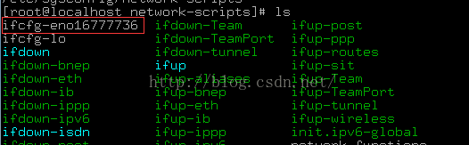
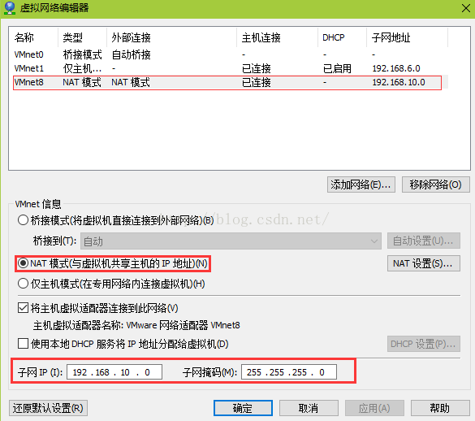
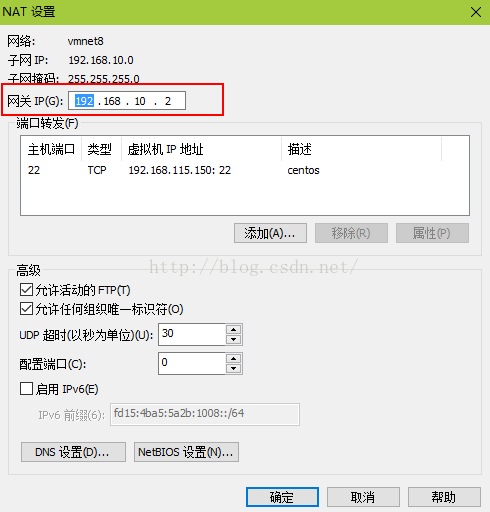

##解决CentOS7虚拟机无法上网并设置CentOS7虚拟机使用静态IP

最终的效果是无论是ping内网IP还是ping外网IP，都能正常ping通。方法四步走：

第一步，我们进入/etc/sysconfig/network-scripts目录，查看该目录有没有形如ifcfg-XXX的文件：

如果你看不到以ifcfg-打头的文件（ifcfg-lo除外），说明网卡设备没有被正确识别，可能是你下载的centos镜像版本和你安装centos时选择的centos版本不一致，比如，centos镜像是64位的，却按照32位来安装。这个。。重装吧，至少我没找到好的办法尴尬

下面进行第二步：

在VMware里，依次点击”编辑“ - ”虚拟网络编辑器“，如下图，我选择的是NAT模式：

为了能够使用静态IP，这里不要勾选”使用本地DHCP服务将IP分配给虚拟机“这个选项。然后是配置子网ip，子网IP与宿主机的ip一定不能处在同一地址范围里，否则就算虚拟机能上网，网络既慢，还不稳定。我主机的ip段是192.168.115.xxx，所以我配了192.168.10.xxx来避开主机的ip段，反正ip的第三个数字在0到254并且不是115就行。Nat模式相当于配置了一个子路由器，有设置过多级路由的朋友对此应该有所体会。各位结合自己机器的IP来合理配置一个子网ip吧。

在这个界面接着点"NAT设置"，查看虚拟机的网关，这个网关在第三步要用。我这里的网关是192.168.10.2。

第三步：

以root权限编辑/etc/sysconfig/network-scripts/ifcfg-eno16777736这个文件，效果如下：

TYPE=Ethernet
BOOTPROTO=static  #设置静态Ip
DEFROUTE=yes
IPV4_FAILURE_FATAL=no
IPV6INIT=yes
IPV6_AUTOCONF=yes
IPV6_DEFROUTE=yes
IPV6_FAILURE_FATAL=no
NAME=eno16777736
UUID=4f40dedc-031b-4b72-ad4d-ef4721947439
DEVICE=eno16777736
ONBOOT=yes  #这里如果为no的话就改为yes，表示网卡设备自动启动
PEERDNS=yes
PEERROUTES=yes
IPV6_PEERDNS=yes
IPV6_PEERROUTES=yes
IPV6_PRIVACY=no

GATEWAY=192.168.10.2  #这里的网关地址就是第二步获取到的那个网关地址
IPADDR=192.168.10.150  #配置ip，在第二步已经设置ip处于192.168.10.xxx这个范围，我就随便设为150了，只要不和网关相同均可
NETMASK=255.255.255.0#子网掩码
DNS1=202.96.128.86#dns服务器1，填写你所在的网络可用的dns服务器地址即可
DNS2=223.5.5.5#dns服器2

关键的参数我都用彩色底纹标记出来了，其他的保持默认就好，确认无误后保存退出。

第四步：重启网卡服务，执行service network restart，然后总算能上网了
