# GO WEB 编程

## 1. Go 环境配置

### Windows 安装

访问[Google Code 下载页](http://golang.org/dl/)，32 位请选择名称中包含 windows-386 的 msi 安装包，64 位请选择名称中包含 windows-amd64 的。下载好后运行，不要修改默认安装目录 C:\Go\，若安装到其他位置会导致不能执行自己所编写的 Go 代码。安装完成后默认会在环境变量 Path 后添加 Go 安装目录下的 bin 目录 `C:\Go\bin\`，并添加环境变量 GOROOT，值为 Go 安装根目录 `C:\Go\` 。

**验证是否安装成功**

在运行中输入 `cmd` 打开命令行工具，在提示符下输入 `go`，检查是否能看到 Usage 信息。输入 `cd %GOROOT%`，看是否能进入 Go 安装目录。若都成功，说明安装成功。

不能的话请检查上述环境变量 Path 和 GOROOT 的值。若不存在请卸载后重新安装，存在请重启计算机后重试以上步骤。

### GOPATH与工作空间

前面我们在安装Go的时候看到需要设置GOPATH变量，Go从1.1版本开始必须设置这个变量，而且不能和Go的安装目录一样，这个目录用来存放Go源码，Go的可运行文件，以及相应的编译之后的包文件。所以这个目录下面有三个子目录：src、bin、pkg

#### GOPATH设置

go 命令依赖一个重要的环境变量：$GOPATH

Windows系统中环境变量的形式为`%GOPATH%`，本书主要使用Unix形式，Windows用户请自行替换。

在类似 Unix 环境大概这样设置：

```
export GOPATH=/home/apple/mygo
```

为了方便，应该新建以上文件夹，并且上一行加入到 `.bashrc` 或者 `.zshrc` 或者自己的 `sh` 的配置文件中。

Windows 设置如下，新建一个环境变量名称叫做GOPATH：

```
    GOPATH=c:\mygo
```

GOPATH允许多个目录，当有多个目录时，请注意分隔符，多个目录的时候Windows是分号，Linux系统是冒号，当有多个GOPATH时，默认会将go get的内容放在第一个目录下。

以上 $GOPATH 目录约定有三个子目录：

- src 存放源代码（比如：.go .c .h .s等）
- pkg 编译后生成的文件（比如：.a）
- bin 编译后生成的可执行文件（为了方便，可以把此目录加入到 $PATH 变量中，如果有多个gopath，那么使用`${GOPATH//://bin:}/bin`添加所有的bin目录）

以后我所有的例子都是以mygo作为我的gopath目录

#### 代码目录结构规划

GOPATH下的src目录就是接下来开发程序的主要目录，所有的源码都是放在这个目录下面，那么一般我们的做法就是一个目录一个项目，例如: $GOPATH/src/mymath 表示mymath这个应用包或者可执行应用，这个根据package是main还是其他来决定，main的话就是可执行应用，其他的话就是应用包，这个会在后续详细介绍package。

所以当新建应用或者一个代码包时都是在src目录下新建一个文件夹，文件夹名称一般是代码包名称，当然也允许多级目录，例如在src下面新建了目录$GOPATH/src/github.com/astaxie/beedb 那么这个包路径就是"github.com/astaxie/beedb"，包名称是最后一个目录beedb

下面我就以mymath为例来讲述如何编写应用包，执行如下代码

```
cd $GOPATH/src
mkdir mymath
```

新建文件sqrt.go，内容如下

```
// $GOPATH/src/mymath/sqrt.go源码如下：
package mymath

func Sqrt(x float64) float64 {
    z := 0.0
    for i := 0; i < 1000; i++ {
        z -= (z*z - x) / (2 * x)
    }
    return z
}
```

这样我的应用包目录和代码已经新建完毕，注意：一般建议package的名称和目录名保持一致

#### 编译应用

上面我们已经建立了自己的应用包，如何进行编译安装呢？有两种方式可以进行安装

1、只要进入对应的应用包目录，然后执行`go install`，就可以安装了

2、在任意的目录执行如下代码`go install mymath`

安装完之后，我们可以进入如下目录

```
cd $GOPATH/pkg/${GOOS}_${GOARCH}
//可以看到如下文件
mymath.a
```

这个.a文件是应用包，那么我们如何进行调用呢？

接下来我们新建一个应用程序来调用这个应用包

新建应用包mathapp

```
cd $GOPATH/src
mkdir mathapp
cd mathapp
vim main.go
```

`$GOPATH/src/mathapp/main.go`源码：

```
package main

import (
      "mymath"
      "fmt"
)

func main() {
      fmt.Printf("Hello, world.  Sqrt(2) = %v\n", mymath.Sqrt(2))
}
```

可以看到这个的package是`main`，import里面调用的包是`mymath`,这个就是相对于`$GOPATH/src`的路径，如果是多级目录，就在import里面引入多级目录，如果你有多个GOPATH，也是一样，Go会自动在多个`$GOPATH/src`中寻找。

如何编译程序呢？进入该应用目录，然后执行`go build`，那么在该目录下面会生成一个mathapp的可执行文件

```
./mathapp
```

输出如下内容

```
Hello, world.  Sqrt(2) = 1.414213562373095
```

如何安装该应用，进入该目录执行`go install`,那么在$GOPATH/bin/下增加了一个可执行文件mathapp, 还记得前面我们把`$GOPATH/bin`加到我们的PATH里面了，这样可以在命令行输入如下命令就可以执行

```
mathapp
```

也是输出如下内容 39+44

```
Hello, world.  Sqrt(2) = 1.414213562373095
```

#### 获取远程包

go语言有一个获取远程包的工具就是`go get`，目前go get支持多数开源社区(例如：github、googlecode、bitbucket、Launchpad)

```
go get github.com/astaxie/beedb
```

> go get -u 参数可以自动更新包，而且当go get的时候会自动获取该包依赖的其他第三方包

通过这个命令可以获取相应的源码，对应的开源平台采用不同的源码控制工具，例如github采用git、googlecode采用hg，所以要想获取这些源码，必须先安装相应的源码控制工具

通过上面获取的代码在我们本地的源码相应的代码结构如下

```
$GOPATH
  src
   |--github.com
          |-astaxie
              |-beedb
   pkg
    |--相应平台
         |-github.com
               |--astaxie
                    |beedb.a
```

go get本质上可以理解为首先第一步是通过源码工具clone代码到src下面，然后执行`go install`

在代码中如何使用远程包，很简单的就是和使用本地包一样，只要在开头import相应的路径就可以

```
import "github.com/astaxie/beedb"
```

#### 程序的整体结构

通过上面建立的我本地的mygo的目录结构如下所示

```
bin/
    mathapp
pkg/
    平台名/ 如：darwin_amd64、linux_amd64
         mymath.a
         github.com/
              astaxie/
                   beedb.a
src/
    mathapp
          main.go
    mymath/
          sqrt.go
    github.com/
          astaxie/
             beedb/
                beedb.go
                util.go
```

从上面的结构我们可以很清晰的看到，bin目录下面存的是编译之后可执行的文件，pkg下面存放的是应用包，src下面保存的是应用源代码

## 2. Go 命令

### Go 命令

Go语言自带有一套完整的命令操作工具，你可以通过在命令行中执行`go`来查看它们：


### go build

这个命令主要用于编译代码。在包的编译过程中，若有必要，会同时编译与之相关联的包。

- 如果是普通包，就像上面编写的`mymath`包那样，当你执行`go build`之后，它不会产生任何文件。如果你需要在`$GOPATH/pkg`下生成相应的文件，那就得执行`go install`。

- 如果是`main`包，当你执行`go build`之后，它就会在当前目录下生成一个可执行文件。如果你需要在`$GOPATH/bin`下生成相应的文件，需要执行`go install`，或者使用`go build -o 路径/a.exe`。

- 如果某个项目文件夹下有多个文件，而你只想编译某个文件，就可在`go build`之后加上文件名，例如`go build a.go`；`go build`命令默认会编译当前目录下的所有go文件。

- 你也可以指定编译输出的文件名。我们可以指定`go build -o astaxie.exe`，默认情况是你的package名(非main包)，或者是第一个源文件的文件名(main包)。

  （注：实际上，package名在[Go语言规范](https://golang.org/ref/spec)中指代码中“package”后使用的名称，此名称可以与文件夹名不同。默认生成的可执行文件名是文件夹名。）

- go build会忽略目录下以“_”或“.”开头的go文件。

- 如果你的源代码针对不同的操作系统需要不同的处理，那么你可以根据不同的操作系统后缀来命名文件。例如有一个读取数组的程序，它对于不同的操作系统可能有如下几个源文件：

  array_linux.go array_darwin.go array_windows.go array_freebsd.go

  `go build`的时候会选择性地编译以系统名结尾的文件（Linux、Darwin、Windows、Freebsd）。例如Linux系统下面编译只会选择array_linux.go文件，其它系统命名后缀文件全部忽略。

参数的介绍

- `-o` 指定输出的文件名，可以带上路径，例如 `go build -o a/b/c`
- `-i` 安装相应的包，编译+`go install`
- `-a` 更新全部已经是最新的包的，但是对标准包不适用
- `-n` 把需要执行的编译命令打印出来，但是不执行，这样就可以很容易的知道底层是如何运行的
- `-p n` 指定可以并行可运行的编译数目，默认是CPU数目
- `-race` 开启编译的时候自动检测数据竞争的情况，目前只支持64位的机器
- `-v` 打印出来我们正在编译的包名
- `-work` 打印出来编译时候的临时文件夹名称，并且如果已经存在的话就不要删除
- `-x` 打印出来执行的命令，其实就是和`-n`的结果类似，只是这个会执行
- `-ccflags 'arg list'` 传递参数给5c, 6c, 8c 调用
- `-compiler name` 指定相应的编译器，gccgo还是gc
- `-gccgoflags 'arg list'` 传递参数给gccgo编译连接调用
- `-gcflags 'arg list'` 传递参数给5g, 6g, 8g 调用
- `-installsuffix suffix` 为了和默认的安装包区别开来，采用这个前缀来重新安装那些依赖的包，`-race`的时候默认已经是`-installsuffix race`,大家可以通过`-n`命令来验证
- `-ldflags 'flag list'` 传递参数给5l, 6l, 8l 调用
- `-tags 'tag list'` 设置在编译的时候可以适配的那些tag，详细的tag限制参考里面的 [Build Constraints](http://golang.org/pkg/go/build/)

### go clean

这个命令是用来移除当前源码包和关联源码包里面编译生成的文件。这些文件包括

```
_obj/            旧的object目录，由Makefiles遗留
_test/           旧的test目录，由Makefiles遗留
_testmain.go     旧的gotest文件，由Makefiles遗留
test.out         旧的test记录，由Makefiles遗留
build.out        旧的test记录，由Makefiles遗留
*.[568ao]        object文件，由Makefiles遗留

DIR(.exe)        由go build产生
DIR.test(.exe)   由go test -c产生
MAINFILE(.exe)   由go build MAINFILE.go产生
*.so             由 SWIG 产生
```

我一般都是利用这个命令清除编译文件，然后github递交源码，在本机测试的时候这些编译文件都是和系统相关的，但是对于源码管理来说没必要。

```
$ go clean -i -n
cd /Users/astaxie/develop/gopath/src/mathapp
rm -f mathapp mathapp.exe mathapp.test mathapp.test.exe app app.exe
rm -f /Users/astaxie/develop/gopath/bin/mathapp
```

参数介绍

- `-i` 清除关联的安装的包和可运行文件，也就是通过go install安装的文件
- `-n` 把需要执行的清除命令打印出来，但是不执行，这样就可以很容易的知道底层是如何运行的
- `-r` 循环的清除在import中引入的包
- `-x` 打印出来执行的详细命令，其实就是`-n`打印的执行版本

### go fmt

在go中，代码则有标准的风格。由于之前已经有的一些习惯或其它的原因我们常将代码写成ANSI风格或者其它更合适自己的格式，这将为人们在阅读别人的代码时添加不必要的负担，所以go强制了代码格式（比如左大括号必须放在行尾），不按照此格式的代码将不能编译通过，为了减少浪费在排版上的时间，go工具集中提供了一个`go fmt`命令 它可以帮你格式化你写好的代码文件，使你写代码的时候不需要关心格式，你只需要在写完之后执行`go fmt <文件名>.go`，你的代码就被修改成了标准格式，但是我平常很少用到这个命令，因为开发工具里面一般都带了保存时候自动格式化功能，这个功能其实在底层就是调用了`go fmt`。

使用go fmt命令，其实是调用了gofmt，而且需要参数-w，否则格式化结果不会写入文件。gofmt -w -l src，可以格式化整个项目。

所以go fmt是gofmt的上层一个包装的命令，我们想要更多的个性化的格式化可以参考 [gofmt](http://golang.org/cmd/gofmt/)

gofmt的参数介绍

- `-l` 显示那些需要格式化的文件
- `-w` 把改写后的内容直接写入到文件中，而不是作为结果打印到标准输出。
- `-r` 添加形如“a[b:len(a)] -> a[b:]”的重写规则，方便我们做批量替换
- `-s` 简化文件中的代码
- `-d` 显示格式化前后的diff而不是写入文件，默认是false
- `-e` 打印所有的语法错误到标准输出。如果不使用此标记，则只会打印不同行的前10个错误。
- `-cpuprofile` 支持调试模式，写入相应的cpufile到指定的文件

### go get

这个命令是用来动态获取远程代码包的，目前支持的有BitBucket、GitHub、Google Code和Launchpad。这个命令在内部实际上分成了两步操作：第一步是下载源码包，第二步是执行`go install`。下载源码包的go工具会自动根据不同的域名调用不同的源码工具，对应关系如下：

```
BitBucket (Mercurial Git)
GitHub (Git)
Google Code Project Hosting (Git, Mercurial, Subversion)
Launchpad (Bazaar)
```

所以为了`go get` 能正常工作，你必须确保安装了合适的源码管理工具，并同时把这些命令加入你的PATH中。其实`go get`支持自定义域名的功能，具体参见`go help remote`。

参数介绍：

- `-d` 只下载不安装
- `-f` 只有在你包含了`-u`参数的时候才有效，不让`-u`去验证import中的每一个都已经获取了，这对于本地fork的包特别有用
- `-fix` 在获取源码之后先运行fix，然后再去做其他的事情
- `-t` 同时也下载需要为运行测试所需要的包
- `-u` 强制使用网络去更新包和它的依赖包
- `-v` 显示执行的命令

### go install

这个命令在内部实际上分成了两步操作：第一步是生成结果文件(可执行文件或者.a包)，第二步会把编译好的结果移到`$GOPATH/pkg`或者`$GOPATH/bin`。

参数支持`go build`的编译参数。大家只要记住一个参数`-v`就好了，这个随时随地的可以查看底层的执行信息。

### go test

执行这个命令，会自动读取源码目录下面名为`*_test.go`的文件，生成并运行测试用的可执行文件。输出的信息类似

```
ok   archive/tar   0.011s
FAIL archive/zip   0.022s
ok   compress/gzip 0.033s
...
```

默认的情况下，不需要任何的参数，它会自动把你源码包下面所有test文件测试完毕，当然你也可以带上参数，详情请参考`go help testflag`

这里我介绍几个我们常用的参数：

- `-bench regexp` 执行相应的benchmarks，例如 `-bench=.`
- `-cover` 开启测试覆盖率
- `-run regexp` 只运行regexp匹配的函数，例如 `-run=Array` 那么就执行包含有Array开头的函数
- `-v` 显示测试的详细命令

### go tool

`go tool`下面聚集了很多命令，这里我们只介绍两个，fix和vet

- `go tool fix .` 用来修复以前老版本的代码到新版本，例如go1之前老版本的代码转化到go1,例如API的变化
- `go tool vet directory|files` 用来分析当前目录的代码是否都是正确的代码,例如是不是调用fmt.Printf里面的参数不正确，例如函数里面提前return了然后出现了无用代码之类的。

### go generate

这个命令是从Go1.4开始才设计的，用于在编译前自动化生成某类代码。`go generate`和`go build`是完全不一样的命令，通过分析源码中特殊的注释，然后执行相应的命令。这些命令都是很明确的，没有任何的依赖在里面。而且大家在用这个之前心里面一定要有一个理念，这个`go generate`是给你用的，不是给使用你这个包的人用的，是方便你来生成一些代码的。

这里我们来举一个简单的例子，例如我们经常会使用`yacc`来生成代码，那么我们常用这样的命令：

```
go tool yacc -o gopher.go -p parser gopher.y
```

-o 指定了输出的文件名， -p指定了package的名称，这是一个单独的命令，如果我们想让`go generate`来触发这个命令，那么就可以在当前目录的任意一个`xxx.go`文件里面的任意位置增加一行如下的注释：

```
//go:generate go tool yacc -o gopher.go -p parser gopher.y
```

这里我们注意了，`//go:generate`是没有任何空格的，这其实就是一个固定的格式，在扫描源码文件的时候就是根据这个来判断的。

所以我们可以通过如下的命令来生成，编译，测试。如果`gopher.y`文件有修改，那么就重新执行`go generate`重新生成文件就好。

```
$ go generate
$ go build
$ go test
```

### godoc

在Go1.2版本之前还支持`go doc`命令，但是之后全部已到了godoc这个命令下，需要这样安装`go get golang.org/x/tools/cmd/godoc`，1.10之后的版本不许安装可直接使用

很多人说go不需要任何的第三方文档，例如chm手册之类的（其实我已经做了一个了，[chm手册](https://github.com/astaxie/godoc)），因为它内部就有一个很强大的文档工具。

如何查看相应package的文档呢？ 例如builtin包，那么执行`godoc builtin` 如果是http包，那么执行`godoc net/http` 查看某一个包里面的函数，那么执行`godoc fmt Printf` 也可以查看相应的代码，执行`godoc -src fmt Printf`

通过命令在命令行执行 `godoc -http=:端口号` 比如`godoc -http=:8080`。然后在浏览器中打开`127.0.0.1:8080`，你将会看到一个golang.org的本地copy版本，通过它你可以查询pkg文档等其它内容。如果你设置了GOPATH，在pkg分类下，不但会列出标准包的文档，还会列出你本地`GOPATH`中所有项目的相关文档，这对于经常被墙的用户来说是一个不错的选择。

### 其它命令

go还提供了其它很多的工具，例如下面的这些工具

```
go version 查看go当前的版本
go env 查看当前go的环境变量
go list 列出当前全部安装的package
go run 编译并运行Go程序
```

以上这些工具还有很多参数没有一一介绍，可以使用`go help 命令`获取更详细的帮助信息。

## 3 Go语言基础

Go是一门类似C的编译型语言，但是它的编译速度非常快。这门语言的关键字总共也就二十五个，如下所示：

```go
break    default      func    interface    select
case     defer        go      map          struct
chan     else         goto    package      switch
const    fallthrough  if      range        type
continue for          import  return       var
```

### 3.1 你好，Go

在本节中，我们要学习用最基本的语法让Go程序运行起来。

#### 程序

让我们从`hello world`程序开始

```go
package main

import "fmt"

func main() {
    fmt.Printf("Hello, world or 你好，世界 or καλημ ́ρα κóσμ or こんにちはせかい\n")
}
```

输出如下：

```
Hello, world or 你好，世界 or καλημ ́ρα κóσμ or こんにちはせかい
```

#### 详解

首先我们要了解一个概念，**Go程序是通过`package`来组织代码的**

`package <pkgName>`（在我们的例子中是`package main`）这一行告诉我们当前文件**属于哪个包**，而包名`main`则告诉我们它是一个**可独立运行的包**，它在编译后会产生可执行文件。除了`main`包之外，其它的包最后都会生成`*.a`文件（也就是包文件）并放置在`$GOPATH/pkg/$GOOS_$GOARCH`中

> 每一个可独立运行的Go程序，必定包含一个`package main`，在这个`main`包中必定包含一个入口函数`main`，而这个函数既没有参数，也没有返回值。

为了打印`Hello, world...`，我们调用了一个函数`Printf`，这个函数来自于`fmt`包，所以我们在第三行中导入了系统级别的`fmt`包：`import "fmt"`。

包的概念和Python中的package类似，使用包的好处：模块化（能够把你的程序分成多个模块)和可重用性（每个模块都能被其它应用程序反复使用）。

在第五行中，我们通过关键字`func`定义了一个`main`函数，函数体被放在`{}`（大括号）中

第六行，我们调用了`fmt`包里面定义的函数`Printf`。这个函数是通过`<pkgName>.<funcName>`的方式调用的

> 前面提到过，包名和包所在的文件夹名可以是不同的，此处的`<pkgName>`即为通过`package <pkgName>`声明的包名，而非文件夹名。

Go是天生支持UTF-8的，任何字符都可以直接输出

#### 结论

Go使用`package`（和Python的模块类似）来组织代码。`main.main()`函数(这个函数位于主包）是每一个独立的可运行程序的入口点。Go使用UTF-8字符串和标识符(因为UTF-8的发明者也就是Go的发明者)，所以它天生支持多语言。

### 3.2 Go基础

这小节我们将要介绍如何定义变量、常量、Go内置类型以及Go程序设计中的一些技巧。

#### 定义变量

Go语言里面定义变量有多种方式

使用`var`关键字是Go最基本的定义变量方式，与C语言不同的是Go把变量类型放在变量名后面：

```go
//定义一个名称为“variableName”，类型为"type"的变量
var variableName type
```

定义多个变量

```go
//定义三个类型都是“type”的变量
var vname1, vname2, vname3 type
```

定义变量并初始化值

```go
//初始化“variableName”的变量为“value”值，类型是“type”
var variableName type = value
```

同时初始化多个变量

```go
/*
    定义三个类型都是"type"的变量,并且分别初始化为相应的值
    vname1为v1，vname2为v2，vname3为v3
*/
var vname1, vname2, vname3 type= v1, v2, v3
```

我们可以直接忽略类型声明，那么上面的代码变成这样了：

```go
/*
    定义三个变量，它们分别初始化为相应的值
    vname1为v1，vname2为v2，vname3为v3
    然后Go会根据其相应值的类型来推断变量的类型
*/
var vname1, vname2, vname3 = v1, v2, v3
```

你觉得上面的还是有些繁琐？好吧，我也觉得。让我们继续简化：

```go
/*
    定义三个变量，它们分别初始化为相应的值
    vname1为v1，vname2为v2，vname3为v3
    编译器会根据初始化的值自动推导出相应的类型
*/
vname1, vname2, vname3 := v1, v2, v3
```

`:=`这个符号直接取代了`var`和`type`，这种形式叫做`简短声明`，`:=`**只能用在函数内部**；在函数外部使用则会无法编译通过，所以一般用**`var`方式定义全局变量**

**`_`（下划线）是个特殊的变量名，任何赋予它的值都会被丢弃**。

下面我们将值`35`赋予`b`，并同时丢弃`34`：

```go
_, b := 34, 35
```

Go对于**已声明但未使用的变量**会在编译阶段**报错**

#### 常量

在Go程序中，**常量使用关键字`const`定义**，可定义为数值、布尔值或字符串等类型。语法如下：

```go
const constantName = value
//如果需要，也可以明确指定常量的类型：
const Pi float32 = 3.1415926
```

Go 常量和一般程序语言不同的是，可以指定相当多的小数位数(例如200位)， 若指定給float32自动缩短为32bit，指定给float64自动缩短为64bit，详情参考[链接](http://golang.org/ref/spec#Constants)

#### 内置基础类型

##### Boolean

在Go中，布尔值的类型为`bool`，值是`true`或`false`，默认为`false`。

```go
//示例代码
var isActive bool  // 全局变量声明
var enabled, disabled = true, false  // 忽略类型的声明
func test() {
    var available bool  // 一般声明
    valid := false      // 简短声明
    available = true    // 赋值操作
}
```

##### 数值类型

**整数类型有无符号和带符号两种。**Go同时支持`int`和`uint`，这两种类型的长度相同，但具体长度取决于不同编译器的实现。Go里面也有直接定义好位数的类型：`rune`, `int8`, `int16`, `int32`, `int64`和`byte`, `uint8`, `uint16`, `uint32`, `uint64`。其中`rune`是`int32`的别称，`byte`是`uint8`的别称。

> 需要注意的一点是，这些类型的变量之间不允许互相赋值或操作，不然会在编译时引起编译器报错。
>
> 如下的代码会产生错误：invalid operation: a + b (mismatched types int8 and int32)
>
> > var a int8
> >
> > var b int32
> >
> > c:=a + b
>
> 另外，尽管int的长度是32 bit, 但int 与 int32并不可以互用。

**浮点数**的类型有`float32`和`float64`两种（没有`float`类型），默认是`float64`。

**复数**默认类型是`complex128`（64位实数+64位虚数）。如果需要小一些的，也有`complex64`(32位实数+32位虚数)。复数的形式为`RE + IMi`，其中`RE`是实数部分，`IM`是虚数部分，而最后的`i`是虚数单位。下面是一个使用复数的例子：

```go
var c complex64 = 5+5i
fmt.Printf("Value is: %v", c)
```

##### 字符串

Go中的字符串都是采用`UTF-8`字符集编码。字符串是用一对双引号（`""`）或反引号（`` ` ）括起来定义，它的类型是`string`。

```go
var frenchHello string  // 声明变量为字符串的一般方法
var emptyString string = ""  // 声明了一个字符串变量，初始化为空字符串
func test() {
    no, yes, maybe := "no", "yes", "maybe"  // 简短声明，同时声明多个变量
    japaneseHello := "Konichiwa"  // 同上
    frenchHello = "Bonjour"  // 常规赋值
}
```

在Go中**字符串是不可变的**，例如下面的代码编译时会报错：cannot assign to s[0]

```go
var s string = "hello"
s[0] = 'c'
```

但如果真的想要修改怎么办呢？下面的代码可以实现：

```go
s := "hello"
c := []byte(s)  // 将字符串 s 转换为 []byte 类型
c[0] = 'c'
s2 := string(c)  // 再转换回 string 类型
fmt.Printf("%s\n", s2)
```

Go中可以使用`+`操作符来连接两个字符串：

```go
s := "hello,"
m := " world"
a := s + m
fmt.Printf("%s\n", a)
```

修改字符串也可写为：

```go
s := "hello"
s = "c" + s[1:] // 字符串虽不能更改，但可进行切片操作
fmt.Printf("%s\n", s)
```

如果要声明一个多行的字符串怎么办？可以通过`` `来声明：

```go
m := `hello
    world`
```

`` ` 括起的字符串为Raw字符串，即字符串在代码中的形式就是打印时的形式，它没有字符转义，换行也将原样输出。

##### 错误类型

Go内置有一个`error`类型，专门用来处理错误信息，Go的`package`里面还专门有一个包`errors`来处理错误：

```go
err := errors.New("emit macho dwarf: elf header corrupted")
if err != nil {
    fmt.Print(err)
}
```

##### Go数据底层的存储

下面这张图来源于[Russ Cox Blog](http://research.swtch.com/)中一篇介绍[Go数据结构](http://research.swtch.com/godata)的文章，大家可以看到这些基础类型底层都是分配了一块内存，然后存储了相应的值。


#### 一些技巧

##### 分组声明

在Go语言中，同时声明多个常量、变量，或者导入多个包时，可采用分组的方式进行声明。

例如下面的代码：

```go
import "fmt"
import "os"

const i = 100
const pi = 3.1415
const prefix = "Go_"

var i int
var pi float32
var prefix string
```

可以分组写成如下形式：

```go
import(
    "fmt"
    "os"
)

const(
    i = 100
    pi = 3.1415
    prefix = "Go_"
)

var(
    i int
    pi float32
    prefix string
)
```

##### iota枚举

Go里面有一个关键字`iota`，这个关键字用来声明`enum`的时候采用，它默认开始值是0，`const`中每增加一行加1：

```go
const(
    x = iota  // x == 0
    y = iota  // y == 1
    z = iota  // z == 2
    w  // 常量声明省略值时，默认和之前一个值的字面相同。这里隐式地说w = iota，因此w == 3。其实上面y和z可同样不用"= iota"
)

const v = iota // 每遇到一个const关键字，iota就会重置，此时v == 0

const ( 
  e, f, g = iota, iota, iota //e=0,f=0,g=0 iota在同一行值相同
)

const （
    a = iota    a=0
    b = "B"
    c = iota    //c=2
    d,e,f = iota,iota,iota //d=3,e=3,f=3
    g //g = 4
）
```

> 除非被显式设置为其它值或`iota`，每个`const`分组的第一个常量被默认设置为它的0值，第二及后续的常量被默认设置为它前面那个常量的值，如果前面那个常量的值是`iota`，则它也被设置为`iota`。

##### Go程序设计的一些规则

Go之所以会那么简洁，是因为它有一些默认的行为：

- 大写字母开头的变量是其它包可以访问的，是公用变量；小写字母开头的就是不可导出的，是私有变量。
- 大写字母开头的函数也是一样，相当于`class`中的带`public`关键词的公有函数；小写字母开头的就是有`private`关键词的私有函数。

#### array、slice、map

##### array

`array`就是数组，它的定义方式如下：

```go
var arr [n]type
```

在`[n]type`中，`n`表示数组的长度，`type`表示存储元素的类型。对数组的操作和其它语言类似，都是通过`[]`来进行读取或赋值：

```go
var arr [10]int  // 声明了一个int类型的数组
arr[0] = 42      // 数组下标是从0开始的
arr[1] = 13      // 赋值操作
fmt.Printf("The first element is %d\n", arr[0])  // 获取数据，返回42
fmt.Printf("The last element is %d\n", arr[9]) //返回未赋值的最后一个元素，默认返回0
```

由于长度也是数组类型的一部分，因此`[3]int`与`[4]int`是不同的类型，数组也就不能改变长度。数组之间的赋值是值的赋值，即当把一个数组作为参数传入函数的时候，传入的其实是该数组的副本，而不是它的指针

数组可以使用`:=`来声明

```go
a := [3]int{1, 2, 3} // 声明了一个长度为3的int数组
b := [10]int{1, 2, 3} // 声明了一个长度为10的int数组，其中前三个元素初始化为1、2、3，其它默认为0
c := [...]int{4, 5, 6} // 可以省略长度而采用`...`的方式，Go会自动根据元素个数来计算长度
```

Go支持嵌套数组，即多维数组。比如下面的代码就声明了一个二维数组：

```go
// 声明了一个二维数组，该数组以两个数组作为元素，其中每个数组中又有4个int类型的元素
doubleArray := [2][4]int{[4]int{1, 2, 3, 4}, [4]int{5, 6, 7, 8}}

// 上面的声明可以简化，直接忽略内部的类型
easyArray := [2][4]int{{1, 2, 3, 4}, {5, 6, 7, 8}}
```

数组的分配如下所示：


##### slice

**`slice`是GO语言中的动态数组**

`slice`并不是真正意义上的动态数组，而是一个引用类型。`slice`总是指向一个底层`array`，`slice`的声明也可以像`array`一样，只是不需要长度。

```go
// 和声明array一样，只是少了长度
var fslice []int
```

接下来我们可以声明一个`slice`，并初始化数据，如下所示：

```go
slice := []byte {'a', 'b', 'c', 'd'}
```

`slice`可以从一个数组或一个已经存在的`slice`中再次声明。**`slice`通过`array[i:j]`来获取**，其中`i`是数组的开始位置，`j`是结束位置，但不包含`array[j]`，它的长度是`j-i`

```go
// 声明一个含有10个元素,元素类型为byte的数组
var ar = [10]byte {'a', 'b', 'c', 'd', 'e', 'f', 'g', 'h', 'i', 'j'}

// 声明两个含有byte的slice
var a, b []byte

// a指向数组的第3个元素开始，并到第五个元素结束，
a = ar[2:5]
//现在a含有的元素: ar[2]、ar[3]和ar[4]

// b是数组ar的另一个slice
b = ar[3:5]
// b的元素是：ar[3]和ar[4]
```

> 注意`slice`和数组在声明时的区别：声明数组时，方括号内写明了数组的长度或使用`...`自动计算长度，而声明`slice`时，方括号内没有任何字符。

它们的数据结构如下所示


slice有一些简便的操作

- `slice`的默认开始位置是0，`ar[:n]`等价于`ar[0:n]`
- `slice`的第二个序列默认是数组的长度，`ar[n:]`等价于`ar[n:len(ar)]`
- 如果从一个数组里面直接获取`slice`，可以这样`ar[:]`，因为默认第一个序列是0，第二个是数组的长度，即等价于`ar[0:len(ar)]`

**`slice`是引用类型，所以当引用改变其中元素的值时，其它的所有引用都会改变该值**

对于`slice`有几个有用的内置函数：

- `len` 获取`slice`的长度
- `cap` 获取`slice`的最大容量
- `append` 向`slice`里面追加一个或者多个元素，然后返回一个和`slice`一样类型的`slice`
- `copy` 函数`copy`从源`slice`的`src`中复制元素到目标`dst`，并且返回复制的元素的个数

注：`append`函数会改变`slice`所引用的数组的内容，从而影响到引用同一数组的其它`slice`。 但当`slice`中没有剩余空间（即`(cap-len) == 0`）时，此时将动态分配新的数组空间。返回的`slice`数组指针将指向这个空间，而原数组的内容将保持不变；其它引用此数组的`slice`则不受影响。

从Go1.2开始支持三个参数的slice，之前我们一直采用这种方式在slice或者array基础上来获取一个slice

```go
var array [10]int
slice := array[2:4]
```

新版本里面可以指定这个容量

```go
slice = array[2:4:7]
```

上面这个的容量就是`7-2`，即5。这样这个产生的新的slice就没办法访问最后的三个元素。

如果slice是这样的形式`array[:i:j]`，即第一个参数为空，默认值就是0。

##### map

`map`也就是Python中字典的概念，它的格式为`map[keyType]valueType`

我们看下面的代码，`map`的读取和设置也类似`slice`一样，通过`key`来操作，只是`slice`的`index`只能是`int`类型，而`map`多了很多类型，可以是`int`，可以是`string`及所有完全定义了`==`与`!=`操作的类型。

```go
// 声明一个key是字符串，值为int的字典,这种方式的声明需要在使用之前使用make初始化
var numbers map[string]int
// 另一种map的声明方式
numbers := make(map[string]int)
numbers["one"] = 1  //赋值
numbers["ten"] = 10 //赋值
numbers["three"] = 3

fmt.Println("第三个数字是: ", numbers["three"]) // 读取数据
// 打印出来如:第三个数字是: 3
```

使用map过程中需要注意的几点：

- **`map`是无序的**，每次打印出来的`map`顺序都会不一样，它不能通过`index`获取，而必须通过`key`获取
- **`map`的长度是不固定的**，也就是和`slice`一样，也是一种引用类型
- **内置的`len`函数同样适用于`map`**，返回`map`拥有的`key`的数量
- **`map`不是线程安全的**，在多个goroutine存取时，必须使用mutex lock机制

`map`的初始化可以通过**`key:val`**的方式初始化值，同时`map`内置有判断是否存在`key`的方式

**通过`delete`删除`map`的元素**

```go
// 初始化一个字典
rating := map[string]float32{"C":5, "Go":4.5, "Python":4.5, "C++":2 }
// map有两个返回值，第二个返回值：如果不存在key，那么ok为false，如果存在ok为true
csharpRating, ok := rating["C#"]
if ok {
    fmt.Println("C# is in the map and its rating is ", csharpRating)
} else {
    fmt.Println("We have no rating associated with C# in the map")
}

delete(rating, "C")  // 删除key为C的元素
```

`map`是一种引用类型，如果两个`map`同时指向一个底层，那么一个改变，另一个也相应的改变

##### make、new操作

**`make`用于内建类型（`map`、`slice` 和`channel`）的内存分配。`new`用于各种类型的内存分配**

`new(T)`分配了零值填充的`T`类型的内存空间，并且返回其地址，即一个`*T`类型的值，即返回了一个指针，指向新分配的类型`T`的零值。有一点非常重要：**`new`返回指针**

内建函数`make(T, args)`与`new(T)`有着不同的功能，make只能创建`slice`、`map`和`channel`，并且返回一个有初始值(非零)的`T`类型，而不是`*T`。本质来讲，导致这三个类型有所不同的原因是指向数据结构的引用在使用前必须被初始化。例如，一个`slice`，是一个包含指向数据（内部`array`）的指针、长度和容量的三项描述符；在这些项目被初始化之前，`slice`为`nil`。对于`slice`、`map`和`channel`来说，`make`初始化了内部的数据结构，填充适当的值。**`make`返回初始化后的（非零）值**

#### 零值

关于“零值”，所指并非是空值，而是一种“变量未填充前”的默认值，通常为0。 此处罗列 部分类型 的 “零值”

```
int     0
int8    0
int32   0
int64   0
uint    0x0
rune    0 //rune的实际类型是 int32
byte    0x0 // byte的实际类型是 uint8
float32 0 //长度为 4 byte
float64 0 //长度为 8 byte
bool    false
string  ""
```

### 3.3 流程和函数

这小节我们要介绍Go里面的流程控制以及函数操作

#### 流程控制

Go中流程控制分三大类：条件判断，循环控制和无条件跳转。

##### if

`if`的语法是:如果满足条件就做某事，否则做另一件事。

Go里面`if`条件判断语句中不需要括号，如下代码所示

```go
if x > 10 {
    fmt.Println("x is greater than 10")
} else {
    fmt.Println("x is less than 10")
}
```

Go的**`if`条件判断语句里面允许声明一个变量**，这个变量的作用域只能在该条件逻辑块内，如下所示

```go
// 计算获取值x,然后根据x返回的大小，判断是否大于10。
if x := computedValue(); x > 10 {
    fmt.Println("x is greater than 10")
} else if x < 10 {
    fmt.Println("x is less than 10")
} else {
    fmt.Println("x is equals 10")
}

//这个地方如果这样调用就编译出错了，因为x是条件里面的变量
fmt.Println(x)
```

##### goto

Go有`goto`语句: **`goto`可跳转到当前函数内定义的标签位置（使用需谨慎）**：

```go
func myFunc() {
    i := 0
Here:   //这行的第一个词，以冒号结束作为标签
    println(i)
    i++
    goto Here   //跳转到Here去
}
```

> 标签名是大小写敏感的。

##### for

Go里面最强大的一个控制逻辑就是`for`，它即可以用来循环读取数据，又可以当作`while`来控制逻辑，还能迭代操作。它的语法如下：

```go
for expression1; expression2; expression3 {
    //...
}
```

`expression1`、`expression2`和`expression3`都是表达式，其中`expression1`和`expression3`是变量声明或者函数调用返回值之类的，`expression2`是用来条件判断，`expression1`在循环开始之前调用，`expression3`在每轮循环结束之时调用

有些时候需要进行多个赋值操作，使用平行赋值`i, j = i+1, j-1`

有些时候如果我们忽略`expression1`和`expression3`：

```go
sum := 1
for ; sum < 1000;  {
    sum += sum
}
```

其中`;`也可以省略，那么就变成如下的代码了

```go
sum := 1
for sum < 1000 {
    sum += sum
}
```

在循环里面有两个关键操作`break`和`continue` ,`break`操作是跳出当前循环，`continue`是跳过本次循环。当嵌套过深的时候，`break`可以配合标签使用，即跳转至标签所指定的位置

`for`配合`range`可以用于读取`slice`和`map`的数据：

```go
for k,v:=range map {
    fmt.Println("map's key:",k)
    fmt.Println("map's val:",v)
}
```

由于 Go 支持 “多值返回”, 而对于“声明而未被调用”的变量, 编译器会报错, 此时可以使用`_`来丢弃不需要的返回值

```go
for _, v := range map{
    fmt.Println("map's val:", v)
}
```

##### switch

`switch`语法如下

```go
switch sExpr {
case expr1:
    some instructions
case expr2:
    some other instructions
case expr3:
    some other instructions
default:
    other code
}
```

`sExpr`和`expr1`、`expr2`、`expr3`的类型必须一致。Go的`switch`非常灵活，表达式不必是常量或整数，执行的过程从上至下，直到找到匹配项；而如果`switch`没有表达式，它会匹配`true`。

```go
i := 10
switch i {
case 1:
    fmt.Println("i is equal to 1")
case 2, 3, 4:
    fmt.Println("i is equal to 2, 3 or 4")
case 10:
    fmt.Println("i is equal to 10")
default:
    fmt.Println("All I know is that i is an integer")
}
```

`switch`中的每个`case`最后都默认带有`break`，匹配成功后不会自动向下执行其他case，而是跳出整个`switch`, 但是可以使用`fallthrough`强制执行后面的case代码。

```go
integer := 6
switch integer {
case 4:
    fmt.Println("The integer was <= 4")
    fallthrough
case 5:
    fmt.Println("The integer was <= 5")
    fallthrough
case 6:
    fmt.Println("The integer was <= 6")
    fallthrough
case 7:
    fmt.Println("The integer was <= 7")
    fallthrough
case 8:
    fmt.Println("The integer was <= 8")
    fallthrough
default:
    fmt.Println("default case")
}
```

上面的程序将输出

```go
The integer was <= 6
The integer was <= 7
The integer was <= 8
default case
```

#### 函数

函数是Go里面的核心设计，它通过关键字`func`来声明，格式如下：

```go
func funcName(input1 type1, input2 type2) (output1 type1, output2 type2) {
    //这里是处理逻辑代码
    //返回多个值
    return value1, value2
}
```

`func`有以下特点

- 关键字`func`用来声明一个函数`funcName`
- 函数可以有一个或者多个参数，每个参数后面带有类型，通过`,`分隔
- 函数可以返回多个值
- 上面返回值声明了两个变量`output1`和`output2`，如果你不想声明也可以，直接就两个类型
- 如果只有一个返回值且不声明返回值变量，那么你可以省略 包括返回值 的括号
- 如果没有返回值，那么就直接省略最后的返回信息
- 如果有返回值， 那么必须在函数的外层添加return语句
-  如果参数类型相同，则可简写为：`input1, input2 int`

##### 多返回值

我们直接上代码看例子

```go
package main
import "fmt"

//返回 A+B 和 A*B
func SumAndProduct(A, B int) (int, int) {
    return A+B, A*B
}

func main() {
    x := 3
    y := 4

    xPLUSy, xTIMESy := SumAndProduct(x, y)

    fmt.Printf("%d + %d = %d\n", x, y, xPLUSy)
    fmt.Printf("%d * %d = %d\n", x, y, xTIMESy)
}
```

也可以返回的时候不用带上变量名，因为直接在函数里面初始化了。但如果你的函数是导出的(首字母大写)，官方建议：最好命名返回值，因为不命名返回值，虽然使得代码更加简洁了，但是会造成生成的文档可读性差。

```go
func SumAndProduct(A, B int) (add int, Multiplied int) {
    add = A+B
    Multiplied = A*B
    return
}
```

##### 变参

Go函数支持变参，接受变参的函数是有着不定数量的参数的：

```go
func myfunc(arg ...int) {}
```

`arg ...int`告诉Go这个函数接受不定数量的参数。注意，这些参数的类型全部是`int`。在函数体中，变量`arg`是一个`int`的`slice`：

```go
for _, n := range arg {
    fmt.Printf("And the number is: %d\n", n)
}
```

##### 传值与传指针

当我们传一个参数值到被调用函数里面时，实际上是传了这个值的一份copy

```go
package main
import "fmt"

//简单的一个函数，实现了参数+1的操作
func add1(a int) int {
    a = a+1 // 我们改变了a的值
    return a //返回一个新值
}

func main() {
    x := 3

    fmt.Println("x = ", x)  // 应该输出 "x = 3"

    x1 := add1(x)  //调用add1(x)

    fmt.Println("x+1 = ", x1) // 应该输出"x+1 = 4"
    fmt.Println("x = ", x)    // 应该输出"x = 3"
}
```

我们知道，变量在内存中是存放于一定地址上的，修改变量实际是修改变量地址处的内存。只有`add1`函数知道`x`变量所在的地址，才能修改`x`变量的值。所以我们需要将`x`所在地址`&x`传入函数，并将函数的参数的类型由`int`改为`*int`，即改为指针类型，才能在函数中修改`x`变量的值。此时参数仍然是按copy传递的，只是copy的是一个指针

**GO语言中所有的参数传递，都是传值，包括传递指针也是传递的指针copy**

```go
package main
import "fmt"

//简单的一个函数，实现了参数+1的操作
func add1(a *int) int { // 请注意，
    *a = *a+1 // 修改了a的值
    return *a // 返回新值
}

func main() {
    x := 3

    fmt.Println("x = ", x)  // 应该输出 "x = 3"

    x1 := add1(&x)  // 调用 add1(&x) 传x的地址

    fmt.Println("x+1 = ", x1) // 应该输出 "x+1 = 4"
    fmt.Println("x = ", x)    // 应该输出 "x = 4"
}
```

传递指针优点：

- 传指针使得多个函数能操作同一个对象
- 传指针比较轻量级 (8bytes)，只是传内存地址，用指针传递体积大的结构体减少系统开销（内存和时间）
- Go语言中`channel`，`slice`，`map`这三种类型的实现机制类似指针，所以可以直接传递，而不用取地址后传递指针。（注：若函数需改变`slice`的长度，则仍需要取地址传递指针）

##### defer

Go语言中有种不错的设计，即延迟（defer）语句，可以在函数中添加**多个defer语句。当函数执行到最后时，这些defer语句会按照逆序执行**，最后该函数返回。如下代码所示，一般写打开一个资源：

```go
func ReadWrite() bool {
    file.Open("file")
	// 做一些工作
    if failureX {
        file.Close()
        return false
    }

    if failureY {
        file.Close()
        return false
    }

    file.Close()
    return true
}
```

在`defer`后指定的函数会在函数退出前调用

```go
func ReadWrite() bool {
    file.Open("file")
    defer file.Close()
    if failureX {
        return false
    }
    if failureY {
        return false
    }
    return true
}
```

如果有很多调用`defer`，那么`defer`是采用后进先出模式，所以如下代码会输出`4 3 2 1 0`

```go
for i := 0; i < 5; i++ {
    defer fmt.Printf("%d ", i)
}
```

##### 函数作为值、类型

在Go中函数也是一种变量，我们可以通过`type`关键字来定义它，它的类型就是所有拥有相同的参数，相同的返回值的一种类型

```go
type typeName func(input1 inputType1 , input2 inputType2 [, ...]) (result1 resultType1 [, ...])
```

函数作为类型可以把这个类型的函数当做值来传递

```go
package main
import "fmt"

type testInt func(int) bool // 声明了一个函数类型

func isOdd(integer int) bool {
    if integer%2 == 0 {
        return false
    }
    return true
}

func isEven(integer int) bool {
    if integer%2 == 0 {
        return true
    }
    return false
}

// 声明的函数类型在这个地方当做了一个参数
func filter(slice []int, f testInt) []int {
    var result []int
    for _, value := range slice {
        if f(value) {
            result = append(result, value)
        }
    }
    return result
}

func main(){
    slice := []int {1, 2, 3, 4, 5, 7}
    fmt.Println("slice = ", slice)
    odd := filter(slice, isOdd)    // 函数当做值来传递了
    fmt.Println("Odd elements of slice are: ", odd)
    even := filter(slice, isEven)  // 函数当做值来传递了
    fmt.Println("Even elements of slice are: ", even)
}
```

函数当做值和类型在我们写一些通用接口的时候非常有用

##### Panic和Recover

Go不能抛出异常，而是使用了`panic`和`recover`机制。一定要记住，你应当把它作为最后的手段来使用，也就是说，你的代码中应当没有，或者很少有`panic`的东西。这是个强大的工具，请明智地使用它

Panic

> 是一个内建函数，可以中断原有的控制流程，进入一个令人恐慌的流程中。当函数`F`调用`panic`，函数F的执行被中断，但是`F`中的延迟函数会正常执行，然后F返回到调用它的地方。在调用的地方，`F`的行为就像调用了`panic`。这一过程继续向上，直到发生`panic`的`goroutine`中所有调用的函数返回，此时程序退出。恐慌可以直接调用`panic`产生。也可以由运行时错误产生，例如访问越界的数组。

Recover

> 是一个内建的函数，可以让进入令人恐慌的流程中的`goroutine`恢复过来。`recover`仅在延迟函数中有效。在正常的执行过程中，调用`recover`会返回`nil`，并且没有其它任何效果。如果当前的`goroutine`陷入恐慌，调用`recover`可以捕获到`panic`的输入值，并且恢复正常的执行。

下面这个函数演示了如何在过程中使用`panic`

```go
var user = os.Getenv("USER")

func init() {
    if user == "" {
        panic("no value for $USER")
    }
}
```

下面这个函数检查作为其参数的函数在执行时是否会产生`panic`：

```go
func throwsPanic(f func()) (b bool) {
    defer func() {
        if x := recover(); x != nil {
            b = true
        }
    }()
    f() //执行函数f，如果f中出现了panic，那么就可以恢复回来
    return
}
```

##### `main`函数和`init`函数

Go里面有两个保留的函数：`init`函数（能够应用于所有的`package`）和`main`函数（只能应用于`package main`）。这两个函数在定义时不能有任何的参数和返回值。虽然一个`package`里面可以写任意多个`init`函数，但强烈建议在一个`package`中每个文件只写一个`init`函数。

Go程序会自动调用`init()`和`main()`，所以你不需要在任何地方调用这两个函数。每个`package`中的`init`函数都是可选的，`package main`必须包含一个`main`函数。

程序的初始化和执行都起始于`main`包。如果`main`包还导入了其它的包，那么就会在编译时将它们依次导入。有时一个包会被多个包同时导入，那么它只会被导入一次（例如很多包可能都会用到`fmt`包，但它只会被导入一次，因为没有必要导入多次）。当一个包被导入时，如果该包还导入了其它的包，那么会先将其它包导入进来，然后再对这些包中的包级常量和变量进行初始化，接着执行`init`函数（如果有的话），依次类推。等所有被导入的包都加载完毕了，就会开始对`main`包中的包级常量和变量进行初始化，然后执行`main`包中的`init`函数（如果存在的话），最后执行`main`函数。下图详细地解释了整个执行过程：


##### import

我们在写Go代码的时候经常用到import这个命令用来导入包文件：

```go
import(
    "fmt"
)
```

然后我们代码里面可以通过如下的方式调用

```go
fmt.Println("hello world")
```

上面这个fmt是Go语言的标准库，其实是去`GOROOT`环境变量指定目录下去加载该模块，当然Go的import还支持如下两种方式来加载自己写的模块：

1. 相对路径

   import “./model” //当前文件同一目录的model目录，但是不建议这种方式来import

2. 绝对路径

   import “shorturl/model” //加载gopath/src/shorturl/model模块

**一些特殊的import**

1. 点操作

   ```go
    import(
        . "fmt"
    )
   ```

   这个点操作的含义就是这个包导入之后在你调用这个包的函数时，你可以省略前缀的包名，也就是前面你调用的fmt.Println("hello world")可以省略的写成Println("hello world")

2. 别名操作

   ```go
    import(
        f "fmt"
    )
   ```

   别名操作的话调用包函数时前缀变成了我们的前缀，即f.Println("hello world")

3. `_`操作

   ```go
    import (
        "database/sql"
        _ "github.com/ziutek/mymysql/godrv"
    )
   ```

   `_`操作其实是引入该包，而不直接使用包里面的函数，而是调用了该包里面的init函数。

### 3.3 struct类型

#### struct

Go语言中可以声明新的类型，作为其它类型的属性或字段的容器。例如，我们可以创建一个自定义类型`person`代表一个人的实体。这个实体拥有属性：姓名和年龄。这样的类型我们称之`struct`:

```go
type person struct {
    name string
    age int
}
```

使用struct：

```go
type person struct {
    name string
    age int
}

var P person  // P现在就是person类型的变量了

P.name = "Astaxie"  // 赋值"Astaxie"给P的name属性.
P.age = 25  // 赋值"25"给变量P的age属性
fmt.Printf("The person's name is %s", P.name)  // 访问P的name属性.
```

除了上面这种P的声明使用之外，还有另外几种声明使用方式：

- 1.按照顺序提供初始化值

  P := person{"Tom", 25}

- 2.通过`field:value`的方式初始化，这样可以任意顺序

  P := person{age:24, name:"Tom"}

- 3.当然也可以通过`new`函数分配一个指针，此处P的类型为*person

  P := new(person)

下面我们看一个完整的使用struct的例子

```go
package main
import "fmt"

// 声明一个新的类型
type person struct {
    name string
    age int
}

// 比较两个人的年龄，返回年龄大的那个人，并且返回年龄差
// struct也是传值的
func Older(p1, p2 person) (person, int) {
    if p1.age>p2.age {  // 比较p1和p2这两个人的年龄
        return p1, p1.age-p2.age
    }
    return p2, p2.age-p1.age
}

func main() {
    var tom person

    // 赋值初始化
    tom.name, tom.age = "Tom", 18

    // 两个字段都写清楚的初始化
    bob := person{age:25, name:"Bob"}

    // 按照struct定义顺序初始化值
    paul := person{"Paul", 43}

    tb_Older, tb_diff := Older(tom, bob)
    tp_Older, tp_diff := Older(tom, paul)
    bp_Older, bp_diff := Older(bob, paul)

    fmt.Printf("Of %s and %s, %s is older by %d years\n",
        tom.name, bob.name, tb_Older.name, tb_diff)

    fmt.Printf("Of %s and %s, %s is older by %d years\n",
        tom.name, paul.name, tp_Older.name, tp_diff)

    fmt.Printf("Of %s and %s, %s is older by %d years\n",
        bob.name, paul.name, bp_Older.name, bp_diff)
}
```

#### struct的匿名字段

上面介绍了定义`struct`的时候是字段名与其类型一一对应，实际上Go支持只提供类型，而不写字段名的方式，也就是匿名字段，也称为嵌入字段。

当匿名字段是一个struct的时候，那么这个struct所拥有的全部字段都被隐式地引入了当前定义的这个struct

```go
package main
import "fmt"

type Human struct {
    name string
    age int
    weight int
}

type Student struct {
    Human  // 匿名字段，那么默认Student就包含了Human的所有字段
    speciality string
}

func main() {
    // 我们初始化一个学生
    mark := Student{Human{"Mark", 25, 120}, "Computer Science"}

    // 我们访问相应的字段
    fmt.Println("His name is ", mark.name)
    fmt.Println("His age is ", mark.age)
    fmt.Println("His weight is ", mark.weight)
    fmt.Println("His speciality is ", mark.speciality)
    // 修改对应的备注信息
    mark.speciality = "AI"
    fmt.Println("Mark changed his speciality")
    fmt.Println("His speciality is ", mark.speciality)
    // 修改他的年龄信息
    fmt.Println("Mark become old")
    mark.age = 46
    fmt.Println("His age is", mark.age)
    // 修改他的体重信息
    fmt.Println("Mark is not an athlet anymore")
    mark.weight += 60
    fmt.Println("His weight is", mark.weight)
}
```

图例如下:

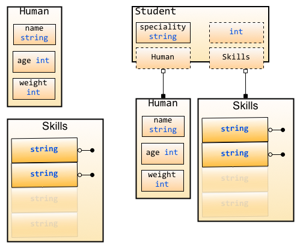

我们看到Student访问属性age和name的时候，就像访问自己所有用的字段一样，能够实现字段的继承。重要的是student还能访问Human这个字段作为字段名

```go
mark.Human = Human{"Marcus", 55, 220}
mark.Human.age -= 1
```

通过匿名访问和修改字段相当的有用，所有的内置类型和自定义类型都是可以作为匿名字段的

```go
package main
import "fmt"

type Skills []string

type Human struct {
    name string
    age int
    weight int
}

type Student struct {
    Human  // 匿名字段，struct
    Skills // 匿名字段，自定义的类型string slice
    int    // 内置类型作为匿名字段
    speciality string
}

func main() {
    // 初始化学生Jane
    jane := Student{Human:Human{"Jane", 35, 100}, speciality:"Biology"}
    // 现在我们来访问相应的字段
    fmt.Println("Her name is ", jane.name)
    fmt.Println("Her age is ", jane.age)
    fmt.Println("Her weight is ", jane.weight)
    fmt.Println("Her speciality is ", jane.speciality)
    // 我们来修改他的skill技能字段
    jane.Skills = []string{"anatomy"}
    fmt.Println("Her skills are ", jane.Skills)
    fmt.Println("She acquired two new ones ")
    jane.Skills = append(jane.Skills, "physics", "golang")
    fmt.Println("Her skills now are ", jane.Skills)
    // 修改匿名内置类型字段
    jane.int = 3
    fmt.Println("Her preferred number is", jane.int)
}
```

**struct、自定义类型、内置类型都可以作为匿名字段**，而且可以在相应的字段上面进行函数操作

Student 和 Human 都包含相同的字段（例如：phone）时：**最外层的优先访问**，也就是当你通过`student.phone`访问的时候，是访问student里面的字段，而不是human里面的字段。

这样就允许我们去重载通过匿名字段继承的一些字段，当然如果我们想访问重载后对应匿名类型里面的字段，可以通过匿名字段名来访问

```go
package main
import "fmt"

type Human struct {
    name string
    age int
    phone string  // Human类型拥有的字段
}

type Employee struct {
    Human  // 匿名字段Human
    speciality string
    phone string  // 雇员的phone字段
}

func main() {
    Bob := Employee{Human{"Bob", 34, "777-444-XXXX"}, "Designer", "333-222"}
    fmt.Println("Bob's work phone is:", Bob.phone)
    // 如果我们要访问Human的phone字段
    fmt.Println("Bob's personal phone is:", Bob.Human.phone)
}
```

### 3.4 面向对象

带有接收者的函数，我们称为`method`

#### method

我们定义了一个struct叫做长方形，现在要计算他的面积

```go
package main
import "fmt"

type Rectangle struct {
    width, height float64
}

func area(r Rectangle) float64 {
    return r.width*r.height
}

func main() {
    r1 := Rectangle{12, 2}
    r2 := Rectangle{9, 4}
    fmt.Println("Area of r1 is: ", area(r1))
    fmt.Println("Area of r2 is: ", area(r2))
}
```

这段代码可以计算出来长方形的面积，但是area()不是作为Rectangle的方法实现的（类似面向对象里面的方法），而是将Rectangle的对象（如r1,r2）作为参数传入函数计算面积的

像下图所表示的那样，椭圆代表函数，而这些函数并不从属于struct(或者以面向对象的术语来说，并不属于class)，他们是单独存在于struct外围，而非在概念上属于某个struct


从概念上来说"面积"是"形状"的一个属性，它是属于这个特定的形状的，就像长方形的长和宽一样。

所以就有了`method`的概念，`method`是附属在一个给定的类型上的，他的语法和函数的声明语法几乎一样，只是在`func`后面增加了一个receiver(也就是method所依从的主体)。

Rectangle存在字段length 和 width, 同时存在方法area(), 这些字段和方法都属于Rectangle。

用Rob Pike的话来说就是：

> "A method is a function with an implicit first argument, called a receiver."

method的语法如下：

```go
func (r ReceiverType) funcName(parameters) (results)
```

下面我们用最开始的例子用method来实现：

```go
package main
import (
    "fmt"
)

type Rectangle struct {
    width, height float64
}

func (r Rectangle) area() float64 {
    return r.width*r.height
}

func main() {
    r1 := Rectangle{12, 2}
    fmt.Println("Area of r1 is: ", r1.area())
}
```

在使用method的时候重要注意几点

- 虽然method的名字一模一样，但是如果接收者不一样，那么method就不一样
- method里面可以访问接收者的字段
- 调用method通过`.`访问，就像struct里面访问字段一样

图示如下:

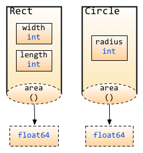

> 值得说明的一点是，图示中method用虚线标出，意思是此处方法的Receiver是以值传递，而非引用传递，是的，Receiver还可以是指针, 两者的差别在于, 指针作为Receiver会对实例对象的内容发生操作,而普通类型作为Receiver仅仅是以副本作为操作对象,并不对原实例对象发生操作

`method`可以定义在任何你自定义的类型、内置类型、struct等各种类型上面

自定义类型申明，可以通过如下这样的申明来实现。

```go
type typeName typeLiteral
```

请看下面这个申明自定义类型的代码

```go
type ages int
type money float32
type months map[string]int
```

你可以在任何的自定义类型中定义任意多的`method`

```go
package main
import "fmt"

const(
    WHITE = iota
    BLACK
    BLUE
    RED
    YELLOW
)

type Color byte

type Box struct {
    width, height, depth float64
    color Color
}

type BoxList []Box //a slice of boxes

func (b Box) Volume() float64 {
    return b.width * b.height * b.depth
}

func (b *Box) SetColor(c Color) {
    b.color = c
}

func (bl BoxList) BiggestColor() Color {
    v := 0.00
    k := Color(WHITE)
    for _, b := range bl {
        if bv := b.Volume(); bv > v {
            v = bv
            k = b.color
        }
    }
    return k
}

func (bl BoxList) PaintItBlack() {
    for i, _ := range bl {
        bl[i].SetColor(BLACK)
    }
}

func (c Color) String() string {
    strings := []string {"WHITE", "BLACK", "BLUE", "RED", "YELLOW"}
    return strings[c]
}

func main() {
    boxes := BoxList {
        Box{4, 4, 4, RED},
        Box{10, 10, 1, YELLOW},
        Box{1, 1, 20, BLACK},
        Box{10, 10, 1, BLUE},
        Box{10, 30, 1, WHITE},
        Box{20, 20, 20, YELLOW},
    }

    fmt.Printf("We have %d boxes in our set\n", len(boxes))
    fmt.Println("The volume of the first one is", boxes[0].Volume(), "cm³")
    fmt.Println("The color of the last one is",boxes[len(boxes)-1].color.String())
    fmt.Println("The biggest one is", boxes.BiggestColor().String())

    fmt.Println("Let's paint them all black")
    boxes.PaintItBlack()
    fmt.Println("The color of the second one is", boxes[1].color.String())

    fmt.Println("Obviously, now, the biggest one is", boxes.BiggestColor().String())
}
```

#### 指针作为receiver

注意上面代码中`SetColor`函数里面使用`b.Color=c`而不是`*b.Color=c`，其实Go里面这两种方式都是正确的，当你用指针去访问相应的字段时(虽然指针没有任何的字段)，Go知道你要通过指针去获取这个值

也就是说：

> 如果一个method的receiver是*T，你可以在一个T类型的实例变量V上面调用这个method，而不需要&V去调用这个method

类似的

> 如果一个method的receiver是T，你可以在一个*T类型的变量P上面调用这个method，而不需要* P去调用这个method

#### method继承

**字段和`method`都是可以继承的**。如果匿名字段实现了一个method，那么包含这个匿名字段的struct也能调用该method

#### method重写

`method`重写和匿名字段的方式相同：**最外层的优先访问**

Go里面没有任何的私有、公有关键字，是通过大小写来实现(大写开头的为公有，小写开头的为私有)，方法也同样适用这个原则

### 3.5 interface

#### interface

Go语言里面设计最精妙的应该算`interface`，它让面向对象、内容组织实现非常的方便

#### 什么是interface

简单的说，`interface`是一组`method`的组合，我们通过`interface`来定义对象的一组行为

#### interface类型

`interface`类型定义了一组方法，如果某个对象实现了这些方法（所有的），则此对象就实现了此接口

```go
type Human struct {
    name string
    age int
    phone string
}

//Human对象实现Sayhi方法
func (h *Human) SayHi() {
    fmt.Printf("Hi, I am %s you can call me on %s\n", h.name, h.phone)
}

// Human对象实现Sing方法
func (h *Human) Sing(lyrics string) {
    fmt.Println("La la, la la la, la la la la la...", lyrics)
}

//Human对象实现Guzzle方法
func (h *Human) Guzzle(beerStein string) {
    fmt.Println("Guzzle Guzzle Guzzle...", beerStein)
}

// 定义interface
type Men interface {
    SayHi()
    Sing(lyrics string)
    Guzzle(beerStein string)
}
```

**`interface`可以被任意的对象实现，一个对象可以实现任意多个interface**

**任何类型都实现了空interface(这样定义：interface{})，也就是包含0个method的interface**

#### interface值

如果我们定义了一个interface的变量，那么这个变量里面可以存实现这个interface的任意类型的对象

```go
package main
import "fmt"

type Human struct {
    name string
    age int
    phone string
}

type Student struct {
    Human //匿名字段
    school string
    loan float32
}

type Employee struct {
    Human //匿名字段
    company string
    money float32
}

//Human实现SayHi方法
func (h Human) SayHi() {
    fmt.Printf("Hi, I am %s you can call me on %s\n", h.name, h.phone)
}

//Human实现Sing方法
func (h Human) Sing(lyrics string) {
    fmt.Println("La la la la...", lyrics)
}

//Employee重载Human的SayHi方法
func (e Employee) SayHi() {
    fmt.Printf("Hi, I am %s, I work at %s. Call me on %s\n", e.name,
        e.company, e.phone)
    }

// Interface Men被Human,Student和Employee实现
// 因为这三个类型都实现了这两个方法
type Men interface {
    SayHi()
    Sing(lyrics string)
}

func main() {
    mike := Student{Human{"Mike", 25, "222-222-XXX"}, "MIT", 0.00}
    paul := Student{Human{"Paul", 26, "111-222-XXX"}, "Harvard", 100}
    sam := Employee{Human{"Sam", 36, "444-222-XXX"}, "Golang Inc.", 1000}
    tom := Employee{Human{"Tom", 37, "222-444-XXX"}, "Things Ltd.", 5000}

    //定义Men类型的变量i
    var i Men

    //i能存储Student
    i = mike
    fmt.Println("This is Mike, a Student:")
    i.SayHi()
    i.Sing("November rain")

    //i也能存储Employee
    i = tom
    fmt.Println("This is tom, an Employee:")
    i.SayHi()
    i.Sing("Born to be wild")

    //定义了slice Men
    fmt.Println("Let's use a slice of Men and see what happens")
    x := make([]Men, 3)
    //这三个都是不同类型的元素，但是他们实现了interface同一个接口
    x[0], x[1], x[2] = paul, sam, mike

    for _, value := range x{
        value.SayHi()
    }
}
```

通过上面的代码，你会发现interface就是一组抽象方法的集合，它必须由其他非interface类型实现，而不能自我实现， Go通过interface实现了duck-typing:即"当看到一只鸟走起来像鸭子、游泳起来像鸭子、叫起来也像鸭子，那么这只鸟就可以被称为鸭子"。

#### 空interface

空`interface(interface{})`不包含任何的`method`，正因为如此，所有的类型都实现了空`interface`。空`interface`对于描述起不到任何的作用(因为它不包含任何的method），**空interface可以存储任意类型的数值**

```go
// 定义a为空接口
var a interface{}
var i int = 5
s := "Hello world"
// a可以存储任意类型的数值
a = i
a = s
```

一个函数把interface{}作为参数，那么他可以接受任意类型的值作为参数，如果一个函数返回interface{},那么也就可以返回任意类型的值

#### interface函数参数

`interface`的变量可以持有任意实现该interface类型的对象，这给我们编写函数(包括method)提供了一些额外的思考，我们是不是可以通过定义interface参数，让函数接受各种类型的参数。

举个例子：fmt.Println是我们常用的一个函数，但是你是否注意到它可以接受任意类型的数据。打开fmt的源码文件，你会看到这样一个定义:

```go
func Println(a ...interface{}) (n int, err error)
```

即接受的参数是`interface{}`（空interface），任何实现了`interface{}`的对象都可被fmt.Println调用

#### interface变量存储的类型

我们知道interface的变量里面可以存储任意类型的数值(该类型实现了interface)。那么我们怎么反向知道这个变量里面实际保存的是哪个类型的对象呢？目前常用的有两种方法：

- Comma-ok断言

  Go语言里面有一个语法，可以直接判断是否是该类型的变量： `value, ok = element.(T)`，这里value就是变量的值，ok是一个bool类型，element是interface变量，T是断言的类型

  如果element里面确实存储了T类型的数值，那么ok返回true，否则返回false

  ```go
    package main

    import (
        "fmt"
        "strconv"
    )

    type Element interface{}
    type List [] Element

    type Person struct {
        name string
        age int
    }

    //定义了String方法，实现了fmt.Stringer
    func (p Person) String() string {
        return "(name: " + p.name + " - age: "+strconv.Itoa(p.age)+ " years)"
    }

    func main() {
        list := make(List, 3)
        list[0] = 1 // an int
        list[1] = "Hello" // a string
        list[2] = Person{"Dennis", 70}

        for index, element := range list {
            if value, ok := element.(int); ok {
                fmt.Printf("list[%d] is an int and its value is %d\n", index, value)
            } else if value, ok := element.(string); ok {
                fmt.Printf("list[%d] is a string and its value is %s\n", index, value)
            } else if value, ok := element.(Person); ok {
                fmt.Printf("list[%d] is a Person and its value is %s\n", index, value)
            } else {
                fmt.Printf("list[%d] is of a different type\n", index)
            }
        }
    }
  ```

- switch测试

  重写上面的这个实现

  ```go
    package main

    import (
        "fmt"
        "strconv"
    )

    type Element interface{}
    type List [] Element

    type Person struct {
        name string
        age int
    }

    //打印
    func (p Person) String() string {
        return "(name: " + p.name + " - age: "+strconv.Itoa(p.age)+ " years)"
    }

    func main() {
        list := make(List, 3)
        list[0] = 1 //an int
        list[1] = "Hello" //a string
        list[2] = Person{"Dennis", 70}

        for index, element := range list{
            switch value := element.(type) {
                case int:
                    fmt.Printf("list[%d] is an int and its value is %d\n", index, value)
                case string:
                    fmt.Printf("list[%d] is a string and its value is %s\n", index, value)
                case Person:
                    fmt.Printf("list[%d] is a Person and its value is %s\n", index, value)
                default:
                    fmt.Println("list[%d] is of a different type", index)
            }
        }
    }
  ```

  这里有一点需要强调的是：`element.(type)`语法不能在switch外的任何逻辑里面使用，如果你要在switch外面判断一个类型就使用`comma-ok`。

#### 嵌入interface

如果一个interface1作为interface2的一个嵌入字段，那么interface2隐式的包含了interface1里面的method

我们可以看到源码包container/heap里面有这样的一个定义

```go
type Interface interface {
    sort.Interface //嵌入字段sort.Interface
    Push(x interface{}) //a Push method to push elements into the heap
    Pop() interface{} //a Pop elements that pops elements from the heap
}
```

我们看到sort.Interface其实就是嵌入字段，把sort.Interface的所有method给隐式的包含进来了。也就是下面三个方法：

```go
type Interface interface {
    // Len is the number of elements in the collection.
    Len() int
    // Less returns whether the element with index i should sort
    // before the element with index j.
    Less(i, j int) bool
    // Swap swaps the elements with indexes i and j.
    Swap(i, j int)
}
```

另一个例子就是io包下面的 io.ReadWriter ，它包含了io包下面的Reader和Writer两个interface：

```go
// io.ReadWriter
type ReadWriter interface {
    Reader
    Writer
}
```

#### 反射

Go语言实现了反射，所谓反射就是能检查程序在运行时的状态。我们一般用到的包是reflect包。如何运用reflect包，官方的这篇文章详细的讲解了reflect包的实现原理，[laws of reflection](http://golang.org/doc/articles/laws_of_reflection.html)

使用reflect一般分成三步，下面简要的讲解一下：要去反射是一个类型的值(这些值都实现了空interface)，首先需要把它转化成reflect对象(reflect.Type或者reflect.Value，根据不同的情况调用不同的函数)。这两种获取方式如下：

```go
t := reflect.TypeOf(i)    //得到类型的元数据,通过t我们能获取类型定义里面的所有元素
v := reflect.ValueOf(i)   //得到实际的值，通过v我们获取存储在里面的值，还可以去改变值
```

转化为reflect对象之后我们就可以进行一些操作了，也就是将reflect对象转化成相应的值，例如

```go
tag := t.Elem().Field(0).Tag  //获取定义在struct里面的标签
name := v.Elem().Field(0).String()  //获取存储在第一个字段里面的值
```

获取反射值能返回相应的类型和数值

```go
var x float64 = 3.4
v := reflect.ValueOf(x)
fmt.Println("type:", v.Type())
fmt.Println("kind is float64:", v.Kind() == reflect.Float64)
fmt.Println("value:", v.Float())
```

最后，反射的话，那么反射的字段必须是可修改的，我们前面学习过传值和传引用，这个里面也是一样的道理。反射的字段必须是可读写的意思是，如果下面这样写，那么会发生错误

```go
var x float64 = 3.4
v := reflect.ValueOf(x)
v.SetFloat(7.1)
```

如果要修改相应的值，必须这样写

```go
var x float64 = 3.4
p := reflect.ValueOf(&x)
v := p.Elem()
v.SetFloat(7.1)
```

### 3.6 并发

#### goroutine

`goroutine`是Go并行设计的核心。goroutine说到底其实就是线程，但是它比线程更小，十几个goroutine可能体现在底层就是五六个线程，Go语言内部帮你实现了这些goroutine之间的内存共享。执行goroutine只需极少的栈内存(大概是4~5KB)，当然会根据相应的数据伸缩。也正因为如此，可同时运行成千上万个并发任务。goroutine比thread更易用、更高效、更轻便。

goroutine是通过Go的runtime管理的一个线程管理器。goroutine通过`go`关键字实现，其实就是一个普通的函数

```go
go hello(a, b, c)
```

通过关键字go就启动了一个goroutine。我们来看一个例子

```go
package main

import (
    "fmt"
    "runtime"
)

func say(s string) {
    for i := 0; i < 5; i++ {
        runtime.Gosched()
        fmt.Println(s)
    }
}

func main() {
    go say("world") //开一个新的Goroutines执行
    say("hello") //当前Goroutines执行
}
```

设计上我们要遵循：**不要通过共享来通信，而要通过通信来共享**

> runtime.Gosched()表示让CPU把时间片让给别人,下次某个时候继续恢复执行该goroutine。
>
> 默认情况下，调度器仅使用单线程，也就是说只实现了并发。想要发挥多核处理器的并行，需要在我们的程序中显式调用 runtime.GOMAXPROCS(n) 告诉调度器同时使用多个线程。GOMAXPROCS 设置了同时运行逻辑代码的系统线程的最大数量，并返回之前的设置。如果n < 1，不会改变当前设置。以后Go的新版本中调度得到改进后，这将被移除。[这里有一篇Rob介绍的关于并发和并行的文章](http://concur.rspace.googlecode.com/hg/talk/concur.html#landing-slide)

#### channels

goroutine运行在相同的地址空间，因此访问共享内存必须做好同步。Go提供了一个很好的通信机制channel-goroutine之间通信，可以通过它发送或者接收值。这些值只能是特定的类型：channel类型。定义一个channel时，也需要定义发送到channel的值的类型。注意，**必须使用make 创建channel**

```go
ci := make(chan int)
cs := make(chan string)
cf := make(chan interface{})
```

**`channel`通过操作符`<-`来接收和发送数据**

```go
ch <- v    // 发送v到channel ch.
v := <-ch  // 从ch中接收数据，并赋值给v
```

我们把这些应用到我们的例子中来：

```go
package main

import "fmt"

func sum(a []int, c chan int) {
    total := 0
    for _, v := range a {
        total += v
    }
    c <- total  // send total to c
}

func main() {
    a := []int{7, 2, 8, -9, 4, 0}

    c := make(chan int)
    go sum(a[:len(a)/2], c)
    go sum(a[len(a)/2:], c)
    x, y := <-c, <-c  // receive from c

    fmt.Println(x, y, x + y)
}
```

默认情况下，channel接收和发送数据都是阻塞的，除非另一端已经准备好，这样就使得Goroutines同步变的更加的简单，而不需要显式的lock。所谓阻塞，也就是如果读取（value := <-ch）它将会被阻塞，直到有数据接收。其次，任何发送（ch<-5）将会被阻塞，直到数据被读出。无缓冲channel是在多个goroutine之间同步很棒的工具

#### Buffered Channels

上面我们介绍了默认的非缓存类型的channel，不过Go也允许指定channel的缓冲大小，即channel可以存储多少元素`ch:= make(chan bool, 4)`，创建了可以存储4个元素的bool 型channel。在这个channel 中，前4个元素可以无阻塞的写入。当写入第5个元素时，代码将会阻塞，直到其他goroutine从channel 中读取一些元素，腾出空间。

```go
// value == 0 无缓冲（阻塞）
// value > 0 缓冲（非阻塞，直到value 个元素）
ch := make(chan type, value)
```

我们看一下下面这个例子，你可以在自己本机测试一下，修改相应的value值

```go
package main

import "fmt"

func main() {
    c := make(chan int, 2)//修改2为1就报错deadlock，修改2为3可以正常运行
    c <- 1
    c <- 2
    fmt.Println(<-c)
    fmt.Println(<-c)
}
```

#### Range和Close

可以通过range，像操作slice或者map一样操作缓存类型的channel

```go
package main

import (
    "fmt"
)

func fibonacci(n int, c chan int) {
    x, y := 1, 1
    for i := 0; i < n; i++ {
        c <- x
        x, y = y, x + y
    }
    close(c)
}

func main() {
    c := make(chan int, 10)
    go fibonacci(cap(c), c)
    for i := range c {
        fmt.Println(i)
    }
}
```

`for i := range c`能够不断的读取channel里面的数据，直到该channel被显式的关闭。上面代码我们看到可以显式的关闭channel，生产者通过内置函数`close`关闭channel。关闭channel之后就无法再发送任何数据了，在消费方可以通过语法`v, ok := <-ch`测试channel是否被关闭。如果ok返回false，那么说明channel已经没有任何数据并且已经被关闭

> 记住应该在生产者的地方关闭channel，而不是消费的地方去关闭它，这样容易引起panic
>
> 另外记住一点的就是channel不像文件之类的，不需要经常去关闭，只有当你确实没有任何发送数据了，或者你想显式的结束range循环之类的

#### Select

Go里面提供了一个关键字`select`，通过`select`可以监听channel上的数据流动

`select`默认是阻塞的，只有当监听的channel中有发送或接收可以进行时才会运行，当多个channel都准备好的时候，select是随机的选择一个执行的

```go
package main

import "fmt"

func fibonacci(c, quit chan int) {
    x, y := 1, 1
    for {
        select {
        case c <- x:
            x, y = y, x + y
        case <-quit:
            fmt.Println("quit")
            return
        }
    }
}

func main() {
    c := make(chan int)
    quit := make(chan int)
    go func() {
        for i := 0; i < 10; i++ {
            fmt.Println(<-c)
        }
        quit <- 0
    }()
    fibonacci(c, quit)
}
```

在`select`里面还有default语法，`select`其实就是类似switch的功能，default就是当监听的channel都没有准备好的时候，默认执行的（select不再阻塞等待channel）。

```go
select {
case i := <-c:
    // use i
default:
    // 当c阻塞的时候执行这里
}
```

#### 超时

利用select来设置超时避免整个程序进入阻塞：

```go
func main() {
    c := make(chan int)
    o := make(chan bool)
    go func() {
        for {
            select {
                case v := <- c:
                    println(v)
                case <- time.After(5 * time.Second):
                    println("timeout")
                    o <- true
                    break
            }
        }
    }()
    <- o
}
```

#### runtime goroutine

runtime包中有几个处理goroutine的函数：

- Goexit

  退出当前执行的goroutine，但是defer函数还会继续调用

- Gosched

  让出当前goroutine的执行权限，调度器安排其他等待的任务运行，并在下次某个时候从该位置恢复执行

- NumCPU

  返回 CPU 核数量

- NumGoroutine

  返回正在执行和排队的任务总数

- GOMAXPROCS

  用来设置可以并行计算的CPU核数的最大值，并返回之前的值

## 4 Web基础

### 4.1 Web工作方式

对于普通的上网过程，系统其实是这样做的：浏览器本身是一个客户端，当你输入URL的时候，首先浏览器会去请求DNS服务器，通过DNS获取相应的域名对应的IP，然后通过IP地址找到IP对应的服务器后，要求建立TCP连接，等浏览器发送完HTTP Request（请求）包后，服务器接收到请求包之后才开始处理请求包，服务器调用自身服务，返回HTTP Response（响应）包；客户端收到来自服务器的响应后开始渲染这个Response包里的主体（body），等收到全部的内容随后断开与该服务器之间的TCP连接。

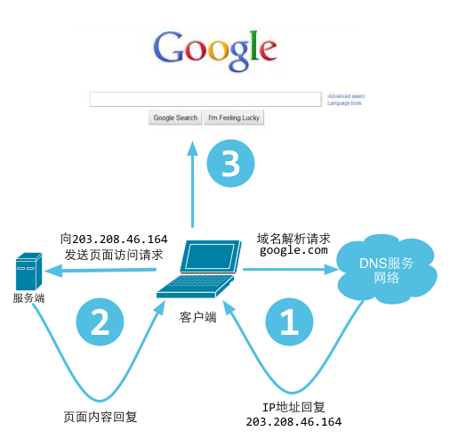

一个Web服务器也被称为HTTP服务器，它通过HTTP协议与客户端通信。这个客户端通常指的是Web浏览器

Web服务器的工作原理可以简单地归纳为：

- 客户机通过TCP/IP协议建立到服务器的TCP连接
- 客户端向服务器发送HTTP协议请求包，请求服务器里的资源文档
- 服务器向客户机发送HTTP协议应答包，如果请求的资源包含有动态语言的内容，那么服务器会调用动态语言的解释引擎负责处理“动态内容”，并将处理得到的数据返回给客户端
- 客户机与服务器断开。由客户端解释HTML文档，在客户端屏幕上渲染图形结果

#### URL和DNS解析

URL(Uniform Resource Locator)是“统一资源定位符”的英文缩写，用于描述一个网络上的资源, 基本格式如下

```
scheme://host[:port#]/path/.../[?query-string][#anchor]
scheme         指定低层使用的协议(例如：http, https, ftp)
host           HTTP服务器的IP地址或者域名
port#          HTTP服务器的默认端口是80，这种情况下端口号可以省略。如果使用了别的端口，必须指明
path           访问资源的路径
query-string   发送给http服务器的数据
anchor         锚
```

DNS(Domain Name System)是“域名系统”的英文缩写，是一种组织成域层次结构的计算机和网络服务命名系统，它用于TCP/IP网络，它从事将主机名或域名转换为实际IP地址的工作


更详细的DNS解析的过程如下，这个过程有助于我们理解DNS的工作模式

1. 在浏览器中输入www.qq.com域名，操作系统会先检查自己本地的hosts文件是否有这个网址映射关系，如果有，就先调用这个IP地址映射，完成域名解析。
2. 如果hosts里没有这个域名的映射，则查找本地DNS解析器缓存，是否有这个网址映射关系，如果有，直接返回，完成域名解析。
3. 如果hosts与本地DNS解析器缓存都没有相应的网址映射关系，首先会找TCP/IP参数中设置的首选DNS服务器，在此我们叫它本地DNS服务器，此服务器收到查询时，如果要查询的域名，包含在本地配置区域资源中，则返回解析结果给客户机，完成域名解析，此解析具有权威性。
4. 如果要查询的域名，不由本地DNS服务器区域解析，但该服务器已缓存了此网址映射关系，则调用这个IP地址映射，完成域名解析，此解析不具有权威性。
5. 如果本地DNS服务器本地区域文件与缓存解析都失效，则根据本地DNS服务器的设置（是否设置转发器）进行查询，如果未用转发模式，本地DNS就把请求发至 “根DNS服务器”，“根DNS服务器”收到请求后会判断这个域名(.com)是谁来授权管理，并会返回一个负责该顶级域名服务器的一个IP。本地DNS服务器收到IP信息后，将会联系负责.com域的这台服务器。这台负责.com域的服务器收到请求后，如果自己无法解析，它就会找一个管理.com域的下一级DNS服务器地址(qq.com)给本地DNS服务器。当本地DNS服务器收到这个地址后，就会找qq.com域服务器，重复上面的动作，进行查询，直至找到www.qq.com主机。
6. 如果用的是转发模式，此DNS服务器就会把请求转发至上一级DNS服务器，由上一级服务器进行解析，上一级服务器如果不能解析，或找根DNS或把转请求转至上上级，以此循环。不管是本地DNS服务器用是是转发，还是根提示，最后都是把结果返回给本地DNS服务器，由此DNS服务器再返回给客户机。

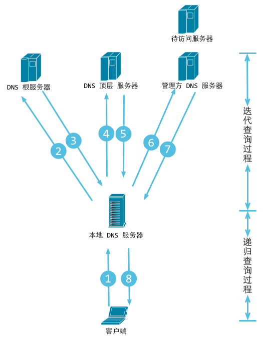

> 所谓 `递归查询过程` 就是 “查询的递交者” 更替, 而 `迭代查询过程` 则是 “查询的递交者”不变。
>
> 举个例子来说，你想知道某个一起上法律课的女孩的电话，并且你偷偷拍了她的照片，回到寝室告诉一个很仗义的哥们儿，这个哥们儿二话没说，拍着胸脯告诉你，甭急，我替你查(此处完成了一次递归查询，即，问询者的角色更替)。然后他拿着照片问了学院大四学长，学长告诉他，这姑娘是xx系的；然后这哥们儿马不停蹄又问了xx系的办公室主任助理同学，助理同学说是xx系yy班的，然后很仗义的哥们儿去xx系yy班的班长那里取到了该女孩儿电话。(此处完成若干次迭代查询，即，问询者角色不变，但反复更替问询对象)最后，他把号码交到了你手里。完成整个查询过程。

#### HTTP协议详解

HTTP是一种让Web服务器与浏览器(客户端)通过Internet发送与接收数据的协议,它建立在TCP协议之上，一般采用TCP的80端口。它是一个请求、响应协议--客户端发出一个请求，服务器响应这个请求。在HTTP中，客户端总是通过建立一个连接与发送一个HTTP请求来发起一个事务。服务器不能主动去与客户端联系，也不能给客户端发出一个回调连接。客户端与服务器端都可以提前中断一个连接

HTTP协议是无状态的，同一个客户端的这次请求和上次请求是没有对应关系，对HTTP服务器来说，它并不知道这两个请求是否来自同一个客户端。为了解决这个问题， Web程序引入了Cookie机制来维护连接的可持续状态。

> HTTP协议是建立在TCP协议之上的，因此TCP攻击一样会影响HTTP的通讯，例如比较常见的一些攻击：SYN Flood是当前最流行的DoS（拒绝服务攻击）与DdoS（分布式拒绝服务攻击）的方式之一，这是一种利用TCP协议缺陷，发送大量伪造的TCP连接请求，从而使得被攻击方资源耗尽（CPU满负荷或内存不足）的攻击方式。

##### HTTP请求包（浏览器信息）

我们先来看看Request包的结构, Request包分为3部分，第一部分叫Request line（请求行）, 第二部分叫Request header（请求头）,第三部分是body（主体）。header和body之间有个空行，请求包的例子所示:

```
GET /domains/example/ HTTP/1.1        //请求行: 请求方法 请求URI HTTP协议/协议版本
Host：www.iana.org                //服务端的主机名
User-Agent：Mozilla/5.0 (Windows NT 6.1) AppleWebKit/537.4 (KHTML, like Gecko) Chrome/22.0.1229.94 Safari/537.4            //浏览器信息
Accept：text/html,application/xhtml+xml,application/xml;q=0.9,*/*;q=0.8    //客户端能接收的mine
Accept-Encoding：gzip,deflate,sdch        //是否支持流压缩
Accept-Charset：UTF-8,*;q=0.5        //客户端字符编码集
//空行,用于分割请求头和消息体
//消息体,请求资源参数,例如POST传递的参数
```

HTTP协议定义了很多与服务器交互的请求方法，最基本的有4种，分别是GET,POST,PUT,DELETE。一个URL地址用于描述一个网络上的资源，而HTTP中的GET, POST, PUT, DELETE就对应着对这个资源的查，改，增，删4个操作。我们最常见的就是GET和POST了。GET一般用于获取/查询资源信息，而POST一般用于更新资源信息。

通过fiddler抓包可以看到如下请求信息:

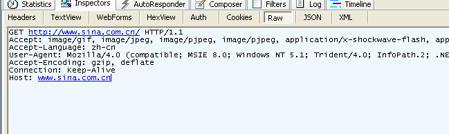


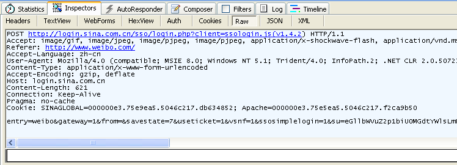

我们看看GET和POST的区别:

1. 我们可以看到GET请求消息体为空，POST请求带有消息体
2. GET提交的数据会放在URL之后，以`?`分割URL和传输数据，参数之间以`&`相连，如`EditPosts.aspx?name=test1&id=123456`。POST方法是把提交的数据放在HTTP包的body中
3. GET提交的数据大小有限制（因为浏览器对URL的长度有限制），而POST方法提交的数据没有限制
4. GET方式提交数据，会带来安全问题，比如一个登录页面，通过GET方式提交数据时，用户名和密码将出现在URL上，如果页面可以被缓存或者其他人可以访问这台机器，就可以从历史记录获得该用户的账号和密码

##### HTTP响应包（服务器信息）

HTTP的response包结构如下：

```
HTTP/1.1 200 OK                        //状态行
Server: nginx/1.0.8                    //服务器使用的WEB软件名及版本
Date:Date: Tue, 30 Oct 2012 04:14:25 GMT        //发送时间
Content-Type: text/html                //服务器发送信息的类型
Transfer-Encoding: chunked            //表示发送HTTP包是分段发的
Connection: keep-alive                //保持连接状态
Content-Length: 90                    //主体内容长度
//空行 用来分割消息头和主体
<!DOCTYPE html PUBLIC "-//W3C//DTD XHTML 1.0 Transitional//EN"... //消息体
```

Response包中的第一行叫做状态行，由HTTP协议版本号， 状态码， 状态消息 三部分组成。

状态码用来告诉HTTP客户端,HTTP服务器是否产生了预期的Response。HTTP/1.1协议中定义了5类状态码， 状态码由三位数字组成，第一个数字定义了响应的类别

- 1XX 提示信息 - 表示请求已被成功接收，继续处理
- 2XX 成功 - 表示请求已被成功接收，理解，接受
- 3XX 重定向 - 要完成请求必须进行更进一步的处理
- 4XX 客户端错误 - 请求有语法错误或请求无法实现
- 5XX 服务器端错误 - 服务器未能实现合法的请求

我们看下面这个图展示了详细的返回信息，左边可以看到有很多的资源返回码，200是常用的，表示正常信息，302表示跳转。response header里面展示了详细的信息。

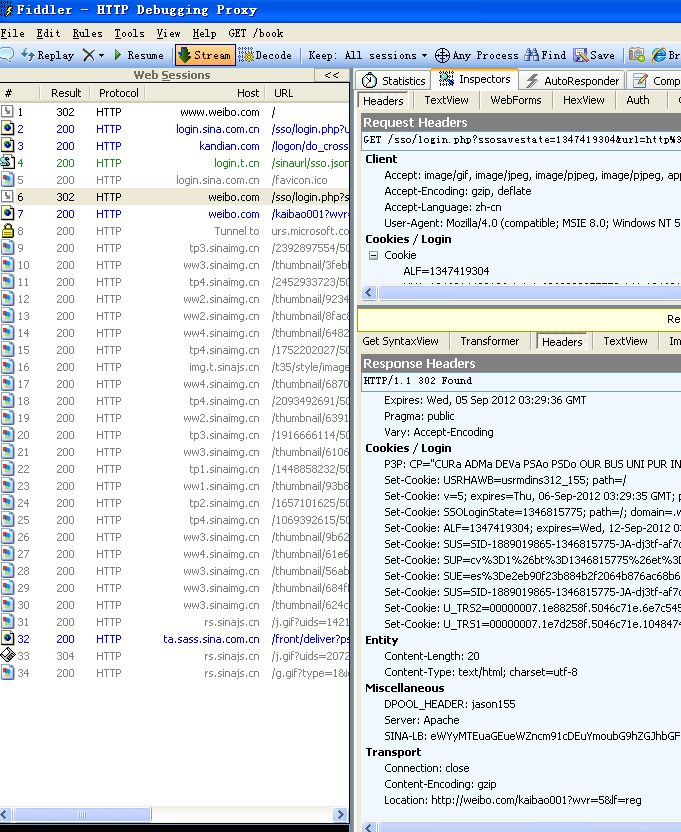

##### HTTP协议是无状态的和Connection: keep-alive的区别

无状态是指协议对于事务处理没有记忆能力，服务器不知道客户端是什么状态。从另一方面讲，打开一个服务器上的网页和你之前打开这个服务器上的网页之间没有任何联系

**HTTP是一个无状态的面向连接的协议**，无状态不代表HTTP不能保持TCP连接，更不能代表HTTP使用的是UDP协议（面对无连接）。

从HTTP/1.1起，默认都开启了Keep-Alive保持连接特性，简单地说，当一个网页打开完成后，客户端和服务器之间用于传输HTTP数据的TCP连接不会关闭，如果客户端再次访问这个服务器上的网页，会继续使用这一条已经建立的TCP连接。

Keep-Alive不会永久保持连接，它有一个保持时间，可以在不同服务器软件（如Apache）中设置这个时间

#### 请求实例

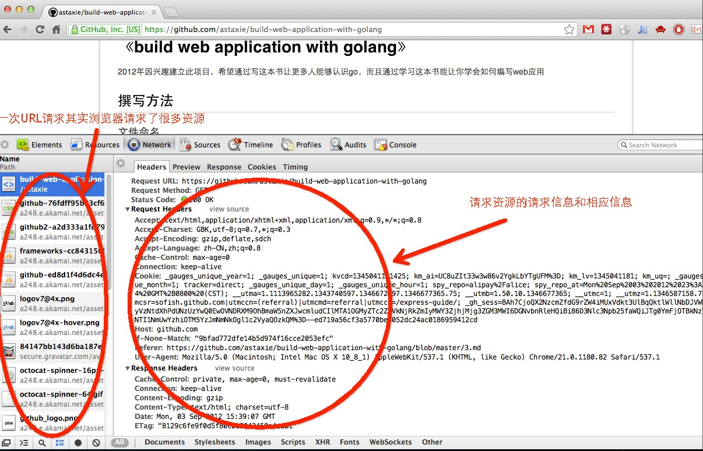

上面这张图我们可以了解到整个的通讯过程，同时细心的读者是否注意到了一点，一个URL请求但是左边栏里面为什么会有那么多的资源请求(这些都是静态文件，go对于静态文件有专门的处理方式)

这个就是浏览器的一个功能，第一次请求url，服务器端返回的是html页面，然后浏览器开始渲染HTML：当解析到HTML DOM里面的图片连接，css脚本和js脚本的链接，浏览器就会自动发起一个请求静态资源的HTTP请求，获取相对应的静态资源，然后浏览器就会渲染出来，最终将所有资源整合、渲染，完整展现在我们面前的屏幕上

> 网页优化方面有一项措施是减少HTTP请求次数，就是把尽量多的css和js资源合并在一起，目的是尽量减少网页请求静态资源的次数，提高网页加载速度，同时减缓服务器的压力。

### 4.2 Go搭建一个Web服务器

Go语言里面提供了一个完善的net/http包，通过http包可以很方便的就搭建起来一个可以运行的Web服务。同时使用这个包能很简单地对Web的路由，静态文件，模版，cookie等数据进行设置和操作

#### http包建立Web服务器

```go
package main

import (
    "fmt"
    "net/http"
    "strings"
    "log"
)

func sayhelloName(w http.ResponseWriter, r *http.Request) {
    r.ParseForm()  //解析参数，默认是不会解析的
    fmt.Println(r.Form)  //这些信息是输出到服务器端的打印信息
    fmt.Println("path", r.URL.Path)
    fmt.Println("scheme", r.URL.Scheme)
    fmt.Println(r.Form["url_long"])
    for k, v := range r.Form {
        fmt.Println("key:", k)
        fmt.Println("val:", strings.Join(v, ""))
    }
    fmt.Fprintf(w, "Hello astaxie!") //这个写入到w的是输出到客户端的
}

func main() {
    http.HandleFunc("/", sayhelloName) //设置访问的路由
    err := http.ListenAndServe(":9090", nil) //设置监听的端口
    if err != nil {
        log.Fatal("ListenAndServe: ", err)
    }
}
```

上面这个代码，我们build之后，然后执行web.exe,这个时候其实已经在9090端口监听http链接请求了

在浏览器输入`http://localhost:9090`

可以看到浏览器页面输出了`Hello astaxie!`

可以换一个地址试试：`http://localhost:9090/?url_long=111&url_long=222`

在服务器端输出的信息如下：


> Go就是不需要nginx、apache、tomcat等服务器，因为他直接就监听tcp端口了，做了nginx做的事情

### 4.3 Go如何使得Web工作

#### web工作方式的几个概念

以下均是服务器端的几个概念

Request：用户请求的信息，用来解析用户的请求信息，包括post、get、cookie、url等信息

Response：服务器需要反馈给客户端的信息

Conn：用户的每次请求链接

Handler：处理请求和生成返回信息的处理逻辑

#### 分析http包运行机制

如下图所示，是Go实现Web服务的工作模式的流程图


1. 创建Listen Socket, 监听指定的端口, 等待客户端请求到来
2. Listen Socket接受客户端的请求, 得到Client Socket, 接下来通过Client Socket与客户端通信
3. 处理客户端的请求, 首先从Client Socket读取HTTP请求的协议头, 如果是POST方法, 还可能要读取客户端提交的数据, 然后交给相应的handler处理请求, handler处理完毕准备好客户端需要的数据, 通过Client Socket写给客户端

这整个的过程里面我们只要了解清楚下面三个问题，也就知道Go是如何让Web运行起来了

- 如何监听端口？
- 如何接收客户端请求？
- 如何分配handler？

前面小节的代码里面我们可以看到，Go是通过一个函数`ListenAndServe`来处理这些事情的，这个底层其实这样处理的：初始化一个server对象，然后调用了`net.Listen("tcp", addr)`，也就是底层用TCP协议搭建了一个服务，然后监控我们设置的端口

下面代码来自Go的http包的源码，通过下面的代码我们可以看到整个的http处理过程：

```go
func (srv *Server) Serve(l net.Listener) error {
    defer l.Close()
    var tempDelay time.Duration // how long to sleep on accept failure
    for {
        rw, e := l.Accept()
        if e != nil {
            if ne, ok := e.(net.Error); ok && ne.Temporary() {
                if tempDelay == 0 {
                    tempDelay = 5 * time.Millisecond
                } else {
                    tempDelay *= 2
                }
                if max := 1 * time.Second; tempDelay > max {
                    tempDelay = max
                }
                log.Printf("http: Accept error: %v; retrying in %v", e, tempDelay)
                time.Sleep(tempDelay)
                continue
            }
            return e
        }
        tempDelay = 0
        c, err := srv.newConn(rw)
        if err != nil {
            continue
        }
        go c.serve()
    }
}
```

上面代码执行监控端口之后，调用了`srv.Serve(net.Listener)`函数，这个函数就是处理接收客户端的请求信息。这个函数里面起了一个`for{}`，首先通过Listener接收请求，其次创建一个Conn，最后单独开了一个goroutine，把这个请求的数据当做参数扔给这个conn去服务：`go c.serve()`。这个就是高并发体现了，用户的每一次请求都是在一个新的goroutine去服务

conn首先会解析request:`c.readRequest()`,然后获取相应的handler:`handler := c.server.Handler`，也就是我们刚才在调用函数`ListenAndServe`时候的第二个参数，我们前面例子传递的是nil，也就是为空，那么默认获取`handler = DefaultServeMux`,那么这个变量用来做什么的呢？对，这个变量就是一个路由器，它用来匹配url跳转到其相应的handle函数，那么这个我们有设置过吗?有，我们调用的代码里面第一句不是调用了`http.HandleFunc("/", sayhelloName)`嘛。这个作用就是注册了请求`/`的路由规则，当请求uri为"/"，路由就会转到函数sayhelloName，DefaultServeMux会调用ServeHTTP方法，这个方法内部其实就是调用sayhelloName本身，最后通过写入response的信息反馈到客户端

详细的整个流程如下图所示：


### 4.4 Go的http包详解

Go的http有两个核心功能：Conn、ServeMux

#### Conn的goroutine

Go为了实现高并发和高性能, 使用了goroutine来处理Conn的读写事件, 这样每个请求都能保持独立，相互不会阻塞，可以高效的响应网络事件

Go在等待客户端请求里面是这样写的：

```go
c, err := srv.newConn(rw)
if err != nil {
    continue
}
go c.serve()
```

这里我们可以看到客户端的每次请求都会创建一个Conn，这个Conn里面保存了该次请求的信息，然后再传递到对应的handler，该handler中便可以读取到相应的header信息，这样保证了每个请求的独立性。

#### ServeMux的自定义

`conn.server`内部调用了http包默认的路由器，通过路由器把本次请求的信息传递到了后端的处理函数。那么这个路由器是怎么实现的呢？

它的结构如下：

```go
type ServeMux struct {
    mu sync.RWMutex   //锁，由于请求涉及到并发处理，因此这里需要一个锁机制
    m  map[string]muxEntry  // 路由规则，一个string对应一个mux实体，这里的string就是注册的路由表达式
    hosts bool // 是否在任意的规则中带有host信息
}
```

下面看一下muxEntry

```go
type muxEntry struct {
    explicit bool   // 是否精确匹配
    h        Handler // 这个路由表达式对应哪个handler
    pattern  string  //匹配字符串
}
```

接着看一下Handler的定义

```go
type Handler interface {
    ServeHTTP(ResponseWriter, *Request)  // 路由实现器
}
```

Handler是一个接口，但是前一小节中的`sayhelloName`函数并没有实现ServeHTTP这个接口，为什么能添加呢？原来在http包里面还定义了一个类型`HandlerFunc`,我们定义的函数`sayhelloName`就是这个`HandlerFunc`调用之后的结果，这个类型默认就实现了ServeHTTP这个接口，即我们调用了HandlerFunc(f),强制类型转换f成为HandlerFunc类型，这样f就拥有了ServeHTTP方法。

```go
type HandlerFunc func(ResponseWriter, *Request)

// ServeHTTP calls f(w, r).
func (f HandlerFunc) ServeHTTP(w ResponseWriter, r *Request) {
    f(w, r)
}
```

路由器里面存储好了相应的路由规则之后，那么具体的请求又是怎么分发的呢？请看下面的代码，默认的路由器实现了`ServeHTTP`：

```go
func (mux *ServeMux) ServeHTTP(w ResponseWriter, r *Request) {
    if r.RequestURI == "*" {
        w.Header().Set("Connection", "close")
        w.WriteHeader(StatusBadRequest)
        return
    }
    h, _ := mux.Handler(r)
    h.ServeHTTP(w, r)
}
```

如上所示路由器接收到请求之后，如果是`*`那么关闭链接，不然调用`mux.Handler(r)`返回对应设置路由的处理Handler，然后执行`h.ServeHTTP(w, r)`

也就是调用对应路由的handler的ServerHTTP接口，那么mux.Handler(r)怎么处理的呢？

```go
func (mux *ServeMux) Handler(r *Request) (h Handler, pattern string) {
    if r.Method != "CONNECT" {
        if p := cleanPath(r.URL.Path); p != r.URL.Path {
            _, pattern = mux.handler(r.Host, p)
            return RedirectHandler(p, StatusMovedPermanently), pattern
        }
    }    
    return mux.handler(r.Host, r.URL.Path)
}

func (mux *ServeMux) handler(host, path string) (h Handler, pattern string) {
    mux.mu.RLock()
    defer mux.mu.RUnlock()

    // Host-specific pattern takes precedence over generic ones
    if mux.hosts {
        h, pattern = mux.match(host + path)
    }
    if h == nil {
        h, pattern = mux.match(path)
    }
    if h == nil {
        h, pattern = NotFoundHandler(), ""
    }
    return
}
```

原来他是根据用户请求的URL和路由器里面存储的map去匹配的，当匹配到之后返回存储的handler，调用这个handler的ServeHTTP接口就可以执行到相应的函数了。

Go支持外部实现的路由器， `ListenAndServe`的第二个参数就是用以配置外部路由器的，它是一个Handler接口，即外部路由器只要实现了Handler接口就可以,我们可以在自己实现的路由器的ServeHTTP里面实现自定义路由功能

如下代码所示，我们自己实现了一个简易的路由器

```go
package main

import (
    "fmt"
    "net/http"
)

type MyMux struct {
}

func (p *MyMux) ServeHTTP(w http.ResponseWriter, r *http.Request) {
    if r.URL.Path == "/" {
        sayhelloName(w, r)
        return
    }
    http.NotFound(w, r)
    return
}

func sayhelloName(w http.ResponseWriter, r *http.Request) {
    fmt.Fprintf(w, "Hello myroute!")
}

func main() {
    mux := &MyMux{}
    http.ListenAndServe(":9090", mux)
}
```

#### Go代码的执行流程

通过对http包的分析之后，现在让我们来梳理一下整个的代码执行过程。

- 首先调用Http.HandleFunc

  按顺序做了几件事：

  1 调用了DefaultServeMux的HandleFunc

  2 调用了DefaultServeMux的Handle

  3 往DefaultServeMux的map[string]muxEntry中增加对应的handler和路由规则

- 其次调用http.ListenAndServe(":9090", nil)

  按顺序做了几件事情：

  1 实例化Server

  2 调用Server的ListenAndServe()

  3 调用net.Listen("tcp", addr)监听端口

  4 启动一个for循环，在循环体中Accept请求

  5 对每个请求实例化一个Conn，并且开启一个goroutine为这个请求进行服务go c.serve()

  6 读取每个请求的内容w, err := c.readRequest()

  7 判断handler是否为空，如果没有设置handler（这个例子就没有设置handler），handler就设置为DefaultServeMux

  8 调用handler的ServeHttp

  9 在这个例子中，下面就进入到DefaultServeMux.ServeHttp

  10 根据request选择handler，并且进入到这个handler的ServeHTTP

  ```
    mux.handler(r).ServeHTTP(w, r)
  ```

  11 选择handler：

  ​	A 判断是否有路由能满足这个request（循环遍历ServerMux的muxEntry）

  ​	B 如果有路由满足，调用这个路由handler的ServeHttp

  ​	C 如果没有路由满足，调用NotFoundHandler的ServeHttp

## 5 表单

表单是一个包含表单元素的区域。表单元素是允许用户在表单中（比如：文本域、下拉列表、单选框、复选框等等）输入信息的元素。表单使用表单标签（\）定义。

```html
<form>
...
input 元素
...
</form>
```

Go里面在Request里面的有专门的form处理，可以很方便的整合到Web开发里面来

### 5.1 处理表单的输入

我们有如下的表单内容，命名成文件login.gtpl(放入当前新建项目的目录里面)

```html
<html>
<head>
<title></title>
</head>
<body>
<form action="/login" method="post">
    用户名:<input type="text" name="username">
    密码:<input type="password" name="password">
    <input type="submit" value="登陆">
</form>
</body>
</html>
```

上面递交表单到服务器的`/login`，当用户输入信息点击登陆之后，会跳转到服务器的路由`login`里面，我们首先要判断这个是什么方式传递过来，POST还是GET呢？

http包里面有一个很简单的方式就可以获取

```go
package main

import (
    "fmt"
    "html/template"
    "log"
    "net/http"
    "strings"
)

func sayhelloName(w http.ResponseWriter, r *http.Request) {
    r.ParseForm()       //解析url传递的参数，对于POST则解析响应包的主体（request body）
    //注意:如果没有调用ParseForm方法，下面无法获取表单的数据
    fmt.Println(r.Form) //这些信息是输出到服务器端的打印信息
    fmt.Println("path", r.URL.Path)
    fmt.Println("scheme", r.URL.Scheme)
    fmt.Println(r.Form["url_long"])
    for k, v := range r.Form {
        fmt.Println("key:", k)
        fmt.Println("val:", strings.Join(v, ""))
    }
    fmt.Fprintf(w, "Hello astaxie!") //这个写入到w的是输出到客户端的
}

func login(w http.ResponseWriter, r *http.Request) {
    request.ParseForm()
    fmt.Println("method:", r.Method) //获取请求的方法
    if r.Method == "GET" {
        t, _ := template.ParseFiles("login.gtpl")
        t.Execute(w, nil)
    } else {
        //请求的是登陆数据，那么执行登陆的逻辑判断
        fmt.Println("username:", r.Form["username"])
        fmt.Println("password:", r.Form["password"])
    }
}

func main() {
    http.HandleFunc("/", sayhelloName)       //设置访问的路由
    http.HandleFunc("/login", login)         //设置访问的路由
    err := http.ListenAndServe(":9090", nil) //设置监听的端口
    if err != nil {
        log.Fatal("ListenAndServe: ", err)
    }
}
```

通过上面的代码我们可以看出获取请求方法是通过`r.Method`来完成的，这是个字符串类型的变量，返回GET, POST, PUT等method信息

当我们在浏览器里面打开`http://127.0.0.1:9090/login`的时候，出现如下界面

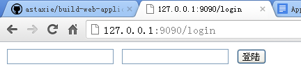

默认情况下，Handler里面是不会自动解析form的，必须显式的调用`r.ParseForm()`后，你才能对这个表单数据进行操作。

`r.Form`里面包含了所有请求的参数，比如URL中query-string、POST的数据、PUT的数据，所有当你在URL的query-string字段和POST冲突时，会保存成一个slice，里面存储了多个值

现在我们修改一下login.gtpl里面form的action值`http://127.0.0.1:9090/login`修改为`http://127.0.0.1:9090/login?username=astaxie`，再次测试，服务器的输出username是不是一个slice

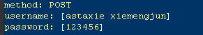

`request.Form`是一个url.Values类型，里面存储的是对应的类似`key=value`的信息，下面展示了可以对form数据进行的一些操作:

```go
v := url.Values{}
v.Set("name", "Ava")
v.Add("friend", "Jess")
v.Add("friend", "Sarah")
v.Add("friend", "Zoe")
// v.Encode() == "name=Ava&friend=Jess&friend=Sarah&friend=Zoe"
fmt.Println(v.Get("name"))
fmt.Println(v.Get("friend"))
fmt.Println(v["friend"])
```

> **Tips**: Request本身也提供了FormValue()函数来获取用户提交的参数。如r.Form["username"]也可写成r.FormValue("username")。调用r.FormValue时会自动调用r.ParseForm，所以不必提前调用。r.FormValue只会返回同名参数中的第一个，若参数不存在则返回空字符串
>

### 5.2 验证表单的输入

开发Web的一个原则就是，不能信任用户输入的任何信息，所以验证和过滤用户的输入信息就变得非常重要

Web应用主要有两方面的数据验证，一个是在页面端的js验证(目前在这方面有很多的插件库，比如ValidationJS插件)，一个是在服务器端的验证

#### 必填字段

Go有一个内置函数`len`可以获取字符串的长度，这样我们就可以通过`len`来获取数据的长度，例如：

```go
if len(r.Form["username"][0])==0{
    //为空的处理
}
```

`r.Form`对不同类型的表单元素的留空有不同的处理， 对于空文本框、空文本区域以及文件上传，元素的值为空值,而如果是未选中的复选框和单选按钮，则根本不会在r.Form中产生相应条目，如果我们用上面例子中的方式去获取数据时程序就会报错。所以我们需要**通过`r.Form.Get()`来获取值**，因为如果字段不存在，通过该方式获取的是空值。但是**通过`r.Form.Get()`只能获取单个值**，如果是map的值，必须通过上面的方式来获取

#### 数字

如果我们是判断正整数，那么我们先转化成int类型，然后进行处理

```go
getint,err:=strconv.Atoi(r.Form.Get("age"))
if err!=nil{
    //数字转化出错了，那么可能就不是数字
}

//接下来就可以判断这个数字的大小范围了
if getint >100 {
    //太大了
}
```

还有一种方式就是正则匹配的方式

```go
if m, _ := regexp.MatchString("^[0-9]+$", r.Form.Get("age")); !m {
    return false
}
```

对于性能要求很高的用户来说，他们认为应该尽量避免使用正则表达式，因为使用正则表达式的速度会比较慢

> Go实现的正则是[RE2](http://code.google.com/p/re2/wiki/Syntax)，所有的字符都是UTF-8编码的。

#### 中文

对于中文我们目前有两种方式来验证，可以使用 `unicode` 包提供的 `func Is(rangeTab *RangeTable, r rune) bool` 来验证，也可以使用正则方式来验证，这里使用最简单的正则方式

```go
if m, _ := regexp.MatchString("^\\p{Han}+$", r.Form.Get("realname")); !m {
    return false
}
```

#### 英文

```go
if m, _ := regexp.MatchString("^[a-zA-Z]+$", r.Form.Get("engname")); !m {
    return false
}
```

#### 电子邮件地址

```go
if m, _ := regexp.MatchString(`^([\w\.\_]{2,10})@(\w{1,}).([a-z]{2,4})$`, r.Form.Get("email")); !m {
    fmt.Println("no")
}else{
    fmt.Println("yes")
}
```

#### 手机号码

```go
if m, _ := regexp.MatchString(`^(1[3|4|5|8][0-9]\d{4,8})$`, r.Form.Get("mobile")); !m {
    return false
}
```

#### 下拉菜单

如果我们想要判断表单里面`<select>`元素生成的下拉菜单中是否有被选中的项目。有些时候黑客可能会伪造这个下拉菜单不存在的值发送给你，那么如何判断这个值是否是我们预设的值呢？

我们的select可能是这样的一些元素

```html
<select name="fruit">
<option value="apple">apple</option>
<option value="pear">pear</option>
<option value="banane">banane</option>
</select>
```

那么我们可以这样来验证

```go
slice:=[]string{"apple","pear","banane"}

for _, v := range slice {
    if v == r.Form.Get("fruit") {
        return true
    }
}
return false
```

#### 单选按钮

因此我们也需要像下拉菜单的判断方式类似，判断我们获取的值是我们预设的值，而不是额外的值。

```html
<input type="radio" name="gender" value="1">男
<input type="radio" name="gender" value="2">女
```

那我们也可以类似下拉菜单的做法一样

```go
slice:=[]int{1,2}

for _, v := range slice {
    if v == r.Form.Get("gender") {
        return true
    }
}
return false
```

#### 复选框

有一项选择兴趣的复选框，你想确定用户选中的和你提供给用户选择的是同一个类型的数据。

```html
<input type="checkbox" name="interest" value="football">足球
<input type="checkbox" name="interest" value="basketball">篮球
<input type="checkbox" name="interest" value="tennis">网球
```

对于复选框我们的验证和单选有点不一样，因为接收到的数据是一个slice

```go
slice:=[]string{"football","basketball","tennis"}
a:=Slice_diff(r.Form["interest"],slice)
if a == nil{
    return true
}

return false
```

上面这个函数`Slice_diff`包含在开源的一个库里面(操作slice和map的库)，<https://github.com/astaxie/beeku>

#### 日期和时间

Go里面提供了一个time的处理包，我们可以把用户的输入年月日转化成相应的时间，然后进行逻辑判断

```go
t := time.Date(2009, time.November, 10, 23, 0, 0, 0, time.UTC)
fmt.Printf("Go launched at %s\n", t.Local())
```

#### 身份证号码

通过正则也可以方便的验证，但是身份证有15位和18位，我们两个都需要验证

```go
//验证15位身份证，15位的是全部数字
if m, _ := regexp.MatchString(`^(\d{15})$`, r.Form.Get("usercard")); !m {
    return false
}

//验证18位身份证，18位前17位为数字，最后一位是校验位，可能为数字或字符X。
if m, _ := regexp.MatchString(`^(\d{17})([0-9]|X)$`, r.Form.Get("usercard")); !m {
    return false
}
```

### 5.3 预防跨站脚本

现在的网站包含大量的动态内容以提高用户体验，比过去要复杂得多。所谓动态内容，就是根据用户环境和需要，Web应用程序能够输出相应的内容。动态站点会受到一种名为“跨站脚本攻击”（Cross Site Scripting, 安全专家们通常将其缩写成 XSS）的威胁，而静态站点则完全不受其影响。

攻击者通常会在有漏洞的程序中插入JavaScript、VBScript、 ActiveX或Flash以欺骗用户。一旦得手，他们可以盗取用户帐户信息，修改用户设置，盗取/污染cookie和植入恶意广告等。

对XSS最佳的防护应该结合以下两种方法：一是验证所有输入数据，有效检测攻击;另一个是对所有输出数据进行适当的处理，以防止任何已成功注入的脚本在浏览器端运行。

那么Go里面是怎么做这个有效防护的呢？Go的html/template里面带有下面几个函数可以帮你转义

```go
func HTMLEscape(w io.Writer, b []byte) //把b进行转义之后写到w
func HTMLEscapeString(s string) string //转义s之后返回结果字符串
func HTMLEscaper(args ...interface{}) string //支持多个参数一起转义，返回结果字符串
```
我们看个例子

```go
fmt.Println("username:", template.HTMLEscapeString(r.Form.Get("username"))) //输出到服务器端
fmt.Println("password:", template.HTMLEscapeString(r.Form.Get("password")))
template.HTMLEscape(w, []byte(r.Form.Get("username"))) //输出到客户端
```

如果我们输入的username是`<script>alert()</script>`,那么我们可以在浏览器上面看到输出如下所示：

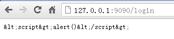

Go的`html/template`包默认帮你过滤了html标签，但是有时候你只想要输出这个`<script>alert()</script>`看起来正常的信息，该怎么处理？请使用`text/template`

```go
import "text/template"
...
t, err := template.New("foo").Parse(`{{define "T"}}Hello, {{.}}!{{end}}`)
err = t.ExecuteTemplate(out, "T", "<script>alert('you have been pwned')</script>")
```

输出

```go
Hello, <script>alert('you have been pwned')</script>!
```

或者使用`template.HTML`类型

```go
import "html/template"
...
t, err := template.New("foo").Parse(`{{define "T"}}Hello, {{.}}!{{end}}`)
err = t.ExecuteTemplate(out, "T", template.HTML("<script>alert('you have been pwned')</script>"))
```

转换成`template.HTML`后，变量的内容也不会被转义

### 5.4 防止多次递交表单

解决方案是在表单中添加一个带有唯一值的隐藏字段。在验证表单时，先检查带有该惟一值的表单是否已经递交过了。如果是，拒绝再次递交；如果不是，则处理表单进行逻辑处理。另外，如果是采用了Ajax模式递交表单的话，当表单递交后，通过javascript来禁用表单的递交按钮

```html
<input type="checkbox" name="interest" value="football">足球
<input type="checkbox" name="interest" value="basketball">篮球
<input type="checkbox" name="interest" value="tennis">网球    
用户名:<input type="text" name="username">
密码:<input type="password" name="password">
<input type="hidden" name="token" value="{{.}}">
<input type="submit" value="登陆">
```

我们在模版里面增加了一个隐藏字段`token`，这个值我们通过MD5(时间戳)来获取惟一值，然后我们把这个值存储到服务器端(session来控制)，以方便表单提交时比对判定。

```go
func login(w http.ResponseWriter, r *http.Request) {
    fmt.Println("method:", r.Method) //获取请求的方法
    if r.Method == "GET" {
        crutime := time.Now().Unix()
        h := md5.New()
        io.WriteString(h, strconv.FormatInt(crutime, 10))
        token := fmt.Sprintf("%x", h.Sum(nil))

        t, _ := template.ParseFiles("login.gtpl")
        t.Execute(w, token)
    } else {
        //请求的是登陆数据，那么执行登陆的逻辑判断
        r.ParseForm()
        token := r.Form.Get("token")
        if token != "" {
            //验证token的合法性
        } else {
            //不存在token报错
        }
        fmt.Println("username length:", len(r.Form["username"][0]))
        fmt.Println("username:", template.HTMLEscapeString(r.Form.Get("username"))) //输出到服务器端
        fmt.Println("password:", template.HTMLEscapeString(r.Form.Get("password")))
        template.HTMLEscape(w, []byte(r.Form.Get("username"))) //输出到客户端
    }
}
```

上面的代码输出到页面的源码如下：

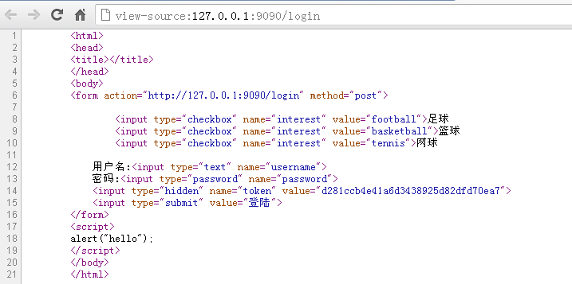

我们看到token已经有输出值，你可以不断的刷新，可以看到这个值在不断的变化。这样就保证了每次显示form表单的时候都是唯一的，用户递交的表单保持了唯一性

### 5.5 处理文件上传

要使表单能够上传文件，首先第一步就是要添加form的`enctype`属性，`enctype`属性有如下三种情况:

```html
application/x-www-form-urlencoded   表示在发送前编码所有字符（默认）
multipart/form-data      不对字符编码。在使用包含文件上传控件的表单时，必须使用该值。
text/plain      空格转换为 "+" 加号，但不对特殊字符编码。
```

所以，表单的html代码应该类似于:

```html
<html>
<head>
    <title>上传文件</title>
</head>
<body>
<form enctype="multipart/form-data" action="http://127.0.0.1:9090/upload" method="post">
  <input type="file" name="uploadfile" />
  <input type="hidden" name="token" value="{{.}}"/>
  <input type="submit" value="upload" />
</form>
</body>
</html>
```

在服务器端，我们增加一个handlerFunc:

```go
http.HandleFunc("/upload", upload)

// 处理/upload 逻辑
func upload(w http.ResponseWriter, r *http.Request) {
    fmt.Println("method:", r.Method) //获取请求的方法
    if r.Method == "GET" {
        crutime := time.Now().Unix()
        h := md5.New()
        io.WriteString(h, strconv.FormatInt(crutime, 10))
        token := fmt.Sprintf("%x", h.Sum(nil))

        t, _ := template.ParseFiles("upload.gtpl")
        t.Execute(w, token)
    } else {
        r.ParseMultipartForm(32 << 20)
        file, handler, err := r.FormFile("uploadfile")
        if err != nil {
            fmt.Println(err)
            return
        }
        defer file.Close()
        fmt.Fprintf(w, "%v", handler.Header)
        f, err := os.OpenFile("./test/"+handler.Filename, os.O_WRONLY|os.O_CREATE, 0666)
        if err != nil {
            fmt.Println(err)
            return
        }
        defer f.Close()
        io.Copy(f, file)
    }
}
```

处理文件上传我们需要调用`r.ParseMultipartForm`，里面的参数表示`maxMemory`，调用`ParseMultipartForm`之后，上传的文件存储在`maxMemory`大小的内存里面，如果文件大小超过了`maxMemory`，那么剩下的部分将存储在系统的临时文件中。我们可以通过`r.FormFile`获取文件句柄，然后实例中使用了`io.Copy`来存储文件

> 获取其他非文件字段信息的时候就不需要调用`r.ParseForm`，因为在需要的时候Go自动会去调用。而且`ParseMultipartForm`调用一次之后，后面再次调用不会再有效果

通过上面的实例我们可以看到我们上传文件主要三步处理：

1. 表单中增加enctype="multipart/form-data"
2. 服务端调用`r.ParseMultipartForm`,把上传的文件存储在内存和临时文件中
3. 使用`r.FormFile`获取文件句柄，然后对文件进行存储等处理

文件handler是multipart.FileHeader,里面存储了如下结构信息

```go
type FileHeader struct {
    Filename string
    Header   textproto.MIMEHeader
    // contains filtered or unexported fields
}
```

我们通过上面的实例代码打印出来上传文件的信息如下


#### 客户端上传文件

Go支持模拟客户端表单功能支持文件上传：

```go
package main

import (
    "bytes"
    "fmt"
    "io"
    "io/ioutil"
    "mime/multipart"
    "net/http"
    "os"
)

func postFile(filename string, targetUrl string) error {
    bodyBuf := &bytes.Buffer{}
    bodyWriter := multipart.NewWriter(bodyBuf)

    //关键的一步操作
    fileWriter, err := bodyWriter.CreateFormFile("uploadfile", filename)
    if err != nil {
        fmt.Println("error writing to buffer")
        return err
    }

    //打开文件句柄操作
    fh, err := os.Open(filename)
    if err != nil {
        fmt.Println("error opening file")
        return err
    }
    defer fh.Close()

    //iocopy
    _, err = io.Copy(fileWriter, fh)
    if err != nil {
        return err
    }

    contentType := bodyWriter.FormDataContentType()
    bodyWriter.Close()

    resp, err := http.Post(targetUrl, contentType, bodyBuf)
    if err != nil {
        return err
    }
    defer resp.Body.Close()
    resp_body, err := ioutil.ReadAll(resp.Body)
    if err != nil {
        return err
    }
    fmt.Println(resp.Status)
    fmt.Println(string(resp_body))
    return nil
}

// sample usage
func main() {
    target_url := "http://localhost:9090/upload"
    filename := "./astaxie.pdf"
    postFile(filename, target_url)
}
```

上面的例子详细展示了客户端如何向服务器上传一个文件的例子，客户端通过multipart.Write把文件的文本流写入一个缓存中，然后调用http的Post方法把缓存传到服务器

> 如果你还有其他普通字段例如username之类的需要同时写入，那么可以调用multipart的WriteField方法写很多其他类似的字段

## 6 访问数据库

Go没有内置的驱动支持任何的数据库，但是Go定义了`database/sql`接口，用户可以基于驱动接口开发相应数据库的驱动

目前NOSQL已经成为Web开发的一个潮流，很多应用采用了NOSQL作为数据库，而不是以前的缓存

> [Go database/sql tutorial](http://go-database-sql.org/) 里提供了惯用的范例及详细的说明。

### 6.1 database/sql接口

Go官方没有提供数据库驱动，而是为开发数据库驱动定义了一些标准接口，开发者可以根据定义的接口来开发相应的数据库驱动，这样做只要是按照标准接口开发的代码， 以后需要迁移数据库时，不需要任何修改

#### sql.Register

这个存在于`database/sql`的函数是用来注册数据库驱动的，当第三方开发者开发数据库驱动时，都会实现`init`函数，在`init`里面会调用这个`Register(name string, driver driver.Driver)`完成驱动的注册

我们来看一下`mysql`、`sqlite3`的驱动里面都是怎么调用的：

```go
//https://github.com/mattn/go-sqlite3驱动
func init() {
    sql.Register("sqlite3", &SQLiteDriver{})
}

//https://github.com/mikespook/mymysql驱动
// Driver automatically registered in database/sql
var d = Driver{proto: "tcp", raddr: "127.0.0.1:3306"}
func init() {
    Register("SET NAMES utf8")
    sql.Register("mymysql", &d)
}
```

我们看到第三方数据库驱动都是通过调用这个函数来注册自己的数据库驱动名称以及相应的driver实现。在database/sql内部通过一个map来存储用户定义的相应驱动

```go
var drivers = make(map[string]driver.Driver)
drivers[name] = driver
```

因此通过database/sql的注册函数可以同时注册多个数据库驱动，只要不重复

> 在我们使用database/sql接口和第三方库的时候经常看到如下:
>
> ```
>    import (
>        "database/sql"
>         _ "github.com/mattn/go-sqlite3"
>    )
> ```
>
> 新手都会被这个`_`所迷惑，其实这个就是Go设计的巧妙之处，我们在变量赋值的时候经常看到这个符号，它是用来忽略变量赋值的占位符，那么包引入用到这个符号也是相似的作用，这儿使用`_`的意思是引入后面的包名而不直接使用这个包中定义的函数，变量等资源。
>
> 包在引入的时候会自动调用包的init函数以完成对包的初始化。因此，我们引入上面的数据库驱动包之后会自动去调用init函数，然后在init函数里面注册这个数据库驱动，这样我们就可以在接下来的代码中直接使用这个数据库驱动了

#### driver.Driver

Driver是一个数据库驱动的接口，他定义了一个`method： Open(name string)`，这个方法返回一个数据库的Conn接口

```go
type Driver interface {
    Open(name string) (Conn, error)
}
```

返回的**Conn只能用来进行一次goroutine的操作**，也就是说不能把这个Conn应用于Go的多个goroutine里面。如下代码会出现错误

```go
...
go goroutineA (Conn)  //执行查询操作
go goroutineB (Conn)  //执行插入操作
...
```

第三方驱动都会定义这个函数，它会解析`name`参数来获取相关数据库的连接信息，解析完成后，它将使用此信息来初始化一个`Conn`并返回

#### driver.Conn

Conn是一个数据库连接的接口定义，他定义了一系列方法，这个Conn只能应用在一个goroutine里面，不能使用在多个goroutine里面

```go
type Conn interface {
    Prepare(query string) (Stmt, error)
    Close() error
    Begin() (Tx, error)
}
```

`Prepare`函数返回与当前连接相关的执行Sql语句的准备状态，可以进行查询、删除等操作。

`Close`函数关闭当前的连接，执行释放连接拥有的资源等清理工作。因为驱动实现了`database/sql`里面建议的`conn pool`，所以你不用再去实现缓存`conn`之类的，这样会容易引起问题。

`Begin`函数返回一个代表事务处理的`Tx`，通过它你可以进行查询,更新等操作，或者对事务进行回滚、递交。

#### driver.Stmt

`Stmt`是一种准备好的状态，和`Conn`相关联，而且只能应用于一个goroutine中，不能应用于多个goroutine。

```go
type Stmt interface {
    Close() error
    NumInput() int
    Exec(args []Value) (Result, error)
    Query(args []Value) (Rows, error)
}
```

`Close`函数关闭当前的链接状态，但是如果当前正在执行query，query还是有效返回rows数据。

`NumInput`函数返回当前预留参数的个数，当返回>=0时数据库驱动就会智能检查调用者的参数。当数据库驱动包不知道预留参数的时候，返回-1。

`Exec`函数执行Prepare准备好的sql，传入参数执行update/insert等操作，返回Result数据

`Query`函数执行Prepare准备好的sql，传入需要的参数执行select操作，返回Rows结果集

#### driver.Tx

事务处理一般就两个过程，递交或者回滚。数据库驱动里面也只需要实现这两个函数就可以

```go
type Tx interface {
    Commit() error
    Rollback() error
}
```

这两个函数一个用来递交一个事务，一个用来回滚事务。

#### driver.Execer

这是一个Conn可选择实现的接口

```go
type Execer interface {
    Exec(query string, args []Value) (Result, error)
}
```

如果这个接口没有定义，那么在调用`DB.Exec`,就会首先调用`Prepare`返回`Stmt`，然后执行`Stmt`的`Exec`，然后关闭`Stmt`

#### driver.Result

这个是执行Update/Insert等操作返回的结果接口定义

```go
type Result interface {
    LastInsertId() (int64, error)
    RowsAffected() (int64, error)
}
```

`LastInsertId`函数返回由数据库执行插入操作得到的自增ID号

`RowsAffected`函数返回`query`操作影响的数据条目数

#### driver.Rows

`Rows`是执行查询返回的结果集接口定义

```go
type Rows interface {
    Columns() []string
    Close() error
    Next(dest []Value) error
}
```

`Columns`函数返回查询数据库表的字段信息，这个返回的`slice`和`sql`查询的字段一一对应，而不是返回整个表的所有字段

`Close`函数用来关闭Rows迭代器。

`Next`函数用来返回下一条数据，把数据赋值给`dest`。`dest`里面的元素必须是`driver.Value`的值除了`string`，返回的数据里面所有的string都必须要转换成`[]byte`。如果最后没数据了，`Next`函数最后返回`io.EOF`。

#### driver.RowsAffected

`RowsAffected`其实就是一个`int64`的别名，但是他实现了`Result`接口，用来底层实现`Result`的表示方式

```go
type RowsAffected int64
func (RowsAffected) LastInsertId() (int64, error)
func (v RowsAffected) RowsAffected() (int64, error)
```

#### driver.Value

`Value`其实就是一个空接口，他可以容纳任何的数据

```go
type Value interface{}
```

drive的Value是驱动必须能够操作的Value，Value要么是nil，要么是下面的任意一种

```go
int64
float64
bool
[]byte
string   [*]除了Rows.Next返回的不能是string.
time.Time
```

#### driver.ValueConverter

`ValueConverter`接口定义了如何把一个普通的值转化成`driver.Value`的接口

```go
type ValueConverter interface {
    ConvertValue(v interface{}) (Value, error)
}
```

在开发的数据库驱动包里面实现这个接口的函数在很多地方会使用到，这个`ValueConverter`有很多好处：

- 转化driver.value到数据库表相应的字段，例如int64的数据如何转化成数据库表uint16字段
- 把数据库查询结果转化成driver.Value值
- 在scan函数里面如何把driver.Value值转化成用户定义的值

#### driver.Valuer

Valuer接口定义了返回一个driver.Value的方式

```go
type Valuer interface {
    Value() (Value, error)
}
```

很多类型都实现了这个Value方法，用来自身与driver.Value的转化。

通过上面的讲解，你应该对于驱动的开发有了一个基本的了解，一个驱动只要实现了这些接口就能完成增删查改等基本操作了，剩下的就是与相应的数据库进行数据交互等细节问题了

#### database/sql

database/sql在database/sql/driver提供的接口基础上定义了一些更高阶的方法，用以简化数据库操作,同时内部还建议性地实现一个conn pool。

```go
type DB struct {
    driver      driver.Driver
    dsn         string
    mu       sync.Mutex // protects freeConn and closed
    freeConn []driver.Conn
    closed   bool
}
```

我们可以看到`Open`函数返回的是`DB`对象，里面有一个`freeConn`，它就是那个简易的连接池。它的实现相当简单或者说简陋，就是当执行`Db.prepare`的时候会`defer db.putConn(ci, err)`,也就是把这个连接放入连接池，每次调用conn的时候会先判断`freeConn`的长度是否大于0，大于0说明有可以复用的conn，直接拿出来用就是了，如果不大于0，则创建一个conn,然后再返回

### 6.2 使用MySQL数据库

目前Internet上流行的网站构架方式是LAMP，其中的M即MySQL

#### 优化点

1、使用事务会比较快一些。 
2、多连接插入会快很多，当读写成为瓶颈的时候，效果就不太明显。 
3、一次插入多条数据也会快很多。 
4、**高并发大量插入请求，mysql服务的应对措施是宕机，而不是拒绝请求。**（这个跟笔者代码也有一定关系，因为100个协程前面都是再抢CPU构造插入请求，几乎都是同时向mysql请求），**mysql在高并发场景，如果承受不住会宕机，这点在设计上需要注意。**

#### 事物

`database/sql`提供了事务处理的功能。通过`TX`对象实现。`db.Begin`会创建`tx`对象，`tx`的Exec和Query执行事务的数据库操作，最后在`tx`的Commit和Rollback中完成数据库事务的提交和回滚，同时释放连接

`tx`事务环境中，只有一个数据库连接，事务内的`Eexc`都是依次执行的，事务中也可以使用db进行查询，但是db查询的过程会新建连接，这个连接的操作不属于该事务

简单事物例子：

```go
tx, _ := db.Begin()
//回滚事物，在接收并处理报错的时候才会回滚，如果不处理错误（或者没有错误）那么就不会回滚
defer tx.Rollback()
result, _ := tx.Exec("insert into userInfo (username,departname,created) values(?,?,now())", u.username, u.departname)
id, _ := result.LastInsertId()
_, err := tx.Exec("update userinfo set departname=? where uid = ?", "xxxxxx112", id)
if err != nil {
    log.Fatalln(err)
}
tx.Commit()
```

#### MySQL驱动

Go中支持MySQL的驱动目前比较多，有如下几种，有些是支持database/sql标准，而有些是采用了自己的实现接口,常用的有如下几种:

- <https://github.com/go-sql-driver/mysql> 支持database/sql，全部采用go写
- <https://github.com/ziutek/mymysql> 支持database/sql，也支持自定义的接口，全部采用go写
- <https://github.com/Philio/GoMySQL> 不支持database/sql，自定义接口，全部采用go写

接下来的例子我主要以第一个驱动为例(我目前项目中也是采用它来驱动)，也推荐大家采用它，主要理由：

- 这个驱动比较新，维护的比较好
- 完全支持database/sql接口
- 支持keepalive，保持长连接,虽然[星星](http://www.mikespook.com/)fork的mymysql也支持keepalive，但不是线程安全的，这个从底层就支持了keepalive。

#### 示例代码

接下来的几个小节里面我们都将采用同一个数据库表结构：数据库test，用户表`userinfo`，关联用户信息表`userdetail`

```mysql
CREATE TABLE `userinfo` (
    `uid` INT(10) NOT NULL AUTO_INCREMENT,
    `username` VARCHAR(64) NULL DEFAULT NULL,
    `departname` VARCHAR(64) NULL DEFAULT NULL,
    `created` DATE NULL DEFAULT NULL,
    PRIMARY KEY (`uid`)
)

CREATE TABLE `userdetail` (
    `uid` INT(10) NOT NULL DEFAULT '0',
    `intro` TEXT NULL,
    `profile` TEXT NULL,
    PRIMARY KEY (`uid`)
)
```

如下示例将示范如何使用database/sql接口对数据库表进行增删改查操作

```go
package main

import (
    _ "github.com/go-sql-driver/mysql"
    "database/sql"
    "fmt"
    //"time"
)

func main() {
    db, err := sql.Open("mysql", "astaxie:astaxie@/test?charset=utf8")
    checkErr(err)

    //插入数据
    stmt, err := db.Prepare("INSERT userinfo SET username=?,departname=?,created=?")
    checkErr(err)

    res, err := stmt.Exec("astaxie", "研发部门", "2012-12-09")
    checkErr(err)

    id, err := res.LastInsertId()
    checkErr(err)

    fmt.Println(id)
    //更新数据
    stmt, err = db.Prepare("update userinfo set username=? where uid=?")
    checkErr(err)

    res, err = stmt.Exec("astaxieupdate", id)
    checkErr(err)

    affect, err := res.RowsAffected()
    checkErr(err)

    fmt.Println(affect)

    //查询数据
    rows, err := db.Query("SELECT * FROM userinfo")
    checkErr(err)

    for rows.Next() {
        var uid int
        var username string
        var department string
        var created string
        err = rows.Scan(&uid, &username, &department, &created)
        checkErr(err)
        fmt.Println(uid)
        fmt.Println(username)
        fmt.Println(department)
        fmt.Println(created)
    }

    //删除数据
    stmt, err = db.Prepare("delete from userinfo where uid=?")
    checkErr(err)

    res, err = stmt.Exec(id)
    checkErr(err)

    affect, err = res.RowsAffected()
    checkErr(err)

    fmt.Println(affect)

    db.Close()

}

func checkErr(err error) {
    if err != nil {
        panic(err)
    }
}
```

关键的几个函数我解释一下：

`sql.Open()`函数用来打开一个注册过的数据库驱动，`go-sql-driver`中注册了`mysql`这个数据库驱动，第二个参数是`DSN(Data Source Name)`，它是`go-sql-driver`定义的一些数据库链接和配置信息。它支持如下格式：

```go
user@unix(/path/to/socket)/dbname?charset=utf8
user:password@tcp(localhost:5555)/dbname?charset=utf8
user:password@/dbname
user:password@tcp([de:ad:be:ef::ca:fe]:80)/dbname
```

`db.Prepare()`函数用来返回准备要执行的sql操作，然后返回准备完毕的执行状态。

`db.Query()`函数用来直接执行Sql返回Rows结果。

`stmt.Exec()`函数用来执行`stmt`准备好的SQL语句

我们可以看到我们传入的参数都是=?对应的数据，这样做的方式可以一定程度上防止SQL注入。

### 6.3 NOSQL数据库操作

`NoSQL(Not Only SQL)`指的是非关系型的数据库。Go对NOSQL的支持也是很好，目前流行的NOSQL主要有`redis、mongoDB、Cassandra、Membase`等

#### redis

redis是一个key-value存储系统。它支持存储的value类型相对更多，包括string(字符串)、list(链表)、set(集合)和zset(有序集合)。

Go目前支持`redis`的驱动有如下

- https://github.com/gomodule/redigo  （推荐）

- https://github.com/alphazero/Go-Redis
- http://code.google.com/p/tideland-rdc/
- https://github.com/simonz05/godis
- https://github.com/hoisie/redis.go

```go
package main

import (
	"log"

	"fmt"

	"github.com/gomodule/redigo/redis"
)

func main() {
	conn, err := redis.Dial("tcp", "localhost:6379")
	//安全认证（密码）
	conn.Do("AUTH", "1qaz")
	if err != nil {
		log.Fatalln(err)
	}
	defer conn.Close()

	v, e := conn.Do("SET", "myTest", "aaaaaaa")
	if e != nil {
		log.Fatalln(e)
	}
	fmt.Println(v)

	value, _ := redis.String(conn.Do("GET", "myTest"))
	fmt.Println(value)
}
```

我们可以看到操作redis非常的方便，而且我实际项目中应用下来性能也很高。client的命令和redis的命令基本保持一致。所以和原生态操作redis非常类似

## 7 session和数据存储

Web开发中一个很重要的议题就是如何做好用户的整个浏览过程的控制，因为HTTP协议是无状态的，所以用户的每一次请求都是无状态的，我们不知道在整个Web操作过程中哪些连接与该用户有关，我们应该如何来解决这个问题呢？Web里面经典的解决方案是cookie和session，cookie机制是一种客户端机制，把用户数据保存在客户端，而session机制是一种服务器端的机制，服务器使用一种类似于散列表的结构来保存信息，每一个网站访客都会被分配给一个唯一的标志符,即`sessionID`,它的存放形式无非两种:要么经过url传递,要么保存在客户端的cookies里.当然,你也可以将Session保存到数据库里,这样会更安全,但效率方面会有所下降

### 7.1 session和cookie

session和cookie是网站浏览中较为常见的两个概念，也是比较难以辨析的两个概念，但它们在浏览需要认证的服务页面以及页面统计中却相当关键。我们先来了解一下session和cookie怎么来的？考虑这样一个问题：

如何抓取一个访问受限的网页？如新浪微博好友的主页，个人微博页面等。

显然，通过浏览器，我们可以手动输入用户名和密码来访问页面，而所谓的“抓取”，其实就是使用程序来模拟完成同样的工作，因此我们需要了解“登陆”过程中到底发生了什么。

当用户来到微博登陆页面，输入用户名和密码之后点击“登录”后浏览器将认证信息`POST`给远端的服务器，服务器执行验证逻辑，如果验证通过，则浏览器会跳转到登录用户的微博首页，在登录成功后，服务器如何验证我们对其他受限制页面的访问呢？因为HTTP协议是无状态的，所以很显然服务器不可能知道我们已经在上一次的HTTP请求中通过了验证。当然，最简单的解决方案就是所有的请求里面都带上用户名和密码，这样虽然可行，但大大加重了服务器的负担（对于每个request都需要到数据库验证），也大大降低了用户体验(每个页面都需要重新输入用户名密码，每个页面都带有登录表单)。既然直接在请求中带上用户名与密码不可行，那么就只有在服务器或客户端保存一些类似的可以代表身份的信息了，所以就有了cookie与session。

cookie，简而言之就是在本地计算机保存一些用户操作的历史信息（当然包括登录信息），并在用户再次访问该站点时浏览器通过HTTP协议将本地cookie内容发送给服务器，从而完成验证，或继续上一步操作。


session，简而言之就是在服务器上保存用户操作的历史信息。服务器使用session id来标识session，session id由服务器负责产生，保证随机性与唯一性，相当于一个随机密钥，避免在握手或传输中暴露用户真实密码。但该方式下，仍然需要将发送请求的客户端与session进行对应，所以可以借助cookie机制来获取客户端的标识（即session id），也可以通过GET方式将id提交给服务器。


#### cookie

`Cookie`是由浏览器维持的，存储在客户端的一小段文本信息，伴随着用户请求和页面在Web服务器和浏览器之间传递。用户每次访问站点时，Web应用程序都可以读取cookie包含的信息。浏览器设置里面有cookie隐私数据选项，打开它，可以看到很多已访问网站的cookies，如下图所示：


cookie是有时间限制的，根据生命期不同分成两种：会话cookie和持久cookie

如果不设置过期时间，则表示这个cookie生命周期为从创建到浏览器关闭止，只要关闭浏览器窗口，cookie就消失了。这种生命期为浏览会话期的cookie被称为会话cookie。会话cookie一般不保存在硬盘上而是保存在内存里

如果设置了过期时间`(setMaxAge(60*60*24))`，浏览器就会把cookie保存到硬盘上，关闭后再次打开浏览器，这些cookie依然有效直到超过设定的过期时间。存储在硬盘上的cookie可以在不同的浏览器进程间共享，比如两个IE窗口。而对于保存在内存的cookie，不同的浏览器有不同的处理方式　

##### Go设置cookie

`Go`语言中通过`net/http`包中的`SetCookie`来设置：

```go
http.SetCookie(w ResponseWriter, cookie *Cookie)
```

w表示需要写入的response，cookie是一个`struct`

```go
type Cookie struct {
    Name       string
    Value      string
    Path       string
    Domain     string
    Expires    time.Time
    RawExpires string

// MaxAge=0 means no 'Max-Age' attribute specified.
// MaxAge<0 means delete cookie now, equivalently 'Max-Age: 0'
// MaxAge>0 means Max-Age attribute present and given in seconds
    MaxAge   int
    Secure   bool
    HttpOnly bool
    Raw      string
    Unparsed []string // Raw text of unparsed attribute-value pairs
}
```

我们来看一个例子，如何设置cookie

```go
expiration := time.Now()
expiration = expiration.AddDate(1, 0, 0)
cookie := http.Cookie{Name: "username", Value: "astaxie", Expires: expiration}
http.SetCookie(w, &cookie)
```

##### Go读取cookie

这里来演示一下如何读取cookie

```go
cookie, _ := r.Cookie("username")
fmt.Fprint(w, cookie)
```

还有另外一种读取方式

```go
for _, cookie := range r.Cookies() {
    fmt.Fprint(w, cookie.Name)
}
```

可以看到通过request获取cookie非常方便

#### session

session，中文经常翻译为会话，其本来的含义是指有始有终的一系列动作/消息，比如打电话是从拿起电话拨号到挂断电话这中间的一系列过程可以称之为一个session。然而当session一词与网络协议相关联时，它又往往隐含了“面向连接”和/或“保持状态”这样两个含义。

session在Web开发环境下的语义又有了新的扩展，它的含义是指一类用来在客户端与服务器端之间保持状态的解决方案。有时候Session也用来指这种解决方案的存储结构。

session机制是一种服务器端的机制，服务器使用一种类似于散列表的结构(也可能就是使用散列表)来保存信息。

但程序需要为某个客户端的请求创建一个session的时候，服务器首先检查这个客户端的请求里是否包含了一个session标识－称为session id，如果已经包含一个session id则说明以前已经为此客户创建过session，服务器就按照session id把这个session检索出来使用。如果客户请求不包含session id，则为此客户创建一个session并且同时生成一个与此session相关联的session id，这个session id将在本次响应中返回给客户端保存。

session机制本身并不复杂，然而其实现和配置上的灵活性却使得具体情况复杂多变。这也要求我们不能把仅仅某一次的经验或者某一个浏览器，服务器的经验当作普遍适用的

### 7.2 Go如何使用session

session是在服务器端实现的一种用户和服务器之间认证的解决方案，目前Go标准包没有为session提供任何支持，我们将会自己动手来实现go版本的session管理和创建

#### session创建过程

session的基本原理是由服务器为每个会话维护一份信息数据，客户端和服务端依靠一个全局唯一的标识来访问这份数据，以达到交互的目的。当访问Web应用时，服务端程序会随需要创建session，这个过程分为三个步骤：

 1. 生成全局唯一标识符（session id）
 2. 开辟数据存储空间。一般会在内存中创建相应的数据结构，但这种情况下，系统一旦掉电，所有的会话数据就会丢失，如果是电子商务类网站，这将造成严重的后果。所以为了解决这类问题，你可以将会话数据写到文件里或存储在数据库中，当然这样会增加I/O开销，但是它可以实现某种程度的session持久化，也更有利于session的共享
 3. 将session的全局唯一标示符发送给客户端

以上三个步骤中，最关键的是如何发送这个session的唯一标识这一步上。考虑到HTTP协议的定义，数据无非可以放到请求行、头域或Body里，所以一般来说会有两种常用的方式：cookie和URL重写。

1. `Cookie` 服务端通过设置Set-cookie头就可以将session的标识符传送到客户端，而客户端此后的每一次请求都会带上这个标识符，另外一般包含session信息的cookie会将失效时间设置为0(会话cookie)，即浏览器进程有效时间。至于浏览器怎么处理这个0，每个浏览器都有自己的方案，但差别都不会太大
2. `URL重写` 所谓URL重写，就是在返回给用户的页面里的所有的URL后面追加session标识符，这样用户在收到响应之后，无论点击响应页面里的哪个链接或提交表单，都会自动带上session标识符，从而就实现了会话的保持。虽然这种做法比较麻烦，但是，如果客户端禁用了cookie的话，此种方案将会是首选

#### Go实现session管理

下面我们将结合session的生命周期（life cycle），来实现go语言版本的session管理。

##### session管理设计

我们知道session管理涉及到如下几个因素

- 全局session管理器
- 保证session id 的全局唯一性
- 为每个客户关联一个session
- session 的存储(可以存储到内存、文件、数据库等)
- session 过期处理

##### Session管理器

定义一个全局的session管理器

```go
type Manager struct {
    cookieName  string     //private cookiename
    lock        sync.Mutex // protects session
    provider    Provider
    maxlifetime int64
}

func NewManager(provideName string, cookieName string, maxlifetime int64) (*Manager, error) {
    provider, ok := provides[provideName]
    if !ok {
        return nil, fmt.Errorf("session: unknown provide %q (forgotten import?)", provideName)
    }
    return &Manager{provider: provider, cookieName: cookieName, maxlifetime: maxlifetime}, nil
}
```

Go实现整个的流程应该也是这样的，在main包中创建一个全局的session管理器

```go
var globalSessions *session.Manager
//然后在init函数中初始化
func init() {
    globalSessions, _ = NewManager("memory","gosessionid",3600)
}
```

我们知道session是保存在服务器端的数据，它可以以任何的方式存储，比如存储在内存、数据库或者文件中。因此我们抽象出一个Provider接口，用以表征session管理器底层存储结构

```go
type Provider interface {
    SessionInit(sid string) (Session, error)
    SessionRead(sid string) (Session, error)
    SessionDestroy(sid string) error
    SessionGC(maxLifeTime int64)
}
```

- `SessionInit`函数实现`Session`的初始化，操作成功则返回此新的Session变量
- `SessionRead`函数返回sid所代表的Session变量，如果不存在，那么将以sid为参数调用`SessionInit`函数创建并返回一个新的Session变量
- `SessionDestroy`函数用来销毁sid对应的Session变量
- `SessionGC`根据`maxLifeTime`来删除过期的数据

对Session的处理基本就 设置值、读取值、删除值以及获取当前`sessionID`这四个操作，所以我们的Session接口也就实现这四个操作

```go
type Session interface {
    Set(key, value interface{}) error //set session value
    Get(key interface{}) interface{}  //get session value
    Delete(key interface{}) error     //delete session value
    SessionID() string                //back current sessionID
}
```

> 以上设计思路来源于database/sql/driver，先定义好接口，然后具体的存储session的结构实现相应的接口并注册后，相应功能这样就可以使用了，以下是用来随需注册存储session的结构的Register函数的实现。

```go
var provides = make(map[string]Provider)

// Register makes a session provide available by the provided name.
// If Register is called twice with the same name or if driver is nil,
// it panics.
func Register(name string, provider Provider) {
    if provider == nil {
        panic("session: Register provide is nil")
    }
    if _, dup := provides[name]; dup {
        panic("session: Register called twice for provide " + name)
    }
    provides[name] = provider
}
```

##### 全局唯一的Session ID

`Session ID`是用来识别访问Web应用的每一个用户，因此必须保证它是全局唯一的（`GUID`）

```go
func (manager *Manager) sessionId() string {
    b := make([]byte, 32)
    if _, err := io.ReadFull(rand.Reader, b); err != nil {
        return ""
    }
    return base64.URLEncoding.EncodeToString(b)
}
```

##### session创建

我们需要为每个来访用户分配或获取与他相关连的Session，以便后面根据Session信息来验证操作。`SessionStart`这个函数就是用来检测是否已经有某个Session与当前来访用户发生了关联，如果没有则创建之

```go
func (manager *Manager) SessionStart(w http.ResponseWriter, r *http.Request) (session Session) {
    manager.lock.Lock()
    defer manager.lock.Unlock()
    cookie, err := r.Cookie(manager.cookieName)
    if err != nil || cookie.Value == "" {
        sid := manager.sessionId()
        session, _ = manager.provider.SessionInit(sid)
        cookie := http.Cookie{Name: manager.cookieName, Value: url.QueryEscape(sid), Path: "/", HttpOnly: true, MaxAge: int(manager.maxlifetime)}
        http.SetCookie(w, &cookie)
    } else {
        sid, _ := url.QueryUnescape(cookie.Value)
        session, _ = manager.provider.SessionRead(sid)
    }
    return
}
```

我们用前面login操作来演示session的运用：

```go
func login(w http.ResponseWriter, r *http.Request) {
    sess := globalSessions.SessionStart(w, r)
    r.ParseForm()
    if r.Method == "GET" {
        t, _ := template.ParseFiles("login.gtpl")
        w.Header().Set("Content-Type", "text/html")
        t.Execute(w, sess.Get("username"))
    } else {
        sess.Set("username", r.Form["username"])
        http.Redirect(w, r, "/", 302)
    }
}
```

##### 操作值：设置、读取和删除

`SessionStart`函数返回的是一个满足Session接口的变量，那么我们该如何用他来对session数据进行操作呢？

上面的例子中的代码`session.Get("uid")`已经展示了基本的读取数据的操作，现在我们再来看一下详细的操作:

```go
func count(w http.ResponseWriter, r *http.Request) {
    sess := globalSessions.SessionStart(w, r)
    createtime := sess.Get("createtime")
    if createtime == nil {
        sess.Set("createtime", time.Now().Unix())
    } else if (createtime.(int64) + 360) < (time.Now().Unix()) {
        globalSessions.SessionDestroy(w, r)
        sess = globalSessions.SessionStart(w, r)
    }
    ct := sess.Get("countnum")
    if ct == nil {
        sess.Set("countnum", 1)
    } else {
        sess.Set("countnum", (ct.(int) + 1))
    }
    t, _ := template.ParseFiles("count.gtpl")
    w.Header().Set("Content-Type", "text/html")
    t.Execute(w, sess.Get("countnum"))
}
```

通过上面的例子可以看到，Session的操作和操作key/value数据库类似:Set、Get、Delete等操作

因为Session有过期的概念，所以我们定义了GC操作，当访问过期时间满足GC的触发条件后将会引起GC，但是当我们进行了任意一个session操作，都会对Session实体进行更新，都会触发对最后访问时间的修改，这样当GC的时候就不会误删除还在使用的Session实体。

##### session重置

我们知道，Web应用中有用户退出这个操作，那么当用户退出应用的时候，我们需要对该用户的session数据进行销毁操作，上面的代码已经演示了如何使用session重置操作，下面这个函数就是实现了这个功能：

```go
//Destroy sessionid
func (manager *Manager) SessionDestroy(w http.ResponseWriter, r *http.Request){
    cookie, err := r.Cookie(manager.cookieName)
    if err != nil || cookie.Value == "" {
        return
    } else {
        manager.lock.Lock()
        defer manager.lock.Unlock()
        manager.provider.SessionDestroy(cookie.Value)
        expiration := time.Now()
        cookie := http.Cookie{Name: manager.cookieName, Path: "/", HttpOnly: true, Expires: expiration, MaxAge: -1}
        http.SetCookie(w, &cookie)
    }
}
```

##### session销毁

我们来看一下Session管理器如何来管理销毁,只要我们在Main启动的时候启动：

```go
func init() {
    go globalSessions.GC()
}

func (manager *Manager) GC() {
    manager.lock.Lock()
    defer manager.lock.Unlock()
    manager.provider.SessionGC(manager.maxlifetime)
    time.AfterFunc(time.Duration(manager.maxlifetime), func() { manager.GC() })
}
```

我们可以看到`GC`充分利用了time包中的定时器功能，当超时`maxLifeTime`之后调用`GC`函数，这样就可以保证`maxLifeTime`时间内的session都是可用的，类似的方案也可以用于统计在线用户数之类的。

### 7.3 session存储

下面我们将示例一个基于内存的session存储接口的实现，其他的存储方式，读者可以自行参考示例来实现

```go
package memory

import (
    "container/list"
    "github.com/astaxie/session"
    "sync"
    "time"
)

var pder = &Provider{list: list.New()}

type SessionStore struct {
    sid          string                      //session id唯一标示
    timeAccessed time.Time                   //最后访问时间
    value        map[interface{}]interface{} //session里面存储的值
}

func (st *SessionStore) Set(key, value interface{}) error {
    st.value[key] = value
    pder.SessionUpdate(st.sid)
    return nil
}

func (st *SessionStore) Get(key interface{}) interface{} {
    pder.SessionUpdate(st.sid)
    if v, ok := st.value[key]; ok {
        return v
    } else {
        return nil
    }
    return nil
}

func (st *SessionStore) Delete(key interface{}) error {
    delete(st.value, key)
    pder.SessionUpdate(st.sid)
    return nil
}

func (st *SessionStore) SessionID() string {
    return st.sid
}

type Provider struct {
    lock     sync.Mutex               //用来锁
    sessions map[string]*list.Element //用来存储在内存
    list     *list.List               //用来做gc
}

func (pder *Provider) SessionInit(sid string) (session.Session, error) {
    pder.lock.Lock()
    defer pder.lock.Unlock()
    v := make(map[interface{}]interface{}, 0)
    newsess := &SessionStore{sid: sid, timeAccessed: time.Now(), value: v}
    element := pder.list.PushBack(newsess)
    pder.sessions[sid] = element
    return newsess, nil
}

func (pder *Provider) SessionRead(sid string) (session.Session, error) {
    if element, ok := pder.sessions[sid]; ok {
        return element.Value.(*SessionStore), nil
    } else {
        sess, err := pder.SessionInit(sid)
        return sess, err
    }
    return nil, nil
}

func (pder *Provider) SessionDestroy(sid string) error {
    if element, ok := pder.sessions[sid]; ok {
        delete(pder.sessions, sid)
        pder.list.Remove(element)
        return nil
    }
    return nil
}

func (pder *Provider) SessionGC(maxlifetime int64) {
    pder.lock.Lock()
    defer pder.lock.Unlock()

    for {
        element := pder.list.Back()
        if element == nil {
            break
        }
        if (element.Value.(*SessionStore).timeAccessed.Unix() + maxlifetime) < time.Now().Unix() {
            pder.list.Remove(element)
            delete(pder.sessions, element.Value.(*SessionStore).sid)
        } else {
            break
        }
    }
}

func (pder *Provider) SessionUpdate(sid string) error {
    pder.lock.Lock()
    defer pder.lock.Unlock()
    if element, ok := pder.sessions[sid]; ok {
        element.Value.(*SessionStore).timeAccessed = time.Now()
        pder.list.MoveToFront(element)
        return nil
    }
    return nil
}

func init() {
    pder.sessions = make(map[string]*list.Element, 0)
    session.Register("memory", pder)
}
```

上面这个代码实现了一个内存存储的session机制。通过init函数注册到session管理器中。这样就可以方便的调用了。我们如何来调用该引擎呢？请看下面的代码

```go
import (
    "github.com/astaxie/session"
    _ "github.com/astaxie/session/providers/memory"
)
```

当import的时候已经执行了memory函数里面的init函数，这样就已经注册到session管理器中，我们就可以使用了，通过如下方式就可以初始化一个session管理器：

```go
var globalSessions *session.Manager

//然后在init函数中初始化
func init() {
    globalSessions, _ = session.NewManager("memory", "gosessionid", 3600)
    go globalSessions.GC()
}
```

### 7.4 预防session劫持

session劫持是一种广泛存在的比较严重的安全威胁，在session技术中，客户端和服务端通过session的标识符来维护会话， 但这个标识符很容易就能被嗅探到，从而被其他人利用.它是中间人攻击的一种类型

#### session劫持过程

我们写了如下的代码来展示一个count计数器：

```go
func count(w http.ResponseWriter, r *http.Request) {
    sess := globalSessions.SessionStart(w, r)
    ct := sess.Get("countnum")
    if ct == nil {
        sess.Set("countnum", 1)
    } else {
        sess.Set("countnum", (ct.(int) + 1))
    }
    t, _ := template.ParseFiles("count.gtpl")
    w.Header().Set("Content-Type", "text/html")
    t.Execute(w, sess.Get("countnum"))
}
```

`count.gtpl`的代码如下所示：

```go
Hi. Now count:{{.}}
```

然后我们在浏览器里面刷新可以看到如下内容：


随着刷新，数字将不断增长，当数字显示为6的时候，打开浏览器(以chrome为例）的cookie管理器，可以看到类似如下的信息：


下面这个步骤最为关键: 打开另一个浏览器(这里我打开了firefox浏览器),复制chrome地址栏里的地址到新打开的浏览器的地址栏中。然后打开firefox的cookie模拟插件，新建一个cookie，把按上图中cookie内容原样在firefox中重建一份:

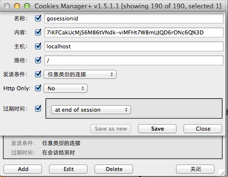

回车后，你将看到如下内容，劫持session成功：

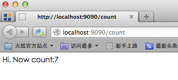

可以看到虽然换了浏览器，但是我们却获得了`sessionID`，然后模拟了`cookie`存储的过程。此时如果交替点击两个浏览器里的链接你会发现它们其实操纵的是同一个计数器。不必惊讶，此处firefox盗用了`chrome`和`goserver`之间的维持会话的钥匙，即`gosessionid`，这是一种类型的“会话劫持”

#### session劫持防范

##### cookieonly和token

通过上面session劫持的简单演示可以了解到session一旦被其他人劫持，就非常危险，劫持者可以假装成被劫持者进行很多非法操作。那么如何有效的防止session劫持呢？

其中一个解决方案就是`sessionID`的值只允许cookie设置，而不是通过URL重置方式设置，同时设置`cookie`的`httponly=true`,这个属性是设置是否可通过客户端脚本访问这个设置的cookie，第一这个可以防止这个cookie被`XSS`读取从而引起session劫持，第二cookie设置不会像URL重置方式那么容易获取`sessionID`

第二步就是在每个请求里面加上token，我们在每个请求里面加上一个隐藏的token，然后每次验证这个token，从而保证用户的请求都是唯一性

```go
h := md5.New()
salt:="astaxie%^7&8888"
io.WriteString(h,salt+time.Now().String())
token:=fmt.Sprintf("%x",h.Sum(nil))
if r.Form["token"]!=token{
    //提示登录
}
sess.Set("token",token)
```

##### 间隔生成新的SID

还有一个解决方案就是，我们给`session`额外设置一个创建时间的值，一旦过了一定的时间，我们销毁这个`sessionID`，重新生成新的`session`，这样可以一定程度上防止`session`劫持的问题

```go
createtime := sess.Get("createtime")
if createtime == nil {
    sess.Set("createtime", time.Now().Unix())
} else if (createtime.(int64) + 60) < (time.Now().Unix()) {
    globalSessions.SessionDestroy(w, r)
    sess = globalSessions.SessionStart(w, r)
}
```

`session`启动后，我们设置了一个值，用于记录生成`sessionID`的时间。通过判断每次请求是否过期(这里设置了60秒)定期生成新的ID，这样使得攻击者获取有效`sessionID`的机会大大降低

## 8 文本处理

Web开发中对于文本处理是非常重要的一部分，我们往往需要对输出或者输入的内容进行处理，这里的文本包括`字符串、数字、Json、XMl`等等。Go语言作为一门高性能的语言，对这些文本的处理都有官方的标准库来支持

### 8.1 XML处理

假如你是一名运维人员，你为你所管理的所有服务器生成了如下内容的xml的配置文件：

```go
<?xml version="1.0" encoding="utf-8"?>
<servers version="1">
    <server>
        <serverName>Shanghai_VPN</serverName>
        <serverIP>127.0.0.1</serverIP>
    </server>
    <server>
        <serverName>Beijing_VPN</serverName>
        <serverIP>127.0.0.2</serverIP>
    </server>
</servers>
```

上面的XML文档描述了两个服务器的信息，包含了服务器名和服务器的`IP`信息，接下来的Go例子以此XML描述的信息进行操作

#### 解析XML

可以通过`xml`包的`Unmarshal`函数来达到我们的目的

```go
func Unmarshal(data []byte, v interface{}) error
```

data接收的是XML数据流，v是需要输出的结构，定义为interface，也就是可以把XML转换为任意的格式

示例代码如下：

```go
package main

import (
    "encoding/xml"
    "fmt"
    "io/ioutil"
    "os"
)

type Recurlyservers struct {
    XMLName     xml.Name `xml:"servers"`
    Version     string   `xml:"version,attr"`
    Svs         []server `xml:"server"`
    Description string   `xml:",innerxml"`
}

type server struct {
    XMLName    xml.Name `xml:"server"`
    ServerName string   `xml:"serverName"`
    ServerIP   string   `xml:"serverIP"`
}

func main() {
    file, err := os.Open("servers.xml") // For read access.        
    if err != nil {
        fmt.Printf("error: %v", err)
        return
    }
    defer file.Close()
    data, err := ioutil.ReadAll(file)
    if err != nil {
        fmt.Printf("error: %v", err)
        return
    }
    v := Recurlyservers{}
    err = xml.Unmarshal(data, &v)
    if err != nil {
        fmt.Printf("error: %v", err)
        return
    }

    fmt.Println(v)
}
```

XML本质上是一种树形的数据格式，而我们可以定义与之匹配的go 语言的`struct`类型，然后通过`xml.Unmarshal`来将`xml`中的数据解析成对应的`struct`对象

```go
{{ servers} 1 [{{ server} Shanghai_VPN 127.0.0.1} {{ server} Beijing_VPN 127.0.0.2}]
<server>
    <serverName>Shanghai_VPN</serverName>
    <serverIP>127.0.0.1</serverIP>
</server>
<server>
    <serverName>Beijing_VPN</serverName>
    <serverIP>127.0.0.2</serverIP>
</server>
}
```

可以看到我们的`struct`定义后面多了一些类似于`xml:"serverName"`这样的内容，这个是`struct`的一个特性，它们被称为`struct tag`，它们是用来辅助反射的。我们来看一下`Unmarshal`的定义：

```go
func Unmarshal(data []byte, v interface{}) error
```

我们看到函数定义了两个参数，第一个是XML数据流，第二个是存储的对应类型，目前支持`struct`、`slice`和`string`，`XML`包内部采用了反射来进行数据的映射，所以`v`里面的字段必须是公共的。`Unmarshal`解析的时候`XML`元素和字段有一个优先级读取流程的，首先会读取`struct tag`，如果没有，那么就会对应字段名。必须注意一点的是解析的时候tag、字段名、XML元素都是大小写敏感的，所以必须一一对应字段。

Go语言的反射机制，可以利用这些tag信息来将来自XML文件中的数据反射成对应的`struct`对象

**解析XML到struct的时候遵循如下的规则:**

- 如果struct的一个字段是string或者[]byte类型且它的tag含有`",innerxml"`，`Unmarshal`将会将此字段所对应的元素内所有内嵌的原始xml累加到此字段上，如上面例子Description定义。最后的输出是

  ```xml
    <server>
        <serverName>Shanghai_VPN</serverName>
        <serverIP>127.0.0.1</serverIP>
    </server>
    <server>
        <serverName>Beijing_VPN</serverName>
        <serverIP>127.0.0.2</serverIP>
    </server>
  ```

- 如果`struct`中有一个叫做`XMLName`，且类型为`xml.Name`字段，那么在解析的时候就会保存这个`element`的名字到该字段,如上面例子中的servers

- 如果某个`struct`字段的`tag`定义中含有`XML`结构中`element`的名称，那么解析的时候就会把相应的`element`值赋值给该字段，如上ServerName和ServerIp定义

- 如果某个`struct`字段的`tag`定义了中含有`",attr"`，那么解析的时候就会将该结构所对应的element的与字段同名的属性的值赋值给该字段，如上version定义

- 如果某个`struct`字段的`tag`定义型如`"a>b>c"`,则解析的时候，会将xml结构a下面的b下面的c元素的值赋值给该字段

- 如果某个struct字段的tag定义了`"-"`,那么不会为该字段解析匹配任何xml数据

- 如果struct字段后面的tag定义了`",any"`，如果他的子元素在不满足其他的规则的时候就会匹配到这个字段

- 如果某个XML元素包含一条或者多条注释，那么这些注释将被累加到第一个tag含有",comments"的字段上，这个字段的类型可能是[]byte或string,如果没有这样的字段存在，那么注释将会被抛弃

> 注意： 为了正确解析，go语言的xml包要求struct定义中的所有字段必须是可导出的（即首字母大写）

#### 输出XML

xml包中提供了`Marshal`和`MarshalIndent`两个函数来生成xml文件，这两个函数主要的区别是第二个函数会增加前缀和缩进，函数的定义如下所示：

```go
func Marshal(v interface{}) ([]byte, error)
func MarshalIndent(v interface{}, prefix, indent string) ([]byte, error)
```

两个函数第一个参数是用来生成XML的结构定义类型数据，都是返回生成的XML数据流

下面我们来看一下如何输出如上的XML：

```go
package main

import (
    "encoding/xml"
    "fmt"
    "os"
)

type Servers struct {
    XMLName xml.Name `xml:"servers"`
    Version string   `xml:"version,attr"`
    Svs     []server `xml:"server"`
}

type server struct {
    ServerName string `xml:"serverName"`
    ServerIP   string `xml:"serverIP"`
}

func main() {
    v := &Servers{Version: "1"}
    v.Svs = append(v.Svs, server{"Shanghai_VPN", "127.0.0.1"})
    v.Svs = append(v.Svs, server{"Beijing_VPN", "127.0.0.2"})
    output, err := xml.MarshalIndent(v, "  ", "    ")
    if err != nil {
        fmt.Printf("error: %v\n", err)
    }
    os.Stdout.Write([]byte(xml.Header))

    os.Stdout.Write(output)
}
```

上面的代码输出如下信息：

```xml
<?xml version="1.0" encoding="UTF-8"?>
<servers version="1">
<server>
    <serverName>Shanghai_VPN</serverName>
    <serverIP>127.0.0.1</serverIP>
</server>
<server>
    <serverName>Beijing_VPN</serverName>
    <serverIP>127.0.0.2</serverIP>
</server>
</servers>
```

和我们之前定义的文件的格式一模一样，之所以会有`os.Stdout.Write([]byte(xml.Header))` 这句代码的出现，是因为`xml.MarshalIndent`或者`xml.Marshal`输出的信息都是不带XML头的，为了生成正确的xml文件，我们使用了xml包预定义的Header变量。

我们看到`Marshal`函数接收的参数v是interface{}类型的，即它可以接受任意类型的参数，那么xml包，根据什么规则来生成相应的XML文件呢？

- 如果v是 array或者slice，那么输出每一个元素，类似value
- 如果v是指针，那么会Marshal指针指向的内容，如果指针为空，什么都不输出
- 如果v是interface，那么就处理interface所包含的数据
- 如果v是其他数据类型，就会输出这个数据类型所拥有的字段信息

生成的XML文件中的element的名字又是根据什么决定的呢？元素名按照如下优先级从struct中获取：

- 如果v是struct，XMLName的tag中定义的名称
- 类型为xml.Name的名叫XMLName的字段的值
- 通过struct中字段的tag来获取
- 通过struct的字段名用来获取
- marshall的类型名称

我们应如何设置struct 中字段的tag信息以控制最终xml文件的生成呢？

- XMLName不会被输出

- tag中含有`"-"`的字段不会输出

- tag中含有`"name,attr"`，会以name作为属性名，字段值作为值输出为这个XML元素的属性，如上version字段所描述

- tag中含有`",attr"`，会以这个struct的字段名作为属性名输出为XML元素的属性，类似上一条，只是这个name默认是字段名了。

- tag中含有`",chardata"`，输出为xml的 character data而非element。

- tag中含有`",innerxml"`，将会被原样输出，而不会进行常规的编码过程

- tag中含有`",comment"`，将被当作xml注释来输出，而不会进行常规的编码过程，字段值中不能含有"--"字符串

- tag中含有`"omitempty"`,如果该字段的值为空值那么该字段就不会被输出到XML，空值包括：false、0、nil指针或nil接口，任何长度为0的array, slice, map或者string

- tag中含有`"a>b>c"`，那么就会循环输出三个元素a包含b，b包含c


### 8.2 JSON处理

`JSON（Javascript Object Notation）`是一种轻量级的数据交换语言，以文字为基础，具有自我描述性且易于让人阅读。`JSON`由于比`XML`更小、更快、更易解析，以及浏览器的内建快速解析支持，使得其更适用于网络数据传输领域

#### 解析JSON

##### 解析到结构体

Go的JSON包中有如下函数

```go
func Unmarshal(data []byte, v interface{}) error
```

通过这个函数我们就可以实现解析的目的，详细的解析例子请看如下代码：

```go
package main

import (
    "encoding/json"
    "fmt"
)

type Server struct {
    ServerName string
    ServerIP   string
}

type Serverslice struct {
    Servers []Server
}

func main() {
    var s Serverslice
    str := `{"servers":[{"serverName":"Shanghai_VPN","serverIP":"127.0.0.1"},{"serverName":"Beijing_VPN","serverIP":"127.0.0.2"}]}`
    json.Unmarshal([]byte(str), &s)
    fmt.Println(s)
}
```

在上面的示例代码中，我们首先定义了与json数据对应的结构体，数组对应slice，字段名对应JSON里面的KEY

解析json遵循以下规则：

- 首先查找tag含有`Foo`的可导出的struct字段(首字母大写)
- 其次查找字段名是`Foo`的导出字段
- 最后查找类似`FOO`或者`FoO`这样的除了首字母之外其他大小写不敏感的导出字段

**能够被赋值的字段必须是可导出字段(即首字母大写）**。同时JSON解析的时候只会解析能找得到的字段，找不到的字段会被忽略，这样的一个好处是：当你接收到一个很大的JSON数据结构而你却只想获取其中的部分数据的时候，你只需将你想要的数据对应的字段名大写

##### 解析到interface

`interface{}`可以用来存储任意数据类型的对象，这种数据结构正好用于存储解析的**未知结构的json数据**的结果。JSON包中采用`map[string]interface{}`和`[]interface{}`结构来存储任意的JSON对象和数组。Go类型和JSON类型的对应关系如下：

- bool 代表 JSON booleans,
- float64 代表 JSON numbers,
- string 代表 JSON strings,
- nil 代表 JSON null.

现在我们假设有如下的JSON数据

```go
b := []byte(`{"Name":"Wednesday","Age":6,"Parents":["Gomez","Morticia"]}`)
```

如果在我们不知道他的结构的情况下，我们把他解析到interface{}里面

```go
var f interface{}
err := json.Unmarshal(b, &f)
```

这个时候`f`里面存储了一个map类型，他们的key是string，值存储在空的interface{}里

```go
f = map[string]interface{}{
    "Name": "Wednesday",
    "Age":  6,
    "Parents": []interface{}{
        "Gomez",
        "Morticia",
    },
}
```

通过断言访问这些数据

```go
m := f.(map[string]interface{})
```

通过断言之后，你就可以通过如下方式来访问里面的数据了

```go
for k, v := range m {
    switch vv := v.(type) {
    case string:
        fmt.Println(k, "is string", vv)
    case int:
        fmt.Println(k, "is int", vv)
    case float64:
        fmt.Println(k,"is float64",vv)
    case []interface{}:
        fmt.Println(k, "is an array:")
        for i, u := range vv {
            fmt.Println(i, u)
        }
    default:
        fmt.Println(k, "is of a type I don't know how to handle")
    }
}
```

上面这个是官方提供的解决方案，其实很多时候我们通过类型断言，操作起来不是很方便，目前bitly公司开源了一个叫做`simplejson`的包,在处理未知结构体的JSON时相当方便

```go
js, err := NewJson([]byte(`{
    "test": {
        "array": [1, "2", 3],
        "int": 10,
        "float": 5.150,
        "bignum": 9223372036854775807,
        "string": "simplejson",
        "bool": true
    }
}`))

arr, _ := js.Get("test").Get("array").Array()
i, _ := js.Get("test").Get("int").Int()
ms := js.Get("test").Get("string").MustString()
```

可以看到，使用这个库操作JSON比起官方包来说，简单的多,详细的请参考如下地址：https://github.com/bitly/go-simplejson

#### 生成JSON

JSON包里面通过`Marshal`函数来生成json数据，函数定义如下：

```go
func Marshal(v interface{}) ([]byte, error)
```

请看下面的例子：

```go
package main

import (
    "encoding/json"
    "fmt"
)

type Server struct {
    ServerName string
    ServerIP   string
}

type Serverslice struct {
    Servers []Server
}

func main() {
    var s Serverslice
    s.Servers = append(s.Servers, Server{ServerName: "Shanghai_VPN", ServerIP: "127.0.0.1"})
    s.Servers = append(s.Servers, Server{ServerName: "Beijing_VPN", ServerIP: "127.0.0.2"})
    b, err := json.Marshal(s)
    if err != nil {
        fmt.Println("json err:", err)
    }
    fmt.Println(string(b))
}
```

输出如下内容：

```
{"Servers":[{"ServerName":"Shanghai_VPN","ServerIP":"127.0.0.1"},{"ServerName":"Beijing_VPN","ServerIP":"127.0.0.2"}]}
```

我们看到上面的输出字段名的首字母都是大写的，如果你想用小写的首字母怎么办呢？把结构体的字段名改成首字母小写的？JSON输出的时候必须注意，只有导出的字段才会被输出，如果修改字段名，那么就会发现什么都不会输出，所以必须通过struct tag定义来实现：

```go
type Server struct {
    ServerName string `json:"serverName"`
    ServerIP   string `json:"serverIP"`
}

type Serverslice struct {
    Servers []Server `json:"servers"`
}
```

通过修改上面的结构体定义，输出的JSON串就和我们最开始定义的JSON串保持一致了。

针对JSON的输出，我们在定义struct tag的时候需要注意的几点是:

- 字段的tag是`"-"`，那么这个字段不会输出到JSON
- tag中带有自定义名称，那么这个自定义名称会出现在JSON的字段名中，例如上面例子中serverName
- tag中如果带有`"omitempty"`选项，那么如果该字段值为空，就不会输出到JSON串中
- 如果字段类型是bool, string, int, int64等，而tag中带有`",string"`选项，那么这个字段在输出到JSON的时候会把该字段对应的值转换成JSON字符串

Marshal函数只有在转换成功的时候才会返回数据，在转换的过程中我们需要注意几点：

- JSON对象只支持string作为key，所以要编码一个map，那么必须是map[string]T这种类型(T是Go语言中任意的类型)
- Channel, complex和function是不能被编码成JSON的
- 嵌套的数据是不能编码的，不然会让JSON编码进入死循环
- 指针在编码的时候会输出指针指向的内容，而空指针会输出null

### 8.3 正则处理

正则表达式是一种进行模式匹配和文本操纵的复杂而又强大的工具。虽然正则表达式比纯粹的文本匹配效率低，但是它却更灵活。按照它的语法规则，随需构造出的匹配模式就能够从原始文本中筛选出几乎任何想你要得到的字符组合。如果你在Web开发中需要从一些文本数据源中获取数据,那么你只需要按照它的语法规则，随需构造出正确的模式字符串就能够从原数据源提取出有意义的文本信息。

Go语言通过`regexp`标准包为正则表达式提供了官方支持，如果你已经使用过其他编程语言提供的正则相关功能，那么你应该对Go语言版本的不会太陌生，但是它们之间也有一些小的差异，因为Go实现的是`RE2`标准，除了\C，详细的语法描述参考：`http://code.google.com/p/re2/wiki/Syntax`

其实字符串处理我们可以使用`strings`包来进行搜索(Contains、Index)、替换(Replace)和解析(Split、Join)等操作，但是这些都是简单的字符串操作，他们的搜索都是大小写敏感，而且固定的字符串，如果我们需要匹配可变的那种就没办法实现了，当然如果`strings`包能解决你的问题，那么就尽量使用它来解决。因为他们足够简单、而且性能和可读性都会比正则好。

如果你还记得，在前面表单验证的小节里，我们已经接触过正则处理，在那里我们利用了它来验证输入的信息是否满足某些预设的条件。在使用中需要注意的一点就是：所有的字符都是`UTF-8`编码的

#### 通过正则判断是否匹配

`regexp`包中含有三个函数用来判断是否匹配，如果匹配返回true，否则返回false

```go
func Match(pattern string, b []byte) (matched bool, error error)
func MatchReader(pattern string, r io.RuneReader) (matched bool, error error)
func MatchString(pattern string, s string) (matched bool, error error)
```

上面的三个函数实现了同一个功能，就是判断`pattern`是否和输入源匹配，匹配的话就返回true，如果解析正则出错则返回error

如果要验证一个输入是不是IP地址，那么如何来判断呢？请看如下实现

```go
func IsIP(ip string) (b bool) {
    if m, _ := regexp.MatchString("^[0-9]{1,3}\\.[0-9]{1,3}\\.[0-9]{1,3}\\.[0-9]{1,3}$", ip); !m 	{
        return false
    }
    return true
}
```

当用户输入一个字符串，我们想知道是不是一次合法的输入：

```go
func main() {
    if len(os.Args) == 1 {
        fmt.Println("Usage: regexp [string]")
        os.Exit(1)
    } else if m, _ := regexp.MatchString("^[0-9]+$", os.Args[1]); m {
        fmt.Println("数字")
    } else {
        fmt.Println("不是数字")
    }
}
```

#### 通过正则获取内容

`Match`模式只能用来对字符串的判断，而无法截取字符串的一部分、过滤字符串、或者提取出符合条件的一批字符串。如果想要满足这些需求，那就需要使用正则表达式的复杂模式。

我们经常需要一些爬虫程序，下面就以爬虫为例来说明如何使用正则来过滤或截取抓取到的数据：

```go
package main

import (
    "fmt"
    "io/ioutil"
    "net/http"
    "regexp"
    "strings"
)

func main() {
    resp, err := http.Get("http://www.baidu.com")
    if err != nil {
        fmt.Println("http get error.")
    }
    defer resp.Body.Close()
    body, err := ioutil.ReadAll(resp.Body)
    if err != nil {
        fmt.Println("http read error")
        return
    }

    src := string(body)

    //将HTML标签全转换成小写
    re, _ := regexp.Compile("\\<[\\S\\s]+?\\>")
    src = re.ReplaceAllStringFunc(src, strings.ToLower)

    //去除STYLE
    re, _ = regexp.Compile("\\<style[\\S\\s]+?\\</style\\>")
    src = re.ReplaceAllString(src, "")

    //去除SCRIPT
    re, _ = regexp.Compile("\\<script[\\S\\s]+?\\</script\\>")
    src = re.ReplaceAllString(src, "")

    //去除所有尖括号内的HTML代码，并换成换行符
    re, _ = regexp.Compile("\\<[\\S\\s]+?\\>")
    src = re.ReplaceAllString(src, "\n")

    //去除连续的换行符
    re, _ = regexp.Compile("\\s{2,}")
    src = re.ReplaceAllString(src, "\n")

    fmt.Println(strings.TrimSpace(src))
}
```

解析正则表达式的有如下几个方法：

```go
func Compile(expr string) (*Regexp, error)
func CompilePOSIX(expr string) (*Regexp, error)
func MustCompile(str string) *Regexp
func MustCompilePOSIX(str string) *Regexp
```

`CompilePOSIX`和`Compile`的不同点在于`POSIX`必须使用`POSIX`语法，它使用最左最长方式搜索，而Compile采用的则是最左方式搜索(例如[a-z]{2,4}这样一个正则表达式，应用于"aa09aaa88aaaa"这个文本串时，CompilePOSIX返回了aaaa，而Compile的返回的是aa)。前缀有Must的函数表示，在解析正则语法的时候，如果匹配模式串不满足正确的语法则直接panic，而不加Must的则只是返回错误

在了解了如何新建一个`Regexp`之后，我们再来看一下这个struct提供了哪些方法来辅助我们操作字符串，首先我们来看下面这些用来搜索的函数：

```go
func (re *Regexp) Find(b []byte) []byte
func (re *Regexp) FindAll(b []byte, n int) [][]byte
func (re *Regexp) FindAllIndex(b []byte, n int) [][]int
func (re *Regexp) FindAllString(s string, n int) []string
func (re *Regexp) FindAllStringIndex(s string, n int) [][]int
func (re *Regexp) FindAllStringSubmatch(s string, n int) [][]string
func (re *Regexp) FindAllStringSubmatchIndex(s string, n int) [][]int
func (re *Regexp) FindAllSubmatch(b []byte, n int) [][][]byte
func (re *Regexp) FindAllSubmatchIndex(b []byte, n int) [][]int
func (re *Regexp) FindIndex(b []byte) (loc []int)
func (re *Regexp) FindReaderIndex(r io.RuneReader) (loc []int)
func (re *Regexp) FindReaderSubmatchIndex(r io.RuneReader) []int
func (re *Regexp) FindString(s string) string
func (re *Regexp) FindStringIndex(s string) (loc []int)
func (re *Regexp) FindStringSubmatch(s string) []string
func (re *Regexp) FindStringSubmatchIndex(s string) []int
func (re *Regexp) FindSubmatch(b []byte) [][]byte
func (re *Regexp) FindSubmatchIndex(b []byte) []int
```

上面这18个函数我们根据输入源(byte slice、string和io.RuneReader)不同还可以继续简化成如下几个，其他的只是输入源不一样，其他功能基本是一样的：

```go
func (re *Regexp) Find(b []byte) []byte
func (re *Regexp) FindAll(b []byte, n int) [][]byte
func (re *Regexp) FindAllIndex(b []byte, n int) [][]int
func (re *Regexp) FindAllSubmatch(b []byte, n int) [][][]byte
func (re *Regexp) FindAllSubmatchIndex(b []byte, n int) [][]int
func (re *Regexp) FindIndex(b []byte) (loc []int)
func (re *Regexp) FindSubmatch(b []byte) [][]byte
func (re *Regexp) FindSubmatchIndex(b []byte) []int
```

对于这些函数的使用我们来看下面这个例子

```go
package main

import (
    "fmt"
    "regexp"
)

func main() {
    a := "I am learning Go language"

    re, _ := regexp.Compile("[a-z]{2,4}")

    //查找符合正则的第一个
    one := re.Find([]byte(a))
    fmt.Println("Find:", string(one))

    //查找符合正则的所有slice,n小于0表示返回全部符合的字符串，不然就是返回指定的长度
    all := re.FindAll([]byte(a), -1)
    fmt.Println("FindAll", all)

    //查找符合条件的index位置,开始位置和结束位置
    index := re.FindIndex([]byte(a))
    fmt.Println("FindIndex", index)

    //查找符合条件的所有的index位置，n同上
    allindex := re.FindAllIndex([]byte(a), -1)
    fmt.Println("FindAllIndex", allindex)

    re2, _ := regexp.Compile("am(.*)lang(.*)")

    //查找Submatch,返回数组，第一个元素是匹配的全部元素，第二个元素是第一个()里面的，第三个是第二个()里面的
    //下面的输出第一个元素是"am learning Go language"
    //第二个元素是" learning Go "，注意包含空格的输出
    //第三个元素是"uage"
    submatch := re2.FindSubmatch([]byte(a))
    fmt.Println("FindSubmatch", submatch)
    for _, v := range submatch {
        fmt.Println(string(v))
    }

    //定义和上面的FindIndex一样
    submatchindex := re2.FindSubmatchIndex([]byte(a))
    fmt.Println(submatchindex)

    //FindAllSubmatch,查找所有符合条件的子匹配
    submatchall := re2.FindAllSubmatch([]byte(a), -1)
    fmt.Println(submatchall)

    //FindAllSubmatchIndex,查找所有字匹配的index
    submatchallindex := re2.FindAllSubmatchIndex([]byte(a), -1)
    fmt.Println(submatchallindex)
}
```

前面介绍过匹配函数，`Regexp`也定义了三个函数，它们和同名的外部函数功能一模一样

```go
func (re *Regexp) Match(b []byte) bool
func (re *Regexp) MatchReader(r io.RuneReader) bool
func (re *Regexp) MatchString(s string) bool
```

替换函数

```go
func (re *Regexp) ReplaceAll(src, repl []byte) []byte
func (re *Regexp) ReplaceAllFunc(src []byte, repl func([]byte) []byte) []byte
func (re *Regexp) ReplaceAllLiteral(src, repl []byte) []byte
func (re *Regexp) ReplaceAllLiteralString(src, repl string) string
func (re *Regexp) ReplaceAllString(src, repl string) string
func (re *Regexp) ReplaceAllStringFunc(src string, repl func(string) string) string
```

接下来我们看一下Expand的解释：

```go
func (re *Regexp) Expand(dst []byte, template []byte, src []byte, match []int) []byte
func (re *Regexp) ExpandString(dst []byte, template string, src string, match []int) []byte
```

那么这个Expand到底用来干嘛的呢？请看下面的例子：

```go
func main() {
    src := []byte(`
        call hello alice
        hello bob
        call hello eve
    `)
    pat := regexp.MustCompile(`(?m)(call)\s+(?P<cmd>\w+)\s+(?P<arg>.+)\s*$`)
    res := []byte{}
    for _, s := range pat.FindAllSubmatchIndex(src, -1) {
        res = pat.Expand(res, []byte("$cmd('$arg')\n"), src, s)
    }
    fmt.Println(string(res))
}
```

### 8.4 模板处理

#### 什么是模板

`MVC`设计模式，Model处理数据，View展现结果，Controller控制用户的请求，至于View层的处理，在很多动态语言里面都是通过在静态HTML中插入动态语言生成的数据

通过下面这个图可以说明模板的机制


#### Go模板使用

在Go语言中，我们使用`template`包来进行模板处理，使用类似`Parse`、`ParseFile`、`Execute`等方法从文件或者字符串加载模板，然后执行类似上面图片展示的模板的merge操作

```go
func handler(w http.ResponseWriter, r *http.Request) {
    t := template.New("some template") //创建一个模板
    t, _ = t.ParseFiles("tmpl/welcome.html", nil)  //解析模板文件
    user := GetUser() //获取当前用户信息
    t.Execute(w, user)  //执行模板的merger操作
}
```

为了演示和测试代码的方便，我们在接下来的例子中采用如下格式的代码

- 使用Parse代替`ParseFiles`，因为Parse可以直接测试一个字符串，而不需要额外的文件
- 不使用handler来写演示代码，而是每个测试一个main，方便测试
- 使用`os.Stdout`代替`http.ResponseWriter`，因为`os.Stdout`实现了`io.Writer`接口

#### 模板中如何插入数据？

##### 字段操作

Go语言的模板通过`{{}}`来包含需要在渲染时被替换的字段，`{{.}}`表示当前的对象，这和Java或者C++中的this类似，如果要访问当前对象的字段通过`{{.FieldName}}`,但是需要注意一点：**这个字段必须是导出的(字段首字母必须是大写的)**

```go
package main

import (
    "html/template"
    "os"
)

type Person struct {
    UserName string
}

func main() {
    t := template.New("fieldname example")
    t, _ = t.Parse("hello {{.UserName}}!")
    p := Person{UserName: "Astaxie"}
    t.Execute(os.Stdout, p)
}
```

上面的代码我们可以正确的输出`hello Astaxie`，**如果在模板中含有了未导出的字段，那么就会报错，如果我们调用了一个不存在的字段是不会报错的，而是输出为空**

如果模板中输出`{{.}}`，这个一般应用于字符串对象，默认会调用`fmt`包输出字符串的内容

##### 输出嵌套字段内容

使用`{{with …}}…{{end}}`和`{{range …}}{{end}}`来进行嵌套数据的输出

- {{range}} 这个和Go语法里面的range类似，循环操作数据
- {{with}}操作是指当前对象的值，类似上下文的概念

详细的使用请看下面的例子：

```go
package main

import (
    "html/template"
    "os"
)

type Friend struct {
    Fname string
}

type Person struct {
    UserName string
    Emails   []string
    Friends  []*Friend
}

func main() {
    f1 := Friend{Fname: "minux.ma"}
    f2 := Friend{Fname: "xushiwei"}
    t := template.New("fieldname example")
    t, _ = t.Parse(`hello {{.UserName}}!
            {{range .Emails}}
                an email {{.}}
            {{end}}
            {{with .Friends}}
            {{range .}}
                my friend name is {{.Fname}}
            {{end}}
            {{end}}
            `)
    p := Person{UserName: "Astaxie",
        Emails:  []string{"astaxie@beego.me", "astaxie@gmail.com"},
        Friends: []*Friend{&f1, &f2}}
    t.Execute(os.Stdout, p)
}
```

##### 条件处理

可以使用和Go语言的`if-else`语法类似的方式来处理，如果pipeline为空，那么if就认为是false

```go
package main

import (
    "os"
    "text/template"
)

func main() {
    tEmpty := template.New("template test")
    tEmpty = template.Must(tEmpty.Parse("空 pipeline if demo: {{if ``}} 不会输出. {{end}}\n"))
    tEmpty.Execute(os.Stdout, nil)

    tWithValue := template.New("template test")
    tWithValue = template.Must(tWithValue.Parse("不为空的 pipeline if demo: {{if `anything`}} 我有内容，我会输出. {{end}}\n"))
    tWithValue.Execute(os.Stdout, nil)

    tIfElse := template.New("template test")
    tIfElse = template.Must(tIfElse.Parse("if-else demo: {{if `anything`}} if部分 {{else}} else部分.{{end}}\n"))
    tIfElse.Execute(os.Stdout, nil)
}
```

> 注意：if里面无法使用条件判断，例如.Mail=="astaxie@gmail.com"，这样的判断是不正确的，if里面只能是bool值

##### pipelines

Go语言模板最强大的一点就是支持pipe数据，在Go语言里面任何`{{}}`里面的都是pipelines数据

```go
{{. | html}}
```

在email输出的地方我们可以采用如上方式可以把输出全部转化HTML的实体

##### 模板变量

可以在一些操作中申明局部变量，例如`with``range``if`过程中申明局部变量，这个变量的作用域是`{{end}}`之前，Go语言通过申明的局部变量格式如下所示：

```go
$variable := pipeline
```

详细的例子看下面的：

```go
{{with $x := "output" | printf "%q"}}{{$x}}{{end}}
{{with $x := "output"}}{{printf "%q" $x}}{{end}}
{{with $x := "output"}}{{$x | printf "%q"}}{{end}}
```

##### 模板函数

模板在输出对象的字段值时，采用了`fmt`包把对象转化成了字符串。但是有时候我们的需求可能不是这样的，例如有时候我们为了防止垃圾邮件发送者通过采集网页的方式来发送给我们的邮箱信息，我们希望把`@`替换成`at`例如：`astaxie at beego.me`，如果要实现这样的功能，我们就需要自定义函数来做这个功能。

每一个模板函数都有一个唯一值的名字，然后与一个Go函数关联，通过如下的方式来关联

```go
type FuncMap map[string]interface{}
```

例如，如果我们想要的email函数的模板函数名是`emailDeal`，它关联的Go函数名称是`EmailDealWith`,那么我们可以通过下面的方式来注册这个函数

```go
t = t.Funcs(template.FuncMap{"emailDeal": EmailDealWith})
```

`EmailDealWith`这个函数的参数和返回值定义如下：

```go
func EmailDealWith(args …interface{}) string
```

我们来看下面的实现例子：

```go
package main

import (
    "fmt"
    "html/template"
    "os"
    "strings"
)

type Friend struct {
    Fname string
}

type Person struct {
    UserName string
    Emails   []string
    Friends  []*Friend
}

func EmailDealWith(args ...interface{}) string {
    ok := false
    var s string
    if len(args) == 1 {
        s, ok = args[0].(string)
    }
    if !ok {
        s = fmt.Sprint(args...)
    }
    // find the @ symbol
    substrs := strings.Split(s, "@")
    if len(substrs) != 2 {
        return s
    }
    // replace the @ by " at "
    return (substrs[0] + " at " + substrs[1])
}

func main() {
    f1 := Friend{Fname: "minux.ma"}
    f2 := Friend{Fname: "xushiwei"}
    t := template.New("fieldname example")
    t = t.Funcs(template.FuncMap{"emailDeal": EmailDealWith})
    t, _ = t.Parse(`hello {{.UserName}}!
                {{range .Emails}}
                    an emails {{.|emailDeal}}
                {{end}}
                {{with .Friends}}
                {{range .}}
                    my friend name is {{.Fname}}
                {{end}}
                {{end}}
                `)
    p := Person{UserName: "Astaxie",
        Emails:  []string{"astaxie@beego.me", "astaxie@gmail.com"},
        Friends: []*Friend{&f1, &f2}}
    t.Execute(os.Stdout, p)
}
```

模板包内置实现函数

```go
var builtins = FuncMap{
    "and":      and,
    "call":     call,
    "html":     HTMLEscaper,
    "index":    index,
    "js":       JSEscaper,
    "len":      length,
    "not":      not,
    "or":       or,
    "print":    fmt.Sprint,
    "printf":   fmt.Sprintf,
    "println":  fmt.Sprintln,
    "urlquery": URLQueryEscaper,
}
```

#### Must操作

模板包里面有一个函数`Must`，它的作用是检测模板是否正确

```go
package main

import (
    "fmt"
    "text/template"
)

func main() {
    tOk := template.New("first")
    template.Must(tOk.Parse(" some static text /* and a comment */"))
    fmt.Println("The first one parsed OK.")

    template.Must(template.New("second").Parse("some static text {{ .Name }}"))
    fmt.Println("The second one parsed OK.")

    fmt.Println("The next one ought to fail.")
    tErr := template.New("check parse error with Must")
    template.Must(tErr.Parse(" some static text {{ .Name }"))
}
```

讲输出如下内容

```
The first one parsed OK.
The second one parsed OK.
The next one ought to fail.
panic: template: check parse error with Must:1: unexpected "}" in command
```

#### 嵌套模板

我们平常开发Web应用的时候，经常会遇到一些模板有些部分是固定不变的，然后可以抽取出来作为一个独立的部分，例如一个博客的头部和尾部是不变的，而唯一改变的是中间的内容部分。所以我们可以定义成`header`、`content`、`footer`三个部分。Go语言中通过如下的语法来申明

```go
{{define "子模板名称"}}内容{{end}}
```

通过如下方式来调用：

```go
{{template "子模板名称"}}
```

我们定义三个文件，`header.tmpl`、`content.tmpl`、`footer.tmpl`文件，里面的内容如下

```
//header.tmpl
{{define "header"}}
<html>
<head>
    <title>演示信息</title>
</head>
<body>
{{end}}

//content.tmpl
{{define "content"}}
{{template "header"}}
<h1>演示嵌套</h1>
<ul>
    <li>嵌套使用define定义子模板</li>
    <li>调用使用template</li>
</ul>
{{template "footer"}}
{{end}}

//footer.tmpl
{{define "footer"}}
</body>
</html>
{{end}}
```

演示代码如下：

```go
package main

import (
    "fmt"
    "os"
    "text/template"
)

func main() {
    s1, _ := template.ParseFiles("header.tmpl", "content.tmpl", "footer.tmpl")
    s1.ExecuteTemplate(os.Stdout, "header", nil)
    fmt.Println()
    s1.ExecuteTemplate(os.Stdout, "content", nil)
    fmt.Println()
    s1.ExecuteTemplate(os.Stdout, "footer", nil)
    fmt.Println()
    s1.Execute(os.Stdout, nil)
}
```

通过上面的例子我们可以看到通过`template.ParseFiles`把所有的嵌套模板全部解析到模板里面，其实每一个定义的{{define}}都是一个独立的模板，他们相互独立，是并行存在的关系，内部其实存储的是类似map的一种关系(key是模板的名称，value是模板的内容)，然后我们通过`ExecuteTemplate`来执行相应的子模板内容，我们可以看到header、footer都是相对独立的，都能输出内容，content 中因为嵌套了header和footer的内容，就会同时输出三个的内容。但是当我们执行`s1.Execute`，没有任何的输出，因为在默认的情况下没有默认的子模板，所以不会输出任何的东西。

> 同一个集合类的模板是互相知晓的，如果同一模板被多个集合使用，则它需要在多个集合中分别解析

### 8.5 文件操作

#### 目录操作

文件操作的大多数函数都是在`os`包里面，下面列举了几个目录操作的：

- func Mkdir(name string, perm FileMode) error

  创建名称为name的目录，权限设置是perm，例如0777

- func MkdirAll(path string, perm FileMode) error

  根据path创建多级子目录，例如astaxie/test1/test2。

- func Remove(name string) error

  删除名称为name的目录，当目录下有文件或者其他目录是会出错

- func RemoveAll(path string) error

  根据path删除多级子目录，如果path是单个名称，那么该目录下的子目录全部删除

```go
package main

import (
    "fmt"
    "os"
)

func main() {
    os.Mkdir("astaxie", 0777)
    os.MkdirAll("astaxie/test1/test2", 0777)
    err := os.Remove("astaxie")
    if err != nil {
        fmt.Println(err)
    }
    os.RemoveAll("astaxie")
}
```

#### 文件操作

##### 建立与打开文件

新建文件可以通过如下两个方法

- func Create(name string) (file *File, err Error)

  根据提供的文件名创建新的文件，返回一个文件对象，默认权限是0666的文件，返回的文件对象是可读写的

- func NewFile(fd uintptr, name string) *File

  根据文件描述符创建相应的文件，返回一个文件对象

通过如下两个方法来打开文件：

- func Open(name string) (file *File, err Error)

  该方法打开一个名称为name的文件，但是是只读方式，内部实现其实调用了OpenFile。

- func OpenFile(name string, flag int, perm uint32) (file *File, err Error)

  打开名称为name的文件，flag是打开的方式，只读、读写等，perm是权限

##### 写文件

写文件函数：

- func (file *File) Write(b []byte) (n int, err Error)

  写入byte类型的信息到文件

- func (file *File) WriteAt(b []byte, off int64) (n int, err Error)

  在指定位置开始写入byte类型的信息

- func (file *File) WriteString(s string) (ret int, err Error)

  写入string信息到文件

写文件的示例代码

```go
package main

import (
    "fmt"
    "os"
)

func main() {
    userFile := "astaxie.txt"
    fout, err := os.Create(userFile)        
    if err != nil {
        fmt.Println(userFile, err)
        return
    }
    defer fout.Close()
    for i := 0; i < 10; i++ {
        fout.WriteString("Just a test!\r\n")
        fout.Write([]byte("Just a test!\r\n"))
    }
}
```

##### 读文件

读文件函数：

- func (file *File) Read(b []byte) (n int, err Error)

  读取数据到b中

- func (file *File) ReadAt(b []byte, off int64) (n int, err Error)

  从off开始读取数据到b中

```go
package main

import (
    "fmt"
    "os"
)

func main() {
    userFile := "asatxie.txt"
    fl, err := os.Open(userFile)        
    if err != nil {
        fmt.Println(userFile, err)
        return
    }
    defer fl.Close()
    buf := make([]byte, 1024)
    for {
        n, _ := fl.Read(buf)
        if 0 == n {
            break
        }
        os.Stdout.Write(buf[:n])
    }
}
```

##### 删除文件

Go语言里面删除文件和删除文件夹是同一个函数

- func Remove(name string) Error

  调用该函数就可以删除文件名为name的文件

### 8.6 字符串处理

#### 字符串操作

下面这些函数来自于strings包，这里是一些我平常经常用到的函数

- `func Contains(s, substr string) bool`

  字符串`s`中是否包含`substr`，返回`bool`值

  ```go
    fmt.Println(strings.Contains("seafood", "foo"))
    fmt.Println(strings.Contains("seafood", "bar"))
    fmt.Println(strings.Contains("seafood", ""))
    fmt.Println(strings.Contains("", ""))
    //Output:
    //true
    //false
    //true
    //true
  ```

- `func Join(a []string, sep string) string`

  字符串链接，把`slice a`通过`sep`链接起来

  ```go
    s := []string{"foo", "bar", "baz"}
    fmt.Println(strings.Join(s, ", "))
    //Output:foo, bar, baz      
  ```

- `func Index(s, sep string) int`

  在字符串`s`中查找`sep`所在的位置，返回位置值，找不到返回-1

  ```go
    fmt.Println(strings.Index("chicken", "ken"))
    fmt.Println(strings.Index("chicken", "dmr"))
    //Output:4
    //-1
  ```

- `func Repeat(s string, count int) string`

  重复`s`字符串`count`次，最后返回重复的字符串

  ```go
    fmt.Println("ba" + strings.Repeat("na", 2))
    //Output:banana
  ```

- `func Replace(s, old, new string, n int) string`

  在`s`字符串中，把`old`字符串替换为`new`字符串，`n`表示替换的次数，小于0表示全部替换

  ```go
    fmt.Println(strings.Replace("oink oink oink", "k", "ky", 2))
    fmt.Println(strings.Replace("oink oink oink", "oink", "moo", -1))
    //Output:oinky oinky oink
    //moo moo moo
  ```

- `func Split(s, sep string) []string`

  把`s`字符串按照`sep`分割，返回`slice`

  ```go
    fmt.Printf("%q\n", strings.Split("a,b,c", ","))
    fmt.Printf("%q\n", strings.Split("a man a plan a canal panama", "a "))
    fmt.Printf("%q\n", strings.Split(" xyz ", ""))
    fmt.Printf("%q\n", strings.Split("", "Bernardo O'Higgins"))
    //Output:["a" "b" "c"]
    //["" "man " "plan " "canal panama"]
    //[" " "x" "y" "z" " "]
    //[""]
  ```

- `func Trim(s string, cutset string) string`

  在`s`字符串的头部和尾部去除`cutset`指定的字符串

  ```go
    fmt.Printf("[%q]", strings.Trim(" !!! Achtung !!! ", "! "))
    //Output:["Achtung"]
  ```

- `func Fields(s string) []string`

  去除`s`字符串的空格符，并且按照空格分割返回`slice`

  ```go
    fmt.Printf("Fields are: %q", strings.Fields("  foo bar  baz   "))
    //Output:Fields are: ["foo" "bar" "baz"]
  ```

#### 字符串转换

字符串转化的函数在`strconv`中，如下也只是一些常用的：

- `Append` 系列函数将整数等转换为字符串后，添加到现有的字节数组中

  ```go
    package main
  
    import (
        "fmt"
        "strconv"
    )
  
    func main() {
        str := make([]byte, 0, 100)
        //第一个参数是：需要追加的数组，第二个参数是：要追加的值，第三个参数是：该整数的进制
        //此处追加的是10进制，如果是2，则追加的是2进制
        str = strconv.AppendInt(str, 4567, 10)
        str = strconv.AppendBool(str, false)
        str = strconv.AppendQuote(str, "abcdefg")
        str = strconv.AppendQuoteRune(str, '单')
        fmt.Println(string(str))
    }
  ```

- `Format` 系列函数把其他类型的转换为字符串

  ```go
    package main

    import (
        "fmt"
        "strconv"
    )

    func main() {
        a := strconv.FormatBool(false)
        b := strconv.FormatFloat(123.23, 'g', 12, 64)
        c := strconv.FormatInt(1234, 10)
        d := strconv.FormatUint(12345, 10)
        e := strconv.Itoa(1023)
        fmt.Println(a, b, c, d, e)
    }
  ```

- `Parse` 系列函数把字符串转换为其他类型

  ```go
    package main

    import (
        "fmt"
        "strconv"
    )
    func checkError(e error){
        if e != nil{
            fmt.Println(e)
        }
    }
    func main() {
        a, err := strconv.ParseBool("false")
        checkError(err)
        b, err := strconv.ParseFloat("123.23", 64)
        checkError(err)
        c, err := strconv.ParseInt("1234", 10, 64)
        checkError(err)
        d, err := strconv.ParseUint("12345", 10, 64)
        checkError(err)
        e, err := strconv.Atoi("1023")
        checkError(err)
        fmt.Println(a, b, c, d, e)
    }
  ```

## 9 Web服务

Web服务可以让你在HTTP协议的基础上通过XML或者JSON来交换信息，Web服务背后的关键在于平台的无关性，目前主流的有如下几种Web服务：REST、SOAP

`REST`请求是很直观的，因为REST是基于HTTP协议的一个补充，他的每一次请求都是一个HTTP请求，然后根据不同的method来处理不同的逻辑

`SOAP`是W3C在跨网络信息传递和远程计算机函数调用方面的一个标准

### 9.1 Socket编程

在很多底层网络应用开发者的眼里一切编程都是Socket，话虽然有点夸张，但却也几乎如此了，现在的网络编程几乎都是用Socket来编程。

#### 什么是Socket？

Socket起源于Unix，而Unix基本哲学之一就是“一切皆文件”，都可以用“打开open –> 读写write/read –> 关闭close”模式来操作。Socket就是该模式的一个实现，网络的Socket数据传输是一种特殊的I/O，Socket也是一种文件描述符。Socket也具有一个类似于打开文件的函数调用：Socket()，该函数返回一个整型的Socket描述符，随后的连接建立、数据传输等操作都是通过该Socket实现的。

常用的Socket类型有两种：流式`Socket（SOCK_STREAM）`和数据报式`Socket（SOCK_DGRAM）`。流式是一种面向连接的Socket，针对于面向连接的TCP服务应用；数据报式Socket是一种无连接的Socket，对应于无连接的UDP服务应用

#### Socket如何通信

网络中的进程之间如何通过Socket通信呢？首要解决的问题是如何唯一标识一个进程，否则通信无从谈起！在本地可以通过进程PID来唯一标识一个进程，但是在网络中这是行不通的。其实TCP/IP协议族已经帮我们解决了这个问题，网络层的`IP地址`可以唯一标识网络中的主机，而传输层的`协议+端口`可以唯一标识主机中的应用程序（进程）。这样利用三元组（IP地址，协议，端口）就可以标识网络的进程了，网络中需要互相通信的进程，就可以利用这个标志在他们之间进行交互。请看下面这个TCP/IP协议结构图


使用`TCP/IP`协议的应用程序通常采用应用编程接口：UNIX BSD的套接字（socket），来实现网络进程之间的通信

#### Socket基础知识

通过上面的介绍我们知道Socket有两种：TCP Socket和UDP Socket，TCP和UDP是协议，而要确定一个进程的需要三元组，需要IP地址和端口。

##### IPv4地址

目前的全球因特网所采用的协议族是TCP/IP协议。IP是TCP/IP协议中网络层的协议，是TCP/IP协议族的核心协议。目前主要采用的IP协议的版本号是4(简称为IPv4)，发展至今已经使用了30多年。

IPv4的地址位数为32位，也就是最多有2的32次方的网络设备可以联到Internet上。近十年来由于互联网的蓬勃发展，IP位址的需求量愈来愈大，使得IP位址的发放愈趋紧张，前一段时间，据报道IPV4的地址已经发放完毕，我们公司目前很多服务器的IP都是一个宝贵的资源。

地址格式类似这样：127.0.0.1 172.122.121.111

##### IPv6地址

IPv6是下一版本的互联网协议，也可以说是下一代互联网的协议，它是为了解决IPv4在实施过程中遇到的各种问题而被提出的，IPv6采用128位地址长度，几乎可以不受限制地提供地址。按保守方法估算IPv6实际可分配的地址，整个地球的每平方米面积上仍可分配1000多个地址。在IPv6的设计过程中除了一劳永逸地解决了地址短缺问题以外，还考虑了在IPv4中解决不好的其它问题，主要有端到端IP连接、服务质量（QoS）、安全性、多播、移动性、即插即用等。

地址格式类似这样：2002:c0e8:82e7:0:0:0:c0e8:82e7

##### Go支持的IP类型

在Go的`net`包中定义了很多类型、函数和方法用来网络编程，其中IP的定义如下：

```go
type IP []byte
```

在`net`包中有很多函数来操作`IP`，但是其中比较有用的也就几个，其中`ParseIP(s string) IP`函数会把一个`IPv4`或者`IPv6`的地址转化成`IP`类型，请看下面的例子:

```go
package main
import (
    "net"
    "os"
    "fmt"
)
func main() {
    if len(os.Args) != 2 {
        fmt.Fprintf(os.Stderr, "Usage: %s ip-addr\n", os.Args[0])
        os.Exit(1)
    }
    name := os.Args[1]
    addr := net.ParseIP(name)
    if addr == nil {
        fmt.Println("Invalid address")
    } else {
        fmt.Println("The address is ", addr.String())
    }
    os.Exit(0)
}
```

#### TCP Socket

通过向远端某台机器的的某个网络端口发送一个请求，然后得到在机器的此端口上监听的服务反馈的信息。作为服务端，我们需要把服务绑定到某个指定端口，并且在此端口上监听，当有客户端来访问时能够读取信息并且写入反馈信息

在Go语言的`net`包中有一个类型`TCPConn`，这个类型可以用来作为客户端和服务器端交互的通道，他有两个主要的函数：

```go
func (c *TCPConn) Write(b []byte) (n int, err os.Error)
func (c *TCPConn) Read(b []byte) (n int, err os.Error)
```

`TCPConn`可以用在客户端和服务器端来读写数据

还有我们需要知道一个`TCPAddr`类型，他表示一个TCP的地址信息，他的定义如下：

```go
type TCPAddr struct {
    IP IP
    Port int
}
```

在Go语言中通过`ResolveTCPAddr`获取一个`TCPAddr`

```go
func ResolveTCPAddr(net, addr string) (*TCPAddr, os.Error)
```

- net参数是"tcp4"、"tcp6"、"tcp"中的任意一个，分别表示TCP(IPv4-only),TCP(IPv6-only)或者TCP(IPv4,IPv6的任意一个).
- addr表示域名或者IP地址，例如"www.google.com:80" 或者"127.0.0.1:22".

##### TCP client

Go语言中通过net包中的`DialTCP`函数来建立一个TCP连接，并返回一个`TCPConn`类型的对象，当连接建立时服务器端也创建一个同类型的对象，此时客户端和服务器段通过各自拥有的`TCPConn`对象来进行数据交换。一般而言，客户端通过`TCPConn`对象将请求信息发送到服务器端，读取服务器端响应的信息。服务器端读取并解析来自客户端的请求，并返回应答信息，这个连接只有当任一端关闭了连接之后才失效，不然这连接可以一直在使用。建立连接的函数定义如下：

```
func DialTCP(net string, laddr, raddr *TCPAddr) (c *TCPConn, err os.Error)
```

- net参数是"tcp4"、"tcp6"、"tcp"中的任意一个，分别表示TCP(IPv4-only)、TCP(IPv6-only)或者TCP(IPv4,IPv6的任意一个)
- laddr表示本机地址，一般设置为nil
- raddr表示远程的服务地址

接下来我们写一个简单的例子，模拟一个基于HTTP协议的客户端请求去连接一个Web服务端。我们要写一个简单的http请求头，格式类似如下：

```
"HEAD / HTTP/1.0\r\n\r\n"
```

从服务端接收到的响应信息格式可能如下：

```
HTTP/1.0 200 OK
ETag: "-9985996"
Last-Modified: Thu, 25 Mar 2010 17:51:10 GMT
Content-Length: 18074
Connection: close
Date: Sat, 28 Aug 2010 00:43:48 GMT
Server: lighttpd/1.4.23
```

我们的客户端代码如下所示：

```
package main

import (
    "fmt"
    "io/ioutil"
    "net"
    "os"
)

func main() {
    if len(os.Args) != 2 {
        fmt.Fprintf(os.Stderr, "Usage: %s host:port ", os.Args[0])
        os.Exit(1)
    }
    service := os.Args[1]
    tcpAddr, err := net.ResolveTCPAddr("tcp4", service)
    checkError(err)
    conn, err := net.DialTCP("tcp", nil, tcpAddr)
    checkError(err)
    _, err = conn.Write([]byte("HEAD / HTTP/1.0\r\n\r\n"))
    checkError(err)
    result, err := ioutil.ReadAll(conn)
    checkError(err)
    fmt.Println(string(result))
    os.Exit(0)
}
func checkError(err error) {
    if err != nil {
        fmt.Fprintf(os.Stderr, "Fatal error: %s", err.Error())
        os.Exit(1)
    }
}
```

通过上面的代码我们可以看出：首先程序将用户的输入作为参数`service`传入`net.ResolveTCPAddr`获取一个tcpAddr,然后把tcpAddr传入DialTCP后创建了一个TCP连接`conn`，通过`conn`来发送请求信息，最后通过`ioutil.ReadAll`从`conn`中读取全部的文本，也就是服务端响应反馈的信息。

### TCP server

上面我们编写了一个TCP的客户端程序，也可以通过net包来创建一个服务器端程序，在服务器端我们需要绑定服务到指定的非激活端口，并监听此端口，当有客户端请求到达的时候可以接收到来自客户端连接的请求。net包中有相应功能的函数，函数定义如下：

```
func ListenTCP(net string, laddr *TCPAddr) (l *TCPListener, err os.Error)
func (l *TCPListener) Accept() (c Conn, err os.Error)
```

参数说明同DialTCP的参数一样。下面我们实现一个简单的时间同步服务，监听7777端口

```
package main

import (
    "fmt"
    "net"
    "os"
    "time"
)

func main() {
    service := ":7777"
    tcpAddr, err := net.ResolveTCPAddr("tcp4", service)
    checkError(err)
    listener, err := net.ListenTCP("tcp", tcpAddr)
    checkError(err)
    for {
        conn, err := listener.Accept()
        if err != nil {
            continue
        }
        daytime := time.Now().String()
        conn.Write([]byte(daytime)) // don't care about return value
        conn.Close()                // we're finished with this client
    }
}
func checkError(err error) {
    if err != nil {
        fmt.Fprintf(os.Stderr, "Fatal error: %s", err.Error())
        os.Exit(1)
    }
}
```

上面的服务跑起来之后，它将会一直在那里等待，直到有新的客户端请求到达。当有新的客户端请求到达并同意接受`Accept`该请求的时候他会反馈当前的时间信息。值得注意的是，在代码中`for`循环里，当有错误发生时，直接continue而不是退出，是因为在服务器端跑代码的时候，当有错误发生的情况下最好是由服务端记录错误，然后当前连接的客户端直接报错而退出，从而不会影响到当前服务端运行的整个服务。

上面的代码有个缺点，执行的时候是单任务的，不能同时接收多个请求，那么该如何改造以使它支持多并发呢？Go里面有一个goroutine机制，请看下面改造后的代码

```
package main

import (
    "fmt"
    "net"
    "os"
    "time"
)

func main() {
    service := ":1200"
    tcpAddr, err := net.ResolveTCPAddr("tcp4", service)
    checkError(err)
    listener, err := net.ListenTCP("tcp", tcpAddr)
    checkError(err)
    for {
        conn, err := listener.Accept()
        if err != nil {
            continue
        }
        go handleClient(conn)
    }
}

func handleClient(conn net.Conn) {
    defer conn.Close()
    daytime := time.Now().String()
    conn.Write([]byte(daytime)) // don't care about return value
    // we're finished with this client
}
func checkError(err error) {
    if err != nil {
        fmt.Fprintf(os.Stderr, "Fatal error: %s", err.Error())
        os.Exit(1)
    }
}
```

通过把业务处理分离到函数`handleClient`，我们就可以进一步地实现多并发执行了。看上去是不是很帅，增加`go`关键词就实现了服务端的多并发，从这个小例子也可以看出goroutine的强大之处。

有的朋友可能要问：这个服务端没有处理客户端实际请求的内容。如果我们需要通过从客户端发送不同的请求来获取不同的时间格式，而且需要一个长连接，该怎么做呢？请看：

```
package main

import (
    "fmt"
    "net"
    "os"
    "time"
    "strconv"
)

func main() {
    service := ":1200"
    tcpAddr, err := net.ResolveTCPAddr("tcp4", service)
    checkError(err)
    listener, err := net.ListenTCP("tcp", tcpAddr)
    checkError(err)
    for {
        conn, err := listener.Accept()
        if err != nil {
            continue
        }
        go handleClient(conn)
    }
}

func handleClient(conn net.Conn) {
    conn.SetReadDeadline(time.Now().Add(2 * time.Minute)) // set 2 minutes timeout
    request := make([]byte, 128) // set maxium request length to 128KB to prevent flood attack
    defer conn.Close()  // close connection before exit
    for {
        read_len, err := conn.Read(request)

        if err != nil {
            fmt.Println(err)
            break
        }

        if read_len == 0 {
            break // connection already closed by client
        } else if string(request) == "timestamp" {
            daytime := strconv.FormatInt(time.Now().Unix(), 10)
            conn.Write([]byte(daytime))
        } else {
            daytime := time.Now().String()
            conn.Write([]byte(daytime)) 
        }

        request = make([]byte, 128) // clear last read content
    }
}

func checkError(err error) {
    if err != nil {
        fmt.Fprintf(os.Stderr, "Fatal error: %s", err.Error())
        os.Exit(1)
    }
}
```

在上面这个例子中，我们使用`conn.Read()`不断读取客户端发来的请求。由于我们需要保持与客户端的长连接，所以不能在读取完一次请求后就关闭连接。由于`conn.SetReadDeadline()`设置了超时，当一定时间内客户端无请求发送，`conn`便会自动关闭，下面的for循环即会因为连接已关闭而跳出。需要注意的是，`request`在创建时需要指定一个最大长度以防止flood attack；每次读取到请求处理完毕后，需要清理request，因为`conn.Read()`会将新读取到的内容append到原内容之后。

### 控制TCP连接

TCP有很多连接控制函数，我们平常用到比较多的有如下几个函数：

```
func DialTimeout(net, addr string, timeout time.Duration) (Conn, error)
```

设置建立连接的超时时间，客户端和服务器端都适用，当超过设置时间时，连接自动关闭。

```
func (c *TCPConn) SetReadDeadline(t time.Time) error
func (c *TCPConn) SetWriteDeadline(t time.Time) error
```

用来设置写入/读取一个连接的超时时间。当超过设置时间时，连接自动关闭。

```
func (c *TCPConn) SetKeepAlive(keepalive bool) os.Error
```

设置客户端是否和服务器端保持长连接，可以降低建立TCP连接时的握手开销，对于一些需要频繁交换数据的应用场景比较适用。

更多的内容请查看`net`包的文档。

## UDP Socket

Go语言包中处理UDP Socket和TCP Socket不同的地方就是在服务器端处理多个客户端请求数据包的方式不同,UDP缺少了对客户端连接请求的Accept函数。其他基本几乎一模一样，只有TCP换成了UDP而已。UDP的几个主要函数如下所示：

```
func ResolveUDPAddr(net, addr string) (*UDPAddr, os.Error)
func DialUDP(net string, laddr, raddr *UDPAddr) (c *UDPConn, err os.Error)
func ListenUDP(net string, laddr *UDPAddr) (c *UDPConn, err os.Error)
func (c *UDPConn) ReadFromUDP(b []byte) (n int, addr *UDPAddr, err os.Error
func (c *UDPConn) WriteToUDP(b []byte, addr *UDPAddr) (n int, err os.Error)
```

一个UDP的客户端代码如下所示,我们可以看到不同的就是TCP换成了UDP而已：

```
package main

import (
    "fmt"
    "net"
    "os"
)

func main() {
    if len(os.Args) != 2 {
        fmt.Fprintf(os.Stderr, "Usage: %s host:port", os.Args[0])
        os.Exit(1)
    }
    service := os.Args[1]
    udpAddr, err := net.ResolveUDPAddr("udp4", service)
    checkError(err)
    conn, err := net.DialUDP("udp", nil, udpAddr)
    checkError(err)
    _, err = conn.Write([]byte("anything"))
    checkError(err)
    var buf [512]byte
    n, err := conn.Read(buf[0:])
    checkError(err)
    fmt.Println(string(buf[0:n]))
    os.Exit(0)
}
func checkError(err error) {
    if err != nil {
        fmt.Fprintf(os.Stderr, "Fatal error ", err.Error())
        os.Exit(1)
    }
}
```

我们来看一下UDP服务器端如何来处理：

```
package main

import (
    "fmt"
    "net"
    "os"
    "time"
)

func main() {
    service := ":1200"
    udpAddr, err := net.ResolveUDPAddr("udp4", service)
    checkError(err)
    conn, err := net.ListenUDP("udp", udpAddr)
    checkError(err)
    for {
        handleClient(conn)
    }
}
func handleClient(conn *net.UDPConn) {
    var buf [512]byte
    _, addr, err := conn.ReadFromUDP(buf[0:])
    if err != nil {
        return
    }
    daytime := time.Now().String()
    conn.WriteToUDP([]byte(daytime), addr)
}
func checkError(err error) {
    if err != nil {
        fmt.Fprintf(os.Stderr, "Fatal error ", err.Error())
        os.Exit(1)
    }
}
```

## 总结

通过对TCP和UDP Socket编程的描述和实现，可见Go已经完备地支持了Socket编程，而且使用起来相当的方便，Go提供了很多函数，通过这些函数可以很容易就编写出高性能的Socket应用。