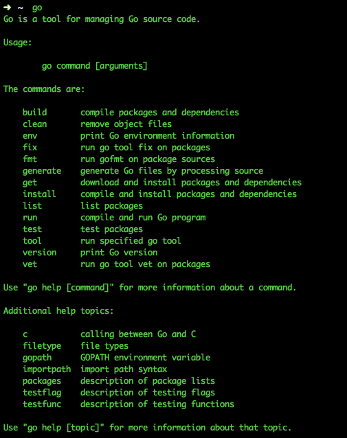

# GO WEB 编程

## 1. Go 环境配置

### Windows 安装

访问[Google Code 下载页](http://golang.org/dl/)，32 位请选择名称中包含 windows-386 的 msi 安装包，64 位请选择名称中包含 windows-amd64 的。下载好后运行，不要修改默认安装目录 C:\Go\，若安装到其他位置会导致不能执行自己所编写的 Go 代码。安装完成后默认会在环境变量 Path 后添加 Go 安装目录下的 bin 目录 `C:\Go\bin\`，并添加环境变量 GOROOT，值为 Go 安装根目录 `C:\Go\` 。

**验证是否安装成功**

在运行中输入 `cmd` 打开命令行工具，在提示符下输入 `go`，检查是否能看到 Usage 信息。输入 `cd %GOROOT%`，看是否能进入 Go 安装目录。若都成功，说明安装成功。

不能的话请检查上述环境变量 Path 和 GOROOT 的值。若不存在请卸载后重新安装，存在请重启计算机后重试以上步骤。

### GOPATH与工作空间

前面我们在安装Go的时候看到需要设置GOPATH变量，Go从1.1版本开始必须设置这个变量，而且不能和Go的安装目录一样，这个目录用来存放Go源码，Go的可运行文件，以及相应的编译之后的包文件。所以这个目录下面有三个子目录：src、bin、pkg

#### GOPATH设置

go 命令依赖一个重要的环境变量：$GOPATH

Windows系统中环境变量的形式为`%GOPATH%`，本书主要使用Unix形式，Windows用户请自行替换。

在类似 Unix 环境大概这样设置：

```
export GOPATH=/home/apple/mygo
```

为了方便，应该新建以上文件夹，并且上一行加入到 `.bashrc` 或者 `.zshrc` 或者自己的 `sh` 的配置文件中。

Windows 设置如下，新建一个环境变量名称叫做GOPATH：

```
    GOPATH=c:\mygo
```

GOPATH允许多个目录，当有多个目录时，请注意分隔符，多个目录的时候Windows是分号，Linux系统是冒号，当有多个GOPATH时，默认会将go get的内容放在第一个目录下。

以上 $GOPATH 目录约定有三个子目录：

- src 存放源代码（比如：.go .c .h .s等）
- pkg 编译后生成的文件（比如：.a）
- bin 编译后生成的可执行文件（为了方便，可以把此目录加入到 $PATH 变量中，如果有多个gopath，那么使用`${GOPATH//://bin:}/bin`添加所有的bin目录）

以后我所有的例子都是以mygo作为我的gopath目录

#### 代码目录结构规划

GOPATH下的src目录就是接下来开发程序的主要目录，所有的源码都是放在这个目录下面，那么一般我们的做法就是一个目录一个项目，例如: $GOPATH/src/mymath 表示mymath这个应用包或者可执行应用，这个根据package是main还是其他来决定，main的话就是可执行应用，其他的话就是应用包，这个会在后续详细介绍package。

所以当新建应用或者一个代码包时都是在src目录下新建一个文件夹，文件夹名称一般是代码包名称，当然也允许多级目录，例如在src下面新建了目录$GOPATH/src/github.com/astaxie/beedb 那么这个包路径就是"github.com/astaxie/beedb"，包名称是最后一个目录beedb

下面我就以mymath为例来讲述如何编写应用包，执行如下代码

```
cd $GOPATH/src
mkdir mymath
```

新建文件sqrt.go，内容如下

```
// $GOPATH/src/mymath/sqrt.go源码如下：
package mymath

func Sqrt(x float64) float64 {
    z := 0.0
    for i := 0; i < 1000; i++ {
        z -= (z*z - x) / (2 * x)
    }
    return z
}
```

这样我的应用包目录和代码已经新建完毕，注意：一般建议package的名称和目录名保持一致

#### 编译应用

上面我们已经建立了自己的应用包，如何进行编译安装呢？有两种方式可以进行安装

1、只要进入对应的应用包目录，然后执行`go install`，就可以安装了

2、在任意的目录执行如下代码`go install mymath`

安装完之后，我们可以进入如下目录

```
cd $GOPATH/pkg/${GOOS}_${GOARCH}
//可以看到如下文件
mymath.a
```

这个.a文件是应用包，那么我们如何进行调用呢？

接下来我们新建一个应用程序来调用这个应用包

新建应用包mathapp

```
cd $GOPATH/src
mkdir mathapp
cd mathapp
vim main.go
```

`$GOPATH/src/mathapp/main.go`源码：

```
package main

import (
      "mymath"
      "fmt"
)

func main() {
      fmt.Printf("Hello, world.  Sqrt(2) = %v\n", mymath.Sqrt(2))
}
```

可以看到这个的package是`main`，import里面调用的包是`mymath`,这个就是相对于`$GOPATH/src`的路径，如果是多级目录，就在import里面引入多级目录，如果你有多个GOPATH，也是一样，Go会自动在多个`$GOPATH/src`中寻找。

如何编译程序呢？进入该应用目录，然后执行`go build`，那么在该目录下面会生成一个mathapp的可执行文件

```
./mathapp
```

输出如下内容

```
Hello, world.  Sqrt(2) = 1.414213562373095
```

如何安装该应用，进入该目录执行`go install`,那么在$GOPATH/bin/下增加了一个可执行文件mathapp, 还记得前面我们把`$GOPATH/bin`加到我们的PATH里面了，这样可以在命令行输入如下命令就可以执行

```
mathapp
```

也是输出如下内容 39+44

```
Hello, world.  Sqrt(2) = 1.414213562373095
```

#### 获取远程包

go语言有一个获取远程包的工具就是`go get`，目前go get支持多数开源社区(例如：github、googlecode、bitbucket、Launchpad)

```
go get github.com/astaxie/beedb
```

> go get -u 参数可以自动更新包，而且当go get的时候会自动获取该包依赖的其他第三方包

通过这个命令可以获取相应的源码，对应的开源平台采用不同的源码控制工具，例如github采用git、googlecode采用hg，所以要想获取这些源码，必须先安装相应的源码控制工具

通过上面获取的代码在我们本地的源码相应的代码结构如下

```
$GOPATH
  src
   |--github.com
          |-astaxie
              |-beedb
   pkg
    |--相应平台
         |-github.com
               |--astaxie
                    |beedb.a
```

go get本质上可以理解为首先第一步是通过源码工具clone代码到src下面，然后执行`go install`

在代码中如何使用远程包，很简单的就是和使用本地包一样，只要在开头import相应的路径就可以

```
import "github.com/astaxie/beedb"
```

#### 程序的整体结构

通过上面建立的我本地的mygo的目录结构如下所示

```
bin/
    mathapp
pkg/
    平台名/ 如：darwin_amd64、linux_amd64
         mymath.a
         github.com/
              astaxie/
                   beedb.a
src/
    mathapp
          main.go
    mymath/
          sqrt.go
    github.com/
          astaxie/
             beedb/
                beedb.go
                util.go
```

从上面的结构我们可以很清晰的看到，bin目录下面存的是编译之后可执行的文件，pkg下面存放的是应用包，src下面保存的是应用源代码

## 2. Go 命令

### Go 命令

Go语言自带有一套完整的命令操作工具，你可以通过在命令行中执行`go`来查看它们：



### go build

这个命令主要用于编译代码。在包的编译过程中，若有必要，会同时编译与之相关联的包。

- 如果是普通包，就像上面编写的`mymath`包那样，当你执行`go build`之后，它不会产生任何文件。如果你需要在`$GOPATH/pkg`下生成相应的文件，那就得执行`go install`。

- 如果是`main`包，当你执行`go build`之后，它就会在当前目录下生成一个可执行文件。如果你需要在`$GOPATH/bin`下生成相应的文件，需要执行`go install`，或者使用`go build -o 路径/a.exe`。

- 如果某个项目文件夹下有多个文件，而你只想编译某个文件，就可在`go build`之后加上文件名，例如`go build a.go`；`go build`命令默认会编译当前目录下的所有go文件。

- 你也可以指定编译输出的文件名。我们可以指定`go build -o astaxie.exe`，默认情况是你的package名(非main包)，或者是第一个源文件的文件名(main包)。

  （注：实际上，package名在[Go语言规范](https://golang.org/ref/spec)中指代码中“package”后使用的名称，此名称可以与文件夹名不同。默认生成的可执行文件名是文件夹名。）

- go build会忽略目录下以“_”或“.”开头的go文件。

- 如果你的源代码针对不同的操作系统需要不同的处理，那么你可以根据不同的操作系统后缀来命名文件。例如有一个读取数组的程序，它对于不同的操作系统可能有如下几个源文件：

  array_linux.go array_darwin.go array_windows.go array_freebsd.go

  `go build`的时候会选择性地编译以系统名结尾的文件（Linux、Darwin、Windows、Freebsd）。例如Linux系统下面编译只会选择array_linux.go文件，其它系统命名后缀文件全部忽略。

参数的介绍

- `-o` 指定输出的文件名，可以带上路径，例如 `go build -o a/b/c`
- `-i` 安装相应的包，编译+`go install`
- `-a` 更新全部已经是最新的包的，但是对标准包不适用
- `-n` 把需要执行的编译命令打印出来，但是不执行，这样就可以很容易的知道底层是如何运行的
- `-p n` 指定可以并行可运行的编译数目，默认是CPU数目
- `-race` 开启编译的时候自动检测数据竞争的情况，目前只支持64位的机器
- `-v` 打印出来我们正在编译的包名
- `-work` 打印出来编译时候的临时文件夹名称，并且如果已经存在的话就不要删除
- `-x` 打印出来执行的命令，其实就是和`-n`的结果类似，只是这个会执行
- `-ccflags 'arg list'` 传递参数给5c, 6c, 8c 调用
- `-compiler name` 指定相应的编译器，gccgo还是gc
- `-gccgoflags 'arg list'` 传递参数给gccgo编译连接调用
- `-gcflags 'arg list'` 传递参数给5g, 6g, 8g 调用
- `-installsuffix suffix` 为了和默认的安装包区别开来，采用这个前缀来重新安装那些依赖的包，`-race`的时候默认已经是`-installsuffix race`,大家可以通过`-n`命令来验证
- `-ldflags 'flag list'` 传递参数给5l, 6l, 8l 调用
- `-tags 'tag list'` 设置在编译的时候可以适配的那些tag，详细的tag限制参考里面的 [Build Constraints](http://golang.org/pkg/go/build/)

### go clean

这个命令是用来移除当前源码包和关联源码包里面编译生成的文件。这些文件包括

```
_obj/            旧的object目录，由Makefiles遗留
_test/           旧的test目录，由Makefiles遗留
_testmain.go     旧的gotest文件，由Makefiles遗留
test.out         旧的test记录，由Makefiles遗留
build.out        旧的test记录，由Makefiles遗留
*.[568ao]        object文件，由Makefiles遗留

DIR(.exe)        由go build产生
DIR.test(.exe)   由go test -c产生
MAINFILE(.exe)   由go build MAINFILE.go产生
*.so             由 SWIG 产生
```

我一般都是利用这个命令清除编译文件，然后github递交源码，在本机测试的时候这些编译文件都是和系统相关的，但是对于源码管理来说没必要。

```
$ go clean -i -n
cd /Users/astaxie/develop/gopath/src/mathapp
rm -f mathapp mathapp.exe mathapp.test mathapp.test.exe app app.exe
rm -f /Users/astaxie/develop/gopath/bin/mathapp
```

参数介绍

- `-i` 清除关联的安装的包和可运行文件，也就是通过go install安装的文件
- `-n` 把需要执行的清除命令打印出来，但是不执行，这样就可以很容易的知道底层是如何运行的
- `-r` 循环的清除在import中引入的包
- `-x` 打印出来执行的详细命令，其实就是`-n`打印的执行版本

### go fmt

在go中，代码则有标准的风格。由于之前已经有的一些习惯或其它的原因我们常将代码写成ANSI风格或者其它更合适自己的格式，这将为人们在阅读别人的代码时添加不必要的负担，所以go强制了代码格式（比如左大括号必须放在行尾），不按照此格式的代码将不能编译通过，为了减少浪费在排版上的时间，go工具集中提供了一个`go fmt`命令 它可以帮你格式化你写好的代码文件，使你写代码的时候不需要关心格式，你只需要在写完之后执行`go fmt <文件名>.go`，你的代码就被修改成了标准格式，但是我平常很少用到这个命令，因为开发工具里面一般都带了保存时候自动格式化功能，这个功能其实在底层就是调用了`go fmt`。

使用go fmt命令，其实是调用了gofmt，而且需要参数-w，否则格式化结果不会写入文件。gofmt -w -l src，可以格式化整个项目。

所以go fmt是gofmt的上层一个包装的命令，我们想要更多的个性化的格式化可以参考 [gofmt](http://golang.org/cmd/gofmt/)

gofmt的参数介绍

- `-l` 显示那些需要格式化的文件
- `-w` 把改写后的内容直接写入到文件中，而不是作为结果打印到标准输出。
- `-r` 添加形如“a[b:len(a)] -> a[b:]”的重写规则，方便我们做批量替换
- `-s` 简化文件中的代码
- `-d` 显示格式化前后的diff而不是写入文件，默认是false
- `-e` 打印所有的语法错误到标准输出。如果不使用此标记，则只会打印不同行的前10个错误。
- `-cpuprofile` 支持调试模式，写入相应的cpufile到指定的文件

### go get

这个命令是用来动态获取远程代码包的，目前支持的有BitBucket、GitHub、Google Code和Launchpad。这个命令在内部实际上分成了两步操作：第一步是下载源码包，第二步是执行`go install`。下载源码包的go工具会自动根据不同的域名调用不同的源码工具，对应关系如下：

```
BitBucket (Mercurial Git)
GitHub (Git)
Google Code Project Hosting (Git, Mercurial, Subversion)
Launchpad (Bazaar)
```

所以为了`go get` 能正常工作，你必须确保安装了合适的源码管理工具，并同时把这些命令加入你的PATH中。其实`go get`支持自定义域名的功能，具体参见`go help remote`。

参数介绍：

- `-d` 只下载不安装
- `-f` 只有在你包含了`-u`参数的时候才有效，不让`-u`去验证import中的每一个都已经获取了，这对于本地fork的包特别有用
- `-fix` 在获取源码之后先运行fix，然后再去做其他的事情
- `-t` 同时也下载需要为运行测试所需要的包
- `-u` 强制使用网络去更新包和它的依赖包
- `-v` 显示执行的命令

### go install

这个命令在内部实际上分成了两步操作：第一步是生成结果文件(可执行文件或者.a包)，第二步会把编译好的结果移到`$GOPATH/pkg`或者`$GOPATH/bin`。

参数支持`go build`的编译参数。大家只要记住一个参数`-v`就好了，这个随时随地的可以查看底层的执行信息。

### go test

执行这个命令，会自动读取源码目录下面名为`*_test.go`的文件，生成并运行测试用的可执行文件。输出的信息类似

```
ok   archive/tar   0.011s
FAIL archive/zip   0.022s
ok   compress/gzip 0.033s
...
```

默认的情况下，不需要任何的参数，它会自动把你源码包下面所有test文件测试完毕，当然你也可以带上参数，详情请参考`go help testflag`

这里我介绍几个我们常用的参数：

- `-bench regexp` 执行相应的benchmarks，例如 `-bench=.`
- `-cover` 开启测试覆盖率
- `-run regexp` 只运行regexp匹配的函数，例如 `-run=Array` 那么就执行包含有Array开头的函数
- `-v` 显示测试的详细命令

### go tool

`go tool`下面聚集了很多命令，这里我们只介绍两个，fix和vet

- `go tool fix .` 用来修复以前老版本的代码到新版本，例如go1之前老版本的代码转化到go1,例如API的变化
- `go tool vet directory|files` 用来分析当前目录的代码是否都是正确的代码,例如是不是调用fmt.Printf里面的参数不正确，例如函数里面提前return了然后出现了无用代码之类的。

### go generate

这个命令是从Go1.4开始才设计的，用于在编译前自动化生成某类代码。`go generate`和`go build`是完全不一样的命令，通过分析源码中特殊的注释，然后执行相应的命令。这些命令都是很明确的，没有任何的依赖在里面。而且大家在用这个之前心里面一定要有一个理念，这个`go generate`是给你用的，不是给使用你这个包的人用的，是方便你来生成一些代码的。

这里我们来举一个简单的例子，例如我们经常会使用`yacc`来生成代码，那么我们常用这样的命令：

```
go tool yacc -o gopher.go -p parser gopher.y
```

-o 指定了输出的文件名， -p指定了package的名称，这是一个单独的命令，如果我们想让`go generate`来触发这个命令，那么就可以在当前目录的任意一个`xxx.go`文件里面的任意位置增加一行如下的注释：

```
//go:generate go tool yacc -o gopher.go -p parser gopher.y
```

这里我们注意了，`//go:generate`是没有任何空格的，这其实就是一个固定的格式，在扫描源码文件的时候就是根据这个来判断的。

所以我们可以通过如下的命令来生成，编译，测试。如果`gopher.y`文件有修改，那么就重新执行`go generate`重新生成文件就好。

```
$ go generate
$ go build
$ go test
```

### godoc

在Go1.2版本之前还支持`go doc`命令，但是之后全部已到了godoc这个命令下，需要这样安装`go get golang.org/x/tools/cmd/godoc`，1.10之后的版本不许安装可直接使用

很多人说go不需要任何的第三方文档，例如chm手册之类的（其实我已经做了一个了，[chm手册](https://github.com/astaxie/godoc)），因为它内部就有一个很强大的文档工具。

如何查看相应package的文档呢？ 例如builtin包，那么执行`godoc builtin` 如果是http包，那么执行`godoc net/http` 查看某一个包里面的函数，那么执行`godoc fmt Printf` 也可以查看相应的代码，执行`godoc -src fmt Printf`

通过命令在命令行执行 `godoc -http=:端口号` 比如`godoc -http=:8080`。然后在浏览器中打开`127.0.0.1:8080`，你将会看到一个golang.org的本地copy版本，通过它你可以查询pkg文档等其它内容。如果你设置了GOPATH，在pkg分类下，不但会列出标准包的文档，还会列出你本地`GOPATH`中所有项目的相关文档，这对于经常被墙的用户来说是一个不错的选择。

### 其它命令

go还提供了其它很多的工具，例如下面的这些工具

```
go version 查看go当前的版本
go env 查看当前go的环境变量
go list 列出当前全部安装的package
go run 编译并运行Go程序
```

以上这些工具还有很多参数没有一一介绍，可以使用`go help 命令`获取更详细的帮助信息。

## 3 Go语言基础

Go是一门类似C的编译型语言，但是它的编译速度非常快。这门语言的关键字总共也就二十五个，如下所示：

```go
break    default      func    interface    select
case     defer        go      map          struct
chan     else         goto    package      switch
const    fallthrough  if      range        type
continue for          import  return       var
```

### 3.1 你好，Go

在本节中，我们要学习用最基本的语法让Go程序运行起来。

#### 程序

让我们从`hello world`程序开始

```go
package main

import "fmt"

func main() {
    fmt.Printf("Hello, world or 你好，世界 or καλημ ́ρα κóσμ or こんにちはせかい\n")
}
```

输出如下：

```
Hello, world or 你好，世界 or καλημ ́ρα κóσμ or こんにちはせかい
```

#### 详解

首先我们要了解一个概念，**Go程序是通过`package`来组织代码的**

`package <pkgName>`（在我们的例子中是`package main`）这一行告诉我们当前文件**属于哪个包**，而包名`main`则告诉我们它是一个**可独立运行的包**，它在编译后会产生可执行文件。除了`main`包之外，其它的包最后都会生成`*.a`文件（也就是包文件）并放置在`$GOPATH/pkg/$GOOS_$GOARCH`中

> 每一个可独立运行的Go程序，必定包含一个`package main`，在这个`main`包中必定包含一个入口函数`main`，而这个函数既没有参数，也没有返回值。

为了打印`Hello, world...`，我们调用了一个函数`Printf`，这个函数来自于`fmt`包，所以我们在第三行中导入了系统级别的`fmt`包：`import "fmt"`。

包的概念和Python中的package类似，使用包的好处：模块化（能够把你的程序分成多个模块)和可重用性（每个模块都能被其它应用程序反复使用）。

在第五行中，我们通过关键字`func`定义了一个`main`函数，函数体被放在`{}`（大括号）中

第六行，我们调用了`fmt`包里面定义的函数`Printf`。这个函数是通过`<pkgName>.<funcName>`的方式调用的

> 前面提到过，包名和包所在的文件夹名可以是不同的，此处的`<pkgName>`即为通过`package <pkgName>`声明的包名，而非文件夹名。

Go是天生支持UTF-8的，任何字符都可以直接输出

#### 结论

Go使用`package`（和Python的模块类似）来组织代码。`main.main()`函数(这个函数位于主包）是每一个独立的可运行程序的入口点。Go使用UTF-8字符串和标识符(因为UTF-8的发明者也就是Go的发明者)，所以它天生支持多语言。

### 2.2 Go基础

这小节我们将要介绍如何定义变量、常量、Go内置类型以及Go程序设计中的一些技巧。

#### 定义变量

Go语言里面定义变量有多种方式

使用`var`关键字是Go最基本的定义变量方式，与C语言不同的是Go把变量类型放在变量名后面：

```go
//定义一个名称为“variableName”，类型为"type"的变量
var variableName type
```

定义多个变量

```go
//定义三个类型都是“type”的变量
var vname1, vname2, vname3 type
```

定义变量并初始化值

```go
//初始化“variableName”的变量为“value”值，类型是“type”
var variableName type = value
```

同时初始化多个变量

```go
/*
    定义三个类型都是"type"的变量,并且分别初始化为相应的值
    vname1为v1，vname2为v2，vname3为v3
*/
var vname1, vname2, vname3 type= v1, v2, v3
```

我们可以直接忽略类型声明，那么上面的代码变成这样了：

```go
/*
    定义三个变量，它们分别初始化为相应的值
    vname1为v1，vname2为v2，vname3为v3
    然后Go会根据其相应值的类型来推断变量的类型
*/
var vname1, vname2, vname3 = v1, v2, v3
```

你觉得上面的还是有些繁琐？好吧，我也觉得。让我们继续简化：

```go
/*
    定义三个变量，它们分别初始化为相应的值
    vname1为v1，vname2为v2，vname3为v3
    编译器会根据初始化的值自动推导出相应的类型
*/
vname1, vname2, vname3 := v1, v2, v3
```

`:=`这个符号直接取代了`var`和`type`，这种形式叫做`简短声明`，`:=`**只能用在函数内部**；在函数外部使用则会无法编译通过，所以一般用**`var`方式定义全局变量**

**`_`（下划线）是个特殊的变量名，任何赋予它的值都会被丢弃**。

下面我们将值`35`赋予`b`，并同时丢弃`34`：

```go
_, b := 34, 35
```

Go对于**已声明但未使用的变量**会在编译阶段**报错**

#### 常量

在Go程序中，**常量使用关键字`const`定义**，可定义为数值、布尔值或字符串等类型。语法如下：

```go
const constantName = value
//如果需要，也可以明确指定常量的类型：
const Pi float32 = 3.1415926
```

Go 常量和一般程序语言不同的是，可以指定相当多的小数位数(例如200位)， 若指定給float32自动缩短为32bit，指定给float64自动缩短为64bit，详情参考[链接](http://golang.org/ref/spec#Constants)

#### 内置基础类型

##### Boolean

在Go中，布尔值的类型为`bool`，值是`true`或`false`，默认为`false`。

```go
//示例代码
var isActive bool  // 全局变量声明
var enabled, disabled = true, false  // 忽略类型的声明
func test() {
    var available bool  // 一般声明
    valid := false      // 简短声明
    available = true    // 赋值操作
}
```

##### 数值类型

**整数类型有无符号和带符号两种。**Go同时支持`int`和`uint`，这两种类型的长度相同，但具体长度取决于不同编译器的实现。Go里面也有直接定义好位数的类型：`rune`, `int8`, `int16`, `int32`, `int64`和`byte`, `uint8`, `uint16`, `uint32`, `uint64`。其中`rune`是`int32`的别称，`byte`是`uint8`的别称。

> 需要注意的一点是，这些类型的变量之间不允许互相赋值或操作，不然会在编译时引起编译器报错。
>
> 如下的代码会产生错误：invalid operation: a + b (mismatched types int8 and int32)
>
> > var a int8
> >
> > var b int32
> >
> > c:=a + b
>
> 另外，尽管int的长度是32 bit, 但int 与 int32并不可以互用。

**浮点数**的类型有`float32`和`float64`两种（没有`float`类型），默认是`float64`。

**复数**默认类型是`complex128`（64位实数+64位虚数）。如果需要小一些的，也有`complex64`(32位实数+32位虚数)。复数的形式为`RE + IMi`，其中`RE`是实数部分，`IM`是虚数部分，而最后的`i`是虚数单位。下面是一个使用复数的例子：

```go
var c complex64 = 5+5i
fmt.Printf("Value is: %v", c)
```

##### 字符串

Go中的字符串都是采用`UTF-8`字符集编码。字符串是用一对双引号（`""`）或反引号（`` ` ）括起来定义，它的类型是`string`。

```go
var frenchHello string  // 声明变量为字符串的一般方法
var emptyString string = ""  // 声明了一个字符串变量，初始化为空字符串
func test() {
    no, yes, maybe := "no", "yes", "maybe"  // 简短声明，同时声明多个变量
    japaneseHello := "Konichiwa"  // 同上
    frenchHello = "Bonjour"  // 常规赋值
}
```

在Go中**字符串是不可变的**，例如下面的代码编译时会报错：cannot assign to s[0]

```go
var s string = "hello"
s[0] = 'c'
```

但如果真的想要修改怎么办呢？下面的代码可以实现：

```go
s := "hello"
c := []byte(s)  // 将字符串 s 转换为 []byte 类型
c[0] = 'c'
s2 := string(c)  // 再转换回 string 类型
fmt.Printf("%s\n", s2)
```

Go中可以使用`+`操作符来连接两个字符串：

```go
s := "hello,"
m := " world"
a := s + m
fmt.Printf("%s\n", a)
```

修改字符串也可写为：

```go
s := "hello"
s = "c" + s[1:] // 字符串虽不能更改，但可进行切片操作
fmt.Printf("%s\n", s)
```

如果要声明一个多行的字符串怎么办？可以通过`` `来声明：

```go
m := `hello
    world`
```

`` ` 括起的字符串为Raw字符串，即字符串在代码中的形式就是打印时的形式，它没有字符转义，换行也将原样输出。

##### 错误类型

Go内置有一个`error`类型，专门用来处理错误信息，Go的`package`里面还专门有一个包`errors`来处理错误：

```go
err := errors.New("emit macho dwarf: elf header corrupted")
if err != nil {
    fmt.Print(err)
}
```

##### Go数据底层的存储

下面这张图来源于[Russ Cox Blog](http://research.swtch.com/)中一篇介绍[Go数据结构](http://research.swtch.com/godata)的文章，大家可以看到这些基础类型底层都是分配了一块内存，然后存储了相应的值。


#### 一些技巧

##### 分组声明

在Go语言中，同时声明多个常量、变量，或者导入多个包时，可采用分组的方式进行声明。

例如下面的代码：

```go
import "fmt"
import "os"

const i = 100
const pi = 3.1415
const prefix = "Go_"

var i int
var pi float32
var prefix string
```

可以分组写成如下形式：

```go
import(
    "fmt"
    "os"
)

const(
    i = 100
    pi = 3.1415
    prefix = "Go_"
)

var(
    i int
    pi float32
    prefix string
)
```

##### iota枚举

Go里面有一个关键字`iota`，这个关键字用来声明`enum`的时候采用，它默认开始值是0，`const`中每增加一行加1：

```go
const(
    x = iota  // x == 0
    y = iota  // y == 1
    z = iota  // z == 2
    w  // 常量声明省略值时，默认和之前一个值的字面相同。这里隐式地说w = iota，因此w == 3。其实上面y和z可同样不用"= iota"
)

const v = iota // 每遇到一个const关键字，iota就会重置，此时v == 0

const ( 
  e, f, g = iota, iota, iota //e=0,f=0,g=0 iota在同一行值相同
)

const （
    a = iota    a=0
    b = "B"
    c = iota    //c=2
    d,e,f = iota,iota,iota //d=3,e=3,f=3
    g //g = 4
）
```

> 除非被显式设置为其它值或`iota`，每个`const`分组的第一个常量被默认设置为它的0值，第二及后续的常量被默认设置为它前面那个常量的值，如果前面那个常量的值是`iota`，则它也被设置为`iota`。

##### Go程序设计的一些规则

Go之所以会那么简洁，是因为它有一些默认的行为：

- 大写字母开头的变量是其它包可以访问的，是公用变量；小写字母开头的就是不可导出的，是私有变量。
- 大写字母开头的函数也是一样，相当于`class`中的带`public`关键词的公有函数；小写字母开头的就是有`private`关键词的私有函数。

#### array、slice、map

##### array

`array`就是数组，它的定义方式如下：

```go
var arr [n]type
```

在`[n]type`中，`n`表示数组的长度，`type`表示存储元素的类型。对数组的操作和其它语言类似，都是通过`[]`来进行读取或赋值：

```go
var arr [10]int  // 声明了一个int类型的数组
arr[0] = 42      // 数组下标是从0开始的
arr[1] = 13      // 赋值操作
fmt.Printf("The first element is %d\n", arr[0])  // 获取数据，返回42
fmt.Printf("The last element is %d\n", arr[9]) //返回未赋值的最后一个元素，默认返回0
```

由于长度也是数组类型的一部分，因此`[3]int`与`[4]int`是不同的类型，数组也就不能改变长度。数组之间的赋值是值的赋值，即当把一个数组作为参数传入函数的时候，传入的其实是该数组的副本，而不是它的指针

数组可以使用`:=`来声明

```go
a := [3]int{1, 2, 3} // 声明了一个长度为3的int数组
b := [10]int{1, 2, 3} // 声明了一个长度为10的int数组，其中前三个元素初始化为1、2、3，其它默认为0
c := [...]int{4, 5, 6} // 可以省略长度而采用`...`的方式，Go会自动根据元素个数来计算长度
```

Go支持嵌套数组，即多维数组。比如下面的代码就声明了一个二维数组：

```go
// 声明了一个二维数组，该数组以两个数组作为元素，其中每个数组中又有4个int类型的元素
doubleArray := [2][4]int{[4]int{1, 2, 3, 4}, [4]int{5, 6, 7, 8}}

// 上面的声明可以简化，直接忽略内部的类型
easyArray := [2][4]int{{1, 2, 3, 4}, {5, 6, 7, 8}}
```

数组的分配如下所示：


### slice

**`slice`是GO语言中的动态数组**

`slice`并不是真正意义上的动态数组，而是一个引用类型。`slice`总是指向一个底层`array`，`slice`的声明也可以像`array`一样，只是不需要长度。

```go
// 和声明array一样，只是少了长度
var fslice []int
```

接下来我们可以声明一个`slice`，并初始化数据，如下所示：

```go
slice := []byte {'a', 'b', 'c', 'd'}
```

`slice`可以从一个数组或一个已经存在的`slice`中再次声明。`slice`通过`array[i:j]`来获取，其中`i`是数组的开始位置，`j`是结束位置，但不包含`array[j]`，它的长度是`j-i`。

```go
// 声明一个含有10个元素元素类型为byte的数组
var ar = [10]byte {'a', 'b', 'c', 'd', 'e', 'f', 'g', 'h', 'i', 'j'}

// 声明两个含有byte的slice
var a, b []byte

// a指向数组的第3个元素开始，并到第五个元素结束，
a = ar[2:5]
//现在a含有的元素: ar[2]、ar[3]和ar[4]

// b是数组ar的另一个slice
b = ar[3:5]
// b的元素是：ar[3]和ar[4]
```

> 注意`slice`和数组在声明时的区别：声明数组时，方括号内写明了数组的长度或使用`...`自动计算长度，而声明`slice`时，方括号内没有任何字符。

它们的数据结构如下所示


图2.3 slice和array的对应关系图

slice有一些简便的操作

- `slice`的默认开始位置是0，`ar[:n]`等价于`ar[0:n]`
- `slice`的第二个序列默认是数组的长度，`ar[n:]`等价于`ar[n:len(ar)]`
- 如果从一个数组里面直接获取`slice`，可以这样`ar[:]`，因为默认第一个序列是0，第二个是数组的长度，即等价于`ar[0:len(ar)]`

下面这个例子展示了更多关于`slice`的操作：

```
// 声明一个数组
var array = [10]byte{'a', 'b', 'c', 'd', 'e', 'f', 'g', 'h', 'i', 'j'}
// 声明两个slice
var aSlice, bSlice []byte

// 演示一些简便操作
aSlice = array[:3] // 等价于aSlice = array[0:3] aSlice包含元素: a,b,c
aSlice = array[5:] // 等价于aSlice = array[5:10] aSlice包含元素: f,g,h,i,j
aSlice = array[:]  // 等价于aSlice = array[0:10] 这样aSlice包含了全部的元素

// 从slice中获取slice
aSlice = array[3:7]  // aSlice包含元素: d,e,f,g，len=4，cap=7
bSlice = aSlice[1:3] // bSlice 包含aSlice[1], aSlice[2] 也就是含有: e,f
bSlice = aSlice[:3]  // bSlice 包含 aSlice[0], aSlice[1], aSlice[2] 也就是含有: d,e,f
bSlice = aSlice[0:5] // 对slice的slice可以在cap范围内扩展，此时bSlice包含：d,e,f,g,h
bSlice = aSlice[:]   // bSlice包含所有aSlice的元素: d,e,f,g
```

`slice`是引用类型，所以当引用改变其中元素的值时，其它的所有引用都会改变该值，例如上面的`aSlice`和`bSlice`，如果修改了`aSlice`中元素的值，那么`bSlice`相对应的值也会改变。

从概念上面来说`slice`像一个结构体，这个结构体包含了三个元素：

- 一个指针，指向数组中`slice`指定的开始位置

- 长度，即`slice`的长度

- 最大长度，也就是`slice`开始位置到数组的最后位置的长度

  ```
    Array_a := [10]byte{'a', 'b', 'c', 'd', 'e', 'f', 'g', 'h', 'i', 'j'}
    Slice_a := Array_a[2:5]
  ```

上面代码的真正存储结构如下图所示


图2.4 slice对应数组的信息

对于`slice`有几个有用的内置函数：

- `len` 获取`slice`的长度
- `cap` 获取`slice`的最大容量
- `append` 向`slice`里面追加一个或者多个元素，然后返回一个和`slice`一样类型的`slice`
- `copy` 函数`copy`从源`slice`的`src`中复制元素到目标`dst`，并且返回复制的元素的个数

注：`append`函数会改变`slice`所引用的数组的内容，从而影响到引用同一数组的其它`slice`。 但当`slice`中没有剩余空间（即`(cap-len) == 0`）时，此时将动态分配新的数组空间。返回的`slice`数组指针将指向这个空间，而原数组的内容将保持不变；其它引用此数组的`slice`则不受影响。

从Go1.2开始slice支持了三个参数的slice，之前我们一直采用这种方式在slice或者array基础上来获取一个slice

```
var array [10]int
slice := array[2:4]
```

这个例子里面slice的容量是8，新版本里面可以指定这个容量

```
slice = array[2:4:7]
```

上面这个的容量就是`7-2`，即5。这样这个产生的新的slice就没办法访问最后的三个元素。

如果slice是这样的形式`array[:i:j]`，即第一个参数为空，默认值就是0。

### map

`map`也就是Python中字典的概念，它的格式为`map[keyType]valueType`

我们看下面的代码，`map`的读取和设置也类似`slice`一样，通过`key`来操作，只是`slice`的`index`只能是｀int｀类型，而`map`多了很多类型，可以是`int`，可以是`string`及所有完全定义了`==`与`!=`操作的类型。

```
// 声明一个key是字符串，值为int的字典,这种方式的声明需要在使用之前使用make初始化
var numbers map[string]int
// 另一种map的声明方式
numbers := make(map[string]int)
numbers["one"] = 1  //赋值
numbers["ten"] = 10 //赋值
numbers["three"] = 3

fmt.Println("第三个数字是: ", numbers["three"]) // 读取数据
// 打印出来如:第三个数字是: 3
```

这个`map`就像我们平常看到的表格一样，左边列是`key`，右边列是值

使用map过程中需要注意的几点：

- `map`是无序的，每次打印出来的`map`都会不一样，它不能通过`index`获取，而必须通过`key`获取
- `map`的长度是不固定的，也就是和`slice`一样，也是一种引用类型
- 内置的`len`函数同样适用于`map`，返回`map`拥有的`key`的数量
- `map`的值可以很方便的修改，通过`numbers["one"]=11`可以很容易的把key为`one`的字典值改为`11`
- `map`和其他基本型别不同，它不是thread-safe，在多个go-routine存取时，必须使用mutex lock机制

`map`的初始化可以通过`key:val`的方式初始化值，同时`map`内置有判断是否存在`key`的方式

通过`delete`删除`map`的元素：

```
// 初始化一个字典
rating := map[string]float32{"C":5, "Go":4.5, "Python":4.5, "C++":2 }
// map有两个返回值，第二个返回值，如果不存在key，那么ok为false，如果存在ok为true
csharpRating, ok := rating["C#"]
if ok {
    fmt.Println("C# is in the map and its rating is ", csharpRating)
} else {
    fmt.Println("We have no rating associated with C# in the map")
}

delete(rating, "C")  // 删除key为C的元素
```

上面说过了，`map`也是一种引用类型，如果两个`map`同时指向一个底层，那么一个改变，另一个也相应的改变：

```
m := make(map[string]string)
m["Hello"] = "Bonjour"
m1 := m
m1["Hello"] = "Salut"  // 现在m["hello"]的值已经是Salut了
```

### make、new操作

`make`用于内建类型（`map`、`slice` 和`channel`）的内存分配。`new`用于各种类型的内存分配。

内建函数`new`本质上说跟其它语言中的同名函数功能一样：`new(T)`分配了零值填充的`T`类型的内存空间，并且返回其地址，即一个`*T`类型的值。用Go的术语说，它返回了一个指针，指向新分配的类型`T`的零值。有一点非常重要：

> `new`返回指针。

内建函数`make(T, args)`与`new(T)`有着不同的功能，make只能创建`slice`、`map`和`channel`，并且返回一个有初始值(非零)的`T`类型，而不是`*T`。本质来讲，导致这三个类型有所不同的原因是指向数据结构的引用在使用前必须被初始化。例如，一个`slice`，是一个包含指向数据（内部`array`）的指针、长度和容量的三项描述符；在这些项目被初始化之前，`slice`为`nil`。对于`slice`、`map`和`channel`来说，`make`初始化了内部的数据结构，填充适当的值。

> `make`返回初始化后的（非零）值。

下面这个图详细的解释了`new`和`make`之间的区别。


图2.5 make和new对应底层的内存分配

## 零值

关于“零值”，所指并非是空值，而是一种“变量未填充前”的默认值，通常为0。 此处罗列 部分类型 的 “零值”

```
int     0
int8    0
int32   0
int64   0
uint    0x0
rune    0 //rune的实际类型是 int32
byte    0x0 // byte的实际类型是 uint8
float32 0 //长度为 4 byte
float64 0 //长度为 8 byte
bool    false
string  ""
```