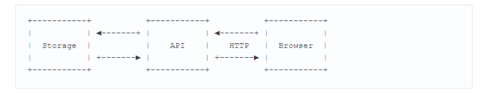
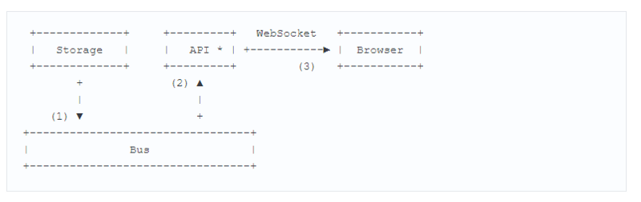

# GO上开发高负载WebSocket服务器

### 前言

This article is about how we developed a high-loaded WebSocket server on Go

本文是关于如何使用Go语言开发一个高负载的WebSocket服务器的

If the topic of **WebSocket** is close to you, but Go is not quite, I hope the article will still seem interesting to you from the point of view of ideas and optimization techniques

如果WebSocket的主题与您很接近，但是Go不是很接近，那么我希望从思想和优化技术的角度来看，这篇文章仍然对您有趣

To denote the context of the story, it is worth saying a few words about why we needed such a server

为了表示故事的背景，值得说几句我们为什么需要这样的服务器

Our company developing some type of mail systems, the state of which is changing. Obviously, such a system is the repository of user letters. You can learn about state changes — about events — in several ways. Basically, it is either a periodic polling of the system or — in the opposite direction — notifications from the system about a change in its state

我们公司开发了一些类型的邮件系统，其状态正在改变。显然，这样的系统是用户信函的存储库。您可以通过几种方式了解有关事件的状态变化。基本上，它要么是系统的定期轮询，要么是系统关于其状态变化的--相反方向的通知

Both methods have their **pros** and **cons**, but if we talk about mail, then the sooner the user receives a new letter, the better. Polling in the mail is about **50** thousand HTTP requests per second, **60%** of which return the status **304**, which means there is no change in the box

这两种方法各有利弊，但如果我们谈到邮件，那么用户收到新信越快越好。邮件中的轮询是每秒大约5万个HTTP请求，其中60%返回状态304，这意味着框中没有变化

Therefore, in order to reduce the load on the servers and speed up the delivery of letters to users, it was decided to write a [**publisher-subscriber server**](https://cloud.google.com/pubsub/docs/overview) (which we call it sometimes the [**bus**](https://docs.oracle.com/cd/E24329_01/web.1211/e21049/pubsub.htm), **message-broker** or **event-channel**), which, on the one hand, receives status messages, and the other is subscriptions to such messages

因此，为了减少服务器上的负载并加快向用户的信件传递，决定编写一个发布者-订阅（publisher-subscriber）服务器（我们称之为总线、消息代理或事件通道），它一方面接收状态消息，另一方面是对这些消息的订阅

之前：



之后：



The first diagram shows how it was before. The browser periodically went to the [**API**](https://www.api.org/) and asked about changes to the Storage (DB of letters).

第一张图显示了之前的情况。浏览器定期请求 API 并询问存储（邮件数据库）的变化

On the second one — a new version of the architecture. The browser establishes a [**WebSocket**](https://en.wikipedia.org/wiki/WebSocket) connection to the [**API**](https://www.api.org/) over which the Storage event is notified. The [**API**](https://www.api.org/) is a client to the Bus server and sends it the data of its subscribers *(this server will not be discussed today; perhaps I will tell about it in the following publications)*

第二个是一个新版本的体系结构。浏览器建立一个到API的WebSocket连接并进行事件通知。API是到总线服务器的客户端，并将其订阅者的数据发送给它（今天将不讨论此服务器；也许我将在下面的出版物中介绍它）

1. At the time of receipt of a new letter, Storage sends a notification about this to the Bus

   在收到新信件时，Storage会向总线发送有关此信息的通知

2. Bus to its subscribers

   总线到其订阅者

3. Then API determines which connection to send the received notification to, and sends it to the browser to the user

   然后，API确定将收到的通知发送到哪个连接，并将其发送给浏览器给用户

As you might have guessed, today we’ll talk about the API, or WebSocket server. Looking ahead, I will say that there will be about 3 million live connections on the server. This figure will emerge more than once in the subsequent story about optimizations

您可能已经猜到了，今天我们将讨论**API**或**WebSocket**服务器。展望未来，我会说**服务器**上将有大约**300万个实时连接**。在随后的关于优化的中，这个数字将不止一次出现

### Idiomatic way 常用方法

Let’s look at how we would implement some parts of our server, using [**Go**](https://golang.org/)capabilities, without using system calls in our own code

让我们看一下如何使用[**Go**](https://golang.org/)实现服务器的某些部分，而无需在我们自己的代码中使用系统调用

Before we consider working with `net/http`, let’s talk about sending and receiving data. The data that is above the **WebSocket** protocol (for example, **json-envelopes**), hereinafter I will begin to call packages. Let’s begin the implementation of the `Channel` structure, which will contain the logic for receiving and sending packets through a WebSocket connection

在我们考虑使用之前`net/http`，让我们谈谈发送和接收数据。**WebSocket**协议之上的数据（例如，**json-envelopes**），以下我将开始调用包。让我们开始实现`Channel`结构，它包含通过`WebSocket`连接接收和发送数据包的逻辑

#### Channel struct

```go
// Packet represents application level data.
type Packet struct {
    ...
}
// Channel wraps user connection.
type Channel struct {
    conn net.Conn    // WebSocket connection.
    send chan Packet // Outgoing packets queue.
}

func NewChannel(conn net.Conn) *Channel {
    c := &Channel{
        conn: conn,
        send: make(chan Packet, N),
    }
	go c.reader()
    go c.writer()
	return c
}
```

I want to draw your attention to the launch of two **go-rutin** reading and writing. Each **go-rutin** needs its own stack, which, depending on the operating system and the **Go** version, can have an initial size of **2 to 8 KB**.

大家注意这里的两个`gorutinue`读和写。每个`gorutinue`需要自己的堆栈，根据操作系统和**Go**版本，它具有**2到8 KB**的初始大小

If we take into account the figure mentioned earlier (**3 million live connections**), then we will need **24 GB of memory** for all connections (with a stack of **4 KB**). And this is without taking into account the memory allocated to the `Channel` structure, the queue of outgoing ch.send packets, and other internal fields

如果我们考虑前面提到的数字（**300万个实时连接**），那么我们将需要**24 GB的内存**用于所有连接（堆栈为**4 KB**）。这不考虑分配给`Channel`结构的内存，传出ch.send数据包的队列和其他内部字段

### Go-rutinue I / O

Let’s look at the implementation of the `reader` from the connection:

让我们看一下连接中`reader`的实现：

```go
func（c * Channel）reader（）{ 
    //We make buffered read to reduce read syscalls.
    buf：= bufio.NewReader（c.conn）
	for { 
        pkt，_：= readPacket（buf）
        c.handle（pkt）
    } 
}
```

**Simple enough, right?** We use a buffer to reduce the number of syscalls for reading and read as many buf as it allows us. In an infinite loop, we expect new data to come into the connection and read the next packet. I’ll ask you to remember the words, **we’ll expect new data to arrive**: we’ll return to them later.

很简单吧？我们使用缓冲区来减少读取的系统调用次数，并读取尽可能多的`buf`。在无限循环中，我们期望新数据进入连接并读取下一个数据包。我会请你记住这些词，我们期待新的数据到达：我们稍后会返回它们

Parsing and processing incoming packets will be left aside since it does not matter for those optimizations that will be discussed. But buf is still worth paying attention now: by default, it is **4 KB**, which means it is another **12 GB** of memory. A similar situation with the “writer”:

解析和处理传入的数据包将被放在一边，因为对于将要讨论的那些优化并不重要。但是`buf`现在仍然值得关注：默认情况下，它是**4 KB**，这意味着它是另一个**12 GB**的内存。与`writer`类似的情况：

```go
func (c *Channel) writer() {
    // We make buffered write to reduce write syscalls. 
    buf := bufio.NewWriter(c.conn)
	for pkt := range c.send {
        _ := writePacket(buf, pkt)
        buf.Flush()
    }
}
```

We iterate through the outgoing c.send packet channel and write them to the buffer. This, as an attentive reader could already guess, is another **4 KB** and **12 GB** of memory for our **3 million connections**

我们遍历传出的c.send数据包通道并将它们写入缓冲区。正如一位细心的读者所猜测的那样，这是我们**300万连接的**另一个**4 KB**和**12 GB**的内存

### HTTP

We have a simple implementation of the` Channel`, now we need to get a **WebSocket-connection** with which we will work. Since we are still under the heading **Idiomatic way**, we will do it in the appropriate key.

我们有一个简单的实现` Channel`，现在我们需要获得一个**WebSocket连接**，我们将使用它。由于我们仍处于**惯用语**的标题下，我们将在适当的密钥中进行。

> If you are not familiar with how **WebSocket** works, then you should say that the client switches to the **WebSocket** protocol using a special mechanism in **HTTP**called **Upgrade**. After successful processing of the **Upgrade** request, the server and client use a **TCP** connection to exchange binary **WebSocket frames**.

> [**Here**](https://tools.ietf.org/html/rfc6455#section-5.2) the frame structure inside the connection is described.

> 如果您不熟悉**WebSocket的**工作原理，那么您应该说客户端使用名为**Upgrade的****HTTP中**的特殊机制切换到**WebSocket**协议。成功处理**升级**请求后，服务器和客户端使用**TCP**连接来交换二进制**WebSocket帧**。

> [**这里**](https://tools.ietf.org/html/rfc6455#section-5.2)描述了连接内部的框架结构。

```go
import（
    “net / http” 
    “some / websocket” 
）
http.HandleFunc（“/ v1 / ws”，func（w http.ResponseWriter，r * http.Request）{ 
    conn，_：= websocket.Upgrade（r，w）
    ch：= NewChannel（conn）
    // ... 
}）
```

Note that the `http.ResponseWriter` inside itself contains the 4KB `bufio.Writer`, and to initialize `*http.Request`, the `bufio.Reader`is also allocated **4 KB**.

注意，`http.ResponseWriter`内部本身包含4KB `bufio.Writer`，并且要初始化`*http.Request`，`bufio.Reader`也分配**4 KB**

Regardless of the WebSocket library used, after a successful response to an Upgrade request, the [**server receives**](https://github.com/golang/go/blob/143bdc27932451200f3c8f4b304fe92ee8bba9be/src/net/http/server.go#L1862-L1869) **I/O** buffers along with a **TCP**connection when calling `responseWriter.Hijack()`

无论使用何种WebSocket库，在成功响应升级请求后，[**服务器**](https://github.com/golang/go/blob/143bdc27932451200f3c8f4b304fe92ee8bba9be/src/net/http/server.go#L1862-L1869) 在调用时[**都会收到**](https://github.com/golang/go/blob/143bdc27932451200f3c8f4b304fe92ee8bba9be/src/net/http/server.go#L1862-L1869) **I / O**缓冲区以及**TCP**连接`responseWriter.Hijack()`。

>  **Hint:** in some cases, using `go:linkname`, you can return buffers to the `net/http`pool by calling `net/http.putBufio{Reader, Writer}`.
> Thus, we need another **24 GB** of memory for 3 million connections.

> **提示：**在某些情况下，使用`go:linkname`，您可以`net/http`通过调用将缓冲区返回池中`net/http.putBufio{Reader, Writer}`。
> 因此，我们需要另外**24 GB**的内存用于300万个连接。

Total already **72 GB** of memory for an application that still does nothing!

对于仍然无效的应用程序，已经有**72 GB**的内存！

### Optimization 优化

It is worth refreshing what we have said in the preface, and remember how the user connection behaves. After switching to WebSocket, the client sends a packet with events of interest to it — that is, it subscribes to events. After that (apart from technical messages like `ping/pong`), the client can send nothing more for the entire lifetime of the connection.

值得刷新我们在前言中所说的内容，并记住用户连接的行为方式。切换到WebSocket后，客户端会发送一个包含其感兴趣事件的数据包 - 也就是说，它会订阅事件。之后（除了技术消息之外`ping/pong`），客户端可以在连接的整个生命周期内不再发送任何内容。

The lifetime of a connection can be from several seconds to several days.
It turns out that our` Channel.reader()` and `Channel.writer()` most of the time are waiting for data processing to receive or send. And along with them, data is waiting for I/O buffers, each 4 KB.

连接的生命周期可以是几秒到几天。
事实证明，我们` Channel.reader()`和`Channel.writer()`大多数时间都在等待接收或发送数据处理。与它们一起，数据正在等待I / O缓冲区，每个缓冲区为4 KB。

*Now it’s obvious that you can do some things better, right?*

*现在很明显你可以做些更好的事情，对吗？*

### netpoll

Remember the implementation of `Channel.reader()`, which waited for new data to arrive, blocking on the call to `conn.Read()` inside `bufio.Reader?` If there is data in the connection, the runtime go “woke up” our mountain and allowed us to read the next packet. After that, the go-rutin was again blocked while waiting for new data. Let’s see how runtime in go understands that it is necessary to “wake up” a go-rutin.

记住`Channel.reader()`等待新数据到达的实现，阻止对`conn.Read()`内部的调用`bufio.Reader?`如果连接中有数据，运行时将“唤醒”我们的山并允许我们读取下一个数据包。之后，在等待新数据时再次阻止了rutin。让我们看看运行时如何理解有必要“唤醒”一个谣言。

Looking at the implementation of `conn.Read()`, we will see that the `net.netFD.Read()` call is inside:

看看实现`conn.Read()`，我们将看到`net.netFD.Read()`内部的调用：

```go
// net/fd_unix.go
func (fd *netFD) Read(p []byte) (n int, err error) {
    //...
    for {
        n, err = syscall.Read(fd.sysfd, p)
        if err != nil {
            n = 0
            if err == syscall.EAGAIN {
                if err = fd.pd.waitRead(); err == nil {
                    continue
                }
            }
        }
        //...
        break
    }
    //...
}
```

> Sockets in GO are non-blocking. **EAGAIN** says that there is no data in the socket, and in order not to block from reading from an empty socket, the OS returns control to us.
>
> GO中的套接字是非阻塞的。**EAGAIN**表示套接字中没有数据，为了不阻止从空套接字读取，操作系统将控制权返回给我们。

We see that the `read()` system call from the file connection descriptor is in progress. In the event that reading returns an [**EAGAIN error**](http://man7.org/linux/man-pages/man2/read.2.html#ERRORS), the runtime makes a call to `pollDesc.waitRead()`:

我们看到`read()`来自文件连接描述符的系统调用正在进行中。如果读取返回[**EAGAIN错误**](http://man7.org/linux/man-pages/man2/read.2.html#ERRORS)，运行时将调用`pollDesc.waitRead()`：

```go
// net/fd_poll_runtime.go
func (pd *pollDesc) waitRead() error {
   return pd.wait('r')
}
func (pd *pollDesc) wait(mode int) error {
   res := runtime_pollWait(pd.runtimeCtx, mode)
   //...
}
```

If you [**dig deeper**](https://github.com/golang/go/blob/143bdc27932451200f3c8f4b304fe92ee8bba9be/src/runtime/netpoll.go#L14-L20), then we will see that in Linux `netpoll` is implemented using `**epoll**`. Why don’t we use the same approach for our connections? We could allocate a buffer for reading and run go-rutin only when it is really necessary: when there is data in the socket for sure.

如果你[**深入挖掘**](https://github.com/golang/go/blob/143bdc27932451200f3c8f4b304fe92ee8bba9be/src/runtime/netpoll.go#L14-L20)，那么我们将看到在Linux `netpoll`中实现使用`**epoll**`。为什么我们不使用相同的方法进行连接？我们可以分配一个缓冲区来读取和运行go-rutin只有在真正需要的时候：当插槽中有数据肯定时。

> On github.com/golang/go, there is an [**issue**](https://github.com/golang/go/issues/15735#issuecomment-266574151) on the export of netpoll features.
>
> 在github.com/golang/go 上，netpoll功能的导出存在[**问题**](https://github.com/golang/go/issues/15735#issuecomment-266574151)。

### Getting rid of go-rutinue 摆脱go-rutinue

Suppose we have a [**netpoll**](https://godoc.org/github.com/mailru/easygo/netpoll) implementation for **Go**. Now we cannot run `Channel.reader()` with the buffer inside, but “subscribe” instead to the data availability event in the connection:

假设我们有**Go**的[**netpoll**](https://godoc.org/github.com/mailru/easygo/netpoll)实现。现在我们不能在内部使用缓冲区运行，而是“订阅”而不是连接中的数据可用性事件：`Channel.reader()`

```go
ch := NewChannel(conn)
// Make conn to be observed by netpoll instance.
// Note that EventRead is identical to EPOLLIN on Linux.
poller.Start(conn, netpoll.EventRead, func() {
    // We spawn goroutine here to prevent poller wait loop
    // to become locked during receiving packet from ch.
    go Receive(ch)
})
// Receive reads a packet from conn and handles it somehow.
func (ch *Channel) Receive() {
    buf := bufio.NewReader(ch.conn)
    pkt := readPacket(buf)
    c.handle(pkt)
}
```

With `Channel.writer()`, the situation is simpler — we can start Gortin and allocate a buffer only when we are going to send a package:

有了`Channel.writer()`，情况更简单 - 我们可以启动Gortin并仅在我们要发送包时分配缓冲区：

```go
func (ch *Channel) Send(p Packet) {
    if c.noWriterYet() {
        go ch.writer()
    }
    ch.send <- p
}
```

After reading the outgoing packets from `ch.send` (one or more), the writer will complete its work and release the **stack** and **buffer**.

从`ch.send`（一个或多个）读取传出数据包后，编写器将完成其工作并释放**堆栈**和**缓冲区**。

**Nice!** We saved **48 GB** — we got rid of the **stack** and **I/O** buffers inside two constantly “working” Gorutin.

太好了！**我们节省了**48 GB**  - 我们摆脱了两个不断“工作”的Gorutin 中的**堆栈**和**I / O**缓冲区。

### Resource control 资源控制

A large number of connections is not only a large memory consumption. When developing the server, we often had race **conditions** and **deadlock**, which were often accompanied by the so-called **self-DDoS** — a situation when application clients uncontrollably tried to connect to the server and break it down even more.

大量连接不仅耗费大量内存。在开发服务器时，我们经常遇到竞争**条件**和**死锁**，这通常伴随着所谓的**自我DDoS**  - 当应用程序客户端无法控制地尝试连接到服务器并进一步分解时。

- **For example**, if, for some reason, we could not process `ping/pong`messages, but the idle connection handler continued to disconnect such connections (assuming that the connections are closed incorrectly, so there is no data from them), it turned out that the client, instead of to wait for events after connecting, lose the connection every **N** seconds and try to connect again.

- **例如**，如果由于某种原因，我们无法处理`ping/pong`消息，但空闲连接处理程序继续断开此类连接（假设连接未正确关闭，因此没有来自它们的数据），事实证明客户端，连接后不等待事件，每**N**秒丢失一次连接并再次尝试连接。

It would be great if a blocked or overloaded server simply stopped accepting new connections, and the balancer before it (for example, nginx) would move on to the next server instance.

如果阻塞或过载的服务器只是停止接受新连接，并且它之前的平衡器（例如，nginx）将继续移动到下一个服务器实例，那将是很好的。

Moreover, regardless of the server load, if suddenly all clients for any of the reasons want to send us a package, the previously saved **48 GB** will be back in business — in fact, we will return to the original state of the go-rutin and buffer for each connection.

而且，无论服务器负载如何，如果突然所有客户端出于任何原因想要向我们发送包裹，之前保存的**48 GB**将重新开始营业 - 事实上，我们将恢复到原来的状态。和每个连接的缓冲区。

### Goroutine pool

We can limit the number of simultaneously processed packages using a go-rutin pool. Here is the naive implementation of such a pool:

我们可以使用go-rutin池限制同时处理的包的数量。以下是这种池的天真实现：

```go
package gpool
func New(size int) *Pool {
    return &Pool{
        work: make(chan func()),
        sem:  make(chan struct{}, size),
    }
}
func (p *Pool) Schedule(task func()) error {
    select {
    case p.work <- task:
    case p.sem <- struct{}{}:
        go p.worker(task)
    }
}
func (p *Pool) worker(task func()) {
    defer func() { <-p.sem }
    for {
        task()
        task = <-p.work
    }
}
```

And now our code with netpoll takes the following form:

现在我们使用netpoll的代码采用以下形式：

```go
pool：= gpool.New（128）
poller.Start（conn，netpoll.EventRead，func（）{ 
    //当
    //所有池工作者都忙时，我们将阻塞轮询器等待循环
    .pool.Schedule（func（）{ 
        Receive（ch）
    }）
}）
```

That is, now we are reading the packet not immediately when data is found in the socket, but at the first opportunity to take free go-rutin in the pool.

Similarly, we will change the `Send()`:

也就是说，现在我们在套接字中找到数据时不会立即读取数据包，但是第一次有机会在池中获取免费的rutin。

同样，我们将改变`Send()`：

```go
pool := gpool.New(128)
poller.Start(conn, netpoll.EventRead, func() {
    // We will block poller wait loop when
    // all pool workers are busy.
    pool.Schedule(func() {
        Receive(ch)
    })
})
```

Instead of `go ch.writer()` we want to make an entry in one of the reusable go-rutin. Thus, in the case of a pool of `N` go-rutin, we guarantee that with `N`requests processed simultaneously and `N + 1` arriving, we will not allocate `N + 1` read buffer. The go-rutin pool also allows you to limit `Accept()` and `Upgrade()` of new connections and avoid most situations with DDoS.

而不是`go ch.writer()`我们想要在一个可重复使用的go-rutin中进行输入。因此，对于`N`go-rutin 池，我们保证在`N`同时处理和`N + 1`到达的请求时，我们不会分配`N + 1`读缓冲区。go-rutin池还允许您限制`Accept()`和`Upgrade()`建立新连接，并避免使用DDoS的大多数情况。

### Zero-copy upgrade 零拷贝升级

Let’s go a little bit towards the **WebSocket** protocol. As mentioned above, the client switches to the **WebSocket** protocol using an **HTTP** request **Upgrade**. Here’s what it looks like:

让我们稍微谈谈**WebSocket**协议。如上所述，客户端使用**HTTP**请求**升级**切换到**WebSocket**协议。这是它的样子：

```html
GET /ws HTTP/1.1
Host: mail.ru
Connection: Upgrade
Sec-Websocket-Key: A3xNe7sEB9HixkmBhVrYaA==
Sec-Websocket-Version: 13
Upgrade: websocket
HTTP/1.1 101 Switching Protocols
Connection: Upgrade
Sec-Websocket-Accept: ksu0wXWG+YmkVx+KQR2agP0cQn4=
Upgrade: websocket
```

That is, the **HTTP request** and its headers in our case are needed only to switch to the WebSocket protocol. This knowledge, as well as what is stored inside `http.Request`, suggests that, for optimization purposes, we could refuse unnecessary allocations and copies when parsing an HTTP request and leave the standard `net/http` server.

也就是说，仅在切换到WebSocket协议时才需要**HTTP请求**及其标题。这些知识以及存储在其中的内容`http.Request`表明，出于优化目的，我们可以在解析HTTP请求并离开标准`net/http`服务器时拒绝不必要的分配和副本。

> `http.Request` contains, for example, a [**field with the same type**](https://github.com/golang/go/blob/release-branch.go1.8/src/net/http/request.go#L100-L305) of Header, which is unconditionally filled with all request headers by copying data from the connection to the string. Imagine how much extra data you can keep inside this field, for example, if the size of the `cookie` is large.
>
> `http.Request`例如，包含[**具有相同类型**](https://github.com/golang/go/blob/release-branch.go1.8/src/net/http/request.go#L100-L305)标头的[**字段，**](https://github.com/golang/go/blob/release-branch.go1.8/src/net/http/request.go#L100-L305)通过将数据从连接复制到字符串，无条件地填充所有请求标头。想象一下，您可以在此字段中保留多少额外数据，例如，如果该字段的大小`cookie`很大。

### WebSocket implementations WebSocket实现

Unfortunately, all the libraries that existed at the time of our server optimization made it possible to do an upgrade only when using a standard `net/http` server. Moreover, none (of the two) libraries allowed to apply all the read and write optimizations described above. In order for these optimizations to work, we need to have a sufficiently low-level API for working with WebSocket. To reuse buffers, we need the functions to work with the connection to look like this:

遗憾的是，在我们的服务器优化时存在的所有库都可以仅在使用标准`net/http`服务器时进行升级。此外，没有（两个）库允许应用上述所有读写优化。为了使这些优化起作用，我们需要一个足够低级的API来处理WebSocket。要重用缓冲区，我们需要使用连接的函数，如下所示：

```go
func ReadFrame(io.Reader) (Frame, error)
func WriteFrame(io.Writer, Frame) error
```

Having a library with such an API, we could read the packets from the connection as follows (writing the packets would look the same):

有了这样一个API的库，我们可以按如下方式读取连接中的数据包（写入数据包看起来一样）：

```go
// getReadBuf, putReadBuf are intended to 
// reuse *bufio.Reader (with sync.Pool for example).
func getReadBuf(io.Reader) *bufio.Reader
func putReadBuf(*bufio.Reader)
// readPacket must be called when data could be read from conn.
func readPacket(conn io.Reader) error {
    buf := getReadBuf()
    defer putReadBuf(buf)
buf.Reset(conn)
    frame, _ := ReadFrame(buf)
    parsePacket(frame.Payload)
    //...
}
```

### github.com/gobwas/ws

Ideologically, the `ws` library was written with the thought that it should not impose the logic of working with the protocol to the user. All read and write methods accept the standard `io.Reader` and `io.Writer` interfaces, which allow or not to use buffering, as well as any other wrappers around I /O.

在意识形态上，`ws`编写库时认为它不应该将协议的逻辑强加给用户。所有读写方法都接受标准`io.Reader`和`io.Writer`接口，允许或不使用缓冲，以及I / O周围的任何其他包装。

In addition to the upgrade-requests from the standard `net/http`, ws supports **zero-copy upgrade** — processing upgrade-requests and switching to WebSocket without memory allocation and copying. `ws.Upgrade ()` takes `io.ReadWriter` (`net.Conn` implements this interface) — that is, we could use the standard `net.Listen()` and send the resulting connection from `ln.Accept()` to `ws.Upgrade( )`. At the same time, the library allows you to copy any request data for future use in the application (for example, a `cookie`for checking a session).

除了标准的升级请求之外`net/http`，ws还支持**零拷贝升级**  - 处理升级请求并切换到WebSocket而无需内存分配和复制。`ws.Upgrade ()`需要`io.ReadWriter`（`net.Conn`实现此接口） -也就是说，我们可以使用标准`net.Listen()`和发送从产生的连接`ln.Accept()`来`ws.Upgrade( )`。同时，库允许您复制任何请求数据以供将来在应用程序中使用（例如，`cookie`用于检查会话）。

Below is a [**comparison**](https://github.com/gobwas/ws/blob/f9c54e121bd17f7e6b9b283bd0299d19149f270b/server_test.go#L397-L464) of the upgrade-request processing: standard `net/http-`server versus `net.Listen()` and zero-copy upgrade:

以下是升级请求处理的[**比较**](https://github.com/gobwas/ws/blob/f9c54e121bd17f7e6b9b283bd0299d19149f270b/server_test.go#L397-L464)：标准`net/http-`服务器与`net.Listen()`零拷贝升级：

```
BenchmarkUpgradeHTTP    5156 ns/op    8576 B/op    9 allocs/op
BenchmarkUpgradeTCP     973 ns/op     0 B/op       0 allocs/op
```

Switching to `ws` and **zero-copy upgrade** allowed us to save another **24 GB** — the ones that were allocated for I / O buffers when processing the request in the `net/http` handler.

切换到`ws`和**零拷贝的升级**让我们再节省**24 GB**  -被分配给我的那些/处理的请求时，O缓冲区`net/http`的处理程序。

### Together 一起

Let’s structure the optimization that I talked about:

让我们构建一下我所谈到的优化：

- Go-rutin for reading with a buffer inside is expensive.
  Solution: netpoll (**epoll, kqueue**); reuse buffers.
- 用里面的缓冲区阅读的Go-rutin是昂贵的。
  解决方案：netpoll（**epoll，kqueue**）; 重用缓冲区。
- Go-rutin recording with a buffer inside is expensive.
  Solution: start go-rutin when necessary; reuse buffers.
- 里面带缓冲区的Go-rutin录音很贵。
  解决方案：必要时启动go-rutin; 重用缓冲区。
- When the avalanche connections netpoll will not work.
  Solution: reuse go-rutin with a limit on their number.
- 当雪崩连接netpoll不起作用。
  解决方案：重复使用go-rutin并限制其数量。
- `net/http` is not the fastest way to handle Upgrade on WebSocket.
  Solution: use **zero-copy** upgrade on a bare **TCP** connection.

- `net/http`不是在WebSocket上处理升级的最快方法。
  解决方案：在裸**TCP**连接上使用**零拷贝**升级。

Something like this might look like the server code:

像这样的东西可能看起来像服务器代码：

```go
import (
    "net"
    "github.com/gobwas/ws"
)
ln, _ := net.Listen("tcp", ":8080")
for {
    // Try to accept incoming connection inside free pool worker.
    // If there no free workers for 1ms, do not accept anything and try later.
    // This will help us to prevent many self-ddos or out of resource limit cases.
    err := pool.ScheduleTimeout(time.Millisecond, func() {
        conn := ln.Accept()
        _ = ws.Upgrade(conn)
// Wrap WebSocket connection with our Channel struct.
        // This will help us to handle/send our app's packets.
        ch := NewChannel(conn)
// Wait for incoming bytes from connection.
        poller.Start(conn, netpoll.EventRead, func() {
            // Do not cross the resource limits.
            pool.Schedule(func() {
                // Read and handle incoming packet(s).
                ch.Recevie()
            })
        })
    })
    if err != nil {   
        time.Sleep(time.Millisecond)
    }
}
```

### Conclusion 结论

> Premature optimization is the root of all evil (or at least most of it) in programming. Donald Knuth
>
> 过早优化是编程中所有邪恶（或至少大部分）的根源。唐纳德克努特

Of course, the optimization above is not relevant in all cases. For example, if the ratio of free resources (**memory**, **CPU**) to the number of live connections is large enough, probably, there is no point in optimization. However, the knowledge of where and what can be improved, I hope, will be useful.

当然，上述优化在所有情况下都不相关。例如，如果可用资源（**内存**，**CPU**）与实时连接数之比足够大，则优化没有意义。但是，我希望，在何处以及可以改进哪些方面的知识将是有用的。