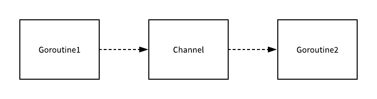

# Go 语言 Channel 实现原理精要

这一节中的内容总共包含两个部分，我们会先介绍 Channel 的设计原理以及它在 Go 语言中的数据结构，接下来我们会分析常见的 Channel 操作，例如创建、发送、接收和关闭的实现原理，由于在 [Range](https://draveness.me/golang-for-range) 和 [Select](https://draveness.me/golang-select) 两节中我们会提到 Channel 在不同的控制结构中组合使用时的现象，所以这一节还是会将重点放到 Channel 的常见操作上。

## 概述

作为 Go 语言中核心的数据结构和 Goroutine 之间的通信方式，Channel 是支撑 Go 语言高性能并发编程模型的结构之一，我们首先需要了解 Channel 背后的设计原理以及它的底层数据结构。

### 设计原理

在 Go 语言中，一个最常见的也是经常被人提及的设计模式就是**不要通过共享内存的方式进行通信，而是应该通过通信的方式共享内存**，在很多主流的编程语言中，当我们想要并发执行一些代码时，我们往往都会在多个线程之间共享变量，同时为了解决线程冲突的问题，我们又需要在读写这些变量时加锁。


Go 语言对于并发编程的设计与上述这种共享内存的方式完全不同，虽然我们在 Golang 中也能使用共享内存加互斥锁来实现并发编程，但是与此同时，Go 语言也提供了一种不同的并发模型，也就是 CSP，即通信顺序进程（Communicating sequential processes），Goroutine 其实就是 CSP 中的实体，Channel 就是用于传递信息的通道，使用 CSP 并发模型的 Goroutine 就会通过 Channel 来传递消息。



上图中的两个 Goroutine，一个会负责向 Channel 中发送消息，另一个会负责从 Channel 中接收消息，它们两者并没有任何直接的关联，能够独立地工作和运行，但是间接地通过 Channel 完成了通信。

我们在这一节中不会展开介绍 Go 语言选择实现 CSP 模型的原因，也不会比较不同并发模型的优劣，而是会将重点放到与 Channel 本身更相关的内容上，有关并发模型和程序设计的其他问题，作者将在其他的文章中展开介绍。

### 数据结构

虽然我们在使用 Go 语言时接触到的 Channel 类型都是类似 `chan int` 的，但是它们在 Go 语言中都是以 `hchan` 结构体的形式存在的，每当在 Go 语言中创建新的 Channel 时，实际上创建的都是一个如下的结构体：

```go
type hchan struct {
	qcount   uint
	dataqsiz uint
	buf      unsafe.Pointer
	elemsize uint16
	closed   uint32
	elemtype *_type
	sendx    uint  
	recvx    uint
	recvq    waitq
	sendq    waitq

	lock mutex
}
```

`hchan` 结构体中的五个字段 `qcount`、`dataqsize`、`buf`、`sendx`、`recv` 的主要作用就是构建底层的循环队列，其中 `qcount` 保存了当前 Channel 中的元素个数，`dataqsize` 表示 Channel 中的循环队列的长度，`buf`指向了一个长度为 `dataqsiz` 的数组，最后的两个 `sendx` 和 `recvx` 负责标识当前 Channel 的发送和接收已经处理到了数组中的哪个位置。

除此之外，`elemsize` 和 `elemtype` 分别表示了当前 Channel 能够收发的元素类型和大小，`sendq` 和 `recvq`的主要作用就是存储当前 Channel 由于缓冲区空间不足而阻塞的 Goroutine 列表：

```go
type waitq struct {
	first *sudog
	last  *sudog
}
```

`sudog` 是一个运行时的结构体的，它的主要作用就是表示一个在等待列表中的 Goroutine，其中存储着关于这一次阻塞的信息以及两个分别指向前后的 `sudog` 指针。

## 基本操作

当我们在使用 Channel 时，能够执行的操作其实也就只有创建、发送、接收和关闭几种：

```go
ch := make(chan int, 1)
ch <- 1
<-ch
close(ch)
```

我们在这一节中要介绍的就是这四种不同的 Channel 操作，在 Go 语言中的实现原理，包括它们的 [编译过程](https://draveness.me/golang-compile-intro) 以及底层实际调用的方法和执行过程。

### 创建

首先我们先来了解一下 Channel 在 Go 语言中是如何创建的，就像我们在上面的代码中演示的，所有 Go 语言 Channel 的创建都是由 `make` 关键字完成的，我们在前面介绍 [数组](https://draveness.me/golang-array-and-slice) 和 [哈希表](https://draveness.me/golang-hashmap) 的创建时都介绍了使用 `make` 关键字初始化数据结构的过程，我们在这里也需要说一下如何使用 `make` 创建管道。

Golang 中所有形如 `make(chan int, 10)` 在编译期间会先被转换成 `OMAKE` 类型的节点，随后的 [类型检查](https://draveness.me/golang-typecheck) 阶段在发现 `make` 的第一个参数是 Channel 类型时会将 `OMAKE` 类型的节点转换成 `OMAKECHAN`：

```go
func typecheck1(n *Node, top int) (res *Node) {
	switch n.Op {
	case OMAKE:
		// ...
		switch t.Etype {
		case TCHAN:
			l = nil
			if i < len(args) {
				l = args[i]
				i++
				l = typecheck(l, ctxExpr)
				l = defaultlit(l, types.Types[TINT])
				if l.Type == nil {
					n.Type = nil
					return n
				}
				if !checkmake(t, "buffer", l) {
					n.Type = nil
					return n
				}
				n.Left = l
			} else {
				n.Left = nodintconst(0)
			}
			n.Op = OMAKECHAN
		}
	}
```

在这一阶段其实就会对传入的缓冲区大小进行检查，当然如果我们不向 `make` 中传递表示缓冲区大小的参数，那么其实就会设置一个默认值 0，也就是当前的 Channel 不存在缓冲区。

`OMAKECHAN` 类型的节点最终都会在 [SSA 中间代码生成](https://draveness.me/golang-ir-ssa) 阶段之前被转换成`makechan` 或者 `makechan64` 的函数调用：

```go
func walkexpr(n *Node, init *Nodes) *Node {
	switch n.Op {
	case OMAKECHAN:
		size := n.Left
		fnname := "makechan64"
		argtype := types.Types[TINT64]

		if size.Type.IsKind(TIDEAL) || maxintval[size.Type.Etype].Cmp(maxintval[TUINT]) <= 0 {
			fnname = "makechan"
			argtype = types.Types[TINT]
		}

		n = mkcall1(chanfn(fnname, 1, n.Type), n.Type, init, typename(n.Type), conv(size, argtype))
	}
}
```

无论是 `makechan` 还是 `makechan64`，它们都是 Go 语言的运行时方法的，这两个方法的主要作用其实就是根据传入的参数类型和缓冲区大小创建一个新的 Channel 结构，两者的主要区别后者用于处理缓冲区大小大于 32 位的情况，我们可以直接来看 `makechan` 的实现：

```go
func makechan(t *chantype, size int) *hchan {
	elem := t.elem
	mem, _ := math.MulUintptr(elem.size, uintptr(size))

	var c *hchan
	switch {
	case mem == 0:
		c = (*hchan)(mallocgc(hchanSize, nil, true))
		c.buf = c.raceaddr()
	case elem.kind&kindNoPointers != 0:
		c = (*hchan)(mallocgc(hchanSize+mem, nil, true))
		c.buf = add(unsafe.Pointer(c), hchanSize)
	default:
		c = new(hchan)
		c.buf = mallocgc(mem, elem, true)
	}

	c.elemsize = uint16(elem.size)
	c.elemtype = elem
	c.dataqsiz = uint(size)

	return c
}
```

这里会根据 Channel 中收发元素的类型和 Channel 缓冲区的大小来为当前的 `hchan` 结构体和用于缓冲的底层的循环数组：

- 如果当前 Channel 中不存在缓冲区，那么就只会为 `hchan` 分配一段内存空间；
- 如果当前 Channel 中存储的类型不是指针类型，就会直接为当前的 Channel 和底层的数组分配一块连续的内存空间；
- 在默认情况下会单独为 `hchan` 和缓冲区分配内存；

在函数的最后会更新 `hchan` 的 `elemsize`、`elemtype` 和 `dataqsiz` 几个字段，从代码中我们可以看出 Channel 的初始化其实非常简单，比较关键的地方在于它会根据传入的缓冲区大小初始化循环数组，我们会在之后看到这个循环数组的使用方法。

### 发送

当我们想要向一个 Channel 发送数据时，就需要使用类似 `ch <- i` 表达式，这个表达式会被编译器解析成 `OSEND` 节点，同样地在 SSA 中间代码的生成期间，这些 `OSEND` 节点也会被转换成 `chansend1` 的函数调用：

```go
func walkexpr(n *Node, init *Nodes) *Node {
	switch n.Op {
	case OSEND:
		n1 := n.Right
		n1 = assignconv(n1, n.Left.Type.Elem(), "chan send")
		n1 = walkexpr(n1, init)
		n1 = nod(OADDR, n1, nil)
		n = mkcall1(chanfn("chansend1", 2, n.Left.Type), nil, init, n.Left, n1)
	}
}
```

`chansend1` 只是调用了 `chansend` 并传入 Channel 和需要发送的数据，在调用 `chansend` 时其实也传入了 `block=true`，这就标识了当前的发送操作是一个阻塞的操作，`chansend` 就是向 Channel 中发送数据时最终会调用的函数，这个函数负责了发送数据的全部逻辑：

```go
func chansend(c *hchan, ep unsafe.Pointer, block bool, callerpc uintptr) bool {
	lock(&c.lock)

	if c.closed != 0 {
		unlock(&c.lock)
		panic(plainError("send on closed channel"))
	}
```

在发送数据的逻辑执行之前会先为当前 Channel 加锁，防止出现竞争条件的问题，如果当前 Channel 结构已经通过 `closed` 字段被标记成了关闭，那么在向该 Channel 发送数据时就会直接 `panic` 报出一个非常常见的错误 `"send on closed channel"` 并返回。

#### 直接发送

如果目标 Channel 被关闭并且已经有处于读等待的 Goroutine，那么`chansend` 函数会通过 `dequeue` 从 `recvq` 中取出最先陷入等待的 Goroutine 并直接向它发送数据：

```go
	if sg := c.recvq.dequeue(); sg != nil {
		send(c, sg, ep, func() { unlock(&c.lock) }, 3)
		return true
	}
```

我们可以从下面图中简单了解一下如果 Channel 中存在等待消息的 Goroutine 时，发送消息的处理过程：


发送数据时调用的就是 `send` 函数了，这个函数的执行其实分成两个部分，第一部分是使用 `sendDirect` 函数将发送的消息直接拷贝到类似 `x = <-c` 表达式中变量 `x` 所在的内存地址上：

```go
func send(c *hchan, sg *sudog, ep unsafe.Pointer, unlockf func(), skip int) {
	if sg.elem != nil {
		sendDirect(c.elemtype, sg, ep)
		sg.elem = nil
	}
	gp := sg.g
	unlockf()
	gp.param = unsafe.Pointer(sg)
	goready(gp, skip+1)
}
```

随后的 `goready` 函数会将等待接收数据的 Goroutine 标记成 `Grunnable` 并把该协程放到发送方所在的处理器上等待执行，该处理器在下一次调度时就会立刻唤醒消息接收方所在的协程。


我们在这里可以简单总结一下执行的过程，当我们向 Channel 发送消息并且 Channel 中存在处于等待状态的 Goroutine 协程时，就会执行以下的过程：

1. 调用 `sendDirect` 函数将发送的消息拷贝到接收方持有的目标内存地址上；
2. 将接收方 Goroutine 的状态修改成 `Grunnable` 并更新发送方所在处理器 P 的 `runnext` 属性，当处理器 P 再次发生调度时就会优先执行 `runnext` 中的协程；

需要注意的是，每次遇到这种情况时都会将 `recvq` 队列中的 `sudog` 结构体出队；除此之外，接收方 Goroutine 被调度的时机也十分有趣，通过阅读源代码我们其实可以看到在发送的过程中其实只是将接收方的 Goroutine 放到了 `runnext` 中，实际上 P 并没有立刻执行该协程，作者使用以下的代码来验证调度发生的时机：

```go
package main

func main() { // breakpoint 1
	ch := make(chan int)
	go func() {
		for i := range ch {
			println(i) // breakpoint 2
		}
	}()

	ch <- 1

	wait := make(chan int) // breakpoint 3
	<-wait
}
```

我们在上述代码的三个地方打了断点，当使用 [delve](https://github.com/go-delve/delve) 进行调试时其实就会发现执行的顺序其实是 1 -> 3 -> 2，具体的调试过程作者就不详细介绍了，感兴趣的读者可以学习一下 delve 的使用并亲自试验一下；总而言之，在这种情况下，向管道 Channel 中发送数据的过程并不是阻塞的。

#### 缓冲区

向 Channel 中发送数据时遇到的第二种情况就是创建的 Channel 包含缓冲区并且 Channel 中的数据没有装满，在这时就会执行下面的这段代码：

```go
func chansend(c *hchan, ep unsafe.Pointer, block bool, callerpc uintptr) bool {
	// ...
	if c.qcount < c.dataqsiz {
		qp := chanbuf(c, c.sendx)
		typedmemmove(c.elemtype, qp, ep)
		c.sendx++
		if c.sendx == c.dataqsiz {
			c.sendx = 0
		}
		c.qcount++
		unlock(&c.lock)
		return true
	}
```

在这里我们首先会使用 `chanbuf` 计算出下一个可以放置待处理变量的位置，然后通过 `typedmemmove` 将发送的消息拷贝到缓冲区中并增加 `sendx` 索引和 `qcount` 计数器，在函数的最后会释放持有的锁。


如果当前 Channel 的缓冲区未满时，向 Channel 发送数据时就会直接存储在 Channel 中 `sendx` 索引所在的位置并将 `sendx` 索引加一，由于这里的 `buf` 其实是一个循环数组，所以在 `sendx` 的值等于 `dataqsiz` 的大小时就会重新回到数组开始的位置。

#### 阻塞发送

最后要介绍的就是向 Channel 发送但是遇到下游无法处理的『阻塞发送』了，当然如果传入的参数 `block=false`，那么就会直接释放持有的锁并返回 `false` 表示这一次的发送不成功。

在常见的场景中，向 Channel 发送消息的操作基本上都是阻塞的，在这时就会执行下面的代码，我们可以简单梳理一下这段代码的逻辑：

```go
func chansend(c *hchan, ep unsafe.Pointer, block bool, callerpc uintptr) bool {
	// ...
	if !block {
		unlock(&c.lock)
		return false
	}

	gp := getg()
	mysg := acquireSudog()
	mysg.releasetime = 0
	mysg.elem = ep
	mysg.waitlink = nil
	mysg.g = gp
	mysg.isSelect = false
	mysg.c = c
	gp.waiting = mysg
	gp.param = nil
	c.sendq.enqueue(mysg)
	goparkunlock(&c.lock, waitReasonChanSend, traceEvGoBlockSend, 3)

	gp.waiting = nil
	gp.param = nil
	mysg.c = nil
	releaseSudog(mysg)
	return true
}
```

1. 调用 `getg` 获取发送操作时使用的 Goroutine 协程；
2. 执行 `acquireSudog` 函数获取一个 `sudog` 结构体并设置这一次阻塞发送的相关信息，例如发送的 Channel、是否在 [Select](https://draveness.me/golang-select) 控制结构中、发送数据所在的地址等；
3. 将刚刚创建并初始化的 `sudog` 结构体加入 `sendq` 等待队列，并设置到当前 Goroutine 的 `waiting` 上，表示 Goroutine 正在等待该 `sudog` 准备就绪；
4. 调用 `goparkunlock` 函数将当前的 Goroutine 更新成 `Gwaiting` 状态并解锁，该 Goroutine 可以被调用 `goready` 再次唤醒；
5. 当前的 Goroutine 其实就会在这里陷入阻塞状态等待被调度器唤醒了；
6. 如果被调度器唤醒就会执行一些收尾的工作，将一些属性置零并且释放 `sudog` 结构体；

在最后，函数会返回 `true` 表示这一次发送的结束并继续运行当前 Goroutine 应该执行的逻辑。

#### 小结

我们在这里可以简单梳理和总结一下使用 `ch <- i` 表达式向 Channel 发送数据时遇到的几种情况：

1. 如果当前 Channel 的 `recvq` 上存在已经被阻塞的 Goroutine，那么会直接将数据发送给当前的 Goroutine 并将其设置成下一个运行的协程；
2. 如果 Channel 存在缓冲区并且其中还有空闲的容量，我们就会直接将数据直接存储到当前缓冲区 `sendx` 所在的位置上；
3. 如果都不满足上面的两种情况，就会创建一个 `sudog` 结构并加入 Channel 的 `sendq` 队列并更新到 Goroutine 的 `waiting` 字段上，同时当前的 Goroutine 就会陷入阻塞等待其他的协程向 Channel 发送数据，一旦有其它的写成向 Channel 发送数据时就会唤醒当前的 Goroutine；

发送数据的过程中包含几个会触发 Goroutine 调度的时机，首先是发送数据时发现 Channel 上存在等待接收数据的 Goroutine，这是会立刻设置处理器的 `runnext` 属性，但是并不会立刻触发调度，第二个时机是发送数据时并没有找到接收方并且缓冲区已经满了，这时就会将自己加入 Channel 的 `sendq` 队列并立刻调用 `goparkunlock` 触发 Goroutine 的调度让出处理器的使用权。

### 接收

分析了 Channel 发送数据的过程之后，我们就可以继续介绍数据处理的另一端，也就是数据的接收了，我们在 Go 语言中其实有两种不同的方式去接收管道中的数据：

```go
i <- ch
i, ok <- ch
```

这两种不同的方法经过编译器的处理都会变成 `ORECV` 类型的节点，但是后者会在 [类型检查](https://draveness.me/golang-typecheck) 阶段被转换成 `OAS2RECV` 节点，我们可以简单看一下这里转换的路线图：


虽然这两种不同的接收方式会被转换成 `chanrecv1` 和 `chanrecv2` 两种不同函数的调用，但是这两个函数最终调用的还是 `chanrecv`。

`chanrecv` 处理数据接收时总共可以分成五种不同的情况，当我们从一个空 Channel 中接收数据时会直接调用 `gopark` 直接让出当前 Goroutine 处理器的使用权。

```go
func chanrecv(c *hchan, ep unsafe.Pointer, block bool) (selected, received bool) {
	if c == nil {
		if !block {
			return
		}
		gopark(nil, nil, waitReasonChanReceiveNilChan, traceEvGoStop, 2)
		throw("unreachable")
	}

	lock(&c.lock)

	if c.closed != 0 && c.qcount == 0 {
		unlock(&c.lock)
		if ep != nil {
			typedmemclr(c.elemtype, ep)
		}
		return true, false
	}
```

如果当前的 Channel 已经被关闭并且缓冲区中不存在任何的数据，那么就会直接解锁当前的 Channel 并清除 `ep` 指针的数据。

#### 直接接收

当 Channel 的 `sendq` 队列中包含处于等待状态的 Goroutine 时，我们其实就会直接取出队列头的 Goroutine，这里处理的逻辑和发送时所差无几，只是发送数据时调用的是 `send` 函数，而这里是 `recv` 函数：

```go
	if sg := c.sendq.dequeue(); sg != nil {
		recv(c, sg, ep, func() { unlock(&c.lock) }, 3)
		return true, true
	}
```

`recv` 函数的实现其实也与 `send` 非常相似，我们可以简单看一下这里执行的逻辑：

```go
func recv(c *hchan, sg *sudog, ep unsafe.Pointer, unlockf func(), skip int) {
	if c.dataqsiz == 0 {
		if ep != nil {
			recvDirect(c.elemtype, sg, ep)
		}
	} else {
		qp := chanbuf(c, c.recvx)
		if ep != nil {
			typedmemmove(c.elemtype, ep, qp)
		}
		typedmemmove(c.elemtype, qp, sg.elem)
		c.recvx++
		if c.recvx == c.dataqsiz {
			c.recvx = 0
		}
		c.sendx = c.recvx // c.sendx = (c.sendx+1) % c.dataqsiz
	}
	sg.elem = nil
	gp := sg.g
	unlockf()
	gp.param = unsafe.Pointer(sg)
	goready(gp, skip+1)
}
```

1. 如果当前 Channel 中不存在未被处理的数据，就会调用 `recvDirect`，这个函数会将 `sendq` 中 Goroutine 存储的 `elem` 数据拷贝到目标内存地址中；
2. 如果当前 Channel 已经满了，就会通过 `typedmemmove` 将队列中的数据拷贝到接收方的内存地址中并将发送方的数据拷贝到队列中，这样我们可以释放一个阻塞的发送方 Goroutine；
3. 在最后会解锁 Channel 并调用 `goready` 函数将当前处理器的 `runnext` 设置成发送数据的 Goroutine，随后 `<-ch` 会返回并执行下面的逻辑；


上图展示了 Channel 在缓冲区已经没有空间并且 `sendq` 中存在等待的 Goroutine 时，使用 `<-ch` 发生的变化，`sendq` 队列中的第一个 `sudog` 结构中的元素会替换 `sendx/recvx` 索引所在位置的元素，原有的元素会被拷贝到接收 `<-ch` 结果的内存空间上。

#### 缓冲区

另一种接收数据时遇到的情况就是，Channel 的缓冲区中已经包含了一些元素，在这时如果使用 `<-ch` 从 Channel 中接收元素，我们就会直接从缓冲区中 `recvx` 的索引位置中取出数据进行处理：

```go
func chanrecv(c *hchan, ep unsafe.Pointer, block bool) (selected, received bool) {
	// ...
	if c.qcount > 0 {
		qp := chanbuf(c, c.recvx)
		if ep != nil {
			typedmemmove(c.elemtype, ep, qp)
		}
		typedmemclr(c.elemtype, qp)
		c.recvx++
		if c.recvx == c.dataqsiz {
			c.recvx = 0
		}
		c.qcount--
		unlock(&c.lock)
		return true, true
	}
```

如果接收数据的内存地不为空，那么就会直接使用 `typedmemmove` 将缓冲区中的数据拷贝到内存中，在这之后会清除队列中的数据并完成收尾工作。


收尾工作就包括递增 `recvx` 索引的数据，当发现索引超过了当前队列的容量时，由于这是一个循环队列，所以就会将它归零；除此之外，这个函数还会减少 `qcount` 计数器并释放持有 Channel 的锁。

#### 阻塞接收

当 Channel 的 `sendq` 队列中不存在等待的 Goroutine 并且缓冲区中也不存在任何数据时，从管道中接收数据的操作在大多数时候就会变成一个阻塞的操作：

```go
func chanrecv(c *hchan, ep unsafe.Pointer, block bool) (selected, received bool) {
	// ...
	if !block {
		unlock(&c.lock)
		return false, false
	}

	gp := getg()
	mysg := acquireSudog()
	mysg.releasetime = 0
	mysg.elem = ep
	mysg.waitlink = nil
	gp.waiting = mysg
	mysg.g = gp
	mysg.isSelect = false
	mysg.c = c
	gp.param = nil
	c.recvq.enqueue(mysg)
	goparkunlock(&c.lock, waitReasonChanReceive, traceEvGoBlockRecv, 3)

	gp.waiting = nil
	closed := gp.param == nil
	gp.param = nil
	mysg.c = nil
	releaseSudog(mysg)
	return true, !closed
}
```

这种阻塞的情况下其实有一个例外，也就是与 [select](https://draveness.me/golang-select) 语句结合使用时就可能会使用到非阻塞 `block=false` 的接收操作，这段代码在这时就会获取一个 `sudog` 结构体设置到当前 Goroutine 的 `waiting` 上并将其入队到 `recvq` 中。

除此之外，当前代码片段还会调用 `goparkunlock` 函数立刻触发 Goroutine 的调度，将当前 Goroutine 的状态改成 `Gwaiting` 并让出处理器的使用权，在这时 Goroutine 就会处于休眠状态等待调度器的调度，重新执行时就会从 `gp.waiting = nil` 处继续运行下面的代码对数据进行清理。

#### 小结

我们简单梳理一下从 Channel 中接收数据时的几种情况：

1. 如果 Channel 是空的，那么就会直接调用 `gopark` 挂起当前的 Goroutine；
2. 如果 Channel 已经关闭并且缓冲区没有任何数据，`chanrecv` 函数就会直接返回；
3. 如果 Channel 上的 `sendq` 队列中存在挂起的 Goroutine，就会将`recvx` 索引所在的数据拷贝到接收变量所在的内存空间上并将 `sendq` 队列中 Goroutine 的数据拷贝到缓冲区中；
4. 如果 Channel 的缓冲区中包含数据就会直接从 `recvx` 所在的索引上进行读取；
5. 在默认情况下会直接挂起当前的 Goroutine，将 `sudog` 结构加入 `recvq` 队列并更新 Goroutine 的 `waiting` 属性，最后陷入休眠等待调度器的唤醒；

在从管道中接收数据的过程中，其实会在两个时间点触发 Goroutine 的调度，首先空的 Channel 意味着永远接收不到消息，那么就会直接挂起当前 Goroutine，第二个时间点是缓冲区中不存在数据，在这时也会直接挂起当前的 Goroutine 等待发送方发送数据。

### 关闭

用于关闭管道的 `close` 关键字也与上面提到的收发处理过程一样，它会在编译期间转换成 `OCLOSE` 节点，然后变成 `closechan` 的函数调用，如果 Channel 是一个空指针或者已经被关闭了，这两种情况都会直接 `panic`，抛出异常：

```go
func closechan(c *hchan) {
	if c == nil {
		panic(plainError("close of nil channel"))
	}

	lock(&c.lock)
	if c.closed != 0 {
		unlock(&c.lock)
		panic(plainError("close of closed channel"))
	}
```

处理完了这些异常的情况之后就可以开始执行关闭 Channel 的逻辑了，下面这段代码的主要工作就是将 `recvq`和 `sendq` 两个队列中的数据加入到 Goroutine 列表 `gList` 中，与此同时会清除所有 `sudog` 上未被处理的元素：

```go
	c.closed = 1

	var glist gList
	for {
		sg := c.recvq.dequeue()
		if sg == nil {
			break
		}
		if sg.elem != nil {
			typedmemclr(c.elemtype, sg.elem)
			sg.elem = nil
		}
		gp := sg.g
		gp.param = nil
		glist.push(gp)
	}

	for {
		sg := c.sendq.dequeue()
		if sg == nil {
			break
		}
		sg.elem = nil
		gp := sg.g
		gp.param = nil
		glist.push(gp)
	}
	unlock(&c.lock)

	for !glist.empty() {
		gp := glist.pop()
		gp.schedlink = 0
		goready(gp, 3)
	}
}
```

在函数执行的最后会为所有被阻塞的 Goroutine 调用 `goready` 函数重新对这些协程进行调度，在上面我们已经简单介绍过 `goready` 的实现，所以在这里就不展开详细介绍了。

## 总结

Channel 作为 Go 语言中的基础数据结构，是 Go 语言能够提供强大并发能力的原因之一，我们在这一节中其实只介绍了 Channel 的数据结构以及相关的基本操作，在后面的章节中会提到各种关键字是如何与 Channel 结合并且发挥作用的，除此之外在谈到并发编程和协程调度等内容时，我们还是会重新提及 Channel。