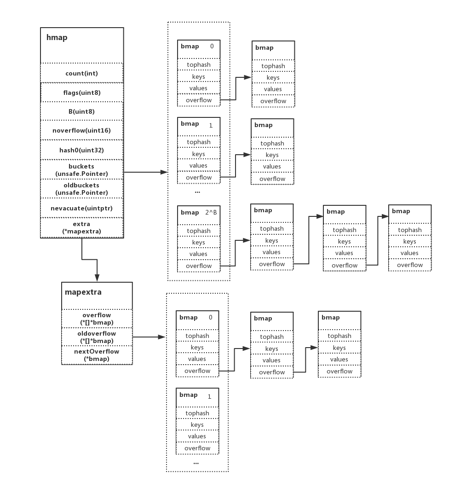
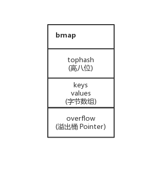
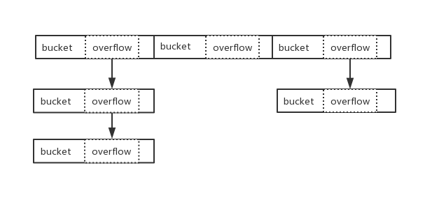
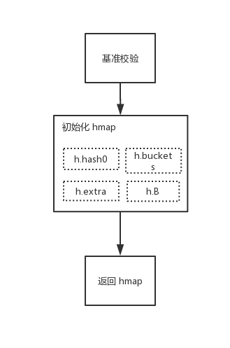

# 深入理解 Go map：初始化和访问元素

从本文开始咱们一起探索 Go map 里面的奥妙吧，看看它的内在是怎么构成的，又分别有什么值得留意的地方？

第一篇将探讨**初始化和访问元素**相关板块，咱们带着疑问去学习，例如：

- 初始化的时候会马上分配内存吗？
- 底层数据是如何存储的？
- 底层是如何使用 key 去寻找数据的？
- 底层是用什么方式解决哈希冲突的？
- 数据类型那么多，底层又是怎么处理的呢？

...

## 数据结构

首先我们一起看看 Go map 的基础数据结构，先有一个大致的印象



### hmap

```
type hmap struct {
	count     int 
	flags     uint8
	B         uint8
	noverflow uint16
	hash0     uint32
	buckets    unsafe.Pointer
	oldbuckets unsafe.Pointer
	nevacuate  uintptr 
	extra *mapextra
}

type mapextra struct {
	overflow    *[]*bmap
	oldoverflow *[]*bmap
	nextOverflow *bmap
}
```

- count：map 的大小，也就是 len() 的值。代指 map 中的键值对个数
- flags：状态标识，主要是 goroutine 写入和扩容机制的相关状态控制。并发读写的判断条件之一就是该值
- B：桶，最大可容纳的元素数量，值为 **负载因子（默认 6.5） \* 2 ^ B**，是 2 的指数
- noverflow：溢出桶的数量
- hash0：哈希因子
- buckets：保存当前桶数据的指针地址（指向一段连续的内存地址，主要存储键值对数据）
- oldbuckets，保存旧桶的指针地址
- nevacuate：迁移进度
- extra：原有 buckets 满载后，会发生扩容动作，在 Go 的机制中使用了增量扩容，如下为细项：
  - `overflow` 为 `hmap.buckets` （当前）溢出桶的指针地址
  - `oldoverflow` 为 `hmap.oldbuckets` （旧）溢出桶的指针地址
  - `nextOverflow` 为空闲溢出桶的指针地址

在这里我们要注意几点，如下：

1. 如果 keys 和 values 都不包含指针并且允许内联的情况下。会将 bucket 标识为不包含指针，使用 extra 存储溢出桶就可以避免 GC 扫描整个 map，节省不必要的开销
2. 在前面有提到，Go 用了增量扩容。而 `buckets` 和 `oldbuckets` 也是与扩容相关的载体，一般情况下只使用 `buckets`，`oldbuckets` 是为空的。但如果正在扩容的话，`oldbuckets` 便不为空，`buckets` 的大小也会改变
3. 当 `hint` 大于 8 时，就会使用 `*mapextra` 做溢出桶。若小于 8，则存储在 buckets 桶中

### bmap

[

```
bucketCntBits = 3
bucketCnt     = 1 << bucketCntBits
...
type bmap struct {
	tophash [bucketCnt]uint8
}
```

- tophash：key 的 hash 值高 8 位
- keys：8 个 key
- values：8 个 value
- overflow：下一个溢出桶的指针地址（当 hash 冲突发生时）

实际 bmap 就是 buckets 中的 bucket，一个 bucket 最多存储 8 个键值对

#### tophash

tophash 是个长度为 8 的数组，代指桶最大可容纳的键值对为 8。

存储每个元素 hash 值的高 8 位，如果 `tophash [0] <minTopHash`，则 `tophash [0]` 表示为迁移进度

#### keys 和 values

在这里我们留意到，存储 k 和 v 的载体并不是用 `k/v/k/v/k/v/k/v` 的模式，而是 `k/k/k/k/v/v/v/v` 的形式去存储。这是为什么呢？

```
map[int64]int8
```

在这个例子中，如果按照 `k/v/k/v/k/v/k/v` 的形式存放的话，虽然每个键值对的值都只占用 1 个字节。但是却需要 7 个填充字节来补齐内存空间。最终就会造成大量的内存 “浪费”

[](https://camo.githubusercontent.com/81fcf907199883bebea0c5533a6b7f2c77ccdc00/68747470733a2f2f692e696d6775722e636f6d2f794e57424471442e706e67)

但是如果以 `k/k/k/k/v/v/v/v` 的形式存放的话，就能够解决因对齐所 "浪费" 的内存空间

因此这部分的拆分主要是考虑到内存对齐的问题，虽然相对会复杂一点，但依然值得如此设计

[](https://camo.githubusercontent.com/789a45b75affb8f836d088a6e06de4124524b50a/68747470733a2f2f692e696d6775722e636f6d2f447373534652722e706e67)

#### overflow

可能会有同学疑惑为什么会有溢出桶这个东西？实际上在不存在哈希冲突的情况下，去掉溢出桶，也就是只需要桶、哈希因子、哈希算法。也能实现一个简单的 hash table。但是哈希冲突（碰撞）是不可避免的...

而在 Go map 中当 `hmap.buckets` 满了后，就会使用溢出桶接着存储。我们结合分析可确定 Go 采用的是数组 + 链地址法解决哈希冲突

[](https://camo.githubusercontent.com/190ad973ef1a1f6d366627b73dd92d3ecbf225d5/68747470733a2f2f692e696d6775722e636f6d2f7548654850386b2e706e67)

## 初始化

### 用法

```
m := make(map[int32]int32)
```

### 函数原型

通过阅读源码可得知，初始化方法有好几种。函数原型如下：

```
func makemap_small() *hmap
func makemap64(t *maptype, hint int64, h *hmap) *hmap
func makemap(t *maptype, hint int, h *hmap) *hmap
```

- makemap_small：当 `hint` 小于 8 时，会调用 `makemap_small` 来初始化 hmap。主要差异在于是否会马上初始化 hash table
- makemap64：当 `hint` 类型为 int64 时的特殊转换及校验处理，后续实质调用 `makemap`
- makemap：实现了标准的 map 初始化动作

### 源码

```
func makemap(t *maptype, hint int, h *hmap) *hmap {
	if hint < 0 || hint > int(maxSliceCap(t.bucket.size)) {
		hint = 0
	}

	if h == nil {
		h = new(hmap)
	}
	h.hash0 = fastrand()

	B := uint8(0)
	for overLoadFactor(hint, B) {
		B++
	}
	h.B = B

	if h.B != 0 {
		var nextOverflow *bmap
		h.buckets, nextOverflow = makeBucketArray(t, h.B, nil)
		if nextOverflow != nil {
			h.extra = new(mapextra)
			h.extra.nextOverflow = nextOverflow
		}
	}

	return h
}
```

- 根据传入的 `bucket` 类型，获取其类型能够申请的最大容量大小。并对其长度 `make(map[k]v, hint)` 进行边界值检验
- 初始化 hmap
- 初始化哈希因子
- 根据传入的 `hint`，计算一个可以放下 `hint` 个元素的桶 `B` 的最小值
- 分配并初始化 hash table。如果 `B` 为 0 将在后续懒惰分配桶，大于 0 则会马上进行分配
- 返回初始化完毕的 hmap

在这里可以注意到，（当 `hint` 大于等于 8 ）第一次初始化 map 时，就会通过调用 `makeBucketArray` 对 buckets 进行分配。因此我们常常会说，在初始化时指定一个适当大小的容量。能够提升性能。

若该容量过少，而新增的键值对又很多。就会导致频繁的分配 buckets，进行扩容迁移等 rehash 动作。最终结果就是性能直接的下降（敲黑板）

而当 `hint` 小于 8 时，这种问题**相对**就不会凸显的太明显，如下：

```
func makemap_small() *hmap {
	h := new(hmap)
	h.hash0 = fastrand()
	return h
}
```

### 图示

[](https://camo.githubusercontent.com/2e9829f2ca753fdd172889d77af358353b23f78b/68747470733a2f2f692e696d6775722e636f6d2f486f69303151742e706e67)

## 访问

### 用法

```
v := m[i]
v, ok := m[i]
```

### 函数原型

在实现 map 元素访问上有好几种方法，主要是包含针对 32/64 位、string 类型的特殊处理，总的函数原型如下：

```
mapaccess1(t *maptype, h *hmap, key unsafe.Pointer) unsafe.Pointer
mapaccess2(t *maptype, h *hmap, key unsafe.Pointer) (unsafe.Pointer, bool)

mapaccessK(t *maptype, h *hmap, key unsafe.Pointer) (unsafe.Pointer, unsafe.Pointer)

mapaccess1_fat(t *maptype, h *hmap, key, zero unsafe.Pointer) unsafe.Pointer
mapaccess2_fat(t *maptype, h *hmap, key, zero unsafe.Pointer) (unsafe.Pointer, bool)

mapaccess1_fast32(t *maptype, h *hmap, key uint32) unsafe.Pointer
mapaccess2_fast32(t *maptype, h *hmap, key uint32) (unsafe.Pointer, bool)
mapassign_fast32(t *maptype, h *hmap, key uint32) unsafe.Pointer
mapassign_fast32ptr(t *maptype, h *hmap, key unsafe.Pointer) unsafe.Pointer

mapaccess1_fast64(t *maptype, h *hmap, key uint64) unsafe.Pointer
...

mapaccess1_faststr(t *maptype, h *hmap, ky string) unsafe.Pointer
...
```

- mapaccess1：返回 `h[key]` 的指针地址，如果键不在 `map` 中，将返回对应类型的零值
- mapaccess2：返回 `h[key]` 的指针地址，如果键不在 `map` 中，将返回零值和布尔值用于判断

### 源码

```
func mapaccess1(t *maptype, h *hmap, key unsafe.Pointer) unsafe.Pointer {
	...
	if h == nil || h.count == 0 {
		return unsafe.Pointer(&zeroVal[0])
	}
	if h.flags&hashWriting != 0 {
		throw("concurrent map read and map write")
	}
	alg := t.key.alg
	hash := alg.hash(key, uintptr(h.hash0))
	m := bucketMask(h.B)
	b := (*bmap)(add(h.buckets, (hash&m)*uintptr(t.bucketsize)))
	if c := h.oldbuckets; c != nil {
		if !h.sameSizeGrow() {
			// There used to be half as many buckets; mask down one more power of two.
			m >>= 1
		}
		oldb := (*bmap)(add(c, (hash&m)*uintptr(t.bucketsize)))
		if !evacuated(oldb) {
			b = oldb
		}
	}
	top := tophash(hash)
	for ; b != nil; b = b.overflow(t) {
		for i := uintptr(0); i < bucketCnt; i++ {
			if b.tophash[i] != top {
				continue
			}
			k := add(unsafe.Pointer(b), dataOffset+i*uintptr(t.keysize))
			if t.indirectkey {
				k = *((*unsafe.Pointer)(k))
			}
			if alg.equal(key, k) {
				v := add(unsafe.Pointer(b), dataOffset+bucketCnt*uintptr(t.keysize)+i*uintptr(t.valuesize))
				if t.indirectvalue {
					v = *((*unsafe.Pointer)(v))
				}
				return v
			}
		}
	}
	return unsafe.Pointer(&zeroVal[0])
}
```

- 判断 map 是否为 nil，长度是否为 0。若是则返回零值
- 判断当前是否并发读写 map，若是则抛出异常
- 根据 key 的不同类型调用不同的 hash 方法计算得出 hash 值
- 确定 key 在哪一个 bucket 中，并得到其位置
- 判断是否正在发生扩容（h.oldbuckets 是否为 nil），若正在扩容，则到老的 buckets 中查找（因为 buckets 中可能还没有值，搬迁未完成），若该 bucket 已经搬迁完毕。则到 buckets 中继续查找
- 计算 hash 的 tophash 值（高八位）
- 根据计算出来的 tophash，依次循环对比 buckets 的 tophash 值（快速试错）
- 如果 tophash 匹配成功，则计算 key 的所在位置，正式完整的对比两个 key 是否一致
- 若查找成功并返回，若不存在，则返回零值

在上述步骤三中，提到了根据不同的类型计算出 hash 值，另外会计算出 hash 值的高八位和低八位。低八位会作为 bucket index，作用是用于找到 key 所在的 bucket。而高八位会存储在 bmap tophash 中

其主要作用是在上述步骤七中进行迭代快速定位。这样子可以提高性能，而不是一开始就直接用 key 进行一致性对比

### 图示

[](https://camo.githubusercontent.com/8c84e036005d93f5360ff17344aabbedd78180c0/68747470733a2f2f692e696d6775722e636f6d2f5934726d6f6c582e706e67)

## 总结

在本章节，我们介绍了 map 类型的以下知识点：

- map 的基础数据结构
- 初始化 map
- 访问 map

从阅读源码中，得知 Go 本身**对于一些不同大小、不同类型的属性，包括哈希方法都有编写特定方法**去运行。总的来说，这块的设计隐含较多的思路，有不少点值得细细品尝 :)

注：本文基于 Go 1.11.5