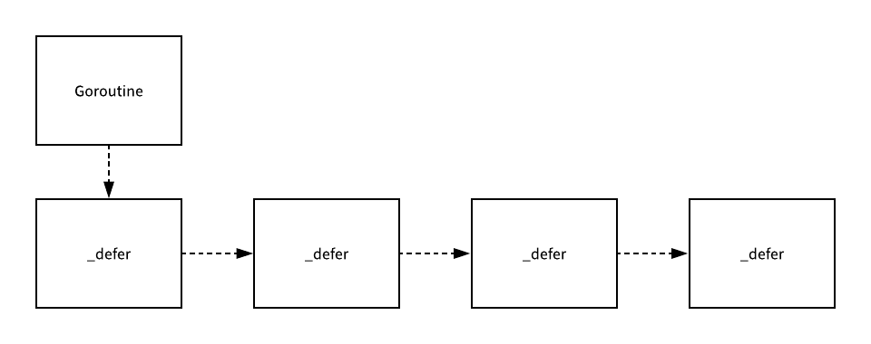

# 理解 Go 语言 defer 关键字的原理

现在很多现代的编程语言中其实都有用于**在作用域结束之后执行函数**的关键字，Go 语言中的 `defer` 就可以用来实现这一功能，它的主要作用就是在当前函数或者方法**返回之前**调用一些用于收尾的函数，例如关闭文件描述符、关闭数据库连接以及解锁资源。

在这一节中我们就会深入 Go 语言的源代码介绍 `defer` 关键字的实现原理，相信阅读完这一节的读者都会对 `defer` 的结构、实现以及调用过程有着非常清晰的认识和理解。

## 概述

作为一个编程语言中的关键字，`defer` 的实现一定是由编译器和运行时共同完成的，不过在深入源码分析它的实现之前我们还是需要了解一些 `defer` 关键字的常见使用场景以及一些使用时的注意事项。

### 常见使用

首先要介绍的就是使用 `defer` 最常见的场景，也就是在 `defer` 关键字中完成一些收尾的工作，例如在 `defer`中回滚一个数据库的事务：

```go
func createPost(db *gorm.DB) error {
    tx := db.Begin()
    defer tx.Rollback()
    
    if err := tx.Create(&Post{Author: "Draveness"}).Error; err != nil {
        return err
    }
    
    return tx.Commit().Error
}
```

在使用数据库事务时，我们其实可以使用如上所示的代码在创建事务之后就立刻调用 `Rollback` 保证事务一定会回滚，哪怕事务真的执行成功了，那么在调用 `tx.Commit()` 之后再执行 `tx.Rollback()` 其实也不会影响已经提交的事务。

### 作用域

当我们在一个 `for` 循环中使用 `defer` 时也会在退出函数之前执行其中的代码，下面的代码总共调用了五次 `defer` 关键字：

```go
func main() {
	for i := 0; i < 5; i++ {
		defer fmt.Println(i)
	}
}

$ go run main.go
5
4
3
2
1
```

运行上述代码时其实会倒序执行所有向 `defer` 关键字中传入的表达式，最后一次 `defer` 调用其实使用了 `fmt.Println(4)` 表达式，所以会被优先执行并打印；我们可以通过另一个简单的例子，来强化理解一下 `defer`执行的时机：

```go
func main() {
    {
        defer fmt.Println("defer runs")
        fmt.Println("block ends")
    }
    
    fmt.Println("main ends")
}

$ go run main.go
block ends
main ends
defer runs
```

从上述代码的输出我们会发现，`defer` 并不是在退出当前代码块的作用域时执行的，**defer 只会在当前函数和方法返回之前被调用**。

### 传值

Go 语言中所有的函数调用其实都是值传递的，`defer` 虽然是一个关键字，但是也继承了这个特性，假设我们有以下的代码，在运行这段代码时会打印出 `0`：

```go
type Test struct {
    value int
}

func (t Test) print() {
    println(t.value)
}

func main() {
	test := Test{}
	defer test.print()
	test.value += 1
}

$ go run main.go
0
```

这其实表明当 `defer` 调用时其实会对函数中引用的外部参数进行拷贝，所以 `test.value += 1` 操作并没有修改被 `defer` 捕获的 `test` 结构体，不过如果我们修改 `print` 函数签名的话，其实结果就会稍有不同：

```go
type Test struct {
    value int
}

func (t *Test) print() {
    println(t.value)
}

func main() {
	test := Test{}
	defer test.print()
	test.value += 1
}

$ go run main.go
1
```

这里再调用 `defer` 关键字时其实也是进行的值传递，只是发生复制的是指向 `test` 的指针，我们可以将 `test`变量理解成 `print` 函数的第一个参数，在上一段代码中这个参数的类型是结构体，所以会复制整个结构体，而在这段代码中，拷贝的其实是指针，所以当我们修改 `test.value` 时，`defer` 捕获的指针其实就能够访问到修改后的变量了。

## 实现原理

作者相信各位读者哪怕之前对 `defer` 毫无了解，到了这里也应该对它的使用、作用域以及常见问题有了一些基本的了解，这一节中我们将从三个方面介绍 `defer` 关键字的实现原理，它们分别是 `defer` 关键字对应的数据结构、编译器对 `defer` 的处理和运行时函数的调用。

### 结构

在介绍 `defer` 函数的执行过程与实现原理之前，我们首先来了解一下 `defer` 关键字在 Go 语言中存在的结构和形式，

```go
type _defer struct {
	siz     int32
	started bool
	sp      uintptr
	pc      uintptr
	fn      *funcval
	_panic  *_panic
	link    *_defer
}
```

在 `_defer` 结构中的 `sp` 和 `pc` 分别指向了栈指针和调用方的程序计数器，`fn` 存储的就是向 `defer` 关键字中传入的函数了。

### 编译期间

`defer` 关键字是在 Go 语言编译期间的 SSA 阶段才被 `stmt` 函数处理的，我们能在 `stmt` 中的 `switch/case`语句中找到处理 `ODEFER` 节点的相关逻辑，可以看到这段代码其实调用了 `call` 函数，这表示 `defer` 在编译器看来也是一次函数调用，它们的处理逻辑其实也是差不多的。

```go
func (s *state) stmt(n *Node) {
	switch n.Op {
	case ODEFER:
		s.call(n.Left, callDefer)
	}
}
```

被调用的 `call` 函数其实负责了 Go 语言中所有函数和方法调用的 [中间代码生成](https://draveness.me/golang-ir-ssa)，它的工作主要包括以下内容：

1. 获取需要执行的函数名、闭包指针、代码指针和函数调用的接收方；
2. 获取栈地址并将函数或者方法的参数写入栈中；
3. 使用 `newValue1A` 以及相关函数生成函数调用的中间代码；
4. 如果当前调用的『函数』是 `defer`，那么就会单独生成相关的结束代码块；
5. 最后会获取函数的返回值地址并结束当前方法的调用；

由于我们在这一节中主要关注的内容其实就是 `defer` 最终调用了什么方法，所以在这里删除了函数中不相关的内容：

```go
func (s *state) call(n *Node, k callKind) *ssa.Value {
	//...
	var call *ssa.Value
	switch {
	case k == callDefer:
		call = s.newValue1A(ssa.OpStaticCall, types.TypeMem, deferproc, s.mem())
	// ...
	}
	call.AuxInt = stksize
	s.vars[&memVar] = call
	// ...
}
```

`deferproc` 就是 `defer` 关键字在运行期间会调用的函数，这个函数接收了两个参数，分别是参数的大小和闭包所在的地址。

除了将所有 `defer` 关键字的调用都转换成 `deferproc` 的函数调用之外，Go 语言的编译器其实还在 [SSA 中间代码生成期间](https://draveness.me/golang-ir-ssa)，为所有调用 `defer` 的函数末尾插入了调用 `deferreturn` 的语句，这一过程的实现其实分成三个部分

1. 首先 `walkstmt` 函数在遇到 `ODEFER` 节点时会通过 `Curfn.Func.SetHasDefer(true)` 表达式设置当前函数的 `hasdefer` 属性；
2. SSA 中间代码生成阶段调用的 `buildssa` 函数其实会执行 `s.hasdefer = fn.Func.HasDefer()` 语句更新 `state` 的 `hasdefer` 属性；
3. 最后在 `exit` 中会插入 `deferreturn` 的函数调用；

```go
func (s *state) exit() *ssa.Block {
	if s.hasdefer {
		s.rtcall(Deferreturn, true, nil)
	}
	
	// ...
}
```

在 Go 语言的编译期间，编译器不仅将 `defer` 转换成了 `deferproc` 的函数调用，还在所有调用 `defer` 的函数结尾（返回之前）插入了 `deferreturn`，接下来我们就需要了解 Go 语言的运行时都做了什么。

### 运行时

每一个 `defer` 关键字都会被转换成 `deferproc`，在这个函数中我们会为 `defer` 创建一个新的 `_defer` 结构体并设置它的 `fn`、`pc` 和 `sp` 参数，除此之外我们会将 `defer` 相关的函数都拷贝到紧挨着结构体的内存空间中：

```go
func deferproc(siz int32, fn *funcval) {
	sp := getcallersp()
	argp := uintptr(unsafe.Pointer(&fn)) + unsafe.Sizeof(fn)
	callerpc := getcallerpc()

	d := newdefer(siz)
	if d._panic != nil {
		throw("deferproc: d.panic != nil after newdefer")
	}
	d.fn = fn
	d.pc = callerpc
	d.sp = sp
	switch siz {
	case 0:
	case sys.PtrSize:
		*(*uintptr)(deferArgs(d)) = *(*uintptr)(unsafe.Pointer(argp))
	default:
		memmove(deferArgs(d), unsafe.Pointer(argp), uintptr(siz))
	}

	return0()
}
```

上述函数最终会使用 `return0` 返回，这个函数的主要作用就是避免在 `deferproc` 函数中使用 `return` 返回时又会导致 `deferreturn` 函数的执行，这也是唯一一个不会触发 `defer` 的函数了。

`deferproc` 中调用的 `newdefer` 主要作用就是初始化或者取出一个新的 `_defer` 结构体：

```go
func newdefer(siz int32) *_defer {
	var d *_defer
	sc := deferclass(uintptr(siz))
	gp := getg()
	if sc < uintptr(len(p{}.deferpool)) {
		pp := gp.m.p.ptr()
		if len(pp.deferpool[sc]) == 0 && sched.deferpool[sc] != nil {
			lock(&sched.deferlock)
			for len(pp.deferpool[sc]) < cap(pp.deferpool[sc])/2 && sched.deferpool[sc] != nil {
				d := sched.deferpool[sc]
				sched.deferpool[sc] = d.link
				d.link = nil
				pp.deferpool[sc] = append(pp.deferpool[sc], d)
			}
			unlock(&sched.deferlock)
		}
		if n := len(pp.deferpool[sc]); n > 0 {
			d = pp.deferpool[sc][n-1]
			pp.deferpool[sc][n-1] = nil
			pp.deferpool[sc] = pp.deferpool[sc][:n-1]
		}
	}
	if d == nil {
		total := roundupsize(totaldefersize(uintptr(siz)))
		d = (*_defer)(mallocgc(total, deferType, true))
	}
	d.siz = siz
	d.link = gp._defer
	gp._defer = d
	return d
}
```

从最后的一小段代码我们可以看出，所有的 `_defer` 结构体都会关联到所在的 `Goroutine` 上并且每创建一个新的 `_defer` 都会追加到协程持有的 `_defer` 链表的最前面。



`deferreturn` 其实会从 Goroutine 的链表中取出链表最前面的 `_defer` 结构体并调用 `jmpdefer` 函数并传入需要执行的函数和参数：

```go
func deferreturn(arg0 uintptr) {
	gp := getg()
	d := gp._defer
	if d == nil {
		return
	}
	sp := getcallersp()

	switch d.siz {
	case 0:
	case sys.PtrSize:
		*(*uintptr)(unsafe.Pointer(&arg0)) = *(*uintptr)(deferArgs(d))
	default:
		memmove(unsafe.Pointer(&arg0), deferArgs(d), uintptr(d.siz))
	}
	fn := d.fn
	d.fn = nil
	gp._defer = d.link
	freedefer(d)
	jmpdefer(fn, uintptr(unsafe.Pointer(&arg0)))
}
```

`jmpdefer` 其实是一个用汇编语言实现的函数，在不同的处理器架构上的实现稍有不同，但是具体的执行逻辑都差不太多，它们的工作其实就是跳转到并执行 `defer` 所在的代码段并在执行结束之后跳转回 `defereturn` 函数。

```go
TEXT runtime·jmpdefer(SB), NOSPLIT, $0-8
	MOVL	fv+0(FP), DX	// fn
	MOVL	argp+4(FP), BX	// caller sp
	LEAL	-4(BX), SP	// caller sp after CALL
#ifdef GOBUILDMODE_shared
	SUBL	$16, (SP)	// return to CALL again
#else
	SUBL	$5, (SP)	// return to CALL again
#endif
	MOVL	0(DX), BX
	JMP	BX	// but first run the deferred function
```

`defereturn` 函数会多次判断当前 Goroutine 中是否有剩余的 `_defer` 结构直到所有的 `_defer` 都执行完毕，这时当前函数才会返回。

## 总结

`defer` 关键字会在编译阶段被转换成 `deferproc` 的函数调用并在函数返回之前插入 `deferreturn` 指令；在运行期间，每一次 `deferproc` 的调用都会将一个新的 `_defer` 结构体追加到当前 Goroutine 持有的链表头，而 `deferreturn` 会从 Goroutine 中取出 `_defer` 结构并依次执行，所有 `_defer` 结构执行成功之后当前函数才会返回。