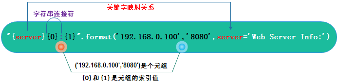

# Python 学习笔记

## 标识符

`Python` 的标识符严格区分大小写

单下划线(`_`)开头的标识符：不能直接访问，也不能通过 `import` 语句导入

双下划线(`__`)开头的标识符: 表示私有

双下划线开头和结尾：Python专用表示，例如：`__init__()`表示类的构造函数

## 注释

\# 其作用是注释或者临时禁用一段代码

多行注释就是每行放一个 `#` 或者 `""""""` 

```python
# 这里的 # 号后面的不是注释，因为该 # 号在引号中间，解释器将它看做字符串的一部分
print("dddd # gfggg")

"""
多行注释
"""
```

## 基本数据类型

### 数字类型

数字类型是不可变类型，如果修改数字类型变量的值，那么Python解析器会先把该值保存到内存，然后修改变量让其指向新的内存地址

Python的数字类型有：整数、浮点数、复数

数字类型是不允许改变的,这就意味着如果改变数字数据类型的值，将重新分配内存空间

#### 整数 (int)

整数是用来表示整数数值的

`Python`的整数可以保存**任意长度**的数值

八进制数：以`0o`/`0O`开头的数

十六进制数：以`0x`/`0X`开头的数

二进制数：有0和1组成的整数

#### 浮点数 (float)

浮点数有整数部分和小数部分组成

浮点型也可以使用科学计数法表示（2.5e2 = 2.5 x 10<sup>2</sup> = 250）

#### 复数 (complex)

复数由实数部分和虚数部分构成，可以用a + bj,或者complex(a,b)表示， 复数的实部a和虚部b都是浮点型

### 字符串类型

字符串可以使用 `''`、`""`、`''''''`、`""""""`  表示，字符串是不可变的

要显示原始字符串，即不被转移，需要在字符串前加上 `r` / `R`

```python
r'c:\ndflsdj'
r"ba3rlk\r"
```

字符串截取

```python
// 取去第2个
"hello world"[1]

// 截取除lo
"hello world"[3:5]
```

输出符号或者字母的ascii码

```python
ord('a')
```

#### b 表示的字符串

字符串前面加 `b` 表示该字符串是 `bytes` 类型

```python
s = b'aaa'
```

#### 合并字符串

合并字符串使用字符串对象的`join()`方法

```python
new_name = string.join(iterable)
# new_name: 合并后新字符串的名字
# string: 合并字符串用的分隔符
# iterable：可迭代对象

list = ['a', 'b', 'c']
print("#".join(list))
# a#b#c
```

#### 字符串常用方法

##### count()

`count()` 方法用于检索指定字符串在另一个字符串中出现的次数, 没有则返回0

```python
string.count(sub[, start[, end])
# string: 被查找的字符串
# sub: 要查找的子字符串
# start: 可选，表示检索的开始位置索引，不指定默认从头开始
# end: 可选，表示检索的结束位置索引，不指定默认一直查找到结尾
```

##### find()

`find()` 方法用于子字符串在原字符串中的位置，没找到则返回`-1`，找到则返回子字符串首次出现的位置索引

```python
string.find(sub[, start[, end])
# string: 被查找的字符串
# sub: 要查找的子字符串
# start: 可选，表示检索的开始位置索引，不指定默认从头开始
# end: 可选，表示检索的结束位置索引，不指定默认一直查找到结尾
        
# 从右侧开始查找，即返回子字符串在原字符串中的最大的索引位置
# 如果没找到则返回 -1
rfind(r, sub[, start[, end])
```

##### index()

`index()` 方法用于子字符串在原字符串中的位置，没找到则会抛出`ValueError`异常，找到则返回子字符串首次出现的位置索引

```python
string.index(sub[, start[, end])
# string: 被查找的字符串
# sub: 要查找的子字符串
# start: 可选，表示检索的开始位置索引，不指定默认从头开始
# end: 可选，表示检索的结束位置索引，不指定默认一直查找到结尾
```

##### startswith()

`startswith()` 方法用于判断字符串是否以指定的字符串开头，是`True`，不是`False`

```python
string.startswith(prefix[, start[, end]])
# string: 被查找的字符串
# prefix: 要查找的子字符串
# start: 可选，表示检索的开始位置索引，不指定默认从头开始
# end: 可选，表示检索的结束位置索引，不指定默认一直查找到结尾
```

##### endswith()

`endswith()` 方法用于判断字符串是否以指定的字符串开头，是`True`，不是`False`

```python
string.endswith(suffix[, start[, end]])
# string: 被查找的字符串
# suffix: 要查找的子字符串
# start: 可选，表示检索的开始位置索引，不指定默认从头开始
# end: 可选，表示检索的结束位置索引，不指定默认一直查找到结尾
```

#### 字母大小写转换

```python
# 转换为小写
string.lower()
# 转换为大写
string.upper()
```

#### 取出字符串两边空格

`strip()` 去掉字符串两边的空格或者特殊字符

```python
string.strip([chars])
# chars：要去掉的收尾字符，可以是多个, "#."表示去掉收尾的 '#' 或者 '.'
# 例如："#lsdjflsd.#.".strip("#.")
# 输出: lsdjflsd
```

`lstrip()` 去掉字符串左侧的空格或者特殊字符

`rstrip()`去掉字符串右侧的空格或者特殊字符

#### 字符串格式化

字符串的格式化方法分为两种，分别为占位符`%` `format` `字面量格式化字符串(f-string)`

##### 占位符(%)

 

###### %d

```python
`age ``=` `29``print``(``"my age is %d"` `%``age)``#my age is 29`
```

###### %s

```python
`name ``=` `"makes"``print``(``"my name is %s"` `%``name)``#my name is makes`
```

###### %f

```python
`print``(``"%6.3f"` `%` `2.3``)``#2.300``print``(``"%f"` `%``2.3``)``#2.300000`
```

##### format方法

###### 位置映射


```python
print("{}:{}".format('192.168.0.100',8888))
# 192.168.0.100:8888
```

###### 关键字映射



```python
`print``(``"{server}{1}:{0}"``.``format``(``8888``,``'192.168.1.100'``,server``=``'Web Server Info :'``))``#Web Server Info :192.168.1.100:8888　　`
```

###### 元素访问


```python
`print``(``"{0[0]}.{0[1]}"``.``format``((``'baidu'``,``'com'``)))``#baidu.com　`
```

###### 填充对齐

1. ^、<、>分别是居中、左对齐、右对齐


```python
print("{0}*{1}={2:0>2}".format(3, 2 , 2 * 3))
#3*2=06
print("{:*^30}".format('centered'))
#***********centered***********
```

九九乘法表

```python
`for` `i ``in` `range``(``1``,``10``):``  ``a ``=` `1``  ``while` `a <``=` `i:``    ``print``(``"{0}*{1}={2:0>2}"``.``format``(a,i,a``*``i),end``=``"\t"``)``    ``a ``+``=``1``  ``print``()``  ` `"""``1*1=01 ``1*2=02 2*2=04 ``1*3=03 2*3=06 3*3=09 ``1*4=04 2*4=08 3*4=12 4*4=16 ``1*5=05 2*5=10 3*5=15 4*5=20 5*5=25 ``1*6=06 2*6=12 3*6=18 4*6=24 5*6=30 6*6=36 ``1*7=07 2*7=14 3*7=21 4*7=28 5*7=35 6*7=42 7*7=49 ``1*8=08 2*8=16 3*8=24 4*8=32 5*8=40 6*8=48 7*8=56 8*8=64 ``1*9=09 2*9=18 3*9=27 4*9=36 5*9=45 6*9=54 7*9=63 8*9=72 9*9=81 ``"""`
```

###### 精度设置


```python
`print``(``"{:.3f}"``.``format``(``2.1415``))``#2.142``print``(``"{:.10f}"``.``format``(``3.1415``))``#3.1415000000`
```

##### 字面量格式化字符串

字符串以 `f` 开头，后面跟着字符串，字符串中的表达式用大括号 `{}` 包起来，它会将变量或表达式计算后的值替换进去

```python
name = 'Runoob'
f'Hello {name}'  # 替换变量

f'{1+2}'         # 使用表达式
# '3'

w = {'name': 'Runoob', 'url': 'www.runoob.com'}
f'{w["name"]}: {w["url"]}'
# 'Runoob: www.runoob.com'
```

在 Python 3.8 的版本中可以使用 **=** 符号来拼接运算表达式与结果

```python
x = 1
print(f'{x+1=}')   # Python 3.8
# 'x+1=2'
```

### 布尔类型

布尔类型表示真(`True`)或者假(`False`)

`Python` 中布尔值也可转换为整型，`True`表示`1`，`False`表示`0`

`Python` 中所有对象都可以进行真值测试（比较运算），下面的情况比较运算结果为假(`False`)，其他情况结果为真:

- `False` or `None`
- 数值的零：0，0.0，虚数0
- 空序列：空字符串、空列表、空元祖、空字典
- 自定义类：`__bool__()` 方法返回 `False` 或者 `__len__()` 方法返回`0`

### 数据类型转换

数据类型的转换，只需要将数据类型作为函数名即可

以下几个内置的函数可以执行数据类型之间的转换。这些函数返回一个新的对象，表示转换的值。

| 函数                                                         | 描述                                                |
| :----------------------------------------------------------- | :-------------------------------------------------- |
| Int(x)                                                       | 将x转换为一个整数                                   |
| [float(x)](https://www.runoob.com/python3/python-func-float.html) | 将x转换到一个浮点数                                 |
| complex(real [,imag\])                                       | 创建一个复数                                        |
| [str(x)](https://www.runoob.com/python3/python-func-str.html) | 将对象 x 转换为字符串                               |
| [repr(x)](https://www.runoob.com/python3/python-func-repr.html) | 将对象 x 转换为表达式字符串                         |
| [eval(str)](https://www.runoob.com/python3/python-func-eval.html) | 用来计算在字符串中的有效Python表达式,并返回一个对象 |
| [tuple(s)](https://www.runoob.com/python3/python3-func-tuple.html) | 将序列 s 转换为一个元组                             |
| [list(s)](https://www.runoob.com/python3/python3-att-list-list.html) | 将序列 s 转换为一个列表                             |
| [set(s)](https://www.runoob.com/python3/python-func-set.html) | 转换为可变集合                                      |
| [dict(d)](https://www.runoob.com/python3/python-func-dict.html) | 创建一个字典。d 必须是一个 (key, value)元组序列。   |
| [frozenset(s)](https://www.runoob.com/python3/python-func-frozenset.html) | 转换为不可变集合                                    |
| [chr(x)](https://www.runoob.com/python3/python-func-chr.html) | 将一个整数转换为一个字符                            |
| [ord(x)](https://www.runoob.com/python3/python-func-ord.html) | 将一个字符转换为它的整数值                          |
| [hex(x)](https://www.runoob.com/python3/python-func-hex.html) | 将一个整数转换为一个十六进制字符串                  |
| [oct(x)](https://www.runoob.com/python3/python-func-oct.html) | 将一个整数转换为一个八进制字符串                    |

## 正则表达式

正则表达式是一个特殊的字符序列，它能方便的检查一个字符串是否与某种模式匹配

`Python` 提供 `re` 模块，实现正则表达式操作

### 正则表达式修饰符 - 可选标志

正则表达式可以包含一些可选标志修饰符来控制匹配的模式。修饰符被指定为一个可选的标志。多个标志可以通过按位 OR(|) 它们来指定。如 re.I | re.M 被设置成 I 和 M 标志：

| 修饰符 | 描述                                                         |
| :----- | :----------------------------------------------------------- |
| re.I   | 使匹配对大小写不敏感                                         |
| re.L   | 做本地化识别（locale-aware）匹配                             |
| re.M   | 多行匹配，影响 ^ 和 $                                        |
| re.S   | 使 . 匹配包括换行在内的所有字符                              |
| re.U   | 根据Unicode字符集解析字符。这个标志影响 \w, \W, \b, \B.      |
| re.X   | 该标志通过给予你更灵活的格式以便你将正则表达式写得更易于理解。 |

### re.match函数

`re.match` 尝试从字符串的起始位置匹配一个模式，如果在起始位置匹配成功则返回`Match`对象，否则返回`None`

**函数语法**：

```python
re.match(pattern, string, flags=0)
```

参数说明：

| 参数    | 描述                                                         |
| :------ | :----------------------------------------------------------- |
| pattern | 匹配的正则表达式                                             |
| string  | 要匹配的字符串。                                             |
| flags   | 标志位(标志修饰符)，用于控制正则表达式的匹配方式，如：是否区分大小写，多行匹配等等 |

可以使用group(num) 或 groups() 匹配对象函数来获取匹配表达式

| 匹配对象方法 | 描述                                                         |
| :----------- | :----------------------------------------------------------- |
| group(num=0) | 匹配的整个表达式的字符串，group() 可以一次输入多个组号，在这种情况下它将返回一个包含那些组所对应值的元组。 |
| groups()     | 返回一个包含所有小组字符串的元组，从 1 到 所含的小组号。     |

### re.search方法

`re.search` 扫描整个字符串并返回第一个成功的匹配（`Match`对象），否则返回None

语法：

```python
re.search(pattern, string, flags=0)
```

参数说明：

| 参数    | 描述                                                         |
| :------ | :----------------------------------------------------------- |
| pattern | 匹配的正则表达式                                             |
| string  | 要匹配的字符串。                                             |
| flags   | 标志位(标志修饰符)，用于控制正则表达式的匹配方式，如：是否区分大小写，多行匹配等等 |

可以使用group(num) 或 groups() 匹配对象函数来获取匹配表达式

| 匹配对象方法 | 描述                                                         |
| :----------- | :----------------------------------------------------------- |
| group(num=0) | 匹配的整个表达式的字符串，group() 可以一次输入多个组号，在这种情况下它将返回一个包含那些组所对应值的元组。 |
| groups()     | 返回一个包含所有小组字符串的元组，从 1 到 所含的小组号。     |

### re.findall()方法

在字符串中找到正则表达式所匹配的所有子串，并返回一个列表，如果没有找到匹配的，则返回空列表

**注意：** `match` 和 `search` 是匹配一次 `findall` 匹配所有

语法：

```python
re.findall(pattern, string, flags=0)
```

参数说明：

| 参数    | 描述                                                         |
| :------ | :----------------------------------------------------------- |
| pattern | 匹配的正则表达式                                             |
| string  | 要匹配的字符串。                                             |
| flags   | 标志位(标志修饰符)，用于控制正则表达式的匹配方式，如：是否区分大小写，多行匹配等等 |

### re.sub() 替换

`re.sub()`用于替换字符串中的匹配项

语法：

```python
re.sub(pattern, repl, string, count=0, flags=0)
```

参数：

- pattern : 正则中的模式字符串。
- repl : 替换的字符串，也可为一个函数。
- string : 要被查找替换的原始字符串。
- count : （可选）模式匹配后替换的最大次数，默认 0 表示替换所有的匹配。
- flags : （可选）编译时用的匹配模式，数字形式。

### re.split()

`re.split()` 方法按照能够匹配的子串将字符串分割后返回列表

```python
re.split(pattern, string[, maxsplit=0, flags=0])
```

参数：

| 参数     | 描述                                                         |
| :------- | :----------------------------------------------------------- |
| pattern  | 匹配的正则表达式                                             |
| string   | 要匹配的字符串。                                             |
| maxsplit | 分隔次数，maxsplit=1 分隔一次，默认为 0，不限制次数。        |
| flags    | 标志位，用于控制正则表达式的匹配方式，如：是否区分大小写，多行匹配等等 |

## 运算符

### 算术运算符

以下假设变量a为10，变量b为21：

| 运算符 | 描述                                            | 实例                      |
| :----- | :---------------------------------------------- | :------------------------ |
| +      | 加 - 两个对象相加                               | a + b 输出结果 31         |
| -      | 减 - 得到负数或是一个数减去另一个数             | a - b 输出结果 -11        |
| *      | 乘 - 两个数相乘或是返回一个被重复若干次的字符串 | a * b 输出结果 210        |
| /      | 除 - x 除以 y                                   | b / a 输出结果 2.1        |
| %      | 取模 - 返回除法的余数                           | b % a 输出结果 1          |
| **     | 幂 - 返回x的y次幂                               | a**b 为10的21次方         |
| //     | 取整除 - 向下取接近商的整数                     | `>>> 9//2 4 >>> -9//2 -5` |

### 比较运算符

以下假设变量a为10，变量b为20：

| 运算符 | 描述                                                         | 实例                  |
| :----- | :----------------------------------------------------------- | :-------------------- |
| ==     | 等于 - 比较对象是否相等                                      | (a == b) 返回 False。 |
| !=     | 不等于 - 比较两个对象是否不相等                              | (a != b) 返回 True。  |
| >      | 大于 - 返回x是否大于y                                        | (a > b) 返回 False。  |
| <      | 小于 - 返回x是否小于y。所有比较运算符返回1表示真，返回0表示假。这分别与特殊的变量True和False等价。注意，这些变量名的大写。 | (a < b) 返回 True。   |
| >=     | 大于等于 - 返回x是否大于等于y。                              | (a >= b) 返回 False。 |
| <=     | 小于等于 - 返回x是否小于等于y。                              | (a <= b) 返回 True。  |

### 赋值运算符

以下假设变量a为10，变量b为20：

| 运算符 | 描述                                                         | 实例                                                         |
| :----- | :----------------------------------------------------------- | :----------------------------------------------------------- |
| =      | 简单的赋值运算符                                             | c = a + b 将 a + b 的运算结果赋值为 c                        |
| +=     | 加法赋值运算符                                               | c += a 等效于 c = c + a                                      |
| -=     | 减法赋值运算符                                               | c -= a 等效于 c = c - a                                      |
| *=     | 乘法赋值运算符                                               | c *= a 等效于 c = c * a                                      |
| /=     | 除法赋值运算符                                               | c /= a 等效于 c = c / a                                      |
| %=     | 取模赋值运算符                                               | c %= a 等效于 c = c % a                                      |
| **=    | 幂赋值运算符                                                 | c \**= a 等效于 c = c ** a                                   |
| //=    | 取整除赋值运算符                                             | c //= a 等效于 c = c // a                                    |
| :=     | 海象运算符，可在表达式内部为变量赋值。**Python3.8 版本新增运算符**。 | 在这个示例中，赋值表达式可以避免调用 len() 两次:`if (n := len(a)) > 10:    print(f"List is too long ({n} elements, expected <= 10)")` |

### 逻辑运算符

假设变量 a 为 10, b为 20:

| 运算符 | 逻辑表达式 | 描述                                                         | 实例                    |
| :----- | :--------- | :----------------------------------------------------------- | :---------------------- |
| and    | x and y    | 布尔"与" - 如果 x 为 False，x and y 返回 False，否则它返回 y 的计算值。 | (a and b) 返回 20。     |
| or     | x or y     | 布尔"或" - 如果 x 是 True，它返回 x 的值，否则它返回 y 的计算值。 | (a or b) 返回 10。      |
| not    | not x      | 布尔"非" - 如果 x 为 True，返回 False 。如果 x 为 False，它返回 True。 | not(a and b) 返回 False |

### 成员运算符

成员运算符，测试实例中包含了一系列的成员，包括字符串，列表或元组。

| 运算符 | 描述                                                    | 实例                                              |
| :----- | :------------------------------------------------------ | :------------------------------------------------ |
| in     | 如果在指定的序列中找到值返回 True，否则返回 False。     | x 在 y 序列中 , 如果 x 在 y 序列中返回 True。     |
| not in | 如果在指定的序列中没有找到值返回 True，否则返回 False。 | x 不在 y 序列中 , 如果 x 不在 y 序列中返回 True。 |

### 身份运算符

身份运算符用于比较两个对象的存储单元

| 运算符 | 描述                                        | 实例                                                         |
| :----- | :------------------------------------------ | :----------------------------------------------------------- |
| is     | is 是判断两个标识符是不是引用自一个对象     | **x is y**, 类似 **id(x) == id(y)** , 如果引用的是同一个对象则返回 True，否则返回 False |
| is not | is not 是判断两个标识符是不是引用自不同对象 | **x is not y** ， 类似 **id(a) != id(b)**。如果引用的不是同一个对象则返回结果 True，否则返回 False。 |

**注：** [id()](https://www.runoob.com/python/python-func-id.html) 函数用于获取对象内存地址

**`is` 用于判断两个变量引用对象是否为同一个，` ==` 用于判断引用变量的值是否相等**

### type

类型运算符，用户判断变量类型

```python
i = "aaa"
type(i)
# <class 'str'>
```

### is

身份运算符，比较两个变量地址是否相等

`not is` 两个变量地址是否不相等

```python
a is b
```

## 输入输出

### 接收键盘输入

使用 `input([prompt])` 方法接收用户输入内容，返回类型 `string` 

`[prompt]` 提示信息

```python
s = input()

# 接收用户输入并将内容转换为整型
age = int(input())

# 带提示信息
name = input("what is you are name: ")
```

### 输出到控制台

`print()` 函数将结果输出到标准控制台

```python
print(value, ..., sep=' ', end='\n', file=sys.stdout, flush=False)
```

## 条件控制(if)

if语句的关键字为：**if – elif – else**

if语句的一般形式如下所示：

```python
if condition_1:    
	statement_block_1 
elif condition_2:    
	statement_block_2 
else:    
	statement_block_3
```

**注意：**

- 1、每个条件后面要使用冒号 **:**，表示接下来是满足条件后要执行的语句块。

- 2、使用缩进来划分语句块，相同缩进数的语句在一起组成一个语句块。

- 3、在Python中没有switch – case语句。

### 条件表达式

```python
# 求绝对值
a = -2
if a > 0:
  b = a
else:
  a = -a
print(b)
# 2

# 条件表达式 - 求绝对值
a = -2
# 先计算中间的条件(a > 0)，如果为True则返回if左边的值，否则返回else右边的值
b = a if a > 0 else -a
```

## 循环语句(while)

`Python` 中的循环语句有 `for` 和 `while`

### while 循环

Python 中 while 语句的一般形式：

```python
while 判断条件(condition)：
    执行语句(statements)……
```

#### while 循环使用 else 语句

当 `while … else` 的条件语句为 `false` 时执行 `else` 的语句块

语法格式如下：

```python
while <expr>:
    <statement(s)>
else:
    <additional_statement(s)>
```

### for 语句

Python for循环可以遍历任何序列的项目，如一个列表或者一个字符串。

for循环的一般格式如下：

```python
for <variable> in <sequence>:
    <statements>
else:
    <statements>
```

### range()函数

```python
range(stop) -> range object
range(start, stop[, step]) -> range object
```

如果你需要遍历数字序列，可以使用内置range()函数。它会生成数列，例如:

```python
for i in range(3):
		print(i)
# 输出：0 - 2
```

你也可以使用range指定区间的值：

```python
for i in ragne(3, 6):
		print(i)
# 输出：3 - 5
```

也可以使range以指定数字开始并指定不同的增量(甚至可以是负数，有时这也叫做`步长`):

```python
for i in range(3, 9, 2):
		print(i)
# 输出：3，5，7
```

### break 和 continue 语句

#### break

语句可以跳出 for 和 while 的循环体。如果你从 for 或 while 循环中终止，任何对应的循环 else 块将不执行

#### continue

语句被用来告诉 Python 跳过当前循环块中的剩余语句，然后继续进行下一轮循环

### pass 语句

Python pass是空语句，是为了保持程序结构的完整性

pass 不做任何事情，一般用做占位语句

## sys

### argv

当我们需要在命令行执行脚本并需要在执行脚本的同时传入参数给脚本使用，那我们就可以使用到`argv`,`argv`是`sys`模块下的方法用于接收命令行传参，如下进行简单示例创建`demo.py`脚本计算两个数相加，且我们需要在命令行进行传参：

```python
from sys import argv  # 导入模块

# 如果执行的方式错误输出使用方法
USAGE = '''
用法错误，正确方式如下：
python demo.py one two
'''

# 判断argv的长度，如果脚本被直接执行(argv的值为当前脚本的路径)，如果执行命令是
# python demo.py 加两个参数(argv的长度就为3(以此类推))
if len(argv) != 3:  
    print(USAGE)  # 如果传入的参数不足，输出正确用法
    exit(1) # 异常退出(下面的代码将不会被执行)

script_name, one, two = argv  # 将传入的参数赋值进行使用

print(f'你执行的脚本是：{script_name},')  # 输出脚本名称
print(f'相加的结果是：{float(one) + float(two)}')  # 输出结果
```

## pydoc

`pydoc`是`Python`自带的模块，主要用于从python模块中自动生成文档，这些文档可以基于文本呈现的、也可以生成WEB页面

```bash
# 在8080端口启动一个帮助文档服务
pydoc -p 8080

# pydoc <name> 查看帮助文档
pydoc print
```

## 包与模块

包即文件夹，一个文件夹就是一个Python包

如果要让一个文件夹成为Python包，必须在该文件夹下创建文件: `__init__.py`

### 模块

一个扩展名是`.py`的文件就是一个模块。模块可以被别的程序引入，以使用该模块中的函数等功能

一个模块只会被导入一次，不管你执行了多少次`import`

```python
import 模块名/包名.模块名
# 为导入的模块起个别名
import 模块名 as 别名
from 模块 import 方法/函数/类

# 把一个模块的所有内容全都导入到当前的命名空间
from modname import *
```

每个模块都有一个`__name__`属性，当其值是`__main__`时，表明该模块自身在运行，否则是被引入

```python
if __name__ == "__main__":
	print("程序在执行")
```

## 进制间转换

转换为2进制

```python
bin(9)
```

转换为8进制

```python
oct(0x888)
```

转换为10进制

```python
int(0b22)
```

转换为16进制

```python
hex(888)
```

## 列表(list)

创建一个列表，只要把逗号分隔的不同的数据项使用方括号括起来即可

```python
list1 = ['Google', 'Runoob', 1997, 2000] 
list2 = [1, 2, 3, 4, 5 ] 
list3 = ["a", "b", "c", "d"]
```

### 访问列表中的值

与字符串的索引一样，列表索引从0开始。列表可以进行截取、组合等

列表的索引也可以是负数，从右向左计数，最后一个元素的索引是`-1`

```python
list1 = ['Google', 'Runoob', 1997, 2000]
list2 = [1, 2, 3, 4, 5, 6, 7 ]
 
print ("list1[0]: ", list1[0])

# 输出: 2, 3, 4, 5
print ("list2[1:5]: ", list2[1:5])

# 取出列表最后一个元素
list1[-1]
```

### 更新列表

```python
list1 = ['Google', 'Runoob', 1997, 2000]
list1[2] = 1996
```

### 删除列表元素

可以使用 del 语句来删除列表的的元素

```python
list = ['Google', 'Runoob', 1997, 2000]
# 删除第三个元素
del list[2]
```

### 切片

切片可访问范围内的元素，并最终返回一个新的序列

```python
sname = [start:end:step]
```

- sname: 序列名称
- start: 表示切片开始位置，不指定默认是0
- end: 表示切片结束位置，不指定默认是序列的长度
- step: 表示切片的步长，不指定则默认是1，如果step省略则最后一个冒号也可省略

### 列表操作符

`+` 号用于组合列表，`*` 号用于重复列表

| Python 表达式                         | 结果                         | 描述                 |
| :------------------------------------ | :--------------------------- | :------------------- |
| len([1, 2, 3])                        | 3                            | 长度                 |
| [1, 2, 3] + [4, 5, 6]                 | [1, 2, 3, 4, 5, 6]           | 组合                 |
| ['Hi!'] * 4                           | ['Hi!', 'Hi!', 'Hi!', 'Hi!'] | 重复                 |
| 3 in [1, 2, 3]                        | True                         | 元素是否存在于列表中 |
| for x in [1, 2, 3]: print(x, end=" ") | 1 2 3                        | 迭代                 |

### 列表截取与拼接

Python的列表截取与字符串操作类型，如下所示：

`L=['Google', 'Runoob', 'Taobao']`

| Python 表达式 | 结果                 | 描述                                               |
| :------------ | :------------------- | :------------------------------------------------- |
| L[2]          | 'Taobao'             | 读取第三个元素                                     |
| L[-2]         | 'Runoob'             | 从右侧开始读取倒数第二个元素: count from the right |
| L[1:]         | ['Runoob', 'Taobao'] | 输出从第二个元素开始后的所有元素                   |

### 列表函数&方法

Python包含以下函数:

| 序号 | 函数                                                         |
| :--- | :----------------------------------------------------------- |
| 1    | [len(list)](https://www.runoob.com/python3/python3-att-list-len.html) 列表元素个数 |
| 2    | [max(list)](https://www.runoob.com/python3/python3-att-list-max.html) 返回列表元素最大值 |
| 3    | [min(list)](https://www.runoob.com/python3/python3-att-list-min.html) 返回列表元素最小值 |
| 4    | [list(seq)](https://www.runoob.com/python3/python3-att-list-list.html) 将元组转换为列表 |

Python包含以下方法:

| 序号 | 方法                                                         |
| :--- | :----------------------------------------------------------- |
| 1    | [list.append(obj)](https://www.runoob.com/python3/python3-att-list-append.html) 在列表末尾添加新的对象 |
| 2    | [list.count(obj)](https://www.runoob.com/python3/python3-att-list-count.html) 统计某个元素在列表中出现的次数 |
| 3    | [list.extend(seq)](https://www.runoob.com/python3/python3-att-list-extend.html) 在列表末尾一次性追加另一个序列中的多个值（用新列表扩展原来的列表） |
| 4    | [list.index(obj)](https://www.runoob.com/python3/python3-att-list-index.html) 从列表中找出某个值第一个匹配项的索引位置 |
| 5    | [list.insert(index, obj)](https://www.runoob.com/python3/python3-att-list-insert.html) 将对象插入列表 |
| 6    | [list.pop([index=-1])](https://www.runoob.com/python3/python3-att-list-pop.html)移除列表中的一个元素（默认最后一个元素），并且返回该元素的值 |
| 7    | [list.remove(obj)](https://www.runoob.com/python3/python3-att-list-remove.html) 移除列表中某个值的第一个匹配项 |
| 8    | [list.reverse()](https://www.runoob.com/python3/python3-att-list-reverse.html) 反向列表中元素 |
| 9    | [list.sort( key=None, reverse=False)](https://www.runoob.com/python3/python3-att-list-sort.html) 对原列表进行排序 |
| 10   | [list.clear()](https://www.runoob.com/python3/python3-att-list-clear.html) 清空列表 |
| 11   | [list.copy()](https://www.runoob.com/python3/python3-att-list-copy.html) 复制列表 |

### 列表推导式

一种十分优雅的创建列表方式，Python的列表推导式允许我们使用非常少的代码并使用循环创建列表

```python
[expr for value in collection]
[expr for value in collection ifcondition]

# 相当于下面代码
# result = [] 
# for value in collection: 
#     if condition: 
#         result.append(expression) 
```

```python
names = ['Bob','Tom','alice','Jerry','Wendy','Smith'] 
new_names = [name.upper() for name in names if len(name)>3] 
```

#### 字典推导式

把一个字典的key和value互换：

```python
dict1 = {'s1': 'a ', 's2': 'b', 's3': 'c'}
changed = {value: key for key, value in dict1.items()}
print(changed)
# =======运行结果
# {'a ': 's1', 'b': 's2', 'c': 's3'}
```

#### 集合推导式

跟列表推导式不同的是列表是[]，集合是{},集合中不允许有重复数据

```python
# 集合推导式
s = {x**2 for x in [1, 1, 2]}
print(s) # {1, 4}
print(type(s)) # <class 'set'>

# 列表推导式
s1 = [x ** 2 for x in [1, 1, 2]]
print(s1) # [1, 1, 4]
print(type(s1)) # <class 'list'>
```

## 元组(tuple)

Python 的元组与列表类似，不同之处在于元组的元素不能修改。

元组使用小括号，列表使用方括号。

```python
tup1 = ('Google', 'Runoob', 1997, 2000)
tup3 = "a", "b", "c", "d"   #  不需要括号也可以

# 创建空元组
tup1 = ()
```

元组中只包含一个元素时，需要在元素后面添加逗号，否则括号会被当作运算符使用：

```python
>>>tup1 = (50)
>>> type(tup1)     # 不加逗号，类型为整型
<class 'int'>
 
>>> tup1 = (50,)
>>> type(tup1)     # 加上逗号，类型为元组
<class 'tuple'>
```

### 访问元组

元组可以使用下标索引来访问元组中的值

### 修改元组

元组中的元素值是不允许修改的，但我们可以对元组进行连接组合

```python
tup1 = (12, 34.56)
tup2 = ('abc', 'xyz')
 
# 以下修改元组元素操作是非法的。
# tup1[0] = 100
 
# 创建一个新的元组
tup3 = tup1 + tup2
print (tup3)

# 输出：(12, 34.56, 'abc', 'xyz')
```

## 集合(set)

集合（set）是一个无序的不重复元素序列。

集合不能进行索引、切片、相加等操作

可以使用大括号 **{ }** 或者 **set()** 函数创建集合，注意：创建一个空集合必须用 **set()** 而不是 **{ }**，因为 **{ }** 是用来创建一个空字典

创建格式：

```python
parame = {value01,value02,...}
或者
set(value)
```

### 基本操作

#### 添加元素

```python
s.add( x )
```

将元素 x 添加到集合 s 中，如果元素已存在，则不进行任何操作。

还有一个方法，也可以添加元素，且参数可以是列表，元组，字典等，语法格式如下：

```python
# x 可以有多个，用逗号分开
s.update( x )
```

#### 移除元素

```python
s.remove( x )
```

将元素 x 从集合 s 中移除，如果元素不存在，则会发生错误

此外还有一个方法也是移除集合中的元素，且如果元素不存在，不会发生错误：

```python
s.discard( x )
```

随机删除集合中的一个元素并返回该值：

```python
s.pop() 
```

## 字典(dict)

字典是一种可变容器模型，且可存储任意类型对象。

字典的每个键值(key=>value)对用冒号(**:**)分割，每个对之间用逗号(**,**)分割，整个字典包括在花括号(**{})**中 ：

```python
d = {key1 : value1, key2 : value2 }

# 空字典
f = {}
```

键必须是唯一的，但值则不必。

值可以取任何数据类型，但键必须是不可变的，如字符串，数字或元组

### 访问字典里的值

把相应的键放入到方括号`[]`中:

```python
dict = {'Name': 'Runoob', 'Age': 7, 'Class': 'First'}
 
# 如果访问的 key 不存在，则报错
print ("dict['Name']: ", dict['Name'])
print ("dict['Age']: ", dict['Age'])

# 返回指定键的值，如果键不存在返回 default 设置的默认值
age = dict.get("Age", default = None)
```

如果用字典里没有的键访问数据，会输出错误如下：

```python
Traceback (most recent call last):
  File "test.py", line 5, in <module>
    print ("dict['Alice']: ", dict['Alice'])
KeyError: 'Alice'
```

### 修改字典

向字典添加新内容的方法是增加新的键/值对，修改或删除已有键/值对如下实例:

```python
dict = {'Name': 'Runoob', 'Age': 7, 'Class': 'First'}

# 修改
dict['Age'] = 8

# 新增
dict['School'] = "菜鸟教程"

# 删除键 'Name'
del dict['Name']

# 清空字典
dict.clear()

# 删除字典
del dict
```

## 生成器和迭代器

### 判断对象是否可迭代

编译器若想迭代一个对象a，则会自动调用`iter(a)`获取该对象的迭代器(iterator)，如果`iter(a)`抛出异常，则对象a不可迭代

原生函数iter(instance) 可以判断某个对象是否可迭代，它的工作流程大概分为以下3个步骤：

- 检查对象instance是否实现了`__iter__`方法，并调用它获取返回的迭代器(iterator)
- 如果对象没有实现`__iter__`方法，但是实现了`__getitem__`方法，Python会生成一个迭代器
- 如果上述都失败，则编译器则抛出TypeError错误，`‘xxx' Object is not iterable`

```python
# 自定义类实现 __iter__ 方法
class MyClass(object):
    def __init__(self, str):
        self.str = str

    def __iter__(self):
        return iter(self.str)

c = MyClass("abcdefd")
for s in c:
    print(s)

# 自定义类实现 __getitem__ 方法
class MyClass(object):
    def __init__(self, seq):
        self.seq = seq

    def __getitem__(self, i):
        return self.seq[i]

c = MyClass(['a', 'b', 'c', 'd'])
for s in c:
    print(s)
```

### 迭代器

迭代器是个迭代值生产工厂，它保存迭代状态，并通过next()函数产生下一个迭代值。实现迭代器需要实现以下两个方法：

1. \__iter__: 
2. \__next__ :  返回下一个可用的元素，如果无可用元素则抛出`StopIteration`异常

```python
s = "abcdef"
i = iter(s)
while True:
    try:
        print(next(i))
    except StopIteration:
        break
```

StopIteration异常将在迭代器耗尽后被抛出

### 生成器

#### 生成器函数

生成器是一个用简单的方式来完成迭代。简单来说，Python的生成器是一个返回可以迭代对象的函数

包含`yield`关键字的函数称为`生成器函数`

`yield`会保存当前函数的执行状态，在返回后，函数又回到之前保存的状态继续执行

```python
def test():
    yield 1
    yield 2
    yield 3

g = test()
print('来自函数',g)
print(next(g))
print(g.__next__())
 
# 运行结果
# 来自函数 <generator object test at 0x000000000072B8E0>
# 1
# 2 
```

#### 生成器表达式

生成器表达式(generator expression)返回得到的生成器

```python
g = (i ** 2 for i in [1, 2, 3])
```

## 函数

### 定义函数

你可以定义一个由自己想要功能的函数，以下是简单的规则：

- 函数代码块以 **def** 关键词开头，后接函数标识符名称和圆括号 **()**。
- 任何传入参数和自变量必须放在圆括号中间，圆括号之间可以用于定义参数。
- 函数的第一行语句可以选择性地使用文档字符串—用于存放函数说明。
- 函数内容以冒号起始，并且缩进。
- **return [value]** 结束函数，选择性地返回一个值给调用方。不带表达式的return相当于返回 None。

------

**语法**

`Python` 定义函数使用 `def` 关键字

```python
def 函数名(参数列表):
    函数体
```

### 参数传递

`python` 中，`strings`,` tuples`, 和 `numbers` 是不可更改的对象，而 `list`, `dict` 等则是可以修改的对象

- **不可变类型：** 值传递
- **可变类型：** 引用传递

#### 位置参数

位置参数须以正确的顺序传入函数。调用时的数量必须和声明时的一样

#### 关键字参数

使用关键字参数允许函数调用时参数的顺序与声明时不一致，因为 Python 解释器能够用参数名匹配参数值

```python
def printinfo( name, age ):
   "打印任何传入的字符串"
   print ("名字: ", name)
   print ("年龄: ", age)
   return
 
#调用printinfo函数
printinfo( age=50, name="runoob" )
```

### 默认参数

调用函数时，如果没有传递参数，则会使用默认参数

**如果参数默认值为可变对象，则可能导致bug**

```python
def printinfo( name, age = 35 ):
   "打印任何传入的字符串"
   print ("名字: ", name)
   print ("年龄: ", age)
   return
 
#调用printinfo函数
printinfo( age=50, name="runoob" )
print ("------------------------")
printinfo( name="runoob" )
```

### 可变参数

传入的参数可以是任意多个

#### *param

接收任意多个参数并放在一个元组中

```python
def printinfo( arg1, *vartuple ):
   "打印任何传入的参数"
   print ("输出: ")
   print (arg1)
   print (vartuple)
 
# 调用printinfo 函数
printinfo( 70, 60, 50 )

# 输出
# 70
# (60, 50)
```

如果使用一个列表、元组等作为参数调用，则可在参数前加`*`（即解包）

```python
def demo(*param):
    print(f"参数长度: {len(param)}")
    for i in param:
        print(i)

p = ["a", "b", "c"]
demo(*p)
```

#### **param

接收`key=value`字典形式的参数

```python
def printinfo(arg1, **vardict):
   "打印任何传入的参数"
   print ("输出: ")
   print (arg1)
   print (vardict)
 
# 调用printinfo 函数
printinfo(1, a=2,b=3)

# 字典对象需要解包，即在参数前加**
d = {c = "a", d = "dd"}
printinfo("c1", **d)
```

### return语句

`return` 语句用于退出函数。不带参数值的`return`语句或者省略`return`都返回`None`

```python
# value: 可选参数，指定需要返回的值，也可返回多个值
return [value]
```

### 匿名函数

`python` 使用 `lambda` 来创建匿名函数（没有名字的函数）

**语法**

`lambda` 函数的语法只包含一个语句

```python
result = lambda [arg1 [,arg2,.....argn]]:expression
# result: 用于调用 lambda 表达式
# [arg1 [,arg2,.....argn]]: 可选参数, 指定用于传递的参数列表，多个参数用逗号(,)分割
# expression: 必选，一个表达式，
```

```python
sum = lambda arg1, arg2: arg1 + arg2
# 计算圆面积
result = lambda r:math.pi * r * r
 
# 调用sum函数
print ("相加后的值为 : ", sum( 10, 20 ))

# 输出：30
```

## 类

大多数情况下都可以使用组合取代或者简化继承

**尽可能的不要使用多重继承**

类方法最少必须有一个参数，一般默认取名`self`，调用时由解释器传递，其值是当前对象

### 类定义

```
class ClassName(父类):
    <statement-1>
    .
    .
    .
    <statement-N>
```

```python
class MyClass:
    """一个简单的类实例"""
    i = 12345
    def f(self):
        return 'hello world'
 
# 实例化类
x = MyClass()
 
# 访问类的属性和方法
print("MyClass 类的属性 i 为：", x.i)
print("MyClass 类的方法 f 输出为：", x.f())
```

#### \__init__()

类有一个名为 `__init__()` 的特殊方法（**构造方法**），该方法在类实例化后会自动调用

 `__init__()` 方法可以有参数，参数通过 `__init__()` 传递到类的实例化操作上

```python
class Complex:
    def __init__(self, realpart, imagpart):
        self.r = realpart
        self.i = imagpart
x = Complex(3.0, -4.5)
print(x.r, x.i)   # 输出结果：3.0 -4.5
```

### self代表类的实例，而非类

类的方法与普通的函数只有一个区别——它们必须有一个额外的**第一个参数名称**, 按照惯例它的名称是 `self`

```python
class Test:
    def prt(self):
        print(self)
        print(self.__class__)
 
t = Test()
t.prt()
```

### 继承

`继承`指明一个类的大部分或者全部功能都是从父类获得

```
class DerivedClassName(BaseClassName1):
    <statement-1>
    .
    <statement-N>
```

如果基类定义在别的模块中：

```
class DerivedClassName(模块名称.BaseClassName):
		<statement-1>
    .
    <statement-N>
```

子类调用父类方法

```python
class BaseClass(object):
  def __init__(self):
    pass
  def test(self):
    pass
  
class MyClass(BaseClass):
  def __init__(self):
    # 调用父类的 __init__() 方法
    super().__init__()
    pass
  def aa(self):
    # 调用父类方法
    super().test()
```

子类调用父类 `__init__()` 方法

```python
super().__init__()
```


### 多重继承

```
class DerivedClassName(Base1, Base2, Base3):
    <statement-1>
    .
    .
    .
    <statement-N>
```

**若是父类中有相同的方法名，而在子类使用时未指定，python从左至右搜索 即方法在子类中未找到时，从左到右查找父类中是否包含方法**

### 类属性与方法

#### 类的私有属性

**__private_attrs**：两个下划线开头，声明该属性为私有，不能在类的外部被使用或直接访问

**_private_attrs**：一个下划线开头的为保护类型，只能子类和类本身使用，不能使用`import`导入

**\__name__**: 首尾双下划线是系统定义

#### 计算属性

通过`@property`（装饰器）将一个方法转换为属性，将方法转换为属性后，可直接通过方法名称直接访问，不需要添加小括号`()`

`@property`（装饰器）转换的属性不能修改（只读）

```python
class Rect:
  def __init__(self, width, height):
    self.width = width
    self.height = height
  @property
  def area(self)
  	return self.width * self.height

r = Rect(100, 200)
print(r.area)
```

#### @属性名称.setter

该装饰器允许你对已用`@property`装饰的属性（函数）赋值

`setter`装饰器必须在`property`的后面，且两个被修饰的属性（函数）名称必须保持一致

```python
class Dog:
    def __init__(self,name,age):
        self.__name = name
        self.__age = age
    @property
    def age(self):
        return self.__age
    @age.setter
    def age(self,age):
        self.__age = age
    @property
    def name(self):
        return self.__name
    @name.setter
    def name(self,name):
        self.__name = name

d = Dog('天道',20)
d.name = '修罗道'
d.age = 50
print(d.name,d.age)
```

#### 类的方法

在类的内部，使用 `def` 关键字来定义一个方法，与一般函数定义不同，类方法必须包含参数 **self**，且为第一个参数，**self** 代表的是类的实例。

**self** 的名字并不是规定死的，也可以使用 **this**，但是最好还是按照约定是用 **self**。

#### 类的私有方法

**__private_method**：两个下划线开头，声明该方法为私有方法，只能在类的内部调用

#### 类的专有方法

- **\__init__ :** 构造函数，在生成对象时调用
- **\__del__ :** 析构函数，释放对象时使用
- **\__repr__ :** 打印，转换
- **\__setitem__ :** 按照索引赋值
- **\__getitem__:** 按照索引获取值
- **\__len__:** 获得长度
- **\__cmp__:** 比较运算
- **\__call__:** 函数调用
- **\__add__:** 加运算
- **\__sub__:** 减运算
- **\__mul__:** 乘运算
- **\__truediv__:** 除运算
- **\__mod__:** 求余运算
- **\__pow__:** 乘方

## 浅拷贝与深拷贝

在Python中对象的赋值其实就是对象的引用。当创建一个对象，把它赋值给另一个变量的时候，python并没有拷贝这个对象，只是拷贝了这个对象的引用而已。

- 浅拷贝： 浅拷贝值只拷贝一层，具有自己单独的内存地址，二层或其他层不拷贝，指向原有的内存地址。

- 深拷贝： 就是克隆一份，具有自己单独的内存地址，两者完全不相干设。

### 浅拷贝

1. a = b[:]

2. a = b.copy()

3. 引用copy模块，import copy  |  a = copy.copy(b)

浅拷贝原则：

1. 只复制一层，他变我不变，其余层，他变我也变
2. 如果只有一层，就相当于深复制了

```python
wife = ['diaoqian',1988,['slaras',10000]]
hasband = wife[:]
 
print(wife,hasband) # ['diaoqian', 1988, ['slaras', 10000]]    ['diaoqian', 1988, ['slaras', 10000]]
 
hasband[0] = 'zhaoyun'
hasband[2][1] = 2000
 
print(hasband)
# ['zhaoyun', 1988, ['slaras', 2000]]
print(wife)
# ['diaoqian', 1988, ['slaras', 2000]]
```

### 深拷贝

深度拷贝就是克隆一份，具有自己单独的内存地址，两者完全不相干设

深拷贝方法：
1、引用copy模块，import copy  |  a = copy.deepcopy(b)

```python
import copy
 
wife = ['diaoqian',1988,['slaras',10000]]
hasband = copy.deepcopy(wife)
 
print(wife,hasband)
# ['diaoqian', 1988, ['slaras', 10000]]   ['diaoqian', 1988, ['slaras', 10000]]
 
hasband[0] = 'zhaoyun'
hasband[2][1] = 8000
 
print(hasband)
# ['zhaoyun', 1988, ['slaras', 8000]]
print(wife)
# ['diaoqian', 1988, ['slaras', 10000]]
```

## 异常处理

### try/except

捕获并处理异常

```python
# except 后面不指定异常名称，则表示捕获全部异常
try:
	pass
except [异常名称 [as 别名]]:
	pass
```

一个`except`子句可以同时处理多个异常，这些异常将被放在一个括号里成为一个元组

```python
except (RuntimeError, TypeError, NameError):
    pass
```

### try/except...else

else 子句将在 try 子句没有发生任何异常的时候执行


### try/except...finally

`finally` 表示无论是否发生异常都将执行最后的代码


### raise 抛出异常

`Python` 使用 `raise` 语句抛出一个指定的异常

```python
raise [Exception [, args [, traceback]]]
```

Exception: 可选参数，指定抛出的异常名称及异常信息，如果省略就会把当前异常原样抛出

### 自定义异常

通过创建一个新的异常类来拥有自己的异常。异常类继承自 `Exception` 类，可以直接继承，或者间接继承

```python
class MyError(Exception):
  def __init__(self, value):
  	self.value = value
  def __str__(self):
  	return repr(self.value)
```

## 文件/文件夹操作

`open()` 方法用于打开一个文件，并返回文件对象

**注意：**使用 `open()` 方法一定要保证关闭文件对象，即调用 `close() `方法。

`open()` 函数常用形式是接收两个参数：文件名(file)和模式(mode)。

```python
open(file, mode='r')
```

完整的语法格式为：

```python
open(file, mode='r', buffering=-1, encoding=None, errors=None, newline=None, closefd=True, opener=None)
```

参数说明:

- file: 必需，文件路径（相对或者绝对路径）
- mode: 可选，文件打开模式
- buffering: 设置缓存（0：不缓存，1：默认缓存模式，大于1：缓存区大小）
- encoding: 一般使用utf-8
- errors: 报错级别
- newline: 区分换行符
- closefd: 传入的file参数类型
- opener:

mode 参数有：

| 模式 | 描述                                                         |
| :--- | :----------------------------------------------------------- |
| t    | 文本模式 (默认)。                                            |
| x    | 写模式，新建一个文件，如果该文件已存在则会报错。             |
| b    | 二进制模式。                                                 |
| +    | 打开一个文件进行更新(可读可写)。                             |
| r    | 以只读方式打开文件。文件的指针将会放在文件的开头。这是默认模式。**文件必须存在** |
| rb   | 以二进制格式打开一个文件用于只读。文件指针将会放在文件的开头。这是默认模式。一般用于非文本文件如图片等。 |
| r+   | 打开一个文件用于读写。文件指针将会放在文件的开头。           |
| rb+  | 以二进制格式打开一个文件用于读写。文件指针将会放在文件的开头。一般用于非文本文件如图片等。 |
| w    | 打开一个文件只用于写入。如果该文件已存在则打开文件，并从开头开始编辑，即原有内容会被删除。**如果该文件不存在，创建新文件** |
| wb   | 以二进制格式打开一个文件只用于写入。如果该文件已存在则打开文件，并从开头开始编辑，即原有内容会被删除。如果该文件不存在，创建新文件。一般用于非文本文件如图片等。 |
| w+   | 打开一个文件用于读写。如果该文件已存在则打开文件，并从开头开始编辑，即原有内容会被删除。如果该文件不存在，创建新文件。 |
| wb+  | 以二进制格式打开一个文件用于读写。如果该文件已存在则打开文件，并从开头开始编辑，即原有内容会被删除。如果该文件不存在，创建新文件。一般用于非文本文件如图片等。 |
| a    | 打开一个文件用于追加。如果该文件已存在，文件指针将会放在文件的结尾。也就是说，新的内容将会被写入到已有内容之后。**如果该文件不存在，创建新文件进行写入** |
| ab   | 以二进制格式打开一个文件用于追加。如果该文件已存在，文件指针将会放在文件的结尾。也就是说，新的内容将会被写入到已有内容之后。如果该文件不存在，创建新文件进行写入。 |
| a+   | 打开一个文件用于读写。如果该文件已存在，文件指针将会放在文件的结尾。文件打开时会是追加模式。如果该文件不存在，创建新文件用于读写。 |
| ab+  | 以二进制格式打开一个文件用于追加。如果该文件已存在，文件指针将会放在文件的结尾。如果该文件不存在，创建新文件用于读写。 |

默认为文本模式，如果要以二进制模式打开，加上 **b** 

### 打开文件时使用 with 语句

`with` 语句在处理文件时，无论是否发生异常，都能保证执行完成后关闭已打开的文件

```python
with expression as target:
	pass
```

`expression`: 表达式，可以是打开文件的 `open()` 函数

`target`: 变量，保存 `expreession` 的结果

```python
with open('test.txt') as file:
	pass
```

### 一行一行读取文件

```python
# 方法1
target = open("file.txt")
line = target.readline()
while line:
    print(line, end="")
    line = target.readline()

# 方法2
target = open("file.txt")
for line in target:
  print(line, end="")
```

## 进程和线程

### 多进程

Python的`os`模块封装了常见的系统调用，其中就包括`fork`，可以在Python程序中轻松创建子进程

```python
import os

print("进程 {} 开始...".format(os.getpid()))
pid = os.fork()
if pid == 0:
    print("我是子进程: {}, 我的父进程: {}".format(os.getpid(), os.getppid()))
else:
    print("我是父进程: {}, 我的子进程: {}".format(os.getpid(), pid))
```

`multiprocessing`模块是跨平台版本的多进程模块

`multiprocessing`模块提供了一个`Process`类来代表一个进程对象

```python
import multiprocessing
import os

def run_proc(name):
    print("子进程开始执行: {} - {}".format(name, os.getpid()))

if __name__ == "__main__":
    print("父进程开始执行: {}".format(os.getpid()))
    p = multiprocessing.Process(target=run_proc, args=("测试进程",))
    p.start()
    p.join()
    print("主进程执行完成")
```

创建子进程时，只需要传入一个执行函数和函数的参数，创建一个`Process`实例，用`start()`方法启动

`join()`方法可以等待子进程结束后再继续往下运行，通常用于进程间的同步

#### 进程池

如果要启动大量的子进程，可以用进程池的方式批量创建子进程

```python
from multiprocessing import Pool
import os, random, time

def run_proc(name):
    print("子进程 {} 开始执行: {}".format(name, os.getpid()))
    start = time.time()
    time.sleep(random.random() * 5)
    end = time.time()
    print("子进程 {} 耗时: {:0.2f}s".format(name, (end - start)))

if __name__ == "__main__":
    print("父进程开始执行: {}".format(os.getpid()))
    # 同时最多执行4个进程, 如果不指定则默认是CPU的核数
    p = Pool(4)
    for i in range(5):
        p.apply_async(run_proc, args=(i,))
    print("等待所有子进程执行完毕...")
    p.close()
    p.join()
    print("所有子进程执行完成")
```

对`Pool`对象调用`join()`方法会等待所有子进程执行完毕，调用`join()`之前必须先调用`close()`，调用`close()`之后就不能继续添加新的`Process`了

`Pool`的默认大小是CPU的核数

#### 进程间通信

`multiprocessing`模块提供了`Queue`、`Pipes`等多种方式来进行进程间通信

```python
from multiprocessing import Process, Queue
import os, random, time

def writer_proc(q: Queue):
    print("写进程开始执行: {}".format(os.getpid()))
    for v in ["a", "b", "c", "d"]:
        print("{} 写入到队列".format(v))
        q.put(v)
        time.sleep(random.random())

def read_proc(q: Queue):
    print("读进程开始执行: {}".format(os.getpid()))
    while True:
        value = q.get(True)
        print("从队列读取到: {}".format(value))

if __name__ == "__main__":
    print("父进程开始执行: {}".format(os.getpid()))
    # 父进程创建Queue，并传给各个子进程
    q = Queue()
    pw = Process(target=writer_proc, args=(q,))
    pr = Process(target=read_proc, args=(q,))
    pw.start()
    pr.start()
    pw.join()
    # pr进程里是死循环，无法等待其结束，只能强行终止
    pr.terminate()
```

#### 分布式进程

`Python`的`multiprocessing`模块不但支持多进程，其中`managers`子模块还支持把多进程分布到多台机器上。一个服务进程可以作为调度者，将任务分布到其他多个进程中，依靠网络通信

通过`managers`模块把`Queue`通过网络暴露出去，就可以让其他机器的进程访问`Queue`了。

服务进程负责启动`Queue`，把`Queue`注册到网络上，然后往`Queue`里面写入任务：

```python
import random, time, queue
from multiprocessing.managers import BaseManager

# 发送任务的队列:
task_queue = queue.Queue()
# 接收结果的队列:
result_queue = queue.Queue()

# 从BaseManager继承的QueueManager:
class QueueManager(BaseManager):
    pass

# 把两个Queue都注册到网络上, callable参数关联了Queue对象:
QueueManager.register('get_task_queue', callable=lambda: task_queue)
QueueManager.register('get_result_queue', callable=lambda: result_queue)
# 绑定端口5000, 设置验证码'abc':
manager = QueueManager(address=('', 5000), authkey=b'abc')
# 启动Queue:
manager.start()
# 获得通过网络访问的Queue对象:
task = manager.get_task_queue()
result = manager.get_result_queue()
# 放几个任务进去:
for i in range(10):
    n = random.randint(0, 10000)
    print('Put task %d...' % n)
    task.put(n)
# 从result队列读取结果:
print('Try get results...')
for i in range(10):
    r = result.get(timeout=10)
    print('Result: %s' % r)
# 关闭:
manager.shutdown()
print('master exit.')
```

然后，在另一台机器上启动任务进程（本机上启动也可以）：

```python
# task_worker.py

import time, sys, queue
from multiprocessing.managers import BaseManager

# 创建类似的QueueManager:
class QueueManager(BaseManager):
    pass

# 由于这个QueueManager只从网络上获取Queue，所以注册时只提供名字:
QueueManager.register('get_task_queue')
QueueManager.register('get_result_queue')

# 连接到服务器，也就是运行task_master.py的机器:
server_addr = '127.0.0.1'
print('Connect to server %s...' % server_addr)
# 端口和验证码注意保持与task_master.py设置的完全一致:
m = QueueManager(address=(server_addr, 5000), authkey=b'abc')
# 从网络连接:
m.connect()
# 获取Queue的对象:
task = m.get_task_queue()
result = m.get_result_queue()
# 从task队列取任务,并把结果写入result队列:
for i in range(10):
    try:
        n = task.get(timeout=1)
        print('run task %d * %d...' % (n, n))
        r = '%d * %d = %d' % (n, n, n*n)
        time.sleep(1)
        result.put(r)
    except Queue.Empty:
        print('task queue is empty.')
# 处理结束:
print('worker exit.')
```

这个简单的`Master/Worker`模型有什么用？其实这就是一个简单但真正的分布式计算，把代码稍加改造，启动多个worker，就可以把任务分布到几台甚至几十台机器上，比如把计算`n*n`的代码换成发送邮件，就实现了邮件队列的异步发送。

**注意**Queue的作用是用来传递任务和接收结果，每个任务的描述数据量要尽量小

### 多线程

#### 函数线程

调用 `threading` 模块中的 `start_new_thread()` 函数来产生新线程

```python
threading.start_new_thread ( function, args[, kwargs] )
```

参数说明:

- function - 线程函数。
- args - 传递给线程函数的参数,他必须是个tuple类型。
- kwargs - 可选参数。

```python
import threading as thread
import time

def test(name: str):
    for _ in range(10):
        time.sleep(1)
        currTime = time.strftime('%Y-%m-%d %H:%M:%S %A', time.localtime())
        print(f'{name} -> {currTime}')

thread._start_new_thread(test, ("xxx",))
thread._start_new_thread(test, ("yyy",))
while True:
    pass
```

使用`Thread`创建函数线程

```python
import threading
import time

def test(name: str):
    for _ in range(10):
        time.sleep(1)
        currTime = time.strftime('%Y-%m-%d %H:%M:%S %A', time.localtime())
        print(f'{name} -> {currTime}')

t = threading.Thread(target=test, args=("xxx",))
t.start()
t.join()
```

#### 使用 threading 模块创建线程

我们可以通过直接从 `threading.Thread` 继承创建一个新的子类，并实例化后调用 `start()` 方法启动新线程，即它调用了线程的 `run()` 方法

```python
import threading as thread
import time

class myThread(thread.Thread):
    def __init__(self, name: str):
        super().__init__()
        self.name = name
    def run(self):
        print(f'线程开始: {self.name}')
        test(self.name)
        print(f'线程结束: {self.name}')

def test(name: str):
    for _ in range(10):
        time.sleep(1)
        currTime = time.strftime('%Y-%m-%d %H:%M:%S', time.localtime())
        print(f'{name} -> {currTime}')

t1 = myThread("thread1")
t2 = myThread("thread2")
t1.start()
t2.start()
t1.join()
t2.join()

print("主线程结束")
```

#### 线程锁threading.RLock和threading.Lock

如果多个线程共同对某个数据修改，则可能出现不可预料的结果，为了保证数据的正确性，需要对线程进行同步

使用 `Thread` 对象的 `Lock` 和 `Rlock` 可以实现简单的线程同步，这两个对象都有 `acquire` 方法和 `release` 方法，对于那些需要每次只允许一个线程操作的数据，可以将其操作放到 `acquire` 和 `release` 方法之间

```python
threadLock = threading.Lock()
print ("开启线程： " + self.name)
# 获取锁，用于线程同步
threadLock.acquire()
try:
	print_time(self.name, self.counter, 3)
finally:
  # 释放锁
  threadLock.release()
```

#### 线程安全队列（ Queue）

`Python` 的 `Queue` 模块中提供了同步的、线程安全的队列类，包括FIFO（先入先出)队列Queue，LIFO（后入先出）队列`LifoQueue`，和优先级队列 `PriorityQueue`

这些队列都实现了锁原语，能够在多线程中直接使用，可以使用队列来实现线程间的同步。

Queue 模块中的常用方法:

- Queue.qsize() 返回队列的大小
- Queue.empty() 如果队列为空，返回True,反之False
- Queue.full() 如果队列满了，返回True,反之False
- Queue.full 与 maxsize 大小对应
- Queue.get([block[, timeout]])获取队列，timeout等待时间
- Queue.get_nowait() 相当Queue.get(False)
- Queue.put(item) 写入队列，timeout等待时间
- Queue.put_nowait(item) 相当Queue.put(item, False)
- Queue.task_done() 在完成一项工作之后，Queue.task_done()函数向任务已经完成的队列发送一个信号
- Queue.join() 实际上意味着等到队列为空，再执行别的操作

#### ThreadLocal

`ThreadLocal`变量虽然是全局变量，但每个线程都只能读写自己线程的独立副本，互不干扰。`ThreadLocal`解决了参数在一个线程中各个函数之间互相传递的问题

```python
import threading
    
# 创建全局ThreadLocal对象:
local_school = threading.local()

def process_student():
    # 获取当前线程关联的student:
    std = local_school.student
    print('Hello, %s (in %s)' % (std, threading.current_thread().name))

def process_thread(name):
    # 绑定ThreadLocal的student:
    local_school.student = name
    process_student()

t1 = threading.Thread(target= process_thread, args=('Alice',), name='Thread-A')
t2 = threading.Thread(target= process_thread, args=('Bob',), name='Thread-B')
t1.start()
t2.start()
t1.join()
t2.join()
```

执行结果：

```
Hello, Alice (in Thread-A)
Hello, Bob (in Thread-B)
```

全局变量`local_school`就是一个`ThreadLocal`对象，每个`Thread`对它都可以读写`student`属性，但互不影响。你可以把`local_school`看成全局变量，但每个属性如`local_school.student`都是线程的局部变量，可以任意读写而互不干扰，也不用管理锁的问题，`ThreadLocal`内部会处理。

可以理解为全局变量`local_school`是一个`dict`，不但可以用`local_school.student`，还可以绑定其他变量，如`local_school.teacher`等等。

`ThreadLocal`最常用的地方就是为每个线程绑定一个数据库连接，HTTP请求，用户身份信息等，这样一个线程的所有调用到的处理函数都可以非常方便地访问这些资源。

## 异步IO

`同步IO`: 遇到IO操作，如读写文件、发送网络数据时，就需要等待IO操作完成，才能继续进行下一步操作。这种情况称为同步IO

`异步IO`: 当代码需要执行一个耗时的IO操作时，它只发出IO指令，并不等待IO结果，然后就去执行其他代码了。一段时间后，当IO返回结果时，再通知CPU进行处理。

### 协程

协程，又称微线程，纤程。英文名Coroutine

`协程`是在同一个线程执行

协程看上去也是子程序，但执行过程中，在子程序内部可中断，然后转而执行别的子程序，在适当的时候再返回来接着执行

协程的优势：

1. 协程拥有极高的执行效率。因为子程序切换不是线程切换，而是由程序自身控制，因此，没有线程切换的开销，和多线程比，线程数量越多，协程的性能优势就越明显。
2. 不需要多线程的锁机制，因为只有一个线程，也不存在同时写变量冲突，在协程中控制共享资源不加锁，只需要判断状态就好了，所以执行效率比多线程高很多。

`Python`对协程的支持是通过 `generator` 实现的

#### 创建协程

协程通过 `async/await` 语法进行声明，是编写异步应用的推荐方式

`asyncio` 提供了以下三种方式运行协程:

1. [`asyncio.run()`](https://docs.python.org/zh-cn/3.7/library/asyncio-task.html#asyncio.run) 

   此函数运行传入的协程，负责管理 asyncio 事件循环并完结异步生成器

   当有其他 asyncio 事件循环在同一线程中运行时，此函数不能被调用

   ```python
   import asyncio
   import time
   
   async def say_after(delay, what):
       await asyncio.sleep(delay)
       print(what)
   
   async def main():
       print(f"started at {time.strftime('%X')}")
   
       await say_after(1, 'hello')
       await say_after(2, 'world')
   
       print(f"finished at {time.strftime('%X')}")
   
   asyncio.run(main())
   ```

2. [`asyncio.create_task()`](https://docs.python.org/zh-cn/3.7/library/asyncio-task.html#asyncio.create_task)

    函数用来并发运行 `asyncio` [`任务`](https://docs.python.org/zh-cn/3.7/library/asyncio-task.html#asyncio.Task) 的多个协程

   ```python
   import asyncio
   import time
   
   async def say_after(delay, what):
       await asyncio.sleep(delay)
       print(what)
   
   async def main():
       task1 = asyncio.create_task(say_after(1, 'hello'))
       task2 = asyncio.create_task(say_after(2, 'world'))
   
       print(f"started at {time.strftime('%X')}")
   
       # Wait until both tasks are completed (should take
       # around 2 seconds.)
       await task1
       await task2
   
       print(f"finished at {time.strftime('%X')}")
   
   asyncio.run(main()
   ```

#### asyncio.sleep(*delay*, *result=None*, ***, *loop=None*)

阻塞 *delay* 指定的秒数。

如果指定了 *result*，则当协程完成时将其返回给调用者。

`sleep()` 总是会挂起当前任务，以允许其他任务运行。

#### asyncio.gather(**aws*, *loop=None*, *return_exceptions=False*)

并发运行 `aws` 序列中的 [可等待对象](https://docs.python.org/zh-cn/3.7/library/asyncio-task.html#asyncio-awaitables)。

如果 `aws` 中的某个可等待对象为协程，它将自动作为一个任务加入日程。

如果所有可等待对象都成功完成，结果将是一个由所有返回值聚合而成的列表。结果值的顺序与 *aws* 中可等待对象的顺序一致。

```python
import asyncio

async def factorial(name, number):
    f = 1
    for i in range(2, number + 1):
        print(f"Task {name}: Compute factorial({i})...")
        await asyncio.sleep(1)
        f *= i
    print(f"Task {name}: factorial({number}) = {f}")

async def main():
    # Schedule three calls *concurrently*:
    await asyncio.gather(
        factorial("A", 2),
        factorial("B", 3),
        factorial("C", 4),
    )

asyncio.run(main())
```

#### asyncio.run_coroutine_threadsafe(*coro*, *loop*)

向指定事件循环提交一个协程。线程安全。

返回一个 [`concurrent.futures.Future`](https://docs.python.org/zh-cn/3.7/library/concurrent.futures.html#concurrent.futures.Future) 以等待来自其他 OS 线程的结果。

此函数应该从另一个 OS 线程中调用，而非事件循环运行所在线程

此方法是非阻塞的

可使用该方法动态给事件循环添加协程

```python
import threading
import asyncio
import random
import time

place_order_time_min = 1.1
place_order_time_max = 2.5

def get_curr_time():
    return time.strftime("%Y:%m:%d %H:%M:%S")

async def palce_order(type: str):
    while True:
        print("{} - xxx 开始 {} ...{}".format(get_curr_time(), type, threading.current_thread().getName()))
        await asyncio.sleep(random.uniform(1.1, 6.2))
        wait_time = random.uniform(place_order_time_min, place_order_time_max)
        print("{} - xxx {} 完成， 等待下次执行: {:.2f}".format(get_curr_time(), type, wait_time))
        await asyncio.sleep(wait_time)

def start_event_loop(event_loop):
  	"""
  	启动 asyncio 的事件循环
  	如果有新的协程任务，则使用 asyncio.run_coroutine_threadsafe 添加到该 事件循环
  	"""
    # event_loop = asyncio.new_event_loop()
    event_loop.run_forever()

if __name__ == "__main__":
    event_loop = asyncio.get_event_loop()
    th = threading.Thread(target=start_event_loop, args=(event_loop,))
    th.start()

    asyncio.run_coroutine_threadsafe(palce_order("buy"), asyncio.get_event_loop())

    asyncio.run_coroutine_threadsafe(palce_order("sell"), asyncio.get_event_loop())
    th.join()
```

也可以一次性添加多个协程到事件循环

```python
task = [
  asyncio.create_task(palce_order("buy")),
  asyncio.create_task(palce_order("sell"), name="abc")
]

asyncio.run_coroutine_threadsafe(asyncio.wait(task), asyncio.get_event_loop())
```

#### 取消协程事件

1. 返回事件循环运行的未完成的 [`Task`](https://docs.python.org/zh-cn/3/library/asyncio-task.html?highlight=asyncio#asyncio.Task) 对象的集合

   `asyncio.all_tasks(loop=None)`

   如果 *loop* 为 `None`，则会使用 [`get_running_loop()`](https://docs.python.org/zh-cn/3/library/asyncio-eventloop.html#asyncio.get_running_loop) 获取当前事件循环

   `asyncio.all_tasks(loop=asyncio.get_event_loop())`

2. 然后使用 Task 对象的 `task.cancel()` 方法取消协程