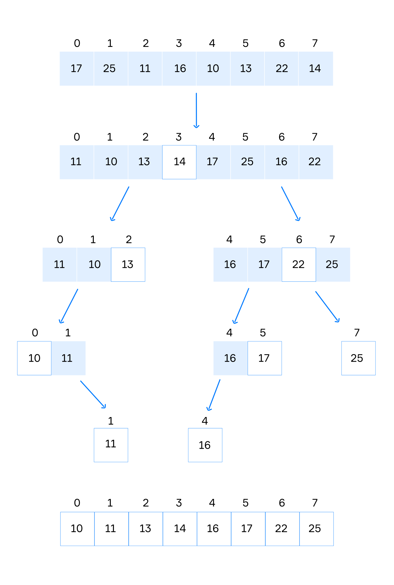

# 常用算法

## Quick sort 快速排序

**Quicksort**是一种高效的就地排序算法，他的计算复杂度是：O(n log n)

### 快速排序步骤

1. 从数组中选择一些元素，这些选择的元素我们叫：**pivot**（支点）
2. 对数组进行重新排序：将所有小于支点的值放在支点之前，所有大于支点的值放在支点之后，等于支点的值放在支点之前和之后都可
3. 递归排序子数组（小于支点的和大于支点的元素数组）
4. 终止条件：数组的大小等于0或者1

`Quicksort` 可以实现为递归或迭代算法，下面的是递归的实现

### 选择支点

选择支点比较复杂，下面是选择支点的方法

1. 选择数组的第一个或者最后一个元素作为支点
2. 选择数组中间的元素作为支点
3. 选择数组里面一个随机元素作为支点
4. 选择数组中第一个、中间、最后一个三个元素，然后使用这三个数的中间一个作为支点

最好的支点是：数组中元素值得中间值

### 示例

对一个包含8个整数的数组进行排序，我们选择最后一个元素作为支点，下图是快速排序的工作原理



快速排序递归实现(Kotlin)

```kotlin
/**
 * 使用 quick sort 进行升序排序
 * 使用递归实现
 */
fun quickSort(numList: List<Int>): List<Int> {
    if (numList.size <= 1) return numList

    val p = numList.last()
    val leftList = mutableListOf<Int>()
    val equalsList = mutableListOf<Int>()
    val rightList = mutableListOf<Int>()

    numList.forEach {
        when {
            it > p -> rightList.add(it)
            it < p -> leftList.add(it)
            else -> equalsList.add(it)
        }
    }

    return quickSort(leftList) + equalsList + quickSort(rightList)
}
```

## 哈希 - Hashing

### 概述

哈希是一种广泛用于编程的技术

#### 什么是哈希

哈希函数：可以用来将任意大小的数据映射为固定大小的值的函数

我们将对某些输入应用哈希函数的结果称为**哈希值**，简称**哈希**

**哈希碰撞**: 如果发生哈希值相同的情况，哈希碰撞是无法完全避免的

### Hash table

`hash table` 由 `hash key` 和 `hash value`构成，`hash value` 是任意大小的对象，`hash key` 是通过 `哈希函数` 将 `hash value` 转换为固定大小的值

使用 `hash table` 可以实现在 `O(1)` 复杂度下的搜索

**哈希表 hashtable**: 是一种将键映射到值的关联数组数据结构，哈希表组成：一个由哈希函数生成的`唯一key`，一个 `唯一key`映射的值

下面是一个简单的哈希表示例，它将学生唯一编码和学生姓名组成


#### 哈希函数

哈希函数用于将任意大小的输入转换为唯一值


一个好的哈希函数是：

- **有效：**在O(1)时间内计算所有输入大小的键
- **确定性的：**每次输入时都会为任何输入提供唯一的键输出
- **统一：**确保密钥均匀分布


